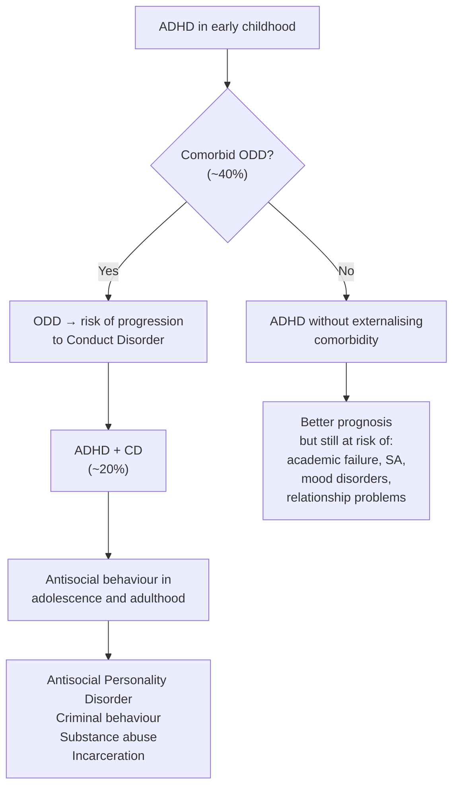

## Complications of ADHD

Complications of ADHD can be understood at two levels: **(1) complications of the disease itself** (untreated or undertreated ADHD leading to cascading functional impairment) and **(2) complications of treatment** (adverse effects of pharmacotherapy). Both are commonly tested and clinically important.

The overarching concept: ADHD is not just "fidgeting and daydreaming." It is a chronic neurodevelopmental condition whose consequences compound over time. The executive dysfunction at its core — impaired inhibition, working memory, planning, and delay tolerance — ripples outward to affect **every domain of life**. Think of it as a pebble dropped in a pond: the initial neurobiological deficit sends waves through academics, social relationships, self-esteem, family dynamics, occupation, and physical safety, growing wider with each developmental stage.

---

### 1. Complications of Untreated / Undertreated ADHD

The notes explicitly organise functional impairment by developmental stage [2]:

#### 1.1 Childhood Complications

> ***Childhood: behavioural problems, academic problems, difficulties with social interactions, poor self-esteem*** [2]

| Complication | Mechanism (From First Principles) | Details |
|---|---|---|
| **Academic underachievement** | Inattention → cannot sustain focus on instruction, reading, homework; impaired working memory → cannot hold multi-step instructions; impaired organisation → chaotic schoolwork; poor error monitoring → careless mistakes | ADHD children typically achieve 1–2 grade levels below their intellectual potential. This is NOT because they lack intelligence — it is because the "delivery system" (executive function) that translates ability into performance is impaired. ***Learning disorders occur with undue frequency*** [2] — when ADHD + LD co-exist, the academic impact is multiplicative. |
| **Behavioural problems** | Motor disinhibition → disruptive behaviour in class; impulsivity → rule-breaking without malicious intent; low frustration tolerance → anger outbursts | Teachers may interpret the child as "naughty" or "defiant," but the behaviour stems from ***impulsive flouting of social rules*** [2] rather than deliberate opposition (cf. ODD). Frequent reprimands and punishment → learned helplessness and resentment. |
| **Social difficulties and peer rejection** | Impulsivity → interrupts, intrudes, cannot take turns; hyperactivity → perceived as "annoying"; inattention → misses social cues, doesn't follow conversation flow; ***disinhibition in social relationships*** [2] → acts overly familiar | ADHD children are among the most socially rejected in the classroom. Peer rejection is one of the strongest predictors of poor long-term outcome. The tragedy: these children *want* to have friends but their executive dysfunction sabotages social interactions. |
| **Poor self-esteem** | Chronic academic failure + social rejection + frequent criticism from adults and peers → the child internalises a narrative of "I am stupid / bad / broken" | By school-age, many ADHD children have already developed significant self-esteem difficulties. This becomes a risk factor for later depression and anxiety. |
| ***Injuries*** | ***Recklessness in dangerous situations*** [2] → crosses roads without looking, climbs to dangerous heights, impulsive physical play; impaired risk assessment (vmPFC dysfunction) | ADHD children have **2–3 times** the rate of emergency department visits and accidental injuries compared to non-ADHD peers. This includes fractures, head injuries, burns, and poisoning. |

#### 1.2 Adolescent Complications

> ***Adolescence: above issues, legal issues, relationship problems, injuries*** [2]

| Complication | Mechanism | Details |
|---|---|---|
| **School dropout / academic failure** | Cumulative academic deficit from childhood + increasing cognitive demands in secondary school + worsening organisational burden (multiple subjects, teachers, deadlines) | Without treatment, ADHD adolescents are at significantly higher risk of repeating a grade, being suspended, or dropping out of school entirely. |
| ***Legal issues*** | ***Impulsive decision making and recklessness (e.g., substance abuse, joining of triad)*** [2]; ***decision-making favouring immediate gratification over delayed consequences*** [2] | The mesolimbic "reward pathway" dysfunction means these adolescents are particularly drawn to immediately rewarding but risky behaviours. Impulsivity → shoplifting, vandalism, fighting. ***When comorbid with CD, particularly at risk of antisocial, criminal behaviours*** [2]. |
| **Relationship problems** | Impulsivity → says hurtful things without thinking; inattention → appears not to care or listen; emotional dysregulation → anger outbursts; poor social skills from childhood carry forward | Difficulty maintaining friendships and romantic relationships; social isolation. |
| **Substance use initiation** | Impulsivity + sensation-seeking + peer influence + self-medication hypothesis (substances temporarily relieve executive dysfunction or emotional distress) | ADHD adolescents are at ~2× risk of initiating substance use and ~1.5× risk of developing substance use disorders compared to non-ADHD peers. ***SA (~15%) comorbidity*** [2]. Importantly, **treatment with stimulants appears to be protective** against later substance abuse — not causative (the "gateway drug" myth is unfounded). |
| **Reckless driving** | Impulsivity → speeding, tailgating, running red lights; inattention → misses road signs, distracted driving; delay aversion → impatience with traffic | Adolescents and young adults with ADHD have **2–4 times** the rate of motor vehicle accidents, traffic violations, and licence suspensions compared to controls. |
| ***Injuries/accidents*** | Same impulsivity and risk-taking as in childhood, amplified by access to cars, extreme sports, and reduced parental supervision [2] | The injury profile shifts from playground accidents to motor vehicle accidents, sports injuries, and alcohol/substance-related injuries. |

#### 1.3 Adult Complications

> ***Adulthood: occupational failure, self-esteem issues, relationship problems, SA, injuries/accidents*** [2]

| Complication | Mechanism | Details |
|---|---|---|
| ***Occupational failure*** | ***Paralyzing procrastination; slowness, inefficiency; poor time management; disorganisation*** [2] → chronic underperformance; impulsivity → ***quitting jobs*** [2] impulsively; inattention → errors, missed deadlines; emotional dysregulation → conflicts with colleagues/supervisors | Adults with ADHD have lower educational attainment, lower income, higher rates of unemployment, and more frequent job changes than matched peers. They are often "underachievers" relative to their intellectual potential. ***Workaholic, overscheduled and overwhelmed*** [2] — some adults compensate by overcommitting, leading to burnout. |
| ***Self-esteem issues*** | Decades of underachievement, criticism, and failed relationships → deeply ingrained negative self-concept [2] | Many adults with undiagnosed ADHD describe a lifelong sense of "not living up to my potential" — when finally diagnosed, they often experience both relief ("It's not my fault") and grief ("What could I have been?"). |
| ***Relationship problems*** | Inattention → partner feels ignored; impulsivity → ***losing temper, ending relationships*** [2]; poor listening → communication breakdown; emotional dysregulation → volatile arguments; ***constant activity leading to family tension*** [2] | ADHD adults have higher rates of marital discord, separation, and divorce. The non-ADHD partner often becomes the "manager" of the household, leading to resentment and power imbalance. |
| ***Substance abuse (SA)*** | Impulsivity + sensation-seeking; self-medication (alcohol/cannabis to "slow down," stimulants to focus); ***addictive personality*** [2]; genetic overlap between ADHD and SA | ~15–25% of adults with ADHD have comorbid substance use disorders (higher than general population). Alcohol, cannabis, and nicotine are most common. ***When hyperkinesis was present in childhood but has disappeared and been succeeded by another condition, such as dissocial personality disorder or substance abuse, the current condition rather than the earlier one is coded*** [2]. |
| ***Injuries/accidents*** | ***Driving too fast*** [2]; impulsive risk-taking; inattention to hazards | Adults with ADHD have more traffic accidents, workplace injuries, and sports injuries. |
| **Mood disorders (depression, anxiety)** | Secondary to chronic failure, rejection, and criticism; shared genetic vulnerability; neurobiological overlap (catecholamine dysfunction) | ~20% comorbid mood disorder [2]; ~25% comorbid anxiety [2]. Depression in ADHD adults is often of the "demoralisation" type — reactive to life circumstances rather than endogenous. |

<Callout title="The ADHD Cascade — Why Early Treatment Matters">
ADHD complications are **cumulative and progressive**. Academic failure in childhood → low self-esteem → school dropout in adolescence → substance use → occupational failure in adulthood → relationship breakdown → depression. Each untreated year adds another link to this chain. This is why **early identification and treatment** is so important — not just for symptom control, but to prevent this cascade of secondary complications.
</Callout>

#### 1.4 The ADHD–Conduct Disorder Trajectory (Special Note)

> ***Poor prognostic factors: learning difficulties, antisocial behaviour, severe overactivity*** [2]
>
> ***In particular, when comorbid with CD, particularly at risk of antisocial, criminal behaviours and SA*** [2]

This deserves special emphasis because it represents the **worst-case trajectory**:

The **ODD → CD → Antisocial PD** pathway is one of the most well-established developmental trajectories in child psychiatry. ADHD acts as an **accelerant** on this pathway — the impulsivity, disinhibition, and executive dysfunction of ADHD amplify the antisocial tendencies of CD. ***Prognosis is worse for early-onset cases (antisocial behaviour in 40% early-onset cases and only 20% in adolescent-onset cases)*** [2].

---

### 2. Complications of Treatment

#### 2.1 Stimulant-Related Complications

> ***Side effects: irritability, depression, insomnia, poor appetite (with ↓ height/weight growth), ↑ tic disorders*** [2]

| Complication | Mechanism | Clinical Significance | Management |
|---|---|---|---|
| ***↓ Appetite and weight loss*** | DA agonism in hypothalamic appetite centres → central appetite suppression [2] | Most common reason for parental concern; can lead to malnutrition in severe cases | Calorie-dense meals when medication has worn off; drug holidays for catch-up; consider formulation change |
| ***Growth deceleration*** | Combination of ↓ caloric intake + possible direct suppression of GH secretion (uncertain) [2] | Average final height reduction ~1–3 cm (clinically modest but parents worry); most evidence suggests catch-up occurs after discontinuation | Monitor height/weight every 3–6 months on growth chart; drug holidays during school vacations; reassure parents that final adult height is minimally affected |
| ***Insomnia*** | Stimulant effect on ascending reticular activating system; enhanced DA/NA in wake-promoting circuits persists into evening [2] | Sleep deprivation worsens next-day ADHD symptoms → vicious cycle | ***Avoid dosing after 5pm in primary school and 6pm in secondary school*** [2]; switch to shorter-acting formulation; add low-dose melatonin for sleep onset |
| ***Irritability / mood swings*** | "Rebound effect" — as medication wears off, there is an acute drop in catecholamines below baseline → transient worsening of ADHD symptoms + irritability [2] | Can mimic comorbid mood disorder; may cause family distress in the evening | Overlap doses; switch to longer-acting formulation to smooth the pharmacokinetic curve; dose reduction if overstimulated |
| ***Depression*** | Can occur as a direct pharmacological effect (rare); more commonly as rebound phenomenon or demoralisation when medication wears off [2] | Must distinguish from comorbid MDD | If persistent, consider dose reduction, formulation change, or switch to atomoxetine; screen for comorbid depression |
| ***↑ Tic disorders*** | DA agonism in the basal ganglia may unmask latent tic vulnerability or exacerbate pre-existing tics [2] | Controversial — some studies show stimulants do NOT worsen tics overall, but individual patients can be affected | Monitor; if tics emerge/worsen, consider reducing dose, switching to atomoxetine, or adding alpha-2 agonist (clonidine/guanfacine treat both ADHD and tics) |
| ***Tachycardia*** | Peripheral sympathomimetic effect (NA release at cardiac sympathetic nerve terminals → ↑ HR) [2] | Rarely clinically significant in healthy children; becomes concerning in those with pre-existing cardiac conditions | Monitor HR/BP at each visit; ECG if symptomatic; contraindicated in structural heart disease |
| **Cardiovascular events (rare)** | Sympathomimetic effects → ↑ HR, ↑ BP; in patients with undetected structural heart disease or arrhythmias, this can (very rarely) precipitate sudden cardiac death | Extremely rare (~1/million patient-years); risk comparable to general paediatric population | Pre-treatment cardiac screening (history, exam, ± ECG); avoid in structural heart disease, cardiomyopathy, serious arrhythmias |
| **Abuse / diversion potential** | Stimulants enhance DA in the mesolimbic reward circuit → euphorigenic at supratherapeutic doses; tablets can be crushed and snorted/injected | Primarily a concern in adolescents and adults; family members or peers may seek to obtain the medication | Use long-acting formulations (harder to abuse); lisdexamfetamine (prodrug, cannot be effectively snorted/injected); non-stimulant alternatives if high risk; monitor prescription use |
| **Psychosis (rare)** | Excessive DA agonism at supratherapeutic doses → positive psychotic symptoms (hallucinations, paranoia); very rare at therapeutic doses | Important to recognise; reversible on discontinuation | Discontinue stimulant; evaluate for underlying psychotic disorder; consider non-stimulant alternatives |

#### 2.2 Atomoxetine-Related Complications

> ***Side effects: nausea, abdominal pain, LOA, sleep disturbances, deranged LFT, severe liver damage (1/50k)*** [2]

| Complication | Mechanism | Clinical Significance |
|---|---|---|
| ***Epigastric discomfort, nausea/vomiting*** | Direct GI irritation + central NA effects on the chemoreceptor trigger zone [2] | Most common side effects; usually transient; take with food to minimise |
| ***Sedation*** | NA modulation of arousal circuits [2] | Can be beneficial if given at night (helps with insomnia); problematic if given in the morning |
| ***Decreased appetite*** | Similar to stimulants but generally less severe [2] | Monitor weight; less growth concern than stimulants |
| ***Mood swings / irritability*** | Central catecholaminergic effects [2] | Monitor; rare suicidal ideation (FDA black box warning) — counsel families to report changes in mood or behaviour |
| ***Deranged LFTs / hepatotoxicity*** | Idiosyncratic hepatocellular injury (not dose-dependent) → mechanism unclear, possibly immune-mediated [2] | ***Severe liver damage: 1/50,000*** [2] — rare but potentially fatal. Counsel families about warning signs: jaundice, dark urine, abdominal pain, pruritus. Baseline LFTs recommended. |
| **Suicidal ideation** | FDA black box warning; mechanism uncertain — possibly related to acute NA changes during initiation affecting mood regulation | ~0.4% vs 0% placebo in trials; monitor closely in first months of treatment, especially in patients with comorbid depression |

#### 2.3 Alpha-2 Agonist-Related Complications

| Complication | Mechanism | Clinical Significance |
|---|---|---|
| **Sedation** | Central α₂-agonism → ↓ locus coeruleus firing → ↓ arousal | Most common side effect; usually transient (improves over 2–4 weeks); can be useful if given at night for stimulant-induced insomnia |
| **Hypotension and bradycardia** | α₂-agonism → ↓ sympathetic outflow → ↓ peripheral vascular resistance and ↓ HR | Monitor BP/HR; avoid in patients on other hypotensive agents |
| **Rebound hypertension** | Abrupt cessation → upregulated sympathetic nervous system (α₂-receptors have been downregulated during chronic use) → unopposed sympathetic tone | **Must taper gradually** — never stop abruptly. Educate families about this risk. |
| **Dry mouth** | ↓ Sympathetic stimulation of salivary glands | Usually mild and transient |

---

### 3. Psychosocial Complications and Burden

These are often under-appreciated but profoundly impactful:

| Domain | Complication | Explanation |
|---|---|---|
| **Family** | Parental stress, marital conflict, sibling resentment | Managing an ADHD child is exhausting; parents disagree on discipline; siblings feel neglected as the ADHD child demands disproportionate attention. Parents of ADHD children have higher rates of depression and anxiety themselves. |
| **Financial** | Cost of treatment, tutoring, special education, lost parental income | In Hong Kong, specialist consultations, medications, educational psychology assessments, and tutoring create significant financial burden. |
| **Stigma** | Social stigma around ADHD diagnosis and medication use | In Chinese culture, there may be particular stigma around psychiatric diagnoses in children; some parents resist diagnosis or medication due to fear of "labelling" their child. This can delay treatment and worsen outcomes. |
| **Educational system** | Strain on teachers, disruption to classrooms | Without adequate SEN support, ADHD children are frequently punished, excluded, or moved between schools — all of which worsen outcomes. |

---

### 4. Long-Term Prognostic Complications

> ***Course: generally show age-dependent ↓ severity (hyperactivity > impulsiveness > inattention), but substantial proportion persist into adulthood or experience functional impairment*** [2]
>
> ***~50% retain full diagnostic criteria in adolescence*** [2]
>
> ***~40–60% experience problems in adulthood*** [2]

| Long-Term Outcome | Prevalence | Key Factors |
|---|---|---|
| **Full remission by adulthood** | ~20–35% | Earlier diagnosis and treatment, absence of comorbidities, supportive environment, predominantly hyperactive presentation (most likely to remit) |
| **Partial remission (symptoms below threshold but functional impairment persists)** | ~30–40% | Residual inattention causing occupational and relationship difficulties; may not meet full criteria but still impaired |
| **Full persistence into adulthood** | ~15–30% | Severe childhood ADHD, comorbid CD or mood disorders, learning difficulties, family adversity |
| **Succession by another disorder** | Variable | ***When hyperkinesis was present in childhood but has disappeared and been succeeded by another condition, such as dissocial personality disorder or substance abuse, the current condition rather than the earlier one is coded*** [2] |

---

<Callout title="High Yield Summary">

1. **ADHD complications are cumulative and progressive**: Academic failure → low self-esteem → social rejection → substance use → occupational failure → relationship breakdown → depression. Early treatment interrupts this cascade.

2. **Childhood complications**: Academic underachievement, behavioural problems, peer rejection, poor self-esteem, injuries from recklessness.

3. **Adolescent complications**: School dropout, legal issues (especially with comorbid CD), substance use initiation, reckless driving, relationship problems, injuries.

4. **Adult complications**: Occupational failure, chronic self-esteem issues, relationship instability, substance abuse, mood disorders, injuries/accidents.

5. **Worst trajectory**: ADHD + ODD → CD → Antisocial Personality Disorder + substance abuse + criminality. Comorbid CD is the strongest poor prognostic factor.

6. **Stimulant complications**: ↓ appetite/weight, growth deceleration, insomnia, irritability/rebound, ↑ tics, tachycardia, rare psychosis, abuse potential. Avoid dosing after 5–6pm.

7. **Atomoxetine complications**: GI upset, sedation, mood changes, rare hepatotoxicity (1/50,000), suicidal ideation (FDA black box warning).

8. **Alpha-2 agonist complications**: Sedation, hypotension, bradycardia, rebound hypertension if stopped abruptly — always taper.

9. **Psychosocial burden**: Family stress, financial cost, stigma (particularly relevant in HK Chinese culture), educational system strain.

10. **Prognosis**: ~50% retain criteria in adolescence; ~40–60% have adult problems; remission is most likely for hyperactivity, least likely for inattention.

</Callout>

---

<ActiveRecallQuiz
  title="Active Recall - ADHD Complications"
  items={[
    {
      question: "Describe the cascade of complications that can occur when ADHD is left untreated from childhood through adulthood.",
      markscheme: "Childhood: academic underachievement, peer rejection, poor self-esteem, behavioural problems, injuries. Adolescence: school dropout, legal issues, substance use initiation, reckless driving, relationship problems. Adulthood: occupational failure, chronic low self-esteem, relationship instability and divorce, substance abuse, mood disorders, accidents/injuries. Each stage builds on the previous one — the complications are cumulative and progressive."
    },
    {
      question: "Why is the combination of ADHD and conduct disorder particularly concerning? What is the developmental trajectory?",
      markscheme: "ADHD plus conduct disorder represents the worst prognostic combination. The trajectory is: ADHD with comorbid ODD (approximately 40%) may progress to Conduct Disorder (approximately 20%), which may then progress to Antisocial Personality Disorder in adulthood with criminal behaviour, substance abuse, and incarceration. ADHD acts as an accelerant because impulsivity and executive dysfunction amplify antisocial tendencies. Early-onset cases have worse prognosis (40% antisocial behaviour vs 20% in adolescent-onset)."
    },
    {
      question: "Name four important complications of stimulant medication in children and the mechanism behind each.",
      markscheme: "(1) Appetite suppression and weight loss — dopamine agonism in hypothalamic appetite centres. (2) Insomnia — stimulant effect on ascending reticular activating system and wake-promoting DA/NA circuits. (3) Growth deceleration — reduced caloric intake plus possible direct GH suppression. (4) Tic exacerbation — DA agonism in basal ganglia may unmask latent tic vulnerability. Also acceptable: irritability/rebound (acute catecholamine drop as medication wears off), tachycardia (peripheral sympathomimetic NA release)."
    },
    {
      question: "What is the most serious rare complication of atomoxetine, what is its incidence, and what warning signs should families be counselled about?",
      markscheme: "Severe hepatotoxicity (hepatocellular liver injury), incidence approximately 1 in 50,000. It is idiosyncratic and not dose-dependent. Warning signs to counsel families about: jaundice (yellowing of skin and eyes), dark urine, right upper quadrant abdominal pain, unexplained nausea, and pruritus. Baseline LFTs should be performed before starting treatment."
    },
    {
      question: "Explain why ADHD children have 2-3 times the rate of accidental injuries compared to non-ADHD peers.",
      markscheme: "Three mechanisms: (1) Impulsivity — impaired response inhibition means they act before assessing danger (e.g., run into traffic, climb to dangerous heights). (2) Recklessness in dangerous situations — impaired risk assessment due to ventromedial PFC dysfunction. (3) Inattention — failure to notice environmental hazards. Additionally, delay aversion means they rush through activities. These factors combine to produce significantly increased rates of fractures, head injuries, burns, poisoning, and later in adolescence, motor vehicle accidents."
    }
  ]}
/>

## References

[2] Senior notes: ryanho-psych.md (Section 12.3 — Attention-deficit Hyperactivity Disorder: clinical features and functional impairment, course and prognosis, medications and side effects; Section 12.4 — ODD/CD course and prognosis)
