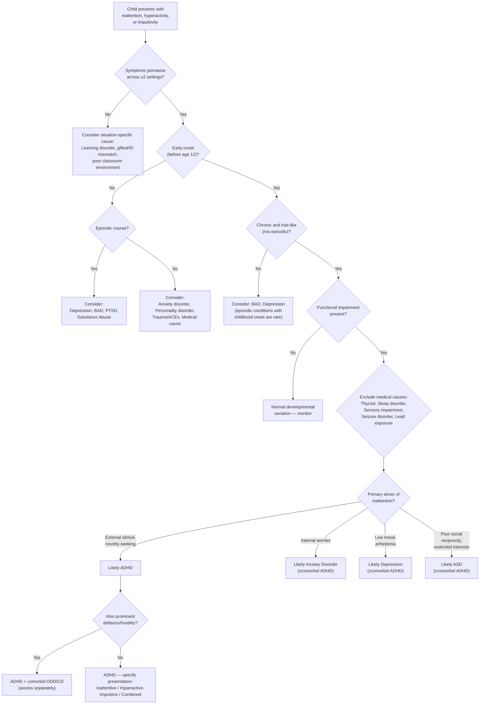

## Differential Diagnosis of ADHD

Getting the differential diagnosis right in ADHD is absolutely crucial — and it's one of the trickiest areas in child psychiatry. Why? Because ***many diagnostic criteria of ADHD overlap with other comorbidities*** [2]. Inattention, restlessness, distractibility, and impulsivity are **non-specific symptoms** that appear across a wide range of psychiatric, neurodevelopmental, and medical conditions. Your job on the ward (and in the exam) is to parse out **what is driving the symptom**.

The golden rules for differentiating ADHD from its mimics:

1. **Pervasiveness**: ADHD symptoms occur across **all** settings (home, school, social). If symptoms only appear in one context, think of something else.
2. **Developmental onset**: ADHD is **early onset** (before age 12 in DSM-5, before age 6 in ICD-10). If a previously well child suddenly develops "ADHD-like" symptoms at age 14, think mood disorder, substance use, or trauma.
3. **Course**: ADHD is **chronic and trait-like** — present every day since early childhood. If symptoms are **episodic**, think bipolar, depression, or substance use.
4. **Context of the inattention**: Is the child distracted by **external stimuli and novel activities** (→ ADHD) or by **internal worries** (→ anxiety) or by **low mood and anhedonia** (→ depression)?

---

### Differential Diagnosis Table

| Differential Diagnosis | Overlapping Features with ADHD | ***Salient Differentiating Features*** | Why the Confusion Exists (First Principles) |
|---|---|---|---|
| **Oppositional Defiant Disorder (ODD)** | Resists schoolwork/tasks; disruptive behaviour; doesn't follow instructions | ***ODD patients resist work because they resist conforming to others' demands — characterised by negativity, hostility and defiance. This must be differentiated from aversion due to difficulty sustaining mental effort, forgetting instructions and impulsivity. ODD can occur together with ADHD.*** [2] | Both involve non-compliance, but the **mechanism** differs: ADHD = "can't do it" (executive dysfunction); ODD = "won't do it" (defiance). In ADHD, the child is often remorseful afterwards; in ODD, there is deliberate hostility. Remember they co-occur in ~40% of cases. |
| **Conduct Disorder (CD)** | Rule-breaking, impulsive aggression, risk-taking behaviour | CD involves **premeditated** aggression, cruelty, destruction of property, theft, violation of others' rights. ADHD aggression is **impulsive** and unplanned. CD has callous-unemotional traits. | ADHD impulsivity leads to accidental rule-breaking; CD involves intentional antisocial behaviour. When comorbid (ADHD + CD), the prognosis is particularly poor [2]. |
| **Learning Disorder / Intellectual Disability (ID) / Gifted Child** | Appears inattentive in class; avoids schoolwork; poor academic performance | ***These individuals may appear inattentive because of frustration, lack of interest or limited ability. However, this inattention is not typically seen outside of school work (i.e., not pervasive). Children placed in settings inappropriate for their levels may appear bored and show typical symptoms of ADHD. Again, symptoms are not evident during non-academic tasks.*** [2] | A child with a reading disorder struggles to attend to text → looks "inattentive." A gifted child is bored in a normal classroom → looks "restless." The key: are the symptoms **pervasive**? In these cases, symptoms disappear in appropriately stimulating or ability-matched environments. |
| **Autism Spectrum Disorder (ASD)** | Inattention, social dysfunction, difficult behaviour; ***ADHD may also have impaired social function (due to e.g., inability to focus)*** [2] | ***In ADHD, social difficulties arise from impulsivity and poor self-control rather than the poor social skills and restricted interests seen in ASD. ADHD has normal pragmatic language skills, nonverbal social behaviour and imaginary play.*** [2] | Both are neurodevelopmental and share genetic overlap. DSM-5 now allows dual diagnosis (ADHD + ASD). The distinguishing question: does the child *want* to socialise but fail due to impulsivity (ADHD), or does the child have fundamental difficulty understanding social reciprocity (ASD)? |
| **Anxiety Disorders (GAD, separation anxiety)** | Poor concentration, restlessness, distractibility, difficulty completing tasks | ***ADHD is often accompanied by anxiety. One should distinguish the cues of their distraction — whether they are related to worrying themes (anxiety) or to external stimuli, new activities, preoccupation with enjoyable activities (ADHD).*** [2] | Anxious children look inattentive because their working memory is consumed by **worry** (internal stimuli), not because of PFC hypofunction. In ADHD, distraction is by the **external world**. Anxiety also causes somatic symptoms (stomachaches, headaches) and avoidance that ADHD alone does not. Co-occurrence is ~25%. |
| **Depressive Disorder (MDD, Dysthymia)** | Poor concentration, poor motivation, indecisiveness, psychomotor changes, irritability | ***Both are associated with diminished ability to think/concentrate, poor motivation towards daily activities and indecisiveness. However, depression usually has later onset and episodic course, and these symptoms usually only become prominent during depressive episodes when mood is low.*** [2] | Depression impairs concentration via **anhedonia** (nothing seems worth attending to) and **psychomotor retardation** (slowed processing). ADHD impairs concentration via **hypo-dopaminergic PFC**. The timeline is key: ADHD = lifelong since early childhood; depression = onset typically after puberty and episodic. |
| ***Bipolar Affective Disorder (BAD) — Mania*** | ***Distractibility, impulsivity, talkativeness, ↑ motor activity, ↑ energy*** [2][3] | ***ADHD and mania are both associated with distractibility, impulsivity and talkativeness. In BAD, these features tend to occur episodically and may be associated with elated mood and grandiosity.*** [2] ***ADHD should not have ↑ self-esteem, grandiosity, flight of ideas, ↓ need for sleep etc. Course: usually more chronic (trait-like) than episodic.*** [3] | This is a **classic exam question**. Both conditions activate similar circuits (fronto-striatal, mesolimbic). The critical differences: (1) **Episodicity** — mania is episodic with clear onset/offset, ADHD is chronic/trait-like; (2) **Grandiosity and elation** — present in mania, absent in ADHD; (3) **Sleep** — manic patients have genuinely ↓ *need* for sleep (feel refreshed after 2–3 hours), while ADHD patients *want* to sleep but can't settle; (4) **Age of onset** — BAD onset usually in late adolescence/young adulthood. |
| ***Substance Abuse (SA) Disorders*** | ADHD-like symptoms: inattention, impulsivity, restlessness, poor judgement | ***ADHD-like symptoms can occur with substance use, but these are episodic and occur only in the context of substance use.*** [2] | Substances (stimulants in intoxication; cannabis, alcohol in withdrawal) disrupt PFC function → ADHD-like picture. The key: temporal relationship to substance use. Also, ADHD *predisposes* to SA (~15% comorbidity), so both may coexist — the chronological history and collateral from parents about childhood behaviour is essential. |
| **Post-Traumatic Stress Disorder (PTSD) / Trauma** | Hypervigilance (→ looks like hyperactivity), poor concentration, irritability, sleep disturbance | PTSD has identifiable traumatic event(s), re-experiencing symptoms (flashbacks, nightmares), avoidance of trauma reminders, and emotional numbing. ADHD does not have these. | Trauma-exposed children can appear "hyperactive" due to **hyperarousal** (noradrenergic overdrive) and "inattentive" because of **dissociation** or intrusive trauma memories consuming working memory. Always screen for trauma/ACEs in an ADHD assessment. |
| **Thyroid Disorders (Hyperthyroidism)** | Restlessness, poor concentration, irritability, ↑ motor activity | Thyroid dysfunction has systemic signs: tachycardia, tremor, weight loss/gain, heat/cold intolerance, goitre. Thyroid function tests (TFTs) are diagnostic. | Hyperthyroidism increases overall sympathetic tone → agitation, restlessness. This is a medical mimic that must be excluded, especially in new-onset "ADHD-like" presentations. |
| **Sleep Disorders (OSA, restless legs, insufficient sleep)** | Daytime inattention, hyperactivity (paradoxically in children), irritability, poor academic performance | Sleep history reveals snoring, restless sleep, excessive daytime sleepiness. Polysomnography if indicated. Symptoms improve when sleep is normalised. | Sleep-deprived children paradoxically become **hyperactive** rather than sleepy (unlike adults). This is because the immature PFC is exquisitely sensitive to sleep deprivation → disinhibition → motor restlessness. Always take a sleep history. |
| **Sensory Impairment (hearing/vision)** | Appears not to listen, inattentive in class, poor academic performance | Audiometry and visual testing are normal in ADHD. Sensory impairment is not pervasive across all settings once accommodated. | A child who can't hear the teacher looks "inattentive." A child who can't see the board looks "disengaged." Simple screening resolves this. |
| ***Personality Disorders (esp. Borderline PD)*** — in adults/adolescents | ***Impulsivity, temper, mood lability; features similar to hypomania*** [3] | ***Personality disorders tend to involve more stable and enduring behaviour pattern (cf. episodic in mania). No FHx of BAD. Rapid shifts of mood (over hours and days). No classic symptoms of mania (↑ energy, grandiosity). Mood disturbances often triggered by interpersonal issues.*** [3] | In adults, BPD and adult ADHD both present with impulsivity, emotional dysregulation, and unstable relationships. BPD impulsivity is typically **interpersonally triggered** (abandonment fears), whereas ADHD impulsivity is **contextually non-specific** (occurs in all situations). They can co-occur. |
| **Normal developmental variation** | Active, energetic child; short attention span in young children | Wide normal variation in activity and attention, especially in preschoolers. Only diagnose if **excessive for age and IQ** and causing functional impairment. | Active ≠ ADHD. Some children are simply temperamentally active. The diagnosis requires **functional impairment** and symptoms that are **clearly beyond developmental norms**. |

---

### Overlap Summary Table

This table from the notes is high-yield for exams — it shows which features overlap across conditions [2]:

| Feature | ADHD | ODD/CD | GAD | Depression | Mania |
|---|---|---|---|---|---|
| ***Restlessness*** | ***✓*** | | ***✓*** | | |
| ***Poor concentration*** | ***✓*** | | ***✓*** | ***✓*** | ***✓*** |
| ***↑ Motor activity*** | ***✓*** | | | | ***✓*** |
| ***Distractibility*** | ***✓*** | | ***✓*** | | ***✓*** |
| ***Irritability*** | | ***✓*** | ***✓*** | ***✓*** | ***✓*** |

Notice: **Irritability is NOT a core ADHD feature** — it's a feature of ODD/CD, anxiety, depression, and mania. If prominent irritability dominates, consider these alternatives (or comorbidities) [2].

---

### Diagnostic Decision-Making Algorithm

---

### Key Differentiating Principles — Organised by the "Why"

<Callout title="ADHD vs Mania — The Classic Exam Trap" type="error">

This is one of the most commonly tested differentials, especially when the lecture slides list ***Attention deficit and hyperactivity disorder*** as a differential of manic episodes [3]. Both share distractibility, impulsivity, talkativeness, and increased activity. Remember:

- **Episodicity**: Mania = episodes with clear onset/offset; ADHD = chronic trait since childhood
- **Grandiosity / ↑ self-esteem**: Present in mania, absent in ADHD (ADHD patients typically have *low* self-esteem)
- **Flight of ideas**: In mania, thoughts race with loose associations and goal-directed shifts; in ADHD, thoughts are scattered but do not have the pressured, driven quality
- **↓ Need for sleep**: In mania, patients feel genuinely refreshed after minimal sleep; in ADHD, patients have difficulty *initiating* sleep but still need normal amounts
- ***ADHD should not have ↑ self-esteem, grandiosity, flight of ideas, ↓ need for sleep etc.*** [3]
- ***Course: usually more chronic (trait-like) than episodic*** [3]

</Callout>

<Callout title="ADHD vs Anxiety — The Subtle Mimic">

Both produce poor concentration and restlessness. The distinguishing question is: **what is the child distracted by?**

- **ADHD**: Distracted by the **external world** — a bird outside the window, a classmate's pencil, a noise in the corridor. The child is stimulus-driven.
- **Anxiety**: Distracted by the **internal world** — worries about performance, health, family, catastrophic thoughts. The child may appear "spaced out" because their working memory is consumed by worry.

***One should distinguish the cues of their distraction, whether they are related to worrying themes (anxiety) or to external stimuli, new activities, preoccupation with enjoyable activities (ADHD).*** [2]

</Callout>

<Callout title="ADHD vs ASD — Social Difficulties with Different Mechanisms">

Both present with social difficulties, but the mechanism is fundamentally different:

- **ADHD**: The child *wants* to socialise and *understands* social rules but **fails to execute** them because of impulsivity (e.g., interrupts, talks over others, can't take turns). ***Impairment is usually milder. Normal pragmatic language skills, nonverbal social behaviour and imaginary play.*** [2]
- **ASD**: The child has a **fundamental deficit** in social reciprocity — struggles to read facial expressions, understand sarcasm, engage in back-and-forth conversation, or develop age-appropriate friendships. Restricted interests and repetitive behaviours are present.

DSM-5 allows both diagnoses to co-occur (previously, ASD was an exclusion criterion for ADHD).

</Callout>

<Callout title="ADHD vs Learning Disorder / ID / Gifted Mismatch">

***This inattention is not typically seen outside of school work (i.e., not pervasive).*** [2]

A child with undiagnosed dyslexia looks inattentive during reading — but is perfectly attentive during sports, art, or video games. A gifted child is unstimulated in a normal classroom and appears restless — but is deeply engaged when intellectually challenged. The litmus test: does the problem persist across **all** settings and activities? If not, it's not ADHD.

</Callout>

---

### Approach to the Differential — What to Assess Clinically

When you see a child referred for possible ADHD, your differential diagnosis workup should systematically consider:

| Assessment Area | Purpose | What You're Ruling Out |
|---|---|---|
| **Detailed developmental history** (from parents) | Confirm early onset, pervasiveness, developmental trajectory | Late-onset mimics (depression, BAD, PTSD, substance use) |
| **Behaviour across settings** (home, school, social — use rating scales from both parents and teachers) | Confirm pervasiveness | Situation-specific causes (learning disorder, classroom mismatch) |
| **Mood screen** | Assess for low mood, anhedonia, elation, irritability, episodicity | Depression, BAD, dysthymia |
| **Anxiety screen** | Assess for excessive worry, avoidance, somatic complaints | GAD, separation anxiety, social anxiety |
| **Trauma screen** | Assess for ACEs, abuse, neglect, witnessed violence | PTSD, reactive attachment disorder |
| **Substance use history** (in adolescents) | Temporal relationship between substance use and symptoms | Substance-induced ADHD-like symptoms |
| **Sleep history** | Snoring, sleep duration, sleep onset latency, restless legs | OSA, insufficient sleep, circadian rhythm disorder |
| **Medical history + physical examination** | Thyroid signs, neurological signs, hearing/vision | Hyperthyroidism, seizures, sensory impairment, lead exposure |
| **Psychometric/cognitive testing** | IQ testing, academic achievement testing | Intellectual disability, specific learning disorders, giftedness |
| **Assessment for ASD** | Social reciprocity, restricted interests, repetitive behaviours | ASD (which can co-occur) |

---

<Callout title="High Yield Summary">

1. **ADHD symptoms are non-specific** — inattention, hyperactivity, and impulsivity appear in many conditions. Always consider the differential systematically.

2. **The 3 golden rules for ADHD diagnosis over mimics**: (a) Pervasive across ≥ 2 settings, (b) Early onset (before age 12), (c) Chronic/trait-like (not episodic).

3. **ADHD vs ODD**: "Can't do it" (executive dysfunction) vs "Won't do it" (defiance). Co-occur in ~40%.

4. **ADHD vs Anxiety**: Distracted by external stimuli (ADHD) vs internal worries (anxiety).

5. **ADHD vs Depression**: Lifelong since childhood (ADHD) vs later onset and episodic (depression). Both impair concentration but via different mechanisms.

6. **ADHD vs Mania**: Chronic trait-like course (ADHD) vs episodic with elated mood, grandiosity, ↓ need for sleep, flight of ideas (mania). ADHD should NOT have grandiosity or ↓ need for sleep.

7. **ADHD vs ASD**: Wants to socialise but fails due to impulsivity (ADHD) vs fundamental deficit in social reciprocity (ASD). Can co-occur.

8. **ADHD vs Learning Disorder/ID/Gifted**: Symptoms only during academic tasks (learning disorder) vs pervasive (ADHD).

9. **ADHD vs Substance Abuse**: Symptoms only in context of substance use (SA) vs lifelong (ADHD). Both can co-exist.

10. **Always exclude medical causes**: Thyroid, sleep disorders, sensory impairment, seizures, lead exposure.

</Callout>

---

<ActiveRecallQuiz
  title="Active Recall - ADHD Differential Diagnosis"
  items={[
    {
      question: "A 7-year-old boy is inattentive and restless in class but is calm and focused during football practice and video games. What is the most likely explanation, and why does this argue against ADHD?",
      markscheme: "Most likely a learning disorder, intellectual disability, or gifted mismatch. This argues against ADHD because ADHD symptoms must be pervasive across settings — not just during academic tasks. Situation-specific inattention suggests the problem is with the academic environment, not with the child's executive function."
    },
    {
      question: "List 4 key features that differentiate a manic episode from ADHD.",
      markscheme: "(1) Episodic course in mania vs chronic/trait-like in ADHD. (2) Grandiosity and elevated self-esteem in mania vs often low self-esteem in ADHD. (3) Decreased need for sleep in mania (feels refreshed) vs difficulty initiating sleep but normal sleep need in ADHD. (4) Flight of ideas in mania vs scattered but non-pressured thoughts in ADHD. (5) Later onset typically in mania vs early childhood onset in ADHD."
    },
    {
      question: "How do you distinguish inattention caused by ADHD from inattention caused by anxiety?",
      markscheme: "In ADHD, distraction is by external stimuli, novel activities, and enjoyable preoccupations (stimulus-driven). In anxiety, distraction is by internal worrying themes (worry-driven). Additionally, anxiety-related inattention is accompanied by somatic complaints, avoidance, and worry content, whereas ADHD inattention is pervasive and not tied to specific worrying themes."
    },
    {
      question: "A child with ADHD also has prominent defiance and hostility towards authority figures. What is the most likely comorbid diagnosis, and how do you distinguish the non-compliance of this comorbidity from ADHD alone?",
      markscheme: "Comorbid ODD (Oppositional Defiant Disorder), present in ~40% of ADHD cases. In ADHD alone, non-compliance arises from difficulty sustaining mental effort, forgetting instructions, and impulsivity (cannot do it). In ODD, non-compliance arises from deliberate negativity, hostility, and defiance towards authority (will not do it). In ADHD the child is often remorseful; in ODD there is intentional opposition."
    },
    {
      question: "Why should you always take a sleep history when evaluating a child for possible ADHD?",
      markscheme: "Sleep-deprived children paradoxically become hyperactive rather than sleepy (unlike adults), because the immature prefrontal cortex is exquisitely sensitive to sleep deprivation, leading to disinhibition and motor restlessness. Sleep disorders (OSA, insufficient sleep, restless legs) can therefore mimic ADHD. Symptoms resolve when sleep is normalised, distinguishing this from true ADHD."
    }
  ]}
/>

## References

[1] Senior notes: ryanho-psych.md (Section 12.3 — summary table of childhood psychiatric disorders)
[2] Senior notes: ryanho-psych.md (Section 12.3 — Attention-deficit Hyperactivity Disorder, including D/dx table and clinical features)
[3] Senior notes: ryanho-psych.md (Section 7.1.2 — Approach to Elated or Irritable Mood; and Bipolar Disorder differential diagnosis of ADHD); Lecture slides: GC 163. I am a superman Bipolar disorder.pdf (p10 — Differential diagnosis of manic episode)
