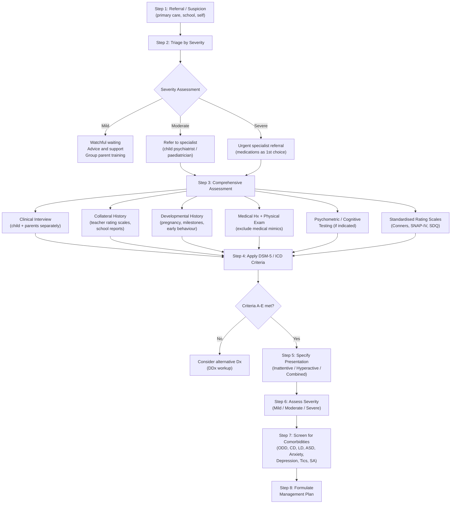

## Diagnostic Criteria

ADHD is a **clinical diagnosis** — there is no blood test, no brain scan, no single questionnaire that "confirms" it. The diagnosis rests on a careful clinical assessment demonstrating that the patient meets standardised criteria. Let me walk you through both the DSM-5 and ICD-10/ICD-11 criteria, explain the reasoning behind each criterion, and then detail the full assessment algorithm and investigation modalities.

### Why Is the Diagnosis Clinical?

From first principles: ADHD reflects a **dimensional trait** (executive function capacity) that exists on a spectrum in the population — like blood pressure or height. There is no qualitative "switch" that flips at a certain biomarker level. Instead, we define a **threshold** above which the trait causes clinically significant functional impairment. The diagnostic criteria operationalise this threshold. Neuroimaging and neuropsychological testing can support the diagnosis but are neither sufficiently sensitive nor specific to serve as standalone diagnostic tools.

---

### DSM-5 Diagnostic Criteria (Attention-Deficit/Hyperactivity Disorder)

The DSM-5 criteria are the most widely used globally and are the standard for clinical practice and research. I'll present each criterion and explain **why** it exists [2].

#### Criterion A — Symptom Domains

> ***A persistent pattern of inattention and/or hyperactivity-impulsivity that interferes with functioning or development, with ≥ 6 of the following criteria persisting for ≥ 6 months to a degree that is inconsistent with developmental level and that directly negatively impacts social and academic/occupational activities. (≥ 5 criteria if age ≥ 17y)*** [2]

**Why ≥ 6 months?** — To ensure the symptoms are **persistent** and not transient reactions to stressors (e.g., a child who is temporarily inattentive after parental divorce). Six months is long enough to distinguish a trait from a state.

**Why "inconsistent with developmental level"?** — A 3-year-old who can't sit still for 30 minutes is normal. A 10-year-old who can't sit still for 5 minutes is not. The same behaviour has different diagnostic significance depending on age.

**Why ≥ 5 (instead of ≥ 6) for ages ≥ 17?** — Adults have developed compensatory strategies and the expression of symptoms evolves. A lower threshold acknowledges that fewer overt symptoms may still cause significant impairment in the more demanding adult environment.

##### Domain 1: Inattention (9 items)

| Item | Criterion | Cognitive Basis |
|---|---|---|
| **(a)** | ***Often fails to give close attention to details or makes careless mistakes in schoolwork, at work, or during other activities*** [2] | Impaired **selective attention** and ACC error-monitoring → details are missed because the brain's "quality control" system is underactive |
| **(b)** | ***Often has difficulty sustaining attention in tasks or play activities*** [2] | Impaired **sustained attention** (dlPFC) → the dopamine signal that says "keep focusing here" fades too quickly |
| **(c)** | ***Often does not seem to listen when spoken to directly*** [2] | Impaired **attentional gating** → the speaker's voice is not prioritised over competing sensory input; the child is not ignoring deliberately |
| **(d)** | ***Often does not follow through on instructions and fails to finish schoolwork, chores, or duties at workplace*** [2] | Impaired **working memory** → cannot hold multi-step instructions online long enough to execute them; also impaired goal-directed persistence |
| **(e)** | ***Often has difficulty organising tasks and activities*** [2] | Impaired **executive planning** (dlPFC) → cannot break complex tasks into manageable steps or sequence them logically |
| **(f)** | ***Often avoids, dislikes, or is reluctant to engage in tasks that require sustained mental effort*** [2] | **Delay aversion** (mesolimbic pathway) + genuine cognitive fatigue → effortful tasks with delayed reward are experienced as intensely aversive |
| **(g)** | ***Often loses things necessary for tasks or activities*** [2] | Impaired **prospective memory** (remembering to keep track of possessions) → PFC-dependent "reminder" function is weak |
| **(h)** | ***Is often easily distracted by extraneous stimuli*** [2] | Impaired **inhibition of irrelevant sensory input** → PFC cannot suppress bottom-up attentional capture; everything competes equally for attention |
| **(i)** | ***Is often forgetful in daily activities*** [2] | Impaired **working memory** and **prospective memory** → forgets appointments, routine tasks, items needed for the day |

##### Domain 2: Hyperactivity and Impulsivity (9 items)

| Item | Criterion | Cognitive Basis |
|---|---|---|
| **(a)** | ***Often fidgets with or taps hands or feet or squirms in seat*** [2] | Impaired **motor inhibition** (fronto-striatal circuit) → basal ganglia fail to suppress unwanted motor programmes; also compensatory stimulation-seeking to increase PFC arousal |
| **(b)** | ***Often leaves seat in situations when remaining seated is expected*** [2] | Same motor disinhibition; stronger drive to move overcomes the learned social rule of "stay seated" |
| **(c)** | ***Often runs about or climbs in situations where it is inappropriate*** [2] | Excessive motor drive; in adolescents/adults, may manifest as subjective restlessness rather than overt climbing |
| **(d)** | ***Often unable to play or engage in leisure activities quietly*** [2] | Impaired regulation of arousal level → cannot modulate activity to match the situation's demands |
| **(e)** | ***Is often "on the go," acting as if "driven by a motor"*** [2] | Chronically hypo-aroused PFC → constant movement is a compensatory mechanism to upregulate arousal |
| **(f)** | ***Often talks excessively*** [2] | Impaired **verbal inhibition** → the "brakes" on speech output are weak; words are produced faster than they can be filtered |
| **(g)** | ***Often blurts out an answer before a question has been completed*** [2] | Impaired **response inhibition** (the core deficit in Barkley's model) → the prepotent response cannot be suppressed |
| **(h)** | ***Often has difficulty waiting his or her turn*** [2] | **Delay aversion** → waiting is experienced as intensely unpleasant; impaired ability to tolerate the gap between desire and gratification |
| **(i)** | ***Often interrupts or intrudes on others*** [2] | Impaired **social inhibition** → PFC-mediated "social brakes" are weak; the child knows the rule but cannot apply it in the moment |

#### Criterion B — Age of Onset

> ***Several inattentive or hyperactive-impulsive symptoms were present prior to age 12 years*** [2]

**Why age 12?** — DSM-5 relaxed this from the DSM-IV threshold of age 7, based on evidence that (a) many patients (especially the predominantly inattentive type) are not identified until later in childhood, and (b) retrospective recall of symptom onset before age 7 is unreliable. Age 12 captures nearly all true ADHD cases (***98% by age 16*** [2]) while reducing false negatives.

#### Criterion C — Pervasiveness

> ***Several inattentive or hyperactive-impulsive symptoms are present in ≥ 2 settings (e.g., at home, school or work; with friends or relatives; in other activities)*** [2]

**Why ≥ 2 settings?** — This distinguishes ADHD from situation-specific problems. A child who is "inattentive" only in maths class likely has a maths-specific learning disorder, not ADHD. A child who is hyperactive only at home but calm at school may have a family dynamics issue. True ADHD is **pervasive** because the underlying neurobiological deficit goes with the child everywhere.

#### Criterion D — Functional Impairment

> ***There is clear evidence that the symptoms interfere with, or reduce the quality of, social, academic, or occupational functioning*** [2]

**Why functional impairment?** — Many people have some inattention or restlessness. You only diagnose a **disorder** when the symptoms cross the threshold into causing meaningful impairment. This prevents pathologising normal variation.

#### Criterion E — Exclusion

> ***The symptoms do not occur exclusively during the course of schizophrenia or another psychotic disorder and are not better explained by another mental disorder (e.g., mood disorder, anxiety disorder, dissociative disorder, personality disorder, substance intoxication or withdrawal)*** [2]

**Why this criterion?** — As discussed in the differential diagnosis section, many conditions mimic ADHD. This criterion forces the clinician to consider alternatives. Note the word **"exclusively"** — ADHD can **co-occur** with these conditions; it just cannot be diagnosed if the symptoms are **entirely** explained by the other condition.

#### Specifiers

> ***Specify presentation: (1) Predominantly Inattentive, (2) Predominantly Hyperactive-Impulsive, (3) Combined*** [2]

Also specify:
- **In partial remission** — if full criteria were previously met but fewer than full criteria have been met for the past 6 months, yet symptoms still cause impairment
- **Severity**: Mild / Moderate / Severe

---

### ICD-10 Diagnostic Criteria (Hyperkinetic Disorder, F90)

> ***Both impaired attention and overactivity should be present, and should be evident in > 1 situations. They should be diagnosed only if they are excessive for the child's age and IQ.*** [2]

Key differences from DSM-5:

| Feature | ICD-10 | DSM-5 |
|---|---|---|
| **Term** | Hyperkinetic Disorder (F90) | Attention-Deficit/Hyperactivity Disorder |
| **Required domains** | ***Both*** inattention ***and*** overactivity must be present [1][2] | ***Either*** inattention ***or*** hyperactivity-impulsivity (or both) [1][2] |
| **Age of onset** | ***Before age 6*** [2] | ***Before age 12*** [2] |
| **Predominantly inattentive subtype** | Not formally recognised under F90 | Recognised as a separate presentation |
| **Strictness** | **Narrower** definition → captures more severe cases | **Broader** definition → captures the full spectrum |
| **Conduct disorder** | ***Symptoms of conduct disorder are neither exclusion nor inclusion criteria for the main diagnosis, but their presence or absence constitutes the basis for the main subdivision*** [2] (F90.0 vs F90.1) | CD is coded separately as a comorbidity |

> ***The characteristic behaviour problems should be of early onset (before age 6 years) and long duration. However, before the age of school entry, hyperactivity is difficult to recognise because of the wide normal variation: only extreme levels should lead to a diagnosis in preschool children.*** [2]

> ***Associated features include disinhibition in social relationships, recklessness in dangerous situations, impulsive flouting of social rules.*** [2]

> ***Learning disorders and motor clumsiness occur with undue frequency, and should be noted separately (under F80–F89) when present; they should not, however, be part of the actual diagnosis of hyperkinetic disorder.*** [2]

<Callout title="ICD-10 vs DSM-5 — Exam Must-Know" type="error">
The key conceptual difference: ICD-10 (Hyperkinetic Disorder) is **stricter** — it requires **both** inattention **and** hyperactivity, onset before **age 6**, and essentially captures only the combined/hyperactive subtypes. DSM-5 is **broader** — it allows **either** domain, onset before **age 12**, and recognises the predominantly inattentive presentation. In clinical practice, DSM-5 criteria are more commonly used for ADHD specifically. ICD-11 has now harmonised with DSM-5 by recognising all three presentations.
</Callout>

### ICD-11 Update (6A05 — Attention Deficit Hyperactivity Disorder)

ICD-11 has made several important changes to align with DSM-5:
- Now uses the term **"ADHD"** (not "Hyperkinetic Disorder")
- Recognises three presentations: predominantly inattentive, predominantly hyperactive-impulsive, combined
- Does **not** specify a strict age threshold — instead requires onset "during the developmental period" (generally childhood)
- Allows a dimensional approach to symptom severity
- Explicitly allows comorbid diagnosis with ASD

---

### Adult ADHD — Diagnostic Considerations

> ***Diagnosis of hyperkinetic disorder can still be made in adult life. The grounds are the same, but attention and activity must be judged with reference to developmentally appropriate norms.*** [2]

Key points specific to adult diagnosis:
- DSM-5 requires only **≥ 5 symptoms** (instead of ≥ 6) for age ≥ 17 — because adults compensate and symptoms manifest differently
- **Retrospective confirmation** of childhood onset is essential — corroborated by school reports, parental recall, or collateral history
- Hyperactivity is internalised (inner restlessness, workaholism) rather than overt motor overactivity
- Impulsivity manifests as low frustration tolerance, rash decisions, addictive tendencies

> ***When hyperkinesis was present in childhood, but has disappeared and been succeeded by another condition, such as dissocial personality disorder or substance abuse, the current condition rather than the earlier one is coded.*** [2]

---

## Diagnostic Algorithm

### Step-by-Step Clinical Assessment Pathway

The assessment of ADHD follows a systematic pathway. Let me lay this out as a practical clinical algorithm:

#### Step 1: Suspicion / Referral

> ***Suspicion: detected at primary care (but not diagnosed)*** [2]

- Referral typically comes from parents, teachers, or school counsellors who notice the child is "not keeping up" or "always in trouble"
- In adults, self-referral is common ("I think I might have ADHD" — increasingly common with public awareness)

#### Step 2: Triage by Severity

> ***Subsequent approach*** [2]:
> - ***Mild: advice, support, watchful waiting; offer group parent training***
> - ***Moderate: refer to specialists at school age for behavioural therapy or medications***
> - ***Severe: refer to specialists for medications as 1st choice***

#### Step 3: Comprehensive Specialist Assessment

This is the core diagnostic process. It involves **multiple sources of information** — you never diagnose ADHD from a single consultation or a single informant.

---

### Detailed Assessment Components

#### A. Clinical Interview

The clinical interview is the **cornerstone** of ADHD diagnosis. You need information from **multiple informants** because behaviour varies across settings, and a single observer may miss or overemphasise certain features.

**Interview with the child/adolescent:**
- Observe the child's behaviour during the consultation (though some children with ADHD behave well in the novelty of a 1:1 clinical setting — this does not rule out ADHD)
- Ask about their own experience: difficulties at school, friendships, how they feel about their behaviour
- In adolescents/adults: self-report of concentration difficulties, organisational problems, impulsivity

**Interview with parents/carers:**

| Domain | ***Sample Questions from Assessment*** [2] |
|---|---|
| Attention span | ***How short was attention span over day-to-day tasks, e.g., packing schoolbags, completing homework?*** |
| Homework | ***How long does it take to finish homework? How does it compare with his peers? Does he need any 1-on-1 supervision?*** |
| Play behaviour | ***When playing with toys, does he often shift toys and not try to explore and has short interest in new toys?*** |
| Group activities | ***In group games, is he attentive, e.g., listen to coach's instructions?*** |
| Distractibility | ***How easily distracted is he? Does he play with stationery, toys, books, fingers? Does he go away from seat? What happens when there is any noise around?*** |
| Daydreaming | ***Any daydreaming?*** [2] |
| Listening | ***Does he have a good attention when others are chatting or over the phone?*** [2] |
| Intrusiveness | ***Does he try to give comment when not asked?*** [2] |
| Waiting ability | ***Is he unable to wait when asked, but often forgets what to say afterwards when asked to wait?*** [2] |

**Interview with teachers:**
- Teacher observations provide essential information about the school setting — the primary arena where inattention and hyperactivity become functionally impairing
- Teacher rating scales (see below) are critical for confirming pervasiveness

#### B. Standardised Rating Scales

Rating scales are **supplementary tools** — they do not make the diagnosis on their own but provide structured, quantifiable information.

| Rating Scale | Informant | Content | Role in Assessment |
|---|---|---|---|
| **Conners Rating Scales (CRS-3)** | Parent and Teacher versions | ADHD symptoms, ODD, cognitive problems, social problems | Most widely used ADHD-specific scale; provides T-scores normed by age and sex; useful for monitoring treatment response |
| **SNAP-IV** (Swanson, Nolan, and Pelham) | Parent and Teacher | Directly maps onto DSM criteria for inattention, hyperactivity-impulsivity, and ODD | Free, quick (18 items for ADHD), easy to score; excellent for tracking symptom change |
| **SDQ** (Strengths and Difficulties Questionnaire) | Parent, Teacher, Self (age ≥ 11) | Emotional, conduct, hyperactivity/inattention, peer problems, prosocial behaviour | Broad screening tool (not ADHD-specific); useful for detecting comorbidities; widely used in UK/HK |
| **Vanderbilt Assessment Scales** | Parent and Teacher | ADHD symptoms + ODD, CD, anxiety, depression, and academic performance | Comprehensive, free, includes functional impairment and comorbidity screening |
| **WURS** (Wender Utah Rating Scale) | Self (retrospective) | Childhood ADHD symptoms recalled by adults | Used in adult ADHD assessment to help establish childhood onset |
| **ASRS** (Adult ADHD Self-Report Scale) | Self (adults) | 18 items mapping to DSM-5 criteria for adults | WHO-developed screening tool for adult ADHD; quick (6-item screener available) |
| **DIVA** (Diagnostic Interview for ADHD in Adults) | Semi-structured interview | Systematic assessment of all DSM criteria in childhood and adulthood | Gold-standard structured interview for adult ADHD diagnosis |

<Callout title="Rating Scales Are Supportive, Not Diagnostic" type="error">
A common exam mistake: rating scales **do not diagnose** ADHD. They are tools that help quantify symptoms and provide information from multiple informants. The diagnosis is made by a clinician integrating information from clinical interview, collateral history, rating scales, developmental history, and exclusion of differential diagnoses. A child can score high on Conners and not have ADHD (e.g., if symptoms are caused by anxiety), or score borderline but clearly have ADHD with significant functional impairment.
</Callout>

#### C. Developmental and Family History

| Area | What to Assess | Why |
|---|---|---|
| Pregnancy and birth | Maternal smoking, alcohol, substance use; prematurity; low birth weight; obstetric complications | These are risk factors for ADHD (perinatal insults to developing PFC) [2] |
| Developmental milestones | Motor, language, social milestones | Delays may suggest broader neurodevelopmental disorder (ASD, ID); ***clumsiness, language delay, abnormalities of speech suggest neurodevelopmental impairment*** [2] |
| Family psychiatric history | ADHD, mood disorders, anxiety, substance abuse, ASD, learning difficulties in 1st-degree relatives | ***Heritability ~70–80%; ~1/4 of siblings have ADHD*** [2] |
| Early behaviour | Temperament as infant/toddler, behaviour at nursery, early reports from preschool | Establishes whether symptoms were present before age 6/12 |
| Psychosocial context | Family structure, parenting style, ACEs, socioeconomic status, school environment | Identifies maintaining/exacerbating factors; rules out purely environmental causes (e.g., extreme deprivation) |

#### D. Physical Examination

The physical examination in ADHD assessment serves two purposes: (1) exclude medical mimics, and (2) establish a baseline before starting medication.

| Examination | Purpose | Key Findings to Note |
|---|---|---|
| **Height, weight, BMI** (plotted on growth chart) | Baseline for monitoring stimulant side effects (appetite suppression → growth deceleration) | Note percentile; will need serial monitoring |
| **Blood pressure and heart rate** | Baseline for stimulant cardiovascular monitoring | Exclude pre-existing hypertension or tachycardia |
| **Cardiovascular examination** | Exclude structural heart disease before starting stimulants | Murmurs, irregular rhythm → further investigation before prescribing |
| **Thyroid examination** | Exclude hyperthyroidism as a mimic | Goitre, exophthalmos, tremor, tachycardia |
| **Neurological examination** | Assess for soft neurological signs; exclude neurological conditions | Coordination difficulties (cerebellar signs), motor tics, asymmetric reflexes; ***clumsiness suggests neurodevelopmental impairment*** [2] |
| **Dysmorphic features** | Screening for genetic syndromes associated with ADHD-like features | Fetal alcohol syndrome (smooth philtrum, thin upper lip, short palpebral fissures); Fragile X (long face, large ears, macroorchidism); 22q11 deletion; Williams syndrome |
| **Skin examination** | Screen for neurocutaneous syndromes | Café-au-lait spots (NF1 — associated with ADHD), ash-leaf macules (tuberous sclerosis), port-wine stains |
| **Vision and hearing screening** | Exclude sensory impairments mimicking inattention | Refractive errors, conductive hearing loss |

---

## Investigation Modalities

### Principle: ADHD Is a Clinical Diagnosis — Investigations Serve Specific Purposes

There is **no diagnostic test for ADHD**. Investigations are used to:
1. **Exclude medical mimics** (medical differential diagnosis)
2. **Identify comorbidities** (especially learning disorders)
3. **Establish pre-treatment baselines** (before starting pharmacotherapy)
4. **Support the clinical impression** (neuropsychological testing in ambiguous cases)

### Investigation Table

| Investigation | Indication | Key Findings / Interpretation |
|---|---|---|
| **Thyroid Function Tests (TFTs)** | New presentation of inattention/hyperactivity, especially if systemic symptoms present | ↑ T4/T3 + ↓ TSH → hyperthyroidism mimicking ADHD; rare but must be excluded. Resistance to thyroid hormone (RTH) syndrome is a rare genetic cause of ADHD + thyroid abnormalities |
| **Full Blood Count (FBC) + Iron studies** | Suspected nutritional deficiency; restless legs symptoms; pre-treatment baseline | Iron deficiency (↓ ferritin) → fatigue, restlessness, impaired cognition. Iron is a cofactor for tyrosine hydroxylase (the rate-limiting enzyme in dopamine synthesis), so low iron → ↓ dopamine → ADHD-like symptoms |
| **Lead level** | Suspected environmental exposure (old housing, industrial areas) | ↑ Lead → disrupts dopaminergic neurotransmission → inattention, hyperactivity, cognitive impairment. Should be considered in high-risk populations |
| **Urine drug screen** | Adolescents/adults with new or worsening symptoms; suspected substance use | Positive for stimulants, cannabis, etc. → substance-induced ADHD-like symptoms |
| **ECG** | ***Before starting stimulant medication***, especially if: personal/family history of cardiac disease, syncope, palpitations, sudden cardiac death in family | Prolonged QTc, pre-excitation (WPW), Brugada pattern, ventricular hypertrophy → contraindication or caution with stimulants. Stimulants have mild sympathomimetic effects → ↑ HR, ↑ BP, and rarely arrhythmias in those with pre-existing cardiac conditions |
| **Echocardiogram** | If ECG abnormal or clinical suspicion of structural heart disease | Structural anomalies that may contraindicate stimulant use |
| **Audiometry** | If hearing impairment suspected | Conductive or sensorineural hearing loss → child cannot hear teacher → appears inattentive |
| **Vision testing** | If visual impairment suspected | Refractive errors → difficulty seeing board/worksheets → appears inattentive |
| **EEG** | Suspected seizure disorder (absence epilepsy mimicking inattention — the child "blanks out") | 3 Hz spike-and-wave in absence epilepsy. Note: routine EEG is NOT indicated for ADHD itself; only if clinical suspicion of epilepsy |
| **Brain MRI** | NOT routine; only if focal neurological signs, concern about structural lesion, or atypical presentation | ***Imaging studies show ↓ volume/cortical thickness, especially in grey matter of basal ganglia*** [2] — but these are research findings and not clinically diagnostic; MRI is normal or non-specifically abnormal in individual ADHD patients |

### Neuropsychological Testing

| Test Type | What It Measures | Role in ADHD Assessment |
|---|---|---|
| **IQ Testing (WISC-V for children; WAIS-IV for adults)** | Full-scale IQ, verbal comprehension, perceptual reasoning, working memory, processing speed | Identifies intellectual disability or giftedness (both can mimic ADHD); ADHD patients often show a characteristic pattern: **low Working Memory Index and Processing Speed Index** relative to other indices (this is supportive, not diagnostic) |
| **Continuous Performance Test (CPT)** — e.g., TOVA, Conners CPT | Sustained attention, impulsivity, response time variability | Measures omission errors (inattention), commission errors (impulsivity), and reaction time variability (attentional consistency). Sensitivity ~70–80% but not specific enough to diagnose alone; useful in ambiguous cases |
| **Trail Making Test (Part A and B)** | Processing speed, cognitive flexibility, task-switching | Part B specifically tests executive function (set-shifting); ADHD patients are often slow and make more errors on Part B |
| **Stroop Test** | Inhibitory control (the ability to suppress a prepotent response) | ADHD patients show an exaggerated "Stroop effect" — greater difficulty inhibiting the automatic reading response |
| **Wisconsin Card Sorting Test (WCST)** | Cognitive flexibility, set-shifting, response to feedback | ADHD patients may show more perseverative errors (difficulty shifting strategy when feedback changes) |
| **Academic Achievement Tests (e.g., WIAT)** | Reading, writing, mathematics achievement relative to IQ | Identifies specific learning disorders (reading disorder, maths disorder) — ***these occur with undue frequency and should be noted separately*** [2]; achievement significantly below IQ → specific LD |

<Callout title="Neuropsychological Testing — When and Why?">
Neuropsychological testing is **not required** to diagnose ADHD in straightforward cases. It is most useful when:
- The clinical picture is **ambiguous** (e.g., inattentive only, no hyperactivity, high IQ)
- You need to **differentiate** ADHD from a learning disorder or intellectual disability
- You need to **quantify** the executive function deficit for educational accommodations
- There is **treatment resistance** and you need to understand the cognitive profile better

A classic ADHD neuropsychological profile: relatively intact IQ with disproportionately low Working Memory Index and Processing Speed Index, elevated CPT omission and commission errors, and poor performance on tests of inhibitory control (Stroop, Go/No-Go).
</Callout>

---

### Pre-Treatment Baseline Investigations

Before starting pharmacotherapy (especially stimulants), you must establish baselines:

| Parameter | Why | Frequency of Monitoring |
|---|---|---|
| **Height and weight** | Stimulants suppress appetite → risk of growth deceleration | Every 3–6 months on stimulants; plot on growth chart |
| **Blood pressure and heart rate** | Stimulants have mild sympathomimetic effects → ↑ HR, ↑ BP | Before starting; every visit for the first 3 months; then every 3–6 months |
| **ECG** | Exclude pre-existing cardiac conduction abnormalities | Before starting stimulants if indicated (varies by guideline; NICE recommends only if cardiac risk factors; some centres do it routinely) |
| **Liver function tests** | Required before starting atomoxetine (rare risk of hepatotoxicity) | Baseline; then if symptoms suggest hepatic dysfunction |

---

## Summary: What Makes the Diagnosis

Let me distil this into the practical exam framework:

| Component | Establishes | Source |
|---|---|---|
| **Clinical interview** (child + parents + teachers) | Symptom presence, pervasiveness, onset, functional impairment | Core of diagnosis |
| **Rating scales** (Conners, SNAP-IV, SDQ) | Quantification of symptoms from multiple informants | Supportive |
| **Developmental/family history** | Early onset, genetic risk, perinatal risk factors | Supports Criteria B |
| **Physical examination** | Excludes medical mimics; establishes pre-treatment baselines | Essential |
| **Investigations** (TFTs, FBC, lead, ECG, audiometry, vision) | Excludes specific medical causes | As indicated |
| **Neuropsychological testing** | Cognitive profiling; identifies comorbid learning disorders; supports ambiguous cases | Not routine; as indicated |
| **DSM-5/ICD criteria application** | Formal diagnostic threshold | Required |

---

<Callout title="High Yield Summary">

1. **ADHD is a clinical diagnosis** — no single test confirms it. Diagnosis requires integration of clinical interview, collateral history from multiple informants, rating scales, developmental history, and exclusion of differential diagnoses.

2. **DSM-5 Criteria**: ≥ 6/9 symptoms (≥ 5 if age ≥ 17) in inattention and/or hyperactivity-impulsivity; ≥ 6 months duration; onset before age 12; present in ≥ 2 settings; functional impairment; not better explained by another disorder.

3. **ICD-10 (Hyperkinetic Disorder)**: Stricter — requires BOTH inattention AND hyperactivity; onset before age 6. ICD-11 has aligned with DSM-5.

4. **Rating scales (Conners, SNAP-IV, SDQ)**: Supportive but NOT diagnostic on their own. Need parent AND teacher versions to confirm pervasiveness.

5. **Investigations are to exclude mimics and establish pre-treatment baselines**: TFTs (thyroid), FBC + iron (deficiency → ↓ dopamine), lead level, audiometry/vision, ECG (pre-stimulant).

6. **Neuropsychological testing**: Not routine. Useful for ambiguous cases, comorbid learning disorders, educational accommodations. Classic ADHD profile: low working memory + processing speed indices relative to full-scale IQ.

7. **Pre-treatment baselines**: Height, weight, BP, HR, ECG (if cardiac risk factors), LFTs (if starting atomoxetine).

8. **Multiple informant approach**: ALWAYS get information from parents AND teachers — you need to confirm pervasiveness across settings.

9. **Adult ADHD**: Requires retrospective confirmation of childhood onset; threshold lowered to ≥ 5 symptoms for age ≥ 17; use DIVA or ASRS for structured assessment.

10. **Key difference between ICD-10 and DSM-5**: ICD-10 requires both domains + onset < 6y (stricter); DSM-5 allows either domain + onset < 12y (broader). ICD-11 now aligns with DSM-5.

</Callout>

---

<ActiveRecallQuiz
  title="Active Recall - ADHD Diagnostic Criteria, Algorithm & Investigations"
  items={[
    {
      question: "State the five DSM-5 criteria (A through E) for ADHD in conceptual terms.",
      markscheme: "A: Persistent pattern of inattention and/or hyperactivity-impulsivity with at least 6 of 9 symptoms (or 5 of 9 if age 17 or more) in at least one domain for at least 6 months, inconsistent with developmental level and causing functional impairment. B: Several symptoms present before age 12. C: Symptoms present in at least 2 settings. D: Clear evidence of functional impairment in social, academic, or occupational domains. E: Symptoms not exclusively during psychotic disorder and not better explained by another mental disorder."
    },
    {
      question: "How does ICD-10 Hyperkinetic Disorder differ from DSM-5 ADHD in terms of required symptom domains and age of onset?",
      markscheme: "ICD-10 requires BOTH inattention AND hyperactivity/overactivity to be present (narrower definition — essentially only captures combined presentation). DSM-5 requires EITHER inattention OR hyperactivity-impulsivity (broader — allows predominantly inattentive presentation). ICD-10 requires onset before age 6; DSM-5 requires onset before age 12."
    },
    {
      question: "Why is iron deficiency relevant to ADHD assessment, and what investigation would you order?",
      markscheme: "Iron is a cofactor for tyrosine hydroxylase, the rate-limiting enzyme in dopamine synthesis. Iron deficiency leads to reduced dopamine production, which can cause or exacerbate ADHD-like symptoms (inattention, restlessness). Order serum ferritin as part of iron studies. Ferritin below 20-30 micrograms per litre may warrant iron supplementation."
    },
    {
      question: "Name three standardised rating scales used in ADHD assessment and explain why information from both parents and teachers is essential.",
      markscheme: "Conners Rating Scales (CRS-3), SNAP-IV, SDQ (Strengths and Difficulties Questionnaire). Also acceptable: Vanderbilt, ASRS (adults). Both parent and teacher informants are needed because DSM-5 Criterion C requires symptoms to be present in at least 2 settings — parent report captures home behaviour while teacher report captures school behaviour. A child who is only symptomatic in one setting may not have ADHD."
    },
    {
      question: "What pre-treatment baseline measurements must you establish before starting a child on methylphenidate, and why?",
      markscheme: "Height and weight (plotted on growth chart) — because stimulants suppress appetite and may cause growth deceleration. Blood pressure and heart rate — because stimulants have mild sympathomimetic effects and can increase BP and HR. ECG if cardiac risk factors (personal or family history of cardiac disease, syncope, sudden death) — to exclude prolonged QTc, structural abnormalities, or arrhythmias before starting a drug with sympathomimetic effects."
    },
    {
      question: "A 9-year-old girl frequently zones out in class and appears to briefly lose consciousness. Her teacher reports she stares blankly for 10-20 seconds then resumes activity unaware of the episode. What investigation would you order and why?",
      markscheme: "EEG to exclude absence epilepsy. Absence seizures present with brief episodes of unresponsiveness (staring spells lasting 10-30 seconds) that can mimic inattention. EEG would show characteristic 3 Hz generalised spike-and-wave discharges during an absence seizure. Routine EEG is not indicated for ADHD but is indicated when the clinical picture suggests seizures rather than inattention."
    }
  ]}
/>

## References

[1] Senior notes: ryanho-psych.md (Section 12.3 — summary table of childhood psychiatric disorders)
[2] Senior notes: ryanho-psych.md (Section 12.3 — Attention-deficit Hyperactivity Disorder: diagnostic criteria, assessment approach, interview domains, aetiology)
