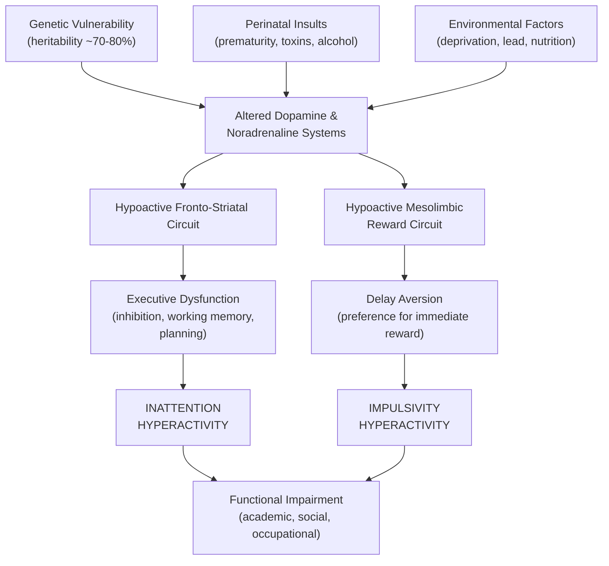

# Attention-Deficit Hyperactivity Disorder (ADHD)

## 1. Definition

Attention-Deficit Hyperactivity Disorder (ADHD) is a **neurodevelopmental disorder** characterised by a persistent pattern of **inattention** and/or **hyperactivity-impulsivity** that is developmentally inappropriate, pervasive across settings, and causes clinically significant functional impairment [1][2].

Let's break down the name:
- **"Attention-deficit"** → the core cognitive problem is a deficit in sustaining and directing attention
- **"Hyperactivity"** → "hyper" (Greek: excessive) + "activity" → excessive motor restlessness
- **"Disorder"** → a syndrome causing functional impairment, not just a personality trait

The key conceptual point: ADHD is **not** about a child being "naughty" or "lazy." It reflects **neurobiological dysfunction** in frontal-subcortical circuits governing executive functions — particularly inhibitory control, working memory, and attentional regulation. Think of it as the brain's "braking system" and "prioritisation system" being underactive [2].

> ***Symptoms are characterized by deficits in both (ICD-10) or one (DSM-5) of: Hyperactivity/impulsivity (usually presents earlier → due to executive inhibition deficits) and Inattention (usually presents later, in school age → due to deficient attention mechanisms). Symptoms are developmentally inappropriate and occur across several settings. Symptoms emerge early by age of 12y (DSM-5) or 6y (ICD-10).*** [1][2]

<Callout title="ICD-10 vs DSM-5 Terminology">
ICD-10 uses the term **"Hyperkinetic Disorder" (F90)** and requires **both** inattention **and** hyperactivity to be present. DSM-5 uses **"ADHD"** and allows diagnosis with **either** domain alone (inattentive, hyperactive-impulsive, or combined presentations). The DSM-5 is more inclusive. ICD-11 has now aligned more closely with DSM-5 by also allowing predominantly inattentive presentations.
</Callout>

---

## 2. Epidemiology

### 2.1 Prevalence

- ***2nd commonest psychiatric disorder of childhood (after anxiety disorders)*** [2]
- Worldwide pooled prevalence: approximately **5–7%** of children and adolescents (meta-analyses) [2]
- ***Prevalence in Hong Kong: 2.2% (males) vs 0.7% (females)*** — note that this likely underestimates true prevalence due to cultural factors and referral patterns [2]
- **Adult ADHD prevalence**: ~2.5–4% of adults globally — a substantial proportion do **not** "grow out of it"
- ***Lower prevalence in low-income countries*** — likely reflects under-recognition rather than true absence [2]

### 2.2 Demographics

- **Sex ratio**: Males > Females, roughly **3:1 in children** (clinic-referred samples); **~2:1** in community samples
  - Why the sex difference? Boys more often present with the hyperactive-impulsive (externalising) type, which is more disruptive and therefore more likely to trigger referral. Girls more often present with the predominantly inattentive (internalising) type — the "quiet daydreamer" — which is **under-recognised** [2]
- ***Age of onset***: arises early in development (before school age): **55–65% by age 7, 93% by age 12, 98% by age 16** [2]
  - DSM-5 requires symptoms present before age **12**
  - ICD-10 requires symptoms present before age **6**

### 2.3 Comorbidities

This is a **critical** exam topic. ADHD rarely travels alone.

> ***Comorbidities are very common (~50% of ADHD cases), especially in severe cases (↑ comorbidities with ↑ number of ADHD symptoms)*** [2]

| Comorbidity | Approximate Frequency | Key Relationship |
|---|---|---|
| ***ODD (Oppositional Defiant Disorder)*** | ***~40%*** | Most common comorbidity; shares externalising trait liability [2] |
| ***Conduct Disorder (CD)*** | ***~20%*** | When ADHD + CD co-occur, prognosis is particularly poor (antisocial trajectory, substance abuse, criminality) [2] |
| ***Learning Disorders*** | ***~25%*** | Specific reading/maths disabilities; separate from ADHD but share genetic risk [2] |
| ***Tic Disorders*** | ***~5%*** | Tourette syndrome overlaps; both involve basal ganglia dysfunction [2] |
| ***Mood Disorders (depression, dysthymia)*** | ***~20%*** | Chronic failure and criticism → demoralisation; also shared genetic vulnerability [2] |
| ***Anxiety Disorders*** | ***~25%*** | Can mimic inattention (distracted by worries rather than external stimuli) [2] |
| ***Substance Abuse (SA)*** | ***~15%*** | Impulsivity → risk-taking; self-medication hypothesis [2] |
| ASD | Variable (~20–50% bidirectional) | Both are neurodevelopmental; share genetic overlap; DSM-5 now allows dual diagnosis |

<Callout title="Overlap Table — Know This for Exams" type="idea">

Many ADHD symptoms overlap with other conditions. The key differentiating feature is **pervasiveness** and **developmental onset**:

| Feature | ADHD | ODD/CD | GAD | Depression | Mania |
|---|---|---|---|---|---|
| ***Restlessness*** | ***✓*** | | ***✓*** | | |
| ***Poor concentration*** | ***✓*** | | ***✓*** | ***✓*** | ***✓*** |
| ***↑ Motor activity*** | ***✓*** | | | | ***✓*** |
| ***Distractibility*** | ***✓*** | | ***✓*** | | ***✓*** |
| ***Irritability*** | | ***✓*** | ***✓*** | ***✓*** | ***✓*** |

[2]

</Callout>

---

## 3. Risk Factors

Think of ADHD risk factors in a biopsychosocial framework, but the **biological factors dominate**:

### 3.1 Biological / Genetic Factors

- ***Heritability is ~70–80%*** — comparable to schizophrenia and bipolar affective disorder. This is one of the **most heritable** psychiatric conditions [2]
  - ***Family studies: ~1/4 of siblings of an ADHD proband also have ADHD*** [2]
  - ***Twin studies: MZ > DZ concordance rates*** (MZ concordance ~70–80%, DZ ~30–40%) [2]
  - ***Implicated genes: common and rare variants affecting dopamine and serotonin (5-HT) systems*** [2]
    - Specific candidate genes: **DRD4** (dopamine receptor D4 — the 7-repeat allele), **DRD5**, **DAT1/SLC6A3** (dopamine transporter gene), **5-HTT/SLC6A4** (serotonin transporter), **SNAP-25** (synaptosomal-associated protein — involved in neurotransmitter release)
    - GWAS studies have identified **polygenic architecture** — many common variants of small effect rather than a single "ADHD gene"

### 3.2 Neurobiological Factors

- ***Clinical signs suggestive of neurodevelopmental impairment/delay: clumsiness, language delay, abnormalities of speech → may result from early developmental insults*** [2]
- ***Structural imaging: ↓ volume/cortical thickness, especially in grey matter of the basal ganglia*** [2]
  - Specifically: reduced volume in the **caudate nucleus, putamen, globus pallidus** and **prefrontal cortex** (PFC)
  - **Cortical maturation delay**: the PFC reaches peak cortical thickness ~3 years later in ADHD children vs. controls — the brain is **not structurally abnormal**, it is **developmentally delayed**
- ***Functional studies: implicated fronto-striatal circuit, cerebellar abnormalities, white matter (WM) disruption and disordered connectivity*** [2]
  - The **fronto-striatal circuit** (PFC → striatum → thalamus → back to PFC) is the brain's "executive control loop" — it governs planning, inhibition, working memory, and attentional set-shifting
  - Cerebellar involvement explains the motor coordination difficulties (clumsiness)
- ***Neurochemistry: hypoactivity of dopamine and noradrenaline in fronto-subcortical circuits → DRI/NRI often useful in ameliorating symptoms*** [2]
  - **Why dopamine?** Dopamine in the PFC modulates "signal-to-noise ratio" of neural signalling — it tells the brain what is important to focus on and what to ignore. Low dopamine = poor signal-to-noise = everything gets equal attention = distractibility
  - **Why noradrenaline?** Noradrenaline (norepinephrine) in the PFC supports sustained attention and arousal. Low noradrenaline = poor sustained attention = "zones out"
  - This explains why **stimulants** (which increase dopamine and noradrenaline) paradoxically **calm down** ADHD patients — they are boosting the underactive "braking" circuits

<Callout title="The Dopamine Hypothesis of ADHD — Key Concept">
The core neurochemical model: **hypo-dopaminergic and hypo-noradrenergic states in the prefrontal cortex** lead to deficient executive control (inhibition, working memory, attention). This is an inverted-U relationship — too little OR too much catecholamine activity in the PFC impairs function. Stimulant medications work by shifting patients from the "too low" side to the optimal zone.
</Callout>

### 3.3 Psychological Factors

- ***Cognitive theories: ADHD is generally conceptualised as originating from deficits in executive functions*** [2]
  - **Barkley's model (1997)**: The core deficit is in **behavioural inhibition** — the inability to delay a prepotent response. This cascades into impairments in:
    - Working memory (can't hold information "online")
    - Self-regulation of affect/motivation/arousal
    - Internalisation of speech (the "inner voice" that guides behaviour)
    - Reconstitution (analysis and synthesis of behaviour — i.e., planning, problem-solving)
  - **Sonuga-Barke's dual-pathway model**: Proposes two distinct pathways:
    1. **Executive dysfunction pathway** (fronto-striatal): leads to cognitive deficits → inattention
    2. **Motivational pathway** (ventral striatal/reward circuit): leads to **delay aversion** — ADHD children prefer immediate small rewards over larger delayed rewards → hyperactivity/impulsivity as an attempt to shorten subjective experience of delay

### 3.4 Social / Environmental Factors

- ***Perinatal factors*** [2]:
  - ***Maternal alcohol and substance abuse during pregnancy*** (fetal alcohol spectrum → executive dysfunction)
  - ***Low birth weight and prematurity*** (associated with white matter injury and PFC underdevelopment)
  - Maternal smoking during pregnancy (nicotine is a dopaminergic agent → prenatal exposure may alter dopamine receptor development)
  - Obstetric complications (hypoxia, infections)

- ***Environmental factors*** [2]:
  - ***Early psychosocial adversities (e.g., children raised in extreme deprivation)*** — e.g., Romanian orphan studies showed high rates of ADHD-like symptoms in severely deprived children
  - ***Nutritional deficiencies and exposure to environmental toxins*** — particularly **lead exposure** (lead disrupts dopaminergic neurotransmission) and **iron/zinc deficiency** (cofactors in catecholamine synthesis)
  - Excessive screen time in early childhood (controversial, but may exacerbate attentional difficulties via reinforcement of rapid attention-switching)
  - Food additives / artificial colourings — modest evidence for exacerbating symptoms in some children, but **not** considered a primary cause

<Callout title="Note on Causation" type="error">
A common exam mistake: ADHD is NOT caused by "bad parenting." While adverse parenting can worsen symptoms and outcomes, the primary drivers are neurobiological and genetic. Conversely, excellent parenting and structured environments can significantly mitigate symptoms — this is the basis for behavioural interventions.
</Callout>

---

## 4. Anatomy and Neurobiological Basis

Understanding the anatomy helps everything else make sense — the clinical features, the pharmacology, and the comorbidities.

### 4.1 Key Brain Regions

| Brain Region | Normal Function | Dysfunction in ADHD |
|---|---|---|
| **Prefrontal Cortex (PFC)** — especially dorsolateral PFC (dlPFC) and ventromedial PFC (vmPFC) | Executive functions: planning, working memory, sustained attention, inhibition, decision-making | ↓ Activation → poor inhibition, distractibility, poor planning, impulsive decision-making |
| **Basal Ganglia** (caudate, putamen, globus pallidus) | Motor programme selection; gating of actions through the thalamus; reward processing | ***↓ Volume*** [2]; impaired action selection → motor restlessness, inability to suppress inappropriate actions |
| **Anterior Cingulate Cortex (ACC)** | Error monitoring, conflict detection, motivation | ↓ Activity → failure to detect errors (careless mistakes), poor motivation for effortful tasks |
| **Cerebellum** | Motor coordination, timing, procedural learning | ***Cerebellar abnormalities*** [2] → clumsiness, poor timing, difficulty with sequencing |
| **Corpus Callosum** | Inter-hemispheric communication | Reduced size in some ADHD studies → disordered connectivity |

### 4.2 Key Circuits

1. **Fronto-striatal (executive) circuit**: PFC → caudate/putamen → globus pallidus → thalamus → PFC
   - Governs: cognitive control, inhibition, working memory
   - Neurotransmitter: **Dopamine** (D1 receptors in PFC for "stay on task"; D2 in striatum for action selection)

2. **Fronto-cerebellar circuit**: PFC → pons → cerebellum → thalamus → PFC
   - Governs: motor timing, procedural learning
   - Dysfunction → clumsiness, difficulty with time perception

3. **Mesolimbic (reward) circuit**: VTA → nucleus accumbens → PFC
   - Governs: motivation, reward anticipation, delay tolerance
   - Dysfunction → **delay aversion**, preference for immediate reward, poor sustained motivation

### 4.3 Neurotransmitters

| Neurotransmitter | Role in ADHD | Therapeutic Implication |
|---|---|---|
| **Dopamine (DA)** | ***Hypoactive in PFC and striatum*** → poor signal-to-noise, impaired inhibition, reward deficiency | Stimulants (methylphenidate, amphetamines) → **block dopamine reuptake transporter (DAT)** → ↑ synaptic DA |
| **Noradrenaline (NA)** | ***Hypoactive in PFC*** → poor sustained attention and arousal | Stimulants also ↑ NA; atomoxetine (selective NRI) specifically targets this pathway |
| Serotonin (5-HT) | Modulates impulsivity and emotional regulation | Less directly targeted; some genetic variants in 5-HT system implicated [2] |

---

## 5. Classification

### 5.1 DSM-5 Presentations (Specifiers)

DSM-5 uses the term **"presentation"** rather than "subtype" because the presentation can change over a patient's lifetime (e.g., a child with combined type may present as predominantly inattentive in adulthood as hyperactivity diminishes):

| Presentation | Criteria | Typical Profile |
|---|---|---|
| ***Predominantly Inattentive*** | ≥ 6/9 inattention criteria (≥ 5 if age ≥ 17) | "The daydreamer" — quiet, disorganised, forgetful; more common in girls; often diagnosed later |
| ***Predominantly Hyperactive-Impulsive*** | ≥ 6/9 hyperactivity-impulsivity criteria (≥ 5 if age ≥ 17) | "The whirlwind" — constantly moving, can't wait; more common in young children (pre-school) |
| ***Combined*** | Meets criteria for **both** | Most common presentation overall; most likely to be referred |

### 5.2 ICD-10 Classification (Hyperkinetic Disorder, F90)

- **F90.0 Disturbance of activity and attention** (= ADHD combined type, without conduct disorder)
- **F90.1 Hyperkinetic conduct disorder** (= ADHD + comorbid conduct disorder — a distinctly poor-prognosis group)
- **F90.8 Other hyperkinetic disorders**
- **F90.9 Hyperkinetic disorder, unspecified**

> Note: ICD-10 requires **both** inattention **and** hyperactivity → it is a **narrower** definition than DSM-5 and essentially only captures the "combined" and "hyperactive" presentations. ICD-10 does not formally recognise a "predominantly inattentive" subtype under F90.

### 5.3 ICD-11 Update

ICD-11 (now in use) has aligned with DSM-5 by recognising:
- Predominantly inattentive presentation
- Predominantly hyperactive-impulsive presentation
- Combined presentation
- This is a significant update for clinical practice in jurisdictions using ICD.

### 5.4 DSM-5 Severity Specifiers

- **Mild**: Few symptoms beyond minimum criteria; minor functional impairment
- **Moderate**: Between mild and severe
- **Severe**: Many symptoms beyond minimum criteria OR marked impairment in multiple domains (social, academic, occupational)

---

## 6. Clinical Features

The cardinal features of ADHD can be organised into **three domains**: **inattention**, **hyperactivity**, and **impulsivity**. These must be:
- ***Pervasive (across situations)*** — not just at school or just at home [2]
- ***Early onset (< 6y in ICD-10, < 12y in DSM-5)*** [2]
- **Developmentally inappropriate** — beyond what is expected for the child's age and IQ
- **Causing functional impairment** in ≥ 2 settings

### 6.1 Symptoms — Inattention Domain

> ***Inattention presents later in school-age; best assessed at P1 (Primary 1)*** — because this is when sustained attention demands increase significantly and the deficit becomes apparent [2]

| Symptom | Description | Pathophysiological Basis |
|---|---|---|
| ***Poor persistence towards goals and tasks*** | Cannot sustain attention on homework, chores, conversations; "zones out" mid-task | Hypoactive PFC (dlPFC) → impaired **sustained attention** and working memory; the dopamine "signal" that says "this task is important, keep going" is too weak |
| ***↓ Attention to details, careless mistakes*** | Makes errors in schoolwork that seem avoidable; skips steps | Impaired **anterior cingulate cortex (ACC)** error-monitoring; inadequate dopamine in PFC → poor top-down attentional control → misses fine details |
| Difficulty listening when spoken to directly | Appears "not to hear" even when there is no auditory problem | Not an auditory deficit — it is a **filtering deficit**: low DA in PFC means the brain cannot prioritise the speaker's voice over background stimuli |
| Fails to follow through on instructions | Starts tasks but doesn't finish; loses track of multi-step instructions | Impaired **working memory** (a PFC-mediated executive function); cannot hold the instruction sequence "online" |
| Difficulty organising tasks and activities | Messy desk, chaotic schedule, poor time management | PFC-mediated **planning and sequencing** deficit |
| Avoids tasks requiring sustained mental effort | Refuses or procrastinates on homework, reading, paperwork | **Delay aversion** (mesolimbic pathway) — effortful tasks with delayed reward are aversive; also genuine cognitive fatigue from compensatory effort |
| Loses things necessary for tasks | Loses pencils, books, phone, keys | Poor **prospective memory** (remembering to remember) — PFC dysfunction |
| ***Easily distracted by extraneous stimuli*** | Head turns at every noise; mind wanders during lessons | Impaired **selective attention / attentional gating** — the PFC normally suppresses irrelevant sensory input; low catecholamines → failure of this gating → all stimuli compete equally |
| Forgetful in daily activities | Forgets appointments, chores, bringing items to school | Impaired **working memory** and **prospective memory** (PFC-dependent) |

### 6.2 Symptoms — Hyperactivity Domain

> ***Hyperactivity usually presents earlier than inattention → due to executive inhibition deficits*** [1][2]

| Symptom | Description | Pathophysiological Basis |
|---|---|---|
| ***Fidgets with or taps hands/feet, squirms in seat*** | Constant small movements; cannot sit still | Impaired **motor inhibition** via fronto-striatal circuit; the basal ganglia cannot adequately suppress unwanted motor programmes → excess motor output |
| ***Leaves seat when remaining seated is expected*** | Gets up in class, meetings, cinema | Same motor inhibition deficit; also may represent **stimulation-seeking** — moving provides sensory input that partially compensates for hypo-aroused PFC |
| ***Runs about or climbs in inappropriate situations*** | In younger children: climbing furniture, running in corridors; in adolescents/adults: subjective feelings of restlessness | Excessive motor drive due to disinhibited motor circuits; in adults, the overt motor behaviour diminishes but the **internal restlessness** persists |
| ***Unable to play or engage in leisure activities quietly*** | Loud play, constant commentary | Impaired regulation of motor output and arousal; low PFC inhibitory tone → cannot modulate activity level to context |
| ***"On the go" or "driven by a motor"*** | Relentless activity from morning to night; exhausting for parents and teachers | Reflects chronically **hypo-aroused PFC** — the child is unconsciously trying to increase arousal through constant movement (a compensatory mechanism) |
| ***Talks excessively*** | Unceasing chatter; cannot stop talking even when told to | Impaired **verbal inhibition** (a PFC executive function); also related to impulsivity — the "brakes" on speech output are weak |

### 6.3 Symptoms — Impulsivity Domain

| Symptom | Description | Pathophysiological Basis |
|---|---|---|
| ***Blurts out answers before questions are completed*** | Shouts out in class; finishes other people's sentences | Impaired **response inhibition** (the ability to withhold a prepotent response) — this is the core executive deficit in Barkley's model; fronto-striatal "braking" failure |
| ***Difficulty waiting their turn*** | Cannot queue; wants everything "now" | **Delay aversion** (mesolimbic reward pathway dysfunction) — waiting is experienced as intensely unpleasant because the brain cannot tolerate the absence of immediate reward |
| ***Interrupts or intrudes on others*** | Butts into conversations and games; uses others' things without permission | Impaired social inhibition — the PFC normally applies "social brakes" to prevent inappropriate behaviour; low catecholamines → these brakes are weak |

### 6.4 Associated Features and Signs

Beyond the core triad, there are important associated features:

| Feature | Explanation |
|---|---|
| ***Disinhibition in social relationships*** | Acts overly familiar with strangers; no sense of social distance — reflects PFC-mediated social cognition impairment [2] |
| ***Recklessness in dangerous situations*** | Crosses roads without looking; climbs to dangerous heights — impaired risk assessment (vmPFC dysfunction) [2] |
| ***Impulsive flouting of social rules*** | Breaking rules not out of defiance (cf. ODD) but out of failure to inhibit the impulse [2] |
| ***Motor clumsiness*** | ***Clumsiness, language delay, abnormalities of speech*** — neurodevelopmental soft signs reflecting cerebellar and motor cortex immaturity [2] |
| ***Learning disorders*** | ***Occur with undue frequency and should be noted separately*** [2]; often co-exist because of shared frontal dysfunction, but are distinct diagnoses |
| Emotional dysregulation | Low frustration tolerance, anger outbursts, mood lability — increasingly recognised as a core feature rather than just a comorbidity; reflects impaired PFC regulation of limbic system |
| Sleep difficulties | Difficulty settling at night (the "revving brain"), delayed sleep onset; affects ~25–50% of ADHD children |
| Low self-esteem | Secondary to chronic academic failure, social rejection, and frequent criticism from adults |

### 6.5 Clinical Features by Developmental Stage

Understanding how ADHD manifests across the lifespan is crucial:

#### Pre-school (ages 3–5)
- Predominant presentation: **hyperactivity** and **impulsivity** (inattention is difficult to assess at this age because of wide normal variation)
- Features: constant running, climbing, inability to sit for stories; frequently "into everything"; accident-prone
- ***Only extreme levels should lead to a diagnosis in preschool children*** [2] — the normal range of activity is very wide at this age

#### School-age (ages 6–12) — the "classic" presentation
- All three domains become apparent: inattention becomes prominent as academic demands increase
- ***Best assessed at P1 (Primary 1) — it usually takes a few weeks for new P1 students to learn to comply with classroom rules*** [2]
- Functional impact: academic underachievement, peer rejection (due to intrusiveness), teacher frustration, parental stress
- ***Childhood functional impairment: school failure, injuries*** [2]

#### Adolescence
- ***Hyperactivity tends to diminish*** (becomes more of an internal restlessness)
- Inattention and impulsivity persist and cause increasing problems as academic demands rise
- Risk-taking behaviours emerge (substance experimentation, reckless driving, unprotected sex)
- Comorbid mood/anxiety disorders and oppositional behaviours often intensify

#### Adulthood

> ***~50% retain full diagnostic criteria in adolescence; ~40–60% experience problems in adulthood*** [2]

***The presentation of ADHD changes qualitatively in adulthood*** [2]:

| Domain | ***Childhood Manifestation*** | ***Adult Manifestation*** |
|---|---|---|
| ***Inattention*** | ***Difficulty sustaining attention; doesn't listen; no follow-through; cannot organise; loses important items; easily distractible; forgetful*** | ***Difficulty sustaining attention in meetings, reading or paperwork; paralyzing procrastination; slowness, inefficiency; poor time management; disorganisation*** [2] |
| ***Hyperactivity*** | ***Squirms and fidgets; can't stay seated; runs/climbs excessively; can't play/work quietly; "on the go"; talks excessively*** | ***Workaholic; overscheduled and overwhelmed; self-select very active jobs; constant activity leading to family tension; talks excessively*** [2] |
| ***Impulsivity*** | ***Blurts out answers; can't wait turns; intrudes or interrupts others*** | ***Mainly as low frustration tolerance; losing temper; quitting jobs; ending relationships; driving too fast; addictive personality*** [2] |

> ***"When deadlines cannot be met, they often then choose to procrastinate indefinitely instead of embarking on work."*** [2]

<Callout title="Adult ADHD — Don't Miss This" type="error">
Adult ADHD is commonly missed because:
1. Hyperactivity is less overt — adults fidget internally rather than running around
2. Adults develop compensatory strategies that partially mask symptoms
3. Clinicians may attribute symptoms to depression, anxiety, or personality traits
4. The patient may not recall childhood symptoms (collateral history from parents is essential)

***Diagnosis of hyperkinetic disorder can still be made in adult life. The grounds are the same, but attention and activity must be judged with reference to developmentally appropriate norms.*** [2]
</Callout>

### 6.6 Course and Prognosis

- ***Course: generally shows age-dependent ↓ severity (hyperactivity > impulsiveness > inattention)*** — hyperactivity is the first to improve, impulsivity partially improves, inattention is the most persistent [2]
- ***~50% retain full diagnostic criteria in adolescence*** [2]
- ***~40–60% experience problems in adulthood*** [2]
- ***Poor prognostic factors: learning difficulties, antisocial behaviour, severe overactivity*** [2]
- ***In particular, when comorbid with CD, patients are at risk of antisocial behaviour, criminal behaviours, and substance abuse*** [2]

> ***When hyperkinesis was present in childhood but has disappeared and been succeeded by another condition, such as dissocial personality disorder or substance abuse, the current condition rather than the earlier one is coded.*** [2]

### 6.7 Functional Impairment

| Life Domain | Impact |
|---|---|
| Academic | Underachievement relative to IQ; grade retention; school dropout |
| Social | Peer rejection (intrusiveness, turn-taking difficulty); difficulty maintaining friendships |
| Family | Parental stress; sibling conflict; marital strain from managing the child |
| Safety | ***Injuries/accidents*** from impulsivity and risk-taking [2] |
| Occupational (adults) | ***Occupational failure, self-esteem issues, relationship problems, substance abuse, injuries/accidents*** [2] |
| Legal | Higher rates of traffic violations, arrests (especially when comorbid with CD) |
| Emotional | Low self-esteem, demoralisation, secondary depression |

---

## 7. Summary of Etiology and Pathophysiology — Integrated Model

---

<Callout title="High Yield Summary">

1. **Definition**: ADHD is a neurodevelopmental disorder of inattention ± hyperactivity-impulsivity, pervasive across settings, with early onset (< 12y DSM-5, < 6y ICD-10), causing functional impairment.

2. **Epidemiology**: 2nd commonest childhood psychiatric disorder; M > F (3:1); prevalence ~5–7% in children; ~50% comorbid with other disorders (ODD ~40%, CD ~20%, learning disorders ~25%, anxiety ~25%, mood ~20%).

3. **Pathophysiology**: Hypoactive dopamine and noradrenaline in fronto-striatal and mesolimbic circuits → executive dysfunction (poor inhibition, working memory, attention) + delay aversion.

4. **Genetics**: Heritability ~70–80%; polygenic; involves dopamine and serotonin system genes.

5. **Neuroimaging**: ↓ Volume in basal ganglia and PFC; delayed cortical maturation; disrupted fronto-striatal connectivity.

6. **Three symptom domains**: Inattention (presents later, most persistent), Hyperactivity (presents first, improves most with age), Impulsivity (intermediate trajectory).

7. **Lifespan**: Hyperactivity > impulsivity > inattention in age-dependent improvement; ~50% retain criteria in adolescence; ~40–60% have adult functional impairment.

8. **ICD-10 vs DSM-5**: ICD-10 (Hyperkinetic Disorder, F90) requires BOTH inattention + hyperactivity; DSM-5 allows EITHER domain; ICD-11 has aligned with DSM-5.

9. **Key comorbidity to remember**: ADHD + CD = worst prognosis (antisocial trajectory, substance abuse, criminality).

10. **Adult ADHD**: Presents differently — internalised restlessness, procrastination, poor time management, relationship instability, low frustration tolerance.

</Callout>

---

<ActiveRecallQuiz
  title="Active Recall - ADHD Definition, Epidemiology, Aetiology & Clinical Features"
  items={[
    {
      question: "What is the heritability of ADHD, and which neurotransmitter systems are primarily implicated?",
      markscheme: "Heritability ~70-80%. Dopamine and noradrenaline (and serotonin) systems are implicated. Specifically, hypoactivity of dopamine and noradrenaline in fronto-subcortical circuits."
    },
    {
      question: "Which symptom domain of ADHD presents earliest in development, and which is most persistent into adulthood? Explain why.",
      markscheme: "Hyperactivity-impulsivity presents earliest (due to executive inhibition deficits, which are demanding even in unstructured pre-school settings). Inattention is most persistent into adulthood because sustained attention demands increase with age and compensatory hyperactivity diminishes. Age-dependent improvement order: hyperactivity > impulsivity > inattention."
    },
    {
      question: "Name 5 common comorbidities of ADHD and their approximate frequencies.",
      markscheme: "ODD (~40%), Conduct Disorder (~20%), Learning Disorders (~25%), Anxiety Disorders (~25%), Mood Disorders (~20%), Tic Disorders (~5%), Substance Abuse (~15%). Any 5 with approximate frequencies."
    },
    {
      question: "Explain why stimulant medications paradoxically calm down children with ADHD rather than making them more hyperactive.",
      markscheme: "The PFC is hypo-aroused due to low dopamine/noradrenaline. Stimulants increase catecholamine levels in the PFC, boosting the 'braking' and 'filtering' circuits. This improves signal-to-noise ratio, enhances inhibitory control, and reduces the need for compensatory stimulation-seeking behaviour (hyperactivity). The child becomes calmer because the executive control system is now adequately powered."
    },
    {
      question: "How does the clinical presentation of ADHD differ between children and adults? Give two examples for each symptom domain.",
      markscheme: "Inattention: Children - does not follow through on instructions, loses things; Adults - paralyzing procrastination, poor time management. Hyperactivity: Children - runs/climbs excessively, cannot sit still; Adults - workaholic, self-selects active jobs. Impulsivity: Children - blurts out answers, cannot wait turns; Adults - low frustration tolerance, quitting jobs/ending relationships impulsively."
    },
    {
      question: "What is the key distinguishing feature between inattention caused by ADHD vs inattention caused by anxiety?",
      markscheme: "In ADHD, distraction is by external stimuli, new activities, or preoccupation with enjoyable activities. In anxiety, distraction is by internal worrying themes (the focus of anxiety). Also, ADHD inattention is pervasive and onset in early childhood, whereas anxiety-related inattention may fluctuate with anxiety severity."
    }
  ]}
/>

## References

[1] Senior notes: ryanho-psych.md (Section 12.3 - summary table of childhood psychiatric disorders)
[2] Senior notes: ryanho-psych.md (Section 12.3 - Attention-deficit Hyperactivity Disorder)
