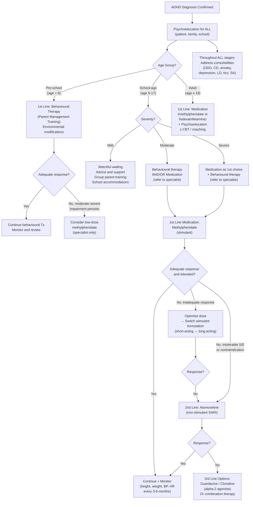

## Management of ADHD

### Guiding Principles

Before diving into specifics, let's understand **why** ADHD management is structured the way it is. From first principles:

1. **ADHD is a chronic neurodevelopmental condition**, not an acute illness. Management is long-term — think of it like managing hypertension or diabetes, not treating pneumonia.
2. **The neurobiological deficit** (hypo-dopaminergic/noradrenergic fronto-striatal circuits) is amenable to pharmacological correction — this is why medications are so effective.
3. **The functional impairment** spans multiple domains (academic, social, family, emotional) — this is why psychosocial interventions are needed alongside medication.
4. **Comorbidities are the rule**, not the exception (~50%) — these must be addressed simultaneously or treatment will be suboptimal.

> ***Approach to management: individualised comprehensive multimodal treatment programme*** [2]
> - ***Pre-school: usually behaviour therapy as mainstay***
> - ***School age: usually a combination of medications + psychosocial therapy***
> - ***Management of comorbidities, e.g., ASD, ODD/CD, mood disorder, anxiety disorders*** [2]

The **MTA Study** (Multimodal Treatment Study of Children with ADHD, 1999) — the largest and most influential ADHD treatment trial — established that:
- **Medication alone** was superior to **behavioural therapy alone** for core ADHD symptoms
- **Combined treatment** (medication + behavioural therapy) was superior to medication alone for certain outcomes (comorbid anxiety, oppositional behaviour, parent-child relationships, academic achievement)
- Both medication and combined treatment were superior to routine community care

This is the evidence base behind the multimodal approach.

---

### Management Algorithm

---

### Stepwise Approach by Severity and Age

#### Step 0: Psychoeducation (for ALL patients, regardless of severity)

This is the foundation of management. Before any specific intervention, the child, family, and school must understand what ADHD is and what it is not.

| Component | Content | Why It Matters |
|---|---|---|
| **For parents** | ADHD is a neurobiological condition, not "bad parenting" or "laziness." Explain the dopamine/noradrenaline model simply. Set realistic expectations. | Reduces parental guilt and blame; improves treatment adherence; empowers parents as partners |
| **For the child** | Age-appropriate explanation: "Your brain works differently — it's harder for you to put the brakes on." Normalise the condition. | Reduces self-blame and shame; builds self-esteem; increases engagement with treatment |
| **For teachers/school** | Explain the condition, the need for accommodations, and the expected effects of treatment | Ensures pervasive support; prevents punitive approaches that worsen outcomes |

#### Step 1: By Age Group

##### Pre-school (age < 6)

> ***Pre-school: usually behaviour therapy as mainstay*** [2]

**Why not medications first in preschoolers?**
- The evidence base for stimulant safety and efficacy is stronger for school-age children
- Preschool ADHD has a wider differential (normal developmental variation is broad at this age)
- Behavioural interventions are effective at this age because parents can control more of the environment
- Side effects (appetite suppression, growth deceleration) are of greater concern in younger children
- If behavioural therapy is insufficient and symptoms are moderate-severe, low-dose methylphenidate can be considered by a specialist (NICE 2024 guidelines)

##### School-age (age 6–17)

Management is guided by severity:

| Severity | First-Line Approach | Rationale |
|---|---|---|
| ***Mild*** | ***Advice, support, watchful waiting; offer group parent training*** [2]; school accommodations | Many mild cases can be managed with environmental modifications and behavioural strategies alone |
| ***Moderate*** | ***Refer to specialists at school age for behavioural therapy or medications*** [2] | The MTA study showed medication is more effective than behavioural therapy alone for core symptoms, but combined treatment gives the best all-round outcomes |
| ***Severe*** | ***Refer to specialists for medications as 1st choice*** [2] | When functional impairment is severe, the fastest and most effective way to restore function is medication. Behavioural therapy alone is insufficient for severe ADHD. |

##### Adults (age ≥ 18)

- **1st line: Medication** (methylphenidate or lisdexamfetamine) + psychoeducation
- **Adjunctive**: CBT adapted for adult ADHD (focuses on organisational skills, time management, emotional regulation, cognitive restructuring)
- **Coaching**: ADHD coaching targets practical daily-life skills
- NICE (2024) recommends medication as first-line for adults (behavioural therapy alone is insufficient in most adult cases)

---

### Pharmacological Management

> ***Medications: very effective (most effective among all psychotropics) → more effective than psychosocial treatment*** [2]

This is a remarkable statement and worth emphasising: ADHD medications have among the **largest effect sizes** of any psychotropic medication in all of psychiatry. Stimulants for ADHD (effect size ~1.0) are more effective than SSRIs for depression (effect size ~0.3–0.5), antipsychotics for schizophrenia (effect size ~0.5), or lithium for bipolar disorder.

#### A. Stimulants (First-Line)

##### Methylphenidate — the workhorse

"Methyl-phenidate" → a piperidine derivative structurally related to amphetamine

> ***MoA: ↑ availability of central dopamine and noradrenaline → CNS stimulant*** [2]

**Mechanism in detail**: Methylphenidate primarily **blocks the dopamine transporter (DAT)** and the **noradrenaline transporter (NET)** at the presynaptic terminal. By preventing reuptake, it increases the concentration of dopamine and noradrenaline in the synaptic cleft, particularly in the **prefrontal cortex** and **striatum**. This boosts the "signal-to-noise ratio" of neural signalling in the fronto-striatal circuit → improved inhibitory control, sustained attention, and working memory.

**Why does a "stimulant" calm down a hyperactive child?** — The paradox is explained by the inverted-U model: the ADHD brain is **understimulated** in the PFC. The stimulant brings catecholamine levels from "too low" to "optimal," thereby *activating* the brain's inhibitory control systems. The child becomes calmer because the executive "brakes" are now powered on.

> ***Efficacy: very effective with effect size of 1.0; ↓ restlessness, ↓ aggression, ↑ attention (but ? long-term outcome)*** [2]

The question mark about long-term outcome is important: while stimulants are highly effective in the short-to-medium term, the MTA study's long-term follow-ups showed that initial medication advantages diminished over time (possibly due to adherence issues, dose adjustments, and the natural course of the condition).

##### Methylphenidate Formulations

| ***Formulation*** | ***Drug Type*** | ***Onset*** | ***Duration*** | ***Doses Per Day*** | ***Common Side Effects*** | ***Uncommon Side Effects*** | ***Effect Size*** |
|---|---|---|---|---|---|---|---|
| ***Ritalin (methylphenidate IR)*** | ***CNS stimulant*** | ***20–60 min*** | ***1–4 hours*** | ***More than once daily*** | ***Decreased appetite, weight loss, insomnia, headache, abdominal pain, irritability, mood swing*** | ***Motor tics, tachycardia*** | ***1.0*** |
| ***Ritalin LA (methylphenidate ER)*** | ***CNS stimulant*** | ***20–60 min*** | ***8 hours*** | ***Once daily*** | ***Side effects similar to Ritalin*** | | ***1.0*** |
| ***Concerta (methylphenidate OROS)*** | ***CNS stimulant*** | ***30 min – 2 hours*** | ***12 hours*** | ***Once daily*** | ***Side effects similar to Ritalin, but relatively milder*** | | ***1.0*** |

[2]

> ***Dosing: avoid dosing after 5pm in primary school and 6pm in secondary school → ↓ insomnia*** [2]

**Why?** — Methylphenidate's stimulant effect interferes with sleep initiation. If the last dose wears off by bedtime, the child can fall asleep. Dosing too late in the day causes the stimulant to still be active at bedtime → insomnia → next-day fatigue → worsened ADHD symptoms. This creates a vicious cycle.

> ***Short-acting: require multiple dosing but easier to titrate to fit the child's schedule (e.g., allow off-drugs at home in the afternoon → avoid insomnia)*** [2]

> ***Long-acting: can be dosed once daily but may have ↑ side effects later in the day*** [2]

**Practical choice**: Short-acting (Ritalin IR) is useful for initial titration and when flexible dosing is needed (e.g., medication-free weekends or afternoons). Long-acting (Ritalin LA, Concerta) is preferred for maintenance because:
- Once-daily dosing → better adherence (the child doesn't need to take medication at school)
- More consistent blood levels → smoother symptom control without peaks and troughs
- Avoids the stigma of taking medication in front of peers at school

##### Side Effects of Stimulants

> ***Side effects: irritability, depression, insomnia, poor appetite (with ↓ height/weight growth), ↑ tic disorders*** [2]

| Side Effect | Mechanism | Management |
|---|---|---|
| **↓ Appetite / weight loss** | DA in the hypothalamic appetite centres suppresses hunger signals | Give medication with/after meals; encourage calorie-dense breakfast before medication kicks in; "drug holidays" (weekends/school holidays) to allow catch-up growth |
| **Insomnia** | Stimulant effect on ascending reticular activating system; DA/NA in wake-promoting circuits persist into evening | Avoid late dosing; switch to shorter-acting formulation if long-acting causing issues; consider adding melatonin for sleep onset |
| **Growth deceleration** | Combination of ↓ caloric intake + possible direct GH suppression (controversial) | Monitor height/weight on growth charts every 3–6 months; consider drug holidays during school vacations; generally, final adult height is minimally affected (1–3 cm reduction) |
| **Irritability / mood lability** | "Rebound effect" as medication wears off → acute catecholamine drop; or dose too high → overstimulation | Smooth the transition with overlapping doses or switch to longer-acting formulation; reduce dose if overstimulated |
| ***↑ Tic disorders*** | Stimulants may unmask or exacerbate pre-existing tic vulnerability (dopaminergic activation of basal ganglia) [2] | Monitor; if tics emerge or worsen, consider reducing dose, switching to atomoxetine, or adding an alpha-2 agonist (clonidine/guanfacine) which treats both ADHD and tics |
| **↑ HR, ↑ BP** | Sympathomimetic effect (peripheral NA release) | Monitor HR/BP regularly; avoid in uncontrolled hypertension or significant cardiac disease |
| **Headache, abdominal pain** | Sympathomimetic GI effects; tension-type headache from vasoconstriction | Usually transient; manage symptomatically; may resolve with dose adjustment |

##### Contraindications / Cautions for Stimulants

| Contraindication | Reason |
|---|---|
| **Structural cardiac disease, cardiomyopathy, serious arrhythmias** | Sympathomimetic effects → ↑ risk of sudden cardiac death in those with underlying structural heart disease |
| **Uncontrolled hypertension** | Stimulants ↑ BP → risk of hypertensive crisis |
| **Phaeochromocytoma** | Catecholamine-secreting tumour + exogenous catecholamine enhancement → hypertensive emergency |
| **Hyperthyroidism** | Already hypersympathetic state → additive effects |
| **Concurrent MAOIs** | Both increase catecholamines → risk of hypertensive crisis; must wait ≥ 14 days after stopping MAOIs |
| **Psychosis** | Dopamine agonism can exacerbate psychotic symptoms |
| **Caution: Tic disorders** | May unmask or worsen tics (though this is debated — many children with tics tolerate stimulants well under monitoring) |
| ***Caution: Family history of substance abuse*** | ***Use when stimulants are not appropriate, e.g., FHx of SA*** [2] — diversion/misuse risk; consider non-stimulant alternatives |

##### Amphetamines (Alternative Stimulant)

- **Lisdexamfetamine (Vyvanse/Elvanse)**: a **prodrug** — "lis" = lysine; the drug is inactive until cleaved by red blood cell enzymes to release d-amphetamine. This provides a smoother onset and longer duration (~13 hours), and reduced abuse potential (cannot be "snorted" or injected effectively because it requires enzymatic activation).
  - MoA: Promotes release of DA and NA from presynaptic terminals (in addition to reuptake inhibition) → more potent than methylphenidate
  - Effect size: ~1.0 (comparable to methylphenidate)
  - NICE (2024): lisdexamfetamine is 1st-line alongside methylphenidate for adults; 2nd-line for children if methylphenidate is not tolerated or ineffective
  - Available in HK

- **Dexamfetamine (Dexedrine)**: short-acting amphetamine; available but less commonly used as first-line

> ***Dexmethylphenidate (Focalin)*** — mentioned in notes as an alternative psychostimulant [2]. This is the pharmacologically active d-enantiomer of methylphenidate (the l-enantiomer is thought to be less active). Available in some jurisdictions but less commonly used in HK.

---

#### B. Non-Stimulants (Second-Line)

##### Atomoxetine (Strattera)

"Atomoxetine" → a selective **noradrenaline reuptake inhibitor (NRI)**. Though sometimes classified as an SNRI, it has minimal serotonergic activity at therapeutic doses — it primarily blocks the NET.

| Property | Detail |
|---|---|
| ***Drug type*** | ***Non-stimulant*** [2] |
| ***MoA*** | ***↑ availability of central dopamine and noradrenaline*** [2] — specifically, by blocking NET in the PFC. In the PFC, there is sparse DAT expression, so DA clearance in the PFC actually occurs via NET. Therefore, blocking NET in the PFC increases **both** NA and DA there — clever pharmacology! |
| ***Onset*** | ***4–6 weeks*** [2] — much slower than stimulants (which work within 30–60 minutes). This is because atomoxetine works through gradual receptor adaptation, similar to SSRIs in depression |
| ***Duration*** | ***24 hours*** [2] — continuous coverage; no "rebound" effect |
| ***Dosing*** | ***Once daily*** [2] |
| ***Efficacy*** | ***Effect size ~0.7*** [2] — less effective than stimulants (1.0) but still clinically meaningful |
| ***Common side effects*** | ***Epigastric discomfort, nausea/vomiting, sedation, decreased appetite, dizziness, mood swing*** [2] |
| ***Uncommon side effects*** | ***Deranged liver function*** [2] |

> ***Use: used when stimulants are not appropriate, e.g., FHx of SA, tic disorder, unresponsive to stimulants*** [2]

**Why is atomoxetine preferred over stimulants in these situations?**
- **FHx of substance abuse**: Atomoxetine has **zero abuse potential** (it is not a controlled substance). Stimulants, being dopaminergic, have euphorigenic and reinforcing properties → risk of misuse or diversion, especially in families with substance abuse [2]
- **Tic disorder**: Atomoxetine does not exacerbate tics (and may modestly improve them), whereas stimulants can worsen tics in some patients
- **Comorbid anxiety**: Atomoxetine may have anxiolytic effects (NA modulation in the PFC can reduce anxiety), making it preferred when ADHD coexists with significant anxiety
- **Need for 24-hour coverage**: The continuous action means coverage extends to evenings and mornings (homework time, family time) without multiple dosing

**Serious rare side effect — Hepatotoxicity:**

> ***Severe liver damage (1/50,000)*** [2]

This is why baseline LFTs are recommended before starting atomoxetine. Patients/parents should be counselled to report signs of hepatic dysfunction: jaundice, dark urine, abdominal pain, unexplained nausea, pruritus.

**Other important safety concern — Suicidality:**
- Atomoxetine carries an FDA black box warning for increased suicidal ideation in children and adolescents (similar to SSRIs)
- This is rare but must be monitored, especially in the first few months of treatment

##### Contraindications for Atomoxetine

| Contraindication | Reason |
|---|---|
| Concurrent MAOIs | Both enhance catecholamines → hypertensive risk |
| Narrow-angle glaucoma | NA-mediated mydriasis can precipitate acute angle closure |
| Severe hepatic impairment | Hepatically metabolised; risk of accumulation and toxicity |
| Phaeochromocytoma | NA enhancement in the setting of a catecholamine-secreting tumour |

---

#### C. Alpha-2 Adrenergic Agonists (Third-Line / Adjunctive)

> ***α₂-agonists, e.g., clonidine, guanfacine*** [2]

These are sometimes called "third-line" agents but are increasingly used as **adjunctive therapy** alongside stimulants.

| Property | Clonidine | Guanfacine (Intuniv) |
|---|---|---|
| **MoA** | Non-selective α₂-agonist → stimulates presynaptic α₂A-receptors in the **locus coeruleus** → ↓ NA firing; stimulates postsynaptic α₂A-receptors in the **PFC** → improves signal transduction in prefrontal circuits → ↑ working memory, ↓ distractibility | **Selective α₂A-agonist** → more targeted action at PFC postsynaptic receptors; less sedation than clonidine because it doesn't hit other α₂ subtypes as much |
| **Efficacy** | Modest (effect size ~0.3–0.5); primarily ↓ hyperactivity, impulsivity, aggression; less effect on inattention | Moderate (effect size ~0.5–0.6); improves both inattention and hyperactivity-impulsivity |
| **Indications** | Adjunct to stimulant when partial response; monotherapy if stimulants/atomoxetine not tolerated; comorbid tic disorder (clonidine ↓ tics); comorbid insomnia (sedative effect useful for stimulant-induced insomnia) | Extended-release guanfacine (Intuniv) is FDA-approved as monotherapy or adjunct for ADHD in children ≥ 6 years |
| **Side effects** | Sedation (major), hypotension, bradycardia, dry mouth, rebound hypertension if stopped abruptly | Sedation (less than clonidine), hypotension, headache, fatigue |
| **Key caution** | **Must taper gradually** — abrupt cessation → rebound hypertension (α₂-receptors have been downregulated; sudden loss of α₂ agonism → unopposed sympathetic tone) | Same caution regarding tapering |

**Why do α₂-agonists work in ADHD?** From first principles: the α₂A-receptor in the PFC, when stimulated, strengthens the connections in prefrontal networks. Arnsten's research demonstrated that optimal PFC function requires moderate levels of NA acting at α₂A-receptors. These drugs essentially "tune" the PFC by optimising NA signalling — different from stimulants but targeting the same functional outcome.

---

### Non-Pharmacological Management

> ***Non-pharmacological interventions*** [2]:

#### A. Parent Management Training (PMT)

> ***Parent management training (PMT): regarded as the most effective behavioural therapy*** [2]

> ***Aim: identify problem situations and precipitating factors; offer strategies to deal with them; enhance positive and limited negative parent-child interactions*** [2]

**Why is PMT the most effective behavioural intervention?** Because parents are the most consistent environmental influence in a young child's life. If you change how parents respond to behaviour, you change the reinforcement patterns that maintain maladaptive behaviour. PMT is based on **operant conditioning** principles:

| ***Strategy*** | ***How It Works*** | ***Behavioural Principle*** |
|---|---|---|
| ***Reward system*** | ***Offer reward for desirable behaviour → positive reinforcement*** [2] | Behaviours that are positively reinforced (rewarded) increase in frequency. The child learns: "When I sit still and finish my homework, I earn a star." |
| ***Time-out*** | ***Ask children to stay in isolated time-out area for a period of time for bad behaviour*** [2] | **Removal of positive reinforcement** (attention, play, interaction) contingent on undesirable behaviour. The child learns: "When I hit my sister, I lose access to fun things." Important: time-out is NOT a punishment — it is the removal of reinforcement. |
| ***Response cost system*** | ***Withdrawing rewards or privileges when unwanted or problem behaviour occurs*** [2] | **Negative punishment** (removal of a desired stimulus) → the undesirable behaviour decreases. Example: losing screen time for not following instructions. |
| ***Behaviour modelling*** | ***Behaviour modelling*** [2] | Parents model the desired behaviour → child learns through **observational learning** (Bandura's social learning theory). |

#### B. School-Based Interventions

> ***Behavioural treatment in classroom: similar to the approach used at home with parents*** [2]
>
> ***Goal: ↓ inattention and disruptive behaviour*** [2]

> ***ADHD is a type of special education need (SEN), to be provided under inclusion education policy*** [2]

This is particularly relevant in Hong Kong, where the **inclusion education policy** mandates that schools provide accommodations for children with SEN, including ADHD.

***Specific school accommodations*** [2]:

| ***Accommodation*** | ***How It Helps*** | ***Behavioural/Cognitive Basis*** |
|---|---|---|
| ***Ensure structured and predictable routines*** | Reduces cognitive load; the child doesn't need to rely on impaired executive function to figure out "what comes next" | Externalising the executive function — the structure substitutes for the child's weak internal organiser |
| ***Employ cost-response token economy systems, e.g., star charts*** | Tangible, immediate reinforcement for on-task behaviour | ADHD children have **delay aversion** — they need immediate rewards, not distant ones. Token systems provide frequent, immediate positive reinforcement |
| ***Use of daily report cards*** | Bridge between school and home; parents can reinforce school behaviour at home | Increases consistency of behavioural contingencies across settings |
| ***Teach organisation and work/study skills*** | Explicit instruction in strategies that neurotypical children develop spontaneously | Compensates for the executive function deficit; teaches concrete strategies (checklists, planners, breaking tasks into steps) |

Additional school accommodations (not listed in notes but clinically important):
- **Preferential seating** (front of class, away from windows/doors) → reduces distracting stimuli
- **Frequent breaks** → prevents attentional fatigue
- **Extended time on tests** → allows for slower processing speed
- **Reduced homework load** → prevents overwhelm and family conflict
- **Written instructions** (in addition to verbal) → compensates for working memory deficit

#### C. Other Psychosocial Interventions

> ***Other interventions, e.g., social skills training, cognitive training, cognitive-behavioural training*** [2]

| Intervention | Target | Evidence |
|---|---|---|
| **Social Skills Training** | Teaches turn-taking, conversation skills, conflict resolution — addresses the social impairment that arises from impulsivity | Modest evidence; most effective when combined with generalisation strategies (i.e., practised in real-world settings, not just a therapy room) |
| **Cognitive-Behavioural Therapy (CBT)** | Particularly for adolescents and adults: teaches organisational skills, time management, emotional regulation, cognitive restructuring | Strong evidence in adult ADHD (Safren model); modest evidence in children (children's metacognitive skills may not be mature enough for full CBT) |
| **Cognitive Training (e.g., working memory training)** | Computerised programs (e.g., Cogmed) that aim to strengthen working memory through repeated practice | Evidence is mixed; may improve working memory scores on tests but **does not consistently transfer** to real-world ADHD symptom improvement |
| **Neurofeedback** | Trains patients to modify their EEG patterns (e.g., increasing beta/theta ratio) | Inconclusive evidence; not recommended as a primary treatment by NICE or AAP; may be a useful adjunct in some cases |
| **Exercise** | Regular physical activity increases BDNF, dopamine, and noradrenaline in the brain | Growing evidence that regular aerobic exercise has modest beneficial effects on ADHD symptoms; should be encouraged as part of a healthy lifestyle |
| **Dietary interventions** | Elimination diets (removing artificial colourings/additives); omega-3 supplementation; iron/zinc supplementation if deficient | Elimination diets: small effect in some children; omega-3: modest evidence; micronutrient supplementation: helpful only if genuinely deficient. Not first-line. |

---

### Management of Comorbidities

> ***Management of comorbidities, e.g., ASD, ODD/CD, mood disorder, anxiety disorders*** [2]

This is a critical part of management that is often tested:

| Comorbidity | Management Approach |
|---|---|
| **ODD / CD** | PMT is cornerstone; stimulants reduce oppositional behaviour secondary to ADHD; ***treatment of comorbid disorders, e.g., ADHD, depression*** [2]; if reactive aggression persists, ***atypical antipsychotics for reactive aggression (evidence is modest at best; only when poor emotional regulation occurs over prolonged ranges)*** [2] |
| **Anxiety** | Treat ADHD first (often anxiety improves when ADHD is treated); if persistent, add SSRI or CBT for anxiety; atomoxetine may be preferred (has anxiolytic properties) |
| **Depression** | Treat both concurrently; SSRIs for depression + stimulants for ADHD; monitor closely for suicidality |
| **Tic disorder** | Atomoxetine or alpha-2 agonists preferred over stimulants (clonidine treats both ADHD and tics); if stimulant is needed, monitor tics closely |
| **ASD** | Medications for ADHD symptoms (start lower, go slower — ASD children are more sensitive to side effects); address ASD-specific needs (social skills, communication, sensory issues) separately |
| **Learning disorder** | Identify through psychometric testing; provide specific remediation (e.g., specialist reading intervention for dyslexia); educational accommodations |
| **Substance abuse** | Non-stimulant preferred (atomoxetine); if stimulant needed, use long-acting formulations (lower abuse potential); concurrent substance abuse treatment |

---

### Drug Holiday Considerations

A "drug holiday" refers to intentionally stopping stimulant medication during periods when academic/functional demands are lower (e.g., school holidays, weekends).

| Consideration | For Drug Holidays | Against Drug Holidays |
|---|---|---|
| **Growth** | Allows catch-up growth during off-medication periods | |
| **Side effects** | Reduces cumulative side effect burden | |
| **Tolerance** | May prevent pharmacological tolerance | Limited evidence for true tolerance |
| **Social function** | | ADHD impairs social and family interactions — not just academic function; symptoms at home cause family strain |
| **Safety** | | Impulsivity persists off medication → ↑ injury risk, especially in active play during holidays |
| **Self-esteem** | | Continuous symptom control may be important for peer relationships and self-esteem |

The decision should be **individualised** — some children benefit from drug holidays (especially those with significant appetite/growth concerns), while others function best with continuous treatment.

---

### Monitoring and Follow-Up

| Parameter | Frequency | Purpose |
|---|---|---|
| **Symptom review** (rating scales from parents and teachers) | Every 1–3 months initially; then every 3–6 months | Assess treatment response; adjust dose |
| **Height and weight** | Every 3–6 months (plot on growth chart) | Detect growth deceleration from stimulants |
| **Blood pressure and heart rate** | Every visit for first 3 months; then every 3–6 months | Detect cardiovascular effects of stimulants |
| **Side effect screen** | Every visit | Appetite, sleep, mood, tics |
| **Academic performance and social function** | Every 3–6 months | Assess functional outcomes beyond symptoms |
| **Comorbidity screen** | Annual or when concerns arise | New-onset mood/anxiety disorders, substance use in adolescents |
| **Medication review** | Annually | Consider trial off medication to reassess need (especially in adolescence) |

---

### Summary: Treatment Modalities at a Glance

| Treatment | Type | Effect Size | Key Indication | Key Contraindication / Caution |
|---|---|---|---|---|
| ***Methylphenidate (Ritalin/Concerta)*** | ***CNS stimulant*** | ***1.0*** | 1st line for school-age and adults | Structural heart disease, phaeochromocytoma, psychosis, concurrent MAOIs |
| Lisdexamfetamine (Elvanse) | CNS stimulant (prodrug) | ~1.0 | 1st line for adults (NICE); 2nd line for children | Same as methylphenidate |
| ***Atomoxetine (Strattera)*** | ***Non-stimulant (NRI)*** | ***0.7*** | ***FHx SA, tic disorder, stimulant-unresponsive*** [2] | Hepatic impairment, MAOIs, narrow-angle glaucoma |
| ***Clonidine*** | ***Alpha-2 agonist*** | 0.3–0.5 | Adjunct; comorbid tics; stimulant-induced insomnia | Abrupt cessation → rebound hypertension |
| ***Guanfacine (Intuniv)*** | ***Alpha-2A agonist*** | 0.5–0.6 | Monotherapy or adjunct; comorbid tics | Same as clonidine |
| ***PMT*** | ***Behavioural therapy*** | 0.4–0.6 | ***Most effective behavioural therapy*** [2]; 1st line for pre-school; adjunct at all ages | None |
| ***School accommodations*** | ***Educational*** | Variable | ***SEN under inclusion education policy*** [2] | None |
| CBT | Psychotherapy | 0.3–0.5 | Adolescents and adults; organisational skills, emotional regulation | Requires sufficient metacognitive maturity |

---

<Callout title="High Yield Summary">

1. **Multimodal approach**: ADHD management requires individualised combination of psychoeducation, behavioural therapy, medication, and school accommodations.

2. **Age-based strategy**: Pre-school → behavioural therapy first. School-age mild → watchful waiting + parent training. School-age moderate/severe → medication ± behavioural therapy. Adults → medication first-line.

3. **Stimulants are first-line and the most effective treatment in all of psychiatry** (effect size 1.0). Methylphenidate is the most commonly used. MoA: blocks DAT and NET → ↑ DA and NA in PFC → improved executive function.

4. **Atomoxetine** (NRI, effect size 0.7) is 2nd-line: preferred when there is family history of substance abuse, tic disorder, or stimulant intolerance. Takes 4–6 weeks to work. Rare hepatotoxicity (1/50,000).

5. **Alpha-2 agonists** (clonidine, guanfacine) are 3rd-line or adjunctive: useful for comorbid tics and stimulant-induced insomnia. Must taper — do not stop abruptly (rebound hypertension).

6. **PMT is the most effective behavioural therapy**: uses positive reinforcement, time-out, response cost, and behaviour modelling.

7. **School accommodations are a right**: ADHD is a SEN under HK inclusion education policy. Structured routines, token systems, daily report cards, and organisation skills teaching are key.

8. **Monitor**: Height, weight, BP, HR, side effects, and academic/social function at every visit. Annual medication review with consideration of trial off medication.

9. **Comorbidities must be managed concurrently**: ODD → PMT + stimulants; Anxiety → consider atomoxetine or add SSRI; Tics → atomoxetine or alpha-2 agonist preferred; SA risk → non-stimulant or long-acting formulation.

10. **Stimulant side effects to know**: ↓ appetite/weight, insomnia (avoid late dosing), growth deceleration, irritability/rebound, ↑ tics, ↑ HR/BP.

</Callout>

---

<ActiveRecallQuiz
  title="Active Recall - ADHD Management"
  items={[
    {
      question: "What is the first-line pharmacological treatment for school-age ADHD, what is its mechanism of action, and what is its effect size?",
      markscheme: "Methylphenidate (a psychostimulant). MoA: blocks the dopamine transporter (DAT) and noradrenaline transporter (NET) at the presynaptic terminal, increasing synaptic DA and NA in the prefrontal cortex and striatum. Effect size approximately 1.0 — the highest of any psychotropic medication."
    },
    {
      question: "In what three clinical scenarios would you choose atomoxetine over a stimulant, and why?",
      markscheme: "(1) Family history of substance abuse — atomoxetine has zero abuse potential (not a controlled substance), unlike stimulants. (2) Comorbid tic disorder — atomoxetine does not exacerbate tics, whereas stimulants may. (3) Stimulant non-response or intolerance — atomoxetine provides an alternative mechanism. Additionally, comorbid anxiety may favour atomoxetine due to its anxiolytic properties."
    },
    {
      question: "A child on methylphenidate has significant appetite suppression and growth deceleration. Name three management strategies.",
      markscheme: "(1) Give medication with or after a calorie-dense breakfast (before medication suppresses appetite). (2) Encourage calorie-dense evening meals and snacks when medication effect has worn off. (3) Consider drug holidays during school vacations to allow catch-up growth. Also: switch to shorter-acting formulation if long-acting is causing prolonged appetite suppression; or switch to atomoxetine which has less appetite suppression."
    },
    {
      question: "Name the four specific behavioural strategies used in Parent Management Training and the operant conditioning principle behind each.",
      markscheme: "(1) Reward system — positive reinforcement (desired behaviour is followed by a reward, increasing its frequency). (2) Time-out — removal of positive reinforcement (attention and interaction are withdrawn contingent on undesirable behaviour). (3) Response cost system — negative punishment (a desired privilege or reward is removed when unwanted behaviour occurs). (4) Behaviour modelling — observational learning (parent models desired behaviour, child learns through imitation)."
    },
    {
      question: "Why must alpha-2 agonists like clonidine be tapered rather than stopped abruptly?",
      markscheme: "Chronic use of alpha-2 agonists causes downregulation of alpha-2 adrenergic receptors. If the drug is stopped abruptly, the suddenly unopposed sympathetic nervous system activity (due to loss of alpha-2 mediated inhibition of noradrenaline release) causes rebound hypertension, tachycardia, and agitation. Gradual tapering allows receptors to upregulate back to baseline."
    },
    {
      question: "Why does methylphenidate — a stimulant — paradoxically calm down hyperactive children with ADHD?",
      markscheme: "The ADHD brain has a hypo-aroused prefrontal cortex due to low dopamine and noradrenaline. Methylphenidate increases catecholamine levels from the suboptimal range to the optimal range on the inverted-U dose-response curve. This activates the PFC's inhibitory control systems (the 'brakes'), reducing hyperactivity and impulsivity. The child becomes calmer because the executive control circuits are now adequately powered — the stimulant is not sedating the child, it is activating the brain's own braking system."
    }
  ]}
/>

## References

[2] Senior notes: ryanho-psych.md (Section 12.3 — Attention-deficit Hyperactivity Disorder: management approach, medications, non-pharmacological interventions; Section 12.4 — ODD/CD management including treatment of comorbid ADHD)
