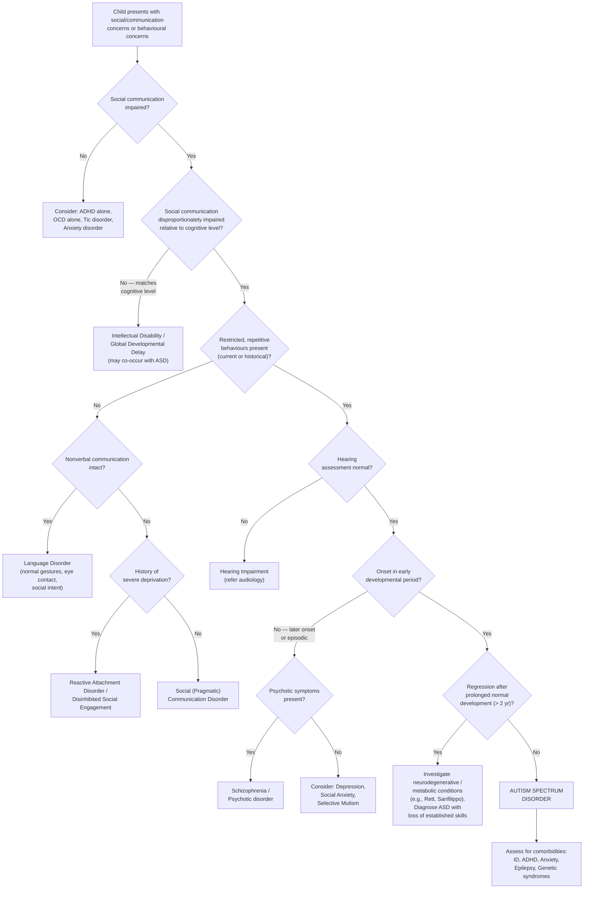

## Differential Diagnosis of Autistic Spectrum Disorder (ASD)

The differential diagnosis of ASD is one of the most clinically important steps because many conditions share overlapping features — particularly social difficulties, language delay, repetitive behaviours, or behavioural problems. The key to differentiation is understanding *which domains are affected* and *which are preserved*. ASD is unique in that it affects **both** social communication **and** restricted/repetitive behaviours simultaneously; most mimics affect only one domain.

Think of it this way: when you see a child with apparent social difficulties or language delay, you need to ask — "Is this truly ASD, or is there another explanation that accounts for the presentation better?"

---

### Guiding Principles for Differential Diagnosis

Before we go condition-by-condition, understand these core differentiating principles:

1. **Social communication relative to developmental level**: In ASD, social communication is disproportionately impaired *relative to the child's overall cognitive ability*. A child with intellectual disability (ID) alone has social skills appropriate for their mental age. A child with ASD has social skills *below* even their mental age [2].

2. **Presence vs absence of RRBs**: Many conditions can cause social or language impairment, but very few cause the combination of social communication deficits **plus** restricted/repetitive behaviours. If RRBs are absent, think of other diagnoses.

3. **Quality of social engagement**: Children with ASD have a qualitative difference in *how* they relate to others — not just a quantitative reduction. They lack the innate social drive, reciprocity, and nonverbal communication that even children with severe language disorders or hearing impairment typically demonstrate.

4. **Onset and course**: ASD symptoms are present from the early developmental period (even if not fully manifest until later). Conditions with later onset or episodic course (e.g., schizophrenia, bipolar disorder) are differentiated by their temporal pattern.

---

### Differential Diagnosis Table

| Condition | Overlapping Features with ASD | **Salient Differentiating Features** [2] | Key Distinguishing Question |
|---|---|---|---|
| **Intellectual Disability / Global Developmental Delay (ID/GDD)** | Language delay, behavioural difficulties, may appear socially immature | **Children with ID/GDD have developmentally appropriate social skills and communication efforts** relative to their mental age [2]. They *want* to communicate and interact — they just have limited cognitive resources. In ASD, social communication is impaired *disproportionately* to overall cognitive level. Note: ASD and ID commonly **co-occur** (~31%); to make a comorbid diagnosis, social communication must be below what is expected for general developmental level [2]. | "Does this child's social ability match their overall cognitive ability, or is it worse?" |
| **Language Disorder (Developmental Language Disorder / Specific Language Impairment)** | Delayed/absent spoken language, frustration-related behavioural problems | Despite verbal communication difficulties, there is **normal non-verbal communication** (gestures, pointing, facial expression), **normal reciprocal social interactions**, **normal desire and intent to communicate**, and **appropriate imaginative play**. There are **no restricted/repetitive behaviours, interests, or activities** [2]. | "Is the child trying hard to communicate through other means (pointing, gestures, facial expressions) despite their language delay?" |
| **Social (Pragmatic) Communication Disorder (SCD)** | Difficulties with social use of language (pragmatics), trouble with conversational rules, understanding non-literal language | SCD is essentially "Domain A without Domain B" — there are social communication deficits but **no restricted/repetitive behaviours**. If RRBs are present (even historically), the diagnosis is ASD, not SCD. This is a DSM-5 diagnosis created specifically for this boundary [2]. | "Are there ANY restricted/repetitive behaviours, now or historically?" |
| **Hearing Impairment** | Apparent language delay, may not respond to name, may seem to "ignore" others | Distinguished by **normal social reciprocity, imaginative play, normal eye contact, and facial expressions indicative of intention to communicate** [2]. The child shows strong nonverbal communicative intent. Audiological assessment resolves the question. | "Does the child use eye contact, gestures, and facial expressions to communicate despite not responding to sound?" |
| **ADHD** | Impaired social functioning (due to impulsivity, inattention), difficulty maintaining friendships, may seem not to listen | Social impairment in ADHD arises from **impulsivity and poor self-control** rather than from fundamental deficits in social understanding [2]. Children with ADHD have **normal pragmatic language skills, normal nonverbal social behaviour, and normal imaginary play** [2]. The social impairment is usually milder and qualitatively different. Note: ADHD and ASD frequently **co-occur** (30-60%); DSM-5 now allows dual diagnosis [2]. | "Can this child engage in reciprocal social interaction when they are focused and calm?" |
| ***OCD*** | Repetitive behaviours, ritualistic patterns, insistence on things being "just right" | In OCD, individuals find their repetitive thoughts/behaviours **distressing** (ego-dystonic), whereas individuals with ASD typically **do not experience their RRBs as distressing** (ego-syntonic — they find them comforting or neutral) [2]. **Social, communication, and language skills are usually normal** in OCD [2]. | "Does the child find their repetitive behaviours distressing and want to stop them?" |
| ***Schizophrenia*** | Social withdrawal, unusual behaviours, restricted affect, odd beliefs/interests | The **prodromal state** of psychosis may be associated with social impairment and atypical interests/beliefs [2]. Key differentiator: look for **positive symptoms of psychosis (delusions, hallucinations)** [2]. Schizophrenia has a later onset (typically late adolescence/early adulthood), episodic course, and premorbid social functioning was usually normal. DSM-5 notes: if there is a history of ASD, the additional diagnosis of schizophrenia requires **prominent delusions or hallucinations for at least 1 month** [2]. | "Is there evidence of delusions, hallucinations, or formal thought disorder? Was premorbid development normal?" |
| **Tic Disorder / Stereotypic Movement Disorder** | Repetitive, purposeless motor behaviours (tics, stereotypies) | **Social, language, and communication skills are typically normal** [2]. Tics are brief, rapid, involuntary movements often preceded by premonitory urge; stereotypic movements are rhythmic and patterned but occur without the broader ASD social/communication phenotype. | "Are social communication skills intact?" |
| **Selective Mutism** | Apparent failure to communicate in certain settings, may appear socially withdrawn | The child is capable of normal speech and social interaction in comfortable settings (e.g., at home) but fails to speak in specific social situations (e.g., school). This is an anxiety-based condition. Nonverbal communication may be preserved or also inhibited. No RRBs. | "Does this child speak normally in at least one setting?" |
| **Reactive Attachment Disorder (RAD)** | Social withdrawal, reduced emotional responsiveness, lack of social reciprocity | Results from severe early deprivation/neglect. Distinguished by history of pathological care, and symptoms can improve substantially with placement in a nurturing environment. No RRBs. Language development is often delayed but pragmatic skills are present once trust develops. | "Is there a history of severe deprivation, neglect, or institutional care?" |
| **Disinhibited Social Engagement Disorder (DSED)** | Indiscriminate friendliness, unusual social approach behaviour | Also results from pathological early care. The child approaches strangers with no appropriate reticence — the opposite of ASD's reduced social approach, but can be confused because both involve "abnormal social behaviour." No RRBs. | "Is the social abnormality indiscriminate over-friendliness rather than social withdrawal/qualitative impairment?" |
| **Childhood Disintegrative Disorder / Regression** | Loss of previously acquired skills, development of stereotypies | Distinguished from ASD by a prolonged period (> 2 years) of clearly normal development before dramatic regression in multiple domains. Now subsumed under ASD in DSM-5 (with specifier "with loss of established skills") but should prompt investigation for **neurodegenerative/metabolic conditions** (e.g., Rett syndrome, Sanfilippo syndrome, neuronal ceroid lipofuscinosis). | "Was development clearly normal for > 2 years before regression?" |
| **Anxiety Disorders (Social Anxiety Disorder)** | Social avoidance, difficulty with peer relationships | In social anxiety, the child *understands* social cues and *wants* social connection but is paralysed by fear of negative evaluation. Social cognition (ToM) is intact or even heightened (hyper-mentalising). No RRBs. Pragmatic language is intact. | "Does the child understand social situations but avoid them due to anxiety, or does the child genuinely not understand social cues?" |
| **Depression** | Social withdrawal, reduced communication, flat affect | Later onset, episodic course. Social withdrawal is secondary to low mood and anhedonia rather than fundamental social communication impairment. Pre-morbid social functioning was typically normal. No RRBs. | "Was social functioning previously normal, and did it decline in association with mood changes?" |

<Callout title="The Two Critical Questions in DDx of ASD" type="idea">

When faced with a child who *might* have ASD, always ask:

1. **"Is social communication impaired disproportionately to overall developmental level?"** → If social skills match cognitive level, think ID/GDD rather than ASD.
2. **"Are there restricted, repetitive behaviours?"** → If absent, consider language disorder, SCD, hearing impairment, selective mutism, RAD, or anxiety disorders instead.

If both answers are "yes," ASD is the most likely diagnosis. If only one is "yes," look carefully at alternatives.
</Callout>

---

### Differential Diagnosis — Clinical Decision Flowchart

---

### Key Differentiating Concepts — Explained from First Principles

#### ASD vs Intellectual Disability: The "Proportionality" Question

This is one of the trickiest distinctions. Why? Because both conditions cause language delay, behavioural difficulties, and social immaturity. The critical insight is **proportionality** [2]:

- A child with **ID alone** and a mental age of 2 years will have the social skills of a typical 2-year-old — they will seek comfort, share enjoyment (at a 2-year-old level), use pointing and gestures, and engage in simple social games (peek-a-boo). Their social behaviour *matches* their cognitive level.
- A child with **ASD** and a mental age of 2 years will have social skills *below* even that of a typical 2-year-old — they may not point, may not seek comfort, may not share enjoyment, and may show qualitatively unusual social behaviour (e.g., treating people as objects).

This is why DSM-5 Criterion E states: *"To make comorbid diagnosis of ASD with ID, social communication should be below that expected for general developmental level"* [2].

#### ASD vs Language Disorder: The "Nonverbal Communication" Test

A child with a **pure language disorder** (e.g., developmental language disorder / specific language impairment) has difficulty with the *mechanics* of language (phonology, grammar, vocabulary) but their *social intent* to communicate is intact [2]. Watch them carefully:

- They will **compensate nonverbally** — pointing vigorously, pulling you by the hand, using facial expressions, making eye contact to check if you understood.
- They engage in **imaginative play** — feeding dolls, pretending a banana is a phone.
- They have **no RRBs**.

In ASD, it's the opposite: even if speech is fluent, the *social use* of language (pragmatics) is impaired, and nonverbal communication is also abnormal.

#### ASD vs ADHD: "Can't" vs "Won't" vs "Doesn't Know How"

- **ADHD**: The child *knows* how to interact socially but **can't** sustain attention or **can't** inhibit impulsive behaviours that disrupt social interactions (blurting out, interrupting, not waiting for turns). When they are calm and focused, their social skills are intact [2].
- **ASD**: The child fundamentally **doesn't know how** to interact — they lack the intuitive social understanding, even in calm moments.
- Remember: these frequently **co-occur** (30-60%). When they co-occur, you see both the qualitative social communication deficits of ASD AND the attentional/impulsivity symptoms of ADHD.

#### ASD vs OCD: Ego-Syntonic vs Ego-Dystonic Repetitive Behaviours

This is a beautiful clinical distinction [2]:

- **OCD**: Repetitive behaviours (compulsions) are performed to reduce distressing, intrusive thoughts (obsessions). The person *does not want* to perform them — they are **ego-dystonic** (experienced as foreign to the self). There is subjective distress.
- **ASD**: Repetitive behaviours are typically **ego-syntonic** — the person finds them comforting, enjoyable, or neutral. There is no distressing obsessional thought driving them. The behaviours serve a self-regulatory function (e.g., hand-flapping when excited).

*However*, be aware that individuals with ASD can also develop comorbid OCD — in which case you see *both* ego-syntonic stereotypies AND ego-dystonic obsessions/compulsions.

#### ASD vs Schizophrenia: Developmental vs Episodic

- **ASD**: Neurodevelopmental — present from early childhood, continuous course (though severity may wax and wane). Social withdrawal is due to fundamental social communication deficits.
- ***Schizophrenia***: Typically emerges in late adolescence/early adulthood with an **episodic** course. Social withdrawal in the prodrome or negative symptom phase may mimic ASD, but there should be evidence of **positive psychotic symptoms** (delusions, hallucinations, formal thought disorder) [2]. Premorbid development was usually (though not always) normal.
- Important DSM-5 rule: If a patient has a history of ASD, the additional diagnosis of schizophrenia requires **prominent delusions or hallucinations present for at least 1 month** in addition to other criteria [2].

<Callout title="ASD and Schizophrenia — A Tricky Overlap" type="error">

Some adolescents/young adults with ASD are misdiagnosed with schizophrenia because their unusual interests are misinterpreted as "bizarre beliefs," their concrete/literal thinking is mistaken for "formal thought disorder," and their social withdrawal mimics negative symptoms. Always take a thorough developmental history — if the features have been present since early childhood, ASD is far more likely than a psychotic disorder. The presence of **true hallucinations or delusions** (not just unusual interests) is the key differentiator [2].
</Callout>

#### ASD vs Social Anxiety Disorder: "Doesn't Understand" vs "Understands but Fears"

- **ASD**: The child does not intuitively understand social cues. They may not be anxious about social situations — they simply don't grasp the social rules.
- **Social Anxiety Disorder**: The child understands social cues *too well* (hyper-mentalising) — they are acutely aware of the possibility of negative judgement and this paralyses them. Their social cognition is intact; their social *performance* is impaired by anxiety.

In practice, this distinction can be blurred because many individuals with ASD develop secondary social anxiety (they've learned through painful experience that social situations go badly for them). But the *primary* deficit differs.

---

### Conditions Commonly Co-occurring (Not Just Differential)

Remember that many of these "differential diagnoses" can also **co-exist** with ASD. DSM-5 removed previous prohibitions on dual diagnosis, so you can now diagnose:

- ASD + ADHD (very common, 30-60%)
- ASD + ID (common, ~31%)
- ASD + Anxiety disorders (very common, ~40%)
- ASD + OCD
- ASD + Depression
- ASD + Tic disorders / Tourette syndrome
- ASD + Epilepsy
- ASD + Schizophrenia (rare but possible, with specific DSM-5 criteria)

The clinical implication: **don't stop at ASD** — always screen for comorbidities, because comorbid conditions are often more treatable than core ASD features.

---

### Summary — DDx at a Glance

| Feature | ASD | ID | Language Disorder | ADHD | OCD | Schizophrenia |
|---|---|---|---|---|---|---|
| Social communication deficit | ++ (disproportionate) | + (proportional to cognitive level) | Verbal only (nonverbal intact) | Mild, due to impulsivity | Normal | Late-onset, with psychotic features |
| RRBs | ++ | - or mild | - | - | + (ego-dystonic) | - (may have stereotypies in chronic) |
| Imaginative play | Impaired | Proportional to mental age | Normal | Normal | Normal | May be impoverished |
| Nonverbal communication | Impaired | Proportional | Normal / compensatory | Normal | Normal | May be flat |
| Onset | Early developmental | Early | Early | Early | Variable | Late adolescence/adulthood |
| Course | Continuous | Continuous | May improve | Continuous | Episodic/chronic | Episodic |
| Distress from repetitive behaviours | No (ego-syntonic) | N/A | N/A | N/A | Yes (ego-dystonic) | N/A |

---

<Callout title="High Yield Summary — Differential Diagnosis of ASD">

**Core differentiating principle**: ASD = social communication deficit (disproportionate to cognitive level) PLUS restricted/repetitive behaviours. Most mimics affect only one domain.

**vs ID**: Social skills match cognitive level in ID; disproportionately impaired in ASD. Can co-occur — need social communication below expected for developmental level.

**vs Language Disorder**: Nonverbal communication and social intent are NORMAL in language disorder. No RRBs. Imaginative play preserved.

**vs Hearing Impairment**: Normal social reciprocity, eye contact, imaginative play despite not hearing.

**vs ADHD**: Social impairment in ADHD is due to impulsivity/inattention, not fundamental social cognition deficit. Normal pragmatic language, nonverbal behaviour, and imaginative play. Frequently co-occurs with ASD.

**vs OCD**: OCD rituals are ego-dystonic (distressing); ASD RRBs are ego-syntonic (comforting). Social/communication skills normal in OCD.

**vs Schizophrenia**: Later onset, episodic, positive psychotic symptoms distinguish it. DSM-5 requires prominent delusions/hallucinations for ≥ 1 month to add schizophrenia diagnosis to existing ASD.

**vs Social Anxiety**: Child with social anxiety understands social cues but fears negative evaluation; child with ASD doesn't intuitively understand social cues.

**Always screen for comorbidities** — ADHD, anxiety, ID, epilepsy, genetic syndromes — because these are often more treatable than core ASD.
</Callout>

---

<ActiveRecallQuiz
  title="Active Recall - Differential Diagnosis of ASD"
  items={[
    {
      question: "A 4-year-old child has a mental age of 2 years and shows social skills equivalent to a typical 2-year-old. They enjoy peek-a-boo, use pointing to communicate needs, and share enjoyment by looking at their parent when excited. They have no repetitive behaviours. What is the most likely diagnosis, and why is it NOT ASD?",
      markscheme: "Most likely Intellectual Disability (ID) / Global Developmental Delay. Not ASD because social communication skills are proportionate to the child's overall cognitive level (mental age 2 years). In ASD, social communication would be disproportionately impaired below even the mental age. Additionally, the child uses joint attention (pointing, social referencing) and has no restricted/repetitive behaviours."
    },
    {
      question: "How do you distinguish repetitive behaviours in OCD from those in ASD? Give the key conceptual difference and one clinical example for each.",
      markscheme: "Key difference: OCD repetitive behaviours (compulsions) are ego-dystonic — the individual finds them distressing, is driven by intrusive obsessional thoughts, and wishes to stop. ASD repetitive behaviours are ego-syntonic — the individual finds them comforting, enjoyable, or neutral, with no distressing obsessional thought driving them. Example OCD: washing hands repeatedly due to contamination obsession, causing distress. Example ASD: hand-flapping when excited, experienced as pleasurable self-stimulation."
    },
    {
      question: "A 19-year-old male presents with social withdrawal, unusual preoccupations, and flat affect. His parents say he has always been a 'loner' with odd interests since early childhood. How would you differentiate ASD from the prodrome of schizophrenia?",
      markscheme: "Key differentiators: (1) Onset — ASD present since early development; schizophrenia prodrome typically emerges in late adolescence with previously better functioning. Take thorough developmental history. (2) Positive symptoms — schizophrenia requires delusions, hallucinations, or formal thought disorder; ASD does not (unusual interests are not delusions). (3) Course — ASD is continuous; schizophrenia is episodic. (4) DSM-5 rule: to diagnose schizophrenia in someone with known ASD, must have prominent delusions or hallucinations for at least 1 month."
    },
    {
      question: "Name three conditions where nonverbal communication is preserved despite apparent social or language difficulties, thus making ASD unlikely.",
      markscheme: "Any three of: (1) Language Disorder / Developmental Language Disorder — normal gestures, pointing, eye contact, facial expression. (2) Hearing Impairment — normal social reciprocity, eye contact, facial expression indicating intent to communicate. (3) Selective Mutism — nonverbal communication may be preserved. (4) Intellectual Disability — nonverbal social skills proportionate to cognitive level. (5) ADHD — normal nonverbal social behaviour."
    },
    {
      question: "What is Social (Pragmatic) Communication Disorder (SCD), and what single feature distinguishes it from ASD?",
      markscheme: "SCD is a DSM-5 diagnosis characterised by persistent difficulties in the social use of verbal and nonverbal communication (pragmatics), including difficulty following conversational rules, understanding non-literal language, and adjusting communication to context. The single distinguishing feature is the ABSENCE of restricted, repetitive behaviours (RRBs). If RRBs are present (currently or historically), the diagnosis is ASD, not SCD. SCD is essentially 'Domain A without Domain B.'"
    }
  ]}
/>

## References

[2] Senior notes: ryanho-psych.md (Section 12.2 Autistic Spectrum Disorder — D/dx, Diagnostic criteria, Clinical features)
