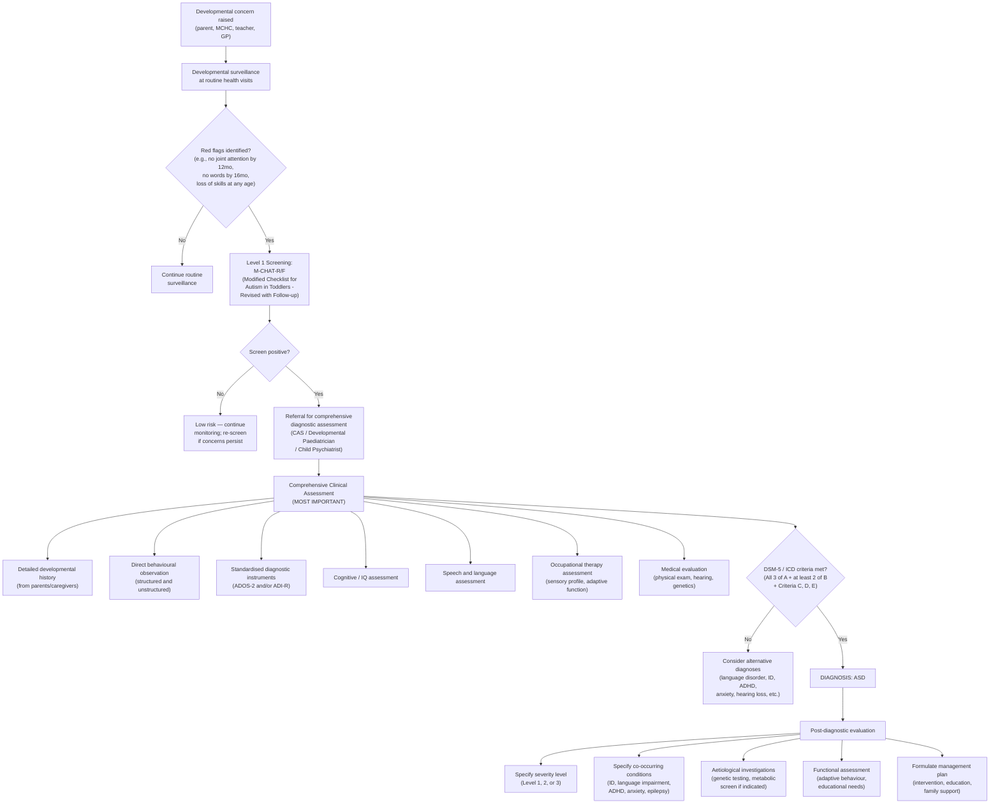

## Diagnostic Criteria

ASD is a **clinical diagnosis** — there is no blood test, brain scan, or single investigation that confirms it. The diagnosis rests on careful behavioural observation and developmental history, judged against standardised criteria. Let's go through both major classification systems, then discuss the practical diagnostic algorithm and investigations.

---

### DSM-5 Diagnostic Criteria for Autism Spectrum Disorder (299.00)

The DSM-5 criteria are the current gold standard and are what you need to know cold for exams [2]:

**Criterion A: Persistent deficits in social communication and social interaction across multiple contexts, as manifested by ALL 3 of the following** (currently or by history) [2]:

1. **Deficits in social-emotional reciprocity** — ranging from abnormal social approach and failure of normal back-and-forth conversation, to reduced sharing of interests, emotions, or affect, to failure to initiate or respond to social interactions [2].

2. **Deficits in nonverbal communicative behaviours used for social interaction** — ranging from poorly integrated verbal and nonverbal communication, to abnormalities in eye contact and body language or deficits in understanding and use of gestures, to a total lack of facial expressions and nonverbal communication [2].

3. **Deficits in developing, maintaining, and understanding relationships** — ranging from difficulties adjusting behaviour to suit various social contexts, to difficulties in sharing imaginative play or in making friends, to absence of interest in peers [2].

> **Why ALL 3?** Because ASD is defined by a *pervasive* social communication deficit — it's not just "shy" (which would affect only approach) or "blunt" (which would affect only reciprocity). The requirement for all three subcategories ensures that the social impairment is truly pervasive across different aspects of social functioning.

**Criterion B: Restricted, repetitive patterns of behaviour, interests, or activities, as manifested by ≥ 2 of the following 4** (currently or by history) [2]:

1. **Stereotyped or repetitive motor movements, use of objects, or speech** (e.g., simple motor stereotypies, lining up toys, flipping objects, echolalia, idiosyncratic phrases) [2].

2. **Insistence on sameness, inflexible adherence to routines, or ritualised patterns of verbal or nonverbal behaviour** (e.g., extreme distress at small changes, difficulties with transitions, rigid thinking patterns, greeting rituals, need to take same route or eat same food) [2].

3. **Highly restricted, fixated interests that are abnormal in intensity or focus** (e.g., strong attachment to or preoccupation with unusual objects, excessively circumscribed or perseverative interests) [2].

4. **Hyper- or hyporeactivity to sensory input or unusual interest in sensory aspects of the environment** (e.g., apparent indifference to pain/temperature, adverse response to specific sounds or textures, excessive smelling or touching of objects, visual fascination with lights or movement) [2].

> **Why ≥ 2 of 4?** Because RRBs are heterogeneous — some individuals have prominent motor stereotypies but no sensory issues; others have intense circumscribed interests but no insistence on sameness. Requiring at least 2 subcategories ensures the pattern is sufficiently broad to distinguish ASD from isolated stereotypic movement disorder or isolated sensory processing differences.

**Criterion C: Symptoms must be present in the early developmental period** [2].
- But may not become fully manifest until social demands exceed limited capacities, or may be masked by learned strategies in later life [2].
- *Why this caveat?* Many individuals (especially females, those with higher IQ, and those with good language) develop "camouflaging" strategies that mask their difficulties. A university student who was a quiet loner in primary school but coped may only "decompensate" when social demands intensify (e.g., entering the workforce, forming romantic relationships). The symptoms were always there — they just weren't visible until demands exceeded capacity.

**Criterion D: Symptoms cause clinically significant impairment in social, occupational, or other important areas of current functioning** [2].

**Criterion E: These disturbances are not better explained by intellectual disability (ID) or global developmental delay (GDD)** [2].
- To make a comorbid diagnosis of ASD with ID, social communication should be **below that expected for general developmental level** [2].
- *Why this criterion?* It prevents over-diagnosis of ASD in children whose social difficulties are entirely accounted for by their cognitive limitations. You need to demonstrate that the social impairment is *disproportionate* to their overall development.

#### DSM-5 Severity Specifiers

| Level | Social Communication | Restricted, Repetitive Behaviours |
|---|---|---|
| **Level 3: "Requiring very substantial support"** | Severe deficits; very limited initiation; minimal response to social overtures | Inflexibility, extreme difficulty coping with change; RRBs markedly interfere with functioning; great distress changing focus or action |
| **Level 2: "Requiring substantial support"** | Marked deficits; limited initiation; reduced or abnormal response to social overtures; even with supports in place | Inflexibility, difficulty coping with change; RRBs frequent enough to be obvious to casual observer; distress and difficulty changing focus |
| **Level 1: "Requiring support"** | Without supports, deficits cause noticeable impairments; difficulty initiating; may appear to have decreased interest in social interactions; atypical or unsuccessful responses | Inflexibility causes significant interference; difficulty switching between activities; problems of organisation and planning hamper independence |

#### DSM-5 Additional Specifiers

Specify if:
- With or without accompanying **intellectual impairment**
- With or without accompanying **language impairment**
- Associated with a known **medical or genetic condition** or **environmental factor**
- Associated with another **neurodevelopmental, mental, or behavioural disorder**
- With **catatonia**

<Callout title="Key Points about DSM-5 Criteria" type="idea">

- **Domain A requires ALL 3** subcategories; **Domain B requires ≥ 2 of 4** subcategories.
- Symptoms can be met by **current presentation OR history** — a child who used to hand-flap but no longer does still counts.
- The sensory criterion (B4) is **new in DSM-5** (not in DSM-IV or ICD-10) — reflecting strong evidence that sensory differences are a core feature of ASD.
- Language impairment is **no longer a diagnostic criterion** for ASD in DSM-5 — it is a specifier. This is a deliberate change from ICD-10/DSM-IV where communication was a separate domain.
</Callout>

---

### ICD-10 Diagnostic Criteria for Childhood Autism (F84.0)

Still referenced in some Hong Kong clinical settings [2]:

**Qualitative impairments in ALL 3 domains** [2]:
1. **Reciprocal social interaction**
2. **Communications**
3. **Restricted, repetitive and stereotyped patterns of behaviour, interests, and activities**

**Temporal requirement**: Developmental abnormalities must have been present in the **first 3 years** of life [2]. (This is stricter than DSM-5's "early developmental period.")

**Additional features** (non-specific): May also have other non-specific problems including fears/phobias, sleeping and eating disturbances, temper tantrums, and aggression [2].

The syndrome can be diagnosed in all age groups [2].

> **Key differences from DSM-5**: ICD-10 requires **3 domains** (separating social interaction from communication); DSM-5 collapses these into **2 domains** (social communication + RRBs). ICD-10 specifies onset before age 3; DSM-5 says "early developmental period" without a strict age cutoff. ICD-10 keeps separate diagnoses (Asperger, atypical autism, etc.); DSM-5 unifies them.

### ICD-11 Diagnostic Criteria (6A02) — Current WHO System

Aligns closely with DSM-5:
- Two core domains: (1) persistent deficits in social communication and social interaction; (2) restricted, repetitive, and inflexible patterns of behaviour, interests, or activities
- Specifiers for intellectual functioning and language level
- Specifier for loss of previously acquired skills

---

### Comparison of DSM-5 vs ICD-10 Criteria

| Feature | DSM-5 | ICD-10 |
|---|---|---|
| **Name** | Autism Spectrum Disorder | Childhood Autism (plus subtypes) |
| **Core domains** | 2 (social communication + RRBs) | 3 (social interaction + communication + RRBs) |
| **Domain A requirement** | All 3 subcategories | All domains impaired |
| **Domain B requirement** | ≥ 2 of 4 subcategories | Present (no minimum subcategory count specified) |
| **Sensory criterion** | Explicitly included (B4) | Not explicitly listed |
| **Age of onset** | "Early developmental period" (flexible) | Before age 3 years (strict) |
| **Subtypes** | None — single spectrum with specifiers | Multiple subtypes (childhood autism, Asperger, atypical autism, etc.) |
| **Language** | Not a diagnostic criterion — used as specifier | Part of communication domain |
| **ID exclusion** | Not better explained by ID (but can co-occur if social communication below expected for developmental level) | Not explicitly stated |

---

## Diagnostic Algorithm

### Overview of the Diagnostic Pathway

ASD diagnosis in Hong Kong (and internationally) follows a multi-stage process: **surveillance/screening → referral → comprehensive diagnostic assessment → post-diagnostic evaluation** [2].

The key principle: **ASD is a clinical diagnosis made by expert clinical judgement** — not by any single screening tool or investigation. Standardised instruments support but do not replace clinical assessment.

### The Hong Kong Pathway

In Hong Kong, the typical pathway is:
1. **Concern raised** — by parents, MCHC (Maternal and Child Health Centre) nurses, kindergarten teachers, or primary care doctors.
2. **Referral to Child Assessment Service (CAS)** — under the Department of Health. This is the primary diagnostic service for developmental concerns in children < 12 years in HK.
3. **Multidisciplinary assessment at CAS** — by a team including developmental paediatrician, clinical psychologist, speech therapist, occupational therapist, social worker.
4. **For older children/adolescents/adults** — referral to Child and Adolescent Psychiatry (HA) or adult psychiatry services.

### Step-by-Step Diagnostic Algorithm

---

## Assessment: The Diagnostic Evaluation in Detail

### The Core Assessment (The Most Important Component)

As stated clearly in the senior notes: **"Clinical interview and assessment (most important)"** [2]. The diagnosis of ASD is made by **expert clinical judgement** based on a comprehensive evaluation, not by any single test. The assessment typically involves a **multidisciplinary team using standardised assessment** in a **day hospital assessment** setting [2].

#### Component 1: Detailed Developmental History (from parents/caregivers)

This is the foundation of the diagnostic assessment. You are trying to establish:

| Domain | What to Ask | Why |
|---|---|---|
| **Early development** | Pregnancy complications, gestational age, birth history, APGAR, neonatal period | Identify perinatal risk factors |
| **Developmental milestones** | Motor (sitting, walking), language (babbling, first words, phrases), social (smiling, joint attention, pointing, pretend play) | Identify delays and the temporal pattern of symptom emergence |
| **Regression** | Did the child lose previously acquired skills (words, social behaviours)? At what age? | ~25-30% of ASD cases show regression, usually 15-24 months; severe regression warrants investigation for neurodegenerative conditions |
| **Social communication** (Criterion A) | How does the child interact with family members, peers? Eye contact? Response to name? Sharing enjoyment? Pointing? Imitation? | Map symptoms to DSM-5 Criterion A subcategories |
| **RRBs** (Criterion B) | Repetitive movements? Rituals? Insistence on sameness? Intense interests? Sensory responses? | Map symptoms to DSM-5 Criterion B subcategories |
| **Functional impact** (Criterion D) | How do these difficulties affect daily life, learning, family? | Establish clinical significance |
| **Family history** | ASD, intellectual disability, language delay, psychiatric conditions in first/second-degree relatives | Strong genetic component; familial recurrence risk |
| **Medical history** | Seizures, sleep problems, GI symptoms, hearing/vision concerns, genetic conditions | Identify comorbidities and aetiological factors |
| **Behavioural concerns** | Self-injury, aggression, tantrums, sleep, feeding, toileting | Associated features that need management |

#### Component 2: Direct Behavioural Observation

Observe the child in both **structured** and **unstructured** (free play) settings. Look for:
- Quality of eye contact, facial expressions, gestures
- Social initiation and response
- Joint attention behaviours (pointing, showing, following a point)
- Quality and type of play (functional, symbolic, pretend)
- Communication (verbal and nonverbal)
- Repetitive behaviours, motor stereotypies
- Sensory behaviours
- Response to social overtures from the examiner

#### Component 3: Standardised Diagnostic Instruments

These are not "diagnostic tests" — they are structured tools that **support** clinical judgement:

| Instrument | Type | What It Does | Key Details |
|---|---|---|---|
| **ADOS-2** (Autism Diagnostic Observation Schedule, 2nd Edition) | Semi-structured, standardised direct observation | Gold standard observational assessment. The clinician creates "social presses" (opportunities for the child to demonstrate social communication) and rates the child's responses. Different modules for different ages/language levels. | Module 1: Pre-verbal/single words; Module 2: Phrase speech; Module 3: Fluent speech (children); Module 4: Fluent speech (adolescents/adults). Provides calibrated severity scores. ~40-60 minutes. |
| **ADI-R** (Autism Diagnostic Interview — Revised) | Structured parent/caregiver interview | Gold standard interview. Systematically probes for ASD symptoms across development. Covers reciprocal social interaction, communication, RRBs. Algorithm generates scores mapped to ICD-10/DSM-IV domains. | ~1.5-3 hours. Best used for research; sometimes abbreviated in clinical practice. |
| **ADOS-2 + ADI-R combination** | — | Using both provides the most comprehensive assessment (observation + history) and is the research gold standard. In clinical practice, at least one should be used. | — |
| **M-CHAT-R/F** (Modified Checklist for Autism in Toddlers — Revised with Follow-Up) | Parent-report screening questionnaire | Level 1 screening tool for toddlers aged 16-30 months. 20 yes/no questions. Follow-up interview reduces false positives. | Sensitivity ~85%, specificity ~99% after follow-up. NOT a diagnostic tool — positive screen requires referral for comprehensive assessment. |
| **SCQ** (Social Communication Questionnaire) | Parent-report screening questionnaire | 40-item screening tool for ages 4+. Based on ADI-R. Lifetime and current forms. Cutoff score ≥ 15 suggests need for further evaluation. | Quick (~10 min). Good for initial screening. |
| **SRS-2** (Social Responsiveness Scale, 2nd Edition) | Parent/teacher-report rating scale | Quantifies severity of social communication deficits across a continuous dimension. Not diagnostic but useful for tracking. | Available for ages 2.5 through adult. |
| **CARS-2** (Childhood Autism Rating Scale, 2nd Edition) | Clinician-rated observation scale | 15-item scale rated during observation. Provides severity rating (mild-moderate, severe). Quick to administer. | Less specific than ADOS-2 but useful in resource-limited settings. |

<Callout title="ADOS-2 — The 'Gold Standard' Observation Tool" type="idea">

Think of the ADOS-2 as creating a standardised "social laboratory." The examiner deliberately creates situations that would normally elicit social communication behaviours — for example:
- Blowing up a balloon and then putting it just out of reach (does the child request? point? make eye contact?)
- Starting a silly game and then suddenly stopping (does the child try to re-engage the examiner?)
- Showing the child an interesting toy and gauging their response (do they share enjoyment? look back and forth between the toy and the examiner?)

The child's responses (or lack thereof) are rated on standardised algorithms that map onto DSM-5 domains.
</Callout>

---

### Supporting Assessments (Post-Diagnostic)

These do not diagnose ASD but are essential for comprehensive evaluation [2]:

#### Cognitive / IQ Assessment [2]

| Test | Ages | What It Measures | Why It Matters |
|---|---|---|---|
| **Wechsler scales** (WPPSI for preschool, WISC for school-age, WAIS for adults) | 2.5+ | Full-scale IQ, Verbal Comprehension, Perceptual Reasoning, Working Memory, Processing Speed | Determines presence/severity of intellectual impairment (DSM-5 specifier); identifies cognitive profile (often uneven in ASD — may show VCI-PRI discrepancy); guides educational placement |
| **Bayley Scales of Infant Development** | 0-42 months | Cognitive, language, motor, social-emotional, adaptive behaviour | For very young or developmentally delayed children |
| **Non-verbal IQ tests** (Leiter, Ravens) | Various | Non-verbal cognitive ability | Essential for non-verbal or minimally verbal children with ASD who cannot engage with verbally-loaded IQ tests — prevents underestimation of cognitive ability |

*Why an uneven IQ profile matters*: Many individuals with ASD show a characteristic pattern of relative strengths in perceptual reasoning (block design, matrix reasoning — tasks benefiting from local processing/WCC) and relative weaknesses in verbal comprehension or processing speed. This profile supports the diagnosis and guides intervention.

#### Speech and Language Assessment [2]

| Domain | What Is Assessed | Clinical Significance |
|---|---|---|
| **Receptive language** | Understanding of words, sentences, instructions, complex language | Often more impaired than expressive language in ASD (receptive > expressive delay) [2]; guides intervention targets |
| **Expressive language** | Vocabulary, grammar, sentence construction | Determines language level specifier |
| **Pragmatic language** | Social use of language: conversational rules, topic maintenance, narrative, understanding non-literal language | The hallmark language deficit in ASD — pragmatic difficulties even when structural language is intact |
| **Speech** | Articulation, fluency, voice | May have co-occurring speech sound disorder |
| **Augmentative and alternative communication (AAC) needs** | Whether the child would benefit from PECS, sign language, communication devices | For minimally verbal children |

#### Occupational Therapy Assessment [2]

| Domain | What Is Assessed | Clinical Significance |
|---|---|---|
| **Sensory profile** (e.g., Sensory Profile 2) | Sensory processing patterns across modalities | Identifies sensory hyper/hyposensitivities; guides sensory strategies and environmental modifications |
| **Fine motor skills** | Handwriting, manipulation, dexterity | Dyspraxia/motor difficulties common in ASD; impacts school performance |
| **Adaptive behaviour** (e.g., Vineland Adaptive Behavior Scales) | Communication, daily living skills, socialisation, motor skills in real-world settings | Adaptive function often lower than IQ in ASD; critical for determining support needs and educational placement |
| **Self-care skills** | Dressing, feeding, toileting | Identifies areas needing intervention |

#### Educational Assessment [2]

- Assessment of academic skills, learning style, classroom behaviour
- Determines educational placement needs (mainstream with support, special school, etc.)
- In HK: assessment by Educational Psychologist through the Education Bureau or school-based support

---

### Medical Investigations

Remember: **there is no diagnostic biomarker for ASD**. Medical investigations are performed to:
1. **Identify treatable comorbid conditions** (hearing loss, epilepsy, metabolic disorders)
2. **Identify aetiological factors** (genetic syndromes)
3. **Exclude medical mimics**

| Investigation | Indication | Key Findings / Interpretation |
|---|---|---|
| **Audiological assessment** (OAE, ABR, behavioural audiometry) | **All children** undergoing ASD evaluation | Rule out hearing impairment as a cause of apparent social/communication difficulties. Even partial hearing loss can mimic some ASD features. Must be done before concluding that communication deficits are due to ASD. |
| **Genetic testing** | Recommended for all children with confirmed ASD | — |
| — Chromosomal microarray (CMA) | First-tier genetic test | Detects copy number variants (CNVs) — deletions and duplications. Diagnostic yield ~10-20% in ASD. May identify 16p11.2, 15q11-13, 22q11.2, 22q13.3 (Phelan-McDermid) and other pathogenic CNVs. |
| — Fragile X testing (FMR1 trinucleotide repeat) | All children with ASD + ID (especially males) | Most common single-gene cause of ASD and ID. Positive result has implications for genetic counselling (X-linked). |
| — Whole exome sequencing (WES) / Whole genome sequencing (WGS) | Increasingly recommended, especially if CMA negative and clinical suspicion high; syndromic features present | Detects single nucleotide variants (SNVs) and small insertions/deletions. Higher diagnostic yield than CMA alone (~10-30% additional). Identifies mutations in genes like SHANK3, CHD8, PTEN, SCN1A. |
| — Targeted gene testing | If clinical features suggest specific syndrome (e.g., MECP2 for Rett syndrome, PTEN for macrocephaly + ASD, TSC1/2 for tuberous sclerosis) | Confirms specific syndromic diagnosis; implications for medical management and surveillance. |
| **EEG** | If clinical suspicion of seizures (staring spells, regression, unusual episodic behaviours); **not routine** | Epilepsy occurs in ~20-30% of ASD (higher with co-occurring ID). May show epileptiform discharges. Important: electrical status epilepticus in sleep (ESES) can cause regression mimicking ASD (Landau-Kleffner syndrome). |
| **MRI Brain** | **Not routine**. Indicated if: macrocephaly/microcephaly, focal neurological signs, regression, tuberous sclerosis suspected, seizures | May show structural anomalies (tuberous sclerosis: cortical tubers, subependymal nodules; brain malformations). Not useful as a diagnostic test for "idiopathic" ASD. |
| **Metabolic screening** | If regression, failure to thrive, organomegaly, unusual features, consanguinity, or specific clinical suspicion | May include plasma amino acids, urine organic acids, acylcarnitine profile, mucopolysaccharide screen. Metabolic disorders are rare causes of ASD phenocopy (e.g., PKU, Smith-Lemli-Opitz, creatine deficiency syndromes). |
| **Lead level** | If pica behaviour or environmental exposure risk | Lead poisoning can cause developmental regression and behavioural disturbance |
| **Thyroid function** | If clinical features suggest hypothyroidism; more relevant in Down syndrome | Untreated hypothyroidism can impair development |
| **Wood's lamp examination** | If tuberous sclerosis suspected | Ash-leaf macules (hypomelanotic macules) fluoresce under UV light; tuberous sclerosis is associated with ASD in ~50% |
| **Vision assessment** | If concerns about visual behaviour | Rule out visual impairment; cortical visual impairment can co-occur with ASD |

<Callout title="When to Order Genetic Testing" type="idea">

Current guidelines (ACMG, AAP) recommend **chromosomal microarray as a first-tier test for ALL children diagnosed with ASD**, regardless of the presence of dysmorphic features. The rationale:
- ~10-20% will have a pathogenic CNV identified
- Even "non-syndromic" appearing children may have identifiable genetic causes
- Results change genetic counselling (recurrence risk for siblings)
- Some genetic findings have medical surveillance implications (e.g., PTEN → cancer surveillance; TSC → renal/cardiac monitoring)
- Increasingly, WES/WGS is also being recommended as a first- or second-tier test given falling costs and higher yield
</Callout>

<Callout title="EEG and MRI Are NOT Routine" type="error">

A very common mistake is ordering EEG and MRI Brain on every child diagnosed with ASD. These are **not routine** and should only be performed when there is a specific clinical indication (seizures, regression, focal signs, macrocephaly, syndromic features). In the absence of these indications, the yield is very low and the procedures can be distressing for the child (especially MRI, which may require sedation).

The exception: if there is **language regression** (loss of previously acquired words, especially around 18-24 months), EEG should be strongly considered to rule out **Landau-Kleffner syndrome** (acquired epileptic aphasia with ESES pattern on sleep EEG) — a treatable condition.
</Callout>

---

### Interpretation Framework — Putting It All Together

The diagnostic assessment integrates multiple sources of information:

| Source | Weight | Role |
|---|---|---|
| **Clinical judgement** (expert clinician) | **Highest** | The final arbiter. No instrument replaces expert clinical assessment. |
| **Developmental history** (parents/caregivers) | Very high | Only source for early development, regression, symptom onset. Parents know their child best. |
| **Direct observation** (ADOS-2 / clinical observation) | Very high | Shows current presentation in a standardised context. A child may behave differently in clinic than at home/school. |
| **Standardised instruments** (ADOS-2, ADI-R, etc.) | High | Structure the assessment, ensure systematic coverage, provide severity metrics. But can be false-negative (especially in high-masking females or very young children). |
| **Collateral information** (school reports, teacher questionnaires) | Moderate-High | Critical for assessing behaviour across settings (Criterion A requires deficits "across multiple contexts"). |
| **Cognitive/language/OT assessments** | Moderate | Characterise the profile, identify comorbidities, guide intervention — but do not diagnose ASD themselves. |
| **Medical investigations** | Low for ASD diagnosis; variable for aetiology | Do not diagnose ASD. Identify comorbidities, aetiological factors, and treatable conditions. |

> The diagnosis is ultimately a **pattern recognition** exercise by an experienced clinician who synthesises all available data against the DSM-5/ICD criteria. There is no single score on any instrument that "confirms" ASD — and equally, a "negative" ADOS-2 does not rule it out if the clinical picture is otherwise compelling.

---

<Callout title="High Yield Summary — Diagnosis of ASD">

**DSM-5 Criteria**: Criterion A (all 3 subcategories: social-emotional reciprocity + nonverbal communication + relationships) + Criterion B (≥ 2 of 4: stereotypies + sameness + fixated interests + sensory) + Criterion C (early developmental period) + Criterion D (functional impairment) + Criterion E (not better explained by ID/GDD).

**ICD-10**: 3 domains (social interaction + communication + RRBs), onset before age 3.

**Assessment is multidisciplinary** [2]: clinical interview and assessment is MOST IMPORTANT. Day hospital assessment by MDT. Includes education assessment, IQ test, OT assessment, speech therapist assessment [2].

**Gold standard instruments**: ADOS-2 (observation) and ADI-R (parent interview). Screening: M-CHAT-R/F (toddlers 16-30 months).

**Medical investigations**: Audiological assessment (ALL children); chromosomal microarray (ALL confirmed ASD); Fragile X testing (ASD + ID); EEG and MRI only if specific indication (seizures, regression, focal signs, macrocephaly); metabolic screen if regression or syndromic features.

**No biomarker exists** — ASD remains a clinical diagnosis based on expert judgement integrating history, observation, and standardised assessment.
</Callout>

---

<ActiveRecallQuiz
  title="Active Recall - ASD Diagnostic Criteria, Algorithm, and Investigations"
  items={[
    {
      question: "State the DSM-5 criteria for ASD, including how many subcategories are required for Criterion A and Criterion B.",
      markscheme: "Criterion A: Persistent deficits in social communication and social interaction across multiple contexts — ALL 3 subcategories required (social-emotional reciprocity, nonverbal communicative behaviours, developing/maintaining/understanding relationships). Criterion B: Restricted, repetitive patterns of behaviour — at least 2 of 4 subcategories (stereotyped movements/speech/objects, insistence on sameness, fixated interests, sensory hyper/hyporeactivity). Criterion C: Present in early developmental period. Criterion D: Clinically significant impairment. Criterion E: Not better explained by ID/GDD."
    },
    {
      question: "What is the ADOS-2 and why is it considered the gold standard observational tool for ASD assessment? How does it work?",
      markscheme: "ADOS-2 = Autism Diagnostic Observation Schedule, 2nd Edition. It is a semi-structured, standardised direct observation tool. The clinician creates standardised 'social presses' — situations designed to elicit social communication behaviours (e.g., bubble play, snack time, telling a story). The child's responses are systematically rated on algorithms mapping to DSM-5 domains. Different modules for different language levels (Module 1: pre-verbal; Module 2: phrase speech; Module 3: fluent child; Module 4: fluent adolescent/adult). Provides calibrated severity scores. Gold standard because it standardises observation, ensures systematic coverage, and allows comparison across assessments."
    },
    {
      question: "A 3-year-old with confirmed ASD appears non-dysmorphic. What first-line genetic test should be ordered and why? What is its approximate diagnostic yield?",
      markscheme: "Chromosomal microarray (CMA) — recommended as first-tier genetic test for ALL children with confirmed ASD regardless of dysmorphic features. Detects pathogenic copy number variants (deletions/duplications). Diagnostic yield approximately 10-20%. Rationale: identifies genetic aetiology, changes recurrence risk counselling for siblings, some CNVs have specific medical surveillance implications (e.g., PTEN, TSC), and even non-syndromic appearing children may have identifiable genetic causes."
    },
    {
      question: "Under what specific clinical circumstances should EEG and MRI Brain be ordered in a child diagnosed with ASD?",
      markscheme: "EEG: clinical suspicion of seizures (staring spells, unusual episodic behaviours), language regression (to rule out Landau-Kleffner syndrome / ESES), or unexplained developmental regression. MRI Brain: macrocephaly or microcephaly, focal neurological signs, regression, suspected tuberous sclerosis, or seizures. Neither is routine — only ordered with specific clinical indication."
    },
    {
      question: "Explain Criterion C of DSM-5 ASD criteria. Why does DSM-5 say symptoms 'may not become fully manifest until social demands exceed limited capacities'? Give a clinical example.",
      markscheme: "Criterion C: Symptoms must be present in the early developmental period but may not become fully manifest until social demands exceed limited capacities, or may be masked by learned strategies in later life. This recognises that some individuals (especially females, those with high IQ, or good language) develop camouflaging/masking strategies. Example: A girl with ASD who coped in primary school by quietly observing and imitating peers (scripting social behaviour) but decompensates in secondary school when social demands become more complex (navigating cliques, understanding sarcasm, forming close friendships) — her ASD was always present but masked until demands exceeded capacity."
    }
  ]}
/>

## References

[2] Senior notes: ryanho-psych.md (Section 12.2 Autistic Spectrum Disorder — Diagnostic criteria, Assessment, Clinical features)
