## Management of Autistic Spectrum Disorder (ASD)

---

### Overarching Principles

Before diving into specific interventions, let's establish the fundamental philosophy of ASD management. This is critical because it shapes every decision you make:

1. **There is no cure for ASD.** ASD is a lifelong neurodevelopmental condition. The goal is not to "fix" or "normalise" the individual, but to **foster acquisition of social, communicative, and cognitive skills at developmentally appropriate levels → maximise functioning, move towards independence, and increase quality of life (QoL)** [2].

2. **No medication treats the core symptoms of ASD.** This is a crucial point: **no medications can cure ASD or let alone treat its main symptoms** [2]. Medications are used only to **target specific associated symptoms** (irritability, aggression, ADHD symptoms, anxiety, depression, sleep disturbance) [2].

3. **The approach must be individualised** based on the **strengths, difficulties, and developmental stage** of the child [2]. A management plan for a non-verbal 3-year-old with co-occurring ID looks completely different from one for a verbally fluent 15-year-old with average IQ and comorbid anxiety.

4. **Management involves multidisciplinary teams** of specialists: doctor, clinical/educational psychologist, speech therapist, occupational therapist, social workers, and teachers [2].

5. **Early intervention is paramount.** The brain is most plastic in the first few years of life. Starting evidence-based intervention before age 3 — during critical periods for language and social development — produces the best long-term outcomes. Every month of delay in intervention represents a missed window of neuroplasticity.

6. **Lifespan approach.** ASD does not end at age 18. Transition planning for adulthood (employment, independent living, relationships, mental health) must begin in adolescence.

---

### Management Algorithm

```mermaid
flowchart TD
    A["ASD Diagnosed\n(with severity level and\ncomorbidity profile)"] --> B["CORE: Non-Pharmacological\nInterventions\n(ALWAYS first-line)"]
    B --> B1["Behavioural Interventions"]
    B1 --> B1a["Applied Behaviour Analysis\n(ABA) / Early Intensive\nBehavioural Intervention (EIBI)"]
    B1 --> B1b["Behavioural modification\ntechniques"]
    B1 --> B1c["Social skills training"]
    B --> B2["Communication Interventions"]
    B2 --> B2a["Speech and language therapy"]
    B2 --> B2b["AAC systems: PECS,\nsign language, devices"]
    B --> B3["Educational Support"]
    B3 --> B3a["Special educational\nprogrammes (school-age)"]
    B3 --> B3b["Vocational training (older)"]
    B --> B4["Family Support"]
    B4 --> B4a["Psychoeducation"]
    B4 --> B4b["Parent training as co-therapist"]
    B4 --> B4c["Counselling and practical help"]
    B4 --> B4d["Genetic counselling"]
    B --> B5["Other Interventions"]
    B5 --> B5a["Sensory integration therapy"]
    B5 --> B5b["OT for motor/adaptive skills"]
    B5 --> B5c["CBT for anxiety (if appropriate)"]
    A --> C{"Comorbid symptoms\nrequiring pharmacological\ntargeting?"}
    C -->|No| D["Continue non-pharmacological\napproach. Regular review."]
    C -->|Yes| E["ADJUNCT: Pharmacological\nInterventions\n(target SYMPTOMS, not core ASD)"]
    E --> E1["Irritability / Aggression:\nRisperidone or Aripiprazole\n(FDA-approved)"]
    E --> E2["ADHD symptoms:\nMethylphenidate or\nAtomoxetine or Guanfacine"]
    E --> E3["Anxiety / OCD / Depression:\nSSRIs (e.g., Fluoxetine,\nSertraline)"]
    E --> E4["Sleep disturbance:\nMelatonin (first-line);\nSleep hygiene"]
    E --> E5["Seizures:\nAppropriate AEDs"]
    E --> E6["Self-injurious behaviour:\nBehavioural approach first;\nconsider Risperidone/Aripiprazole\nif severe"]
    D --> F["Regular multidisciplinary\nreview and adjustment"]
    E --> F
    F --> G["Transition Planning\n(adolescence onwards)"]
    G --> G1["Vocational training\nand supported employment"]
    G --> G2["Independent living skills"]
    G --> G3["Adult mental health services"]
    G --> G4["Social and recreational\nsupport"]
```

---

### Non-Pharmacological Interventions (The Mainstay of ASD Management)

Non-pharmacological interventions are **always the first-line and foundation** of ASD management. Medications are adjuncts only [2].

#### 1. Behavioural Interventions [2]

##### 1a. Applied Behaviour Analysis (ABA) / Early Intensive Behavioural Intervention (EIBI)

- **What it is**: ABA is a systematic approach based on principles of operant conditioning (Skinner). Desired behaviours are reinforced (positive reinforcement), and maladaptive behaviours are reduced through structured techniques. EIBI is ABA delivered intensively (20–40 hours/week) to young children (typically < 5 years).
- **Why it works from first principles**: Children with ASD do not learn social and communication skills implicitly through observation and social immersion the way neurotypical children do (due to impaired social motivation, mirror neuron dysfunction, and theory of mind deficits). ABA breaks down complex social behaviours into small, teachable components and explicitly teaches each one through structured practice and reinforcement. It essentially creates an **explicit learning pathway** to replace the impaired implicit learning pathway.
- **Evidence**: The strongest evidence base of any ASD intervention. Meta-analyses show improvements in IQ, language, adaptive behaviour, and social skills, especially when started before age 3.
- **Key techniques within ABA**:
  - **Discrete Trial Training (DTT)**: Structured, one-to-one teaching in a controlled setting. Teacher gives an instruction → child responds → consequence (reinforcement or correction). Repeated systematically.
  - **Natural Environment Teaching (NET)**: Uses naturally occurring situations (playtime, mealtimes) to teach skills in context, improving generalisation.
  - **Pivotal Response Training (PRT)**: Targets "pivotal" areas (motivation, self-management, responsiveness to multiple cues) that produce cascading improvements across many behaviours.
- **Indication**: All young children with ASD, especially those with significant developmental delays. The earlier and more intensive, the better.
- **Limitations/Controversies**: Very resource-intensive (expensive, time-consuming). Some autistic self-advocates criticise overly rigid ABA as attempting to enforce "neurotypical" behaviour at the cost of the child's wellbeing; modern ABA has evolved towards more naturalistic, child-led approaches. Quality of the ABA provider matters enormously.

##### 1b. Behavioural Modification (B-mod) Techniques [2]

- **What it is**: Broader set of behaviour management strategies used across settings (home, school, clinic) [2].
- **Key techniques**:
  - **Visual schedules and structure**: Provide predictability, which reduces anxiety and behavioural disturbance. *Why?* Individuals with ASD struggle with uncertainty (executive dysfunction, insistence on sameness). Visual schedules externalize the structure that their executive function cannot generate internally.
  - **Social Stories** (Carol Gray): Short stories written from the child's perspective that describe a social situation, relevant cues, and appropriate responses. *Why?* Explicitly teaches the social "rules" that neurotypical children absorb implicitly.
  - **Positive Behaviour Support (PBS)**: Function-based approach. First identify the *function* of a challenging behaviour (escape, attention, sensory, tangible), then teach an alternative behaviour that achieves the same function more appropriately.
  - **Token economies / reward systems**: Concrete reinforcement systems for younger or more cognitively impaired children.
- **Indication**: All ages and severity levels.

##### 1c. **Intensive Structured Training (Social Skills, Communication Skills)** [2]

- **Social skills groups**: Structured programmes teaching social skills (greeting, turn-taking, reading facial expressions, conversation skills) through explicit instruction, modelling, role-play, and practice. Most effective for school-age and adolescent children with ASD without intellectual disability.
  - *Why structured groups?* Social learning cannot occur naturally for individuals with ASD in unstructured settings; they need explicit teaching in a controlled environment before generalising.
  - Examples: PEERS programme (UCLA), LEGO-based therapy, Social Thinking curriculum.
- **Video modelling**: Watching videos of others performing a social skill, then practising. Leverages the visual learning strength common in ASD.

#### 2. Communication Interventions

##### 2a. Speech and Language Therapy [2]

- **Indication**: All children with ASD who have language delay or pragmatic language difficulties (which is essentially all of them, even those with fluent speech).
- **Goals vary by level**:
  - **Non-verbal / minimally verbal**: Establish functional communication (any modality — speech, sign, pictures, device). The priority is giving the child a way to express needs, which dramatically reduces frustration-driven challenging behaviour.
  - **Single words / phrases**: Expand vocabulary, develop sentence construction, improve intelligibility.
  - **Fluent speech**: Target pragmatic language — conversational skills, topic maintenance, understanding non-literal language (metaphor, sarcasm, irony), narrative skills.
- **Why speech therapy is essential**: Communication impairment is not just a "symptom" — it is a *barrier* to all other learning and social development. A child who cannot communicate cannot participate in social skills training, education, or even indicate basic needs.

##### 2b. Augmentative and Alternative Communication (AAC)

- **PECS (Picture Exchange Communication System)**: The child learns to exchange a picture card with a communication partner to make a request. Progresses through phases: single picture exchange → distance and persistence → picture discrimination → sentence construction → responding to questions → commenting.
  - *Why PECS?* It uses the visual processing strength of ASD and requires social interaction (approaching someone, making eye contact, exchanging) as a natural part of communication. It teaches the *pragmatics* of communication (initiation, intentionality) alongside the content.
- **Sign language**: Useful for some children, though motor planning difficulties in ASD can limit acquisition.
- **Speech-generating devices (SGDs) and apps**: Tablet-based AAC apps (e.g., Proloquo2Go, TouchChat) are increasingly used.
- **Important**: AAC does **not** inhibit speech development — evidence consistently shows the opposite. Children who use AAC often develop *more* spoken language over time, not less, because AAC reduces communication frustration and teaches the communicative intent that underlies speech.

#### 3. Educational Support [2]

##### 3a. **Special Educational Programmes (School-Age)** [2]

- **Structured educational environment**: Children with ASD benefit from structured, predictable environments with visual supports, clear expectations, and reduced sensory distractions.
- **Placement options** (in HK):
  - Mainstream school with support (resource teacher, educational psychologist input)
  - Mainstream school with special education support (SEN provision under EDB)
  - Special school (for those with significant intellectual disability or challenging behaviours)
  - Integrated programmes
- **TEACCH (Treatment and Education of Autistic and related Communication-handicapped Children)**: Structured teaching approach that organises the physical environment, develops individualised schedules, and uses visual supports. Based on understanding the "culture of autism" — working with ASD strengths rather than against them.
- **Individualised Education Plan (IEP)**: Tailored academic and social goals, reviewed regularly.

##### 3b. **Vocational Training (Older)** [2]

- For adolescents and adults: supported employment programmes, job coaching, vocational skills training.
- *Why important?* **Only a minority of individuals with ASD can live and work independently in adulthood** [2]. Those who do tend to have superior language and intellectual abilities and are able to find a niche that matches their special interests/skills [2].
- In HK: sheltered workshops, supported employment through Social Welfare Department and NGOs (e.g., Heep Hong Society, Autism Partnership).

#### 4. Family Support [2]

This is a cornerstone that is often under-emphasised in medical education but is critical in clinical practice:

##### 4a. **Psychoeducation** [2]

- Educating parents/caregivers about the nature of ASD, what it means, what to expect, and what can be done. *Why?* Parents who understand ASD can better support their child, advocate for services, and manage their own expectations and emotional response.
- In HK: CAS provides post-diagnostic psychoeducation; NGOs (e.g., Autism Hong Kong, Heep Hong Society) run parent workshops.

##### 4b. **Counselling and Training of Parents as Co-Therapist** [2]

- **Parent-mediated interventions**: Training parents to implement therapeutic strategies at home. This multiplies the "dose" of intervention from a few hours per week in clinic to many hours per day at home.
  - Examples: Hanen "More Than Words" programme, Early Start Denver Model (ESDM) parent training component, DIR/Floortime parent coaching.
- *Why parents as co-therapists?* Therapists see the child for limited hours; parents are with the child constantly. Skills taught by parents in natural settings (mealtimes, bath time, play) generalise better than skills taught in clinic settings.
- **Emotional support and counselling**: The diagnosis of ASD is often emotionally devastating for families. Grief, guilt, marital stress, and sibling impact are common. Counselling addresses these.

##### 4c. **Practical Help for Families** [2]

- Respite care, financial assistance, disability allowance applications, housing support.
- In HK: Disability Allowance through Social Welfare Department; Early Education and Training Centres (EETCs) for pre-school children with special needs.

##### 4d. **Genetic Counselling** [2]

- Particularly important when a genetic aetiology is identified (e.g., Fragile X, 16p11.2 deletion).
- Even without identified genetic cause: counsel families on empirical recurrence risk for siblings (~3-10%) and broader autism phenotype in family members.

#### 5. Other Interventions [2]

##### 5a. **Sensory Therapy** [2]

- **Sensory integration therapy (SIT)**: OT-delivered intervention targeting sensory processing differences. Uses controlled sensory input (swinging, brushing, weighted vests, fidget tools) to help the child modulate sensory responses [2].
  - *Why?* Sensory hyper/hyposensitivity disrupts daily functioning (can't tolerate school environment, can't eat varied diet, can't wear certain clothes). Addressing sensory needs improves tolerance and reduces sensory-driven challenging behaviour.
- **Auditory integration therapy** [2]: Listening to modified music to reduce auditory hypersensitivity. Evidence is limited.
- **Visual therapy** [2]: For children with visual processing difficulties. Evidence limited.
- **Music therapy** [2]: Structured music-based activities to promote social interaction, communication, and emotional expression. Moderate evidence for improving social communication.
- **Environmental modifications**: Sensory-friendly classroom (dimmed lights, quiet space, headphones available, reduced visual clutter). *Why?* Removes the sensory triggers that cause distress and allow the child to focus on learning.

##### 5b. **Dietary Interventions** [2]

- **Gluten-free casein-free diet (GFCFD)** [2]: Based on the (unproven) hypothesis that incomplete digestion of gluten and casein produces opioid-like peptides that cross the blood-brain barrier and worsen ASD symptoms.
  - Evidence: **No consistent evidence of benefit** from RCTs. Not recommended as standard practice.
- Other supplements (omega-3 fatty acids, vitamin D, probiotics): Insufficient evidence to recommend routinely.
- **Practical dietary management**: Address feeding difficulties and food selectivity (extremely common in ASD) through graded exposure, desensitisation, OT input for oral motor issues.

<Callout title="Evidence-Based vs Unproven Interventions" type="error">

Many unproven or debunked "treatments" for ASD are marketed to desperate families. As a doctor, you must be able to counsel families on what IS and IS NOT evidence-based:

**Evidence-based**: ABA/EIBI, speech therapy, social skills training, parent-mediated interventions, TEACCH, melatonin for sleep, risperidone/aripiprazole for irritability.

**Limited/insufficient evidence**: Sensory integration therapy (some evidence but variable), music therapy (moderate evidence for social outcomes), auditory integration therapy.

**Not recommended / debunked**: GFCF diet (no consistent evidence), chelation therapy (dangerous), hyperbaric oxygen therapy, secretin injections, facilitated communication (debunked — the facilitator, not the patient, is communicating).
</Callout>

##### 5c. **CBT for Comorbid Psychiatric Conditions** [2]

- **CBT for anxiety disorders**: Modified CBT with visual supports, concrete examples, and structured format is effective for anxiety in ASD individuals with adequate verbal and cognitive ability [2].
  - *Why modification is needed?* Standard CBT relies on abstract thinking, introspection, and cognitive flexibility — all areas of difficulty in ASD. Modifications include more concrete/visual approaches, parent involvement, and explicit teaching of emotional vocabulary.
- **CBT for depression**: Similar principles; evidence growing.

---

### Pharmacological Interventions [2]

<Callout title="Cardinal Rule">

**No medications cure ASD or treat its core symptoms** [2]. All pharmacotherapy is **symptom-targeted** for comorbid or associated features. Always combine with non-pharmacological interventions.
</Callout>

The approach is: **identify the target symptom → choose the appropriate medication → monitor response and side effects → adjust or discontinue** [2].

#### Target Symptom 1: Irritability, Aggression, Self-Injurious Behaviour

| Medication | Details | Mechanism | Indication | Key Side Effects / Monitoring |
|---|---|---|---|---|
| **Risperidone** ("risper-i-done" — an atypical/second-generation antipsychotic) | **FDA-approved** for irritability associated with ASD in children aged 5-16 years [2] | D2 and 5-HT2A receptor antagonism → reduces aggression, tantrums, self-injury by modulating dopaminergic and serotonergic pathways in the mesolimbic and mesocortical circuits | Significant irritability, aggression, tantrums, self-injurious behaviour not responding to behavioural interventions [2] | **Weight gain** (significant — metabolic syndrome risk), **sedation**, hyperprolactinaemia (galactorrhoea, gynaecomastia, menstrual irregularities), extrapyramidal symptoms (EPS), **metabolic monitoring** required (weight, BMI, fasting glucose, lipids, prolactin). Tardive dyskinesia risk with long-term use. |
| **Aripiprazole** (Abilify — "a-rip-IP-ra-zole") | **FDA-approved (endorsed by FDA)** for irritability associated with ASD in children aged 6-17 years [2] | **Partial D2 agonist** and 5-HT2A antagonist. Acts as a "dopamine stabiliser" — reduces dopaminergic activity where it is excessive (reducing aggression/irritability) but maintains activity where it is needed. | Same as risperidone [2] | Weight gain (less than risperidone but still significant), **akathisia** (restlessness — can be distressing and misinterpreted as worsening agitation), insomnia, nausea, EPS. Lower prolactin elevation risk than risperidone. Metabolic monitoring still required. |

> **Why atypical antipsychotics for irritability?** Irritability and aggression in ASD are thought to involve dysregulation of dopaminergic and serotonergic circuits (particularly mesolimbic and orbitofrontal pathways). Blocking D2 receptors dampens the excessive dopaminergic drive behind aggression, while 5-HT2A blockade further modulates mood and impulse control. Aripiprazole's partial agonism makes it a "gentler" modulator.

**Important prescribing principles**:
- **Always try behavioural interventions first** — medication is for when behavioural approaches alone are insufficient.
- **"Start low, go slow"**: Begin at the lowest dose and titrate gradually.
- **Regular review**: Attempt dose reduction or discontinuation periodically to assess ongoing need.
- **Monitor metabolic parameters**: Weight, height, BMI, fasting glucose, fasting lipids at baseline, 3 months, then at least 6-monthly.

**Contraindications / Cautions**:
- Known hypersensitivity
- Caution in patients with diabetes or metabolic syndrome (worsened by weight gain)
- Caution with QTc-prolonging medications (risperidone can prolong QTc)
- Avoid in neuroleptic malignant syndrome history

#### Target Symptom 2: ADHD Symptoms (Hyperactivity, Inattention, Impulsivity)

Comorbid ADHD occurs in 30-60% of individuals with ASD [2]. Treatment follows standard ADHD guidelines but with additional caution:

| Medication | Details | Mechanism | Indication | Key Considerations in ASD |
|---|---|---|---|---|
| **Methylphenidate** (Ritalin, Concerta) | First-line stimulant for ADHD | Blocks dopamine and noradrenaline reuptake in the prefrontal cortex → improves executive function, attention, and impulse control | ADHD symptoms in ASD (high energy levels, inability to focus) [2] | Less effective in ASD+ADHD than in ADHD alone (~50% response rate vs ~70%). **Higher rate of side effects** in ASD: irritability, emotional lability, social withdrawal, tics, appetite suppression, insomnia. Start at lower doses than in ADHD alone. |
| **Atomoxetine** (Strattera) | Non-stimulant; selective noradrenaline reuptake inhibitor (NRI) | Increases noradrenaline in prefrontal cortex → improves attention and executive function | Alternative when stimulants are ineffective, poorly tolerated, or contraindicated; when comorbid anxiety is present (atomoxetine may also help anxiety) | GI upset, sedation, mood changes. Takes 4-6 weeks for full effect. Advantage: no abuse potential, continuous coverage (no wearing off). |
| **Guanfacine** (Intuniv) | Alpha-2A adrenergic agonist | Stimulates alpha-2A receptors in prefrontal cortex → strengthens prefrontal network signalling, improving attention and reducing hyperarousal | Useful when impulsivity/hyperactivity predominates; good adjunct to stimulants | Sedation, hypotension, bradycardia. Useful for managing hyperarousal, sleep onset difficulties, and tic-related ADHD. |
| **Clonidine** | Alpha-2 adrenergic agonist (less selective than guanfacine) | Similar to guanfacine | Sometimes used for hyperactivity, sleep, and tics | More sedating than guanfacine; hypotension risk; rebound hypertension if stopped abruptly. |

**Contraindications for methylphenidate**: Uncontrolled hypertension, structural cardiac disease, pheochromocytoma, hyperthyroidism, concurrent MAOI use, severe anxiety (stimulants may worsen), psychosis, tic disorders (relative).

#### Target Symptom 3: Anxiety, OCD, Depression

| Medication | Details | Mechanism | Indication | Key Considerations in ASD |
|---|---|---|---|---|
| **SSRIs** (Fluoxetine, Sertraline, Escitalopram) | Selective serotonin reuptake inhibitors | Block serotonin reuptake at the presynaptic terminal → increase serotonergic transmission → improve mood, reduce anxiety, reduce obsessional/repetitive behaviours | Comorbid anxiety disorders, depression, or obsessive-compulsive features [2] | **Behavioural activation** (agitation, restlessness, disinhibition) is more common in ASD than in neurotypical individuals. Start at VERY low doses and titrate slowly. Monitor for suicidality in adolescents (black box warning). SSRIs may help **control of repetitive behaviour** in some cases [2]. |
| **Fluoxetine** | Most studied SSRI in children/adolescents | As above | FDA-approved for depression (age 8+) and OCD (age 7+) in general paediatric population; used off-label for anxiety/repetitive behaviours in ASD | Long half-life (good for adherence); activating profile; drug interactions via CYP2D6 inhibition. |
| **Sertraline** | Also well-studied | As above | Similar indications | Shorter half-life; fewer drug interactions; GI side effects common. |

> **Why SSRIs for repetitive behaviours?** Serotonergic abnormalities are well-documented in ASD (hyperserotonemia). The repetitive behaviours in ASD share neurobiological overlap with OCD (cortico-striatal-thalamo-cortical circuit dysfunction). SSRIs modulate this circuit via serotonergic enhancement. However, the evidence for SSRIs reducing core RRBs in ASD is mixed — they are more consistently helpful for comorbid anxiety/OCD/depression [2].

**Contraindications for SSRIs**: Concurrent MAOI use (serotonin syndrome risk), known hypersensitivity, caution in bipolar disorder (can precipitate mania).

#### Target Symptom 4: Sleep Disturbance

Sleep problems affect 50-80% of children with ASD and significantly impact daytime behaviour, learning, and family QoL.

| Intervention | Details | Mechanism | Indication |
|---|---|---|---|
| **Sleep hygiene** | Consistent bedtime, dark/quiet room, screen reduction before bed, regular wake time, sensory-comfortable bedding | Reinforces circadian rhythm entrainment; reduces sensory-driven wakefulness | First-line for all sleep problems |
| **Melatonin** | Exogenous melatonin (0.5-10 mg at bedtime) | Individuals with ASD have documented abnormalities in melatonin synthesis (reduced melatonin levels, altered ASMT gene). Exogenous melatonin restores circadian signalling and promotes sleep onset. | Sleep onset insomnia refractory to sleep hygiene. Well-studied in ASD. Generally safe, well-tolerated. FDA does not regulate as drug (classified as supplement in US); available on prescription in HK. |
| **Prolonged-release melatonin** (Slenyto — paediatric formulation) | EMA-approved for insomnia in ASD (ages 2-18) | Addresses both sleep onset and sleep maintenance (delayed release maintains melatonin levels through the night) | Sleep onset + sleep maintenance difficulties |

#### Target Symptom 5: Seizures / Epilepsy

- Occurs in ~20-30% of individuals with ASD (higher with co-occurring ID).
- Managed with standard **antiepileptic drugs (AEDs)** appropriate for seizure type.
- **Avoid valproate in females of childbearing age** (teratogenicity — and notably, prenatal valproate exposure is itself a risk factor for ASD).
- Common choices: levetiracetam, lamotrigine (may also stabilise mood), carbamazepine/oxcarbazepine.

#### Summary Table — Pharmacological Interventions

| Target Symptom | First-Line Medication | Key Notes |
|---|---|---|
| **Irritability / Aggression** | Risperidone or Aripiprazole (FDA-approved) [2] | Monitor metabolic parameters; try behavioural interventions first |
| **ADHD symptoms** | Methylphenidate (first-line stimulant); atomoxetine or guanfacine (non-stimulant alternatives) [2] | Lower efficacy and higher side effect rate in ASD than ADHD alone |
| **Anxiety / Depression** | SSRIs (fluoxetine, sertraline) [2] | Start low, go slow; monitor for behavioural activation; may help repetitive behaviours |
| **Repetitive behaviours** | SSRIs (limited evidence); behavioural interventions preferred [2] | Evidence is mixed for SSRIs targeting RRBs specifically |
| **Sleep disturbance** | Melatonin (after sleep hygiene optimisation) | Well-studied in ASD; good safety profile |
| **Seizures** | Standard AEDs per seizure type | Avoid valproate in females of childbearing age |
| **Self-injury** | Behavioural approach first; risperidone/aripiprazole if severe | Functional assessment of behaviour is essential before medication |

---

### Hong Kong-Specific Services and Pathway

Understanding the local service landscape is important for clinical practice:

| Service | Role | Age Group |
|---|---|---|
| **Maternal and Child Health Centres (MCHC)** | Developmental surveillance, initial screening, referral to CAS | 0–5 years |
| **Child Assessment Service (CAS), Department of Health** | Comprehensive diagnostic assessment, post-diagnostic support, referral to intervention services | 0–12 years |
| **Early Education and Training Centres (EETCs)** | Pre-school intervention (part-day programme) | 2–6 years |
| **Special Child Care Centres (SCCCs)** | Full-day intensive pre-school programme for more severe cases | 2–6 years |
| **Integrated Programme in Kindergartens (IP/KG)** | On-site support in mainstream kindergartens | 3–6 years |
| **Education Bureau (EDB) SEN support** | Educational psychologist assessment, SEN support in mainstream schools, special school placement | School-age |
| **Hospital Authority (HA) Child Psychiatry** | Comorbidity management, medication, complex cases | All ages |
| **NGOs** (Heep Hong Society, Autism Partnership HK, SAHK, etc.) | Therapy services (ABA, SLT, OT), parent training, social groups | All ages |
| **Social Welfare Department** | Disability Allowance, respite care, supported employment, residential services | All ages |

---

### Prognosis [2]

Understanding prognosis helps set realistic expectations and plan intervention:

- **Subsequent course: tendency for core symptoms to improve over time** [2]:
  - Symptoms are typically **most marked in early childhood and early school years** [2].
  - Later developmental gains result in **learning and compensation**, therefore remediating core symptoms to some extent [2].
- **Prognosis: only a minority can live and work independently in adulthood** [2]:
  - Those who do tend to have **superior language and intellectual abilities (good prognostic factors)** and are able to find a niche that matches their special interests/skills [2].
  - ASD adults use **compensation strategies and coping mechanisms to mask their difficulties in public** but suffer from the stress and effort of maintaining a socially acceptable facade [2].

**Good prognostic factors**:
- Higher IQ (especially verbal IQ)
- Functional language by age 5
- Fewer associated comorbidities
- Early intensive intervention
- Supportive family environment
- Milder symptom severity (Level 1)

**Poor prognostic factors**:
- Co-occurring intellectual disability
- Absence of functional language by age 5
- Epilepsy
- Severe behavioural problems
- Late diagnosis / delayed intervention

<Callout title="Prognosis in a Nutshell" type="idea">

The best predictor of adult outcome in ASD is **language and cognitive ability by age 5**. A child who has functional language and at least borderline IQ by age 5 has a much better chance of achieving some degree of independence. This is why early intervention targeting language development is so critical — you're not just treating symptoms, you're shaping the trajectory.
</Callout>

---

### Emerging and Investigational Therapies

For completeness and exam awareness (not yet standard of care):

| Therapy | Status | Concept |
|---|---|---|
| **Oxytocin nasal spray** | Investigational | Exploiting the role of oxytocin in social bonding; trials show inconsistent results for improving social cognition |
| **Bumetanide** (loop diuretic) | Investigational | Hypothesised to shift GABA from excitatory to inhibitory in immature neurons (correcting E/I imbalance); some positive trial results but not yet approved |
| **Transcranial magnetic stimulation (TMS)** | Investigational | Non-invasive brain stimulation targeting prefrontal/temporal regions; early-stage research |
| **Microbiome-based therapies** | Investigational | Based on gut-brain axis hypothesis; faecal microbiota transplant showed some promise in small trials |
| **Digital therapeutics / AI-based interventions** | Emerging | Wearable devices providing real-time social cue prompting; VR-based social skills training |

---

<Callout title="High Yield Summary — Management of ASD">

**Goals**: Foster acquisition of social, communicative, and cognitive skills → maximise functioning, independence, and QoL [2].

**Approach**: Individualised, based on strengths, difficulties, and developmental stage. Multidisciplinary team [2].

**Non-pharmacological (ALWAYS first-line)** [2]:
- Behavioural: ABA/EIBI, behavioural modification, social skills training
- Communication: Speech therapy, AAC (PECS, devices)
- Educational: Special programmes (school-age), vocational training (older)
- Family: Psychoeducation, parent training as co-therapist, counselling, genetic counselling
- Other: Sensory therapy, CBT for anxiety, music therapy

**Pharmacological (ADJUNCT — target symptoms, not core ASD)** [2]:
- Irritability/aggression: **Risperidone or Aripiprazole (both FDA-approved)**
- ADHD symptoms: Methylphenidate, atomoxetine, guanfacine
- Anxiety/depression/repetitive behaviours: SSRIs (fluoxetine, sertraline)
- Sleep: Melatonin
- Seizures: Standard AEDs

**No medication cures ASD or treats core symptoms** [2].

**Prognosis**: Core symptoms tend to improve over time; only minority achieve full independence; good prognostic factors = higher IQ, functional language by age 5, early intervention [2].
</Callout>

---

<ActiveRecallQuiz
  title="Active Recall - ASD Management"
  items={[
    {
      question: "Name the two FDA-approved medications for irritability associated with ASD, and explain why atypical antipsychotics are effective for this indication from a pharmacological perspective.",
      markscheme: "Risperidone (approved ages 5-16) and Aripiprazole (approved ages 6-17). Mechanism: D2 receptor antagonism (risperidone) or partial agonism (aripiprazole) plus 5-HT2A antagonism reduces excessive dopaminergic and serotonergic activity in mesolimbic and orbitofrontal circuits driving aggression and irritability. Aripiprazole acts as a dopamine stabiliser — reducing activity where excessive while maintaining it where needed."
    },
    {
      question: "A 4-year-old non-verbal boy with ASD and significant developmental delay is referred for management. Outline the key non-pharmacological interventions you would recommend, and explain why each is indicated.",
      markscheme: "1. Early Intensive Behavioural Intervention (ABA/EIBI): Explicitly teaches social and communication skills through structured reinforcement — compensates for impaired implicit social learning. 2. Speech therapy + AAC (e.g., PECS): Establishes functional communication to reduce frustration and enable further learning. 3. Parent training as co-therapist: Parents implement strategies at home, multiplying intervention dose. 4. Educational placement (EETC/SCCC): Structured pre-school programme. 5. OT for sensory and adaptive skills. 6. Psychoeducation and family support."
    },
    {
      question: "Why is methylphenidate less effective and has more side effects when used for ADHD symptoms in children with ASD compared to children with ADHD alone?",
      markscheme: "Response rate approximately 50% in ASD+ADHD vs approximately 70% in ADHD alone. Possible reasons: the neurobiology of inattention/hyperactivity in ASD involves different pathways than in pure ADHD (more complex network dysfunction beyond just prefrontal dopamine/noradrenaline deficiency). Higher side effect rate (irritability, emotional lability, social withdrawal) because children with ASD have pre-existing vulnerabilities in emotional regulation and social engagement, which stimulants can paradoxically worsen. Therefore start at lower doses and titrate cautiously."
    },
    {
      question: "What are the key good prognostic factors for adult outcome in ASD?",
      markscheme: "1. Higher IQ (especially verbal IQ). 2. Functional language by age 5 (single most important predictor). 3. Fewer comorbidities (no epilepsy, no significant ID). 4. Milder symptom severity (Level 1). 5. Early intensive intervention. 6. Supportive family environment."
    },
    {
      question: "A parent of a newly diagnosed child with ASD asks you about trying a gluten-free casein-free diet. How do you counsel them?",
      markscheme: "Acknowledge their concern and desire to help. Explain that GFCF diet is based on the unproven hypothesis that incomplete digestion of gluten/casein produces opioid-like peptides affecting the brain. No consistent evidence of benefit from randomised controlled trials. Risk of nutritional deficiency if diet is restrictive. Not recommended as standard practice. Instead, direct family towards evidence-based interventions (ABA, speech therapy, parent training). Address any feeding/food selectivity issues with OT/dietitian support."
    }
  ]}
/>

## References

[2] Senior notes: ryanho-psych.md (Section 12.2 Autistic Spectrum Disorder — Management, Prognosis)
