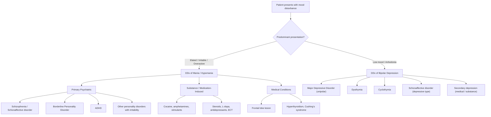

## Differential Diagnosis of Bipolar Disorder

The differential diagnosis of bipolar disorder is one of the most clinically important exercises in psychiatry, because ***misdiagnosis is extremely common — correct diagnosis and treatment is delayed by 5–7 years on average*** [1][2]. Getting this wrong has real consequences: treat bipolar depression with antidepressant monotherapy and you risk triggering a manic switch and cycle acceleration; label someone with personality-driven irritability as "bipolar" and you expose them to unnecessary mood stabilizer side effects [1].

The approach to differential diagnosis depends on **which pole** the patient is presenting with — the differentials for a **manic/hypomanic presentation** are different from those for a **depressive presentation**. Let's be systematic.

---

### Organising Framework

---

### 1. Differential Diagnosis of the Manic / Hypomanic Presentation

The lecture slides give a clear list of ***differential diagnoses of a manic episode*** [1]:

1. ***Depressive disorder with irritability and anxious distress***
2. ***Psychotic disorder or schizoaffective disorder***
3. ***Substance/medication-induced / medical conditions***
4. ***Attention deficit and hyperactivity disorder***
5. ***Personality disorder with prominent irritability***

Let's go through each in detail.

---

#### 1.1 Schizophrenia and Schizoaffective Disorder

This is ***the most difficult differential diagnosis*** [2] — and for good reason. Florid mania with psychotic features can look almost identical to an acute episode of schizophrenia. Both can present with agitation, grandiose or persecutory delusions, hallucinations, and disorganised behaviour.

**Why the confusion?**
- Schizophrenic symptoms occur commonly in mania: auditory hallucinations, delusions (including delusions of reference), even ***first-rank symptoms occur in 10–20% of manic patients*** [2]
- Conversely, schizophrenia patients can present with an excited, suspicious, or agitated mood that looks like mania [2]

**Key differentiating features:**

| Feature | Bipolar Disorder (Mania) | Schizophrenia |
|---|---|---|
| **Mood** | ***Prominent mood disturbance*** (elation, irritability, lability) is the **core** feature; psychosis is secondary | Mood may be flat, incongruent, or anxious; psychosis is the **core** feature |
| **Temporal relationship** | ***Psychotic symptoms occur within the context of mood disturbance*** and seldom outlast it [2] | ***Psychotic symptoms occur outside of mood disturbances*** and persist independently [2] |
| **Psychotic content** | Usually ***mood-congruent*** (grandiose delusions in mania, nihilistic in depression) | Often ***mood-incongruent, bizarre***, with ***delusions of passivity / thought alienation*** [2] |
| **First-rank symptoms** | Can occur but ***usually fleeting*** [2] | Persistent and prominent |
| **Thought disorder** | ***Circumstantiality, tangentiality, flight of ideas*** (logical link preserved when examined closely) [2] | ***Loosening of association, neologism, thought blocking*** [2] |
| **Speech** | ***Pressured, difficult to interrupt*** [2] | ***More hesitant/halting*** [2] |
| **Biological features** | ***Marked ↓ need for sleep, hyperactive*** [2] | ***Less ↓ need for sleep, less hyperactive*** [2] |
| **Motor** | Psychomotor excitation | May have ***catatonia or negative symptoms*** (in addition to agitation) [2] |
| **Course** | Episodic with good inter-episode recovery; insight often returns | More chronic deteriorating course; negative symptoms accumulate |
| **Premorbid function** | Often good | Often poor premorbid adjustment |

**Schizoaffective disorder** occupies the middle ground [3]:
- ***Concurrent schizophrenic and mood symptoms are equally prominent*** (***fulfilling a major mood episode, e.g., manic or depressive episode***) [3]
- Delusions and hallucinations are ***less mood-congruent*** and ***may occur outside mood episodes*** [2]
- Think of it as: "schizophrenia + mood disorder happening together, with both being prominent"

<Callout title="The Key Question for the DDx" type="idea">
Ask yourself: **"Do the psychotic symptoms exist independently of the mood disturbance?"**
- If psychosis ONLY occurs during mood episodes → **Bipolar disorder with psychotic features**
- If psychosis persists AFTER mood has normalised → Consider **schizoaffective disorder** or **schizophrenia**
- If psychosis and mood symptoms are equally prominent and concurrent → **Schizoaffective disorder**
</Callout>

---

#### 1.2 Substance/Medication-Induced Mania

***Drugs and medical conditions that cause manic symptoms*** [1]:

| Category | Examples | Mechanism |
|---|---|---|
| **Prescribed medications** | ***Steroids (corticosteroids)***, ***L-dopa***, ***stimulants (methylphenidate)***, ***antidepressants***, ***ECT*** (***in those with bipolar spectrum disorder***) [1] | Steroids: HPA axis dysregulation + direct effects on mood circuits. L-dopa: ↑ dopamine → mesolimbic activation. Antidepressants: serotonergic/noradrenergic push can destabilise mood in vulnerable individuals → "manic switch" |
| **Recreational drugs** | ***Cocaine, amphetamine*** [1] | Cocaine blocks dopamine reuptake; amphetamines cause dopamine release → massive mesolimbic dopamine surge mimicking mania |
| Other substances | Cannabis, hallucinogens, alcohol (during intoxication or withdrawal) | Variable mechanisms; cannabis can trigger psychotic mania in genetically predisposed individuals |

**How to differentiate:**
- ***Manic symptoms should ↓ after admission*** (when access to substances is removed) [2]
- ***Urine toxicology screen*** if substance use is suspected [2]
- Temporal relationship: symptoms began after starting a medication or using a substance, and resolve after discontinuation
- However, note that substances can **trigger** a genuine bipolar episode in a predisposed individual — so resolution after drug clearance doesn't always exclude bipolar disorder. Longitudinal follow-up is needed.

---

#### 1.3 Medical Conditions Causing Mania

***Frontal lobe lesion, hyperthyroidism, Cushing's syndrome*** [1]

| Condition | Why It Mimics Mania | Differentiating Clues |
|---|---|---|
| **Frontal lobe lesion** (tumour, trauma, stroke, MS plaque) | The frontal lobe provides top-down inhibition over limbic structures. A lesion here → ***extreme social disinhibition with NO gross mood disturbance*** [2] — the patient acts impulsively and inappropriately but isn't truly "elated" | ***Consider especially in middle-aged or older patients with expansive behaviour but NO past history of affective disorder*** [2]. In ***younger patients, consider HIV infection and head injury*** [2]. Neurological signs, cognitive deficits, neuroimaging abnormalities |
| **Hyperthyroidism** | Thyroid hormone excess → global metabolic activation: tachycardia, weight loss, tremor, anxiety, irritability, insomnia, psychomotor agitation — overlaps significantly with mania | Thyroid signs (goitre, lid lag, exophthalmos, warm moist skin), abnormal TFTs. Mood is more anxious/agitated than truly elated/grandiose |
| **Cushing's syndrome** | Cortisol excess → HPA axis disruption, direct effects on mood circuits → can cause mania, depression, or psychosis | Cushingoid features (moon face, central obesity, striae, buffalo hump), abnormal dexamethasone suppression test |
| **Other** | Neurosyphilis, HIV encephalopathy, temporal lobe epilepsy, cerebrovascular disease, delirium | Respective clinical features; always consider organic causes in **late-onset "mania"** ( > 40 years) with no prior psychiatric history |

<Callout title="Red Flags for Organic Mania" type="error">
Always suspect an organic cause when:
- ***First episode of mania in a middle-aged/older patient with NO past psychiatric history*** [2]
- Acute onset with confusion or fluctuating consciousness (→ delirium)
- Focal neurological signs
- Recent head trauma
- Known medical illness (thyroid, Cushing's, HIV)
- Atypical features (e.g., visual hallucinations are more suggestive of organic cause)
</Callout>

---

#### 1.4 Borderline Personality Disorder (BPD)

This is a **very common** diagnostic dilemma, especially in emergency settings [2].

***Borderline PD is often associated with marked affective instability → mimics rapid cycling bipolar disorder*** [2]

**Key differentiating features** [2]:

| Feature | Bipolar Disorder | Borderline Personality Disorder |
|---|---|---|
| **Family history** | ***Often positive FHx of bipolar disorder*** | ***No FHx of bipolar disorder*** [2] |
| **Mood shift speed** | Episodes last days to weeks/months | ***Rapid shifts of mood (over hours and days)*** [2], often within the same day |
| **Trigger** | Episodes may arise spontaneously (especially later in illness) | ***Mood disturbances often triggered by interpersonal issues*** [2] (rejection, abandonment) |
| **Manic symptoms** | ***Classic symptoms of mania present: ↑ energy, grandiosity, flight of ideas, ↓ need for sleep*** | ***No classic symptoms of mania*** [2] — no true grandiosity, no flight of ideas, no genuinely ↓ need for sleep |
| **Course** | Episodic — distinct episodes with intervening euthymia | ***Stable and enduring behaviour pattern*** (trait-like, not episodic) [2] |
| **Self-harm** | Suicide attempts (often during depressive or mixed episodes) | Chronic self-harm and suicidal gestures, often impulsive, linked to interpersonal crises |
| **Identity** | Intact sense of self between episodes | Chronic identity disturbance ("Who am I?") |
| **Relationships** | May be disrupted during episodes but stable between them | Chronic pattern of intense, unstable relationships with splitting (idealisation/devaluation) |

<Callout title="The Practical Test">
Ask: "Does this patient have **discrete episodes** with clear onset and offset, during which their personality and functioning fundamentally change? Or do they have a **chronic pattern** of emotional instability that is always present but worsens in interpersonal situations?"

Episodes with clear boundaries → think **bipolar**
Chronic instability, always there, worsens with interpersonal triggers → think **BPD**

(Note: they can co-exist! ~20% of BPD patients also have bipolar disorder.)
</Callout>

---

#### 1.5 Attention Deficit Hyperactivity Disorder (ADHD)

***ADHD and mania share several features*** [2][4]:

**Similarities:**
- ***↓ attention, difficulty with task completion***
- ***↑ energy and disinhibited behaviour***
- ***Distractibility, impulsivity, talkativeness*** [4]

**Key differences** [2][4]:

| Feature | Bipolar Disorder | ADHD |
|---|---|---|
| **Self-esteem** | ***↑ self-esteem, grandiosity*** | Normal or low self-esteem |
| **Flight of ideas** | Present in mania | Absent (thoughts are scattered, not "racing") |
| **Sleep** | ***↓ need for sleep*** (feels rested) | Sleep difficulties (can't settle), but feels tired |
| **Mood** | ***Elated mood, euphoria, or marked irritability*** [4] | Frustration-based irritability, but no true elation |
| **Course** | ***Episodic*** — features tend to occur episodically [4] | ***Chronic (trait-like)*** — ***more stable and enduring behaviour pattern*** [2]; symptoms present since childhood and are **pervasive** |
| **Onset** | Mean onset ~18 years (though may be earlier) | By definition, onset before age 12 |

***ADHD should NOT have ↑ self-esteem, grandiosity, flight of ideas, or ↓ need for sleep*** [2]

**Important caveat:** ADHD and bipolar disorder can **co-exist** (comorbidity is common), making the differentiation even harder. Look for the episodic pattern layered on top of the chronic baseline.

---

#### 1.6 Depressive Disorder with Irritability and Anxious Distress

***This is listed as the first differential on the lecture slides*** [1] — and it's an important clinical scenario.

Why? Because an agitated, irritable depressed patient can be mistaken for having an irritable manic episode. The key difference:
- In **agitated depression**: the irritability is driven by **distress, anxiety, and inner tension**; the patient feels **terrible** and is agitated because of their suffering
- In **irritable mania**: the irritability is driven by **frustration that the world doesn't match the patient's grandiose self-concept**; the patient feels **great** (or at least energised) and is irritable because others are "in the way"

Look for:
- Presence of other manic features (grandiosity, ↓ need for sleep, pressured speech, flight of ideas)
- If these are absent → more likely agitated depression
- ***Hypomanic episodes can be missed or under-reported → should be actively elicited*** [2]

---

### 2. Differential Diagnosis of the Depressive Presentation

***The majority of bipolar disorder patients present with depression as their first episode*** [2]. This is the main source of the infamous diagnostic delay.

#### 2.1 Major Depressive Disorder (Unipolar Depression)

This is the ***most common misdiagnosis*** [1]:
- ***Hypomanic episodes are often overlooked → patients with Bipolar II are misdiagnosed as having major depressive disorder*** [1]

**How to differentiate bipolar depression from unipolar MDD** [2]:

| Feature | Bipolar Depression | Unipolar MDD |
|---|---|---|
| **Age of onset** | Younger (teens to early 20s) | Often later (late 20s–30s) |
| **Family history** | Bipolar disorder in first-degree relatives | Depression (without mania) in relatives |
| **Psychomotor features** | ***More psychomotor retardation*** | More agitation |
| **Sleep** | ***More hypersomnia*** (atypical features) | More insomnia (typical features) |
| **Appetite** | ***More hyperphagia*** | More anorexia |
| **Psychotic features** | ***More common*** | Less common |
| **Diurnal variation** | ***Morning dysphoria*** (worse AM, better PM) | Can be either pattern |
| **Episode frequency** | More frequent, shorter episodes | Less frequent, longer episodes |
| **Postpartum onset** | More likely | Less likely |
| **Antidepressant response** | Partial or may trigger hypomania/mania | Usually full response |
| **Past hypomania** | Present (but may need to be actively elicited!) | Absent |

***Discerning features suggesting bipolarity: psychotic features, atypical features (e.g., hypersomnia, hyperphagia, leaden paralysis)*** [2]

<Callout title="The Most Important Question in Psychiatry" type="error">
When you see a patient presenting with depression, **ALWAYS screen for past mania/hypomania**:

"Has there ever been a time — even if it lasted just a few days — when you felt the opposite? Unusually energetic, on top of the world, needing much less sleep but not feeling tired, spending more money than usual, taking unusual risks?"

If the patient says no, **ask the informant**. Patients often don't report hypomania because it feels good. This single question can prevent years of misdiagnosis.
</Callout>

#### 2.2 Dysthymia and Cyclothymia

- **Dysthymia** (persistent depressive disorder): chronic low-grade depression lasting ≥2 years, not meeting full MDE criteria. No manic/hypomanic episodes → not bipolar [2]
- **Cyclothymia**: chronic fluctuation between subthreshold hypomanic and depressive symptoms. It sits on the ***bipolar spectrum*** and management is ***similar to bipolar disorder*** [2]. The key is that symptoms never meet full criteria for a manic, hypomanic, or major depressive episode.

#### 2.3 Schizoaffective Disorder (Depressive Type)

- ***Concurrent schizophrenic and depressive symptoms that are equally prominent*** [3]
- Psychotic features persist outside of mood episodes (unlike bipolar depression with psychotic features, where psychosis resolves when mood normalises)

---

### 3. The Misdiagnosis and Overdiagnosis Problem

This is emphasised heavily in the lecture slides and deserves its own section [1]:

#### ***Underdiagnosis*** [1]
- ***Hypomanic episode is often overlooked. Patients with BP II are misdiagnosed as having major depressive disorder*** [1]
- ***Manic episode with psychotic symptoms misdiagnosed as schizophrenia*** [1]
- ***Among 600 patients with bipolar disorder, 69% were initially misdiagnosed — most frequently as major depression, followed by anxiety disorders, substance or alcohol use disorder*** [1]

**Consequences of underdiagnosis** [1]:
- ***Untreated mood symptoms → increased suicidality, comorbid anxiety and substance use disorders***
- ***Poor QoL, greater functional impairment, increased healthcare cost***
- ***Antidepressant monotherapy is less effective and results in manic switch and cycle acceleration***

#### ***Overdiagnosis*** [1]
- ***Due to incorrect understanding of the term "manic" ("躁")*** [1]
- ***Among 180 outpatients previously diagnosed with bipolar disorder, structured interview could not confirm the diagnosis in 43 (33%) of them*** [1]
- ***In another study, only 43% of 145 patients with a previous diagnosis of bipolar disorder had the condition confirmed by structured interview*** [1] (***retrospective recall can be inaccurate***)
- ***Requires informants and collateral information (e.g., medical record) to confirm past history of mania/hypomania*** [1]

**Consequences of overdiagnosis** [1]:
- ***Unnecessary side effects of mood stabilizers***
- ***Increase sick role and disability claims***

#### ***Correct diagnosis depends on*** [1]:
- ***History from the patient***
- ***Collateral information from informants***
- ***Help by the use of screening tools: Mood Disorder Questionnaire (MDQ), Hypomania Checklist (HCL-32)***
- ***It is important to follow diagnostic criteria in making psychiatric diagnosis*** [1]

---

### 4. Summary Table: Key Differential Diagnoses at a Glance

| Differential | Key Differentiating Features from Bipolar Disorder |
|---|---|
| **Schizophrenia** | Psychosis persists outside mood episodes; mood-incongruent/bizarre delusions; loosening of association (not flight of ideas); negative symptoms; chronic deteriorating course |
| **Schizoaffective disorder** | Concurrent and equally prominent psychotic + mood symptoms; psychosis may occur outside mood episodes |
| **MDD (unipolar)** | No history of mania/hypomania; less psychomotor retardation; less atypical features; antidepressants work without manic switch |
| **Borderline PD** | Mood shifts over hours (not days/weeks); triggered by interpersonal events; no grandiosity/flight of ideas/↓ need for sleep; chronic trait-like course; identity disturbance |
| **ADHD** | Chronic trait-like since childhood; no grandiosity/euphoria/↓ need for sleep; no episodic pattern |
| **Substance-induced** | Temporal relationship to substance use; resolves after clearance; urine tox screen positive |
| **Organic/medical** | Late onset, no past psychiatric Hx, focal neurological signs; specific medical features (thyroid, Cushing's, frontal lobe); abnormal investigations |
| **Agitated depression** | Irritability from distress (not frustration/grandiosity); no other manic features |

---

<Callout title="High Yield Summary">

**DDx of Manic Presentation (from lecture slides):** (1) Depressive disorder with irritability/anxious distress, (2) Psychotic disorder/schizoaffective disorder, (3) Substance/medication-induced or medical conditions (steroids, L-dopa, stimulants, antidepressants, ECT; cocaine, amphetamine; frontal lobe lesion, hyperthyroidism, Cushing's), (4) ADHD, (5) Personality disorder with prominent irritability (esp. BPD).

**Key Distinctions:**
- Schizophrenia vs Mania: Psychosis outlasts mood in schizophrenia; mood-incongruent, bizarre delusions; FRS persistent (vs fleeting in mania); loosening of association (vs flight of ideas); chronic course.
- BPD vs Bipolar: BPD = chronic/trait-like, mood shifts in hours, interpersonal triggers, no grandiosity/↓ sleep; Bipolar = episodic, ↑ energy/grandiosity/↓ sleep.
- ADHD vs Mania: ADHD = chronic since childhood, no grandiosity/euphoria/↓ need for sleep; Mania = episodic.
- Organic mania: Always suspect if late-onset, no past Hx, neurological signs.

**Misdiagnosis:** 69% initially misdiagnosed. Most common error = BP II → MDD (hypomania missed). Delayed 5–7 years. Consequence: antidepressant monotherapy → manic switch + cycle acceleration.

**Correct diagnosis requires:** Patient history + collateral from informants + screening tools (MDQ, HCL-32) + adherence to diagnostic criteria.
</Callout>

---

<ActiveRecallQuiz
  title="Active Recall - Differential Diagnosis of Bipolar Disorder"
  items={[
    {
      question: "List 5 differential diagnoses for a manic episode as presented in the lecture slides.",
      markscheme: "(1) Depressive disorder with irritability and anxious distress, (2) Psychotic disorder or schizoaffective disorder, (3) Substance/medication-induced or medical conditions, (4) ADHD, (5) Personality disorder with prominent irritability. Full marks for all 5."
    },
    {
      question: "Name 3 key features that help differentiate mania with psychotic features from schizophrenia.",
      markscheme: "Any 3 of: (1) In mania, psychotic symptoms occur within mood disturbance and seldom outlast it vs persist independently in schizophrenia; (2) Mood-congruent delusions in mania vs mood-incongruent or bizarre delusions in schizophrenia; (3) Flight of ideas with preserved logical link in mania vs loosening of association in schizophrenia; (4) Pressured speech in mania vs hesitant speech in schizophrenia; (5) First-rank symptoms fleeting in mania vs persistent in schizophrenia; (6) Episodic course with good recovery vs chronic deterioration."
    },
    {
      question: "How do you differentiate borderline personality disorder from rapid cycling bipolar disorder?",
      markscheme: "BPD: mood shifts over hours (not days-weeks), triggered by interpersonal events, no classic manic symptoms (no grandiosity, flight of ideas, decreased need for sleep), chronic trait-like course, no FHx of BAD, identity disturbance. Bipolar: discrete episodes with onset/offset, spontaneous or stress-triggered, classic manic features present, episodic course with inter-episode euthymia, often positive FHx."
    },
    {
      question: "What drugs and medical conditions can cause manic symptoms? Give at least 3 drugs and 3 medical conditions.",
      markscheme: "Drugs: steroids, L-dopa, stimulants (methylphenidate), antidepressants, ECT (in bipolar spectrum), cocaine, amphetamine. Medical conditions: frontal lobe lesion (tumour, trauma), hyperthyroidism, Cushing's syndrome. Also accept: HIV, neurosyphilis, TLE, cerebrovascular disease."
    },
    {
      question: "What are the consequences of underdiagnosis vs overdiagnosis of bipolar disorder?",
      markscheme: "Underdiagnosis: untreated mood symptoms lead to increased suicidality, comorbid anxiety and substance use disorders, poor QoL, greater functional impairment, increased healthcare cost; antidepressant monotherapy is less effective and causes manic switch and cycle acceleration. Overdiagnosis: unnecessary side effects of mood stabilizers, increased sick role and disability claims."
    },
    {
      question: "A 45-year-old man with no psychiatric history presents with expansive behaviour, social disinhibition, and poor judgment but no clear mood elevation. What diagnosis should you consider and what investigation would you order?",
      markscheme: "Consider frontal lobe pathology (tumour, stroke, trauma). The extreme social disinhibition with no gross mood disturbance points to a frontal lobe lesion rather than primary mania. Order CT or MRI brain. Also consider HIV infection. In this age group with no past psychiatric history, always rule out organic causes before diagnosing bipolar disorder."
    }
  ]}
/>

## References

[1] Lecture slides: GC 163. I am a superman Bipolar disorder.pdf (p10, p11, p12, p13, p14, p15, p17, p22)
[2] Senior notes: ryanho-psych.md (sections 7.3, 7.1.2, pp.357–402)
[3] Lecture slides: GC 170. Schizophrenia and related psychoses.pdf (p22)
[4] Senior notes: ryanho-psych.md (ADHD section, p.664)
