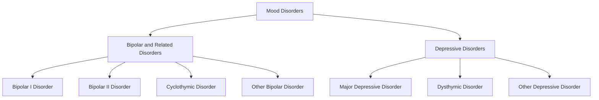
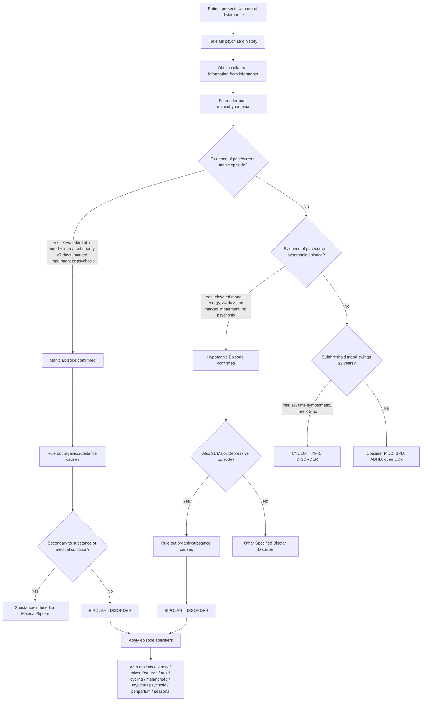

## Diagnostic Criteria for Bipolar Disorder

Getting the diagnostic criteria right is essential — as we've discussed, ***misdiagnosis is extremely common*** and ***correct diagnosis and treatment was delayed by 5–7 years on average*** [1]. The diagnosis is **entirely clinical**: there is no blood test, no imaging finding, no biomarker. It rests on a careful psychiatric history, mental state examination, collateral information, and rigorous application of diagnostic criteria [1].

Let's break this down systematically.

---

### 1. DSM-5 Classification of Mood Disorders

The DSM-5 separates mood disorders into two distinct chapters, reflecting the conceptual "bridge" position of bipolar disorder between psychotic and depressive disorders [1]:

---

### 2. Diagnostic Criteria: Manic Episode (DSM-5)

The manic episode is the **defining episode** for Bipolar I disorder. Let me walk you through the DSM-5 criteria and explain the logic behind each one.

#### Criterion A — Core Symptoms

***Both of the following core symptoms must be present*** [1][2]:

1. ***Abnormally elevated, expansive, or irritable mood***
2. ***Increased energy or goal-directed activity***

> **Why BOTH?** Because elevated mood alone could be a personality trait or substance effect. The DSM-5 specifically added "increased energy/activity" as a co-required core feature to improve diagnostic specificity — you need the mood disturbance AND the energy/activity change.

#### Criterion B — Associated Symptoms

**≥3 of the following** (or **≥4 if mood is only irritable**) must be present during the mood disturbance, to a significant degree, and represent a noticeable change from usual behaviour [2]:

| # | Symptom | Mnemonic (DIG FAST) | Why It Occurs (Pathophysiology) |
|---|---|---|---|
| 1 | Inflated self-esteem or **grandiosity** | **G** | Dopaminergic mesolimbic hyperactivity → aberrant salience assigned to self-referential thoughts |
| 2 | Decreased **need for sleep** (e.g., feels rested after only 3 hours) | **S** | Noradrenergic/dopaminergic overactivation of ascending reticular activating system + circadian rhythm disruption |
| 3 | More **talkative** than usual or pressure to keep talking | **T** | Racing thoughts overflow into speech; cortical hyperexcitability → pressured speech |
| 4 | **Flight of ideas** or subjective experience of racing thoughts | **F** | Disinhibited cortical association pathways; GABAergic deficit → rapid, loosely connected thought chains |
| 5 | **Distractibility** (attention too easily drawn to unimportant stimuli) | **D** | dlPFC executive dysfunction → impaired attentional filtering |
| 6 | Increase in goal-directed **activity** (socially, at work/school, or sexually) or psychomotor agitation | **A** | Striatal dopaminergic drive → motivation and motor activation |
| 7 | Excessive involvement in activities with high potential for painful consequences (**impulsivity/irresponsibility**) — e.g., buying sprees, sexual indiscretions, foolish investments | **I** | Ventral striatum (reward) overactive + vmPFC (consequence evaluation) underactive → reward-seeking without risk appraisal |

> **Why ≥4 if irritable only?** Because irritability is less specific — many psychiatric conditions feature irritability. Requiring an extra symptom raises the diagnostic bar when elation/expansiveness is absent, reducing false positives.

#### Criterion C — Duration

***≥7 days*** (present most of the day, nearly every day), **OR** any duration if **hospitalisation is required** [2]

> **Why 7 days?** This distinguishes mania from briefer mood fluctuations (e.g., BPD, substance effects). The hospitalisation exception exists because severe mania warrants the diagnosis even before the 7-day threshold is met — clinical severity overrides duration.

#### Criterion D — Severity / Impairment

***Marked impairment*** in social or occupational functioning, OR hospitalisation required to prevent harm, OR psychotic features are present [2]

> This is the criterion that separates mania from hypomania. The presence of marked impairment or psychosis = mania. Without them = hypomania.

#### Criterion E — Exclusion

Not attributable to the physiological effects of a substance (drug of abuse, medication) or another medical condition [2]

> Important: a manic episode that emerges during antidepressant treatment but persists at fully syndromal level beyond the physiological effect of the substance IS counted as a genuine manic episode (and therefore qualifies the patient for Bipolar I).

---

### 3. Diagnostic Criteria: Hypomanic Episode (DSM-5)

The hypomanic episode is structurally very similar to the manic episode but with **three critical differences** [1][2]:

| Feature | Mania | Hypomania |
|---|---|---|
| **Duration** | ***≥7 days*** (or any if hospitalisation required) | ***≥4 consecutive days*** |
| **Functional impairment** | ***Marked impairment*** or hospitalisation | ***No marked impairment*** — an unequivocal change in functioning that is observable by others, but NOT severe enough to cause marked impairment or require hospitalisation [2] |
| **Psychotic features** | May be present | ***NEVER present*** [2] — if psychosis occurs, it is by definition mania |

**Criteria A & B:** Same as mania (elevated/expansive/irritable mood + increased energy; ≥3 or ≥4 associated symptoms)

**Criterion C:** Episode is associated with an **unequivocal change in functioning** that is **not characteristic of the individual when not symptomatic**

**Criterion D:** The disturbance and change in functioning are **observable by others** — this is key, because the patient often doesn't recognise hypomania as pathological (ego-syntonic)

<Callout title="The Hypomania Trap" type="error">
Hypomania is often missed because:
- The patient feels **great** and doesn't complain about it
- It may look like a "good week" or an energetic personality
- ***Retrospective recall can be inaccurate*** [1]
- ***Requires informants and collateral information (e.g., medical record) to confirm past history of mania/hypomania*** [1]
- ***Screening tools like the MDQ and HCL-32 can help*** [1]
If you miss hypomania, you diagnose MDD instead of Bipolar II → treat with antidepressant monotherapy → ***manic switch and cycle acceleration*** [1].
</Callout>

---

### 4. Diagnostic Criteria: Major Depressive Episode (in context of Bipolar Disorder)

The depressive episode criteria are the same as for MDD. Required for Bipolar II (not technically required for Bipolar I, though nearly all Bipolar I patients experience depression):

**≥5 of the following 9 symptoms** present during the same 2-week period, with at least one being depressed mood or loss of interest/pleasure [2]:

1. **Depressed mood** most of the day, nearly every day
2. **Anhedonia** — markedly diminished interest or pleasure
3. **Weight/appetite change** (significant weight loss/gain or decrease/increase in appetite)
4. **Sleep disturbance** (insomnia or hypersomnia)
5. **Psychomotor agitation or retardation** (observable by others)
6. **Fatigue or loss of energy**
7. **Worthlessness or excessive guilt**
8. **Diminished concentration** or indecisiveness
9. **Recurrent thoughts of death**, suicidal ideation, or suicide attempt

---

### 5. Diagnostic Criteria: Bipolar I vs Bipolar II vs Cyclothymia

| Criterion | Bipolar I | Bipolar II | Cyclothymia |
|---|---|---|---|
| **Key requirement** | ***≥1 lifetime manic episode*** [1] | ***≥1 hypomanic episode AND ≥1 major depressive episode*** [1] | Numerous periods of hypomanic and depressive symptoms ***NOT meeting full criteria for either***, for ***≥2 years*** [2] |
| **Manic episodes** | Present (defines the diagnosis) | ***Never a manic or mixed episode*** [1] | Never |
| **Depressive episodes** | Common (~95%) but NOT required for diagnosis | Required (≥1 MDE) | Subthreshold only |
| **Psychotic features** | May occur (in mania or depression) | Only in depressive episodes (never in hypomania) | No |
| **Exclusion** | ***Not better explained by any of the psychotic disorders*** [2] | ***Not better explained by any of the psychotic disorders; causes clinically significant distress or impaired functioning*** [2] | ≥½ time symptomatic; symptom-free < 2 consecutive months [2] |

***DSM-5 criteria for Bipolar I disorder:*** [1]
- ***Most cases have both manic and depressive episodes***
- ***There is a predominant polarity; more manic or more depressive episodes***
- ***Presence of one single manic episode already satisfies criteria for Bipolar I disorder, which occurs in only 5%*** [1]

***DSM-5 criteria of Bipolar II disorder:*** [1]
- ***At least one hypomanic episode***
- ***At least one previous depressive episode***
- ***Never has a manic or mixed episode***
- ***Depressive episodes are more common in Bipolar II disorder*** [1]

***Bipolar I, Bipolar II, and Bipolar spectrum:*** [1]
- ***BP I: severe mood episodes***
- ***BP II: milder manic symptoms, prominent depressive element, can have the same degree of long-term impairment as BP I***
- ***BP spectrum: bothered by frequent mood changes, can be mistaken as borderline personality disorder***

#### ICD-10 vs DSM-5 Comparison

| Feature | ICD-10 | DSM-5 |
|---|---|---|
| Bipolar diagnosis requires | ***≥2 episodes of mood disruption***, with ***≥1 hypomanic, manic, or mixed affective episode*** [2] | ***≥1 lifetime manic episode*** (for Bipolar I) — a single manic episode suffices [1][2] |
| Classification codes | F31.0 (current hypomanic) through F31.7 (in remission) [2] | Bipolar I / Bipolar II, with current/most recent episode specifiers |
| Mixed episodes | Separate subtype (F31.6) | Specifier ("with mixed features") applied to any episode |

<Callout title="ICD-10 vs DSM-5 — The Key Difference" type="idea">
***In ICD-10, ≥2 mood disturbances must have occurred to diagnose bipolar disorder. In DSM-5, only 1 mood disturbance episode is required for Bipolar I if the said disturbance is mania*** [2]. This means a patient with a single manic episode and no depression gets diagnosed as Bipolar I under DSM-5 but not under ICD-10. In practice, this rarely matters because ~95% of Bipolar I patients eventually develop depressive episodes.
</Callout>

---

### 6. Diagnostic Algorithm

Here is a systematic approach to diagnosing bipolar disorder:

#### Step-by-Step Clinical Approach

**Step 1: Establish the current mood episode**
- What is the patient presenting with right now — mania, hypomania, depression, mixed features, or euthymia?
- Use DSM-5 criteria to classify the current episode

**Step 2: Take a thorough longitudinal history**
- ***History from the patient*** [1]
- ***Collateral information from informants*** — absolutely critical [1]
- Map out ALL previous mood episodes on a timeline (mood chart is helpful [2])
- Specifically ask about past mania/hypomania — patients don't volunteer this

**Step 3: Use screening tools**
- ***Mood Disorder Questionnaire (MDQ)*** [1] — 13 yes/no items based on DSM criteria for mania/hypomania; sensitivity ~73%, specificity ~90% in clinical settings
- ***Hypomania Checklist (HCL-32)*** [1] — 32-item self-report; better sensitivity for Bipolar II/soft spectrum

**Step 4: Rule out organic and substance-induced causes**
- Investigations (see below)
- ***Drugs and medical conditions that cause manic symptoms: steroids, L-dopa, stimulants, antidepressants, ECT (in those with bipolar spectrum disorder); cocaine, amphetamine; frontal lobe lesion, hyperthyroidism, Cushing's syndrome*** [1]

**Step 5: Classify the bipolar subtype**
- Bipolar I, II, cyclothymia, or other specified

**Step 6: Apply specifiers**
- With mixed features, rapid cycling, psychotic features, peripartum onset, etc.

**Step 7: Assess severity and risk**
- Suicide risk (especially in depressive/mixed episodes)
- Risk to others (especially in mania with irritability/psychosis)
- Functional impairment
- Comorbidities

---

### 7. Investigations

Investigations in bipolar disorder serve **three purposes**:
1. **Exclude organic/substance-induced mania** (differential diagnosis)
2. **Establish a baseline** before starting mood stabilizers/antipsychotics (which have significant metabolic and organ-specific side effects)
3. **Screen for comorbidities** and neglect

#### ***Baseline Laboratory Investigations in Bipolar Disorder*** [1]

The lecture slides provide a clear list [1]:

| Investigation | Rationale and Key Findings |
|---|---|
| ***CBP (Complete blood picture)*** [1] | Exclude anaemia (fatigue mimicking depression), infection (delirium mimicking mania), ↑MCV (macrocytosis from alcohol use — comorbid substance abuse is common) |
| ***LRFT (Liver and renal function tests)*** [1] | **Liver:** Baseline before valproate (hepatotoxic — valproate can cause fatal hepatic failure, especially in children); GGT elevated in alcoholism. **Renal:** Baseline before lithium (lithium is filtered by the kidney and is nephrotoxic — can cause nephrogenic diabetes insipidus, chronic tubulointerstitial nephropathy); U/Cr for renal dosing |
| ***TFT (Thyroid function tests)*** [1] | **Three reasons:** (1) Hyperthyroidism mimics mania (↑ energy, irritability, insomnia, weight loss); (2) Hypothyroidism is associated with rapid cycling; (3) Lithium causes hypothyroidism (in ~5–35% of patients) by inhibiting thyroid hormone synthesis. Baseline essential before starting lithium, then monitor regularly |
| ***Fasting glucose and lipid profile*** [1] | Baseline metabolic screening before starting atypical antipsychotics (olanzapine, quetiapine → weight gain, insulin resistance, dyslipidaemia, metabolic syndrome). Also screening for pre-existing diabetes/CVD risk (bipolar patients have ↑ cardiovascular mortality) |
| ***24-hour creatinine clearance (if history of renal disease)*** [1] | More precise assessment of renal function before lithium in patients with known/suspected renal impairment. Lithium has a narrow therapeutic index — requires normal renal clearance for safe dosing |
| ***Urine for toxicology (if relevant)*** [1] | ***Exclude substance-induced mania*** — cocaine, amphetamines, cannabis. Substance abuse comorbidity is 40–60% in bipolar disorder. Manic symptoms from substance use ***should ↓ after admission*** [2] |
| ***Pregnancy test (if relevant)*** [1] | Many mood stabilizers are teratogenic: **valproate** is absolutely contraindicated in pregnancy (neural tube defects, craniofacial abnormalities, neurodevelopmental impairment); **lithium** carries risk of Ebstein anomaly (tricuspid valve malformation); **carbamazepine** is also teratogenic. Must exclude pregnancy before starting these agents |
| ***ECG (if relevant)*** [1] | Baseline before medications that prolong QTc interval (some antipsychotics — especially ziprasidone, haloperidol; also lithium can cause T-wave changes, sinus node dysfunction). Also if cardiac history or older patient |

#### Additional Investigations (as clinically indicated)

| Investigation | When to Order | Interpretation |
|---|---|---|
| **CT/MRI brain** | Late-onset mania ( > 40 years) with no prior psychiatric history; focal neurological signs; atypical presentation; suspected frontal lobe lesion [2] | Exclude tumour, cerebrovascular disease, demyelination, traumatic brain injury |
| **EEG** | Suspected temporal lobe epilepsy (ictal mood changes, automatisms, aura); episodic behavioural disturbance | Epileptiform discharges in temporal regions |
| **Calcium** | Screen for hyperparathyroidism (hypercalcaemia can cause psychiatric symptoms including mania and psychosis) | Elevated Ca → investigate further with PTH |
| **Vitamin B12 / Folate** | Suspected nutritional deficiency (especially in elderly, comorbid alcohol use) [2] | Deficiency can cause mood disturbance, cognitive impairment |
| **HIV test** | Young patient with new-onset mania, risk factors for HIV | HIV can cause manic symptoms via direct CNS involvement |
| **Syphilis serology (VDRL/RPR)** | Suspected neurosyphilis (late-onset behavioural change, cognitive decline) [2] | Neurosyphilis can present with mania-like symptoms |
| **CRP/ESR** | Suspected inflammatory or infectious cause | Non-specific markers of inflammation |
| **Cosyntropin (ACTH) stimulation test** | Suspected Cushing's or Addison's disease | Abnormal cortisol response |
| **Lithium level** (if already on lithium) | Therapeutic drug monitoring; suspected toxicity | Therapeutic range 0.6–1.0 mmol/L (acute mania: up to 1.2); toxicity > 1.5 |

<Callout title="Why These Specific Baseline Investigations?">
The baseline investigations are driven by **two principles**:

1. **What could mimic bipolar disorder?** → TFTs (hyperthyroidism), urine toxicology (stimulants), CT brain (frontal lobe lesion)

2. **What do I need to know before starting treatment?** → RFT (for lithium), LFT (for valproate), fasting glucose + lipids (for antipsychotics), pregnancy test (teratogenicity), ECG (QTc-prolonging drugs)

Every investigation on the list has a specific therapeutic decision tied to it. This isn't a "routine screen" — it's a targeted safety evaluation.
</Callout>

#### Monitoring Investigations During Treatment

Once treatment is initiated, ongoing monitoring is essential. The specifics depend on the medication:

| Medication | Key Monitoring | Frequency | Why |
|---|---|---|---|
| **Lithium** | Serum lithium level, U&E/Cr, eGFR, TFTs, calcium, weight | Li level: weekly until stable, then every 3–6 months; RFT/TFT: every 6 months | Narrow therapeutic index (0.6–1.0); nephrotoxicity; hypothyroidism; hyperparathyroidism |
| **Valproate** | LFTs, CBP, weight | Baseline, then at 6 months, then annually | Hepatotoxicity; thrombocytopaenia; teratogenicity (ongoing pregnancy tests in women of childbearing age) |
| **Carbamazepine** | CBP, LFTs, U&E, drug level | Regular, especially early | Agranulocytosis; aplastic anaemia; SIADH (hyponatraemia); hepatotoxicity |
| **Atypical antipsychotics** | Fasting glucose, lipid profile, weight/BMI/waist circumference, BP | Baseline, 3 months, 6 months, then annually | Metabolic syndrome; weight gain; diabetes; dyslipidaemia |

---

### 8. The Role of Screening Tools

***Correct diagnosis of bipolar disorder*** requires [1]:
- ***History from the patient***
- ***Collateral information from informants***
- ***Help by the use of screening tools***

| Tool | Description | Use |
|---|---|---|
| ***Mood Disorder Questionnaire (MDQ)*** [1] | 13-item yes/no self-report screening tool based on DSM criteria for mania/hypomania. Also asks if symptoms occurred at the same time and caused moderate-to-serious problems | Screening for Bipolar I (good sensitivity); less sensitive for Bipolar II. A positive screen requires clinical confirmation |
| ***Hypomania Checklist (HCL-32)*** [1] | 32-item self-report checklist specifically designed to detect hypomania, including "softer" presentations | Better sensitivity for Bipolar II and bipolar spectrum than MDQ. Useful when you suspect bipolarity in a patient presenting with depression |

> ***It is important to follow diagnostic criteria in making psychiatric diagnosis*** [1]. Screening tools **assist** but do not replace clinical judgment. ***Structured interview could not confirm the diagnosis in 33% of previously diagnosed outpatients*** [1] — highlighting that even experienced clinicians can overdiagnose without rigorous criteria.

---

### 9. Assessment Framework: Putting It All Together

The senior notes provide a comprehensive assessment structure [2]:

#### History Taking Components

| Component | What to Elicit |
|---|---|
| **Core symptoms** | Elated mood, irritability, violence risk, duration, severity, sleep pattern, energy level, activity changes |
| **Associated symptoms** | Grandiosity, flight of ideas, distractibility, pressured speech, impulsivity, reckless behaviour, spending patterns, sexual behaviour |
| **Psychotic features** | Delusions (grandiose, persecutory, reference), hallucinations (auditory, visual), first-rank symptoms |
| **Depressive features** | Screen for concurrent/past depressive episodes (for Bipolar II diagnosis); mixed features |
| **Past psychiatric history** | Previous mood episodes (mania, hypomania, depression), hospitalisations, treatments tried, response |
| **Collateral history** | From family/friends — ***essential for detecting hypomania*** that the patient doesn't report [1] |
| **Substance use history** | Alcohol, cannabis, stimulants, prescribed medications |
| **Family history** | Bipolar disorder, schizophrenia, depression, suicide in first-degree relatives |
| **Suicide risk assessment** | Past attempts, current ideation, plans, access to means, protective factors |
| **Premorbid personality** | Baseline functioning, temperament (cyclothymic traits?) |
| **Social history** | Relationships, employment, living situation, forensic history (impulsive acts during mania) |

#### Mental State Examination

Systematically assess every MSE domain and document findings (as detailed in the Clinical Features section of Part 1):
- Appearance, behaviour, speech, mood (subjective and objective), thought form, thought content, perception, cognition, insight, risk

---

<Callout title="High Yield Summary">

**Diagnostic Criteria — Key Points:**

**Manic Episode (Bipolar I):** Elevated/expansive/irritable mood + increased energy (both required) + ≥3 associated symptoms (DIG FAST; ≥4 if irritable only) + ≥7 days (or any duration if hospitalised) + marked impairment/psychosis + not substance-induced.

**Hypomanic Episode (Bipolar II):** Same core + associated symptoms as mania BUT ≥4 days only, NO marked impairment, NEVER psychotic. Observable change in functioning. Bipolar II also requires ≥1 MDE.

**ICD-10 vs DSM-5:** ICD-10 requires ≥2 mood episodes for bipolar; DSM-5 requires only 1 manic episode for Bipolar I.

**Diagnostic Algorithm:** History (including collateral) → Screen for past mania/hypomania (MDQ, HCL-32) → Classify current episode → Rule out organic/substance causes → Classify subtype (I/II/cyclothymia) → Apply specifiers → Assess risk.

**Baseline Investigations (from lecture slides):** CBP, LRFT, TFT, fasting glucose + lipids, 24h CrCl (if renal disease), urine toxicology (if relevant), pregnancy test (if relevant), ECG (if relevant). Purpose: exclude organic mimics + establish baseline before treatment.

**Screening Tools:** MDQ (13 items, good for BP I), HCL-32 (32 items, better for BP II). Neither replaces clinical interview + collateral history.
</Callout>

---

<ActiveRecallQuiz
  title="Active Recall - Diagnostic Criteria, Algorithm and Investigations"
  items={[
    {
      question: "What are the TWO core symptoms required for a DSM-5 manic episode, and how many associated symptoms are needed?",
      markscheme: "Core: (1) Abnormally elevated, expansive, or irritable mood AND (2) Increased energy or goal-directed activity. Both must be present. Associated: ≥3 symptoms from DIG FAST (or ≥4 if mood is only irritable, not elevated/expansive)."
    },
    {
      question: "State 3 key differences between a manic episode and a hypomanic episode according to DSM-5.",
      markscheme: "(1) Duration: mania ≥7 days vs hypomania ≥4 days; (2) Severity: mania causes marked impairment or requires hospitalisation vs hypomania causes no marked impairment; (3) Psychotic features: may occur in mania, NEVER in hypomania. If psychosis present, it is by definition mania."
    },
    {
      question: "How does the ICD-10 diagnostic requirement for bipolar disorder differ from DSM-5?",
      markscheme: "ICD-10 requires ≥2 episodes of mood disruption with ≥1 being hypomanic, manic, or mixed. DSM-5 requires only 1 lifetime manic episode for Bipolar I diagnosis. DSM-5 is less restrictive."
    },
    {
      question: "List the baseline laboratory investigations for bipolar disorder as recommended in the lecture slides and explain the rationale for TFTs.",
      markscheme: "Baseline: CBP, LRFT, TFT, fasting glucose and lipid profile, 24h CrCl (if renal disease), urine toxicology (if relevant), pregnancy test (if relevant), ECG (if relevant). TFT rationale: (1) Hyperthyroidism mimics mania; (2) Hypothyroidism associated with rapid cycling; (3) Lithium causes hypothyroidism - need baseline before starting."
    },
    {
      question: "Why is a pregnancy test included in the baseline investigations for bipolar disorder?",
      markscheme: "Many mood stabilizers are teratogenic: valproate is absolutely contraindicated in pregnancy (neural tube defects, craniofacial abnormalities, neurodevelopmental impairment); lithium carries risk of Ebstein anomaly (tricuspid valve malformation); carbamazepine is also teratogenic. Must exclude pregnancy before starting these agents."
    },
    {
      question: "Name the two screening tools for bipolar disorder mentioned in the lectures. Which is better for detecting Bipolar II?",
      markscheme: "MDQ (Mood Disorder Questionnaire) - 13-item, good sensitivity for BP I. HCL-32 (Hypomania Checklist) - 32-item, better sensitivity for BP II and bipolar spectrum because it captures softer hypomanic presentations. Neither replaces clinical interview and collateral history."
    }
  ]}
/>

## References

[1] Lecture slides: GC 163. I am a superman Bipolar disorder.pdf (p3, p7, p8, p10, p11, p12, p13, p14, p15, p17, p22, p23, p24, p61)
[2] Senior notes: ryanho-psych.md (sections 7.3, 7.1.2, pp.348–402)
