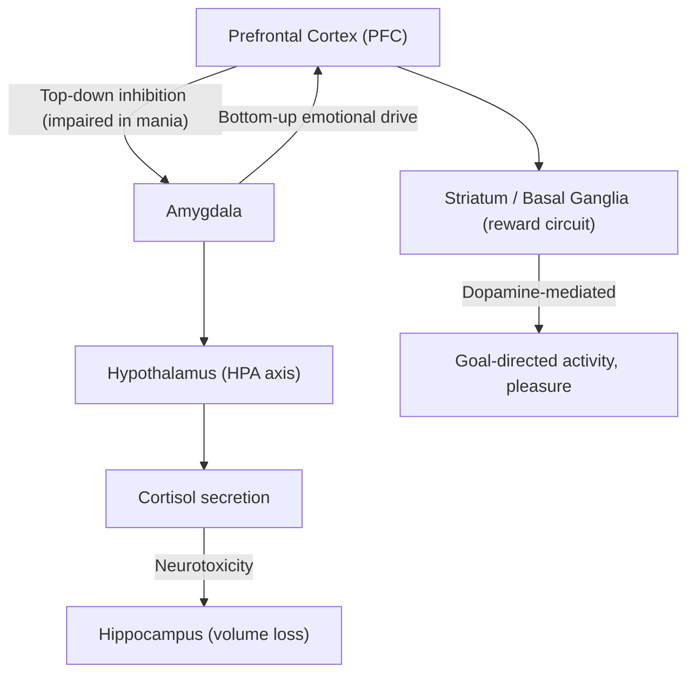
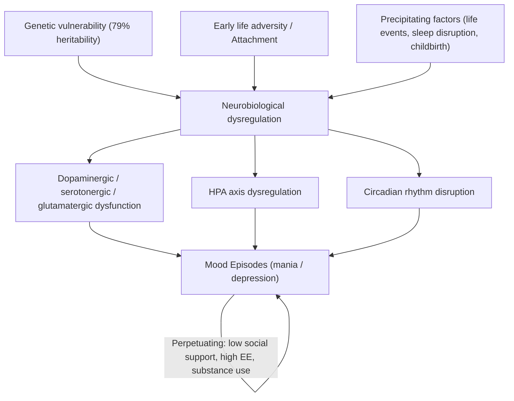

# Bipolar Disorder

## 1. Definition

***Bipolar disorder*** (historically known as "manic-depressive illness") is a **chronic, episodic mood disorder** characterised by recurrent episodes of **pathologically elevated mood (mania or hypomania)** and, in most cases, **episodes of depression**, interspersed with periods of euthymia (normal mood) [1][2].

Let's break down the name:
- **"Bi-"** = two; **"polar"** = poles → the two poles of mood: the "high" (mania) and the "low" (depression). The illness oscillates between these extremes, though patients spend much more time depressed than manic.

The key defining feature is the **manic or hypomanic episode** — you cannot diagnose bipolar disorder without one. A patient who has only ever had depression has Major Depressive Disorder (MDD), not bipolar disorder, even if they later "convert" (which ~10-20% of MDD patients do over time).

<Callout title="Core Concept">
The diagnosis of bipolar disorder hinges on identifying **mania or hypomania**. Depression alone is not sufficient. This is why collateral history and screening tools are so critical — hypomanic episodes are often ego-syntonic (patients enjoy them) and go unreported.
</Callout>

### Subtypes at a Glance

| Subtype | Defining Criterion |
|---|---|
| ***Bipolar I disorder*** | ***≥1 episode of mania*** (depression not required for diagnosis, though almost always occurs) [1][2] |
| ***Bipolar II disorder*** | ***≥1 episode of hypomania + ≥1 episode of major depression*** [1][2] |
| ***Cyclothymic disorder*** | Chronic fluctuating mood with numerous periods of hypomanic and depressive symptoms not meeting full criteria, for ***≥2 years*** [2] |
| Bipolar disorder, other specified / unspecified | Mood episodes that don't fit neatly into the above categories |

> **Bipolar II is NOT "milder" Bipolar I.** It has equal or greater morbidity because patients spend proportionally more time depressed, with high suicide risk and functional impairment [2].

---

## 2. Epidemiology

### Prevalence and Incidence
- ***Lifetime risk: ~0.3–1.6% for Bipolar I; up to 3.7% for the bipolar spectrum*** (including Bipolar II and cyclothymia) [2]
- ***More common in high-income countries*** (though this ***may be due to referral bias*** — better access to psychiatric services in wealthy nations rather than a true biological difference) [1]
- In **Hong Kong**, the prevalence is broadly consistent with global figures. Bipolar disorder is an important contributor to psychiatric morbidity, with significant under-recognition in primary care settings.

### Demographics
- ***No gender difference*** for Bipolar I (***M:F ≈ 1:1***) [1][2]
  - However, Bipolar II may be slightly more common in women (women tend to have more depressive episodes)
  - Women are more likely to experience ***rapid cycling*** [2]
- ***No ethnic difference*** [1]
- ***Mean age of onset: ~18 years*** [2]
  - But accurate diagnosis is often ***delayed by 5–10 years***, especially for Bipolar II (because hypomania is missed) [2]
  - Peak onset for mania: late teens to early 20s
  - Late-onset mania (> 40 years) should always prompt investigation for organic causes (e.g., brain tumour, cerebrovascular disease, substance use)

### Morbidity and Mortality
- ***Psychiatric morbidity***: ***1/3 of patients have attempted suicide; 10–20% die by suicide*** [2]
  - Suicide risk factors include: past attempts, prominent depressive symptoms, mixed episodes, comorbid substance abuse, early onset
- ***9th leading cause of disability-adjusted life years (DALYs) under neuropsychiatric disorders*** [2]
- ***↑ medical comorbidities***: especially ***cardiovascular disease*** (CVD), metabolic syndrome, diabetes — partly related to medication side effects (e.g., lithium → hypothyroidism, atypical antipsychotics → weight gain), partly due to lifestyle factors [2]
- ***Misdiagnosis is very common → correct diagnosis and treatment often delayed by 5–7 years on average*** [2]

### Comorbidities
***Bipolar disorder is highly comorbid*** [2]:
- ***Psychotic disorders*** (psychotic features occur in mania and severe depression)
- ***Substance abuse*** (up to 40-60% comorbidity; alcohol, cannabis, stimulants are most common)
- ***Anxiety disorders*** (panic disorder, GAD, social anxiety — very common)
- ***Sleep disorders***
- ***Eating disorders***
- ***ADHD*** (especially in younger patients; diagnostic overlap can be tricky)
- ***Personality disorders*** (especially borderline PD — differentiation is a common exam question)

<Callout title="High Yield - The Misdiagnosis Problem" type="error">

***Misdiagnosis of bipolar disorder is extremely common and has serious consequences*** [2]:

**Underdiagnosis:**
- ***Overlooking hypomanic episodes → misdiagnosis as MDD*** (the single most common diagnostic error)
- ***Mania with psychosis → misdiagnosed as schizophrenia***
- Consequence: ***untreated mood symptoms lead to ↑ suicidality, comorbid anxiety, substance abuse disorders, ↓ QoL, ↓ functioning, ↑ healthcare costs***
- ***Mis-treatment with antidepressants alone is less effective and results in manic switch and cycle acceleration***

**Overdiagnosis:**
- ***Confusion of mania with simple irritability*** (structured interview confirms only ~43% of patients with a previous diagnosis of bipolar disorder)
- Consequences: ***unnecessary side effects of mood stabilizers, ↑ sick role and disability claims***

***Correct diagnosis relies on:***
- ***History from the patient AND collateral history from informants*** (critical — patients often don't report hypomania)
- ***Structured screening tools, e.g., Mood Disorder Questionnaire (MDQ), Hypomania Checklist (HCL-32)*** [2]
</Callout>

---

## 3. Anatomy and Function (Neuroanatomy of Bipolar Disorder)

Understanding the neuroanatomy helps you make sense of the clinical features. Bipolar disorder involves dysfunction in **cortico-limbic circuits** that regulate mood, reward, and executive function.

### Key Brain Regions

| Region | Normal Function | Abnormality in Bipolar Disorder |
|---|---|---|
| **Prefrontal cortex (PFC)** — especially ventromedial PFC (vmPFC) and dorsolateral PFC (dlPFC) | vmPFC: emotional/social regulation; dlPFC: executive function, working memory, planning | ***Structural: volume reduction and decreased glial cells in subgenual cortex*** [3]. Functional: ***hypometabolism in depression; hypermetabolism in mania*** [1] |
| **Amygdala** | Emotional processing, fear conditioning, salience detection | Hyperactivation → exaggerated emotional responses; ***↓ connectivity with anterior cingulate*** → impaired emotional regulation [4] |
| **Anterior cingulate cortex (ACC)** | Conflict monitoring, emotional regulation, error detection | Abnormal activity → failure to modulate limbic responses |
| **Hippocampus** | Memory consolidation, stress regulation (via HPA axis feedback) | ***Reduced hippocampal volume*** (both a predisposing factor and consequence of illness via cortisol-mediated neurotoxicity) [4] |
| **Basal ganglia / Striatum** | Reward processing, motor activity, motivation | Altered dopaminergic signalling → reward-seeking behaviour in mania, anhedonia in depression |
| **Cerebellum** | Motor coordination, but also cognitive and affective regulation | ***Increased cerebellar metabolism*** in some studies [1] |

### Key Circuits

**In mania:** The prefrontal cortex fails to adequately "brake" the amygdala and reward circuits → **uninhibited emotional expression, impulsivity, reward-seeking, grandiosity**

**In depression:** The prefrontal cortex (especially dlPFC) is hypoactive → **psychomotor retardation, poor concentration, apathy**; the vmPFC is hyperactive → **rumination, anxiety, pain sensitivity** [4]

<Callout title="Why Mania Looks Like 'Too Much' and Depression Like 'Too Little'">
Think of the PFC as the "brakes" and the limbic system (amygdala, striatum) as the "accelerator." In mania, the brakes fail → the car races out of control (impulsivity, grandiosity, hypersexuality). In depression, the accelerator fails AND the brakes are stuck on → the car barely moves (anhedonia, psychomotor retardation, apathy).
</Callout>

---

## 4. Aetiology and Pathophysiology

Bipolar disorder is best understood through a ***multifactorial biopsychosocial model*** [1]. No single cause is sufficient — rather, it's the interaction of genetic vulnerability, environmental triggers, and neurobiological dysregulation.

### 4.1 Biological and Genetic Factors

#### Genetics
- ***Strikingly high heritability: ~79–85%*** from twin studies [1][2]
  - ***Monozygotic concordance: 40–70%*** [1] (~60% in some studies [2])
  - ***Lifetime risk in first-degree relatives: 5–10%*** (***roughly 7 times higher than general population risk***) [1]
- This is the **highest heritability of any major psychiatric disorder** — higher than MDD (~37%) and comparable to schizophrenia (~80%)
- ***Shared genetic risk between bipolar disorder, schizophrenia, and autism*** [1]
  - Also shared with MDD and schizoaffective disorder [2]
  - This explains why family members of bipolar patients have elevated rates of these conditions
- ***Likely polygenic with small individual effects*** [2]
- ***Genes identified include:***
  - ***Neuronal development genes***
  - ***Neurotransmitter metabolism genes***
  - ***Calcium channel genes*** (e.g., CACNA1C — a voltage-gated calcium channel involved in neuronal signalling; this is one of the most replicated findings in bipolar GWAS)
  - ***Some overlap with genes involved in circadian rhythm regulation*** [1] — this is fascinating because it connects to the clinical observation that sleep disruption is a major trigger for mania

<Callout title="Why Calcium Channels?" type="idea">
Calcium channels are fundamental to neuronal excitability, neurotransmitter release, and intracellular signalling cascades. Dysregulation of calcium signalling could explain the "kindling" phenomenon (where episodes become easier to trigger over time) and the efficacy of mood stabilizers like lithium (which modulates intracellular calcium signalling via second messengers).
</Callout>

#### Biochemical Pathways

| Pathway | Role in Bipolar Disorder |
|---|---|
| ***Dopaminergic system*** | ***Hypothesised to be related to dopamine hyperactivity*** in mania (→ elevated mood, psychomotor activation, psychosis) and hypoactivity in depression (→ anhedonia, psychomotor retardation) [2]. Supported by: dopamine agonists can trigger mania; antipsychotics (D2 blockers) treat mania |
| ***Serotonergic system (5-HT)*** | Deficiency implicated in depression; ***↓ 5HT2A and 5HT1A receptor densities found in frontal cortex*** [4]. Atypical antipsychotics used in bipolar often act as 5-HT2 antagonists |
| ***Glutamate*** | ***↓ glutamate in cortical layers III-IV*** [1]; NMDA receptor dysfunction may contribute to both manic and depressive symptoms |
| ***GABAergic system*** | ***↓ glutamic acid decarboxylase (GAD)*** — the synthetic enzyme for GABA — ***found in bipolar brains*** [1]; GABA is the main inhibitory neurotransmitter, so its deficiency could contribute to cortical hyperexcitability |
| ***Second messenger systems*** | Dysregulation of intracellular signalling cascades (cAMP, PIP₂/IP₃, protein kinase C [PKC], GSK-3β) — these are the targets of lithium [2] |
| ***Mitochondrial pathways*** | ***Mitochondrial dysfunction*** [1] → impaired energy metabolism in neurons → may contribute to neuronal vulnerability and episodic nature of illness |

#### HPA Axis and Thyroid

- ***HPA axis dysregulation with hypersecretion of cortisol*** [2][3]
  - Chronic cortisol elevation → hippocampal atrophy → impaired stress regulation → further HPA axis dysregulation (a vicious cycle)
  - ***Decreased BDNF (brain-derived neurotrophic factor)*** levels [3] → reduced neuroplasticity and neuronal survival
- ***Thyroid axis involvement*** [1]:
  - ***Decreased T3 and TSH*** levels reported [3]
  - Hypothyroidism is associated with rapid cycling
  - Lithium can cause hypothyroidism — monitoring thyroid function is essential

#### Neuroimaging

- ***Structural abnormalities:***
  - ***Enlarged ventricles (↑ ventricle-to-brain ratio)*** [1]
  - ***↓ hippocampal volume*** [1]
  - ***Volume reduction and decreased glial cells in subgenual cortex*** [1][3]
  - ***↓ N-acetylaspartate (NAA)*** — a marker of neuronal integrity [1]
  - ***↓ reelin*** and ***↓ GAP (growth-associated protein)*** in dlPFC [1]
  - ***↓ GFAP (glial fibrillary acidic protein)*** [1]

- ***Functional abnormalities:***
  - ***Hypometabolism in bipolar depression*** (especially frontal cortex) [1]
  - ***Hypermetabolism in mania*** (especially limbic structures)
  - ***Exaggerated functional responses to positive emotional stimuli*** [2]
  - ***Disordered emotional regulation and reward processing*** [2]
  - ***↓ fronto-cerebellar reciprocity/synchrony*** [1]
  - ***Increased cerebellar metabolism*** [1]

- ***None of them are specific biomarkers*** [1]

<Callout title="Exam Point" type="error">
***None of the neuroimaging findings are specific biomarkers for bipolar disorder*** [1]. The diagnosis remains **clinical**. Imaging is used for research and to exclude organic causes, NOT for diagnostic confirmation.
</Callout>

#### Infective Causes
- ***Toxoplasma gondii*** — ***the associated immune response*** (not direct infection) has been linked to bipolar disorder [1]
  - This is an emerging area; the mechanism likely involves neuroinflammation and immune-mediated disruption of dopaminergic signalling

### 4.2 Environmental Factors

#### Predisposing Factors
- ***Low care and overprotective parents, poor attachment relationship*** [1][2]
- ***Childhood abuse*** (***especially childhood sexual abuse***) [1][2]
- ***Early life adversities*** [2]
- ***Low income, separated, divorced, or widowed*** status [1]

#### Precipitating Factors
- ***Negative life events***, ***especially those disrupting sleep-wake activity*** [2]
  - Why sleep? Because circadian rhythm genes are implicated in bipolar disorder, and sleep deprivation can directly trigger mania. The sleep-wake cycle is regulated by serotonergic/noradrenergic systems in the reticular activating system — the same systems implicated in mood regulation
- ***Childbirth*** (postpartum period is a high-risk time for onset/relapse of bipolar episodes) [2]
- ***Sleep deprivation*** and ***circadian and social rhythm disruption*** [1]

#### Perpetuating Factors
- Level of ***social support*** [1][2]
- ***Separated, divorced, or widowed status*** [2]
- ***Expressed emotion (EE)***: ***critical, hostile, emotionally over-involved attitude from relatives*** [4]
  - ***↑ risk of relapse if exposed to environment of ↑ EE > 35 hours/week*** [4]
  - This is the same concept seen in schizophrenia — high expressed emotion in the family environment predicts relapse
  - ***Association seen in: schizophrenia, alcoholism, children with learning disabilities, bipolar disorder*** [4]

### 4.3 Psychosocial Factors

- **Cognitive theory** (relevant mainly to the depressive pole):
  - ***Cognitive distortions*** are prominent during depressive episodes [3][5]:
    - ***Selective abstraction (斷章取義)*** — focusing on a detail and ignoring more important features
    - ***Overgeneralization (以偏概全)*** — drawing a general conclusion from a single incident
    - ***Personalization (過度自責)*** — relating external events to oneself in an unwarranted way
    - ***Arbitrary inference (妄下判斷)*** — drawing a conclusion without evidence or against evidence
  - These are targets for **Cognitive Behavioural Therapy (CBT)**

- **Psychoanalytic theory**: loss of an "object," insecure attachments [5]

### 4.4 Integrated Biopsychosocial Model

***Bipolar disorder is caused by a combination of biological, social, and psychological factors, which disturb the brain's capacity for stress management*** [5].

---

## 5. Classification

### 5.1 DSM-5 / ICD-11 Classification

***Bipolar and related disorders*** are classified as a separate diagnostic chapter in DSM-5 (placed between schizophrenia spectrum disorders and depressive disorders, reflecting their "bridge" position) [1][2].

| Disorder | Key Features |
|---|---|
| ***Bipolar I Disorder*** | ***≥1 manic episode*** (may or may not have depressive episodes) |
| ***Bipolar II Disorder*** | ***≥1 hypomanic episode + ≥1 major depressive episode*** (never had a full manic episode) |
| ***Cyclothymic Disorder*** | ***Chronic (≥2 years) fluctuating mood*** with numerous hypomanic and depressive symptoms ***NOT meeting full criteria for either*** [2] |
| Substance/Medication-Induced Bipolar | Mania/hypomania caused by substances (e.g., corticosteroids, stimulants, antidepressants) |
| Bipolar Due to Another Medical Condition | Mania/hypomania due to medical illness (e.g., thyrotoxicosis, Cushing's, MS, brain tumour) |
| Other Specified / Unspecified Bipolar | Bipolar-like presentations not meeting full criteria |

### 5.2 Mania vs Hypomania — The Critical Distinction

This is **the single most important distinction in bipolar classification** because it determines whether the patient has Bipolar I or Bipolar II [1][2].

| Feature | ***Mania*** | ***Hypomania*** |
|---|---|---|
| Duration | ***≥7 days*** (or any duration if hospitalisation required) | ***≥4 consecutive days*** |
| Severity | Severe; ***marked impairment in social/occupational functioning*** | Mild to moderate; ***NO marked impairment*** in function [2] |
| Psychotic features | ***May be present*** (grandiose delusions, hallucinations) | ***NEVER psychotic features*** [2] |
| Hospitalisation | Often required | Not required |
| Diagnosis | Bipolar I | Bipolar II (with ≥1 depressive episode) |

### 5.3 Episode Specifiers

DSM-5 allows several important specifiers [1]:

- **With anxious distress**
- ***With mixed features*** — see below
- **With rapid cycling** — see below
- **With melancholic features**
- **With atypical features**
- **With mood-congruent / mood-incongruent psychotic features**
- **With catatonia**
- **With peripartum onset**
- **With seasonal pattern**

### 5.4 Special Subtypes

#### ***Mixed Features***
- ***Hypomanic/manic and depressive features occurring at the same time*** [2]
- ***Rapidly alternating mania/depression (in hours)*** [2]
- ***Predicts better response to valproate*** [2]
- Clinically these patients are especially high-risk for suicide (they have the depressive despair combined with manic energy/impulsivity)

#### ***Rapid Cycling Bipolar Disorder***
- ***Definition: ≥4 bipolar mood episodes over 12 months*** [2]
  - ***With periods of remission (≥2 months) OR switch to opposite polarity*** [2]
- ***Occurs in 16–17% of bipolar patients*** [2]
- ***F > M*** [2]
- ***Often concomitant hypothyroidism*** [2] — always check TFTs in rapid cyclers
- ***May be transient phenomenon in course of illness; remits ≤2 years in most*** [2]
- ***Often poorer response to mood stabilizers*** [2]
- Can be induced/worsened by antidepressants

#### ***Cyclothymia***
- ***Definition: numerous periods of hypomanic and depressive symptoms NOT meeting either full criteria*** [2]
  - ***Recurs over ≥2 years*** in which ***≥½ of the time is symptomatic*** and ***symptom-free for < 2 consecutive months*** [2]
- ***Course: usually insidious onset and chronic course similar to dysthymia*** [2]
- ***Management: similar to bipolar disorder*** [2]

---

## 6. Clinical Features

Now let's go through the clinical presentation systematically. I'll separate symptoms and signs, and connect everything back to the underlying pathophysiology.

### 6.1 Manic Episode

#### A. Symptoms

**Core Mood Disturbance:**

1. ***Elation / Euphoria:***
   - ***Cheerful, optimistic, often with infectious quality*** [2]
   - ***But may become offensive due to disinhibition and insensitivity to needs of others*** [2]
   - **Pathophysiology:** Dopamine hyperactivity in the mesolimbic reward pathway → excessive positive affect, inflated self-worth. The prefrontal cortex fails to modulate this → it "overflows" into socially inappropriate behaviour

2. ***Irritability:***
   - ***↓ frustration tolerance, anger, or even delusion of persecution*** [2]
   - Often underappreciated — irritable mania is common and can be mistaken for agitation or personality disorder
   - **Pathophysiology:** When the environment doesn't match the patient's grandiose self-concept, frustration results. Impaired prefrontal inhibition → inability to regulate anger

3. ***Mood lability:***
   - ***Also common; may even be interrupted by brief episodes of depression*** [2]
   - **Pathophysiology:** Reflects instability of the mood-regulating cortico-limbic circuitry; the system is oscillating rapidly and unpredictably

**Increased Energy and Activity:**

4. ***↑ Goal-directed activity:***
   - ***Especially starting many activities but leaving them unfinished*** [2]
   - **Pathophysiology:** Dopaminergic drive in the striatum → motivation and goal-pursuit, but impaired PFC executive function → inability to sustain focus or evaluate plans realistically

5. ***↑ Impulsivity / Disinhibition:***
   - ***Sexual infidelity, one-night-stands, overfriendliness, flirtatiousness*** [2]
   - **Pathophysiology:** Ventral striatum (reward circuit) is overactive → heightened reward-seeking. vmPFC (social behaviour regulation) is underactive → loss of social inhibition

6. ***Recklessness / Impaired judgment:***
   - ***Overspending, giving up good jobs, embarking on unrealistic plans*** [2]
   - **Pathophysiology:** dlPFC (executive function, consequence-evaluation) is functionally impaired → inability to assess risk or foresee consequences. Simultaneously, reward signals are amplified.

7. ***May lead to exhaustion*** (but less common nowadays with earlier treatment) [2]

**Biological Symptoms:**

8. ***↓ Need for sleep (NOT insomnia):***
   - ***An early warning sign of mania/hypomania*** [2]
   - ***Characteristically NOT associated with fatigue; wake up early feeling energetic*** [2]
   - **Pathophysiology:** Circadian rhythm disruption (genes involved in circadian regulation are implicated [1]); also noradrenergic/dopaminergic hyperactivation of the ascending reticular activating system → sustained wakefulness without the normal homeostatic sleep pressure
   - This is different from insomnia in depression, where patients *want* to sleep but *can't*, and feel exhausted

<Callout title="Sleep in Mania vs Depression" type="idea">
- **Mania:** ↓ *need* for sleep — feels rested after 2-3 hours; no subjective fatigue. The brain's "alertness system" is on overdrive.
- **Depression:** ↓ *ability* to sleep (insomnia) or ↑ sleep (hypersomnia), but always with fatigue. The brain's "energy system" is depleted.
This distinction is clinically very useful for differentiating manic vs depressive episodes.
</Callout>

9. ***↑ Appetite*** (may eat ravenously but often too distracted/active to eat regularly)

10. ***↑ Libido*** — sexual drive is markedly increased, contributing to sexual disinhibition
    - **Pathophysiology:** Dopaminergic reward pathway hyperactivity → amplification of appetitive drives

**Cognitive Symptoms:**

11. ***Grandiosity / Inflated self-esteem:***
    - Ranges from unrealistic overconfidence to full **grandiose delusions** (e.g., believing one is God, has special powers, is on a divine mission)
    - **Pathophysiology:** Dopaminergic excess → aberrant salience (normal self-referential thoughts become infused with excessive significance)

12. ***Flight of ideas / Racing thoughts:***
    - The patient's thoughts move so quickly that speech can barely keep up
    - **Pathophysiology:** Cortical hyperexcitability (possibly related to GABAergic deficit and glutamatergic dysregulation) → disinhibited association pathways

13. ***Distractibility:***
    - Attention constantly drawn to irrelevant stimuli
    - **Pathophysiology:** dlPFC executive dysfunction → impaired attentional filtering

14. ***Poor concentration***

**Psychotic Symptoms (in severe mania):**

15. ***Delusions:*** usually ***mood-congruent*** [2]
    - Grandiose delusions (special powers, divine mission, vast wealth)
    - ***Delusion of persecution*** may occur (if irritable mood predominates) [2]
    - ***10-20% have Schneiderian first-rank symptoms, but usually fleeting*** [2]
    - **Pathophysiology:** Dopaminergic hyperactivity in the mesolimbic pathway → the same mechanism as in schizophrenia, but coloured by the underlying mood state

16. ***Hallucinations:*** usually ***mood-congruent*** [2]
    - ***Eg. voices speaking about their special powers*** [2]
    - ***Eg. visions with religious content*** [2]

<Callout title="Mood-Congruent vs Mood-Incongruent Psychosis" type="error">
- **Mood-congruent:** Psychotic content matches the mood state (grandiose delusions in mania, nihilistic delusions in depression). This is more typical of bipolar disorder.
- **Mood-incongruent:** Psychotic content doesn't match the mood (e.g., persecutory delusions or thought insertion in mania). This is more atypical and overlaps with schizoaffective disorder.
- ***First-rank symptoms (thought insertion, withdrawal, broadcasting, passivity) can occur in mania (10-20%) but are usually fleeting*** — if persistent, consider schizoaffective disorder or schizophrenia.
</Callout>

#### B. Signs (on Mental State Examination)

| MSE Domain | Signs in Mania | Pathophysiological Basis |
|---|---|---|
| **Appearance** | Bright, flamboyant clothing; excessive makeup/jewellery; may be dishevelled if severely manic (too busy to care for self) | Grandiosity → desire to display; disorganisation → self-neglect |
| **Behaviour** | ***Psychomotor excitation: inability to sit still, pacing, gesticulating expansively*** [2]; intrusive, overfamiliar, may be aggressive if challenged | Dopaminergic/noradrenergic hyperactivation of motor circuits; impaired PFC inhibition |
| **Speech** | Pressure of speech (rapid, loud, difficult to interrupt); may become incoherent in severe mania | Cortical hyperexcitability; flight of ideas expressed verbally |
| **Mood** | Elated, expansive, OR irritable; often labile | As above |
| **Thought form** | Flight of ideas (rapid shifting between loosely connected topics), clang associations (words linked by sound rather than meaning), circumstantiality | Disinhibited association pathways |
| **Thought content** | Grandiose ideas or delusions, persecutory delusions (if irritable), ideas of reference | Mesolimbic dopamine excess |
| **Perception** | Mood-congruent hallucinations (auditory or visual) | As above |
| **Cognition** | Distractible, poor sustained attention, may appear confused if severely manic | dlPFC dysfunction |
| **Insight** | Typically ***poor or absent*** | PFC dysfunction → inability to monitor own mental state |
| **Risk** | ↑ risk to self (through reckless behaviour, exhaustion) and potentially others (through aggression, disinhibition) | Impaired judgment + increased drive |

#### Classic Mnemonic: **DIG FAST** (for mania)

| Letter | Feature |
|---|---|
| **D** | Distractibility |
| **I** | Irresponsibility / Impulsivity (pleasure-seeking with consequences) |
| **G** | Grandiosity |
| **F** | Flight of ideas |
| **A** | Activity increase (goal-directed or psychomotor agitation) |
| **S** | Sleep deficit (↓ need for sleep) |
| **T** | Talkativeness (pressure of speech) |

### 6.2 Hypomanic Episode

***Hypomania shows many of the above features but to less intensity and lasts shorter (only a few days)*** [2]:
- ***No marked impairment in social or occupational activities*** [2]
- Does not require admission
- ***NEVER psychotic features*** [2]
- The patient may actually feel "better than normal" — increased productivity, creativity, sociability
- Often **ego-syntonic** — the patient doesn't see it as a problem, which is why it's so often missed

**Why is hypomania missed?**
- Patients enjoy it and don't report it
- It may look like "normal high spirits" or a good personality trait
- Family members may not recognise it unless specifically asked
- This is why ***collateral history is essential*** and ***screening tools like the MDQ and HCL-32 are so important*** [2]

### 6.3 Bipolar Depression

***Bipolar depression commonly occurs during the course of bipolar disorder*** [2]:
- ***The majority of bipolar patients present with an episode of major depression as their first mood episode*** [2]
- This is the main reason for misdiagnosis as MDD

***Clinical presentation is largely similar to MDD except*** [2]:
- ***More psychomotor retardation*** (vs agitation in unipolar depression)
- ***More early morning wakening***
- ***More morning dysphoria*** (mood worse in the morning, improves toward evening — a "diurnal variation" pattern)
- ***More psychotic features*** (mood-congruent: nihilistic delusions, somatic delusions, auditory hallucinations of derogatory voices)
- ***May have some hypomanic features or mixed symptomatology*** [2]
- **More hypersomnia and hyperphagia** (atypical features) compared to unipolar depression
- **More frequent episodes, shorter duration per episode**
- **Younger age of onset**
- **Stronger family history of bipolar disorder**

**Pathophysiology of bipolar depression:**
- Mirrors that of MDD but with additional features:
  - Serotonergic and noradrenergic deficiency → low mood, sleep/appetite disturbance
  - dlPFC hypoactivation → psychomotor retardation, apathy, poor concentration
  - vmPFC hyperactivation → rumination, guilt, anxiety
  - HPA axis dysregulation → cortisol hypersecretion → hippocampal damage
  - ***↓ BDNF*** → impaired neuroplasticity [3]

### 6.4 Mixed Features

***Mixed episodes (now "with mixed features" specifier in DSM-5)*** [2]:
- ***Hypomanic/manic and depressive features occurring at the same time*** [2]
- ***Or rapidly alternating mania/depression (in hours)*** [2]
- Extremely distressing and dangerous — the patient has depressive hopelessness combined with manic energy and impulsivity
- ***Predicts better response to valproate*** (rather than lithium) [2]
- **Highest suicide risk** of any mood state

### 6.5 Course of Illness

- ***Chronic episodic course*** — most patients have multiple episodes over a lifetime [2]
- Average number of episodes: ~10 over a lifetime
- Depressive episodes are **more frequent and longer** than manic episodes (patients spend ~3× more time depressed)
- Inter-episode periods may show **subthreshold symptoms** and **cognitive impairment** even during "euthymia"
- ***Rapid cycling (≥4 episodes/year)*** occurs in ***16-17%***, more in women, often with hypothyroidism [2]
- **Kindling hypothesis:** Early episodes are more likely triggered by external stressors; later episodes may arise spontaneously as the illness "sensitises" the brain circuits (similar to epilepsy kindling)

---

## 7. Investigations (to Rule Out Organic Causes)

While bipolar disorder is a clinical diagnosis, investigations are essential to exclude medical mimics and establish a baseline before treatment:

| Investigation | Rationale |
|---|---|
| ***CBP (Complete blood picture)*** | Exclude anaemia, infection |
| ***Renal function tests (RFT)*** | Baseline before lithium (lithium is nephrotoxic) |
| ***Liver function tests (LFT)*** | Baseline before valproate (hepatotoxic); exclude hepatic causes of confusion |
| ***Thyroid function tests (TFTs)*** | ***Exclude hyper/hypothyroidism*** (thyrotoxicosis mimics mania; hypothyroidism associated with rapid cycling; lithium causes hypothyroidism) [3] |
| ***Blood glucose / HbA1c*** | Baseline metabolic screening; antipsychotics → metabolic syndrome |
| ***Lipid profile*** | Baseline before atypical antipsychotics |
| ***Urine drug screen*** | ***Exclude substance-induced mania*** (stimulants, cannabis, alcohol) |
| ***Blood alcohol level*** | As above |
| ECG | Baseline; some medications prolong QTc |
| ***CT/MRI brain*** | If late-onset mania ( > 40y), neurological signs, or atypical features → exclude organic causes (tumour, CVD, MS, neurosyphilis) |
| EEG | If suspicion of epilepsy (temporal lobe epilepsy can mimic mood episodes) |
| ***Cosyntropin (ACTH) stimulation test*** | If suspected Cushing's disease / Addison's [5] |
| HIV test | HIV can cause psychiatric symptoms including mania |

---

<Callout title="High Yield Summary">

**Definition:** Bipolar disorder = chronic episodic mood disorder with mania/hypomania ± depression. Bipolar I = ≥1 mania. Bipolar II = ≥1 hypomania + ≥1 depression.

**Epidemiology:** Lifetime risk ~1-4% (spectrum). M=F. Onset ~18y. Diagnosis delayed 5-10y. 1/3 attempt suicide; 10-20% die by suicide. Highly comorbid (substance abuse, anxiety, ADHD).

**Aetiology (Multifactorial):**
- Genetics: 79-85% heritability (highest in psychiatry). Shared risk with schizophrenia/autism. Calcium channel, circadian rhythm, neurodevelopmental genes.
- Neurobiology: Dopamine hyperactivity (mania), serotonergic/noradrenergic deficiency (depression), HPA axis dysregulation, ↓BDNF, structural/functional brain changes (none are specific biomarkers).
- Environment: Childhood abuse, poor attachment, life events disrupting sleep, childbirth, high expressed emotion (perpetuating).

**Clinical Features:**
- Mania (DIG FAST): Distractibility, Irresponsibility/Impulsivity, Grandiosity, Flight of ideas, Activity increase, Sleep ↓, Talkativeness. +/- mood-congruent psychosis. ≥7 days or hospitalisation.
- Hypomania: Same features but less intense, ≥4 days, NO marked impairment, NEVER psychotic.
- Bipolar depression: Like MDD but more psychomotor retardation, morning dysphoria, psychotic features, atypical features (hypersomnia, hyperphagia).
- Mixed features: Manic + depressive features simultaneously → highest suicide risk → responds to valproate.
- Rapid cycling: ≥4 episodes/12 months. F > M. Check thyroid.

**Key Diagnostic Pitfalls:** Hypomania missed → diagnosed as MDD → treated with antidepressants alone → manic switch + cycle acceleration. Always take collateral history. Use MDQ/HCL-32.
</Callout>

---

<ActiveRecallQuiz
  title="Active Recall - Bipolar Disorder (Definition, Epidemiology, Aetiology, Clinical Features)"
  items={[
    {
      question: "What distinguishes Bipolar I from Bipolar II disorder?",
      markscheme: "Bipolar I requires at least 1 manic episode (depression not required for diagnosis). Bipolar II requires at least 1 hypomanic episode PLUS at least 1 major depressive episode. Bipolar II has NEVER had a full manic episode."
    },
    {
      question: "What is the heritability of bipolar disorder and what key gene categories are implicated?",
      markscheme: "Heritability is approximately 79-85% (MZ concordance 40-70%). Key gene categories include neuronal development genes, neurotransmitter metabolism genes, calcium channel genes (e.g. CACNA1C), and circadian rhythm regulation genes. Shared genetic risk with schizophrenia, MDD, and autism."
    },
    {
      question: "Name 3 key clinical differences between bipolar depression and unipolar depression (MDD).",
      markscheme: "Any 3 of: (1) More psychomotor retardation (vs agitation in MDD), (2) More early morning wakening with morning dysphoria, (3) More psychotic features, (4) May have hypomanic features or mixed symptoms, (5) More atypical features (hypersomnia, hyperphagia), (6) Younger age of onset, (7) Stronger family history of bipolar disorder, (8) More frequent but shorter episodes."
    },
    {
      question: "Why is misdiagnosis of bipolar disorder as MDD dangerous? What are the consequences of treating bipolar depression with antidepressants alone?",
      markscheme: "Antidepressant monotherapy in bipolar disorder is less effective for depression AND can trigger manic switch (inducing mania/hypomania) and cycle acceleration (increasing frequency of episodes). Other consequences: untreated mood instability leads to increased suicidality, comorbid anxiety, substance abuse, decreased QoL, increased healthcare costs."
    },
    {
      question: "Define rapid cycling bipolar disorder. What are its epidemiological associations?",
      markscheme: "Rapid cycling = 4 or more mood episodes in 12 months, with periods of remission (at least 2 months) or switch to opposite polarity. More common in females. Often associated with concomitant hypothyroidism. Occurs in 16-17% of bipolar patients. May be transient; remits within 2 years in most. Often poorer response to mood stabilizers."
    },
    {
      question: "How does decreased need for sleep in mania differ from insomnia in depression? Explain the pathophysiology.",
      markscheme: "In mania: decreased NEED for sleep - patient feels rested after minimal sleep (e.g. 2-3 hours), wakes feeling energetic, no fatigue. Due to noradrenergic/dopaminergic hyperactivation of ascending reticular activating system and circadian rhythm disruption. In depression: decreased ABILITY to sleep (insomnia) or increased sleep (hypersomnia) but always accompanied by fatigue and exhaustion. Due to serotonergic/noradrenergic deficiency in RAS."
    }
  ]}
/>

## References

[1] Lecture slides: GC 163. I am a superman Bipolar disorder.pdf (p19, p28, p29)
[2] Senior notes: ryanho-psych.md (sections 7.3, pp.397-402)
[3] Lecture slides: GC 164. I am depressed Mood disorders.pdf (p12)
[4] Senior notes: ryanho-psych.md (sections on neurobiology, pp.336, 388)
[5] Lecture slides: GC 164. I am depressed Mood disorders.pdf (p13)
