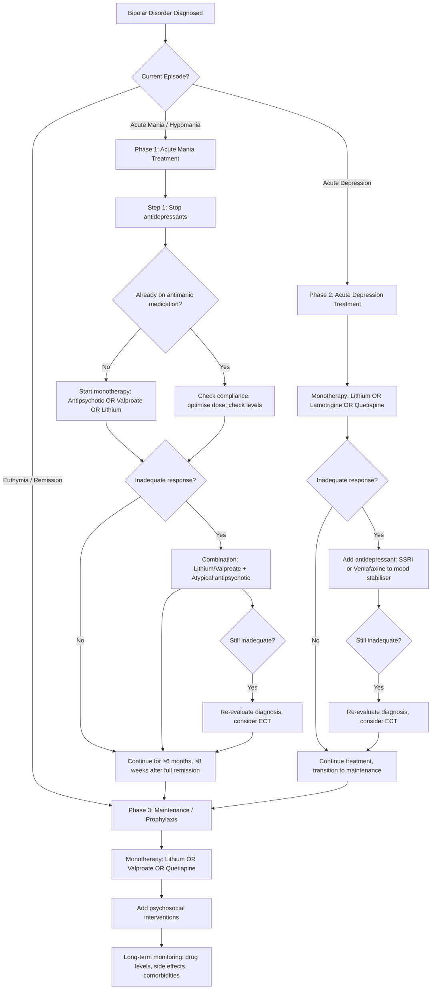

## Management of Bipolar Disorder

Managing bipolar disorder is fundamentally different from managing unipolar depression — and getting this wrong can be harmful. The overarching philosophy is: **stabilise the mood in both directions** (prevent highs AND lows), **minimise harm from treatment**, and **sustain functional recovery over a lifetime**. This is a chronic relapsing-remitting illness, so think of it like managing diabetes — acute treatment of crises, then long-term maintenance to prevent complications.

---

### 1. Principles of Management

The lecture slides lay out a clear ***outline of management*** [1]:

1. ***Fundamentals of patient management***
   - ***Correct diagnosis***
   - ***Illness acceptance and treatment adherence***
   - ***Family psychoeducation***

2. ***Pharmacological and psychosocial treatment***

3. ***Treatment of different phases of bipolar illness***
   - ***Acute manic episode***
   - ***Acute depressive episode***
   - ***Maintenance and prophylactic treatment***

4. ***Treatment in special situations: childbearing-age women, pregnancy, child and adolescents, elderly***

5. ***Treatment of psychiatric and medical comorbidity***

And the summary slide captures the key overarching goals [1]:
- ***Early diagnosis and maintenance treatment***
- ***Watch out for side effects and the need of alternative treatments***
- ***Deal with stigma and poor drug compliance***
- ***Provide psychoeducation (individual and family)***
- ***Pay attention to stress coping, interpersonal relationship, lifestyle regularity and other risk factors of relapse***
- ***Recognise and treat comorbidities, e.g., anxiety disorder, sleep problem, suicidal risk, substance abuse***

<Callout title="The Three Cardinal Rules of Bipolar Management">
1. **Always stop/avoid antidepressant monotherapy** — it triggers manic switch and cycle acceleration
2. **Always think long-term** — acute treatment is just the beginning; maintenance prevents the next episode
3. **Always involve the family** — psychoeducation and expressed emotion management reduce relapse
</Callout>

---

### 2. Overall Management Algorithm

---

### 3. Phase 1: Treatment of Acute Mania / Hypomania

#### 3.1 General Approach

**Hospitalisation:** ***necessary in all but the mildest cases of mania*** (insight is often impaired early → patients refuse treatment, engage in dangerous behaviour) [2]

**Step 1: ***ALWAYS stop antidepressant treatment*** [2]
- Why? Antidepressants can fuel mania, worsen mixed features, and accelerate cycling. This is the very first thing you do.

**Step 2:** Determine whether the patient is already on antimanic medication [2]

#### 3.2 Treatment Options for Acute Mania

***Treatment of manic episode*** [1]:
- ***Monotherapy*** (first step)
- ***Combination: Lithium/Valproate plus Atypical antipsychotics*** (if monotherapy inadequate)
- ***Re-evaluate diagnosis and consider ECT (need of rapid response, e.g., high violence risk)*** [1]

##### Detailed Flowchart (from senior notes) [2]:

**If NOT already on antimanic medication:**

| Option | When to Choose | Key Considerations |
|---|---|---|
| ***Antipsychotic*** | ***If symptoms severe or behaviour disturbed*** [2] | Best combination of efficacy and acceptability; ***considered 1st line in NICE guidelines*** [2]. Options: ***olanzapine, risperidone, haloperidol, quetiapine, aripiprazole, ziprasidone*** [2] |
| ***Valproate*** | Alternative first-line | ***Avoid in women of childbearing potential*** [1][2]. Faster onset of action compared to lithium [2] |
| ***Lithium*** | ***If future adherence likely*** [2] | ***Don't start if unlikely to be compliant*** (discontinuation can trigger mania) [2]. Rapid cycling, prominent depressive symptoms, and psychotic features predict poorer response [2] |

→ If monotherapy response inadequate → ***Combine antipsychotic AND valproate or lithium*** [2]

→ ***All patients — consider adding short-term benzodiazepine (lorazepam or clonazepam)*** [2]
- **Rationale:** ***↓ behavioural disturbance + ↑ sleep → allows ↓ dose of antipsychotics needed*** [2]

**If ALREADY on antimanic medication** [2]:

| Current Medication | Action |
|---|---|
| On antipsychotic | Check compliance and dose; increase if necessary; consider adding lithium or valproate |
| On lithium | Check plasma levels; consider increasing dose to give levels 1.0–1.2 mmol/L (acute episode, not long-term); and/or add antipsychotic |
| On valproate | Check plasma levels; increase dose to give levels up to 125 mg/L if tolerated; consider adding antipsychotic |
| On lithium or valproate AND mania is severe | Check levels, add antipsychotic |
| On carbamazepine | Consider adding antipsychotic (***higher doses may be needed as antipsychotic levels are reduced*** by carbamazepine enzyme induction) |

#### 3.3 Duration of Acute Treatment

- ***Gradual ↓ dose with clinical improvement*** [2]
- ***Continue treatment for ≥6 months and ≥8 weeks after complete remission*** (to ***↓ rebound mania***) [2]

#### 3.4 Special Considerations in Acute Mania

- ***Pregnancy: prefer haloperidol*** (not associated with ↑ risk of congenital anomalies) → risperidone, quetiapine, olanzapine (in that order of preference) [2]
- ***Ensure drug compliance*** by therapeutic drug monitoring [2]
- ***Note: lithium may be relatively less effective in mixed states or substance misuse*** [2]

---

### 4. Phase 2: Treatment of Acute Bipolar Depression

This is where bipolar management diverges most sharply from unipolar depression. The lecture slides highlight this critical point [1]:

***Because of the recognised risk of switching to manic or mixed episodes and the high risk of suicide, referral to a specialist should be considered*** [1]

#### 4.1 Why Bipolar Depression Is Different

***Treatment is NOT identical to treatment of unipolar depression or bipolar mania*** [2]:
- ***Conventional antidepressants are: (1) less effective in treating bipolar depression, (2) associated with risk of inducing mania, (3) associated with risk of inducing rapid cycling*** [2]
- ***Not all mood stabilizers are equally effective at treating mania and depression. Some (e.g., lamotrigine, quetiapine, lithium) are more useful in treating bipolar depression*** [2]
- ***SSRIs may be effective but may induce mania. TCAs and SNRIs have ↑↑ risk of inducing mania*** [2]

<Callout title="The Antidepressant Problem in Bipolar Disorder" type="error">
***Avoid antidepressants if possible; if used, limit dose and duration*** [1].

**Why?** Antidepressants push the serotonergic/noradrenergic system upward. In a bipolar brain that is already prone to oscillating between poles, this "push" can overshoot into mania ("manic switch") or destabilise the cycling pattern ("cycle acceleration"). This is why:
- **Antidepressants should NEVER be used alone** in bipolar disorder
- If used, they should be **combined with a mood stabiliser or antipsychotic**
- **TCAs are the worst offenders** (highest switch risk), followed by SNRIs, then SSRIs (lowest risk)
- ***Antidepressants, when used, should be combined with antipsychotic or mood stabilizer*** [2]
</Callout>

#### 4.2 Treatment Options

***Treatment of bipolar depressive episode*** [1]:
- ***Monotherapy: Lithium, Lamotrigine OR Quetiapine***
- ***Combination: Add Antidepressants (SSRI OR Venlafaxine) to monotherapy OR Combine two monotherapy agents***
- ***Re-evaluate diagnosis and consider ECT (for patients with high suicidal risk)*** [1]

##### Bipolar I Depression — First-Line Pharmacotherapy [1]:

| Agent | Details |
|---|---|
| ***Lithium*** | ***Target 0.8–1.2 mEq/L*** [1]. Moderate evidence for bipolar depression. Also has anti-suicidal properties (unique benefit) |
| ***Lamotrigine*** | ***Sometimes requires higher than 200 mg/day*** [1]. ***More effective for bipolar depression but little anti-manic effect*** [2]. Must titrate slowly (risk of SJS/TEN) |
| ***Quetiapine*** | ***Aim at 300 mg/day*** [1]. Good evidence for both depressive and manic poles. Sedation is a common side effect but can help with insomnia |
| ***Lurasidone*** | [1] Newer atypical antipsychotic with good evidence for bipolar depression. Less metabolic side effects than olanzapine/quetiapine |
| ***Valproate or Lithium + Lurasidone*** | [1] Combination option |

##### Bipolar II Depression [1]:

| Line | Agents |
|---|---|
| ***First line*** | ***Quetiapine*** |
| ***Second line*** | ***Lamotrigine; Lithium; Antidepressants such as sertraline, venlafaxine*** |
| ***Third line*** | ***Valproate*** |

##### NICE Approach (from senior notes) [2]:

- **First-line:**
  - ***Olanzapine + fluoxetine*** OR ***quetiapine alone*** if not on mood stabiliser
  - ***↑ mood stabiliser dose*** if previously on mood stabiliser
- **Other options:** olanzapine alone, lamotrigine alone
- **ECT:** if severe, refractory, or need urgent treatment
- **Not preferred:** ***SSRI alone, other antidepressants alone*** [2]

---

### 5. Phase 3: Maintenance / Prophylactic Treatment

This is the **most important phase** for long-term outcomes. ***Recurrence rate reduces by 50% for maintenance vs. discontinuation*** [1].

#### 5.1 Indication for Prophylactic Treatment [1]:

- ***Established bipolar disorder with recurrent episodes of mania or depression***
- ***Severe single episode with suicidal attempts, psychotic episodes, and significant functional impairment*** (to prevent future relapse) [1][2]

#### 5.2 Duration

- ***No strict guidelines*** → ***at least a few years without relapse and any subsyndromal symptoms*** between episodes [2]
- Patients on maintenance treatment with no relapse for many years ***CAN still relapse after cessation*** [2]
- ***Gradual discontinuation better than abrupt discontinuation*** [1]
- Lithium should not be started unless there is a ***clear intention to continue for ≥3 years*** [2]

#### 5.3 Maintenance Treatment Options

##### Bipolar I Prophylaxis [1]:

***General guidelines for prophylaxis for Bipolar I*** [1]:
- ***Monotherapy: Lithium or Valproate or Quetiapine***
- ***Psychosocial (augmentation):***
  - ***Psychoeducation***
  - ***Cognitive behavioural therapy***
  - ***Interpersonal and social rhythm therapy***
  - ***Family or carer-focused treatment***
  - ***Peer support***
  - ***Intensive case management***
- ***Less hostile, more supportive, better drug compliance*** [1]

| Line | Agent | Key Points |
|---|---|---|
| **First-line** | ***Lithium*** | Gold standard. ***The only mood stabiliser proven to reduce suicide*** [1]. Better at preventing manic episodes (NNT 10) than depressive episodes (NNT 14) [2]. Monitor levels (0.6–1.0 mmol/L), RFT, TFT every 6 months [2] |
| First-line (alternatives) | ***Valproate*** | Also commonly used. ***Avoid in women of childbearing potential*** (teratogenic). Good for mixed episodes [2] |
| First-line (alternative) | ***Quetiapine*** | Effective for both manic and depressive poles [2] |
| Second-line | ***Olanzapine*** | Effective but limited by metabolic side effects (weight gain, diabetes) [2] |
| Third-line | ***Other antipsychotics, carbamazepine, lamotrigine*** [2] | Lamotrigine is ***better at preventing depressive episodes, less for manic episodes*** compared to lithium/valproate [2] |

##### Bipolar II Prophylaxis [1]:

| Line | Agent |
|---|---|
| ***First line*** | ***Quetiapine, Lithium, or Lamotrigine*** |
| ***Second line*** | ***Venlafaxine*** |
| ***Third line*** | ***Valproate; Carbamazepine; Other antidepressants; Risperidone*** |

#### 5.4 Relative Efficacy Summary [2]:

| Agent | Prevents Mania | Prevents Depression | Anti-suicidal |
|---|---|---|---|
| ***Lithium*** | ✓✓✓ | ✓✓ | ***✓✓✓ (unique — ↑80% ↓ risk of attempted + completed suicide)*** [2] |
| ***Valproate*** | ✓✓✓ | ✓ | — |
| ***Lamotrigine*** | ✓ | ✓✓✓ | — |
| ***Quetiapine*** | ✓✓ | ✓✓ | — |
| ***Olanzapine*** | ✓✓ | ✓ | — |

---

### 6. Pharmacological Agents — Detailed Profiles

#### 6.1 Lithium

**Etymology:** Named after Greek "lithos" (stone) — discovered in the mineral petalite.

**Mechanism of Action** [2]:
- ***Modulates second messengers*** (cAMP, ***↓ PIP₃ formation***)
- ***Inhibits GSK-3β*** (glycogen synthase kinase-3 beta) and ***PKC*** (protein kinase C)
- Net effect: ***↑ neuronal survival, ↑ synaptic plasticity***
- Why this matters: GSK-3β normally promotes apoptosis and is involved in circadian rhythm regulation; its inhibition promotes neuronal resilience and stabilises circadian cycles

**Indications** [2]:
- ***Acute treatment of moderate-severe mania*** (less commonly used due to slow onset)
  - Efficacy: NNT = 6, but ***takes ≥1 week to reach effects***, difficult to reach therapeutic levels rapidly [2]
- ***Prophylaxis in bipolar affective disorder*** (commonly used — the main indication)
  - More effective for preventing manic episodes (NNT 10 vs 14 for depression) [2]
  - Better response if started earlier or combined with valproate [2]
- ***Augmentation of antidepressants*** in refractory unipolar depression
- ***Reduces suicidality***: ***↓80% risk of attempted + completed suicide in BAD*** [2]; ***the only mood stabiliser to reduce suicide*** [1]

**Prescribing** [2]:

| Step | Details |
|---|---|
| Pre-treatment | ***RFT (eGFR), TFT ± ECG*** (if CVS risk factors) + ***reliable contraception*** |
| Initiation | Usually ***350–500 mg/day***, titrate up ***300–600 mg/day*** every 1–5 days until therapeutic level reached (usually 900–1800 mg/day) |
| Pharmacokinetics | Rapidly absorbed from GI tract; ***half-life ~24 hours*** (takes 4–5 days to reach steady state) |
| Drug level monitoring | ***12 hours after last dose*** (morning trough level). Targets: 0.4 mmol/L (minimum/unipolar), ***0.6–1.0 mmol/L*** (bipolar prophylaxis), ***> 0.8 mmol/L*** (acute mania) |
| When to check levels | ***Every 6 months*** if stable; ***before and 7 days after*** any dose change |
| On-treatment monitoring | ***Plasma lithium, eGFR, TFT every 6 months*** ± ***plasma calcium yearly*** |
| Discontinuation | ***Gradually over ≥1 month***, avoiding incremental reductions > 0.2 mmol/L. ***Should not be started unless clear intention to continue ≥3 years*** (discontinuation ↑↑ relapse risk) [2] |

**Contraindications** [2]:
- ***Significant renal impairment*** → ↑ risk of toxicity (lithium is renally excreted)
- ***Sodium depletion / dehydration*** → ↑ reabsorption of lithium in proximal tubule → toxicity
- ***Significant cardiovascular disease*** (HF, recent MI) → risk of arrhythmia
- ***Psoriasis*** — relative C/I (exacerbated by lithium)
- Pregnancy (relative C/I — Ebstein anomaly risk, ~0.1%; use if benefits clearly outweigh risks)

**Side Effects** — think of lithium as a **salt** that distributes throughout the body [2]:

| System | Side Effects | Mechanism |
|---|---|---|
| **Renal** | Nephrogenic diabetes insipidus (polyuria, polydipsia); chronic tubulointerstitial nephropathy | Lithium inhibits ADH action on collecting duct aquaporin-2 channels |
| **Thyroid** | Hypothyroidism (5–35%); goitre | Inhibits thyroid hormone synthesis and release |
| **Parathyroid** | Hyperparathyroidism, hypercalcaemia | Stimulates PTH secretion |
| **Neurological** | Fine tremor, ataxia, cognitive dulling | Direct CNS effects |
| **GI** | Nausea, diarrhoea, metallic taste | GI mucosal irritation |
| **Cardiac** | T-wave flattening/inversion, sinus node dysfunction | Direct effect on cardiac ion channels |
| **Metabolic** | Weight gain | Multiple mechanisms including hypothyroidism |
| **Dermatological** | Acne, psoriasis exacerbation, hair thinning | Unknown |
| **Teratogenicity** | Ebstein anomaly (tricuspid valve malformation) — risk ~0.1% | Direct effect on cardiac development |

**Drug Interactions** (critically important given narrow therapeutic index) [2]:
- ***Diuretics*** (especially thiazides) → ↓ renal lithium clearance → toxicity
- ***NSAIDs*** → ↓ renal lithium clearance → toxicity
- ***ACE inhibitors, ARBs, CCBs*** → ↓ renal clearance
- Anything causing dehydration or sodium depletion

**Lithium Toxicity** — occurs at levels > 1.5 mmol/L:
- Mild (1.5–2.0): coarse tremor, GI symptoms, lethargy
- Moderate (2.0–2.5): confusion, ataxia, dysarthria, muscle twitching
- Severe ( > 2.5): seizures, coma, renal failure, cardiac arrhythmia, death
- **Management:** stop lithium, IV normal saline (restore sodium/hydration), haemodialysis if severe

#### 6.2 Valproate (Epilim)

**Etymology:** Valproic acid — named after valeric acid (from valerian plant) + propionic acid.

**Mechanism of Action** [2]:
- ***↓ catabolism of GABA*** (↑ inhibitory neurotransmission)
- ***↓ sensitivity of Na⁺ channels*** (↓ excitatory neurotransmission)
- Also acts on signal transduction cascades: ***GSK-3, PKC, MARCKS, ERK kinase***
- Net effect: ***↑ neuroprotection and long-term plasticity***

**Indications** [2]:
- ***NEVER in patients with reproductive potential*** [2]
- ***Acute treatment of mania***
- ***Acute treatment of bipolar depression*** (in combination with antidepressants; effect size small-medium alone)
- ***Prophylactic treatment of bipolar affective episodes***
- Better for ***mixed episodes*** than lithium [2]

**Prescribing** [2]:

| Step | Details |
|---|---|
| Pre-treatment | ***CBC, LFT, weight/BMI*** |
| Initiation | Can use loading dose → ***faster onset of action compared to lithium*** [2] |
| Dosing | Start 200–400 mg/day → titrate to 1–2 g/day |
| Monitoring | ***CBC, LFT after 6 months; BMI continuously*** |
| Discontinuation | Slowly over ≥1 month |

**Contraindications:**
- ***Women of childbearing potential*** — ***established human teratogen*** (neural tube defects 1–2%, craniofacial abnormalities, neurodevelopmental impairment — ***absolutely contraindicated in pregnancy***) [2]
- Active liver disease
- Porphyria

**Side Effects** [2]:
- **GI:** nausea, vomiting, diarrhoea
- **Hepatic:** hepatotoxicity (can be fatal, especially in children), ↑ LFTs
- **Haematological:** thrombocytopaenia, platelet dysfunction
- **Neurological:** tremor, sedation, ataxia
- **Metabolic:** weight gain, hyperammonaemia (can cause encephalopathy)
- **Dermatological:** hair loss (curly regrowth — "valproate curls")
- **Teratogenicity:** neural tube defects, developmental delay — the most teratogenic mood stabiliser

**Drug Interactions** [2]:
- ↑ level of ***lamotrigine*** (may require dose reduction — important combination)
- ↑ effects of ***central sedatives***
- Interacts with phenytoin, TCAs, other anticonvulsants

#### 6.3 Lamotrigine (Lamictal)

**Etymology:** "Lamo-" from its chemical structure (a phenyltriazine); "-trigine" = triazine derivative.

**Mechanism of Action** [2]:
- ***Blocks voltage-sensitive sodium channels***
- ***↓ glutamate release*** (the main excitatory neurotransmitter)
- Net effect: stabilises neuronal membranes, reducing excitatory neurotransmission

**Indications** [2]:
- ***More effective for bipolar depression*** but ***little anti-manic effect*** [2]
- ***Acute treatment of bipolar depression***
- ***Prophylactic treatment*** in bipolar affective disorder, ***especially when picture is dominated by depression***
- ***Lamotrigine is a promising agent for treatment of bipolar depression due to its tolerability and wide therapeutic margin*** [1]

**Prescribing** [2]:
- **Must titrate slowly:** 25 mg QD × 2 weeks → 50 mg QD × 2 weeks → slowly up to 50–300 mg/day
- Why so slow? To ***reduce risk of skin eruption and SJS/TEN*** — the risk is highest in the first few weeks and with rapid titration

**Side Effects** [2]:
- ***Relatively well-tolerated!*** [2]
- ***Skin eruption: 3%***, especially in first few weeks → must start slowly
- ***Rare: SJS/TEN, angioedema*** (serious but rare — risk ↑ with rapid titration and concurrent valproate)
- Other common: nausea, headache, diplopia, blurred vision, dizziness, ataxia, tremor

**Drug Interactions** [2]:
- ***↑ level by valproate*** (halve the dose when co-prescribing with valproate — very important!)
- ***↓ level by enzyme inducers*** (e.g., carbamazepine)

#### 6.4 Carbamazepine (Tegretol)

**Etymology:** "Carba-" = carboxamide group; "-mazepine" = related to the dibenzoazepine chemical structure (similar to tricyclic antidepressants).

**Mechanism of Action** [2]:
- ***Blocks voltage-sensitive sodium channels***
- Relationship with efficacy in bipolar disorder is unclear

**Indications** [2]:
- Less commonly used due to ***↓ tolerance, ↑ drug interactions, and ↓ efficacy of other drugs*** when co-prescribed
- ***Acute treatment of mania*** as alternative or addition to lithium/valproate (NOT first-line)
- Acute treatment of ***frequent mood swings and mixed affective episodes*** (may be more effective than lithium)
- ***Prophylactic treatment*** when lithium and valproate are ineffective/poorly tolerated

**Prescribing** [2]:
- Pre-treatment: ***CBC, RFT, LFT, baseline weight, HLA-B*1502*** (***5% risk of SJS — must be checked***, especially in patients of Southeast Asian/Chinese descent — very relevant in Hong Kong)
- Start 100–200 mg BD, titrate to 400 mg BD
- ***Induces its own metabolism*** (auto-induction) → levels drop after 2–3 weeks → may need dose increase
- Plasma drug monitoring: target 4–12 mg/L

**Absolute Contraindication:** ***women of reproductive age*** (established human teratogen) [2]

**Side Effects** [2]:
- Neurological: dizziness, drowsiness, ataxia
- Renal: ***hyponatraemia (SIADH pattern)***
- GI: nausea, hepatitis
- Haematological: ***leukopenia*** (common, first few weeks), ***agranulocytosis*** (rare: 1/10,000–125,000)
- Hypersensitivity: rash, ***SJS*** (check HLA-B*1502!)
- Cardiac conduction abnormalities

**Drug Interactions** — ***notorious, potent inducer of P450 enzymes*** [2]:
- ***↑ metabolism of most antidepressants, antipsychotics, BZDs, thyroxine, OCP***
- OCP may become ineffective → need ↑ dose or alternative contraception
- ***Should NOT be given with MAOIs*** (similar TCA structure)

#### 6.5 Atypical Antipsychotics as Mood Stabilisers

**Mechanism of Action** [2]:
- Unknown precisely; ***?related to 5-HT₂A antagonist and 5-HT₁A partial agonist properties***
- ***↓ glutamate hyperactivity*** (downstream effect)

**Key Agents:**

| Agent | Role | Key Side Effects |
|---|---|---|
| ***Quetiapine*** | First-line for acute mania, bipolar depression, AND maintenance. ***Treatment of bipolar disorder requires around 200–400 mg/day for mild manic cases or depression cases, but up to 800 mg for severe manic cases*** [1]. ***Tailor the dose according to response and AE*** [1] | ***Dry mouth, sleepiness*** (subjective) [1]; ***Weight gain, metabolic syndrome and type 2 diabetes, dyslipidaemia*** (systemic) [1] |
| ***Olanzapine*** | Acute mania, bipolar depression (especially + fluoxetine), maintenance | Significant weight gain, metabolic syndrome — ***limited by metabolic side effects*** [1] |
| ***Risperidone*** | Acute mania | Extrapyramidal side effects, hyperprolactinaemia |
| ***Aripiprazole*** | Acute mania, maintenance | Partial D₂ agonist — less metabolic side effects; akathisia |
| ***Lurasidone*** | ***Bipolar depression*** [1] | Less metabolic side effects; akathisia, nausea |
| Haloperidol | Acute mania (especially in pregnancy) | EPS, QTc prolongation |

***Atypical antipsychotics look promising as mood stabilisers, but limited by metabolic side effects*** [1]

---

### 7. Electroconvulsive Therapy (ECT)

**Etymology:** "Electro-" = electrical; "convulsive" = seizure-inducing; "therapy" = treatment.

**Mechanism of Action:** Unknown, but hypothesised [2]:
- ***↑ hormonal release*** by hypothalamus/pituitary (prolactin, TSH, ACTH, endorphins)
- ***↑ neurotrophic signalling (e.g., ↑ BDNF) → induces neurogenesis***
- ***↑ monoamine neurotransmitter release***
- Changes in brain connectivity

**Indications in Bipolar Disorder** [1][2]:
- ***Acute mania:*** need of rapid response (e.g., ***high violence risk***) [1]; pregnant patients; life-threatening; persistent and treatment-resistant
- ***Bipolar depression:*** severe, refractory, ***high suicidal risk*** [1]; when antidepressants failed or cannot be used
- ***Catatonia***
- ***Puerperal psychosis*** with prominent mood symptoms

**Administration** [2]:
- Course: 6–12 treatments, 2–3 per week
- Under brief general anaesthesia with short-acting induction agent and muscle relaxant
- Unilateral vs bilateral: ***bilateral more effective but may cause more cognitive impairment*** [2]

**Adverse Effects** [2]:
- ***Cognitive impairment:*** acute confusion, anterograde/retrograde amnesia (generally short-lived)
- General: headache, nausea, muscle pain
- ***Mortality: 2–4/100,000*** (~other minor surgery under GA)

**Relative Contraindications** [2]:
- Recent MI, heart failure, ischaemic heart disease
- ↑ ICP (raised intracranial pressure)
- Risk of ICH (hypertension, recent stroke)
- Poor anaesthetic risk
- ***No absolute contraindication*** [2]

---

### 8. Psychosocial Interventions

***Psychosocial intervention is important for prevention of relapses and overall management of bipolar disorder*** [1]

**Role:** ***Less important than in depression*** (cf pharmacotherapy is the mainstay), mainly ***adjunctive*** to improve and sustain recovery [2]

| Intervention | Description | Evidence |
|---|---|---|
| ***Psychoeducation*** [1] | Teaching patient and family about the illness, early warning signs, medication adherence, lifestyle regularity | Core component; reduces relapse |
| ***Cognitive Behavioural Therapy (CBT)*** [1] | Addresses cognitive distortions during depression, improves insight and compliance | Theoretically beneficial; evidence uncertain [2] |
| ***Interpersonal and Social Rhythm Therapy (IPSRT)*** [1] | ***Maintain sleep-activity schedules*** [2]; stabilise daily routines and circadian rhythms | Reduces relapse by addressing the circadian rhythm disruption that triggers episodes |
| ***Family or carer-focused treatment*** [1] | Improve family support; reduce expressed emotion | ***Shown to reduce hospitalisation and symptomatology by 1/3*** [2] |
| ***Peer support*** [1] | Connection with others who have the condition | Reduces isolation, improves engagement |
| ***Intensive case management*** [1] | For complex cases with multiple comorbidities | Improves continuity of care |
| ***Mood chart*** [2] | Patient tracks mood daily | ***Helpful in helping patient understand disease course and own situation*** [2] |
| ***Advanced statements*** [2] | Pre-written instructions for when the patient is manic and lacks judgment | Addresses ***social implications of poor judgment during manic states*** [2] |

---

### 9. Summary: Key Management Points from Lecture Slides [1]

> ***Bipolar disorder is underrecognised and undertreated***
>
> ***The challenge in long-term management is the prevention of relapses, subsyndromal symptoms, and functional disability***
>
> ***Avoid antidepressants if possible; if used, limit dose and duration***
>
> ***Lithium is still an important drug, given that it is the only mood stabiliser to reduce suicide***
>
> ***Atypical antipsychotics look promising as mood stabilisers, but limited by metabolic side effects***
>
> ***Lamotrigine is a promising agent for treatment of bipolar depression due to its tolerability and wide therapeutic margin***
>
> ***Psychosocial intervention is important for prevention of relapses and overall management of bipolar disorder***

---

### 10. FDA-Approved Treatments Summary [2]

| Indication | FDA-Approved Agents |
|---|---|
| **Mania** | Valproate, carbamazepine CR, lithium, aripiprazole, ziprasidone, risperidone, quetiapine, chlorpromazine, olanzapine |
| **Mixed** | Carbamazepine CR, aripiprazole, ziprasidone, risperidone, olanzapine |
| **Depression** | Quetiapine, olanzapine/fluoxetine combination |
| **Maintenance** | Lithium, lamotrigine, aripiprazole, olanzapine |

---

<Callout title="High Yield Summary">

**Acute Mania:** Stop antidepressants → Monotherapy (antipsychotic OR valproate OR lithium) → If inadequate, combine (lithium/valproate + antipsychotic) → If still inadequate, re-evaluate dx + ECT. Add short-term BZD for behavioural disturbance. Continue ≥6 months, ≥8 weeks post-remission. Hospitalise all but mildest cases.

**Acute Bipolar Depression:** Monotherapy (lithium OR lamotrigine OR quetiapine) → Add SSRI/venlafaxine to mood stabiliser if inadequate → ECT if severe/refractory/suicidal. NEVER antidepressant monotherapy. BP II: quetiapine first-line.

**Maintenance:** Lithium (gold standard, only drug to ↓ suicide), valproate (avoid women of childbearing potential), quetiapine. Lamotrigine for depression-predominant. Psychosocial interventions essential. Continue ≥3 years for lithium; relapse possible even after years of remission.

**Key Drug Points:**
- Lithium: narrow therapeutic index (0.6–1.0), monitor levels/RFT/TFT q6mo, anti-suicidal, avoid with thiazides/NSAIDs/ACEi
- Valproate: NEVER in women of reproductive potential (teratogenic), faster onset than lithium, good for mixed episodes
- Lamotrigine: good for depression pole, titrate slowly (SJS risk), well-tolerated, ↑ levels with valproate
- Carbamazepine: potent P450 inducer (drug interactions!), check HLA-B*1502 (SJS), auto-induces own metabolism
- Quetiapine: versatile (mania + depression + maintenance), metabolic side effects
- ECT: no absolute C/I, rapid response, use when pharmacotherapy fails or in emergencies
</Callout>

---

<ActiveRecallQuiz
  title="Active Recall - Management of Bipolar Disorder"
  items={[
    {
      question: "A patient presents with acute mania. They are not on any antimanic medication. Outline the stepwise pharmacological management approach.",
      markscheme: "Step 1: Stop any antidepressants. Step 2: Start monotherapy - antipsychotic (if severe/disturbed behaviour), OR valproate (avoid women of childbearing potential), OR lithium (if future adherence likely). Step 3: Consider short-term BZD (lorazepam/clonazepam) for behavioural disturbance and sleep. Step 4: If monotherapy inadequate, combine antipsychotic with lithium or valproate. Step 5: If still inadequate, re-evaluate diagnosis and consider ECT. Continue treatment for ≥6 months and ≥8 weeks after complete remission."
    },
    {
      question: "Why should antidepressant monotherapy NEVER be used in bipolar depression? What are the safe treatment options?",
      markscheme: "Antidepressant monotherapy in bipolar: (1) less effective than in unipolar depression, (2) risk of inducing manic switch, (3) risk of inducing rapid cycling. TCAs have highest switch risk, then SNRIs, then SSRIs. If antidepressants are used, must combine with mood stabiliser or antipsychotic. Safe first-line options: lithium, lamotrigine, or quetiapine monotherapy. Combination: add SSRI/venlafaxine to mood stabiliser."
    },
    {
      question: "Compare lithium and valproate as mood stabilisers: mechanism of action, key indication, main contraindication, and monitoring requirements.",
      markscheme: "Lithium: MoA - modulates second messengers (cAMP, PIP3), inhibits GSK-3 and PKC, increases neuronal survival. Key indication: prophylaxis of bipolar (only drug to reduce suicide). Main C/I: significant renal impairment, sodium depletion. Monitoring: plasma lithium every 6 months (trough, 12h post-dose, target 0.6-1.0), eGFR, TFT every 6 months, calcium yearly. Valproate: MoA - decreases GABA catabolism, decreases Na channel sensitivity. Key indication: acute mania, prophylaxis. Main C/I: women of reproductive potential (teratogenic - neural tube defects). Monitoring: CBC, LFT after 6 months, BMI continuously."
    },
    {
      question: "What is unique about lamotrigine compared to other mood stabilisers? What is the critical prescribing consideration?",
      markscheme: "Lamotrigine is more effective for bipolar depression than mania (little anti-manic effect) - unlike lithium/valproate which are better for mania. It is relatively well-tolerated with a wide therapeutic margin. Critical prescribing consideration: must titrate SLOWLY (25mg x 2 weeks, then 50mg x 2 weeks, then gradually up) to reduce risk of skin eruption (3%) and rare but serious SJS/TEN. Risk is increased with rapid titration and concurrent valproate (which increases lamotrigine levels - halve the dose when co-prescribing)."
    },
    {
      question: "List the indications for prophylactic treatment in bipolar disorder and name the first-line agents for Bipolar I prophylaxis from the lecture slides.",
      markscheme: "Indications: (1) Established bipolar disorder with recurrent episodes of mania or depression; (2) Severe single episode with suicidal attempts, psychotic episodes, or significant functional impairment. First-line for BP I prophylaxis: monotherapy with lithium OR valproate OR quetiapine, plus psychosocial interventions (psychoeducation, CBT, IPSRT, family-focused treatment, peer support, intensive case management)."
    },
    {
      question: "What are the indications for ECT in bipolar disorder and what are its relative contraindications?",
      markscheme: "Indications: (1) Acute mania with need for rapid response (e.g., high violence risk), treatment-resistant, pregnant; (2) Bipolar depression - severe, refractory, high suicidal risk; (3) Catatonia; (4) Puerperal psychosis. Relative contraindications (no absolute C/I): recent MI, heart failure, IHD; raised ICP; risk of ICH (HTN, recent stroke); poor anaesthetic risk."
    }
  ]}
/>

## References

[1] Lecture slides: GC 163. I am a superman Bipolar disorder.pdf (p36, p40, p41, p42, p44, p45, p46, p47, p51, p59, p64, p65)
[2] Senior notes: ryanho-psych.md (sections 3.1.3, 3.1.3.1, 3.2, 7.3 Management, pp.123–151, 403–408)
