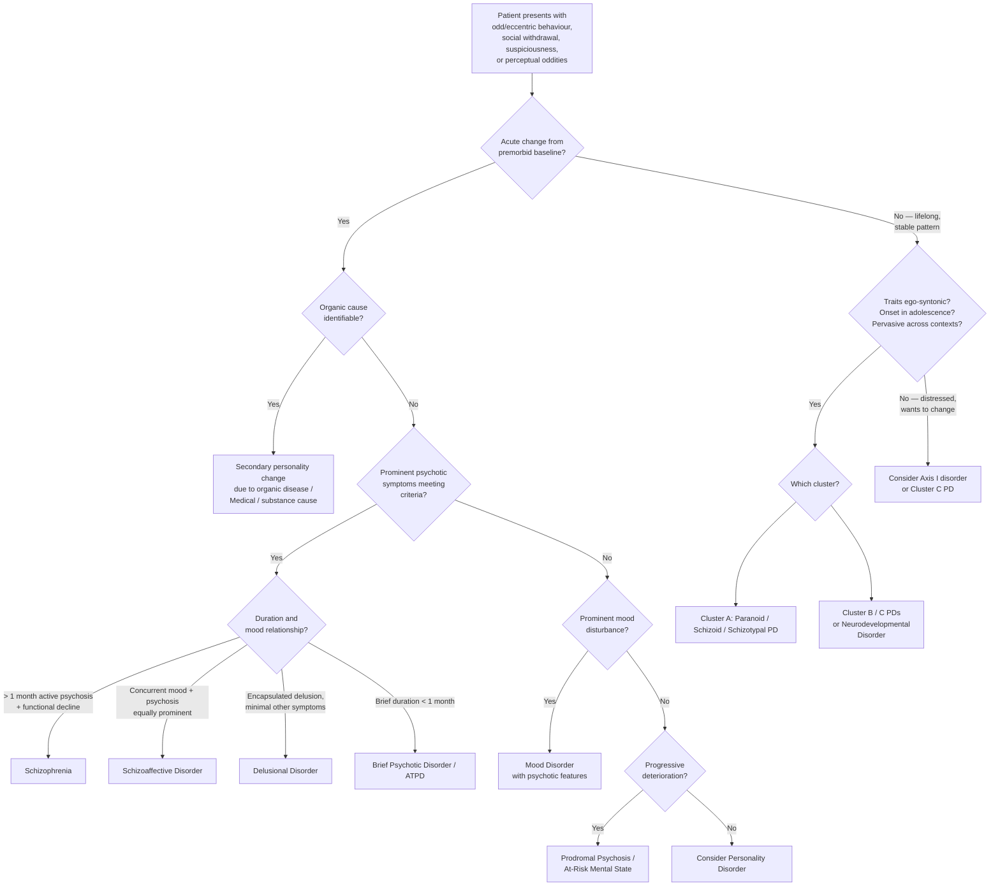

## Differential Diagnosis of Cluster A (Odd/Eccentric) Personality Disorders

The differential diagnosis of Cluster A PDs is one of the most intellectually demanding exercises in psychiatry because these disorders sit at the intersection of personality, psychosis, mood, neurodevelopment, and organic disease. The fundamental question you must always ask is: **"Is this a stable, lifelong trait (personality disorder), or is this a change from a baseline state (psychiatric illness / organic cause)?"** [2]

Remember the ***hierarchy of diagnosis*** principle [4]: when symptoms can be explained by more than one diagnosis, the higher-order diagnosis takes precedence — organic > psychotic > mood > anxiety > personality. Treatment of the higher-order disorder often resolves lower-order symptoms, but not vice versa. Therefore, you must **always rule out higher-order diagnoses before settling on a personality disorder**.

---

### Overarching Diagnostic Logic

---

### 1. Differential Diagnosis BY Cluster A Subtype

#### 1.1 Paranoid Personality Disorder — Differential Diagnosis

| Differential | Key Shared Features | How to Distinguish | Why the Distinction Matters |
|---|---|---|---|
| ***Delusional disorder (persecutory type)*** [1][3] | Suspiciousness, ideas of persecution | ***Delusional disorder: systematized, likely single-theme delusion, non-bizarre in nature; minimal negative symptoms; better functioning*** [1]. Paranoid PD: beliefs are **overvalued ideas** (pervasive distrust of many people/situations, not single-theme) rather than true fixed delusions. Paranoid PD is present since adolescence; delusional disorder has ***median onset age 46y*** [2]. | ***Paranoid PD has a genetic relationship with delusional disorder*** [2] — they are on a continuum. The threshold is whether the conviction crosses from "I'm suspicious of people" to "I am certain person X is specifically plotting against me" with delusional fixity. Treatment differs: delusional disorder requires antipsychotics; paranoid PD primarily needs psychotherapy. |
| **Schizophrenia (paranoid type)** | Persecutory ideation, distrust, social dysfunction | Schizophrenia: ***prominent psychotic symptoms lasting ≥1 month affecting functioning*** [3]; bizarre delusions, hallucinations (especially auditory), negative symptoms, formal thought disorder, functional decline from premorbid level. Paranoid PD: no hallucinations, no formal thought disorder, no functional decline from baseline — this IS their baseline. | The hierarchy principle: schizophrenia is a higher-order diagnosis. If psychotic symptoms are present, you cannot diagnose paranoid PD alone as the explanation. |
| ***Schizoaffective disorder*** | Paranoid ideation + mood disturbance | ***Concurrent schizophrenic and mood symptoms equally prominent, fulfilling a major mood episode*** [1]. Paranoid PD has no prominent mood episodes — the suspiciousness is stable, not episodic. | Treatment of schizoaffective disorder requires both antipsychotics and mood stabilizers. |
| **Mood disorder with psychotic features** | Paranoid ideation during depressive or manic episodes | Paranoid ideation in mood disorders is ***mood-congruent*** and temporally linked to mood episodes (resolves when mood normalizes). In paranoid PD, the suspiciousness is pervasive and independent of mood state [2][3]. | Treating the mood episode resolves the paranoid ideation — no need for long-term antipsychotic. |
| **Borderline PD (Cluster B)** | ***Transient paranoid ideation*** [2] | Borderline PD: paranoia is transient, stress-related, and accompanied by the full BPD picture — ***unstable relationships, impulsivity, chronic emptiness, self-harm, frantic efforts to avoid abandonment*** [2]. Paranoid PD: paranoia is stable and pervasive, without the emotional dysregulation and identity disturbance of BPD. | Borderline paranoia is reactive and self-limited; paranoid PD paranoia is enduring and characterological. |
| **Substance-induced paranoid state** | Persecutory ideation, hypervigilance | ***Intoxication (stimulants — amphetamines, cocaine, cannabis) and withdrawal (alcohol, sedatives)*** can produce paranoid states [5]. Key: temporal relationship with substance use; resolves after clearance. Screen with urine toxicology. | A substance cause is higher on the diagnostic hierarchy and must be excluded first. |
| **Organic paranoid state** | Suspiciousness, personality change | ***Injury to or organic disease of the brain (e.g., encephalitis, head injury)*** [2] → diagnosed as "change in personality due to organic disease." Consider in middle-aged or older patients with new-onset paranoid features, no prior psychiatric history. Investigate with neuroimaging. | Organic causes are at the top of the diagnostic hierarchy. |
| **Normal personality variation / cultural norms** | Suspiciousness in context | A degree of distrust may be appropriate in certain contexts (conflict zones, genuinely hostile environments, marginalized communities). In some cultures, caution towards outsiders is normative. It becomes a PD only when it is **pervasive, inflexible, and causes distress/impairment**. | Over-pathologizing culturally appropriate caution is a common mistake, especially in multicultural settings like Hong Kong. |

#### 1.2 Schizoid Personality Disorder — Differential Diagnosis

| Differential | Key Shared Features | How to Distinguish | Why the Distinction Matters |
|---|---|---|---|
| **Avoidant PD (Cluster C)** | Social isolation, few relationships | ***Avoidant PD: hypersensitivity to critical remarks or rejection; inhibited in social situations; fears of inadequacy*** [2]. The individual *wants* relationships but is paralyzed by fear. **Schizoid PD**: genuinely indifferent — ***neither enjoys nor desires close or sexual relationships; indifferent to praise or criticism*** [2]. The mechanism is completely different: avoidant = fear of rejection; schizoid = absence of social reward. | Treatment approach differs entirely. Avoidant PD benefits from exposure-based therapy and social skills training (the motivation to connect exists). Schizoid PD is much harder to treat because there is no intrinsic motivation for change. |
| ***Schizotypal PD*** | Social isolation, emotional detachment | ***Schizoid PD is associated with similar social isolation and emotional detachment but has no cognitive/perceptual distortions (attenuated +ve symptoms)*** [2]. Schizotypal PD adds odd beliefs, ideas of reference, magical thinking, unusual perceptual experiences, and eccentric behaviour/speech. | Schizotypal PD has higher risk of conversion to frank psychosis; schizoid PD generally does not progress to psychosis. Monitoring requirements differ. |
| **Autism Spectrum Disorder (ASD)** | Social withdrawal, restricted interests, limited emotional expression, preference for solitary activities | ASD: **developmental** in nature (present from early childhood, not just adolescence), with specific deficits in social communication and restricted/repetitive behaviours. The social difficulty in ASD stems from inability to read social cues (theory of mind deficit), not from indifference. Schizoid PD: the individual *can* read social cues but simply does not care to engage. Also, ASD often has sensory processing differences (hyper-/hyposensitivity) and rigid routines that schizoid PD lacks. | ASD is a neurodevelopmental diagnosis with specific interventions; misdiagnosing as schizoid PD misses the opportunity for appropriate support. |
| **Schizophrenia (residual / negative symptoms predominant)** | Emotional flattening, social withdrawal, anhedonia | Schizophrenia: there should be a history of at least one psychotic episode meeting criteria, with subsequent decline into a "negative symptom state." Schizoid PD: no past psychotic episodes; these traits have been present since adolescence. | Negative-symptom-predominant schizophrenia may benefit from clozapine or cariprazine; schizoid PD does not require antipsychotics. |
| **Depression with psychomotor retardation** | Social withdrawal, anhedonia, flat affect | Depression: episodic (change from premorbid baseline), with pervasive low mood, neurovegetative features (sleep, appetite, energy, concentration), guilt, and suicidality. Schizoid PD: lifelong pattern, no low mood per se — the individual is not *sad* about their isolation, they are *indifferent*. | Depression is highly treatable with antidepressants/psychotherapy; misdiagnosing as PD leads to therapeutic nihilism. |
| ***Secondary personality change after psychiatric illness*** | Social withdrawal after severe mental illness | ***Enduring personality change after psychiatric illness (F62 in ICD-10): lasted ≥2y, clearly related to experience of illness, not present before it*** [2]. Key: the withdrawal was NOT present before the illness. In schizoid PD, traits predate any psychiatric illness. | This is a recognized ICD-10 diagnosis and should not be confused with a primary PD. |
| **Substance-related social withdrawal** | Isolation, restricted activities | Chronic substance use (especially opioids, cannabis) can cause motivational syndrome with social withdrawal. Key: temporal relationship with substance use; functional imaging may show reversibility. | Higher on diagnostic hierarchy; treating the substance use may restore social functioning. |

#### 1.3 Schizotypal Personality Disorder — Differential Diagnosis

This is the most diagnostically challenging Cluster A PD because it sits closest to frank psychosis on the schizophrenia spectrum.

| Differential | Key Shared Features | How to Distinguish | Why the Distinction Matters |
|---|---|---|---|
| ***Schizophrenia*** [1][3] | Positive symptoms (delusions, hallucinations), negative symptoms, disorganization | ***Schizotypal PD: although attenuated +ve symptoms may be present, the patient has never met criteria of schizophrenia throughout entire life*** [2]. Schizophrenia: ***prominent psychotic symptoms lasting ≥1 month*** [3] with Schneiderian first-rank symptoms, frank hallucinations, clear functional decline. Schizotypal PD has *attenuated* forms — odd beliefs (not true delusions), illusions (not true hallucinations), vague speech (not formal thought disorder). The intensity threshold is the distinction. | Schizophrenia requires antipsychotic treatment; schizotypal PD primarily requires psychosocial intervention and monitoring. Mislabeling schizotypal PD as schizophrenia leads to unnecessary long-term antipsychotic exposure with its metabolic and neurological side effects. |
| **Prodromal psychosis / At-Risk Mental State (ARMS)** | Attenuated positive symptoms, functional decline, social withdrawal | Prodromal schizophrenia shows **progressive deterioration** — worsening perceptual disturbances, increasing social withdrawal, declining academic/occupational function, often over months. Schizotypal PD has ***a pervasive pattern (stable course)*** [2] — the oddness has been present for years without progression. However, ***schizotypal PD carries increased risk of psychotic disorder*** [2], and some individuals do convert. | This distinction has enormous clinical implications. Prodromal patients may benefit from early intervention programs, close monitoring, and possibly low-dose antipsychotics. Schizotypal PD patients need monitoring but not necessarily the same urgency. |
| ***Schizoaffective disorder*** | Psychotic symptoms + mood features | ***Concurrent schizophrenic and mood symptoms equally prominent*** [1]. Schizotypal PD: mood disturbances are secondary/comorbid (***mood/anxiety disorder often the reason for seeking help*** [2]), not defining the clinical picture. | Different treatment paradigm. |
| ***Brief psychotic disorder / Acute and transient psychotic disorders (ATPD)*** | Psychotic-like symptoms | ***ATPD: acute onset, complete remission, brief period (1–3 months); polymorphic features with rapidly changing clinical pictures, prominent fluctuated mood state, perplexity*** [1]. Schizotypal PD: chronic, stable, trait-like — not acute, not remitting. | ATPD may resolve completely; schizotypal PD does not "remit." |
| ***Delusional disorder*** | Paranoid ideation, ideas of reference | ***Delusional disorder: systematized, single-theme, non-bizarre delusion; no or non-prominent hallucination; minimal negative symptoms; better functioning*** [1]. Schizotypal PD: ideas are not organized into a single-theme systematized delusion; they are diffuse, vague, and multiple (magical thinking + ideas of reference + paranoia), and accompanied by perceptual and behavioural oddities that delusional disorder lacks. | The encapsulated, single-theme nature of delusional disorder makes it distinct from the diffuse oddity of schizotypal PD. |
| **Schizoid PD** | Social isolation, emotional detachment | Already discussed: ***schizoid PD has no cognitive/perceptual distortions*** [2]. Think of schizoid PD as "negative symptoms only" and schizotypal PD as "negative + attenuated positive + disorganized symptoms." | Different risk profile for psychosis conversion. |
| **Paranoid PD** | Paranoid ideation, social dysfunction | Paranoid PD: suspiciousness is the dominant and essentially the *only* cluster of pathology — no odd beliefs beyond persecution, no perceptual disturbances, no eccentric behaviour/speech, no disorganized features. Schizotypal PD: paranoid ideation is one component within a much richer phenomenology of cognitive, perceptual, and behavioural oddity. | |
| **Borderline PD** | ***Transient paranoid ideation; pseudohallucinations; dissociation*** [2] | Borderline PD: paranoid ideation and quasi-psychotic experiences are **stress-related and transient**, occurring in the context of intense emotional dysregulation and abandonment fears. Schizotypal PD: cognitive/perceptual distortions are **pervasive and stable**, not triggered by interpersonal stress. Also, borderline PD has the characteristic pattern of ***unstable relationships, impulsivity, self-harm, chronic emptiness*** [2] that schizotypal PD lacks. | |
| **ASD (Autism Spectrum Disorder)** | Social withdrawal, odd mannerisms, restricted interests, communication difficulties | Similar logic to schizoid vs ASD, but additionally: ASD does not feature magical thinking, ideas of reference, or perceptual distortions. The "oddness" in ASD is from social communication deficits and restricted/repetitive patterns, not from cognitive-perceptual distortions. | |
| **Personality change due to organic disease** | New-onset oddness in adulthood | ***Change in personality due to organic disease of the brain (eg. encephalitis, head injury)*** [2]: acquired, not lifelong; identifiable organic cause on investigation. Schizotypal PD: traits present since adolescence with no organic precipitant. | Always investigate new-onset personality change in adulthood with neuroimaging and appropriate labs. |

---

### 2. Cross-Cutting Differentials Across All Cluster A PDs

#### 2.1 Within-Cluster Differentiation (The "Trinity" of Cluster A)

This is a high-yield exam topic — you must be able to distinguish the three Cluster A PDs from each other:

| Feature | Paranoid PD | Schizoid PD | Schizotypal PD |
|---|---|---|---|
| **Suspiciousness** | ✅ Central feature | ✗ | ✅ Present but not central |
| **Social isolation** | Partial (has relationships but they're conflictual) | ✅ Central feature (by choice) | ✅ Present (by discomfort + alienation) |
| **Emotional coldness** | ✗ (emotions are intense — anger, hostility) | ✅ Central feature | Partial (inappropriate/constricted) |
| **Cognitive distortions** | Overvalued paranoid ideas only | ✗ None | ✅ Odd beliefs, magical thinking, ideas of reference |
| **Perceptual distortions** | ✗ None | ✗ None | ✅ Illusions, unusual experiences |
| **Eccentric behaviour/speech** | ✗ | ✗ | ✅ |
| **Litigiousness/grudges** | ✅ | ✗ | ✗ |
| **Psychosis risk** | Low (but → delusional disorder) | Low | ***Highest (→ schizophrenia)*** |

#### 2.2 Cluster A vs Cluster B vs Cluster C Overlap

Certain features can overlap across clusters and must be distinguished:

- **Paranoid PD vs Antisocial PD (Cluster B)**: Both can be hostile, aggressive, and distrustful. Antisocial PD: ***repeated unlawful behaviour, deceitfulness, lack of remorse*** [2] — the aggression serves exploitation. Paranoid PD: aggression is defensive ("I'm attacking because you attacked first") — the aggression serves self-protection from perceived threats.
- **Schizoid PD vs Avoidant PD (Cluster C)**: Already discussed. Core distinction: wants relationships but fears rejection (avoidant) vs does not want relationships (schizoid).
- **Schizotypal PD vs OCD (with poor insight)**: Both can have odd, rigid beliefs. OCD with poor insight: beliefs are ego-dystonic in origin (the individual recognizes, at least initially, that the thoughts are intrusive), obsessional in nature (recurrent, distressing), and accompanied by compulsions. Schizotypal odd beliefs: ego-syntonic, not obsessional, no compulsions.

#### 2.3 The Diagnostic Hierarchy Applied to Cluster A PDs

***Under a categorical system, when symptoms can be explained by ≥1 diagnoses, it is often conventional that one takes precedence*** [4]:

**Organic → Psychotic → Mood → Anxiety → Personality**

This means:
1. **Always exclude organic causes first** — brain tumour, encephalitis, head injury, substance use, medication side effects (***corticosteroids, anticholinergics, sympathomimetics*** can produce paranoid/odd states [5]).
2. **Then exclude frank psychotic disorders** — schizophrenia, schizoaffective, delusional disorder, ATPD.
3. **Then exclude mood disorders** with psychotic features — psychotic depression, mania with paranoia.
4. **Then exclude anxiety disorders** — ***noting the theme/focus of anxiety may be helpful*** [5] (e.g., worry about being harmed → paranoid PD vs fear of having a serious illness → illness anxiety disorder vs fear of being rejected → avoidant PD).
5. **Only then** diagnose a personality disorder.

<Callout title="The Golden Rule of PD Diagnosis" type="error">
You cannot diagnose a personality disorder during an active psychiatric episode. ***Personality behaviours are present through adult life vs psychiatric behaviours differ from premorbid state*** [2]. If the patient is acutely psychotic, depressed, or manic, you must treat the acute episode first and then reassess personality traits once the Axis I disorder has remitted. Many patients who appear "personality disordered" during an acute admission turn out to have normal premorbid personalities. Conversely, personality should be assessed by considering the ***premorbid personality*** [2] — how was this person *before* the current episode?
</Callout>

---

### 3. Special Considerations

#### 3.1 Comorbidity vs Differential

***Associations of schizotypal PD include increased risk of psychotic disorder, mood/anxiety disorder (often the reason for seeking help)*** [2]. This means:
- Schizotypal PD frequently **coexists** with mood and anxiety disorders. These are not either/or — the PD predisposes to comorbid Axis I disorders.
- ***Personality acts as a pathoplastic factor — it "colours" the presentation of psychiatric conditions*** [2]. For example, a patient with schizotypal PD who develops depression will have a depression that looks "odd" — with more paranoid features, unusual somatic complaints, and atypical presentation.

#### 3.2 Misdiagnosis Risks

***Misdiagnosis is very common*** [2] — this applies to personality disorders generally:
- **Underdiagnosis**: Cluster A PDs are often missed because patients rarely seek help for their personality traits (ego-syntonic). They present only when comorbid disorders develop or when life stressors overwhelm their coping.
- **Overdiagnosis**: Culturally appropriate suspiciousness, introversion, or spiritual/magical beliefs can be misdiagnosed as Cluster A PDs in cross-cultural settings.
- ***Clinicians often agree on presence of PD but disagree on subtype*** [2] — there is significant inter-rater variability, reinforcing the need for structured assessment tools.

---

<Callout title="High Yield Summary — Differential Diagnosis">

1. **Hierarchy**: Always rule out organic → psychotic → mood → anxiety causes before diagnosing a personality disorder. You cannot diagnose PD during an active psychiatric episode.

2. **Paranoid PD DDx**: Delusional disorder (fixed single-theme delusion vs pervasive overvalued suspicion), schizophrenia (frank psychosis vs no hallucinations/thought disorder), mood disorder with psychosis (episodic and mood-congruent vs pervasive), borderline PD (transient stress-related paranoia vs stable characterological), substance-induced states, organic causes.

3. **Schizoid PD DDx**: Avoidant PD (wants relationships but fears rejection vs genuinely indifferent), schizotypal PD (adds cognitive/perceptual distortions), ASD (developmental social communication deficit vs personality-level indifference), negative-symptom schizophrenia (requires prior psychotic episode), depression (episodic with low mood vs lifelong indifference).

4. **Schizotypal PD DDx**: Schizophrenia (attenuated vs frank psychosis; has NEVER met schizophrenia criteria), prodromal psychosis (stable course vs progressive deterioration), schizoid PD (no cognitive/perceptual distortions), delusional disorder (single-theme systematized vs diffuse multiple oddities), borderline PD (transient stress-related quasi-psychosis vs stable pervasive distortions).

5. **Within Cluster A**: Paranoid = distrust central, no perceptual oddities; Schizoid = detachment central, no cognitive/perceptual oddities; Schizotypal = full attenuated schizophrenia spectrum with cognitive + perceptual + behavioural + social features.

6. **Schizotypal PD carries increased risk of conversion to psychosis** — longitudinal monitoring is essential.

</Callout>

---

<ActiveRecallQuiz
  title="Active Recall - Differential Diagnosis of Cluster A PDs"
  items={[
    {
      question: "What is the diagnostic hierarchy in psychiatry and how does it apply to diagnosing Cluster A personality disorders?",
      markscheme: "Hierarchy: Organic > Psychotic > Mood > Anxiety > Personality. Must exclude all higher-order diagnoses first. Cannot diagnose PD during active psychiatric episode — must assess premorbid personality after Axis I disorders have been treated/remitted. Treatment of higher-order disorder often resolves lower-order symptoms.",
    },
    {
      question: "How do you differentiate paranoid personality disorder from delusional disorder (persecutory type)?",
      markscheme: "Paranoid PD: pervasive distrust of many people/situations, overvalued ideas (not fixed delusions), lifelong since adolescence, no single systematized theme. Delusional disorder: systematized single-theme non-bizarre delusion with delusional conviction, median onset age 46, encapsulated (behaviour normal apart from delusion), minimal other symptoms. Both share genetic relationship. Key: intensity of conviction and onset age.",
    },
    {
      question: "A patient presents with social isolation and few close friends. How would you differentiate between schizoid PD, avoidant PD, and autism spectrum disorder?",
      markscheme: "Schizoid PD: genuinely indifferent to social contact, not distressed by isolation, no social anxiety, no cognitive-perceptual distortions. Avoidant PD: desperately wants relationships but fears rejection/inadequacy, profoundly distressed by isolation, hypersensitive to criticism. ASD: developmental onset from early childhood, specific deficits in social communication and theory of mind (cannot read social cues rather than choosing not to engage), restricted/repetitive behaviours, sensory processing differences.",
    },
    {
      question: "How do you distinguish schizotypal PD from prodromal schizophrenia, and why does this distinction matter?",
      markscheme: "Schizotypal PD: stable pervasive pattern since adolescence, attenuated positive symptoms that have NEVER met schizophrenia criteria throughout entire life, no progressive deterioration. Prodromal schizophrenia: progressive worsening of perceptual disturbances, social withdrawal, and functional decline over months. Distinction matters because: prodromal psychosis may benefit from early intervention and possibly low-dose antipsychotics; schizotypal PD needs monitoring but less urgent. However, schizotypal PD carries increased risk of conversion to psychosis.",
    },
    {
      question: "Name three psychiatric conditions that can mimic paranoid personality disorder and explain one key distinguishing feature for each.",
      markscheme: "1) Schizophrenia: frank psychotic symptoms (bizarre delusions, auditory hallucinations, formal thought disorder) lasting at least 1 month with functional decline — paranoid PD has no hallucinations or thought disorder. 2) Borderline PD: transient paranoid ideation is stress-related and accompanied by emotional dysregulation, impulsivity, self-harm, abandonment fears — paranoid PD paranoia is stable and characterological. 3) Substance-induced paranoid state (stimulants, cannabis): temporal relationship with substance use, resolves after clearance — paranoid PD is lifelong. Any 3 valid DDx with distinguishing features acceptable.",
    },
  ]}
/>

---

## References

[1] Lecture slides: GC 170. Schizophrenia and related psychoses.pdf (p22)
[2] Senior notes: ryanho-psych.md (sections 10.1, 10.2, schizotypal/delusional disorder pp. 133–134, pp. 237–240, secondary personality change p. 237)
[3] Senior notes: ryanho-psych.md (psychotic disorder differential diagnosis table pp. 124, 133–134)
[4] Senior notes: ryanho-psych.md (hierarchy of diagnosis p. 4)
[5] Senior notes: ryanho-psych.md (anxiety differential diagnosis p. 165, substance-induced causes)
