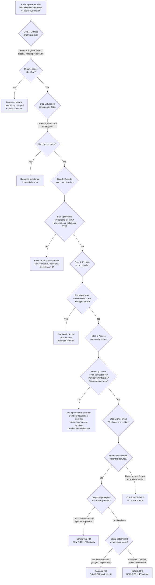

## Diagnostic Criteria

### 1. General Diagnostic Framework for Personality Disorders

Before looking at specific Cluster A criteria, you must first satisfy the **general criteria** for *any* personality disorder. Think of this as a two-step process: Step 1 — meet general PD criteria; Step 2 — meet specific subtype criteria. If Step 1 fails, you cannot diagnose any PD regardless of how many subtype features are present.

#### 1.1 DSM-5-TR General Diagnostic Criteria for a Personality Disorder

The DSM-5-TR criteria are the gold standard used in HKU exams. Each criterion exists for a conceptual reason [2][6]:

> ***An enduring pattern of inner experience and behaviour that deviates markedly from the expectations of the individual's culture. Manifested in ≥2 of these areas:*** [6]
> 1. ***Cognition*** — ways of perceiving and interpreting self, other people, and events
> 2. ***Affectivity*** — the range, intensity, lability, and appropriateness of emotional response
> 3. ***Interpersonal functioning***
> 4. ***Impulse control***

**Why ≥2 of 4 domains?** Because personality is by definition a *pervasive* pattern — affecting only one domain suggests a more circumscribed problem (e.g., impulse control disorder, adjustment disorder) rather than a personality disorder.

The remaining general criteria are:

| Criterion | Requirement | Rationale (from first principles) |
|---|---|---|
| **B** | The pattern is **inflexible and pervasive** across a broad range of personal and social situations | Distinguishes PD from situational behaviour. If someone is only suspicious at work but perfectly trusting at home, that's not paranoid PD — it's a contextual response. |
| **C** | The pattern leads to clinically significant **distress or impairment** in social, occupational, or other important areas of functioning | This is the threshold between "personality trait" and "personality disorder." Many people have paranoid, schizoid, or eccentric traits — it only becomes a *disorder* when it causes suffering (to self or others) or dysfunction. |
| **D** | The pattern is **stable and of long duration**, with onset traceable to at least **adolescence or early adulthood** | ***Personality behaviours are present through adult life*** [2] — this separates PD from acquired psychiatric illness, which differs from premorbid state. If odd behaviour started at age 50, think organic cause or late-onset psychotic disorder, not PD. |
| **E** | The pattern is **not better explained by** another mental disorder | The diagnostic hierarchy principle [4]. Paranoid ideation during a depressive episode is not paranoid PD. |
| **F** | The pattern is **not attributable to** the physiological effects of a substance or another medical condition | Must exclude ***organic disease of the brain (encephalitis, head injury)*** [2], substance intoxication/withdrawal, and medication effects. |

#### 1.2 ICD-10 General Criteria for Specific Personality Disorders (F60)

The ICD-10 criteria are conceptually parallel but worded differently [6]:

> ***Meet the following criteria and not attributable to gross brain damage or another psychiatric disorder:***
> - Markedly disharmonious attitudes and behaviour, involving usually several areas of functioning (e.g., affectivity, arousal, impulse control, ways of perceiving and thinking, style of relating to others)
> - The abnormal behaviour pattern is enduring, of long standing, and not limited to episodes of mental illness
> - The abnormal behaviour pattern is pervasive and clearly maladaptive to a broad range of personal and social situations
> - The above manifestations always appear during childhood or adolescence and continue into adulthood
> - The disorder leads to considerable personal distress (which may only become apparent late in its course)
> - The disorder is usually, but not invariably, associated with significant problems in occupational and social performance

<Callout title="ICD-10 vs DSM-5-TR: Key Differences for Exam" type="error">
1. ***ICD-10 does not include schizotypal PD as a personality disorder*** — it classifies it as F21 Schizotypal Disorder under schizophrenia-spectrum [2][1]. This means if using ICD-10, you only diagnose paranoid PD and schizoid PD under Cluster A. Schizotypal features are classified under psychotic disorders.
2. ***ICD-10 does not include narcissistic PD*** [2].
3. ICD-11 has moved to a **dimensional model** — personality disorder is diagnosed by severity (mild/moderate/severe) with qualifying trait domains (detachment, dissociality, negative affectivity, disinhibition, anankastia), rather than categorical subtypes.
</Callout>

---

### 2. Specific Diagnostic Criteria for Each Cluster A PD

#### 2.1 Paranoid Personality Disorder (DSM-5-TR: 301.0 / ICD-10: F60.0)

**DSM-5-TR Criteria:**

A pervasive distrust and suspiciousness of others such that their motives are interpreted as malevolent, beginning by early adulthood and present in a variety of contexts, as indicated by **≥4 of the following 7 criteria**:

| # | Criterion | What This Looks Like | Pathophysiological Link |
|---|---|---|---|
| 1 | Suspects, without sufficient basis, that others are exploiting, harming, or deceiving him/her | "My colleagues are plotting to get me fired" — without evidence | Hyperactive threat-detection schema; hostile attribution bias |
| 2 | Preoccupied with unjustified doubts about the loyalty or trustworthiness of friends/associates | Constantly tests relationships: "If you were really my friend, you would..." | Insecure attachment → inability to trust |
| 3 | Reluctant to confide in others because of unwarranted fear that information will be used against them | Won't share personal details even with close family | Vulnerability = danger in the paranoid cognitive model |
| 4 | Reads hidden demeaning or threatening meanings into benign remarks or events | "You said 'good morning' sarcastically" | Confirmatory bias filtering all input through paranoid schema |
| 5 | Persistently bears grudges (i.e., is unforgiving of insults, injuries, or slights) | Recalls minor slights from decades ago with intense emotion | Perceived injustices stored as evidence; forgiving would require schema revision |
| 6 | Perceives attacks on character/reputation not apparent to others; quick to react angrily or counterattack | Explosive anger after perceived insult that others did not notice | Low threshold for perceived provocation; "fight" response dominant |
| 7 | Has recurrent suspicions, without justification, regarding fidelity of spouse/partner | Checks partner's phone, accuses them of affairs without evidence | Extension of core distrust to intimate domain |

**Additional DSM-5-TR stipulations:**
- Does not occur exclusively during the course of schizophrenia, a bipolar or depressive disorder with psychotic features, or another psychotic disorder.
- Is not attributable to the physiological effects of another medical condition.

**ICD-10 (F60.0) Key Features** [2]:
- ***Suspects others are exploiting, harming or deceiving them***
- ***Doubts about spouse's fidelity***
- ***Bears grudges***
- ***Tenacious sense of personal rights; litigious***
- Excessive self-importance; self-referential attitude
- Preoccupation with conspiratorial explanations of events

#### 2.2 Schizoid Personality Disorder (DSM-5-TR: 301.20 / ICD-10: F60.1)

**DSM-5-TR Criteria:**

A pervasive pattern of detachment from social relationships and a restricted range of expression of emotions in interpersonal settings, beginning by early adulthood and present in a variety of contexts, as indicated by **≥4 of the following 7 criteria**:

| # | Criterion | What This Looks Like | Pathophysiological Link |
|---|---|---|---|
| 1 | Neither desires nor enjoys close relationships, including being part of a family | Lives alone, no interest in family gatherings, no dating | Absent social reward circuitry activation → no pleasure from interpersonal contact |
| 2 | Almost always chooses solitary activities | Works in isolation-friendly roles (night watchman, IT backend), hobbies are solo | Logical consequence of absent social motivation |
| 3 | Has little, if any, interest in having sexual experiences with another person | Not distressed by celibacy; low libido or indifference to sexual intimacy | Reduced drive extends to intimate/physical domain |
| 4 | Takes pleasure in few, if any, activities | Limited hobby repertoire; may appear "boring" to others | Generalized anhedonia; mesocortical DA hypoactivity |
| 5 | Lacks close friends or confidants other than first-degree relatives | "I don't have friends and I don't need them" | Not distressed (cf. avoidant PD) — genuine indifference |
| 6 | Appears indifferent to the praise or criticism of others | Unaffected by positive or negative feedback | External social cues do not engage reward or threat circuitry |
| 7 | Shows emotional coldness, detachment, or flattened affectivity | Monotone voice, blank expression, does not laugh or cry | Dampened emotional processing; resembles attenuated negative symptoms |

**Additional DSM-5-TR stipulations:**
- Does not occur exclusively during the course of schizophrenia, a bipolar or depressive disorder with psychotic features, another psychotic disorder, or autism spectrum disorder.
- Not attributable to the physiological effects of another medical condition.

**ICD-10 (F60.1) Key Features** [2]:
- ***Emotional coldness***
- ***Neither enjoys nor desires close or sexual relationships***
- ***Prefers solitary activities***
- ***Takes pleasure in few activities***
- ***Indifferent to praise or criticism***
- Consistent preference for solitary activities
- Limited capacity to express warm feelings or anger

#### 2.3 Schizotypal Personality Disorder (DSM-5-TR: 301.22)

**Important classification note**: ***Considered personality disorder in DSM-5 but schizophrenia-like disorder (F21) in ICD-10*** [2][1]. The DSM-5-TR criteria are presented here as they provide the most structured framework.

**DSM-5-TR Criteria:**

A pervasive pattern of social and interpersonal deficits marked by acute discomfort with, and reduced capacity for, close relationships as well as by cognitive or perceptual distortions and eccentricities of behaviour, beginning by early adulthood and present in a variety of contexts, as indicated by **≥5 of the following 9 criteria**:

| # | Criterion | Domain | Pathophysiological Link |
|---|---|---|---|
| 1 | Ideas of reference (excluding delusions of reference) | ***Cognitive distortion ("attenuated form" of delusion)*** [2] | Aberrant salience — random events flagged as personally meaningful by dysregulated mesolimbic DA |
| 2 | Odd beliefs or magical thinking inconsistent with subcultural norms (e.g., belief in telepathy, "sixth sense") | ***Cognitive distortion*** [2] | Same aberrant salience + reduced prefrontal reality-testing |
| 3 | Unusual perceptual experiences, including bodily illusions | ***Perceptual distortion ("attenuated form" of hallucination)*** [2] | Subthreshold sensory processing errors; serotonergic/dopaminergic dysregulation in sensory cortices |
| 4 | Odd thinking and speech (e.g., vague, circumstantial, metaphorical, overelaborate, stereotyped) | ***Odd behaviour ("attenuated form" of disorganization)*** [2] | White matter disconnectivity between language/executive regions |
| 5 | Suspiciousness or paranoid ideation | ***Cognitive distortion*** [2] | Hyperactive threat detection (shared with paranoid PD) |
| 6 | Inappropriate or constricted affect | ***Odd behaviour*** [2] | Emotional expression dysregulation |
| 7 | Behaviour or appearance that is odd, eccentric, or peculiar | ***Odd behaviour*** [2] | Impaired social self-monitoring + frontal disconnectivity |
| 8 | Lack of close friends or confidants other than first-degree relatives | ***Social isolation ("attenuated form" of negative symptoms)*** [2] | Combined effect of paranoid ideation + eccentricity alienating others + social anhedonia |
| 9 | Excessive social anxiety that does not diminish with familiarity and tends to be associated with paranoid fears rather than negative judgments about self | ***Social isolation*** [2] | Anxiety rooted in paranoid cognition (people are dangerous), not in self-evaluation (I am inadequate — that would be avoidant PD) |

**Critical additional DSM-5-TR stipulation:**
- Does not occur exclusively during the course of schizophrenia, a bipolar or depressive disorder with psychotic features, another psychotic disorder, or autism spectrum disorder.
- ***The patient has never met criteria of schizophrenia throughout entire life*** [2].

**ICD-10 (F21 Schizotypal Disorder)** — classified under psychotic disorders, not PDs:
- ***Eccentric behaviour; odd beliefs or magical thinking; unusual perceptual experiences (e.g., "sensing" another's presence); ideas of reference; suspicious or paranoid ideas; vague or circumstantial thinking; social withdrawal*** [2]
- Duration: features should be present continuously or episodically for ≥2 years
- Has never met criteria for schizophrenia

<Callout title="Threshold Counts: A Quick Reference">

- **Paranoid PD**: ≥4 of 7 criteria
- **Schizoid PD**: ≥4 of 7 criteria
- **Schizotypal PD**: ≥5 of 9 criteria

All require meeting general PD criteria first (pervasive, inflexible, onset adolescence/early adulthood, distress/impairment, not better explained by another disorder or substance/medical condition).

</Callout>

---

### 3. Comparison of Diagnostic Criteria Across Systems

| Feature | DSM-5-TR | ICD-10 | ICD-11 |
|---|---|---|---|
| **Approach** | ***Categorical*** (discrete subtypes) [6] | ***Categorical*** [6] | ***Dimensional*** (severity + trait qualifiers) |
| **Paranoid PD** | 301.0 (≥4/7) | F60.0 | PD with prominent dissociality/negative affectivity |
| **Schizoid PD** | 301.20 (≥4/7) | F60.1 | PD with prominent detachment |
| **Schizotypal PD** | 301.22 (≥5/9) | ***F21 — NOT a PD; classified under schizophrenia-spectrum*** [2][1] | 6A22 Schizotypal disorder (under schizophrenia-spectrum) |
| **General PD threshold** | Deviation in ≥2/4 domains (cognition, affectivity, interpersonal, impulse control) | Disharmonious attitudes/behaviour in several areas of functioning | Severity-based: mild, moderate, severe |

---

## Diagnostic Algorithm

### Step-by-Step Clinical Approach

### Key Decision Points Explained

1. **Step 1 — Organic exclusion is paramount.** ***Secondary personality disorder can occur from injury to or organic disease of the brain (e.g., encephalitis, head injury)*** [2]. A 55-year-old presenting with "new paranoia" warrants a CT head, not a personality disorder diagnosis.

2. **Step 3 — The psychosis gateway.** The critical distinction for Cluster A PDs (especially schizotypal) is whether symptoms cross the psychosis threshold. ***Schizophrenia requires prominent psychotic symptoms lasting ≥1 month affecting functioning; DSM-5 requires ≥6 months of disturbance*** [3]. ***Schizotypal PD: attenuated positive symptoms present but has never met criteria of schizophrenia throughout entire life*** [2].

3. **Step 6 — Within Cluster A differentiation.** The decision tree hinges on one key question: **Are there cognitive/perceptual distortions?**
   - **Yes → Schizotypal PD** (the only Cluster A PD with attenuated positive symptoms)
   - **No → then is the core issue distrust (→ Paranoid PD) or detachment (→ Schizoid PD)?**
   - ***Schizoid PD is associated with similar social isolation and emotional detachment but has no cognitive/perceptual distortions*** [2] — this is the classic exam distinguishing point.

---

## Investigation Modalities

### Important Principle

> Personality disorders are **clinical diagnoses** — there is no blood test, imaging study, or biomarker that can confirm a personality disorder. Investigations serve two purposes: **(1) excluding organic/medical causes** that mimic PD features, and **(2) assessing comorbid conditions**. The diagnosis rests on comprehensive clinical assessment including history (longitudinal, from multiple informants), mental state examination, and structured assessment tools.

### 4.1 Investigations to Exclude Organic / Medical Causes

These are performed when the clinical picture suggests possible secondary (organic) personality change, when onset is atypical (e.g., middle-aged, acute), or as part of a standard psychiatric workup.

| Investigation | Key Findings to Look For | Relevance to Cluster A DDx |
|---|---|---|
| **Full blood count (FBC)** | Anaemia (fatigue → apathy mimicking schizoid), infection markers | Baseline screen; chronic infection can cause behavioural change |
| **Thyroid function tests (TFTs)** | Hypothyroidism: apathy, social withdrawal, cognitive slowing → mimics schizoid PD. Hyperthyroidism: agitation, anxiety, paranoia → mimics paranoid PD | Thyroid dysfunction is a common and reversible cause of personality-mimicking symptoms |
| **Liver function tests (LFTs)** | Hepatic encephalopathy: personality change, cognitive impairment | Screen for chronic alcohol use / hepatic disease |
| **Renal function (U&E)** | Uraemic encephalopathy | Rare but important |
| **Calcium, glucose** | Hypercalcaemia: psychiatric symptoms including paranoia. Hypoglycaemia: episodic behavioural change | Must exclude metabolic causes |
| **Vitamin B12 / folate** | Deficiency → cognitive impairment, personality change, paranoid symptoms | Important in elderly patients presenting with apparent personality change |
| **Syphilis serology (VDRL/RPR)** | Neurosyphilis: personality change, psychosis | Still relevant; important in sexually active patients with new-onset personality change |
| **ESR / CRP** | Inflammatory markers → autoimmune encephalitis, vasculitis | Consider in younger patients with subacute personality change |
| **Urine toxicology screen** | Cannabis, amphetamines, cocaine, opioids | ***Substance abuse (cannabis)*** [1] is a risk factor for psychosis-spectrum symptoms; stimulant use causes paranoid states. Must be excluded before diagnosing PD. |
| **HIV test** | HIV encephalopathy → personality change | Consider in at-risk populations, especially with new-onset behavioural change |

| **Neuroimaging** | | |
|---|---|---|
| **CT Head** | Space-occupying lesion, hydrocephalus, frontal lobe pathology | First-line if organic cause suspected. ***Injury to or organic disease of the brain*** [2] — frontal lobe tumours classically cause personality change (disinhibition, apathy) |
| **MRI Brain** | White matter changes, temporal lobe pathology, hippocampal volume | More sensitive than CT. Research shows reduced grey matter in prefrontal and temporal regions in schizotypal PD, but this is NOT used diagnostically — it's for excluding structural pathology |

| **Neurophysiology** | | |
|---|---|---|
| **EEG** | Temporal lobe epilepsy (TLE): interictal personality changes (Geschwind syndrome — hyperreligiosity, hypergraphia, altered sexuality, viscosity) can mimic Cluster A features | Consider if paroxysmal behavioural episodes or if symptoms are episodic rather than stable |

### 4.2 Structured Clinical Assessment Tools

These are the actual "diagnostic instruments" for personality disorders — they formalize the clinical assessment.

| Tool | Type | Description | Clinical Utility |
|---|---|---|---|
| **Structured Clinical Interview for DSM-5 Personality Disorders (SCID-5-PD)** | Semi-structured clinician-administered interview | Systematically assesses each DSM-5-TR PD criterion through standardized questions | Gold standard in research; can be used clinically for complex cases. Ensures all criteria are assessed — ***clinicians often agree on presence of PD but disagree on subtype*** [2]; structured instruments improve agreement. |
| **International Personality Disorder Examination (IPDE)** | Semi-structured interview | Designed for both ICD-10 and DSM-5; cross-cultural validation | Particularly useful in the Hong Kong context for culturally sensitive assessment |
| **Personality Diagnostic Questionnaire (PDQ-4+)** | Self-report screening | Patient completes a questionnaire mapping to DSM criteria | Good screening tool but high false-positive rate; must be followed by clinical interview |
| **Millon Clinical Multiaxial Inventory (MCMI-IV)** | Self-report | 195-item questionnaire assessing personality patterns and clinical syndromes | Uses dimensional scoring; can quantify severity |
| ***Minnesota Multiphasic Personality Inventory (MMPI-2-RF)*** | Self-report | Broad personality and psychopathology measure | ***Used in dimensional/research approach*** [6]; extensive normative data |
| **Schizotypal Personality Questionnaire (SPQ)** | Self-report | Specifically assesses 9 DSM schizotypal PD features | Useful screening tool for schizotypal features; can track symptom burden over time |
| **Comprehensive Assessment of At-Risk Mental States (CAARMS)** | Semi-structured interview | Specifically designed to assess prodromal psychosis / at-risk mental state | Critical for distinguishing schizotypal PD from prodromal psychosis — assesses attenuated positive symptoms, brief limited psychotic episodes, and functional decline |

### 4.3 Collateral Information

This is arguably the most important "investigation" in personality disorder diagnosis:

- **Informant history** from family, friends, partners, employers — personality traits are ego-syntonic, so patients may not recognize or report them accurately. Collateral provides the longitudinal perspective needed to confirm traits are enduring since adolescence.
- ***Assessment should cover: source of distress (thoughts, emotions, behaviour, relationships) to self and others; functional impairment at work, home, social circumstances; any comorbid psychiatric illness; strengths and weaknesses of individual*** [2].
- **Previous medical records** — past psychiatric contacts, employment records, legal records (relevant for paranoid PD with litigiousness).
- **School reports** — evidence of odd behaviour, social isolation, or poor peer relationships dating back to childhood/adolescence.

### 4.4 Investigations for Comorbid Conditions

Since Cluster A PDs are frequently comorbid with other psychiatric disorders, screening investigations include:

| Comorbid Condition | Screening Approach | Why |
|---|---|---|
| **Depression** | PHQ-9, clinical interview | ***Mood/anxiety disorder often the reason for seeking help*** in schizotypal PD [2]; depression common in paranoid PD (rumination over injustices) |
| **Anxiety disorders** | GAD-7, clinical interview | Social anxiety is a feature of schizotypal PD; generalized anxiety common across all Cluster A PDs |
| **Substance use** | AUDIT (alcohol), DAST (drugs), urine toxicology | Self-medication is common; substance use may exacerbate paranoid features |
| **Psychosis screening** | CAARMS, PRIME Screen | ***Schizotypal PD carries increased risk of psychotic disorder*** [2] — regular screening for conversion is important |
| **Suicide risk assessment** | Columbia Suicide Severity Rating Scale, clinical interview | Risk present in all PDs, especially during comorbid depression or psychotic conversion |

<Callout title="Key Investigation Principle" type="idea">
In personality disorders, investigations are primarily **exclusionary** (ruling out organic/substance causes) and **complementary** (screening for comorbidity and assessing risk). The diagnosis itself is made clinically through longitudinal assessment, preferably with structured instruments and collateral information. There is no pathognomonic lab test, biomarker, or imaging finding. If an exam question asks "What investigation confirms the diagnosis of paranoid PD?", the answer is: **structured clinical assessment with longitudinal history and collateral** — not any lab or imaging study.
</Callout>

---

### 5. Summary Diagnostic Table

| Aspect | Paranoid PD | Schizoid PD | Schizotypal PD |
|---|---|---|---|
| **DSM-5-TR code** | 301.0 | 301.20 | 301.22 |
| **ICD-10 code** | F60.0 | F60.1 | ***F21 (classified under psychotic disorders, not PD)*** [2] |
| **Criteria threshold** | ≥4 of 7 | ≥4 of 7 | ≥5 of 9 |
| **Core domains** | Distrust, suspiciousness | Detachment, restricted affect | Cognitive/perceptual distortions + eccentricity + social deficits |
| **Key exclusion** | Not during psychosis, mood episode, or due to medical condition | Not during psychosis, mood episode, ASD, or due to medical condition | ***Has never met criteria for schizophrenia throughout entire life*** [2] |
| **Key investigation** | Exclude organic paranoia (CT/MRI if late-onset; TFTs; B12; urine tox) | Exclude depression, hypothyroidism, ASD | CAARMS to distinguish from prodromal psychosis; longitudinal monitoring for conversion |

---

<Callout title="High Yield Summary — Diagnosis">

1. **Two-step diagnostic process**: First meet general PD criteria (pervasive, inflexible, ≥2 domains, onset adolescence/early adulthood, distress/impairment, not better explained), then meet specific subtype criteria.

2. **Criterion thresholds**: Paranoid ≥4/7, Schizoid ≥4/7, Schizotypal ≥5/9.

3. **ICD-10 classification trap**: Schizotypal disorder is F21 (psychotic disorder), NOT a personality disorder in ICD-10. Only paranoid and schizoid PD exist as Cluster A PDs in ICD-10.

4. **Personality disorder is a clinical diagnosis** — investigations are exclusionary (organic/substance causes) and complementary (comorbidity screening). No confirmatory biomarker exists.

5. **Structured instruments** (SCID-5-PD, IPDE) improve diagnostic reliability, addressing the problem that clinicians often agree on PD presence but disagree on subtype.

6. **Organic exclusion is mandatory**: TFTs, B12/folate, syphilis, glucose, calcium, neuroimaging if atypical onset. Always consider substance use.

7. **Key distinguishing point within Cluster A**: cognitive/perceptual distortions present → schizotypal PD; absent → then distrust = paranoid PD, detachment = schizoid PD.

8. **Schizotypal PD requires ongoing monitoring** for psychosis conversion using tools like CAARMS.

</Callout>

---

<ActiveRecallQuiz
  title="Active Recall - Diagnostic Criteria and Investigations for Cluster A PDs"
  items={[
    {
      question: "List the four domains that must be affected (at least 2 of 4) in DSM-5-TR General Criteria for Personality Disorder and explain why this requirement exists.",
      markscheme: "Cognition (perceiving and interpreting self/others/events), Affectivity (range, intensity, lability, appropriateness of emotional response), Interpersonal functioning, Impulse control. Requirement for at least 2 of 4 ensures the pattern is pervasive (personality-level) rather than affecting only one narrow domain (which would suggest a more circumscribed disorder).",
    },
    {
      question: "What are the criterion thresholds for diagnosing each Cluster A PD in DSM-5-TR, and how is schizotypal PD classified differently in ICD-10?",
      markscheme: "Paranoid PD: at least 4 of 7 criteria. Schizoid PD: at least 4 of 7 criteria. Schizotypal PD: at least 5 of 9 criteria. In ICD-10, schizotypal disorder is classified as F21 under schizophrenia-spectrum psychotic disorders, NOT as a personality disorder. Only paranoid (F60.0) and schizoid (F60.1) PD exist as Cluster A PDs in ICD-10.",
    },
    {
      question: "You suspect a patient has schizotypal PD. What single clinical fact absolutely must be established to make this diagnosis, and what tool would you use to assess whether they might instead have prodromal psychosis?",
      markscheme: "Must establish that the patient has NEVER met criteria for schizophrenia throughout their entire life. If they have ever had a psychotic episode meeting schizophrenia criteria, they cannot be diagnosed with schizotypal PD. Use the Comprehensive Assessment of At-Risk Mental States (CAARMS) to distinguish stable schizotypal PD from progressive prodromal psychosis, which shows worsening attenuated positive symptoms and functional decline.",
    },
    {
      question: "Name five investigations you would order to exclude organic causes mimicking a Cluster A personality disorder presentation in a middle-aged patient with new-onset paranoid and eccentric behaviour.",
      markscheme: "Any 5 of: TFTs (hypothyroidism/hyperthyroidism mimicking schizoid or paranoid features), CT/MRI brain (frontal lobe tumour, encephalitis, head injury), vitamin B12/folate (deficiency causing personality change), syphilis serology (neurosyphilis), urine toxicology screen (stimulant/cannabis-induced paranoia), calcium (hypercalcaemia), glucose, HIV test, FBC, LFTs, ESR/CRP, EEG (temporal lobe epilepsy).",
    },
    {
      question: "Why can you NOT diagnose a personality disorder during an active psychiatric episode, and what does this mean practically for assessment timing?",
      markscheme: "Because personality behaviours are present through adult life as enduring patterns, while psychiatric illness represents a change from premorbid state. During acute psychosis, depression, or mania, symptoms may mimic PD features but resolve with treatment of the Axis I disorder. Practically: treat the acute episode first, allow remission, then reassess personality over time using longitudinal history and collateral information. Premorbid personality should be evaluated based on how the patient functioned BEFORE the current episode.",
    },
  ]}
/>

---

## References

[1] Lecture slides: GC 170. Schizophrenia and related psychoses.pdf (p22)
[2] Senior notes: ryanho-psych.md (sections 10.1, 10.2, schizotypal disorder pp. 133–134, secondary personality change p. 237, pp. 238–240)
[3] Senior notes: ryanho-psych.md (psychotic disorder differential diagnosis table p. 124)
[4] Senior notes: ryanho-psych.md (hierarchy of diagnosis p. 4)
[6] Senior notes: ryanho-psych.md (diagnostic criteria for personality disorders, dimensional vs categorical approaches pp. 236–237)
