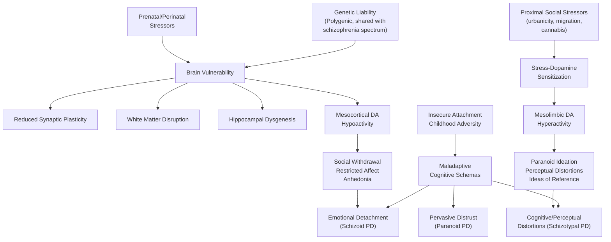
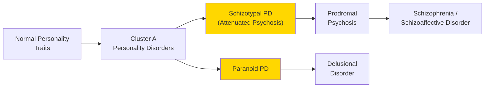

# Cluster A (Odd/Eccentric) Personality Disorders

## 1. Definition

A personality disorder (PD) is an ***enduring pattern of inner experience and behaviour that deviates markedly from the expectations of the individual's culture***, is pervasive and inflexible, has an onset in adolescence or early adulthood, is stable over time, and leads to distress or impairment [1][2]. The key distinction from other psychiatric conditions is that personality behaviours are ***present through adult life*** — they do not represent a change from a premorbid state the way, say, a depressive episode does [2].

**Cluster A** personality disorders are grouped together because they share a common phenotypic thread: individuals appear **"odd or eccentric"** to others [2]. The cluster comprises three disorders:

1. **Paranoid Personality Disorder (PPD)** — "para-noia" from Greek *para* (beside/beyond) + *nous* (mind); the mind that goes beyond what the evidence warrants → pervasive distrust and suspiciousness.
2. **Schizoid Personality Disorder (ScPD)** — "schizo-" from Greek *skhizein* (to split); historically implied a "splitting away" from social life → pervasive detachment from social relationships and restricted emotional range.
3. **Schizotypal Personality Disorder (StPD)** — "schizo-" + "typal" (relating to type/form); implies a phenotype *resembling* schizophrenia but not meeting its full criteria → pervasive social and interpersonal deficits with cognitive/perceptual distortions and eccentric behaviour.

<Callout title="ICD vs DSM Classification Difference" type="error">
***Schizotypal disorder is classified as a personality disorder in DSM-5-TR but as a schizophrenia-spectrum psychotic disorder (F21) in ICD-10/ICD-11*** [1][2]. Similarly, ***narcissistic personality disorder exists in DSM but not ICD-10*** [2]. This is a classic exam pitfall — always specify which classification you are using.
</Callout>

The conceptual model here is that Cluster A personality disorders sit on a **spectrum** with schizophrenia-spectrum psychoses. They share genetic liability with schizophrenia and related psychoses [1][3], but the key difference is that individuals with Cluster A PDs have **never met criteria for a full psychotic episode** (in the case of schizotypal PD, symptoms are "attenuated" forms of psychotic phenomena) [2].

---

## 2. Epidemiology

### 2.1 Prevalence

| Disorder | Estimated Prevalence | Sex Ratio | Key Demographics |
|---|---|---|---|
| **Paranoid PD** | ***~4.4%*** [2] | Slightly M > F | Higher in forensic/litigious populations |
| **Schizoid PD** | ~3.1–4.9% (community) | M > F | Often never present clinically (ego-syntonic) |
| **Schizotypal PD** | ***0.6–4.6%*** [2] | M ≥ F | Familially aggregates with schizophrenia |

### 2.2 General Epidemiology of Personality Disorders

- Overall ***estimated prevalence of any PD is ~11%*** [2].
- ***Generally more common in males, young age groups, poorly educated, and unemployed*** [2].
- Cluster A PDs in particular are over-represented in:
  - First-degree relatives of individuals with schizophrenia (genetic overlap).
  - Forensic and criminal justice settings (especially paranoid PD — litigious, aggressive when "rights" perceived as violated).
  - Homeless populations (schizoid PD — social withdrawal leads to progressive marginalization).

### 2.3 Hong Kong Context

- There is limited local epidemiological data specific to Cluster A PDs in Hong Kong. However:
  - Personality disorders in general are underdiagnosed in Chinese populations due to cultural norms emphasizing interpersonal harmony and "saving face," which can mask odd/eccentric traits.
  - Paranoid traits may be more culturally influenced — a degree of suspiciousness in high-density living environments (common in Hong Kong) can be normative and must be distinguished from pathological paranoia.
  - Schizoid traits (preference for solitary activities) may overlap with culturally valued introversion, particularly in East Asian cultures — clinical judgement regarding functional impairment is essential.
  - Schizotypal features such as "magical thinking" (e.g., feng shui beliefs, ancestor veneration) must be assessed against the cultural norm before pathologizing.

---

## 3. Risk Factors

### 3.1 Genetic Factors

This is where the "schizophrenia-spectrum" concept becomes critical:

- ***Heritability of schizotypal PD is high*** — it shares genetic risk with ***schizophrenia-spectrum disorders (schizophrenia, schizoaffective disorder, schizotypal PD, paranoid PD)*** [1][3].
- ***Paranoid PD has a genetic relationship with delusional disorder*** [2].
- ***Schizophrenia has ~80% heritability*** [3], and Cluster A PDs represent the lower end of this genetic liability — enough genetic loading to produce "attenuated" features but not enough (or insufficient environmental triggers) to produce frank psychosis.
- The inheritance is ***polygenic — cumulative effect of multiple genes, each accounting for a small effect***, with some overlapping with psychiatric disorders [2].
  - ***Candidate genes converge on dopamine, glutamate (NMDA receptor signalling), synaptic functions (synaptic plasticity, calcium signalling), and immune mechanisms*** [3].
  - ***Rare copy number variants (CNVs) confer larger risks***, e.g., ***chromosome 22q11.2 deletion (DiGeorge/VCFS) associated with 20–30× increased risk of schizophrenia*** [3] — and by extension, elevated risk of schizotypal features.

**Why does genetic overlap matter?** Because it explains *why* these personality disorders cluster with schizophrenia in families. A family with high genetic loading for schizophrenia may have one member with frank schizophrenia, another with schizotypal PD, and another with paranoid PD. The genetic architecture is shared; the phenotypic expression depends on gene dosage and environmental modifiers.

### 3.2 Environmental Factors

Drawing from the schizophrenia-spectrum model [3]:

- **Prenatal/perinatal factors** (distal): ***obstetric complications, winter birth, maternal infections (influenza, toxoplasmosis), advanced paternal age*** [3].
- **Proximal social factors**: ***substance abuse (cannabis), migration (ethnic minority status), urbanicity (urban upbringing)*** [3].
  - The ***social defeat hypothesis / stress-dopamine sensitization*** model explains this: chronic social stress (being an outsider, social exclusion) sensitizes the mesolimbic dopamine system, lowering the threshold for paranoid ideation and perceptual distortions [3].
  - This is particularly relevant for paranoid PD — repeated experiences of social defeat can entrench suspicious, hypervigilant cognitive schemas.

### 3.3 Developmental and Psychological Factors

- ***Early insecure or anxious attachment with mother results in later difficulty in forming relationships*** [2] — this is directly relevant to all three Cluster A PDs:
  - **Paranoid PD**: insecure attachment → world perceived as threatening → hypervigilance and distrust.
  - **Schizoid PD**: avoidant attachment → emotional detachment and preference for solitude.
  - **Schizotypal PD**: disorganized attachment → cognitive/perceptual distortions and social anxiety.
- ***Temperament — preliminary differences in behavioural patterns among young infants (sleep/waking, intensity of emotions) form the basis of personality development*** [2].
- Childhood adversity (neglect, abuse, bullying) can reinforce paranoid schemas and social withdrawal.

### 3.4 Neurodevelopmental Factors

- The ***neurodevelopmental hypothesis*** relevant to schizophrenia-spectrum disorders [3]:
  - ***Motor function deficits occur before onset of illness***
  - ***Neurological soft signs***
  - ***Poor premorbid adjustment***
  - ***Low IQ / mental retardation associated with higher risk***
  - ***Cognitive deficits emerge in the prodromal period***
- These factors apply in attenuated form to Cluster A PDs — individuals often show subtle premorbid social oddness, scholastic underperformance, and neurological soft signs.

<Callout title="Stress-Vulnerability Model" type="idea">
The ***stress-vulnerability model for psychosis development*** [3] is the overarching framework: genetic liability creates brain vulnerability (white matter disruption, reduced synaptic plasticity, hippocampal dysgenesis), and environmental stressors (prenatal, psychosocial, substance abuse) tip the individual along the spectrum from personality trait → personality disorder → attenuated psychosis → frank psychosis. Cluster A PDs represent a point on this spectrum where there is enough vulnerability to produce pervasive trait-level disturbance but not enough to cross the psychosis threshold.
</Callout>

---

## 4. Anatomy and Function (Neurobiological Basis)

### 4.1 Neuroanatomy

Although personality disorders traditionally have less neuroimaging literature than schizophrenia, the following findings are relevant (extrapolated from schizophrenia-spectrum research):

| Structure | Finding in Cluster A PDs | Functional Significance |
|---|---|---|
| **Prefrontal cortex** | Reduced grey matter volume (especially dorsolateral PFC) | Executive dysfunction, poor social judgement, impaired reality testing — contributes to odd beliefs and poor social functioning |
| **Temporal lobe / Superior temporal gyrus** | Volume reductions (especially in schizotypal PD) | Auditory processing and language — may underlie unusual perceptual experiences (illusions, "sensing presence") |
| **Amygdala** | Hyperactivation (paranoid PD); dysregulation (schizoid PD) | Threat detection → paranoid PD: overactive threat circuit; schizoid PD: dampened emotional response |
| **Hippocampus** | Reduced volume | Memory and contextual processing — ***hippocampal dysgenesis*** is part of the brain vulnerability model [1] |
| **White matter tracts** | ***White matter disruption*** [1] | Disconnectivity between brain regions → disorganized thinking, perceptual distortions |

### 4.2 Neurochemistry

- **Dopamine hypothesis**: The same dopaminergic dysregulation that underlies schizophrenia operates at a subclinical level:
  - Mesolimbic dopamine hyperactivity → paranoid ideation, ideas of reference, magical thinking (attenuated positive symptoms in schizotypal PD).
  - Mesocortical dopamine hypoactivity → social withdrawal, restricted affect (attenuated negative symptoms in schizoid/schizotypal PD).
- **Noradrenaline**: Hyperactive noradrenergic system implicated in the hypervigilance and suspiciousness of paranoid PD (similar mechanism to hyperarousal in anxiety/PTSD).
- **Serotonin**: Dysregulation may contribute to the cognitive distortions seen in schizotypal PD (serotonergic hallucinogens produce similar perceptual distortions).

---

## 5. Etiology and Pathophysiology (Integrated Model)

### 5.1 Biopsychosocial Framework

### 5.2 Disorder-Specific Pathophysiology

#### Paranoid Personality Disorder
- **Core mechanism**: A rigid, self-referential cognitive schema of "the world is hostile and people will exploit me."
- **Why?** Genetic predisposition (shared with delusional disorder) + early attachment insecurity + possible social defeat experiences → the brain's threat-detection system (amygdala-mediated) becomes chronically hyperactivated → every ambiguous social cue is interpreted as threatening → confirmation bias reinforces the paranoid schema.
- The key difference from delusional disorder: beliefs in paranoid PD are **overvalued ideas** (held with strong conviction but some acknowledgement of alternative explanations possible) rather than **true delusions** (fixed, unshakeable, impervious to counterevidence).

#### Schizoid Personality Disorder
- **Core mechanism**: Profound emotional detachment and indifference to social contact.
- **Why?** Mesocortical dopamine hypoactivity + possible avoidant attachment in childhood → reduced reward from social interaction (the social brain's "reward circuit" for interpersonal connection is hypoactive) → the individual genuinely does not find social contact pleasurable → they withdraw — not out of anxiety (cf. avoidant PD) but out of genuine indifference.
- Think of it as the "negative symptom" end of the schizophrenia spectrum expressed as a stable personality trait.

#### Schizotypal Personality Disorder
- **Core mechanism**: Attenuated forms of all domains of schizophrenic psychopathology — positive symptoms (cognitive/perceptual distortions), negative symptoms (social withdrawal), and disorganization (odd speech and behaviour) — but never reaching psychotic intensity.
- **Why?** Highest genetic loading of the three Cluster A PDs for schizophrenia → sufficient mesolimbic dopamine dysregulation to produce subthreshold positive symptoms (ideas of reference, magical thinking, perceptual illusions) + mesocortical hypoactivity for negative symptoms (social withdrawal, constricted affect) + white matter disconnectivity for disorganized features (vague/circumstantial speech, eccentricity).
- ***The patient has never met criteria of schizophrenia throughout their entire life*** [2] — this is the defining boundary.

---

## 6. Classification

### 6.1 DSM-5-TR Classification

All three are classified under **Personality Disorders → Cluster A (Odd/Eccentric)**:
- 301.0 Paranoid Personality Disorder
- 301.20 Schizoid Personality Disorder
- 301.22 Schizotypal Personality Disorder

### 6.2 ICD-10 / ICD-11 Classification

| DSM-5-TR | ICD-10 | ICD-11 |
|---|---|---|
| Paranoid PD | F60.0 Paranoid PD | 6D10.0 — retained as a "prominent personality trait or pattern" qualifier under the dimensional model |
| Schizoid PD | F60.1 Schizoid PD | 6D10.1 — retained similarly |
| Schizotypal PD | 301.22 (Axis II PD) | ***F21 Schizotypal Disorder — classified under schizophrenia-spectrum*** [2] | Under Schizophrenia-spectrum (6A22) |

<Callout title="ICD-11 Dimensional Model" type="idea">
ICD-11 has moved to a ***dimensional model*** for personality disorders — instead of discrete categories, it describes personality disorder by severity (mild, moderate, severe) and then qualifies with prominent trait domains (negative affectivity, detachment, dissociality, disinhibition, anankastia). Under this model, what was "schizoid PD" would be described as a personality disorder with prominent **detachment**. This is the direction the field is moving, but DSM-5-TR still uses categorical clusters, and HKU exams typically expect knowledge of both systems.
</Callout>

### 6.3 Relationship to Schizophrenia Spectrum

***Schizophrenia-spectrum disorders include: schizophrenia, schizoaffective disorder, schizotypal personality disorder*** [3]. Paranoid PD and schizoid PD are not formally classified as "schizophrenia-spectrum" but share genetic liability and phenomenological overlap.

---

## 7. Clinical Features

### 7.1 General Approach to Clinical Presentation

> ***Personality disorder patients often present at times of stress and distress, as the majority tend not to regard their own personality as inherently abnormal*** [2]. This is because PDs are **ego-syntonic** — the traits feel "normal" and "part of who I am" to the individual. They present when their rigid coping strategies fail under stress, or when a comorbid psychiatric illness (depression, anxiety) develops.

Assessment should cover [2]:
- ***Source of distress (thoughts, emotions, behaviour, relationships) to self and others***
- ***Functional impairment at work, home, social circumstances***
- ***Any comorbid psychiatric illness***
- ***Strengths and weaknesses of the individual → important for subsequent treatment***

### 7.2 Paranoid Personality Disorder

#### Symptoms (Subjective Complaints)

| Symptom | Pathophysiological Basis |
|---|---|
| ***Suspects others are exploiting, harming or deceiving them*** [2] | Chronic amygdala hyperactivation → threat-detection system on "high alert" → ambiguous social cues are systematically interpreted as hostile. The cognitive schema "people will harm me" acts as a filter through which all information is processed. |
| ***Doubts about spouse's/partner's fidelity*** [2] | Extension of the core paranoid schema to intimate relationships → inability to trust → constant surveillance and interrogation of partner → pathological jealousy (but short of delusional intensity). |
| Reluctance to confide in others due to fear that information will be used against them | The paranoid schema dictates that vulnerability = exploitation. Sharing personal information is perceived as "giving ammunition" to potential enemies. |
| Reads hidden demeaning or threatening meanings into benign remarks or events | Confirmation bias + hostile attribution bias → a neutral comment like "nice shirt" is interpreted as sarcasm or mockery. |
| ***Bears grudges persistently; unforgiving of insults, injuries, or slights*** [2] | The perceived injustices are stored as evidence supporting the paranoid schema. Forgiving would require revising the core belief, which the rigid cognitive structure resists. |
| Perceives attacks on their character that are not apparent to others; quick to react angrily or counterattack | Hypervigilant threat-monitoring → low threshold for perceived provocation → "fight" response (rather than "flight" — distinguishes paranoid PD from avoidant PD). |
| ***Tenacious sense of personal rights; litigious*** [2] | The paranoid schema extends to institutions and systems → "the system is out to get me" → frequent complaints, legal actions, demands for justice. |

#### Signs (Observable on MSE/Interview)

| Sign | Pathophysiological Basis |
|---|---|
| Guarded, tense, hostile demeanour in interview | Chronic sympathetic arousal from hyperactive threat-detection → the clinical interview itself is perceived as potentially threatening. |
| Reluctance to answer questions; evasive | Fear that information will be used against them (core schema). |
| Hypervigilance — scanning the room, watching the interviewer's every move | Amygdala-driven threat-monitoring behaviour. |
| Affect: restricted, irritable, or angry | Emotional repertoire dominated by defensive emotions (anger, suspicion); positive emotions suppressed because vulnerability = danger. |
| Thought content: overvalued ideas of persecution, self-reference (but NOT true delusions or hallucinations) | Subclinical paranoid ideation — the cognitive distortion does not reach delusional intensity (can entertain alternative explanations, even if reluctantly). |
| Speech: circumstantial when describing perceived injustices (may go into extensive detail) | Trying to build an airtight "case" to convince the listener of the reality of the persecution. |
| Insight: typically poor — believes their suspicions are entirely justified | Ego-syntonic nature of PD; the distrust feels rational to them. |

<Callout title="Paranoid PD vs Delusional Disorder (Persecutory Type)" type="error">
The key distinguishing feature: in paranoid PD, the suspiciousness is **pervasive** and **long-standing** (since adolescence/early adulthood), directed at **many people/situations**, and takes the form of **overvalued ideas** (held with conviction but not completely impervious to reason). In delusional disorder, the persecution is typically **circumscribed** to a specific theme, takes the form of **true delusions** (fixed, unshakeable), and has a later onset (***median age 46y*** [2]). ***Paranoid PD has a genetic relationship with delusional disorder*** [2] — they exist on a continuum, but the boundary is crossed when beliefs become delusional.
</Callout>

### 7.3 Schizoid Personality Disorder

#### Symptoms (Subjective Complaints)

| Symptom | Pathophysiological Basis |
|---|---|
| ***Neither enjoys nor desires close or sexual relationships*** [2] | Hypoactive social reward circuitry (ventral striatum/nucleus accumbens) → interpersonal contact does not generate the dopaminergic "reward signal" that neurotypical individuals experience. The individual is not avoiding relationships out of fear (cf. avoidant PD) — they genuinely do not find them rewarding. |
| ***Prefers solitary activities*** [2] | Logical consequence of absent social reward — solitary activities are simply preferred because they do not involve the "cost" of social interaction without any perceived "benefit." |
| ***Takes pleasure in few activities*** [2] | Generalized anhedonia — reduced capacity for pleasure extends beyond social domain, reflecting mesocortical dopamine hypoactivity. |
| ***Indifferent to praise or criticism*** [2] | External social feedback does not activate the reward or threat circuits in a meaningful way → the individual's self-concept is not anchored to others' opinions. |
| Little interest in sexual experiences with another person | Extension of the social anhedonia to intimate/sexual domains. |
| Lacks close friends or confidants other than first-degree relatives | Not distressed by this — a key distinction from avoidant PD where the individual desperately wants connections but fears rejection. |

#### Signs (Observable on MSE/Interview)

| Sign | Pathophysiological Basis |
|---|---|
| ***Emotional coldness, detachment, or flattened affectivity*** [2] | Dampened emotional processing — reduced amygdala reactivity and blunted autonomic responses to emotional stimuli. Resembles the "negative symptoms" of schizophrenia expressed as a stable trait. |
| Appears aloof, distant, unengaged in the interview | The clinician is simply another person from whom no social reward is expected. |
| Bland, monotonous speech | Reduced emotional prosody consistent with affective flattening. |
| No evidence of cognitive/perceptual distortions | ***This is the key distinguishing feature from schizotypal PD*** [2] — schizoid PD has similar social isolation and emotional detachment but **no** odd beliefs, magical thinking, ideas of reference, or perceptual disturbances. |
| May appear content despite profound social isolation | Ego-syntonic — they are not distressed by their solitude. |

<Callout title="Schizoid PD vs Avoidant PD" type="error">
Both present with social isolation, but the mechanism is fundamentally different:
- **Schizoid PD**: Does not *want* social contact (absent social reward). Not distressed by isolation.
- **Avoidant PD (Cluster C)**: Desperately *wants* social contact but is paralyzed by fear of rejection/inadequacy. Profoundly distressed by isolation.

The exam loves this distinction. Ask: "Does the patient *want* relationships but can't have them, or do they genuinely *not want* them?"
</Callout>

### 7.4 Schizotypal Personality Disorder

This is the most clinically rich of the Cluster A PDs because it essentially represents the entire schizophrenia symptom profile in attenuated form. ***Schizotypal PD is considered part of the schizophrenia-spectrum disorder*** [2][3].

#### Symptoms (Subjective Complaints)

| Symptom Domain | Specific Symptom | Pathophysiological Basis |
|---|---|---|
| **Cognitive distortions** ("attenuated delusions") | ***Odd beliefs or magical thinking*** [2] (e.g., belief in telepathy, clairvoyance, "sixth sense") | Mesolimbic dopamine dysregulation → aberrant salience assignment to random stimuli → the brain flags coincidences and patterns as meaningful when they are not. Does not reach delusional conviction — the individual may say "I just feel things" rather than "I know for certain." |
| | ***Ideas of reference*** [2] (e.g., feeling that random events have personal significance — "that song on the radio was meant for me") | Same aberrant salience mechanism → self-referential processing is overactive. |
| | ***Paranoid ideation*** [2] | Shared mechanism with paranoid PD; the threat-detection circuit is overactive but does not produce fixed persecutory delusions. |
| **Perceptual distortions** ("attenuated hallucinations") | ***Unusual perceptual experiences*** [2] (e.g., illusions, bodily sensations, "sensing" another's presence) | Subthreshold perceptual processing errors — the brain generates perceptual experiences that do not correspond to external stimuli, but the individual retains some capacity for reality testing (distinguishes from true hallucinations). Serotonergic and dopaminergic dysregulation in sensory cortices. |
| **Odd behaviour** ("attenuated disorganization") | ***Eccentric behaviour and appearance*** [2] (unusual dress, grooming, mannerisms) | Disconnectivity in frontal-subcortical circuits → impaired self-monitoring and social norm adherence. |
| | ***Vague, circumstantial, metaphorical, or over-elaborate speech*** [2] | White matter tract disruption → inefficient communication between language production and executive oversight areas → speech that "wanders" without getting to the point. |
| | ***Inappropriate or constricted affect*** [2] | Dysregulation of emotional expression circuits → emotional responses that are either flattened or socially mismatched (laughing at a sad story). |
| **Social deficits** ("attenuated negative symptoms") | ***Social anxiety that does not diminish with familiarity*** [2] | Unlike social anxiety disorder where anxiety improves as the person gets to know someone, schizotypal social anxiety is rooted in paranoid ideation and fundamental discomfort with people — it does not extinguish with exposure because the underlying cognitive distortion persists. |
| | ***Few close friends; uncomfortable around people*** [2] | Combined effect of paranoid ideation + odd behaviour alienating others + intrinsic social anhedonia. |

#### Signs (Observable on MSE/Interview)

| Sign | Pathophysiological Basis |
|---|---|
| Eccentric appearance (unkempt, unusual clothing, odd accessories) | Impaired social self-monitoring + possible disorganized executive function. |
| Odd affect — may be inappropriate (giggling), constricted, or "uncanny" | Emotional processing dysregulation. |
| Speech — tangential, vague, overelaborate, uses words in unusual ways | Mild formal thought disorder (attenuated disorganization). |
| Suspicious and guarded (overlaps with paranoid PD) | Paranoid ideation component. |
| May describe perceptual experiences that are not hallucinations but are "weird" (e.g., "I sometimes feel like someone is standing behind me") | Subthreshold perceptual disturbance. |
| Social awkwardness and difficulty with rapport-building | Fundamental interpersonal deficit — the interview feels "off" or "strange" even if you can't pinpoint why. |

<Callout title="Schizotypal PD vs Prodromal Schizophrenia">
This is one of the most important clinical distinctions. ***Schizotypal PD has a pervasive pattern (stable course)*** [2] — the oddness has been present since adolescence and is relatively stable. Prodromal schizophrenia shows a **progressive deterioration** — worsening social withdrawal, increasing perceptual disturbances, declining function. ***Schizotypal PD carries an increased risk of psychotic disorder*** [2] — some individuals do convert to schizophrenia, but the majority do not. The clinical approach is to monitor closely and intervene if symptoms escalate.
</Callout>

### 7.5 Comparative Summary of Clinical Features

| Feature | Paranoid PD | Schizoid PD | Schizotypal PD |
|---|---|---|---|
| **Core theme** | Distrust/suspicion | Detachment/indifference | Oddness/eccentricity |
| **Social relationships** | Present but conflictual (accusations, jealousy) | Absent by choice | Absent due to discomfort + alienating others |
| **Emotional style** | Angry, hostile, guarded | Cold, flat, indifferent | Inappropriate, constricted, "uncanny" |
| **Cognitive distortions** | Overvalued paranoid ideas | None | Magical thinking, ideas of reference |
| **Perceptual distortions** | None | None | Illusions, "sensing" presences |
| **Speech** | Normal but evasive/argumentative | Bland, brief | Vague, circumstantial, odd |
| **Behaviour** | Litigious, grudge-bearing | Solitary, unremarkable | Eccentric, peculiar |
| **Genetic link** | Delusional disorder | Schizophrenia (weaker) | ***Schizophrenia (strongest)*** |
| **Key differential** | Delusional disorder, persecutory type | Avoidant PD, ASD (autism) | Prodromal schizophrenia |

### 7.6 Comorbidities and Associations

- ***Schizotypal PD: increased risk of psychotic disorder, mood and anxiety disorders (often the reason for seeking help)*** [2].
- **Paranoid PD**: associated with major depression (rumination over perceived injustices), substance use (self-medication for chronic hyperarousal), and risk of violence (when paranoid ideation escalates).
- **Schizoid PD**: may develop depression (though may not recognize or report it due to alexithymia), risk of substance use (especially solitary alcohol use).
- All Cluster A PDs: risk of **social marginalization, occupational underperformance, and homelessness** due to interpersonal dysfunction.

---

## 8. Approach to Clinical Assessment

### 8.1 History-Taking Framework

When you suspect a Cluster A PD, the history must establish:

1. **Onset and duration**: Traits present since adolescence/early adulthood (distinguishes from acquired personality change).
2. **Pervasiveness**: Affects multiple domains (work, home, social) — not just one context.
3. **Ego-syntonic vs ego-dystonic**: Does the patient see this as a problem? (Usually ego-syntonic in Cluster A.)
4. **Premorbid personality**: Collateral from family/friends is essential — the patient may not recognize their own traits.
5. **Functional impact**: Employment history, relationship history, housing stability.
6. **Comorbid disorders**: Screen for depression, anxiety, psychosis, substance use.
7. **Risk assessment**: Particularly for paranoid PD (risk of aggression) and schizotypal PD (risk of conversion to psychosis, suicide).

### 8.2 Mental State Examination Findings

| MSE Domain | Paranoid PD | Schizoid PD | Schizotypal PD |
|---|---|---|---|
| Appearance | Tense, guarded | Unremarkable, may be unkempt | Eccentric dress/grooming |
| Behaviour | Hostile, scanning | Passive, disengaged | Odd mannerisms |
| Speech | Evasive, argumentative | Monotone, brief | Vague, tangential, over-elaborate |
| Mood | Angry, irritable | "Fine" (indifferent) | Anxious, perplexed |
| Affect | Restricted, suspicious | Flat | Inappropriate/constricted |
| Thought form | Logical but fixated on perceived injustices | Impoverished | Circumstantial, vague |
| Thought content | Overvalued paranoid ideas | Poverty of content | Ideas of reference, magical thinking, paranoia |
| Perception | Normal | Normal | Illusions, unusual experiences (not true hallucinations) |
| Cognition | Intact | Intact | May show subtle executive deficits |
| Insight | Poor (beliefs justified) | Variable (may acknowledge isolation) | Poor (traits felt as "who I am") |
| Judgement | Impaired by suspicion | Adequate (but detached) | Impaired by odd thinking |

---

> **Key Exam Principle**: ***Clinicians often agree on the presence of a personality disorder but disagree on the subtype*** [2]. In practice, there is significant overlap between Cluster A PDs, and many patients have traits from more than one type. The categorical system is a simplification; real patients are dimensional.

---

<Callout title="High Yield Summary">

**Cluster A (Odd/Eccentric) Personality Disorders — Core Concepts:**

1. **Three disorders**: Paranoid PD (distrust), Schizoid PD (detachment), Schizotypal PD (eccentricity + attenuated psychosis).

2. **Schizophrenia-spectrum relationship**: All three share genetic liability with schizophrenia. ***Schizotypal PD is formally classified as schizophrenia-spectrum in ICD-10/11*** but as a personality disorder in DSM-5-TR.

3. **Paranoid PD**: ***Prevalence ~4.4%, genetic relationship with delusional disorder***. Core features: suspiciousness, grudge-bearing, litigiousness. Beliefs are overvalued ideas, NOT delusions.

4. **Schizoid PD**: Emotional coldness, neither enjoys nor desires relationships, indifferent to praise/criticism. Key DDx: Avoidant PD (wants relationships but fears rejection) vs Schizoid (genuinely indifferent).

5. **Schizotypal PD**: ***Prevalence 0.6–4.6%, familially aggregates with schizophrenia***. Features are "attenuated" versions of all schizophrenia domains: cognitive distortions (odd beliefs, ideas of reference), perceptual distortions (illusions), odd behaviour/speech, and social isolation. ***Has never met criteria for schizophrenia***.

6. **Schizotypal vs Schizoid DDx**: ***Schizoid PD has similar social isolation but NO cognitive/perceptual distortions***.

7. **Genetic basis**: ***80% heritability for schizophrenia-spectrum; polygenic with overlap in dopamine, glutamate, synaptic, and immune pathways***. ***22q11.2 deletion → 20–30× increased schizophrenia risk***.

8. **Environmental factors**: ***Cannabis, urbanicity, migration, obstetric complications*** — mediated by ***stress-dopamine sensitization***.

9. **Presentation**: ***Often at times of stress; majority do not regard own personality as abnormal*** (ego-syntonic).

10. **Assessment**: Source of distress, functional impairment, comorbid illness, strengths/weaknesses.

</Callout>

---

<ActiveRecallQuiz
  title="Active Recall - Cluster A Personality Disorders"
  items={[
    {
      question: "Name the three Cluster A personality disorders and their core phenomenological themes.",
      markscheme: "Paranoid PD (pervasive distrust/suspiciousness), Schizoid PD (emotional detachment/social indifference), Schizotypal PD (cognitive-perceptual distortions and eccentricity). All grouped as 'odd or eccentric'.",
    },
    {
      question: "How does schizotypal PD differ in classification between DSM-5-TR and ICD-10? Why does this matter clinically?",
      markscheme: "DSM-5-TR classifies it as a Cluster A personality disorder. ICD-10 classifies it as F21 Schizotypal Disorder under schizophrenia-spectrum psychotic disorders. Clinically matters because ICD classification reflects the strong genetic and phenomenological overlap with schizophrenia, and schizotypal PD carries increased risk of conversion to frank psychosis.",
    },
    {
      question: "What is the key clinical distinction between schizoid PD and avoidant PD, and what is the underlying mechanism for each?",
      markscheme: "Schizoid PD: genuinely does not want or enjoy social contact due to hypoactive social reward circuitry (not distressed by isolation). Avoidant PD: desperately wants social contact but avoids it due to fear of rejection/inadequacy (profoundly distressed by isolation). Ask: does the patient want relationships but cannot have them, or do they not want them at all?",
    },
    {
      question: "Describe the four symptom domains of schizotypal PD and explain how each represents an 'attenuated' form of schizophrenia symptoms.",
      markscheme: "1) Cognitive distortions (attenuated delusions): odd beliefs, ideas of reference, magical thinking, paranoid ideation. 2) Perceptual distortions (attenuated hallucinations): illusions, sensing presences, sixth sense. 3) Odd behaviour (attenuated disorganization): eccentric appearance, vague/circumstantial speech, inappropriate affect. 4) Social isolation (attenuated negative symptoms): social anxiety, few friends, discomfort around people. None reach psychotic intensity.",
    },
    {
      question: "What genetic and environmental risk factors are shared between Cluster A PDs and schizophrenia?",
      markscheme: "Genetic: 80% heritability, polygenic (dopamine, glutamate, synaptic, immune genes), rare CNVs (e.g., 22q11.2 deletion with 20-30x increased risk). Paranoid PD linked to delusional disorder; schizotypal PD familially aggregates with schizophrenia. Environmental: obstetric complications, winter birth, maternal infections, advanced paternal age (distal); cannabis, migration, urbanicity (proximal) via stress-dopamine sensitization/social defeat hypothesis.",
    },
    {
      question: "A patient presents with lifelong social isolation and emotional coldness. How would you differentiate schizoid PD from schizotypal PD on mental state examination?",
      markscheme: "Schizoid PD: emotional coldness and social detachment but NO cognitive distortions (no odd beliefs, ideas of reference, magical thinking) and NO perceptual distortions (no illusions, unusual perceptual experiences). Speech is bland but not odd. Schizotypal PD: similar social isolation PLUS cognitive distortions, perceptual distortions, eccentric behaviour, and odd/vague speech. The presence or absence of attenuated positive symptoms is the distinguishing feature.",
    },
  ]}
/>

---

## References

[1] Lecture slides: GC 170. Schizophrenia and related psychoses.pdf (p14, p15, p21, p22)
[2] Senior notes: ryanho-psych.md (sections 10.1, 10.2, and schizotypal/delusional disorder sections pp. 133–134, pp. 237–240)
[3] Lecture slides: GC 170. Schizophrenia and related psychoses.pdf (p14–15, p21–22)
