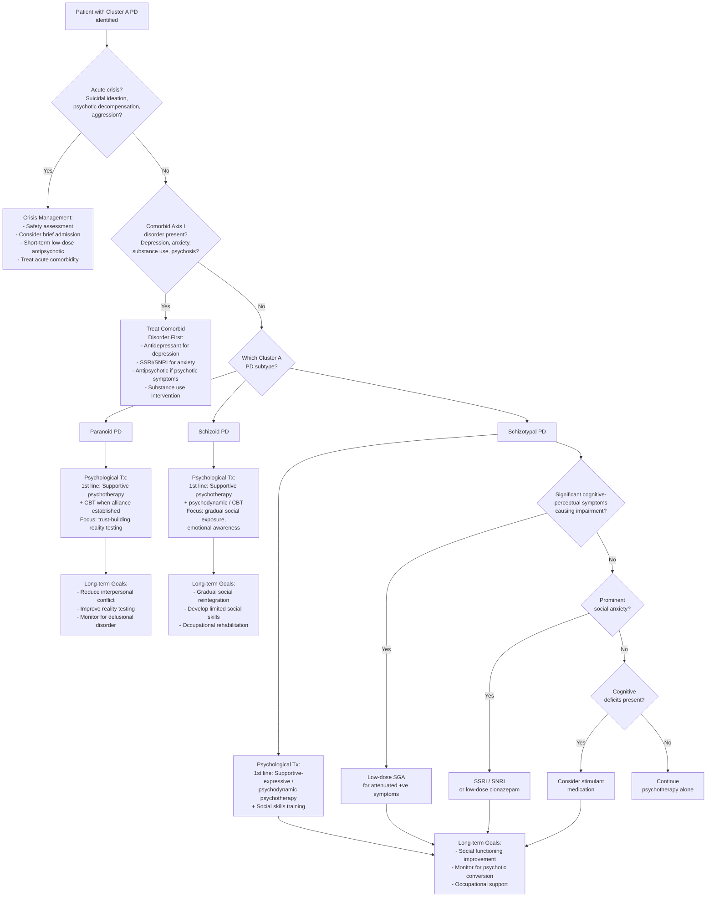

## Management of Cluster A (Odd/Eccentric) Personality Disorders

### Overarching Management Principles

Before diving into specific treatments, let's establish why managing Cluster A PDs is uniquely challenging — understanding this is essential for both exams and clinical practice.

**The fundamental paradox of Cluster A PD management:**

1. ***Patients usually do not seek help on their own*** [7] — the traits are **ego-syntonic** (felt as normal, "this is just who I am"). They ***often present at times of stress and distress as the majority tend not to regard their own personality as inherently abnormal*** [2].

2. ***Personality is an important determinant of attitude towards treatment and relationship with therapist*** [2]. The very traits that define these disorders — distrust (paranoid), detachment (schizoid), eccentricity (schizotypal) — directly sabotage the therapeutic alliance.

3. ***There is little hard evidence to support current management, mainly focusing on Cluster B*** [2]. Cluster A PDs have the weakest evidence base for treatment of all PD clusters. Most recommendations are extrapolated from expert consensus, case series, and treatment studies of related disorders (schizophrenia-spectrum, social anxiety).

4. The realistic goal is not "cure" — it is ***to seek a way of life that conflicts less with their character, often by decreasing contact with situations provoking difficulties and increasing opportunity to develop assets in their personality*** [2].

---

### Management Algorithm

---

### Treatment Modalities

#### 1. Psychological Therapies (Mainstay of Treatment)

***Psychological support is the mainstay, with multidisciplinary input*** [2]. ***Psychotherapy: psychodynamic, cognitive therapy when well-motivated and stable*** [2].

Why is psychotherapy the mainstay rather than pharmacotherapy? Because personality disorders are fundamentally disorders of **cognition, interpersonal patterns, and behavioural repertoires** — these are domains that medications cannot directly restructure. Medications can modulate neurotransmitter activity to reduce specific symptoms (anxiety, paranoia, perceptual disturbances), but they cannot teach a paranoid person to trust, a schizoid person to connect, or a schizotypal person to reality-test. That requires learning, and learning requires psychotherapy.

##### 1.1 Psychotherapy for Paranoid PD

| Modality | Approach | Why This Works (Mechanism) | Challenges |
|---|---|---|---|
| **Supportive psychotherapy** (1st line) | Non-confrontational, consistent, transparent therapeutic relationship. The therapist is reliably available, honest, and does not push too hard. | For someone whose core belief is "people will exploit me," the experience of a consistent, non-exploitative relationship is itself therapeutic — it provides corrective emotional evidence that disconfirms the paranoid schema. Over time, this may slightly expand the patient's capacity for trust. | ***Usually difficult with slow progress*** [7]. The therapist must tolerate being distrusted and tested repeatedly. Any perceived inconsistency (cancelled appointment, ambiguous comment) will be interpreted as evidence of malice. |
| **Cognitive Behavioural Therapy (CBT)** (when alliance established) | Identify and challenge paranoid automatic thoughts; explore evidence for and against persecutory beliefs; cognitive restructuring of hostile attribution bias. | Directly targets the cognitive mechanism of paranoid PD — the systematic misinterpretation of neutral stimuli as threatening. By explicitly examining the evidence, the patient can learn to generate alternative explanations for ambiguous events. | ***Depends on good therapist-client alliance*** [7] — CBT requires the patient to trust the therapist enough to share their internal thoughts. This is extraordinarily difficult for paranoid PD patients. Cannot begin CBT until a solid alliance is established through supportive work. |
| **Psychodynamic psychotherapy** | Explore childhood origins of distrust; projection as a defence mechanism (attributing one's own hostile impulses to others); transference dynamics. | The paranoid patient projects their own anger/hostility onto others ("I'm not angry at you — you're angry at me"). Psychodynamic therapy makes this projection conscious, allowing the patient to own their emotions rather than misattributing them. | Very long-term; requires highly skilled therapist; dropout rates are high. |

<Callout title="The Therapeutic Alliance Challenge in Paranoid PD" type="error">
***Patients with paranoid PD usually do not seek help on their own and often discontinue therapy*** [7]. The distrust that defines their disorder is directed at the therapist. Strategies to mitigate this:
- Be **transparent** — explain everything you are doing and why (no hidden agendas).
- Be **consistent** — same time, same place, predictable behaviour.
- Do **not** confront the paranoid beliefs directly in early sessions — this is perceived as an attack. Instead, validate the underlying emotion ("It sounds like you feel unsafe") before gently exploring alternative explanations.
- Avoid being overly warm or friendly — paradoxically, this can trigger suspicion ("Why are you being so nice? What do you want?").
</Callout>

##### 1.2 Psychotherapy for Schizoid PD

| Modality | Approach | Why This Works | Challenges |
|---|---|---|---|
| **Supportive psychotherapy** (1st line) | Low-pressure, patient-led sessions. Respect the patient's need for distance. Do not force emotional engagement. | The schizoid patient's inner world is often richer than it appears — they may have complex fantasy lives and intellectual interests. Supportive therapy provides a safe, non-demanding interpersonal space where the patient can gradually practise relating to another person, at their own pace. | ***Patients rarely seek help and often drop out*** [7]. They ***tend to intellectualize problems and question the value of treatment*** [7] — since they don't experience distress from their isolation, they see no reason for therapy. |
| **Psychodynamic psychotherapy** | Explore the developmental origins of emotional detachment; early avoidant attachment patterns; the "schizoid dilemma" (desire for contact vs fear of engulfment). | Some theorists (e.g., Fairbairn, Guntrip) argue that schizoid individuals do have a deep, unconscious longing for connection but have learned to suppress it due to early experiences of emotional neglect. Psychodynamic therapy attempts to access this buried longing. | Extremely long-term; requires a therapist comfortable with silence and apparent lack of engagement. |
| **CBT** | Behavioural activation; gradual hierarchical exposure to social situations; identifying and challenging beliefs about the "uselessness" of relationships. | Directly targets the behavioural withdrawal and cognitive beliefs ("relationships are pointless") that maintain the schizoid pattern. | Limited motivation for change makes behavioural assignments difficult. |
| **Group therapy** | Exposure to structured social interaction in a safe environment. | Provides a "practice ground" for interpersonal skills that the patient otherwise never exercises. However, must be a *well-structured* group with clear boundaries — the schizoid patient will withdraw from chaotic or emotionally intense group dynamics. | Extremely difficult to get the patient to attend; dropout rates are very high. |

##### 1.3 Psychotherapy for Schizotypal PD

| Modality | Approach | Why This Works | Challenges |
|---|---|---|---|
| ***Psychodynamically-informed, supportive-expressive psychotherapy*** [7] (1st line) | Combine supportive elements (consistent, non-judgmental relationship) with expressive elements (exploring the meaning of odd beliefs and perceptual experiences). | The supportive component provides stability and safety; the expressive component helps the patient understand that their experiences (ideas of reference, magical thinking) are products of their own mind rather than external reality. This improves reality-testing without dismissing the patient's subjective experience. | The therapist must walk a fine line between validating the patient's experience ("I understand that feels very real to you") and not reinforcing delusional-like thinking. |
| **Social skills training** | Structured teaching of interpersonal skills: eye contact, conversation, reading social cues, appropriate self-disclosure. | ***Social anomalies (chronic social anxiety, few close relationships)*** [7] are not purely cognitive — the schizotypal patient also lacks the practical skills of social interaction because they have never developed them. Skills training addresses this behavioural deficit directly. | Generalization from the training setting to real life can be limited. |
| **CBT** | Challenge cognitive distortions (ideas of reference, magical thinking); reality-testing exercises; behavioural experiments. | Directly targets the cognitive-perceptual distortions that are the hallmark of schizotypal PD. For example: "You felt that the TV was sending you a message. What evidence supports this? What evidence contradicts it?" | Requires sufficient insight and motivation; may not be appropriate for patients with very prominent perceptual disturbances. |

---

#### 2. Pharmacological Treatment

***Drugs: as adjunct only to treat comorbid psychiatric disorders*** [2]. This is the key principle — there is **no medication that treats personality disorder itself**. Medications target specific symptom dimensions or comorbid conditions.

##### 2.1 Pharmacotherapy for Paranoid PD

| Indication | Agent | Mechanism / Rationale | Notes |
|---|---|---|---|
| **Comorbid depression** | SSRI (e.g., sertraline, fluoxetine) | Serotonergic modulation → improve mood, reduce ruminatory anger | First-line for comorbid depression; avoid TCAs (anticholinergic side effects may worsen paranoia via confusion/delirium) |
| **Comorbid anxiety** | SSRI/SNRI | Serotonergic/noradrenergic anxiolysis | Preferred over benzodiazepines (risk of dependence; disinhibition may worsen aggression) |
| **Severe paranoid ideation approaching delusional intensity** | Low-dose antipsychotic (e.g., risperidone 0.5–2 mg, aripiprazole 2–5 mg) | D2 blockade in mesolimbic pathway → reduce paranoid ideation | Use lowest effective dose; monitor for metabolic side effects; patient likely to be non-adherent due to distrust of medication ("Are you trying to poison me?") |
| **Acute agitation / aggression** | Short-term low-dose antipsychotic or short-term benzodiazepine | Rapid tranquilization if needed for safety | Crisis management only; not for long-term use |

<Callout title="Prescribing to Paranoid Patients" type="error">
Paranoid PD patients are among the most difficult to medicate. They may:
- Refuse medication due to belief it is "poison" or a means of control
- Not take it as prescribed (covert non-adherence)
- Misattribute side effects to deliberate harm ("You gave me that pill and now I have a headache — you're trying to hurt me")

**Approach**: Be completely transparent about what the medication is, what it does, what side effects to expect, and why you are prescribing it. Offer the patient choice and control where possible. Start with very low doses. ***Depends on good therapist-client alliance*** [7].
</Callout>

##### 2.2 Pharmacotherapy for Schizoid PD

| Indication | Agent | Mechanism / Rationale | Notes |
|---|---|---|---|
| **Comorbid depression** | SSRI | Serotonergic modulation → improve mood | Schizoid patients may develop depression without recognizing it (alexithymia); treat if suspected |
| **Anhedonia** | Bupropion (noradrenergic/dopaminergic) | Dopaminergic augmentation may improve motivation and pleasure | Theoretical rationale based on mesocortical DA hypoactivity underlying anhedonia; limited evidence |
| **Comorbid social anxiety** | SSRI/SNRI | Anxiolysis | Relevant only if the patient experiences anxiety (many schizoid patients do not) |

**Key point**: There is essentially no pharmacological treatment for the core features of schizoid PD (emotional coldness, social indifference). No medication can make someone want social contact if the reward circuitry is fundamentally hypoactive. Medication is purely for comorbid conditions.

##### 2.3 Pharmacotherapy for Schizotypal PD

Schizotypal PD has the strongest evidence for pharmacological intervention among Cluster A PDs, precisely because it sits on the schizophrenia spectrum and shares neurobiological mechanisms amenable to psychopharmacological modulation.

| Indication | Agent | Mechanism / Rationale | Evidence/Notes |
|---|---|---|---|
| ***Cognitive-perceptual symptoms with significant impairment or distress (ideas of reference, magical thinking, paranoid ideation, unusual perceptual experiences)*** | ***Low-dose second-generation antipsychotic (SGA)*** [7] (e.g., risperidone 0.5–2 mg, aripiprazole 2–5 mg, olanzapine 2.5–5 mg) | D2 blockade in mesolimbic pathway → reduce aberrant salience → ↓ideas of reference, paranoid ideation. 5-HT2A blockade → ↓perceptual distortions. "Low-dose" because symptoms are *attenuated*, not full-blown psychotic — you do not need full antipsychotic doses. | ***Consider low-dose SGA for cognitive-perceptual symptoms with significant impairment or distress*** [7]. This is the most evidence-supported pharmacotherapy for any Cluster A PD. Monitor metabolic profile (weight, glucose, lipids), prolactin, QTc. |
| ***Prominent social anxiety*** | ***SSRI, SNRI, or regular low-dose clonazepam*** [7] | SSRIs/SNRIs: serotonergic modulation → ↓anxiety, particularly useful for the chronic, pervasive social anxiety of schizotypal PD that does not diminish with familiarity. Clonazepam: GABAergic enhancement → anxiolysis; the "regular" use (scheduled, not PRN) distinguishes this from rescue benzodiazepine use. | ***Consider regular clonazepam, SSRI, SNRI for prominent social anxiety*** [7]. Clonazepam is preferred over other benzodiazepines for social anxiety because of its longer half-life (18–50 hours) and more stable anxiolytic effect. However, dependence risk must be weighed, especially in patients with comorbid substance use. |
| ***Cognitive deficits*** | ***Stimulant medication*** [7] (e.g., methylphenidate, dextroamphetamine) | Dopaminergic/noradrenergic enhancement in prefrontal cortex → improved executive function, attention, processing speed. ***Schizotypal PD may have some degree of cognitive deficits*** [7] related to mesocortical DA hypoactivity. | ***Consider stimulant for cognitive deficits*** [7]. Use with caution — stimulants increase dopaminergic transmission, which theoretically could worsen paranoid ideation or precipitate psychotic symptoms in vulnerable individuals. Close monitoring required. |
| **Comorbid depression** | SSRI/SNRI | Serotonergic modulation | ***Mood/anxiety disorder often the reason for seeking help*** [2] |
| **Monitoring for psychotic conversion** | Antipsychotic (if conversion occurs) | If patient transitions from attenuated to frank psychotic symptoms, full antipsychotic treatment as per schizophrenia guidelines is indicated | ***10–20% develop schizophrenia or schizoaffective disorder*** [7] — regular clinical monitoring is essential |

---

#### 3. Social Interventions and Rehabilitation

***Management aim: seek a way of life that conflicts less with their character, often by ↓contact with situations provoking difficulties and ↑opportunity to develop assets in their personality*** [2].

| Intervention | Applicable To | Rationale |
|---|---|---|
| **Occupational therapy and vocational rehabilitation** | All Cluster A PDs | Many patients can function in structured, low-social-demand environments. Match the patient to an occupation compatible with their traits: paranoid PD → roles with clear rules and minimal ambiguity; schizoid PD → solitary roles (data entry, research, night work); schizotypal PD → creative or structured roles with limited social complexity. |
| **Supported housing** | Severe cases, especially schizoid and schizotypal PD | Social isolation can lead to progressive marginalization and homelessness. Supported housing provides a structured living environment without demanding intense social interaction. |
| **Case management / community psychiatric nurse follow-up** | Schizotypal PD especially | Regular monitoring for psychotic conversion; medication adherence support; crisis intervention. |
| **Psychoeducation for family** | All Cluster A PDs | Family members often do not understand why their relative is "so suspicious" (paranoid), "so cold" (schizoid), or "so weird" (schizotypal). Psychoeducation helps families develop realistic expectations and supportive communication strategies. |
| **Social skills groups** | Schizotypal PD primarily | Structured group setting to practise interpersonal skills; less threatening than unstructured social situations. |

---

#### 4. Management Summary by Subtype

| | Paranoid PD | Schizoid PD | Schizotypal PD |
|---|---|---|---|
| **1st line** | ***Supportive psychotherapy → CBT when alliance formed*** [7][2] | ***Supportive psychotherapy + psychodynamic/CBT*** [7][2] | ***Supportive-expressive psychodynamic psychotherapy + social skills training*** [7] |
| **Pharmacotherapy** | ***Drugs as adjunct only*** [2]: SSRI for comorbid depression/anxiety; low-dose antipsychotic if paranoia near-delusional | ***Drugs as adjunct only*** [2]: SSRI for comorbid depression | ***Low-dose SGA for cognitive-perceptual symptoms; SSRI/SNRI/clonazepam for social anxiety; stimulant for cognitive deficits*** [7] |
| **Social** | Occupational rehabilitation; psychoeducation | Occupational rehabilitation (low-demand roles); supported housing | Social skills groups; case management; vocational rehab; monitor for psychosis conversion |
| **Prognosis** | ***Usually difficult with slow progress*** [7]; ***prone to develop delusional disorder or even psychosis*** [7] | ***Usually difficult with slow progress*** [7]; rarely seek help; often drop out | Better pharmacological response than other Cluster A PDs; ***10–20% develop schizophrenia or schizoaffective disorder*** [7] |
| **Engagement challenge** | ***Do not seek help on their own; often discontinue therapy*** [7] | ***Rarely seek help; often drop out; tend to intellectualize and question value of treatment*** [7] | May present for comorbid mood/anxiety; more amenable to treatment than paranoid/schizoid |

---

#### 5. Contraindications and Cautions

| Treatment | Contraindication / Caution | Rationale |
|---|---|---|
| **Confrontational psychotherapy** | Contraindicated in paranoid PD (especially early treatment) | Direct confrontation of paranoid beliefs is perceived as an attack → therapeutic rupture → dropout. The paranoid schema is **self-protective** — threatening it triggers a defensive escalation. |
| **Intensive group therapy** | Relative contraindication in paranoid PD; caution in schizoid PD | Paranoid PD: the patient will perceive other group members as potential threats. Schizoid PD: the emotional intensity is overwhelming and the patient will withdraw. Exception: well-structured social skills groups for schizotypal PD. |
| **Benzodiazepines (long-term)** | Caution in all Cluster A PDs, especially with comorbid substance use | Risk of dependence; disinhibition may worsen aggression in paranoid PD. ***Regular clonazepam*** [7] is an exception for schizotypal PD social anxiety, but must weigh dependence risk. |
| **Stimulants** | Caution in schizotypal PD | ***Stimulants increase dopaminergic transmission*** → theoretical risk of worsening paranoid ideation or precipitating psychotic symptoms. Close monitoring required [7]. |
| **Antipsychotics (high dose)** | Avoid full antipsychotic doses for Cluster A PDs (unless frank psychosis develops) | Symptoms are *attenuated*, not psychotic — full doses cause unnecessary side effects (metabolic syndrome, tardive dyskinesia, sedation) without proportional benefit. ***Consider LOW-dose SGA*** [7]. |
| **TCAs (tricyclic antidepressants)** | Caution in paranoid PD | Anticholinergic effects (dry mouth, blurred vision, constipation, confusion) may be misinterpreted as deliberate poisoning by the paranoid patient; also lethal in overdose (risk if comorbid depression with suicidal ideation). |
| **Forced/coercive treatment** | Contraindicated unless imminent danger | Coercion reinforces the paranoid schema ("the system is out to get me") and destroys therapeutic trust. Involuntary treatment only if meeting criteria under the Mental Health Ordinance (Hong Kong Cap. 136). |

---

#### 6. Treatment of Comorbid Conditions

***Assessment should cover any comorbid psychiatric illness*** [2]. Treatment of comorbidities is often the primary clinical task, since patients rarely present for the personality disorder itself.

| Comorbidity | Treatment | Notes |
|---|---|---|
| **Major depression** | SSRI (1st line); CBT for depression if engagement possible | Common in paranoid PD (chronic anger/rumination → depressive episodes) and schizotypal PD (***mood/anxiety disorder often reason for seeking help*** [2]) |
| **Anxiety disorders** | SSRI/SNRI (1st line); CBT with exposure elements | Social anxiety is a core feature of schizotypal PD; generalized anxiety common in paranoid PD |
| **Substance use disorders** | Motivational interviewing; structured substance use programs | Alcohol and cannabis particularly common; substance use may exacerbate paranoid and perceptual symptoms |
| **Psychotic conversion** (schizotypal PD → schizophrenia) | Full antipsychotic treatment as per schizophrenia guidelines | ***10–20% of schizotypal PD patients develop schizophrenia or schizoaffective disorder*** [7]. Early intervention is critical. |
| **Suicidal crisis** | Standard crisis management: safety planning, risk assessment, consider brief admission, treat underlying mood disorder | Risk present across all Cluster A PDs, highest in schizotypal PD with comorbid depression |

---

<Callout title="High Yield Summary — Management">

1. ***Psychological support is the mainstay*** [2] for all Cluster A PDs. ***Psychotherapy: psychodynamic, cognitive therapy when well-motivated and stable*** [2].

2. ***Drugs are adjunct only to treat comorbid psychiatric disorders*** [2] — no medication treats personality disorder itself.

3. ***Management aim: seek a way of life that conflicts less with their character*** [2] — realistic goals, not "cure."

4. **Paranoid PD**: Supportive psychotherapy → CBT when alliance formed. ***Usually difficult with slow progress; patients often discontinue therapy*** [7]. ***Prone to develop delusional disorder or psychosis*** [7].

5. **Schizoid PD**: Supportive + psychodynamic/CBT. ***Rarely seek help; tend to intellectualize and question value of treatment*** [7].

6. **Schizotypal PD**: ***Psychodynamically-informed supportive-expressive psychotherapy*** [7] + social skills training. Pharmacotherapy has strongest evidence: ***low-dose SGA for cognitive-perceptual symptoms; SSRI/SNRI/regular clonazepam for social anxiety; stimulant for cognitive deficits*** [7].

7. ***10–20% of schizotypal PD patients develop schizophrenia*** [7] — regular monitoring for psychotic conversion is essential.

8. ***Little hard evidence to support current management, mainly focusing on Cluster B*** [2] — most Cluster A treatment is expert consensus.

9. Key contraindications: confrontational therapy in paranoid PD, high-dose antipsychotics, forced treatment, long-term benzodiazepines without clear indication.

</Callout>

---

<ActiveRecallQuiz
  title="Active Recall - Management of Cluster A PDs"
  items={[
    {
      question: "What is the mainstay of treatment for Cluster A PDs, and why are medications not first-line for the core personality features?",
      markscheme: "Psychological support/psychotherapy is the mainstay. Drugs are adjunct only for comorbid psychiatric disorders. Medications cannot restructure cognitive schemas, interpersonal patterns, or behavioural repertoires that define personality disorders — these require learning through psychotherapy. No medication treats personality disorder itself. There is also little hard evidence supporting pharmacotherapy for Cluster A PDs specifically.",
    },
    {
      question: "A patient with schizotypal PD has prominent ideas of reference and magical thinking causing significant functional impairment. What pharmacological treatment would you consider, at what dose range, and why?",
      markscheme: "Low-dose second-generation antipsychotic (e.g., risperidone 0.5-2mg, aripiprazole 2-5mg). Mechanism: D2 blockade in mesolimbic pathway reduces aberrant salience (ideas of reference), 5-HT2A blockade reduces perceptual distortions. Low-dose because symptoms are attenuated (not full psychosis) — full doses cause unnecessary metabolic and neurological side effects. Must monitor metabolic profile, prolactin, QTc.",
    },
    {
      question: "Name three pharmacological options for managing prominent social anxiety in schizotypal PD and explain the rationale for each.",
      markscheme: "1) SSRI: serotonergic modulation reduces chronic social anxiety; well-tolerated first-line. 2) SNRI: serotonergic plus noradrenergic anxiolysis for more refractory cases. 3) Regular (scheduled) low-dose clonazepam: GABAergic enhancement provides stable anxiolysis; preferred over other benzodiazepines due to longer half-life (18-50h) giving more stable effect. Caution: dependence risk with clonazepam, especially if comorbid substance use.",
    },
    {
      question: "Why is confrontational psychotherapy contraindicated in early treatment of paranoid PD?",
      markscheme: "The paranoid schema ('people will exploit me') is self-protective. Direct confrontation of paranoid beliefs is perceived as an attack on the patient's self-protective system, triggering defensive escalation, therapeutic rupture, and dropout. Instead, begin with supportive psychotherapy (consistent, transparent, non-confrontational) to build therapeutic alliance; only introduce cognitive challenging of beliefs (CBT) once trust is established. Patients usually do not seek help on their own and often discontinue therapy.",
    },
    {
      question: "What is the realistic management aim for Cluster A PDs, and what proportion of schizotypal PD patients progress to schizophrenia?",
      markscheme: "Aim: seek a way of life that conflicts less with their character, by decreasing contact with situations provoking difficulties and increasing opportunity to develop assets in their personality. Not 'cure' but adaptation and harm reduction. 10-20% of schizotypal PD patients develop schizophrenia or schizoaffective disorder, making regular clinical monitoring for psychotic conversion essential.",
    },
  ]}
/>

---

## References

[1] Lecture slides: GC 170. Schizophrenia and related psychoses.pdf (p22)
[2] Senior notes: ryanho-psych.md (sections 10.1–10.2, management principles pp. 238–239)
[7] Senior notes: ryanho-psych.md (Cluster A PD management/prognosis details pp. 239–240, schizotypal PD pharmacotherapy)
