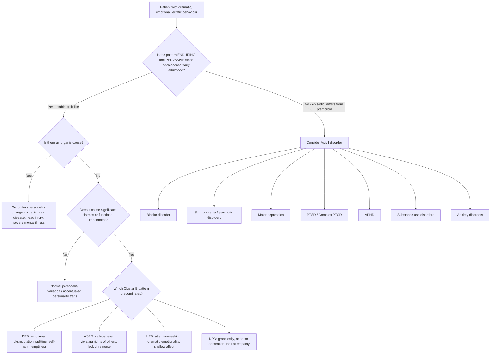

## Differential Diagnosis of Cluster B Personality Disorders

The differential diagnosis of Cluster B personality disorders is one of the most challenging areas in clinical psychiatry. The reason is twofold: (1) Cluster B features **overlap substantially** with several Axis I psychiatric disorders, and (2) Cluster B PDs frequently **co-occur** with these same disorders, meaning the answer is often "both" rather than "either/or." The clinical task is to determine what is **trait** (enduring, pervasive personality pattern present since adolescence/early adulthood) versus **state** (an episodic psychiatric illness that differs from the premorbid baseline) [2].

> Remember the fundamental principle: personality behaviours are *present through adult life* vs psychiatric disorder behaviours *differ from premorbid state* [2]. This is your anchor for every differential.

---

### Organising Framework for Differential Diagnosis

The differentials can be organised into four tiers:

1. **Within Cluster B** — distinguishing one Cluster B PD from another (and from other PD clusters)
2. **Axis I psychiatric disorders** — the major mimics (bipolar, schizophrenia, depression, anxiety, PTSD, ADHD, substance use)
3. **Organic/medical causes** — "secondary personality change"
4. **Normal personality variation** — when does a personality trait become a disorder?

---

### Tier 1: Differentiating Within Cluster B

This is conceptually important because there is **considerable overlap** between Cluster B disorders — clinicians often agree a PD is present but disagree on subtype [2]. The table below distils the core distinguishing features:

| Feature | BPD | ASPD | HPD | NPD |
|---------|-----|------|-----|-----|
| **Central disturbance** | Emotional dysregulation, fear of abandonment | Callous disregard for others' rights | Need for attention | Need for admiration, grandiosity |
| **Emotional quality** | Intense, rapidly shifting, deeply felt | Shallow, constricted (low emotional range) | Dramatic but **shallow** and labile | Rage or depression when challenged; otherwise controlled |
| **Interpersonal pattern** | Chaotic — idealisation ↔ devaluation (splitting) | Exploitative — uses others instrumentally, **no genuine attachment** | Seductive — uses charm and sexuality to gain attention | Entitled — others exist as "narcissistic supply" |
| **Empathy** | Present but overwhelmed by own distress | **Absent** (cannot feel others' pain) | Variable — more self-focused than truly empathic | **Cognitively intact** but affectively absent (can read emotions but doesn't care) |
| **Self-harm / Suicide** | **Very common** (10% mortality), often emotion-regulatory | Reckless behaviour leading to harm (but not typically deliberate self-cutting) | Demonstrative gestures (emotional blackmail) [2] | Risk during **narcissistic crisis** (shattering of grandiose self-image) |
| **Guilt / Remorse** | Excessive, inappropriate guilt (especially after interpersonal conflict) | ***Striking lack of guilt or remorse*** [2] | Variable | Shame rather than guilt (narcissistic injury → shame spiral) |
| **Childhood precursor** | Abuse, neglect, disorganised attachment | ***Conduct disorder before age 15*** (required) [2] | Few specific precursors identified | Overvaluation + frustration/rejection by parents [2] |
| **Gender pattern** | Equal in community (clinical bias towards F) | M:F = 3:1 [2] | ~65% F [2] | M > F [2] |

<Callout title="Overlap Between BPD and ASPD" type="error">
BPD and ASPD share **impulsivity** and **interpersonal dysfunction**, and they frequently co-occur. The critical distinction: in BPD, harmful behaviour is predominantly **self-directed** (self-harm, suicidality) and driven by emotional pain; in ASPD, harmful behaviour is predominantly **other-directed** (violence, exploitation) and driven by callous indifference. A patient can meet criteria for both — this is common in forensic populations and carries a particularly poor prognosis.
</Callout>

### Tier 1b: Differentiating From Other PD Clusters

| PD Cluster | Key Differentiating Features from Cluster B |
|------------|-------------------------------------------|
| **Cluster A (Odd/Eccentric)** — Paranoid, Schizoid, Schizotypal | Social withdrawal is **preferred** (schizoid) or driven by **suspicion/eccentricity** (paranoid, schizotypal), NOT by fear of abandonment or need for attention. Emotional range is **constricted** or **flat** (vs. dramatic/labile in Cluster B). Schizotypal has **magical thinking, ideas of reference, perceptual disturbances** [1][2] |
| **Cluster C (Anxious/Fearful)** — Avoidant, Dependent, Anankastic | ***Separation or abandonment → borderline, dependent personality disorder*** [3]; ***Being rejected or inadequate → avoidant personality disorder*** [3]. **Dependent PD vs BPD**: both fear abandonment, but dependent PD responds with **submissive clinging** while BPD responds with **rage, splitting, and self-harm**. **Avoidant PD vs HPD**: both have interpersonal insecurity, but avoidant PD **withdraws** while HPD **demands attention** |

---

### Tier 2: Differentiating From Axis I Psychiatric Disorders

This is the highest-yield area for exams. The key differentials are:

#### A. Bipolar Disorder vs BPD

This is the **single most important differential** in Cluster B. It is tested repeatedly because the two conditions share mood instability, impulsivity, and suicidality — yet require fundamentally different treatments.

***Bipolar spectrum: bothered by frequent mood changes, can be mistaken as borderline personality disorder*** [4]

***Misdiagnosis is very common → correct diagnosis and treatment was often delayed by 5-7 years on average*** [4]

| Feature | BPD | Bipolar Disorder |
|---------|-----|-----------------|
| **Duration of mood shifts** | ***Rapid shifts of mood (e.g. over hours and days)*** [2][3] | Episodes last **days to weeks** (hypomania ≥4 days; mania ≥1 week; depression ≥2 weeks) |
| **Trigger** | ***Mood disturbances often triggered by interpersonal issues*** [2] | Episodes may be **spontaneous** or triggered by stress, but are not consistently interpersonal |
| **Quality of elevated mood** | Irritability, anger, anxiety, emptiness — ***no classic symptoms of mania, e.g. ↑energy, grandiosity*** [2] | **Euphoria, grandiosity, ↑energy, ↓need for sleep, pressured speech, flight of ideas** |
| **Interpersonal pattern** | Chaotic relationships with splitting (idealisation ↔ devaluation) | Not a core feature — relationships disrupted *during* episodes but pattern is not splitting |
| **Identity disturbance** | Core feature | Not present |
| **Self-harm** | Repetitive, deliberate, emotion-regulatory | Less common as deliberate self-harm; impulsive risky behaviour during mania |
| **Family history** | ***No FHx of BAD*** (typically) [2] | Often **positive FHx of bipolar disorder** |
| **Course** | ***Tends to involve more stable and enduring behaviour pattern*** (trait-like) [3][5] | ***Episodic*** — clear episodes separated by periods of relative euthymia [3][5] |
| **Treatment response** | Psychotherapy (DBT, MBT) | Mood stabilisers (lithium, valproate), atypical antipsychotics |

<Callout title="BPD + Bipolar Comorbidity" type="idea">
These conditions can and do **co-occur** — approximately 10-20% of BPD patients also meet criteria for bipolar II. When they co-occur, both diagnoses should be made. The clue is when a patient has *both* enduring personality traits (splitting, identity disturbance, abandonment fears) *and* discrete episodes of sustained mood elevation with biological features (decreased need for sleep, grandiosity, increased energy lasting days). Treat both — mood stabiliser for bipolar + psychotherapy for BPD.
</Callout>

#### B. Schizophrenia and Psychotic Disorders vs Cluster B PDs

Several Cluster B features can mimic psychosis:
- BPD: ***transient paranoid ideation, pseudohallucinations, dissociation*** [1][2]
- NPD: grandiose beliefs can resemble grandiose delusions
- ASPD: can present with an ***irritable, exploitative, violent*** presentation resembling an agitated psychotic state [2]

| Feature | BPD (Transient Psychotic Symptoms) | Schizophrenia |
|---------|-----------------------------------|---------------|
| **Duration** | **Transient** (hours to days), stress-related | **Sustained** (≥1 month of active symptoms for DSM-5) |
| **Insight** | Usually **partially retained** — recognises pseudohallucinations as internal | Often **lost** — believes hallucinations are real, external |
| **Trigger** | **Interpersonal stress** | May be spontaneous; stressors are not consistently interpersonal |
| **Negative symptoms** | **Absent** | ***May have catatonia or negative symptoms*** [5] |
| **Formal thought disorder** | Absent or mild (vague, circumstantial under stress) | ***More associated with loosening of association, neologism, thought blocking*** [5] |
| **Delusions** | Transient paranoid ideas, not systematised | ***Mood-incongruent, bizarre, delusion of passivity/thought alienation*** [5] |
| **Affect** | Labile, intense, reactive | Flat, incongruent, or blunted |
| **Course** | Chronic interpersonal dysfunction with episodic micropsychotic symptoms | Episodic psychotic relapses with progressive functional decline |

***Personality or neurodevelopmental disorders, e.g. ADHD, borderline personality disorder — may have features similar to hypomania, e.g. impulsivity, temper, mood lability — tends to involve more stable and enduring behaviour pattern (cf episodic in mania)*** [5]

<Callout title="Schizoaffective Disorder Overlap">
***Schizoaffective disorder involves concurrent schizophrenic and mood symptoms that are equally prominent*** [6]. This can overlap with BPD presentations where mood instability co-occurs with transient psychotic features. The key: in schizoaffective disorder, psychotic symptoms **persist outside of mood episodes** and meet full criteria for schizophrenia; in BPD, psychotic symptoms are **always brief and stress-related**.
</Callout>

#### C. Major Depressive Disorder vs Cluster B PDs

| Feature | BPD "Depression" | Major Depressive Disorder |
|---------|-----------------|--------------------------|
| **Quality** | Chronic **emptiness**, anger, abandonment distress | Pervasive low mood, anhedonia, guilt, worthlessness |
| **Duration** | Fluctuating, reactive (hours) | **Sustained** (≥2 weeks, typically weeks-months) |
| **Biological features** | Usually absent | Diurnal variation, early morning wakening, psychomotor retardation, weight loss |
| **Trigger** | Almost always **interpersonal** | Variable — may be spontaneous or follow life events |
| **Self-harm** | Chronic, repetitive, emotion-regulatory | Suicidal ideation in context of hopelessness (less commonly repetitive cutting) |
| **Response to treatment** | Antidepressants alone are **ineffective** for BPD | Antidepressants are first-line |

- NPD patients often present with depression — ***associated with depression (20.6%)*** [2] — typically triggered by **narcissistic injury** (loss of status, relationship breakdown, ageing). This depression has a distinct quality of **humiliation and rage** rather than classic sadness.

#### D. PTSD / Complex PTSD vs BPD

This is an increasingly important differential, especially as the ICD-11 introduced **Complex PTSD** (C-PTSD) as a distinct diagnosis.

| Feature | BPD | C-PTSD |
|---------|-----|--------|
| **Trauma history** | Common (~70-80%) but not required for diagnosis | **Required** — must have experienced prolonged/repeated trauma |
| **Re-experiencing symptoms** | Absent (may have flashback-like dissociation but no structured re-experiencing) | **Core feature** — intrusive memories, flashbacks, nightmares |
| **Avoidance** | Avoidance of abandonment, not of trauma reminders per se | **Avoidance of trauma reminders** |
| **Hyperarousal** | Emotional hyperreactivity to interpersonal cues | **Generalised hyperarousal** (hypervigilance, startle) |
| **Self-concept** | Unstable identity, fluctuating | **Persistently negative** self-concept (shame, defeat, worthlessness) |
| **Affect regulation** | Core feature — intense, reactive | Disturbances in self-organisation (DSO) — similar but with persistent emotional numbing |
| **Relationships** | Chaotic, splitting | Difficulties sustaining relationships, feeling distant from others |

> Some researchers argue BPD should be reconceptualised as a complex trauma spectrum disorder. In practice, many patients meet criteria for both. The key is: C-PTSD has structured **re-experiencing and avoidance of trauma reminders** as core features; BPD has **splitting, identity disturbance, and abandonment fears** as core features.

#### E. ADHD vs Cluster B PDs (especially ASPD and BPD)

***Attention deficit and hyperactivity disorder*** is a differential for manic episodes and, by extension, for Cluster B features [4].

| Feature | Cluster B PDs | ADHD |
|---------|--------------|------|
| **Onset** | Personality traits recognisable from adolescence/early adulthood | Symptoms present from **childhood** (before age 12) |
| **Course** | Enduring but may fluctuate with interpersonal stressors | ***Usually more chronic (trait-like) than episodic*** [2] |
| **Core features** | Emotional dysregulation, interpersonal dysfunction, identity issues | ***↓attention, difficulty with task completion, ↑energy and disinhibited behaviour*** [2] |
| **Self-esteem** | BPD: unstable; NPD: fragile grandiosity | Variable — often low due to chronic academic/social failure |
| **Distinguishing features** | BPD: splitting, self-harm, abandonment fears; ASPD: callousness, lack of remorse | ***Should not have ↑self-esteem, grandiosity, flight of ideas, ↓need of sleep*** [2] |
| **Empathy** | Variable across Cluster B | **Intact** (may have poor social awareness but not callous) |

<Callout title="ADHD + BPD Comorbidity">
ADHD and BPD frequently co-occur (~15-25% comorbidity). Both share emotional dysregulation and impulsivity. When comorbid, ADHD should be treated first (stimulants) as this can improve the emotional dysregulation component, making psychotherapy for BPD more effective.
</Callout>

#### F. Substance Use Disorders vs Cluster B PDs

| Feature | Substance-induced behaviour | Cluster B PD |
|---------|---------------------------|--------------|
| **Temporal relationship** | Behaviour **emerges during intoxication/withdrawal** and **resolves with sustained abstinence** | Behaviour is **pervasive and present regardless of substance use** |
| **Pattern** | Variable depending on substance used | Consistent pattern across multiple life domains |
| **Assessment strategy** | **Re-evaluate personality after period of sobriety** (usually ≥6 months) — substance use can mimic every Cluster B feature | Obtain **collateral history** about premorbid personality before substance use onset |

- ***Substance abuse (84%)*** comorbidity in ASPD [2]; ***substance abuse (64.2%)*** in NPD [2]. When comorbidity exists, **both diagnoses should be made**.
- Intoxication with stimulants (amphetamines, cocaine) can mimic grandiosity (NPD-like), impulsivity and risk-taking (ASPD-like), and emotional lability (BPD-like)
- Alcohol withdrawal can cause irritability, anxiety, and emotional instability mimicking BPD

#### G. Other Differentials

| Differential | Key Distinguishing Features |
|-------------|---------------------------|
| **Adjustment disorder** | ***Some personality features may be associated with vulnerability to situational distress that may resemble an adjustment disorder. It is important to understand the lifetime history of personality functioning*** [3]. Adjustment disorder develops ≤3 months of a specific stressor and resolves within 6 months of stressor cessation — it is a **time-limited reaction**, not an enduring pattern |
| ***Personality disorder with prominent irritability*** (as differential for manic episode) [4] | When irritability is the predominant mood, personality disorders must be considered in the differential for mania. The key: ***personality disorder involves more stable and enduring behaviour*** vs ***episodic*** pattern in bipolar [4][5] |
| **"Secondary" personality change** | ***Profound and enduring change in personality during adulthood due to organic brain disease (e.g. head injury, encephalitis), severe mental disorder (especially after schizophrenia), or exceptionally severe stressful experiences*** [2]. Diagnosed when personality change is **clearly attributable** to identified organic cause and was **not present before** the insult. Particularly consider ***organic brain lesion with extreme social disinhibition with no gross mood disorder → frontal lobe pathology*** in middle-aged/older patients [2] |
| ***Avoidance features in anxiety disorders*** | ***Differential diagnosis for avoidance features includes personality disorder, psychosis, depression*** [7]. When a patient avoids social situations, consider whether this is driven by phobic anxiety (social phobia), paranoid suspicion (Cluster A / psychosis), low motivation (depression), or enduring personality style (avoidant PD or BPD avoiding perceived rejection) |

---

### Tier 3: The "State vs Trait" Principle — A Practical Approach

The single most important conceptual tool for differentiating Cluster B PDs from Axis I disorders is the **state vs trait** distinction:

| | State (Axis I Disorder) | Trait (Personality Disorder) |
|---|---|---|
| **Onset** | Identifiable onset, often in adulthood | Present since adolescence/early adulthood |
| **Course** | Episodic, with remission between episodes | **Enduring, pervasive, and stable over time** |
| **Premorbid functioning** | The patient was *different before* the episode | The patient has *always been this way* |
| **Ego-syntonic vs dystonic** | Usually **ego-dystonic** (the patient recognises something is wrong) | Often **ego-syntonic** (the patient does not see their personality as the problem — ***majority tend not to regard own personality as inherently abnormal***) [2] |
| **Treatment response** | Responds to pharmacotherapy and/or time-limited psychotherapy | Responds (slowly) to long-term structured psychotherapy; medications only for comorbidities |
| **Collateral history** | Others describe a *change* from baseline | Others describe this as *how the person has always been* |

<Callout title="The Dual Diagnosis Reality" type="idea">
In real clinical practice, the question is rarely "Is this BPD *or* depression?" — it is almost always "This patient has BPD *and* depression — how do I manage both?" Personality disorders **predispose to Axis I disorders** (as a pathoblastic factor — they *colour* the presentation) [2]. The clinical skill is recognising when an Axis I disorder is superimposed on a personality disorder, because the Axis I component is **treatable** and should not be missed.
</Callout>

---

### Summary Table: Key Differentials for Each Cluster B PD

| Cluster B PD | Main Differentials to Consider | Key Distinguishing Point |
|-------------|-------------------------------|------------------------|
| **BPD** | Bipolar II/spectrum, C-PTSD, MDD, ADHD, HPD, Dependent PD | BPD = trait-like, reactive mood shifts over hours, splitting, identity disturbance, interpersonal triggers |
| **ASPD** | Conduct disorder (precursor, not differential), Substance use disorder, BPD, NPD, frontal lobe lesion | ASPD = callous lack of concern, no remorse, requires conduct disorder before 15 |
| **HPD** | BPD, NPD, Somatic symptom disorder, Factitious disorder | HPD = shallow dramatic emotionality, attention-seeking without the self-harm/emptiness of BPD |
| **NPD** | Bipolar I (grandiose mania), HPD, ASPD, Delusional disorder (grandiose type) | NPD = fragile grandiosity dependent on external feedback, lack of empathy, chronic (not episodic like mania) |

---

<Callout title="High Yield Summary">

**Key principles for differential diagnosis of Cluster B PDs:**

1. **State vs Trait** — personality disorders are enduring and pervasive (present since adolescence); Axis I disorders are episodic with identifiable onset and premorbid baseline change

2. **BPD vs Bipolar** — the #1 exam differential: BPD has rapid (hours) reactive mood shifts triggered by interpersonal events, splitting, identity disturbance, and no classic mania features; bipolar has sustained episodes (days-weeks) with grandiosity, ↓sleep, ↑energy, often positive FHx

3. **BPD vs C-PTSD** — both involve trauma and emotional dysregulation; C-PTSD requires structured re-experiencing and avoidance of trauma reminders; BPD requires splitting, identity disturbance, abandonment fears

4. **ASPD vs BPD** — ASPD = other-directed harm with callous indifference and no remorse; BPD = self-directed harm with intense emotional suffering

5. **NPD vs Grandiose Mania** — NPD grandiosity is chronic, fragile, and reality-based (ambitious but not delusional); mania is episodic with bizarre grandiose delusions and biological features

6. **Always exclude organic causes** — frontal lobe lesions, substance intoxication/withdrawal, and secondary personality change (head injury, encephalitis)

7. **Comorbidity is the rule, not the exception** — most Cluster B patients have concurrent Axis I disorders. Diagnose and treat both.

</Callout>

---

<ActiveRecallQuiz
  title="Active Recall - Differential Diagnosis of Cluster B PDs"
  items={[
    {
      question: "A 24-year-old woman presents with mood swings, impulsivity, and suicidality. List five features that would favour BPD over Bipolar II disorder.",
      markscheme: "(1) Mood shifts last minutes-hours, not days-weeks. (2) Mood shifts are reactive to interpersonal triggers, not spontaneous. (3) Predominant emotions are anger/emptiness/anxiety, not euphoria/grandiosity. (4) Identity disturbance and splitting are present. (5) No classic mania features such as decreased need for sleep, pressured speech, or flight of ideas. Also accept: negative FHx of bipolar, chronic/enduring pattern rather than episodic.",
    },
    {
      question: "How do you distinguish transient psychotic symptoms in BPD from schizophrenia?",
      markscheme: "BPD psychotic symptoms are: (1) transient (hours-days, not sustained >=1 month), (2) stress-related (triggered by interpersonal crises), (3) partial insight retained (pseudohallucinations recognised as internal), (4) no negative symptoms, (5) no formal thought disorder (no loosening of association, neologism, thought blocking), (6) delusions are not systematised/bizarre/passivity phenomena. Schizophrenia has sustained psychosis, insight lost, formal thought disorder, negative symptoms, and mood-incongruent bizarre delusions.",
    },
    {
      question: "Explain the state vs trait distinction and why it is the most important principle in differentiating Cluster B PDs from Axis I disorders.",
      markscheme: "Trait (PD): enduring pattern present since adolescence/early adulthood, stable over time, pervasive across situations, ego-syntonic (patient does not see personality as problem). State (Axis I): identifiable onset, episodic course with remission, differs from premorbid baseline, often ego-dystonic. This matters because PDs require long-term psychotherapy while Axis I disorders respond to pharmacotherapy. Comorbidity is common so both must be identified.",
    },
    {
      question: "A 40-year-old man with no prior psychiatric history develops social disinhibition, impulsivity, and lack of concern for others after a road traffic accident. What diagnosis should you consider and why?",
      markscheme: "Secondary personality change due to organic brain disease (traumatic brain injury), specifically frontal lobe pathology. Key features: (1) new-onset personality change in adulthood, (2) clearly attributable to identified organic cause, (3) not present before the insult, (4) extreme social disinhibition with no gross mood disorder points to frontal lobe damage. This is not a primary personality disorder because the pattern was not present before the injury.",
    },
    {
      question: "How do you distinguish BPD from Complex PTSD, given both involve trauma histories and emotional dysregulation?",
      markscheme: "C-PTSD requires: (1) prolonged/repeated trauma exposure, (2) structured re-experiencing symptoms (flashbacks, intrusive memories, nightmares), (3) avoidance of trauma reminders specifically, (4) persistently negative self-concept. BPD features not in C-PTSD: (1) splitting (idealisation-devaluation), (2) unstable identity (fluctuating, not just negative), (3) frantic abandonment avoidance, (4) chronic emptiness, (5) repetitive self-harm. They can co-occur.",
    },
  ]}
/>

## References

[1] Senior notes: ryanho-psych.md (Section 10.2 — Cluster A summary table and Section 10.3 — Cluster B clinical features)
[2] Senior notes: ryanho-psych.md (Sections 10.1, 10.3 — Personality and Personality Disorders, Cluster B PDs, differential diagnosis of mania, approach to personality disorders)
[3] Senior notes: ryanho-psych.md (Sections on anxiety differential diagnosis, adjustment disorder differential, and bipolar differential diagnosis)
[4] Lecture slides: GC 163. I am a superman Bipolar disorder.pdf (p10 — Differential diagnosis of manic episode; p12 — Misdiagnosis and underdiagnosis; p17 — Bipolar spectrum and BPD)
[5] Lecture slides: GC 170. Schizophrenia and related psychoses.pdf (p22 — Schizophrenia-spectrum; personality/neurodevelopmental disorders as differential)
[6] Lecture slides: GC 170. Schizophrenia and related psychoses.pdf (p22 — Schizoaffective disorder definition)
[7] Lecture slides: GC 167. I feel very nervous Anxiety disorders.pdf (p27 — DDx for avoidance features includes personality disorder)
