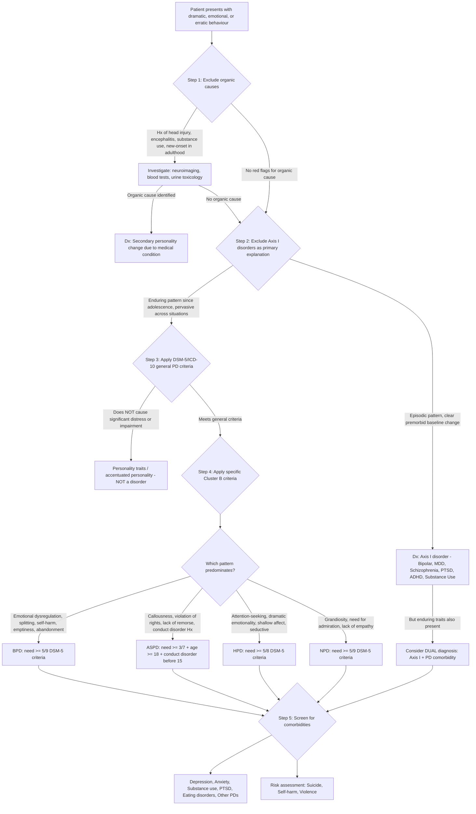

## Diagnostic Criteria, Algorithm, and Investigations for Cluster B Personality Disorders

### The Nature of Personality Disorder Diagnosis

Before diving into specific criteria, it is crucial to understand that diagnosing a personality disorder is fundamentally **different** from diagnosing most Axis I psychiatric disorders or medical conditions. There is no blood test, no imaging finding, no single pathognomonic sign. The diagnosis is **clinical** — based on a thorough longitudinal assessment of the patient's enduring patterns of thinking, feeling, relating, and behaving [2].

> Think of it this way: diagnosing pneumonia requires a snapshot (CXR, cultures, exam findings at a point in time). Diagnosing a personality disorder requires a **time-lapse film** — you need to see the pattern across years, across relationships, across life domains. A single clinical encounter is almost never sufficient.

Key diagnostic principles [2]:
- ***Presentation: often at times of stress and distress as majority tend not to regard own personality as inherently abnormal*** — patients rarely present saying "I think I have a personality disorder." They present in crisis (self-harm, relationship breakdown, substance misuse), and the personality disorder is recognised as the underlying pattern
- ***Diagnosis: clinicians often agree on presence of PD but disagree on subtype*** — this reflects the categorical model's limitations and the substantial overlap between PD types
- ***Assessment should cover: source of distress (thoughts, emotions, behaviour, relationships) to self and others; functional impairment at work, home, social circumstances; any comorbid psychiatric illness; strengths and weaknesses of individual*** [2]

---

### General Diagnostic Criteria for Personality Disorders

Both DSM-5 and ICD-10/ICD-11 require that **general criteria** for any personality disorder be met before applying specific subtype criteria. These general criteria establish that the presentation truly represents an enduring personality pattern rather than an episodic psychiatric illness.

#### DSM-5 General Criteria for Personality Disorder [2]

| Criterion | Description | Why This Criterion Exists |
|-----------|-------------|--------------------------|
| **A** | An enduring pattern of inner experience and behaviour that **deviates markedly** from the expectations of the individual's culture, manifested in **≥2 of**: (1) **Cognition** — ways of perceiving and interpreting self, others, and events; (2) **Affectivity** — range, intensity, lability, and appropriateness of emotional response; (3) **Interpersonal functioning**; (4) **Impulse control** | Ensures the disturbance is *pervasive* — not just one narrow domain. Requiring ≥2 areas prevents over-diagnosis of normal personality variation. The "cultural expectations" clause acknowledges that personality norms are culturally bound |
| **B** | The pattern is **inflexible and pervasive** across a broad range of personal and social situations | Distinguishes PD from situation-specific reactions (e.g., adjustment disorder). A person who is only difficult at work but charming at home does not have a PD |
| **C** | Leads to clinically significant **distress or impairment** in social, occupational, or other important areas of functioning | Prevents pathologising personality *traits* that don't cause problems. Many people have narcissistic or histrionic traits without meeting disorder criteria |
| **D** | The pattern is **stable and of long duration**, traceable to **adolescence or early adulthood** | The most critical criterion — distinguishes *trait* from *state*. An enduring pattern since adolescence cannot be an Axis I episode |
| **E** | Not better explained by another mental disorder | Ensures hierarchical diagnosis is considered — e.g., impulsivity during a manic episode is better explained by bipolar disorder |
| **F** | Not attributable to the physiological effects of a substance or another medical condition | Rules out secondary personality change — e.g., frontal lobe injury, substance intoxication/withdrawal |

#### ICD-10 General Criteria (F60) [2]

| Criterion | Description |
|-----------|-------------|
| **G1** | Evidence that characteristic and enduring patterns of inner experience and behaviour deviate markedly from culturally expected norms in ≥2 of: cognition, affectivity, control over impulses, ways of relating to others |
| **G2** | The deviation is manifest as **inflexible, maladaptive, or otherwise dysfunctional** behaviour across a broad range of situations |
| **G3** | There is **personal distress or adverse impact on social environment** |
| **G4** | Evidence that the deviation is **stable, of long duration**, and with onset in late childhood or adolescence |
| **G5** | The deviation **cannot be explained by** another adult mental disorder (though it may coexist) |
| **G6** | The deviation is **not due to** organic brain disease, injury, or dysfunction |

> The ICD-10 and DSM-5 general criteria are remarkably similar — both establish the same core concept: the pattern must be enduring, pervasive, cause distress/impairment, and not be better explained by something else.

<Callout title="Why Must Onset Be in Adolescence/Early Adulthood?" type="idea">
This criterion exists because personality is *formed* during childhood and adolescence through the interaction of genetics, temperament, and experience [2]. A personality disorder represents a **developmental derailment** — the personality crystallised around maladaptive patterns during the formative years. New-onset "personality change" in adulthood should prompt investigation for organic causes (head injury, brain tumour, neurodegenerative disease, substance use) or enduring personality change after catastrophic experience or psychiatric illness [2].
</Callout>

---

### Specific Diagnostic Criteria for Each Cluster B PD

#### A. Borderline Personality Disorder (DSM-5 Criteria)

A pervasive pattern of **instability of interpersonal relationships, self-image, and affects**, and marked **impulsivity**, beginning by early adulthood, as indicated by **≥5 of 9**:

| # | Criterion | Mnemonic Letter | Pathophysiological Basis |
|---|-----------|----------------|------------------------|
| 1 | ***Frantic efforts to avoid real or imagined abandonment*** [1][2] | **A** (Abandonment) | Insecure/disorganised attachment → hypervigilance to rejection cues |
| 2 | ***Unstable, intense relationships fluctuating between extremes of idealisation and devaluation*** [1][2] | **I** (Interpersonal instability) | Splitting defence mechanism — inability to integrate "good" and "bad" qualities of others |
| 3 | ***Unstable self-image / identity disturbance*** — markedly and persistently unstable sense of self [1][2] | **I** (Identity) | Failed development of coherent self through consistent caregiver mirroring |
| 4 | ***Impulsivity*** in ≥2 areas that are potentially self-damaging (***sex, binge eating, substance abuse, spending money***, reckless driving) [1][2] | **I** (Impulsivity) | ↓serotonin + ↓prefrontal inhibitory control → impulsive acts as maladaptive emotion regulation |
| 5 | ***Repetitive suicidal behaviour or self-harm*** — including gestures, threats, self-mutilating behaviour [1][2] | **S** (Suicidality/Self-harm) | Endorphin release from physical pain temporarily relieves emotional pain; also communicates distress |
| 6 | ***Fluctuations in mood*** — affective instability due to marked reactivity (e.g., intense episodic dysphoria, irritability, anxiety usually lasting a few hours) [1][2] | **M** (Mood instability) | Amygdala hyperreactivity to interpersonal stimuli → intense, rapid emotional responses |
| 7 | ***Chronic feelings of emptiness*** [1][2] | **E** (Emptiness) | Identity disturbance → pervasive void; chronic stress-induced reward circuit downregulation |
| 8 | Inappropriate, intense anger or difficulty controlling anger (e.g., frequent displays of temper, constant anger, recurrent physical fights) | **A** (Anger) | ↓serotonergic tone + amygdala hyperreactivity → low threshold for aggressive response |
| 9 | ***Transient, stress-related paranoid ideation*** or severe ***dissociative*** symptoms [1][2] | **D** (Dissociation/paranoia) | Under extreme stress, prefrontal function further deteriorates → transient psychotic-like symptoms |

> **Mnemonic for BPD criteria: "AM I SAID?"** — Abandonment fears, Mood instability, Identity disturbance, Suicidality/Self-harm, Anger, Impulsivity, Dissociation/paranoia (transient), Emptiness (chronic), unstable relationships (Devaluation/idealisation). Some use "PRAISE" or "IMPULSIVE" variants — use whichever sticks.

#### ICD-10: Emotionally Unstable Personality Disorder (F60.3) [2]

ICD-10 divides this into two subtypes:

| Subtype | Key Features |
|---------|-------------|
| **Impulsive type (F60.30)** | Emotional instability, lack of impulse control, outbursts of violence or threatening behaviour (especially in response to criticism) |
| **Borderline type (F60.31)** | All features of impulsive type PLUS disturbances of self-image, chronic emptiness, intense unstable relationships, self-harm, and frantic abandonment avoidance |

> The ICD-10 impulsive type captures patients who have the emotional dysregulation and impulsivity but *without* the identity disturbance and splitting pattern — it is essentially a less severe or incomplete BPD presentation.

---

#### B. Antisocial Personality Disorder (DSM-5 Criteria)

A pervasive pattern of **disregard for and violation of the rights of others**, occurring since **age 15**, as indicated by **≥3 of 7**:

| # | Criterion | Pathophysiological Basis |
|---|-----------|------------------------|
| 1 | ***Repeated unlawful or aggressive behaviour*** — failure to conform to social norms [1][2] | ↓prefrontal moral reasoning + ↓serotonin impulse control |
| 2 | ***Deceitfulness, lying*** — repeated lying, use of aliases, conning others for personal gain [1][2] | Instrumental behaviour — lying works because of superficial charm; ↓moral reasoning means no internal inhibition |
| 3 | ***Impulsive; takes risks without concern for safety*** — failure to plan ahead [2] | ↓serotonin + ↓prefrontal executive function + ↓amygdala fear response |
| 4 | ***Irritable*** and aggressive — repeated physical fights or assaults [2] | Low-activity MAO-A → excess catecholamines → ↑reactive aggression; ↓5-HT2A receptor function |
| 5 | ***Reckless irresponsibility*** — disregard for safety of self or others [2] | ↓OFC reward/punishment processing → cannot weigh consequences |
| 6 | ***Irresponsible and departs from social norms*** — consistent irresponsibility (e.g., failure to sustain work, honour financial obligations) [1][2] | Pattern of choosing immediate reward over long-term consequences |
| 7 | ***Striking lack of guilt or remorse*** — being indifferent to or rationalising having hurt, mistreated, or stolen from another [2] | ***Does not change behaviour with punishment*** [2] — ↓amygdala fear conditioning → punishment produces no emotional learning |

**Additional mandatory criteria:**
- Individual is **≥18 years old** (cannot diagnose ASPD in a minor)
- ***Preceded by conduct disorder before age 15*** [2] — evidence of conduct disorder with onset before 15
- The pattern is not exclusively during episodes of schizophrenia or bipolar disorder

#### ICD-10: Dissocial Personality Disorder (F60.2) [2]

Requires ≥3 of: callous unconcern for others' feelings; gross irresponsibility and disregard for social norms; incapacity to maintain enduring relationships; very low frustration tolerance and low threshold for aggression; incapacity to experience guilt; marked proneness to blame others or rationalise behaviour.

---

#### C. Histrionic Personality Disorder (DSM-5 Criteria)

A pervasive pattern of **excessive emotionality and attention seeking**, beginning by early adulthood, as indicated by **≥5 of 8**:

| # | Criterion | Pathophysiological Basis |
|---|-----------|------------------------|
| 1 | Uncomfortable when not the centre of attention | Core drive: attention = validation = safety from underlying insecurity |
| 2 | Interaction with others often characterised by ***inappropriately seductive*** or provocative behaviour [2] | Oversexualisation of relationships as primary strategy for obtaining attention |
| 3 | Displays rapidly shifting and ***shallow*** emotions [2] | ***Shallow labile affect*** [1] — emotions are performed rather than deeply felt |
| 4 | Consistently uses physical appearance to draw attention (***over-concerned with physical attractiveness***) [2] | Appearance as tool for narcissistic supply/attention |
| 5 | Has a style of speech that is excessively impressionistic and lacking in detail | Vague, dramatic communication prioritises emotional impact over content |
| 6 | Shows ***self-dramatisation*** — theatricality, exaggerated expression of emotion [2] | ***Emotional blackmail, angry scenes, demonstrative suicide attempts*** [2] |
| 7 | Is ***suggestible, especially by figures of authority*** [2] | Poorly consolidated self-identity → looks to others for direction |
| 8 | Considers relationships to be more intimate than they actually are | Distorted perception of relational closeness reflects need for connection |

#### ICD-10: Histrionic Personality Disorder (F60.4)

Similar criteria emphasising self-dramatisation, suggestibility, shallow affect, egocentric behaviour, and desire for excitement.

---

#### D. Narcissistic Personality Disorder (DSM-5 Criteria)

A pervasive pattern of **grandiosity, need for admiration, and lack of empathy**, beginning by early adulthood, as indicated by **≥5 of 9**:

| # | Criterion | Pathophysiological Basis |
|---|-----------|------------------------|
| 1 | ***Grandiose sense of self-importance*** — exaggerates achievements and talents, expects to be recognised as superior [2] | Defensive grandiosity protecting fragile core self-esteem |
| 2 | Preoccupied with fantasies of unlimited success, power, brilliance, beauty, or ideal love | Fantasies sustain the grandiose self when reality does not provide adequate narcissistic supply |
| 3 | Believes they are "special" and unique and can only be understood by, or should associate with, other high-status people (***tries to associate with rich, famous people***) [2] | Reflected glory — associating with high-status others enhances self-image |
| 4 | ***Excessive need for admiration*** [2] | Admiration is "psychological oxygen" — without it, the self deflates |
| 5 | Sense of entitlement — unreasonable expectations of especially favourable treatment (***considers self as deserving of special treatment***) [2] | Grandiosity extends to expectations of how the world should treat them |
| 6 | Interpersonally exploitative — takes advantage of others (***superficial and exploitative relationships***) [2] | Others exist as "self-objects" providing narcissistic supply, not as separate individuals |
| 7 | ***Lack of empathy*** — unwilling to recognise or identify with the feelings of others [2] | ***Structural differences in neural circuitry for empathy*** [2]; can cognitively read emotions but affective resonance is absent |
| 8 | Often envious of others or believes others are envious of them | Envious comparisons threaten the grandiose self; projecting envy onto others preserves superiority |
| 9 | Shows arrogant, haughty behaviours or attitudes (***boastful and pretentious***) [2] | External expression of internal grandiosity |

> **Note:** NPD is **not classified separately in ICD-10** [1]. However, ICD-11's dimensional model captures NPD features through the **Dissociality** trait domain (callousness, grandiosity, manipulativeness, lack of empathy).

---

### ICD-11 Diagnostic Approach (Dimensional Model)

ICD-11 represents a paradigm shift from the categorical model. Here is how it works for Cluster B presentations:

| Step | Process |
|------|---------|
| **1. Determine if PD is present** | Does the patient have a persistent disturbance in functioning of self (identity, self-worth, self-direction) AND/OR interpersonal (empathy, intimacy, cooperativeness) that: manifests across situations, is of long duration, causes distress or impairment? |
| **2. Determine severity** | **Mild**: some areas of functioning are impaired; **Moderate**: most areas are impaired; **Severe**: most areas are severely impaired and the person is a danger to self or others |
| **3. Apply trait domain qualifiers** | Assign one or more: **Negative Affectivity** (emotional lability, anxiety, insecurity), **Detachment** (social withdrawal, blunted affect), **Dissociality** (callousness, grandiosity, manipulation), **Disinhibition** (impulsivity, recklessness, irresponsibility), **Anankastia** (perfectionism, rigidity) |
| **4. Borderline pattern qualifier** | Optionally add if the pattern fits BPD — emotional instability, identity disturbance, self-harm, splitting, abandonment fears |

> **Mapping Cluster B to ICD-11**: BPD → Negative Affectivity + Disinhibition + Borderline pattern; ASPD → Dissociality + Disinhibition; HPD → Negative Affectivity + Disinhibition; NPD → Dissociality (grandiosity domain)

---

### Diagnostic Algorithm

The following algorithm represents the clinical thought process for diagnosing a Cluster B personality disorder:

<Callout title="The 'Five-Step' Diagnostic Approach — Exam Framework">
When asked to diagnose a Cluster B PD in an exam vignette, follow this sequence:
1. **Exclude organic** — always first (head injury, substance, medical)
2. **Exclude primary Axis I** — is the pattern better explained by bipolar, depression, psychosis, etc.?
3. **Apply general PD criteria** — enduring, pervasive, onset in adolescence, distress/impairment
4. **Apply specific subtype criteria** — which Cluster B PD fits best?
5. **Screen for comorbidities and risk** — what Axis I disorders coexist? What is the suicide/violence risk?
</Callout>

---

### Assessment Tools and Investigations

#### A. Clinical Assessment (The Gold Standard)

Personality disorder diagnosis is fundamentally a **clinical diagnosis** based on detailed history-taking and mental state examination. No investigation replaces this.

| Assessment Component | What to Assess | Why It Matters |
|---------------------|----------------|----------------|
| **Comprehensive psychiatric history** | Personal history from childhood to present, developmental milestones, family dynamics, school/work performance, relationships, forensic history | Establishes the **longitudinal pattern** — the hallmark of PD. Particularly important: childhood adversity (abuse, neglect, separation), conduct disorder before 15 (for ASPD) |
| **Relationship history in detail** | Pattern of relationships — who initiates, who ends them, why, how does the patient feel during and after breakups, pattern of idealisation-devaluation | The interpersonal pattern is often the most diagnostically informative element |
| **Mental state examination** | Current affect, thought content, perceptions (pseudohallucinations?), cognition, insight | Helps identify acute Axis I comorbidity superimposed on personality disorder |
| ***Collateral history*** | From family members, partners, previous medical records, school reports | **Essential** — patients with PDs often lack insight into their own patterns. Collateral gives the "external view" of the enduring pattern. Also confirms childhood onset |
| **Risk assessment** | Suicide, self-harm, violence to others — at every contact | BPD: 10% suicide mortality; ASPD: risk of violence; NPD: risk during narcissistic crisis [2] |
| ***Strengths and weaknesses*** | Coping skills, social supports, intelligence, occupational skills, motivation for change [2] | ***Important in subsequent treatment*** [2] — treatment plans must build on existing strengths |
| **Countertransference awareness** | Clinician's own emotional response to the patient | A powerful diagnostic signal — see clinical features section |

#### B. Structured and Semi-Structured Diagnostic Interviews

These are **research-grade tools** that improve diagnostic reliability. They are not routinely used in clinical practice in Hong Kong but are important to know for exams:

| Tool | Format | Notes |
|------|--------|-------|
| **Structured Clinical Interview for DSM-5 Personality Disorders (SCID-5-PD)** | Semi-structured interview | The gold standard research tool. Covers all 10 DSM-5 PDs systematically. Requires training to administer |
| **International Personality Disorder Examination (IPDE)** | Semi-structured interview | Based on ICD-10 and DSM criteria. Used internationally |
| **Diagnostic Interview for Borderlines – Revised (DIB-R)** | Semi-structured interview | Specific for BPD. Assesses affect, cognition, impulsivity, and interpersonal relationships |
| **Hare Psychopathy Checklist – Revised (PCL-R)** | Clinician-rated scale | Assesses psychopathic traits in ASPD. Scores 0–40; ≥30 = psychopathy. Used primarily in forensic settings. Captures interpersonal/affective features (Factor 1) and lifestyle/antisocial features (Factor 2) that ASPD criteria alone miss |

#### C. Self-Report Screening Instruments

Useful as screening tools but **NOT diagnostic** on their own:

| Tool | Application | Interpretation |
|------|------------|----------------|
| **Personality Diagnostic Questionnaire-4 (PDQ-4+)** | Self-report, screens for all DSM PDs | High sensitivity, low specificity — good for ruling OUT PD, poor for ruling IN |
| **McLean Screening Instrument for BPD (MSI-BPD)** | 10-item self-report screen for BPD | Score ≥7 suggests BPD; sensitivity ~81%, specificity ~85%. Quick, useful in busy clinical settings |
| **Zanarini Rating Scale for BPD (ZAN-BPD)** | Clinician-administered, measures BPD severity | Useful for tracking treatment response over time |
| **Standardised Assessment of Personality – Abbreviated Scale (SAPAS)** | 8-item screening interview | Score ≥3 suggests presence of PD (any type); useful first step before detailed assessment |
| **Personality Inventory for DSM-5 (PID-5)** | Self-report, measures the 5 trait domains of the DSM-5 alternative model | Captures dimensional traits — useful for the ICD-11 dimensional approach |
| ***Minnesota Multiphasic Personality Inventory (MMPI)*** | Dimensional personality assessment [2] | Used more in research; clinically impractical for routine diagnosis [2] |

#### D. Investigations to Exclude Organic Causes

These are **not for diagnosing** personality disorders but for **ruling out** secondary personality change or organic mimics:

| Investigation | Indication | Key Findings to Look For |
|---------------|-----------|------------------------|
| **Basic bloods: FBC, RFT, LFT, TFT, CRP, glucose** | Any new presentation of personality change in adulthood | Thyroid dysfunction (hypothyroidism mimics depression; hyperthyroidism mimics anxiety/irritability), hepatic encephalopathy, hypoglycaemia, metabolic disturbances |
| **Urine drug screen** | When substance use is suspected as a contributing/confounding factor | Stimulants (amphetamines, cocaine) can mimic grandiosity and impulsivity; cannabis can cause amotivation; opioid withdrawal mimics emotional instability |
| **Syphilis serology (VDRL/RPR, FTA-ABS)** | New-onset personality change, especially with disinhibition | Neurosyphilis (general paresis of the insane) causes personality change with grandiosity — historically important, still relevant |
| **HIV testing** | Young adults with new-onset behavioural change, especially with risk factors | HIV-associated neurocognitive disorder can cause personality change, disinhibition, impulsivity |
| **CT/MRI Brain** | New-onset personality change in middle-aged/older patients; focal neurological signs; head injury history | ***Organic brain lesion: extreme social disinhibition with no gross mood disorder → frontal lobe pathology*** [2] — look for frontal lobe tumours, meningiomas, frontotemporal dementia, traumatic brain injury sequelae |
| **EEG** | Episodic behavioural disturbance suggesting temporal lobe epilepsy | Temporal lobe epilepsy can cause interictal personality change (Geschwind syndrome: hyperreligiosity, hypergraphia, altered sexuality, viscosity, emotional intensification) |
| **Neuropsychological testing** | When cognitive impairment is suspected alongside personality change | May reveal frontal lobe executive dysfunction, ADHD (which can coexist with or mimic Cluster B features) |

<Callout title="When to Investigate Aggressively" type="error">
The red flags for secondary (organic) personality change that mandate investigation are:
- **New onset in adulthood** — personality disorders by definition begin in adolescence/early adulthood. New "personality change" at age 45 is NOT a primary PD
- **No childhood precursors** — no history of conduct disorder, attachment difficulties, or personality traits in adolescence
- **Focal neurological signs** — even subtle (anosmia → frontal lobe; visual field defects → temporal lobe)
- **Disproportionate disinhibition** with no emotional distress — suggestive of frontal pathology
- **Progressive worsening** — PDs are stable or improve with age; progressive deterioration suggests neurodegeneration
</Callout>

#### E. Assessment for Comorbidities

Once a Cluster B PD is diagnosed, systematic screening for comorbidities is essential:

| Comorbidity to Screen For | Screening Approach |
|--------------------------|-------------------|
| **Major Depression** | PHQ-9, clinical interview; prevalence in Cluster B is very high |
| **Bipolar Disorder** | Mood Disorder Questionnaire (MDQ); detailed mood history including eliciting past hypomania |
| **Anxiety Disorders** | GAD-7, clinical interview |
| **PTSD / C-PTSD** | PCL-5, Life Events Checklist; especially in BPD given ~70-80% trauma history |
| **Substance Use** | AUDIT (alcohol), DAST-10 (drugs), urine toxicology |
| **Eating Disorders** | SCOFF questionnaire; particularly in BPD (binge eating) and HPD |
| **ADHD** | Adult ADHD Self-Report Scale (ASRS); especially when impulsivity and inattention are prominent |
| **Other PDs** | Full personality assessment — patients commonly meet criteria for >1 PD |

---

### Practical Diagnostic Considerations

| Issue | Guidance |
|-------|---------|
| **Minimum age for diagnosis** | DSM-5 allows PD diagnosis in **under-18s** if features have been present ≥1 year and are pervasive (except ASPD which requires age ≥18). In practice, clinicians are cautious about labelling adolescents and may prefer "emerging personality disorder" or "PD traits." ICD-11 allows diagnosis at any age if criteria are met |
| **Diagnosis during crisis** | **Never diagnose a PD solely on the basis of a single crisis presentation.** The patient presenting to A&E after an overdose may have BPD, or they may have an adjustment disorder, or they may be in a depressive episode with personality traits. Longitudinal assessment is mandatory |
| **Cultural considerations** | What constitutes "dramatic" or "emotional" is culturally determined. In Hong Kong, emotional expressiveness norms differ from Western populations. Be cautious about diagnosing HPD in individuals whose culture values emotional display |
| **The "diagnosis of exclusion" trap** | PD should NOT be a "dustbin diagnosis" applied when nothing else fits. It requires **positive diagnostic criteria** to be met, not just the absence of another explanation |
| **Documentation** | Because PD diagnoses can be stigmatising and follow patients for life, they should be made thoughtfully, with clear documentation of the evidence supporting the diagnosis |

<Callout title="Diagnostic Pitfall: The 'Difficult Patient' Label" type="error">
Patients who are "difficult" in clinical encounters are sometimes reflexively labelled as having a personality disorder. This is both diagnostically lazy and potentially harmful — it can lead to dismissal of genuine distress and under-treatment of comorbid conditions. A proper PD diagnosis requires meeting specific criteria with longitudinal evidence, not just a clinician's frustration. Cluster B PDs do cause ***difficult relationships with clinicians*** and patients are ***often excluded from care*** [2], but this should prompt structured assessment, not avoidance.
</Callout>

---

<Callout title="High Yield Summary">

**Diagnostic Criteria — Key Points:**
- DSM-5 general PD criteria require enduring pattern in ≥2 of cognition/affectivity/interpersonal/impulse control, inflexible and pervasive, causing distress/impairment, traceable to adolescence, not explained by another disorder or substance/medical condition
- **BPD**: ≥5/9 criteria (AM I SAID mnemonic); ICD-10 = Emotionally Unstable PD (impulsive and borderline subtypes)
- **ASPD**: ≥3/7 criteria + age ≥18 + conduct disorder before age 15; ICD-10 = Dissocial PD
- **HPD**: ≥5/8 criteria; ICD-10 = Histrionic PD
- **NPD**: ≥5/9 criteria; NOT separately classified in ICD-10

**Diagnostic Algorithm — Five Steps:**
1. Exclude organic causes
2. Exclude primary Axis I disorders
3. Apply general PD criteria (enduring, pervasive, distress/impairment, onset in adolescence)
4. Apply specific subtype criteria
5. Screen for comorbidities and assess risk

**Investigations:**
- PD diagnosis is **clinical** — no lab test or imaging confirms it
- Investigations serve to **exclude organic mimics** (bloods, urine tox, neuroimaging) and **screen for comorbidities**
- Structured interviews (SCID-5-PD) are the research gold standard; screening tools (MSI-BPD, SAPAS) are useful first-line
- Red flags for organic cause: new onset in adulthood, no childhood precursors, focal neurology, progressive worsening

</Callout>

---

<ActiveRecallQuiz
  title="Active Recall - Diagnostic Criteria and Algorithm for Cluster B PDs"
  items={[
    {
      question: "List the six DSM-5 general criteria (A-F) that must be met before diagnosing any personality disorder.",
      markscheme: "A: Enduring pattern deviating from cultural expectations in >=2 of cognition, affectivity, interpersonal functioning, impulse control. B: Pattern is inflexible and pervasive across situations. C: Causes clinically significant distress or functional impairment. D: Stable and of long duration, traceable to adolescence or early adulthood. E: Not better explained by another mental disorder. F: Not attributable to substance or medical condition.",
    },
    {
      question: "State the specific DSM-5 criteria threshold for each Cluster B PD and any additional mandatory requirements for ASPD.",
      markscheme: "BPD: >=5 of 9 criteria. ASPD: >=3 of 7 criteria PLUS (1) individual must be >=18 years old, (2) evidence of conduct disorder with onset before age 15, (3) not exclusively during schizophrenia or bipolar episodes. HPD: >=5 of 8 criteria. NPD: >=5 of 9 criteria.",
    },
    {
      question: "A 50-year-old man with no prior psychiatric history develops progressive social disinhibition, impulsivity, and lack of empathy over 18 months. What investigations would you order and why?",
      markscheme: "This is NOT a primary personality disorder because of adult onset, no childhood precursors, and progressive course. Investigate for organic cause: (1) MRI brain -- look for frontotemporal dementia, frontal lobe tumour/meningioma, (2) Basic bloods including TFT, LFT, glucose, syphilis serology, HIV, (3) Neuropsychological testing for frontal executive dysfunction, (4) EEG if episodic features suggesting temporal lobe epilepsy. Frontal lobe pathology causes extreme social disinhibition with no gross mood disorder.",
    },
    {
      question: "Name three structured/semi-structured diagnostic instruments used for personality disorder assessment and state which is the gold standard.",
      markscheme: "Gold standard: SCID-5-PD (Structured Clinical Interview for DSM-5 Personality Disorders). Others: IPDE (International Personality Disorder Examination), DIB-R (Diagnostic Interview for Borderlines Revised, specific for BPD), PCL-R (Hare Psychopathy Checklist Revised, for psychopathy in ASPD, used in forensic settings). Screening tools (not diagnostic): MSI-BPD, SAPAS, PDQ-4+.",
    },
    {
      question: "How does ICD-10 classify BPD differently from DSM-5, and what are the two ICD-10 subtypes?",
      markscheme: "ICD-10 calls it Emotionally Unstable Personality Disorder (F60.3), divided into two subtypes: (1) Impulsive type (F60.30) -- emotional instability and lack of impulse control with outbursts of violence, especially when criticised; (2) Borderline type (F60.31) -- all features of impulsive type PLUS identity disturbance, chronic emptiness, intense unstable relationships, self-harm, and abandonment avoidance. DSM-5 has a single BPD diagnosis requiring >=5/9 criteria.",
    },
  ]}
/>

## References

[1] Senior notes: ryanho-psych.md (Sections 10.1, 10.3 — categorical classification table, Cluster B clinical features, Emotionally Unstable PD and Dissocial PD ICD-10 naming)
[2] Senior notes: ryanho-psych.md (Sections 10.1, 10.3 — Diagnostic criteria ICD-10 and DSM-5 general criteria, approach to personality disorders, assessment, management principles, secondary personality disorder, MMPI)
