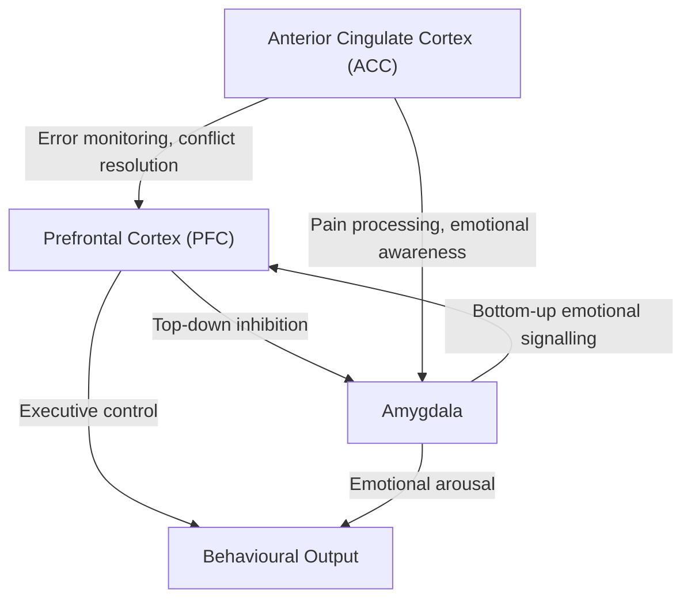

## Definition and Conceptual Framework

A **personality disorder (PD)** refers to an enduring, pervasive, and inflexible pattern of inner experience and behaviour that deviates markedly from the expectations of the individual's culture, is stable over time (present since adolescence or early adulthood), and leads to significant **personal distress** and/or **functional impairment** [1][2].

> The word "personality" derives from Latin *persona* — the mask worn by actors in classical theatre. A personality disorder is, in essence, when the "mask" itself becomes rigid and maladaptive, causing suffering.

**Cluster B** personality disorders are collectively termed the **"dramatic, emotional, and erratic"** cluster. They share core features of **emotional dysregulation, impulsivity, interpersonal instability, and exaggerated self-presentation**. The four disorders within Cluster B are [1][2]:

1. **Borderline Personality Disorder (BPD)** — called *Emotionally Unstable Personality Disorder (EUPD)* in ICD-10/11
2. **Antisocial Personality Disorder (ASPD)** — called *Dissocial Personality Disorder* in ICD-10
3. **Histrionic Personality Disorder (HPD)**
4. **Narcissistic Personality Disorder (NPD)** — note: not included in ICD-10 but present in ICD-11 trait qualifiers and DSM-5

<Callout title="ICD-10 vs ICD-11 vs DSM-5 Naming" type="idea">
ICD-11 (adopted 2022, now in use) shifted to a **dimensional model** for personality disorders — a single diagnosis of "Personality Disorder" with severity levels (mild, moderate, severe) plus **trait domain qualifiers** (Negative Affectivity, Detachment, Dissociality, Disinhibition, Anankastia). The old categorical subtypes (borderline, antisocial, etc.) are largely replaced, though a **"Borderline pattern qualifier"** is retained due to its extensive evidence base. DSM-5 retains the categorical model with all 10 traditional PDs. For HKU exams, know **both** categorical (DSM-5/ICD-10) and dimensional (ICD-11) approaches.
</Callout>

### Why Does Cluster B Matter Clinically?

Cluster B disorders are the personality disorders you will encounter **most frequently** in clinical practice — in emergency departments (deliberate self-harm, suicidal crises), liaison psychiatry (medically unexplained symptoms, treatment non-adherence), forensic settings (violence, offending behaviour), and substance misuse services. They are also the personality disorders with the **most robust evidence base** for specific psychological treatments [2].

---

## Epidemiology

### General Personality Disorder Epidemiology
- Estimated overall prevalence of any PD: **~11%** in the general population [2]
- Generally more common in: **males, younger age groups, poorly educated, unemployed** [2]
- PDs are associated with significant burden: increased healthcare utilisation, comorbid psychiatric disorders (especially depression, anxiety, substance use), and premature mortality

### Cluster B — Specific Epidemiology

| Disorder | Prevalence | Sex Ratio | Key Epidemiological Notes |
|----------|-----------|-----------|--------------------------|
| **Borderline PD** | Community: **1.6–5.9%**; Clinical: up to **20% of psychiatric inpatients** | Historically reported as **~75% female** in clinical samples, but community studies suggest **closer to equal** — the discrepancy reflects referral bias (women present to services; men more often end up in forensic/substance misuse settings) [2] | Peak presentation in **late adolescence to early adulthood**; prevalence decreases with age ("burns out" — impulsivity diminishes while interpersonal difficulties may persist) |
| **Antisocial PD** | **2–5%** lifetime | **M:F = 3:1** [2] | Associated with **substance abuse (84%)**, phobic disorder (27%), depression (35%) [2]. Must have evidence of **conduct disorder before age 15** |
| **Histrionic PD** | **~1.84%** | **~65% female** [2] | Controversial diagnosis — questioned whether it is a culturally-determined expression of distress filtered through personality. Few dedicated aetiological studies [2] |
| **Narcissistic PD** | **~6.2%** lifetime | **M > F** [2] | Associated with depression (20.6%), bipolar I (20.1%), anxiety disorders (54.7%), substance abuse (64.2%) [2]. Significant suicide risk. |

<Callout title="BPD: The Gender Bias Problem" type="error">
A common exam pitfall: students state BPD is "predominantly a female disorder." While clinical samples show ~75% female, community epidemiological studies show **near-equal prevalence**. The discrepancy is a **referral and diagnostic bias** — women with emotional dysregulation are labelled BPD; men with similar traits are more often diagnosed with ASPD or substance use disorders. Always mention this in exams.
</Callout>

### Hong Kong Context
- Local data on personality disorders are limited, but studies from Queen Mary Hospital and Castle Peak Hospital suggest BPD and ASPD are the most commonly encountered Cluster B disorders in psychiatric services
- Cultural factors in Hong Kong: emotional expression norms, family enmeshment, academic pressure, and stigma around mental illness may affect both presentation and help-seeking
- Deliberate self-harm (DSH) presentations to A&E in Hong Kong frequently involve patients with BPD traits — particularly among young females aged 15–30

---

## Risk Factors and Aetiology

Understanding the aetiology of Cluster B PDs requires a **biopsychosocial framework**. No single factor is sufficient — it is the **interaction** of genetic vulnerability, neurobiological differences, and adverse developmental experiences that produces the disorder.

### 1. Genetic and Biological Factors

| Factor | Details | Relevance |
|--------|---------|-----------|
| **Heritability** | BPD: **~0.40–0.65**; ASPD: **0.51–0.81**; HPD: **~0.67**; NPD: **> 0.60** [2] | All Cluster B PDs have substantial genetic loading, but this is *polygenic* — the cumulative effect of multiple genes, each accounting for small effects, with some overlapping with psychiatric disorders (e.g., neuroticism with depression) [2] |
| **Serotonin (5-HT) system** | ASPD: **↓CSF 5-HIAA** (5-hydroxyindoleacetic acid, the main serotonin metabolite) and **abnormal 5-HT2A receptor availability** [2]; BPD: ↓serotonergic activity correlating with impulsivity and aggression | Serotonin is the "behavioural brake." Low serotonergic tone → **impulsivity, aggression, self-harm** — this explains the shared impulsive-aggressive dimension across Cluster B |
| **MAO-A gene** | ASPD: **low-activity MAO-A variant** associated with antisocial behaviour, *especially* in context of childhood maltreatment (gene × environment interaction — the "warrior gene") [2] | MAO-A (monoamine oxidase A) degrades serotonin, noradrenaline, and dopamine. Low activity → excess catecholamines → ↑aggression |
| **Noradrenergic system** | HPD: **?highly responsive noradrenergic systems** [2] | May explain the dramatic emotional reactivity and attention-seeking |
| **Prefrontal cortex** | ASPD: **↓prefrontal grey matter volume** [2]; BPD: ↓orbitofrontal and dorsolateral prefrontal cortex activity | The prefrontal cortex is the "executive controller" — inhibition, planning, empathy, moral reasoning. Reduced volume/function → **poor impulse control, lack of empathy, poor decision-making** |
| **Amygdala** | ASPD: **↓amygdala volume** [2]; BPD: **amygdala hyperreactivity** to emotional stimuli | The amygdala is the "threat detector." In ASPD, a *smaller, hypo-reactive* amygdala → **reduced fear conditioning** → cannot learn from punishment → lack of remorse. In BPD, a *hyperreactive* amygdala → **emotional hyperreactivity** to perceived threats (especially interpersonal rejection) |
| **Empathy circuitry** | NPD: **structural differences in neural circuitry for empathy** [2]; ASPD: **?associated with lack of empathy** [2] | Explains the core interpersonal deficits in both disorders, though the *quality* differs — NPD patients can often read emotions but choose not to respond, while ASPD patients may genuinely not register emotional distress in others |

### 2. Psychological Factors

| Theory | Application | Explanation |
|--------|-------------|-------------|
| **Attachment theory** | BPD (especially) | Early **insecure or anxious/disorganised attachment** with primary caregiver → later difficulty forming stable relationships [2]. The child learns that the caregiver is simultaneously a source of comfort *and* threat → explains the **idealisation-devaluation** pattern and **abandonment fears** in BPD |
| **Childhood abuse and neglect** | BPD: up to **70–80%** report histories of childhood sexual abuse, physical abuse, or severe neglect; ASPD: **early separation and social learning** play a role [2] | Trauma disrupts normal development of emotional regulation, self-identity, and interpersonal trust. The child develops maladaptive coping strategies (dissociation, splitting, impulsive action) that become entrenched as personality traits |
| **Social learning** | ASPD | Children model aggressive and antisocial behaviour from caregivers or peers; reinforced by success in obtaining desired outcomes through coercion [2] |
| **Psychoanalytic theory** | HPD: Freud's model — **failure of mature intimacy + unresolved Oedipus complex → oversexualisation of relationships** [2]; NPD: **parental overprotectiveness and overvaluation coupled with frustration and rejection** [2] | While classical psychoanalytic formulations are less emphasised in modern practice, they offer a useful narrative framework for understanding how early relational experiences shape personality |
| **Conduct disorder** | ASPD | By definition, ASPD requires evidence of **conduct disorder before age 15** — 25% of females and 40% of males with conduct disorder eventually develop ASPD [2] |

### 3. Social and Environmental Factors

- **Socioeconomic deprivation**: poverty, chaotic family environment, parental substance abuse, exposure to violence
- **Institutional care**: children raised in institutions with inconsistent caregiving have higher rates of personality pathology
- **Cultural factors**: societal norms around emotional expression, gender roles, and family structure influence both the development and presentation of Cluster B traits
- In **Hong Kong**: high academic pressure, competitive social environment, intergenerational trauma (e.g., post-war migration experiences), and smaller family sizes (less extended family support) may contribute to certain presentations

<Callout title="Gene × Environment Interaction in ASPD">
The **MAO-A gene** story is a classic example of gene-environment interaction: the low-activity MAO-A variant alone does not cause antisocial behaviour; nor does childhood maltreatment alone reliably cause ASPD. But the *combination* of low-activity MAO-A + childhood maltreatment significantly increases risk of antisocial behaviour. This illustrates the "two-hit" model of personality disorder aetiology.
</Callout>

---

## Anatomy and Function: The Neurobiology of Cluster B

Understanding the neuroanatomy helps explain *why* these patients behave the way they do. The key circuits involved are:

### Prefrontal-Limbic Circuit

| Structure | Normal Function | Dysfunction in Cluster B |
|-----------|----------------|------------------------|
| **Dorsolateral PFC** | Working memory, planning, inhibition | ↓ in ASPD → poor impulse control, inability to delay gratification |
| **Orbitofrontal cortex (OFC)** | Decision-making, reward/punishment processing, social cognition | ↓ in ASPD and BPD → poor social judgement, failure to learn from negative consequences |
| **Ventromedial PFC** | Emotional regulation, moral reasoning, empathy | ↓ in ASPD and NPD → reduced empathy, moral disengagement |
| **Amygdala** | Threat detection, fear conditioning, emotional memory | Hyperactive in BPD (→ emotional hyperreactivity); Hypoactive/smaller in ASPD (→ reduced fear, lack of remorse) |
| **Anterior cingulate cortex** | Conflict monitoring, error detection, emotional awareness | ↓ in BPD → difficulty recognising and modulating emotional conflicts |
| **Insula** | Interoception (awareness of internal bodily states), empathy, disgust | ↓ in ASPD → reduced visceral empathic response ("I don't feel your pain") |

### Neurotransmitter Systems

| System | Role | Cluster B Relevance |
|--------|------|-------------------|
| **Serotonin (5-HT)** | Behavioural inhibition, mood regulation, impulse control | **↓5-HT → impulsivity, aggression, self-harm** — the common neurochemical thread across Cluster B |
| **Dopamine** | Reward, motivation, novelty-seeking | **↑dopaminergic tone → novelty-seeking, risk-taking** — relevant to ASPD and HPD |
| **Noradrenaline** | Arousal, fight-or-flight, emotional reactivity | **HPD: ?highly responsive noradrenergic system** [2]; BPD: dysregulated stress response |
| **Oxytocin** | Social bonding, trust, attachment | Altered in BPD — may paradoxically *increase* distrust in those with adverse attachment histories |
| **Cortisol (HPA axis)** | Stress response | BPD: dysregulated HPA axis (often blunted cortisol response to stress — similar to PTSD, reflecting chronic stress adaptation) |

---

## Classification

### DSM-5 (Categorical Model — Current Standard for HKU Exams)

The DSM-5 retains the traditional **10-PD categorical system** organised into three clusters:

| Cluster | Descriptor | Personality Disorders |
|---------|------------|----------------------|
| A | Odd, eccentric | Paranoid, Schizoid, Schizotypal |
| **B** | **Dramatic, emotional, erratic** | **Borderline, Antisocial, Histrionic, Narcissistic** |
| C | Anxious, fearful | Avoidant, Dependent, Obsessive-compulsive (Anankastic) |

**General Diagnostic Criteria for a Personality Disorder (DSM-5):**
1. An enduring pattern of inner experience and behaviour that deviates markedly from cultural expectations, manifested in ≥2 of: cognition, affectivity, interpersonal functioning, impulse control
2. The pattern is **inflexible and pervasive** across a broad range of personal and social situations
3. Leads to clinically significant **distress or impairment**
4. The pattern is **stable and of long duration**, traceable to **adolescence or early adulthood**
5. Not better explained by another mental disorder
6. Not attributable to substance use or a medical condition

### ICD-10 Equivalents

| DSM-5 | ICD-10 |
|-------|--------|
| Borderline PD | **Emotionally Unstable PD** — two subtypes: *borderline type* and *impulsive type* |
| Antisocial PD | **Dissocial PD** |
| Histrionic PD | Histrionic PD |
| Narcissistic PD | **Not separately classified** in ICD-10 |

### ICD-11 (Dimensional Model — Current WHO Standard)

ICD-11 represents a paradigm shift:
- **Single diagnosis**: "Personality Disorder" with severity grading (mild, moderate, severe)
- **Five trait domain qualifiers**: Negative Affectivity, Detachment, Dissociality, Disinhibition, Anankastia
- **Borderline pattern qualifier** retained as an additional specifier (due to extensive treatment evidence)
- Replaces all categorical subtypes

| ICD-11 Trait Domain | Maps roughly to... |
|--------------------|--------------------|
| Negative Affectivity | BPD features (emotional instability, insecurity, separation anxiety) |
| Dissociality | ASPD/NPD features (callousness, lack of empathy, grandiosity, manipulativeness) |
| Disinhibition | Shared across Cluster B (impulsivity, recklessness, irresponsibility) |

<Callout title="Categorical vs Dimensional: Exam Angle" type="idea">
If asked about personality disorder classification, mention BOTH approaches. The categorical model (DSM-5) is practical for communication ("this patient has BPD") but has poor inter-rater reliability and significant overlap between categories. The dimensional model (ICD-11) better captures the spectrum nature of personality pathology and has better psychometric properties. Clinicians often agree that a PD is **present** but disagree on the **subtype** — this is a key limitation of the categorical approach [2].
</Callout>

---

## Clinical Features

Now let us go through each Cluster B disorder systematically — **symptoms**, **signs**, and their **pathophysiological basis**.

### A. Borderline Personality Disorder (BPD) / Emotionally Unstable PD

> *"I hate you — don't leave me."* This one sentence captures the core paradox of BPD.

#### Core Psychopathology
The central disturbance is **emotional dysregulation** — an inability to modulate the intensity and duration of emotional responses, arising from **amygdala hyperreactivity** combined with **deficient prefrontal inhibitory control**.

#### Symptoms

| Symptom | Pathophysiological Basis |
|---------|------------------------|
| ***Unstable, intense relationships fluctuating between extremes of idealisation and devaluation ("splitting")*** [1][2] | Reflects **disorganised attachment** — the person never learned that a caregiver can be both good and disappointing simultaneously. The defence mechanism of **splitting** (seeing others as all-good or all-bad) prevents integration of ambivalent feelings. Neurobiologically, **amygdala hyperreactivity** to interpersonal cues means minor disappointments trigger catastrophic emotional responses |
| ***Frantic efforts to avoid real or imagined abandonment*** [1][2] | Rooted in **insecure/anxious attachment** from early life. The person learned that attachment figures are unreliable → develops hypervigilance to any sign of rejection. Even neutral cues (e.g., partner being late) are interpreted through the lens of "they are leaving me" |
| ***Unstable self-image / identity disturbance*** [1][2] | The child's sense of self develops through consistent mirroring by caregivers. In abusive/neglectful environments, this mirroring is inconsistent or absent → the person never develops a coherent, stable sense of who they are. They may dramatically shift career goals, values, sexual orientation, or friend groups |
| ***Impulsivity*** in ≥2 areas: **sex, binge eating, substance abuse, spending money, reckless driving** [1][2] | Impulsive acts serve as **maladaptive emotion regulation strategies** — they temporarily relieve unbearable emotional tension. Neurobiologically, **↓serotonergic tone** and **↓prefrontal inhibitory control** lower the threshold for impulsive action |
| ***Chronic feelings of emptiness*** [1][2] | Reflects the **identity disturbance** — without a stable sense of self, the person experiences a pervasive void. Also linked to **anhedonia** from chronic stress-induced downregulation of reward circuitry |
| ***Repetitive suicidal behaviour or self-harm*** [1][2] | Self-harm (cutting, burning, overdose) often serves a **regulatory function** — physical pain triggers endorphin release, which temporarily relieves emotional pain. It is NOT primarily attention-seeking (though secondary gain may reinforce the behaviour). **~10% of BPD patients die by suicide** [2] |
| ***Fluctuations in mood (affective instability)*** [1][2] | Distinguished from bipolar disorder: in BPD, mood shifts are **rapid** (minutes to hours, not days to weeks), **reactive** (triggered by interpersonal events), and the predominant emotions are **anger, anxiety, and despair** (not euphoria). Reflects amygdala hyperreactivity |
| ***Transient, stress-related paranoid ideation*** [1][2] | Under extreme stress, prefrontal function further deteriorates → **transient psychotic symptoms** (persecutory ideas, ideas of reference). These resolve when the stressor resolves — they are NOT sustained delusions |
| ***Pseudohallucinations*** [1][2] | Auditory experiences (typically derogatory voices) that the patient recognises as arising from within their own mind (vs. true hallucinations which are perceived as external). May relate to **dissociation** |
| ***Dissociation*** [1][2] | A defensive response to overwhelming emotional distress — the person "disconnects" from their body, emotions, or surroundings (depersonalisation, derealisation). Rooted in childhood trauma where dissociation served as an adaptive escape from abuse |

#### Signs (on examination / observed behaviour)

| Sign | Explanation |
|------|-------------|
| **Scars from self-harm** (typically forearms, thighs) | Evidence of repetitive self-cutting/burning as emotion regulation strategy |
| **Rapid emotional shifts during interview** | The clinician may witness idealisation ("you're the best doctor I've ever seen") followed by devaluation ("you don't care about me at all") within a single consultation |
| **Intense emotional displays disproportionate to content** | Crying, anger outbursts, or dissociative episodes during discussion of interpersonal difficulties |
| **Splitting of clinical team** | Patients may unconsciously pit staff members against each other ("Nurse A understands me, but Doctor B is cruel") — this is a projection of their internal splitting defence onto the external environment |
| **Micropsychotic phenomena** | Transient paranoid thinking or dissociative symptoms observable during high-stress moments |

<Callout title="BPD and Suicide Risk" type="error">
**10% of BPD patients die by suicide** [2]. Do NOT dismiss suicidal statements as "just manipulation." Every episode of DSH must be properly risk-assessed. The challenge is that repeated presentations can lead to **compassion fatigue** in clinical staff — this is exactly when dangerous complacency develops.
</Callout>

---

### B. Antisocial Personality Disorder (ASPD) / Dissocial PD

> *"I do what I want, and I don't feel bad about it."*

#### Core Psychopathology
The central disturbance is a **pervasive disregard for and violation of the rights of others**, underpinned by **deficient fear conditioning** (↓amygdala response), **↓serotonergic impulse control**, and **↓prefrontal empathy circuitry**.

#### Prerequisite
***Preceded by conduct disorder before age 15*** — this is **mandatory** for DSM-5 diagnosis. **25% of females and 40% of males with conduct disorder eventually develop ASPD** [2].

#### Symptoms and Signs

| Feature | Pathophysiological Basis |
|---------|------------------------|
| ***Callous lack of concern for others*** — the central feature [2] | **↓amygdala volume and reactivity** → reduced fear conditioning → the person does not experience vicarious distress when witnessing others' suffering. **↓prefrontal empathy circuitry** → cannot (or will not) take others' perspective. **Structural differences in empathy neural networks** |
| ***Irritable, exploitative, violent; may inflict cruel or degrading acts*** on others [2] | Low serotonin (↓CSF 5-HIAA) → ↓behavioural inhibition → aggression threshold lowered. **Low-activity MAO-A variant** → excess catecholamines → ↑reactive aggression [2]. ↓prefrontal "brake" on limbic impulses |
| ***Superficial charm*** but relationships are shallow and short-lived; sex lacks tenderness [2] | The charm is **instrumental** — used to manipulate others for personal gain. Relationships serve a utilitarian function; there is no genuine emotional bonding because the neurobiological substrate for empathy and attachment is impaired |
| ***Irresponsible; departs from social norms*** [2] | ↓OFC function → poor reward/punishment processing → does not learn from negative consequences of behaviour. Cannot delay gratification |
| ***Impulsive; takes risks without concern for safety*** [2] | ↓serotonin + ↓prefrontal control → poor impulse regulation. ↓amygdala fear response → does not experience fear that normally restrains risky behaviour |
| ***Avoids responsibility; striking lack of guilt or remorse; does not change behaviour with punishment*** [2] | The **hallmark** of ASPD. ↓amygdala fear conditioning → punishment does not produce the emotional learning that normally drives behaviour change. The person can describe what they did but cannot *feel* that it was wrong |
| **Deceitfulness, repeated lying** | Lying is a learned strategy that works because of superficial charm. ↓prefrontal moral reasoning → no internal "alarm" when being dishonest |
| ***↑premature accidental deaths, suicides, homicides*** [2] | Consequence of impulsivity, risk-taking, substance use, and involvement in criminal activity |

<Callout title="ASPD: Psychopathy vs. Antisocial PD">
These are NOT the same thing. **ASPD** (DSM-5) is defined largely by *behavioural* criteria (criminal/antisocial behaviour). **Psychopathy** (Hare's Psychopathy Checklist-Revised, PCL-R) additionally captures *interpersonal and affective* features (glibness, grandiosity, shallow affect, lack of empathy). Most psychopaths meet criteria for ASPD, but only ~30% of ASPD patients meet criteria for psychopathy. Psychopathy carries a worse prognosis. This distinction is important in forensic psychiatry.
</Callout>

---

### C. Histrionic Personality Disorder (HPD)

> *"Look at me! Pay attention to me!"*

The word "histrionic" comes from Latin *histrio* = actor. The name tells you the condition — these patients are *performing*.

#### Core Psychopathology
Pervasive pattern of **excessive emotionality and attention-seeking**, possibly driven by **highly responsive noradrenergic systems** [2] and an underlying insecurity about self-worth that requires constant external validation.

#### Symptoms and Signs

| Feature | Pathophysiological Basis |
|---------|------------------------|
| ***Self-dramatisation with emotional blackmail, angry scenes, demonstrative suicide attempts*** [2] | Exaggerated emotional displays serve to **capture and hold the attention of others**. The emotional expression is *performative* rather than deeply felt — it is a strategy to regulate the core fear of being ignored or unimportant |
| ***Often suggestible, especially by figures of authority*** [2] | Reflects a **poorly consolidated self-identity** — the person looks to others (especially authority figures) to define their beliefs and behaviours. This makes them vulnerable to influence |
| ***Seeks attention and excitement; easily bored; short-lived enthusiasm; shallow, labile affect*** [2] | **?Highly responsive noradrenergic system** → craves stimulation and novelty. Affect is wide-ranging but *shallow* — emotions are expressed dramatically but lack depth and rapidly shift |
| ***Self-centred with marked capacity for self-deception*** — can convince themselves of own fabrications [2] | The boundary between external performance and internal experience becomes blurred. Ego-syntonic self-deception serves a protective function against confronting underlying insecurity |
| ***Over-concerned with physical attractiveness*** [2] | Physical appearance is a primary tool for obtaining attention and validation |
| ***Seeks intimacy and is inappropriately seductive*** [2] | Freud's formulation: **failure of mature intimacy + unresolved Oedipus complex → oversexualisation of relationships** [2]. In modern terms, the person confuses sexual attention with genuine emotional connection |

<Callout title="HPD: A Controversial Diagnosis" type="idea">
This diagnosis is **almost exclusively applied to young women**, raising the question of whether it is a culturally determined expression of distress filtered through personality — essentially, pathologising "feminine" emotional expression [2]. Many modern psychiatrists are uncomfortable with this diagnosis and prefer to formulate the presentation using BPD criteria or the ICD-11 dimensional model. In exams, acknowledge this controversy.
</Callout>

---

### D. Narcissistic Personality Disorder (NPD)

> *"I am special, and I deserve special treatment."*

The word "narcissistic" derives from the Greek myth of **Narcissus**, who fell in love with his own reflection and wasted away. The name tells you the condition — pathological self-absorption.

#### Core Psychopathology
A pervasive pattern of **grandiosity, need for admiration, and lack of empathy**, masking a profoundly **fragile self-esteem** that is dependent on external validation.

#### Subtypes [2]

| Subtype | Description |
|---------|-------------|
| **Grandiose / Overt ("thick-skinned")** | Arrogant, entitled, openly demanding admiration, dismissive of others. The "classic" presentation |
| **Vulnerable / Covert ("thin-skinned")** | Hypersensitive to criticism, chronically envious, feels inadequate despite fantasies of greatness, prone to shame and depression. Often missed clinically |
| **High-functioning** | Successful in professional life, uses narcissistic traits adaptively (e.g., in leadership), but interpersonal relationships suffer |

#### Symptoms and Signs

| Feature | Pathophysiological Basis |
|---------|------------------------|
| ***Grandiose sense of self-importance; considers self as deserving of special treatment*** — rigid, inflexible, but easily threatened (very dependent on feedback) [2] | The grandiosity is a **defensive structure** protecting a fragile core self-esteem. It is *brittle* — when challenged (e.g., criticism, failure), the defence crumbles, revealing intense shame, rage, or depression. **Structural differences in empathy neural circuitry** [2] underpin the cognitive distortions |
| **Boastful and pretentious with excessive need for admiration** — needs to be centre of attention [2] | The need for admiration is not vanity — it is a **psychological oxygen supply** for a self that cannot self-regulate esteem internally |
| ***Typically high-functioning (intellectually and socially)*** [2] | Narcissistic traits can drive ambition, competitiveness, and professional achievement. The *high-functioning* subtype is often admired externally but causes devastation in close relationships |
| ***Superficial and exploitative relationships*** — value is only self-enhancement (e.g., tries to associate with rich, famous people) [2] | Others are experienced as **extensions of the self** ("self-objects" in psychoanalytic terms) rather than separate individuals. Relationships exist only insofar as they serve narcissistic supply |
| ***Lack of empathy*** — even if attuned to others' reactions, only does so to serve own needs [2] | Distinction from ASPD: NPD patients can often *cognitively* read emotions accurately but **lack affective empathy** (do not feel others' pain). **Structural differences in neural circuitry for empathy** [2] |
| ***Chronic emptiness and boredom when without positive feedback*** — feels vulnerable during life transitions [2] | When external sources of admiration are removed (e.g., retirement, relationship breakdown, ageing), the grandiose defence collapses and the underlying emptiness/depression becomes apparent |
| ***Significant risk of suicide and substance use*** [2] | **Narcissistic crisis** — when the grandiose self-image is catastrophically shattered (e.g., public humiliation, financial ruin), the person may experience intense suicidal ideation. Substance use may serve as self-medication for chronic emptiness |

<Callout title="Narcissistic Rage">
When the narcissistic defence is threatened (a "narcissistic injury"), the response is often **disproportionate rage** — "How dare you criticise me?" This can manifest as verbal abuse, physical violence, litigation, or sustained campaigns of vengeance. Understanding this helps predict and manage dangerous situations in clinical and forensic settings.
</Callout>

---

## Shared Features Across Cluster B

While each disorder has a distinct profile, they share several common threads:

| Shared Feature | BPD | ASPD | HPD | NPD |
|---------------|-----|------|-----|-----|
| **Impulsivity** | +++ (self-directed) | +++ (other-directed) | ++ | + |
| **Emotional dysregulation** | +++ | + (low emotional range) | +++ (shallow) | ++ (masked) |
| **Interpersonal dysfunction** | +++ (chaotic) | +++ (exploitative) | ++ (superficial) | +++ (exploitative) |
| **Identity disturbance** | +++ | + | ++ | +++ (fragile grandiosity) |
| **Comorbid substance use** | +++ | +++ | ++ | ++ |
| **Suicide risk** | +++ (10% mortality) | ++ | + (demonstrative) | ++ (narcissistic crisis) |
| **Childhood adversity** | +++ (abuse, neglect) | +++ (conduct disorder) | + | ++ (over-valuation + rejection) |

---

## Comorbidities

Cluster B PDs rarely exist in isolation. Key comorbidities include:

| Comorbidity | Relevance |
|-------------|-----------|
| **Major depressive disorder** | Most common comorbidity across all Cluster B PDs. In BPD, depression is often described as "empty" rather than melancholic. In NPD, depression (20.6%) is triggered by narcissistic injury [2] |
| **Substance use disorders** | ASPD: 84% have comorbid substance abuse [2]; NPD: 64.2% [2]. Substances serve as self-medication and/or reflect impulsivity |
| **Other personality disorders** | There is substantial overlap between Cluster B PDs — a patient may meet criteria for both BPD and ASPD, or BPD and HPD. This is a limitation of the categorical model |
| **Anxiety disorders** | NPD: 54.7% [2]; ASPD: phobic disorder 27% [2] |
| **Bipolar disorder** | NPD: 20.1% have comorbid bipolar I [2]. BPD is frequently misdiagnosed as bipolar II (both have mood instability, but the temporal pattern and triggers differ) |
| **PTSD** | BPD and PTSD frequently co-occur due to shared aetiological factor of childhood trauma. Some argue BPD should be reconceptualised as a complex trauma disorder |
| **Eating disorders** | Common in BPD (binge eating as impulsive behaviour) and HPD (concern with appearance) |

<Callout title="BPD vs Bipolar: A Common Exam Trap" type="error">
Both BPD and bipolar disorder feature mood instability, impulsivity, and suicidality. The key distinguishing features are:
- **Temporal pattern**: BPD mood shifts last *minutes to hours* and are *reactive* to interpersonal triggers; bipolar episodes last *days to weeks/months* and may be *spontaneous*
- **Quality of mood**: BPD predominant emotions are *anger, emptiness, anxiety*; bipolar mania involves *euphoria, grandiosity, decreased need for sleep*
- **Interpersonal pattern**: BPD has *chaotic relationships with splitting*; this is not a core feature of bipolar
- **Identity disturbance**: Present in BPD, not in bipolar
- **Response to treatment**: Bipolar responds to mood stabilisers; BPD responds to psychological therapies (especially DBT)
- They can co-occur (especially BPD + bipolar II) — this is NOT rare
</Callout>

---

## Approach to Assessment [2]

When assessing a patient suspected of having a Cluster B personality disorder:

1. **Source of distress**: Explore thoughts, emotions, behaviour, and relationships — both to self and others
2. **Functional impairment**: At work, home, and in social circumstances
3. **Comorbid psychiatric illness**: Screen for depression, anxiety, substance use, PTSD, eating disorders, bipolar disorder
4. **Strengths and weaknesses**: Crucial for treatment planning — what assets does this person have that can be leveraged?
5. **Risk assessment**: Suicide, self-harm, violence to others — must be assessed at every contact
6. **Collateral history**: Personality disorders are, by definition, pervasive patterns — information from family, partners, and previous clinical records is essential
7. **Premorbid personality and developmental history**: Childhood experiences, attachment patterns, educational/occupational trajectory

<Callout title="Clinical Pearl: The Countertransference Signal">
Your own emotional reaction to the patient is a powerful diagnostic tool in Cluster B. If you feel:
- **Overwhelmed, guilty, desperate to rescue** → think BPD (the patient's abandonment anxiety pulls you into a rescuer role)
- **Charmed then manipulated, angry** → think ASPD (superficial charm followed by exploitation)
- **Flattered, special, seduced** → think HPD or NPD (the patient makes you feel uniquely important)
- **Incompetent, attacked, defensive** → think NPD (the patient's entitlement triggers your self-doubt)

This is called **countertransference** — the clinician's emotional response to the patient. In Cluster B, it is often the first clue to the diagnosis.
</Callout>

---

## High-Yield Summary

<Callout title="High Yield Summary">

**Cluster B PDs** are the "dramatic, emotional, erratic" cluster: BPD, ASPD, HPD, NPD.

**Borderline PD (BPD / EUPD)**:
- Core: emotional dysregulation, unstable relationships (splitting), identity disturbance, impulsivity, chronic emptiness, self-harm, abandonment fears
- Neurobiology: amygdala hyperreactivity + ↓prefrontal control + ↓serotonin
- 10% die by suicide. ~70–80% report childhood abuse/neglect
- ICD-10: Emotionally Unstable PD (borderline and impulsive types)

**Antisocial PD (ASPD / Dissocial PD)**:
- Core: callous lack of concern for others, irresponsibility, impulsivity, violence, lack of remorse, does not learn from punishment
- Requires conduct disorder before age 15
- Neurobiology: ↓amygdala (reduced fear conditioning) + ↓prefrontal grey matter + ↓5-HT (↓CSF 5-HIAA) + low-activity MAO-A
- M:F = 3:1; prevalence 2–5%

**Histrionic PD (HPD)**:
- Core: attention-seeking, self-dramatisation, shallow labile affect, suggestibility, seductiveness
- ?Highly responsive noradrenergic system; controversial diagnosis (gender bias)

**Narcissistic PD (NPD)**:
- Core: grandiosity (fragile), need for admiration, lack of empathy, exploitative relationships
- Subtypes: grandiose/overt ("thick-skinned"), vulnerable/covert ("thin-skinned"), high-functioning
- Structural differences in empathy neural circuitry
- Significant suicide risk during narcissistic crisis

**Shared features**: impulsivity, emotional dysregulation, interpersonal dysfunction, high comorbidity (depression, substance use, anxiety), significant suicide risk

**Classification**: DSM-5 retains categorical model; ICD-11 uses dimensional model with trait qualifiers + borderline pattern qualifier

**Aetiology**: Biopsychosocial — polygenic heritability + neurotransmitter abnormalities (especially ↓5-HT) + childhood adversity (abuse, neglect, disorganised attachment) + social learning

</Callout>

---

<ActiveRecallQuiz
  title="Active Recall - Cluster B Personality Disorders"
  items={[
    {
      question: "Name the four Cluster B personality disorders and give the ICD-10 equivalent name for BPD and ASPD.",
      markscheme: "BPD (Emotionally Unstable PD in ICD-10 — borderline and impulsive subtypes), ASPD (Dissocial PD in ICD-10), Histrionic PD, Narcissistic PD (not separately classified in ICD-10). Cluster B = dramatic, emotional, erratic.",
    },
    {
      question: "Explain the neurobiological basis for why ASPD patients do not change behaviour with punishment.",
      markscheme: "Reduced amygdala volume and reactivity leads to deficient fear conditioning — punishment does not generate the emotional learning (fear/anxiety) that normally drives behaviour change. Combined with reduced prefrontal grey matter (poor impulse control and moral reasoning) and low serotonin (reduced 5-HIAA in CSF, abnormal 5-HT2A receptors) leading to impulsivity.",
    },
    {
      question: "A 22-year-old woman presents with rapid mood shifts lasting minutes triggered by arguments with her partner, chronic emptiness, cutting scars on forearms, and says 'everyone always leaves me.' Her partner says she alternates between idealising and hating him. What is the most likely diagnosis, and how do you distinguish this from bipolar disorder?",
      markscheme: "Borderline Personality Disorder. Key distinguishing features from bipolar: (1) mood shifts last minutes-hours (not days-weeks), (2) mood shifts are reactive to interpersonal triggers (not spontaneous), (3) predominant emotions are anger/emptiness/anxiety (not euphoria), (4) identity disturbance and splitting pattern present, (5) BPD responds to psychotherapy (DBT) not mood stabilisers.",
    },
    {
      question: "What prerequisite must be met for a DSM-5 diagnosis of Antisocial Personality Disorder? What proportion of those with the prerequisite develop ASPD?",
      markscheme: "Must have evidence of Conduct Disorder before age 15. Approximately 25% of females and 40% of males with conduct disorder eventually develop ASPD.",
    },
    {
      question: "Describe the two subtypes of Narcissistic Personality Disorder and explain why NPD patients are at significant suicide risk.",
      markscheme: "Grandiose/overt (thick-skinned) — arrogant, entitled, openly demanding admiration. Vulnerable/covert (thin-skinned) — hypersensitive to criticism, shame-prone, envious. Suicide risk arises during narcissistic crisis — when grandiose self-image is catastrophically shattered (e.g., public humiliation, financial ruin, relationship breakdown), the defensive structure collapses, revealing intense shame and emptiness, leading to suicidal ideation.",
    },
    {
      question: "How does ICD-11 classify personality disorders differently from DSM-5, and which Cluster B disorder has a specific qualifier retained in ICD-11?",
      markscheme: "ICD-11 uses a dimensional model: single diagnosis of Personality Disorder with severity grading (mild, moderate, severe) plus five trait domain qualifiers (Negative Affectivity, Detachment, Dissociality, Disinhibition, Anankastia). The Borderline pattern qualifier is specifically retained due to its extensive treatment evidence base. DSM-5 retains the categorical model with 10 discrete PDs in 3 clusters.",
    },
  ]}
/>

## References

[1] Lecture slides: GC 170. Schizophrenia and related psychoses.pdf (personality disorder classification context)
[2] Senior notes: ryanho-psych.md (Sections 10.1, 10.3 — Personality and Personality Disorders, Cluster B)
