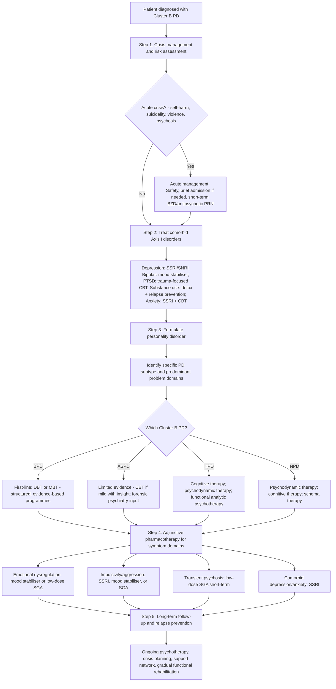

## Management of Cluster B Personality Disorders

### Overarching Management Principles

Before discussing specific treatments for each disorder, it is essential to understand the **general philosophy** of managing personality disorders. This is fundamentally different from managing most Axis I psychiatric disorders.

***Management principles*** [2]:
- ***Aim: seek a way of life that conflicts less with their character***, often by:
  - ***↓contact with situations provoking difficulties***
  - ***↑opportunity to develop assets in their personality***
- ***Form: psychological support as mainstay, with multidisciplinary input***
- ***Techniques:***
  - ***Psychotherapy: psychodynamic, cognitive therapy when well-motivated + stable***
  - ***Drugs: as adjunct only to treat comorbid psychiatric disorders***
  - ***Evidence: little hard evidence to support current management, mainly focusing on Cluster B*** [2]

> Think of it this way: you cannot "cure" a personality disorder the way you cure pneumonia with antibiotics. Personality is *who the person is*. The goal is not to give them a new personality but to help them **develop flexibility** in their existing personality so it no longer causes such suffering. You are teaching a rigid structure to bend instead of break.

Why is **psychotherapy** the mainstay and not medication? Because the core disturbance is in **patterns of relating, thinking, and regulating emotions** — these are learned, deeply embedded patterns that require *re-learning* through a therapeutic relationship. A pill cannot teach someone how to tolerate abandonment or develop empathy. Medications address *symptoms* (mood instability, impulsivity, transient psychosis) but not the underlying personality structure [2].

<Callout title="The Therapeutic Relationship Challenge">
Cluster B personality disorders, by their very nature, cause ***difficult relationships with clinicians*** and patients are ***often excluded from care*** [2]. The same interpersonal patterns that cause problems in life (splitting, manipulation, idealisation-devaluation, entitlement) will play out in the therapeutic relationship. This is not a barrier to treatment — it IS the treatment. The therapeutic relationship becomes the laboratory in which the patient's relational patterns can be observed, understood, and gradually modified. But it demands extraordinary patience, consistent boundaries, and good supervision for the treating clinician.
</Callout>

---

### Management Algorithm

---

### Treatment by Disorder

#### A. Borderline Personality Disorder — The Most Evidence-Based

BPD is the Cluster B disorder with by far the **strongest evidence base** for specific treatments. This makes sense when you consider that BPD patients present frequently to services (self-harm, crisis presentations), generate significant clinical concern, and are highly distressed — creating both the opportunity and the motivation for treatment research.

##### 1. Psychotherapy (First-Line, Mainstay of Treatment)

| Therapy | Mechanism | Format | Evidence |
|---------|-----------|--------|----------|
| ***Dialectical Behaviour Therapy (DBT)*** [2][3] | ***Mixture of CBT (to ↑emotional regulation) and mindfulness (to ↑awareness) with confrontation*** [2]. Based on a biosocial model: BPD arises from biological emotional vulnerability + invalidating environment. DBT teaches four skill modules: (1) **Mindfulness** — present-moment awareness; (2) **Distress tolerance** — surviving crises without making them worse; (3) **Emotion regulation** — understanding and managing intense emotions; (4) **Interpersonal effectiveness** — assertiveness and maintaining relationships. The "dialectical" part refers to balancing *acceptance* (mindfulness) with *change* (CBT) | Weekly individual therapy + weekly skills group + phone coaching between sessions + therapist consultation team. Typically 12 months | **Best evidence** of any PD therapy. RCTs show significant reduction in self-harm, suicidality, A&E presentations, hospitalisations, and improvement in social functioning. NICE-recommended first-line for BPD |
| ***Mentalization-Based Therapy (MBT)*** [2] | ***Day units to build therapeutic communities designed to help patients become more fully aware of their thoughts/feelings before acting on them*** [2]. "Mentalization" (*mentalizzare*) = the capacity to understand behaviour in terms of underlying mental states (thoughts, feelings, desires, intentions) — both one's own and others'. BPD patients have impaired mentalization, especially under emotional stress → they act on impulse rather than reflecting. MBT aims to strengthen this capacity | Partial hospitalisation programme (day hospital) or intensive outpatient. Typically 18 months | Strong RCT evidence — reduces self-harm, suicidality, depression, improves social/interpersonal functioning. NICE-recommended as alternative to DBT |
| **Psychodynamic therapy** [2][3] | Explores unconscious conflicts, defence mechanisms (especially splitting, projective identification), and early attachment experiences that drive current maladaptive patterns. Transference (how the patient relates to the therapist) and countertransference are used as therapeutic tools | Individual, typically long-term (1-3 years, sometimes longer) | Moderate evidence. Transference-Focused Psychotherapy (TFP), developed by Kernberg, has RCT support. Better for patients who are higher-functioning and psychologically minded |
| **Cognitive Behavioural Therapy (CBT)** [2][3] | Identifies and modifies maladaptive thought patterns (e.g., "everyone will abandon me") and behaviours (e.g., self-harm as coping). Schema-focused CBT (Young's Schema Therapy) targets early maladaptive schemas rooted in childhood | Individual or group, typically 1-3 years for schema therapy | Good evidence for schema therapy specifically. Standard CBT less effective alone for BPD because it addresses cognitions but may not adequately address the emotional/relational core |
| **Cognitive Analytic Therapy (CAT)** [3] | Integrates cognitive and psychodynamic approaches. Maps "reciprocal roles" (patterns learned in early relationships that are repeated) and "traps, dilemmas, snags" that maintain problems | Time-limited (typically 16-24 sessions) | Moderate evidence. Useful for patients who cannot commit to longer treatments |
| **Therapeutic communities** [2][3] | Residential or day-patient communities where residents participate in governance and mutual support. The community itself is the therapeutic instrument — interpersonal patterns are observed and addressed in real-time | Residential or day programme, typically 12-18 months | Historical approach, less commonly used now due to resource intensity. Some evidence for reduced self-harm and hospitalisation |

<Callout title="DBT vs MBT — When to Choose Which?">
Both are NICE-recommended first-line for BPD. In practice:
- **DBT** is better for patients with prominent **self-harm and impulsivity** — it provides concrete skills for crisis survival
- **MBT** is better for patients with prominent **interpersonal dysfunction and identity disturbance** — it builds the capacity to understand self and others
- **Availability** often determines choice — in Hong Kong, DBT programmes are more widely available than MBT
- Both require **structured programmes** with trained therapists; ad hoc "therapy" without a structured framework is insufficient for BPD
</Callout>

##### 2. Pharmacotherapy for BPD (Adjunct Only — Never First-Line Alone)

> *"There is no pill for personality."* Medications in BPD target **symptom domains**, not the disorder itself. They should always be used **alongside psychotherapy**, never instead of it.

| Symptom Domain | Medication Options | Mechanism / Rationale | Cautions |
|---------------|-------------------|----------------------|----------|
| **Affective dysregulation** (mood instability, anger, anxiety) | **Mood stabilisers**: lamotrigine, valproate, topiramate; **Low-dose SGAs**: aripiprazole, quetiapine | Mood stabilisers dampen neuronal excitability → smooth out rapid mood oscillations. SGAs modulate dopaminergic and serotonergic transmission → reduce emotional reactivity | Avoid long-term benzodiazepines — risk of dependence, disinhibition, paradoxical aggression in BPD. Valproate: teratogenic — extreme caution in women of childbearing age |
| **Impulsive-behavioural dyscontrol** (self-harm, binge eating, aggression) | **SSRIs**: fluoxetine, sertraline; **Mood stabilisers**: lamotrigine, topiramate; **SGAs**: aripiprazole | SSRIs ↑serotonin → ↑behavioural inhibition (serotonin is the "behavioural brake"). Lamotrigine inhibits glutamate release → ↓impulsivity | SSRIs may take 4-6 weeks; limited efficacy in BPD for depression per se but better for impulsivity |
| **Cognitive-perceptual symptoms** (transient paranoia, pseudohallucinations, dissociation) | **Low-dose SGAs**: aripiprazole (2-5mg), olanzapine (2.5-5mg), quetiapine (25-100mg) | Low-dose dopamine blockade → ↓transient psychotic symptoms without heavy sedation | Use **short-term** only (days to weeks during crisis); avoid long-term antipsychotic use for BPD — risk of metabolic syndrome, tardive dyskinesia for minimal benefit |
| **Comorbid depression** | **SSRIs** | Treat the comorbid MDD — but recognise that the "emptiness" of BPD does not respond well to antidepressants alone | Antidepressants alone are insufficient if BPD is the primary problem; the personality disorder must be addressed through psychotherapy |
| **Comorbid anxiety / PTSD** | **SSRIs**; trauma-focused CBT/EMDR for PTSD | Standard anxiety/PTSD treatment principles apply | Avoid benzodiazepines (dependence risk, disinhibition) |

<Callout title="NICE Guidance on Medications in BPD" type="error">
NICE (CG78, updated) recommends that medications should **NOT be used specifically for BPD** — they should only be prescribed for comorbid Axis I disorders. In practice, symptom-domain prescribing (as above) is widely used, but the evidence is modest and polypharmacy is a significant risk. **Always have a clear target symptom, set a review date, and stop if not effective.** Avoid accumulating multiple medications in BPD patients — polypharmacy increases overdose risk in a population already prone to impulsive overdoses.
</Callout>

##### 3. Crisis Management for BPD

| Situation | Approach | Rationale |
|-----------|----------|-----------|
| **Acute self-harm / suicidal crisis** | Comprehensive risk assessment; involve crisis team; short-term admission only if genuinely needed (usually < 72 hours); safety planning (collaborative identification of warning signs, coping strategies, emergency contacts) | Prolonged admission can be **iatrogenic** in BPD — the ward environment can reinforce dependency and self-harm behaviour. Brief admission for crisis stabilisation, then rapid return to community treatment |
| **Transient psychotic symptoms** | Low-dose SGA PRN (e.g., olanzapine 2.5mg, quetiapine 25mg); reduce environmental stress; reality-testing | Symptoms are stress-related and self-limiting — avoid heavy sedation or full antipsychotic doses |
| **Intense anger / aggression** | De-escalation techniques; PRN lorazepam (0.5-1mg) or PRN olanzapine (2.5-5mg) for acute agitation; remove triggers; involve security if safety risk | Avoid confrontation or authoritarian responses — these trigger further escalation through the patient's interpersonal hyperreactivity |

---

#### B. Antisocial Personality Disorder — ***Seldom Effective*** [2]

ASPD is the most treatment-resistant of all Cluster B disorders. The reasons are inherent to the disorder itself: ***callous lack of concern for others***, ***lack of guilt or remorse***, and ***does not change behaviour with punishment*** [2] — the very features that define ASPD also prevent engagement with treatment.

***Treatment is seldom effective*** [2]. ***Must be mindful of manipulation of therapeutic relationship*** [2].

| Treatment Modality | Details | Indications / Contraindications |
|-------------------|---------|-------------------------------|
| ***CBT if mild, has insight and motivation to improve*** [2] | Cognitive restructuring of antisocial beliefs ("It's a dog-eat-dog world"), behavioural strategies for anger management and problem-solving | Only if patient is **mild** on the spectrum, has **some insight**, and is **genuinely motivated** (not just seeking parole or other external reward). Contraindicated if psychopathic (high PCL-R score) — psychopaths may learn to manipulate more effectively through therapy |
| ***Majority delivered by forensic psychiatrists*** [2] | ASPD management sits at the interface of psychiatry and the criminal justice system. Forensic services manage higher-risk individuals, often in secure settings | Important to involve forensic services for risk management, especially when there is a history of serious violence |
| ***Trial of SGA, SSRI, mood stabilisers for those with severe aggression and willing to take medications*** [2] | **SSRIs**: ↑serotonin → ↑behavioural inhibition → ↓impulsive aggression. **SGAs** (e.g., risperidone, olanzapine): ↓dopaminergic drive → ↓aggressive arousal. **Mood stabilisers** (e.g., valproate, lithium, carbamazepine): neuronal membrane stabilisation → ↓explosive outbursts | Only for patients with **severe aggression** who are **willing** to take medications. Compliance is typically poor. Monitor for diversion or stockpiling of medications |
| **Therapeutic communities** | Historically used (e.g., Henderson Hospital in the UK). The peer-mediated environment challenges antisocial behaviour in real-time | Evidence is limited and these programmes are resource-intensive. May benefit the subgroup with some capacity for social bonding |
| **Functional family therapy / Multisystemic therapy** | For young people with conduct disorder (preventing progression to ASPD) | Better evidence for **prevention** than treatment of established ASPD |

<Callout title="The Ethical Dilemma of ASPD Treatment" type="idea">
ASPD raises difficult questions: Can you treat someone who doesn't believe there is a problem? Should the justice system or the health system manage antisocial behaviour? In practice, many ASPD patients interact with psychiatry primarily through forensic services, following criminal offending. The most effective intervention may be **prevention** — early identification and treatment of conduct disorder in children and adolescents before ASPD crystallises.
</Callout>

---

#### C. Histrionic Personality Disorder

| Treatment Modality | Details | Rationale |
|-------------------|---------|-----------|
| **Cognitive therapy** [2] | Identifies automatic thoughts driving attention-seeking and emotional dramatisation (e.g., "If people don't notice me, I'm worthless"). Challenges cognitive distortions | Addresses the cognitive component — the beliefs that drive histrionic behaviour |
| ***Functional analytic psychotherapy*** [2] | A behaviourally-oriented therapy that uses the therapeutic relationship itself as the arena for change. The therapist reinforces genuine, non-dramatic emotional expression and does not reinforce histrionic behaviour | Directly targets the interpersonal pattern — the patient learns that authentic emotional expression is more rewarding than dramatic performance |
| **Psychodynamic therapy** | Explores unconscious conflicts around intimacy, sexuality, and self-worth that drive histrionic behaviour | Useful for patients with psychological mindedness who can tolerate exploration of underlying insecurity |
| ***Treatment often prompted by depression from dissolved romantic relationships*** [2] | The presenting complaint is often not HPD itself but a comorbid depressive episode | Treat the depression with SSRI + psychotherapy; use the treatment engagement as an opportunity to address underlying personality issues |
| **Group therapy** | Group setting provides real-time feedback on how dramatic behaviour affects others | Can be challenging — the histrionic patient may dominate the group or form competitive relationships with other group members |

---

#### D. Narcissistic Personality Disorder

| Treatment Modality | Details | Rationale |
|-------------------|---------|-----------|
| ***Cognitive therapy*** [2] | Schema therapy (Young) is particularly useful — identifies and modifies early maladaptive schemas (e.g., "I am special and above others" masking "I am fundamentally defective"). Addresses cognitive distortions of entitlement and superiority | The cognitive approach is acceptable to NPD patients because it is structured and does not immediately threaten their grandiose self-image |
| **Psychodynamic therapy** | Particularly Kohut's self-psychology approach — empathically engages with the patient's narcissistic needs while gradually building authentic self-esteem. Kernberg's confrontational approach directly challenges grandiose defences | **Kohut's approach**: better tolerated, works with the vulnerability underneath. **Kernberg's approach**: more confrontational, may cause premature dropout but can produce deeper change |
| ***Functional analytic psychotherapy*** [2] | As with HPD, uses the therapeutic relationship to identify and modify interpersonal exploitation and lack of empathy | The therapist models genuine reciprocity — a new relational experience for the NPD patient |
| **Pharmacotherapy** | SSRI for comorbid depression; mood stabiliser or SGA if significant emotional instability | No medications specifically for NPD itself. Treatment of comorbid depression is critical because ***associated with significant risk of suicide*** [2] |

<Callout title="NPD: The Treatment Paradox">
The fundamental paradox of treating NPD: the patient believes they are already perfect and therefore do not need treatment. They typically present only when their grandiose self-image has been shattered (narcissistic crisis → depression, substance use, suicidal ideation). The narrow window of therapeutic opportunity is during this crisis, when the defences are down and the underlying vulnerability is exposed. Once the crisis resolves, the grandiose defence reconstructs and the patient often drops out of treatment.
</Callout>

---

### General Therapeutic Considerations Across All Cluster B PDs

| Principle | Explanation |
|-----------|-------------|
| **Consistent boundaries** | Clear, non-punitive limits on behaviour within the therapeutic relationship and clinical setting. Boundaries are not about control — they create a safe, predictable environment that the patient has never experienced before |
| **Team consistency and communication** | Cluster B patients (especially BPD) can unconsciously "split" clinical teams — praising one clinician while demonising another. Regular team meetings and a shared management plan prevent this from disrupting care |
| **Supervision for clinicians** | Working with Cluster B patients is emotionally demanding. Countertransference reactions (frustration, rescue fantasies, anger, helplessness) are inevitable and normal. Regular supervision prevents burnout and boundary violations |
| **Avoid unnecessary hospitalisation** | Prolonged inpatient stays for BPD can cause **iatrogenic harm** — regression, dependency, escalation of self-harm within the ward environment. Admission should be brief (crisis stabilisation) with rapid return to community |
| **Contract / crisis plan** | Collaboratively developed plan specifying: (1) early warning signs of crisis, (2) coping strategies the patient can use, (3) who to contact, (4) agreed responses from services. Reduces impulsive A&E presentations |
| **Treat comorbidities aggressively** | Depression, anxiety, PTSD, substance use, eating disorders — these are all treatable and contribute significantly to distress and dysfunction. Treating comorbidities may improve personality functioning indirectly |
| ***Psychotherapy when well-motivated and stable*** [2] | Formal psychotherapy (DBT, MBT, schema therapy, psychodynamic) requires a minimum level of stability and motivation to be effective. Attempting intensive therapy during acute crisis is counterproductive |

---

### Prognosis

| Disorder | Prognosis |
|----------|-----------|
| **BPD** | **Improves with age** — the impulsive and self-harming dimensions tend to remit by age 40-50 in many patients ("burning out"). However, interpersonal and affective symptoms may persist. 10% die by suicide (often in the earlier years). Long-term follow-up studies (Zanarini et al.) show ~85% remission of DSM criteria at 10 years, though functional recovery lags behind symptomatic remission |
| **ASPD** | Also tends to "burn out" with age — criminal behaviour and overt aggression typically decrease after age 40. However, interpersonal exploitation and callousness may persist. ***↑premature accidental deaths, suicides, homicides*** [2]. Substance use and incarceration reduce life expectancy |
| **HPD** | Variable — some patients develop more mature emotional expression with age. Comorbid depression is the main driver of ongoing impairment. Can do well with appropriate psychotherapy |
| **NPD** | Variable and often poor — the grandiose defence is deeply entrenched. Vulnerable/covert NPD patients may engage better with treatment. Major risk is during narcissistic crisis → suicide. ***Associated with significant risk of suicide and substance use*** [2] |

---

### Summary Table: Management by Disorder

| | BPD | ASPD | HPD | NPD |
|---|---|---|---|---|
| **First-line therapy** | ***DBT*** or ***MBT*** [2][3] | ***CBT if mild*** [2]; mostly forensic management | Cognitive therapy, functional analytic psychotherapy [2] | Cognitive/schema therapy, psychodynamic therapy [2] |
| **Alternative therapies** | Schema therapy, TFP, CAT, therapeutic communities [3] | Therapeutic communities; prevention of conduct disorder | Psychodynamic therapy, group therapy | Kohut's self-psychology, functional analytic psychotherapy [2] |
| **Pharmacotherapy role** | Adjunct for symptom domains; SSRIs for impulsivity; mood stabilisers/low-dose SGA for emotional dysregulation; short-term SGA for transient psychosis | ***SGA, SSRI, mood stabilisers for severe aggression*** if willing [2] | SSRI for comorbid depression | SSRI for comorbid depression; mood stabiliser if emotional instability |
| **Treatment effectiveness** | Good — strongest evidence base of all PDs | ***Seldom effective*** [2] | Moderate | Variable — depends on subtype and motivation |
| **Key challenge** | Managing self-harm crises; avoiding iatrogenic harm from over-admission; team splitting | ***Manipulation of therapeutic relationship*** [2]; poor compliance; comorbid substance use and forensic issues | Maintaining therapeutic engagement beyond initial dramatic presentation | Engaging patient who does not believe they need treatment; managing narcissistic crisis |

---

### Contraindications and Cautions

| Treatment | Contraindication / Caution | Why |
|-----------|--------------------------|-----|
| **Long-term benzodiazepines** | Contraindicated in BPD and ASPD | High risk of **dependence** (impulsive personality → rapid escalation of doses); **disinhibition** (BZDs can paradoxically worsen impulsivity and aggression); **overdose risk** (stockpiling in suicidal patients) |
| **Tricyclic antidepressants** | Avoid in BPD | Lethal in overdose (cardiac toxicity) — dangerous in patients with recurrent impulsive overdoses |
| **Long-term antipsychotics** | Use cautiously, short-term only in BPD | Risk of metabolic syndrome, tardive dyskinesia, and medicalisation of a condition that is best treated with psychotherapy. There is no long-term benefit of antipsychotics for BPD per se |
| **Intensive psychotherapy during acute crisis** | Defer until stabilised | Patient cannot cognitively engage with therapy while in crisis — processing deep emotional material during acute distress can worsen symptoms |
| **Group therapy for ASPD patients with high psychopathy scores** | Contraindicated | Psychopathic individuals may use group therapy to learn manipulation skills from other group members; evidence suggests psychopaths may *worsen* with certain group treatments |
| **Confrontational approaches for acutely suicidal BPD patients** | Avoid | Confrontation increases emotional distress → ↑suicide risk. Use validation and de-escalation first |
| **Valproate in women of childbearing age** | Use only with robust contraception; counsel about teratogenicity (neural tube defects) | MHRA and EMA have restricted valproate in women < 55 unless enrolled in a pregnancy prevention programme |

---

<Callout title="High Yield Summary">

**Management Principles for Cluster B PDs:**

1. ***Psychotherapy is the mainstay; drugs are adjunct only for comorbid disorders or symptom domains*** [2]
2. ***Aim: help the patient find a way of life that conflicts less with their character*** [2]

**BPD — Best Evidence:**
- First-line: ***DBT (CBT + mindfulness)*** or ***MBT (mentalisation-based therapy)*** [2][3]
- Pharmacotherapy: SSRIs for impulsivity; mood stabilisers/low-dose SGAs for affective dysregulation; short-term SGAs for transient psychosis
- Avoid: long-term BZDs, TCAs, prolonged hospitalisation

**ASPD — Most Treatment-Resistant:**
- ***Seldom effective*** [2]; ***must be mindful of manipulation*** [2]
- ***CBT if mild, has insight and motivation*** [2]
- ***SGA, SSRI, mood stabilisers for severe aggression if willing*** [2]
- ***Majority delivered by forensic psychiatrists*** [2]

**HPD:**
- Cognitive therapy, functional analytic psychotherapy [2]
- ***Treatment often prompted by depression from dissolved romantic relationships*** [2]

**NPD:**
- Cognitive/schema therapy, psychodynamic therapy [2]
- Treat comorbid depression — significant suicide risk during narcissistic crisis

**Universal Rules:**
- Set consistent boundaries; maintain team communication; prevent splitting
- Treat comorbidities aggressively (depression, anxiety, PTSD, substance use)
- Avoid polypharmacy; avoid long-term BZDs; avoid prolonged admission for BPD
- Prognosis: BPD and ASPD tend to "burn out" with age; NPD prognosis often poorer

</Callout>

---

<ActiveRecallQuiz
  title="Active Recall - Management of Cluster B PDs"
  items={[
    {
      question: "Name the two NICE-recommended first-line psychotherapies for BPD and explain the key mechanism of each.",
      markscheme: "1. Dialectical Behaviour Therapy (DBT): combines CBT (to increase emotional regulation) with mindfulness (to increase awareness); teaches four skills -- mindfulness, distress tolerance, emotion regulation, interpersonal effectiveness. 2. Mentalisation-Based Therapy (MBT): builds capacity to understand behaviour in terms of underlying mental states (thoughts, feelings) before acting on them; typically delivered in day-unit therapeutic community format.",
    },
    {
      question: "Why are long-term benzodiazepines contraindicated in BPD?",
      markscheme: "Three reasons: (1) High dependence risk -- impulsive personality leads to rapid dose escalation. (2) Disinhibition -- BZDs can paradoxically worsen impulsivity and aggression in BPD. (3) Overdose risk -- BPD patients are prone to impulsive overdoses, and stockpiling BZDs creates lethal means. TCAs are similarly avoided due to lethality in overdose (cardiac toxicity).",
    },
    {
      question: "What is the general approach to pharmacotherapy in Cluster B PDs? Give one example medication for each of three symptom domains in BPD.",
      markscheme: "Pharmacotherapy is ADJUNCT only -- never first-line alone; targets symptom domains not the disorder itself. (1) Affective dysregulation: mood stabiliser e.g. lamotrigine, or low-dose SGA e.g. aripiprazole. (2) Impulsive-behavioural dyscontrol: SSRI e.g. fluoxetine (increases serotonin = behavioural brake). (3) Cognitive-perceptual symptoms (transient psychosis): low-dose SGA e.g. olanzapine 2.5-5mg SHORT TERM only.",
    },
    {
      question: "Why is treatment of ASPD described as 'seldom effective' and what approach is recommended?",
      markscheme: "ASPD features (callous lack of concern, no guilt/remorse, does not learn from punishment) inherently prevent therapeutic engagement. Treatment approach: (1) CBT only if mild, has insight and genuine motivation. (2) Must be mindful of manipulation of therapeutic relationship. (3) Trial of SGA, SSRI, or mood stabiliser for severe aggression if patient is willing. (4) Majority delivered by forensic psychiatrists. (5) Psychopathic patients (high PCL-R) may actually worsen with group therapy by learning manipulation skills.",
    },
    {
      question: "Explain why prolonged inpatient admission is generally avoided for BPD patients presenting with self-harm.",
      markscheme: "Prolonged admission can be iatrogenic in BPD: (1) Hospital environment reinforces dependency and regressive behaviour. (2) Self-harm may escalate on the ward due to peer modelling and increased access to means. (3) Disrupts community-based treatment (DBT/MBT) which is the evidence-based approach. Brief admission (usually <72 hours) for crisis stabilisation with rapid return to community treatment is preferred. Safety planning (collaborative crisis plan) is more effective long-term.",
    },
    {
      question: "What are the key general management principles that apply to ALL Cluster B personality disorders?",
      markscheme: "1. Psychotherapy is mainstay, drugs are adjunct only for comorbid disorders. 2. Aim to help patient find way of life that conflicts less with their character -- decrease contact with provoking situations, increase opportunity to develop personality assets. 3. Set consistent non-punitive boundaries. 4. Maintain team communication to prevent splitting. 5. Treat comorbid Axis I disorders aggressively. 6. Regular clinician supervision. 7. Collaborative crisis planning. 8. Psychotherapy when patient is well-motivated and stable.",
    },
  ]}
/>

## References

[1] Senior notes: ryanho-psych.md (Section 10.1 — Personality and Personality Disorders, importance of personality in psychiatry, treatment-related considerations)
[2] Senior notes: ryanho-psych.md (Sections 10.1, 10.3 — Management principles for personality disorders, Cluster B specific management: BPD/DBT/MBT, ASPD, HPD, NPD)
[3] Senior notes: ryanho-psych.md (Section 3.3.4 — Indications for psychotherapy, main psychological treatments for borderline personality disorder)
