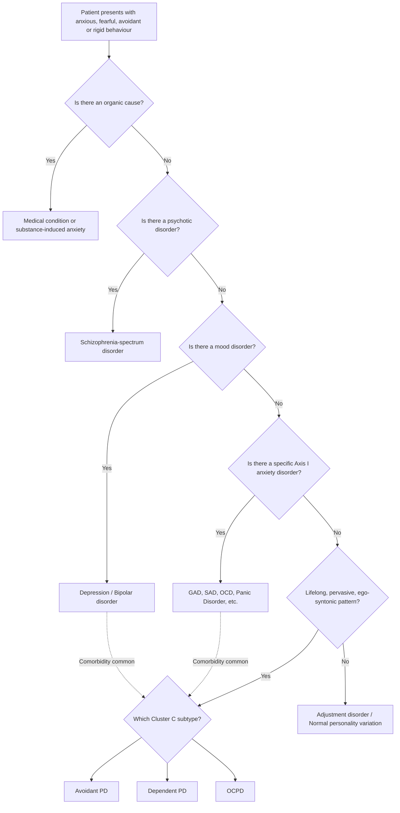

## Differential Diagnosis of Cluster C (Anxious) Personality Disorders

The differential diagnosis of Cluster C PDs is one of the trickiest areas in psychiatry, because Cluster C traits sit at the intersection of personality, anxiety disorders, mood disorders, and even psychotic/neurodevelopmental conditions. The key principle is this: **personality disorders are lifelong, pervasive, ego-syntonic patterns** — they are "who the person is" — whereas Axis I disorders have a **recognisable onset, differ from the premorbid state, and are typically ego-dystonic** [2]. However, comorbidity is the rule rather than the exception, so you must be comfortable holding two diagnoses simultaneously when appropriate.

Remember the **hierarchy of diagnosis** [4]: when symptoms can be explained by more than one diagnosis, the higher-order diagnosis takes precedence (organic → psychotic → mood → anxiety → personality). Treatment of the higher-order disorder often resolves lower-order symptoms, but not vice versa. A personality disorder diagnosis sits at the **bottom of the hierarchy** — you should only diagnose it when the pattern cannot be better explained by a condition higher in the hierarchy.

---

### Diagnostic Decision-Making Framework

---

### 1. Differentials Common to ALL Cluster C Personality Disorders

#### A. General Medical Conditions and Substance-Induced Anxiety

Before any psychiatric diagnosis, you must **exclude organic causes** of chronic anxiety [5]:

| Organic Cause | Why It Mimics Cluster C | How to Differentiate |
|---|---|---|
| **Thyrotoxicosis** | Autonomic arousal, tremor, restlessness, anxiety — may mimic the persistent tension of avoidant PD | TFTs; episodic or recent onset; physical signs (goitre, exophthalmos, tachycardia, weight loss) |
| **Phaeochromocytoma** | Episodic anxiety, autonomic storms | 24h urinary catecholamines/metanephrines; episodic rather than lifelong |
| **Hypoglycaemia** | Episodic anxiety, tremor, sweating | BGL; episodic, a/w fasting or insulin use |
| **Cardiac conditions (HF, arrhythmias, PE)** | Dyspnoea and anxiety | ECG, Echo, CTPA; recent onset, associated physical findings |
| **Temporal lobe epilepsy** | Episodic anxiety, déjà vu, depersonalisation | EEG; episodic, stereotyped |
| **Substance intoxication** (caffeine, stimulants, cannabis, sympathomimetics) | Anxiety, autonomic arousal | Temporal relationship with substance use; urine drug screen |
| **Substance withdrawal** (alcohol, benzodiazepines, opiates, caffeine, nicotine) | Anxiety, tremor, autonomic activation | History of substance use; temporal onset after cessation; resolves with time or re-administration |
| **Medication side effects** (antidepressants esp first 2 weeks, corticosteroids, T4, anticholinergics, antipsychotics causing akathisia) | Anxiety-like symptoms | Temporal relationship with medication initiation; drug history [5] |

<Callout title="Always Rule Out Organic First" type="error">
The hierarchy of diagnosis demands that you exclude organic disorders before diagnosing any psychiatric condition, including personality disorders. A middle-aged patient presenting with new "anxious personality features" should prompt investigation for organic causes — personality disorders do not have a new onset in middle age [4].
</Callout>

#### B. Adjustment Disorder

- **Adjustment disorder** develops **within 3 months of a stressor** and produces emotional/behavioural symptoms that cause distress and impairment but do **not meet criteria for a specific mood or anxiety disorder** [5]
- **Why it's confusing**: A Cluster C patient under stress may present with an exacerbation that looks like adjustment disorder. Conversely, a normal individual under stress may temporarily display avoidant, dependent, or rigid behaviours
- **How to differentiate**: Personality features should be a **lifetime pattern** of personality functioning, not just a reaction to a specific stressor. It is important to **understand the lifetime history of personality functioning** to decide whether a situational stress is merely unmasking a pre-existing PD or whether this is a new, time-limited reaction [6]

#### C. Depressive Disorders

- **Depression** is extremely commonly comorbid with all Cluster C disorders and must always be considered [5][7]
- **Why it's confusing**: 
  - Depression causes social withdrawal (mimics avoidant PD), indecisiveness and helplessness (mimics dependent PD), and psychomotor retardation with ruminative thinking (mimics OCPD rigidity)
  - The social isolation in depression is due to **anergia or anhedonia**, not fear of rejection [2]
- **How to differentiate**:
  - Depression has a **recognisable onset** and differs from premorbid personality
  - Depressive ruminations tend to be **mood-congruent** and focus on **self-criticism about past events**, guilt, worthlessness [5]
  - Look for **biological symptoms of depression**: early morning wakening, diurnal variation in mood, appetite/weight change, suicidal thoughts (uncommon in pure anxiety/PD) [5]
  - Cluster C features are **present before** the onset of depression and **persist after** mood recovery
  - **Note**: personality acts as a **pathoplastic factor** — it *colours* the presentation of depression (e.g., rumination and inhibition in depression with an obsessional personality) [2]

#### D. Other Personality Disorders (Cross-Cluster Differentials)

| Differential PD | Why It's Confusing | Key Differentiator |
|---|---|---|
| **Schizoid PD** (Cluster A) vs. Avoidant PD | Both socially isolated | Schizoid is **genuinely indifferent** to social relationships and does not crave connection; Avoidant **craves social relationships but is paralysed by fear of rejection** [1][2] |
| **Schizotypal PD** (Cluster A) vs. Avoidant PD | Both may have social withdrawal | Schizotypal has **magical thinking, unusual perceptual experiences, ideas of reference, vague/circumstantial thinking** — these odd/eccentric features are absent in avoidant PD [2] |
| **Borderline PD** (Cluster B) vs. Dependent PD | Both fear abandonment | Borderline responds to abandonment with **anger, self-harm, idealisation-devaluation splitting, impulsivity, chronic emptiness, identity disturbance**; Dependent responds with **submission, clinging, seeking another caregiver** [2]. Borderline has **frantic efforts to avoid abandonment** with dramatic, erratic behaviour; Dependent has **quiet, compliant efforts to maintain the relationship** |
| **Borderline PD** (Cluster B) vs. Avoidant PD | Both may avoid relationships | Borderline has **unstable, intense relationships** (they engage deeply then sabotage); Avoidant **never engages** in the first place. Borderline has **impulsivity** and **self-harm**; Avoidant does not [2] |
| **Narcissistic PD** (Cluster B) vs. OCPD | Both may appear rigid and controlling | Narcissistic's rigidity stems from **grandiosity and need for admiration**; OCPD's rigidity stems from **perfectionism and need for control/order**. Narcissistic craves recognition; OCPD craves correctness |
| **Paranoid PD** (Cluster A) vs. Avoidant PD | Both are guarded and distrustful | Paranoid PD involves **pervasive distrust and suspicion** that others are malicious; Avoidant PD involves **fear of being inadequate** and therefore rejected. The paranoid thinks "they are out to get me"; the avoidant thinks "I am not good enough for them" [2] |

---

### 2. Differentials Specific to Each Cluster C Disorder

#### A. Avoidant Personality Disorder — Specific Differentials

| Differential | Why It's Confusing | Key Differentiator |
|---|---|---|
| ***Social Anxiety Disorder (SAD / Social Phobia)*** | Both involve fear of negative evaluation and social avoidance [7][8] | SAD has a **recognisable onset**, is **ego-dystonic** ("I know this fear is excessive"), and fears are **focused on negative evaluation by others with avoidance limited to social situations** [2]. Avoidant PD is **pervasive**, **lifelong**, usually **without a recognisable onset**, and has a **broader avoidance pattern outside of social situations** [2]. They share some heritability and ~40-50% co-occur — some experts consider avoidant PD a severe variant of generalised social phobia [2] |
| **Agoraphobia** | Both involve avoidance of situations | Agoraphobia's focus is **fear of panic symptoms and unavailability of help/escape**; avoidant PD's focus is **fear of rejection and inadequacy** [2]. Agoraphobic avoidance persists even when alone; avoidant avoidance is specifically interpersonal |
| ***Separation anxiety disorder*** | Both may avoid social situations | In separation anxiety, the person feels **comfortable in social situations when the attachment figure is present** [2]; avoidant PD is uncomfortable in social situations regardless |
| ***Depression with social withdrawal*** | Both involve social isolation | Depression: isolation due to **anergia or anhedonia** — the avoidant patient often **wishes they could enter a situation but feels unable to do so due to fears** [2]; depressed patient often **lacks the energy or interest** |
| **PTSD** | Both may have avoidance behaviour | PTSD: history of **trauma**; avoidance is **limited to trauma-specific cues** [2]; avoidant PD: avoidance is pervasive across all interpersonal domains |
| **Lack of social skills / Schizophrenia-spectrum / Intellectual disability / ASD** | All may present with poor social functioning | These conditions are primarily due to **lack of social skills or cognitive deficits**; avoidant PD patients usually have **adequate social skills** but are **inhibited by fear** [2] |
| ***Paranoid disorders*** | Both involve interpersonal guardedness | Thorough MSE will generally uncover **delusions of persecution and of reference** in paranoid disorders [2]; avoidant PD has no psychotic features |
| ***Medical conditions (IBD, IBS)*** | Can cause significant anxiety and situational avoidance | Medical condition-related anxiety is **confined to fears related to the illness and not excessive** beyond that context [2] |

> **High Yield**: The avoidant PD vs. social anxiety disorder distinction is heavily tested. Remember: **avoidant PD = broader, lifelong, ego-syntonic pattern**; **SAD = specific social situations, recognisable onset, ego-dystonic**. They commonly co-occur and may share a spectrum.

#### B. Dependent Personality Disorder — Specific Differentials

| Differential | Why It's Confusing | Key Differentiator |
|---|---|---|
| **Borderline PD** | Both fear abandonment | BPD: **frantic efforts to avoid abandonment** with rage, self-harm, idealisation/devaluation, impulsivity, identity disturbance, chronic emptiness [2]. Dependent PD: submissive, clinging, compliant behaviour without the dramatic emotional instability. BPD reacts to abandonment with **externalising anger**; dependent PD reacts with **internalising helplessness** |
| **Separation anxiety disorder** (Axis I) | Both fear being alone | Separation anxiety has a **recognisable onset** and can occur at any age; dependent PD is a **lifelong pattern**. Separation anxiety specifically fears **separation from attachment figures**; dependent PD fears **being unable to care for self** more broadly |
| **Agoraphobia** | Both may be reluctant to go out alone | Agoraphobia: fear of **panic and unavailability of help**; dependent PD: fear of **being without a caregiver** — the dependent person may be fine going out if accompanied by their "strong other" |
| **Depression** | Both may present with indecisiveness, helplessness | Depression: recognisable onset, biological symptoms, suicidal ideation; dependent traits are lifelong and persist between depressive episodes |
| **Normal cultural dependence** | In some cultures (including Hong Kong/Chinese culture), interdependence and deference to elders is normative | Personality disorder diagnosis requires the pattern to cause **clinically significant distress or functional impairment** beyond cultural norms. Filial piety ≠ pathological dependence |
| **Histrionic PD** (Cluster B) | Both may seek reassurance from others | Histrionic PD: dramatic, exaggerated expressions of emotion, seductive behaviour, **attention-seeking** [2]; dependent PD: submissive, self-effacing, **care-seeking** |

> **High Yield**: When a patient with dependent PD presents with low mood, always ask: is this **comorbid depression** (treat the depression) or is this the **chronic distress of personality pathology**? The answer determines management — antidepressants for the former; psychotherapy for the latter (with caution about prescribing benzodiazepines given **liability to dependence** [1]).

#### C. OCPD (Anankastic PD) — Specific Differentials

| Differential | Why It's Confusing | Key Differentiator |
|---|---|---|
| ***OCD (Obsessive-Compulsive Disorder, Axis I)*** | Same name root, both involve orderliness/rigidity | **OCD**: **ego-dystonic** obsessions (intrusive, unwanted, irrational thoughts about contamination, harm, symmetry etc.) and **compulsions** (ritualised behaviours to reduce distress). Has a **recognisable onset**. Patient wants to stop [5]. **OCPD**: **ego-syntonic** personality traits (believes their perfectionism is right and proper). No true obsessions or compulsions. Lifelong pattern. Patient does not want to change [1]. However, ~25-30% of OCD patients also meet OCPD criteria — they can co-exist |
| ***GAD (Generalised Anxiety Disorder)*** | Both involve chronic worry and checking behaviours | GAD: worry is **pervasive** across multiple domains (finances, health, work) but the checking is **directly related to the feared outcome and not excessive/time-consuming** [5]. OCD compulsions are **ritualistic, rule-driven, and often unrelated to or clearly excessive relative to the feared outcome** [5]. OCPD: orderliness/checking is a **personality trait**, not driven by anxiety about a specific feared outcome. ***GAD is commonly comorbid with personality disorders including anankastic, paranoid, and avoidant*** [7] |
| **ASD (Autism Spectrum Disorder)** | Both rigid, rule-bound, inflexible | ASD: has **deficits in social communication and restricted, repetitive interests/behaviours** with **impaired theory of mind** [1]. OCPD: has **intact social cognition and theory of mind** but chooses rigidity and control. ASD is a neurodevelopmental condition present from early childhood; OCPD is a personality pattern |
| **Eating disorders** | Both may involve rigid control over behaviour | Eating disorders: rigidity is **specifically focused on food, weight, and body shape**. OCPD: rigidity is **pervasive across all life domains**. However, OCPD is associated with eating disorders as a comorbidity [1] |
| **Mania/Hypomania** (exclusion) | Workaholism may superficially resemble the productivity of hypomania | Mania: **episodic**, with increased energy, grandiosity, decreased need for sleep, flight of ideas [9]. OCPD: **stable, lifelong** pattern of working excessively; no mood elevation, no grandiosity, the person is not "enjoying" the work but driven by duty/perfectionism |
| **Depression** | OCPD patients may present with depression when their system fails | Depression has a recognisable onset; OCPD traits predate and outlast the depressive episode. **Ruminations in depression** tend to be mood-congruent (guilt, worthlessness) and not driven by need for order [5] |
| **Hoarding disorder** (separate Axis I diagnosis in DSM-5) | OCPD may feature hoarding behaviour | Hoarding disorder: excessive acquisition of and failure to discard items, with **significant clutter and distress**. If hoarding is the predominant feature and causes marked impairment, a separate diagnosis of hoarding disorder is warranted. In OCPD, hoarding is one feature among many (perfectionism, rigidity, etc.) |
| **Schizophrenia** | Rarely, rigid/perseverative behaviour | ***Psychosis occurs outside of personality functioning*** — look for hallucinations, delusions, formal thought disorder, negative symptoms. OCPD has no psychotic features [8] |

---

### 3. Differentiating Anxiety Symptoms Across Disorders — The "Theme of Anxiety" Approach

A very practical clinical approach from the senior notes: **noting the theme/focus of anxiety** helps reach the correct diagnosis [5]:

| Theme/Focus of Anxiety | Likely Diagnosis |
|---|---|
| **Worry about gaining weight** | Eating disorder |
| **Worry about having a serious illness** | Hypochondriacal disorder / Illness anxiety disorder |
| **Fear of being poisoned or killed** | Delusional beliefs (paranoid schizophrenia) |
| **Ruminatory thoughts of guilt or worthlessness** | Depression |
| **A/w obsessional thoughts or resisting a compulsion** | OCD |
| ***Separation or abandonment*** | ***Borderline PD, Dependent PD*** [5] |
| ***Being rejected or inadequate*** | ***Avoidant PD*** [5] |
| **Fear of scrutiny/embarrassment/critical evaluation** | Social anxiety disorder |
| **Fear of panic symptoms / unavailability of help** | Agoraphobia / Panic disorder |
| **Worries about multiple everyday concerns** | GAD |
| **Need for order, control, perfection** | OCPD (ego-syntonic) vs. OCD (ego-dystonic) |

<Callout title="The Theme of Anxiety Is Your Diagnostic Compass" type="idea">
When you're stuck differentiating, ask yourself: "What is this patient *actually* afraid of?" The content of the fear points you to the diagnosis. Rejection → avoidant PD. Being alone → dependent PD. Imperfection → OCPD. Intrusive irrational thoughts → OCD. Panic → panic disorder. Scrutiny → SAD. This single question often resolves the differential.
</Callout>

---

### 4. Comorbidity Considerations

Cluster C personality disorders are **highly comorbid** with Axis I disorders. This is not an accident — it reflects shared neurobiological substrates (amygdala hyperreactivity, CSTC loop dysfunction, serotonergic/noradrenergic dysregulation) [3]:

| Cluster C PD | Common Axis I Comorbidities |
|---|---|
| **Avoidant PD** | Social anxiety disorder (~40-50%), GAD, depression, substance use (self-medication) |
| **Dependent PD** | Depression, anxiety disorders, substance dependence (especially benzodiazepines — **caution for liability to dependence** [1]), adjustment disorder |
| **OCPD** | OCD (~25-30%), depression, eating disorders, GAD, body dysmorphic disorder |

***Two-thirds of GAD patients have other psychiatric diagnoses, including depression, other anxiety disorders, and personality disorders such as anankastic, paranoid, and avoidant*** [7].

The implication: **always screen for comorbid Axis I disorders in any Cluster C patient**, because:
1. Treatment of the Axis I disorder often produces significant improvement in functioning
2. Missing the Axis I diagnosis means missing a treatable condition
3. Personality disorder alone is much harder to treat

---

### 5. Key Differential Summary Table

| Feature | Avoidant PD | SAD | Dependent PD | BPD | OCPD | OCD | GAD | Depression | Schizoid PD |
|---|---|---|---|---|---|---|---|---|---|
| **Onset** | Lifelong | Recognisable | Lifelong | Adolescence/early adult | Lifelong | Recognisable | Recognisable | Recognisable | Lifelong |
| **Ego-syntonic?** | Partially | No | Partially | No | Yes | No | No | No | Yes |
| **Core fear** | Rejection | Scrutiny | Abandonment | Abandonment | Imperfection | Intrusive thoughts | Multiple worries | Worthlessness | None |
| **Social desire** | Craves it | Craves it | Craves caregiving | Intense, unstable | Indifferent | Normal | Normal | Reduced (anergia) | Indifferent |
| **Interpersonal style** | Withdrawing | Withdrawing in specific situations | Clinging | Dramatic, splitting | Controlling | Normal (may avoid triggers) | Worried | Withdrawn (low energy) | Detached |
| **Impulsivity** | No | No | No | Yes | No | No | No | No | No |
| **Self-harm** | No | No | No | Yes | No | No | No | Possible | No |
| **Psychotic features** | No | No | No | Transient | No | No | No | Possible (severe) | No |

---

<Callout title="High Yield Summary — Differential Diagnosis of Cluster C PDs">

1. **Always exclude organic causes first** (thyrotoxicosis, phaeochromocytoma, substance use, medications) — use the diagnostic hierarchy: organic → psychotic → mood → anxiety → personality [4].

2. **Avoidant PD vs. SAD**: Avoidant = lifelong, pervasive, broader avoidance; SAD = recognisable onset, situation-specific, ego-dystonic. They commonly co-occur [2].

3. **Avoidant PD vs. Schizoid PD**: Avoidant craves connection but fears rejection; Schizoid is genuinely indifferent [2].

4. **Dependent PD vs. BPD**: Both fear abandonment. Dependent responds with submission; BPD responds with anger, self-harm, splitting [2].

5. **OCPD vs. OCD**: OCPD = ego-syntonic personality traits (values perfectionism); OCD = ego-dystonic intrusive thoughts and rituals (distressed by them) [1][5].

6. **Theme of anxiety** is your diagnostic compass: rejection → avoidant; abandonment → dependent/BPD; imperfection → OCPD; intrusive thoughts → OCD; scrutiny → SAD [5].

7. **Comorbidity is the rule**: 2/3 of GAD patients have comorbid psychiatric diagnoses including personality disorders [7]. Always screen for depression, anxiety disorders, and substance use.

8. **Cultural context matters**: dependent traits may be culturally normative in Hong Kong; diagnose PD only when pattern causes distress/impairment beyond cultural norms.

</Callout>

---

<ActiveRecallQuiz
  title="Active Recall - Differential Diagnosis of Cluster C PDs"
  items={[
    {
      question: "A 30-year-old woman avoids all social gatherings because she fears being rejected and feels she is inferior to everyone else. She desperately wants friends but cannot bring herself to approach anyone. She says 'I've always been this way.' What is the most likely diagnosis, and what is the key differential you must exclude?",
      markscheme: "Most likely: Avoidant Personality Disorder (lifelong pattern, craves connection but fears rejection, feels inferior). Key differential: Social Anxiety Disorder (recognisable onset, ego-dystonic, situation-specific avoidance vs. pervasive pattern). They commonly co-occur. Also differentiate from Schizoid PD (does not crave social connection).",
    },
    {
      question: "How do you distinguish Dependent PD from Borderline PD when both patients report an intense fear of abandonment?",
      markscheme: "Dependent PD: responds to fear of abandonment with submission, clinging, compliance, seeks another caregiver immediately when relationship ends, no self-harm, no identity disturbance. Borderline PD: responds with anger, impulsivity, self-harm, idealisation-devaluation splitting, chronic emptiness, unstable identity, frantic dramatic efforts to avoid abandonment.",
    },
    {
      question: "A patient is extremely rigid, perfectionistic, and devoted to work at the expense of all relationships. He believes everyone should be equally organised and sees nothing wrong with his behaviour. His wife dragged him to clinic. OCD or OCPD? Explain your reasoning.",
      markscheme: "OCPD. Key features: ego-syntonic (he thinks his behaviour is correct and desirable, does not want to change), lifelong pattern, no true obsessions or compulsions, rigidity and perfectionism across all domains. OCD would be: ego-dystonic (distressed by intrusive thoughts), recognisable onset, ritualistic compulsions patient wishes to stop. They can co-exist but are distinct entities.",
    },
    {
      question: "Name the hierarchy of psychiatric diagnosis from highest to lowest priority. Why is this relevant to diagnosing personality disorders?",
      markscheme: "Hierarchy (top to bottom): Organic disorders, Psychotic disorders, Mood disorders, Anxiety disorders, Personality disorders. Relevance: personality disorder sits at the bottom -- you should only diagnose it when the pattern cannot be better explained by conditions higher in the hierarchy. Treatment of the higher-order disorder often resolves lower-order symptoms. Must exclude organic, psychotic, mood, and anxiety causes first.",
    },
    {
      question: "A patient with GAD also meets criteria for anankastic personality disorder. Is this possible? How common is psychiatric comorbidity in GAD?",
      markscheme: "Yes, this is possible and common. Two-thirds of GAD patients have other psychiatric diagnoses, including depression, other anxiety disorders, and personality disorders such as anankastic, paranoid, and avoidant. Personality disorders act as predisposing factors and colour the presentation of anxiety disorders. Both diagnoses can be held simultaneously when criteria for both are independently met.",
    },
  ]}
/>

## References

[1] Senior notes: ryanho-psych.md (Section 10.4: Cluster C Anxious Personality Disorders)
[2] Senior notes: ryanho-psych.md (Sections 10.1–10.3: Personality and Personality Disorders; Cluster A and B PD tables for cross-cluster comparison; Social phobia DDx section)
[3] Senior notes: ryanho-psych.md (Sections on anxiety neurocircuitry, CSTC loop, neurotransmitter roles)
[4] Senior notes: ryanho-psych.md (Hierarchy of diagnosis, page 4)
[5] Senior notes: ryanho-psych.md (Section 8.1.1: Approach to Anxiety; GAD differential diagnoses; OCD differential diagnoses; theme of anxiety table)
[6] Senior notes: ryanho-psych.md (Section on Adjustment disorder differential diagnoses)
[7] Lecture slides: GC 167. I feel very nervous Anxiety disorders.pdf (p30: Comorbidity for GAD)
[8] Lecture slides: GC 167. I feel very nervous Anxiety disorders.pdf (p27: Differential Diagnosis for Phobic Disorder)
[9] Senior notes: ryanho-psych.md (Section on D/dx of mania; Borderline PD vs. Bipolar disorder)
