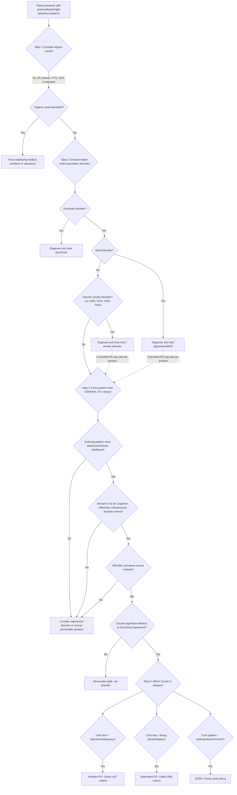

## Diagnostic Criteria, Diagnostic Algorithm, and Investigations

### Overarching Principles of Diagnosing Personality Disorders

Before looking at specific criteria for each Cluster C disorder, you need to understand the **general diagnostic framework** for personality disorders. Both DSM-5 and ICD-10 require you to first establish that a personality disorder exists at all, and *then* specify the subtype. Think of it as a two-step process:

**Step 1**: Does this patient meet **general criteria** for *any* personality disorder?
**Step 2**: Which **specific subtype** best describes the pattern?

Clinically, **clinicians often agree on the presence of a PD but disagree on the subtype** [2] — this reflects the considerable overlap between categories in the categorical system. This is why thorough, longitudinal assessment is essential.

---

### 1. General Diagnostic Criteria for Personality Disorders

#### DSM-5 General Criteria for Personality Disorder [2][10]

The DSM-5 requires ALL of the following to be met before a specific PD subtype is diagnosed:

| Criterion | Explanation | Why This Criterion Exists |
|---|---|---|
| **A. An enduring pattern** of inner experience and behaviour that **deviates markedly** from the expectations of the individual's culture, manifested in **≥2** of: **(1) Cognition** (ways of perceiving/interpreting self, others, events); **(2) Affectivity** (range, intensity, lability, appropriateness of emotional response); **(3) Interpersonal functioning**; **(4) Impulse control** | The pattern must be pervasive — not just in one domain. Requiring ≥2 areas ensures you're not just picking up a single symptom | This distinguishes PD from isolated traits or single-domain problems |
| **B. The enduring pattern is inflexible and pervasive** across a broad range of personal and social situations | The behaviour appears in multiple contexts — not just at work, or just with a partner | If it only appears in one context, consider a situational/adjustment problem |
| **C. Leads to clinically significant distress or impairment** in social, occupational, or other important areas of functioning | Personality traits only become a "disorder" when they cause suffering or dysfunction | This is the line between "personality style" and "personality disorder" |
| **D. The pattern is stable and of long duration**, with onset traceable to **at least adolescence or early adulthood** | PDs don't have a sudden onset in middle age — if they do, think organic | This separates PD from acquired conditions |
| **E. Not better explained by** another mental disorder | Must not be simply a manifestation of depression, psychosis, anxiety disorder, etc. | Hierarchy of diagnosis — PD sits at the bottom [4] |
| **F. Not attributable to** the physiological effects of a substance or another medical condition | Excludes substance-induced personality changes, brain injury, etc. | Always rule out organic first |

#### ICD-10 General Criteria (F60) [10]

The ICD-10 criteria are conceptually similar:

- Meet specific criteria for the disorder
- **Not attributable to gross brain damage** or another psychiatric disorder
- Pattern is **present from childhood or adolescence** and continues into adult life
- Pattern leads to **considerable personal distress** (though this may only become apparent late in its course)
- Pattern is usually (but not always) associated with significant problems in **occupational and social performance**

<Callout title="ICD-10 vs DSM-5 Key Differences for PDs" type="idea">
- ICD-10 uses the term **"anankastic"** for OCPD
- ICD-10 does **not** include narcissistic PD or schizotypal PD as personality disorders (schizotypal is under psychotic disorders in ICD-10) [2]
- ICD-11 (the current version) has moved to a **dimensional severity model** (mild/moderate/severe PD + trait domains: negative affectivity, detachment, dissociality, disinhibition, anankastia) — but for HKUMed exams, DSM-5 categorical subtypes remain the standard
</Callout>

---

### 2. Specific Diagnostic Criteria for Each Cluster C Disorder

#### A. Avoidant Personality Disorder (DSM-5 Criteria)

A **pervasive pattern of social inhibition, feelings of inadequacy, and hypersensitivity to negative evaluation**, beginning by early adulthood, as indicated by **≥4** of the following:

| # | Criterion | Pathophysiological Basis |
|---|---|---|
| 1 | **Avoids occupational activities** involving significant interpersonal contact because of fears of criticism, disapproval, or rejection | Amygdala hyperreactivity to social threat → avoidance as safety behaviour |
| 2 | **Unwilling to get involved** with people unless certain of being liked [1] | Need for certainty of acceptance before risking exposure — reflects catastrophic cognition about rejection |
| 3 | Shows **restraint within intimate relationships** because of the fear of being shamed or ridiculed | Even within established relationships, the fear of inadequacy persists |
| 4 | **Preoccupied with being criticised or rejected** in social situations [1] | Selective attentional bias toward negative social cues; CSTC loop ruminative worry [3] |
| 5 | **Inhibited in new interpersonal situations** because of feelings of inadequacy | Behavioural inhibition temperament manifesting in adulthood |
| 6 | Views self as **socially inept, personally unappealing, or inferior** to others [1] | Core negative self-schema established through childhood neglect/rejection [1] |
| 7 | **Unusually reluctant to take personal risks** or engage in new activities because they may prove embarrassing | Generalisation of social avoidance to any situation carrying risk of negative evaluation |

**ICD-10 (F60.6 Anxious/Avoidant PD)**: Requires persistent, pervasive feelings of tension and apprehension; belief of being socially inept/inferior/unappealing; excessive preoccupation with criticism/rejection; unwilling to become involved unless certain of acceptance; restricted lifestyle due to need for security; avoidance of social/occupational activities involving significant interpersonal contact.

#### B. Dependent Personality Disorder (DSM-5 Criteria)

A **pervasive and excessive need to be taken care of** that leads to **submissive and clinging behaviour** and fears of separation, beginning by early adulthood, as indicated by **≥5** of the following:

| # | Criterion | Pathophysiological Basis |
|---|---|---|
| 1 | **Difficulty making everyday decisions** without excessive advice and reassurance from others [1] | Never developed internal locus of control due to overprotective parenting; each decision triggers catastrophic anxiety |
| 2 | **Needs others to assume responsibility** for most major areas of their life | Core belief: "I am helpless and unable to function independently" |
| 3 | **Difficulty expressing disagreement** with others because of fear of loss of support or approval [1] | Disagreement is perceived as risking abandonment of the caregiving relationship |
| 4 | **Difficulty initiating projects or doing things on own** (due to lack of self-confidence rather than lack of motivation or energy) | Learned helplessness — distinguished from depression where difficulty is due to anergia |
| 5 | **Goes to excessive lengths to obtain nurturance and support** from others, even to the point of volunteering for unpleasant tasks [1] | The survival strategy of maintaining the caregiving relationship at any cost |
| 6 | **Feels uncomfortable or helpless when alone** because of exaggerated fears of being unable to care for self [1] | Anxious-ambivalent attachment → separation triggers overwhelming anxiety |
| 7 | **Urgently seeks another relationship** as a source of care and support when a close relationship ends [1] | Cannot tolerate existing without a caregiver; the specific person matters less than the caregiving function |
| 8 | **Unrealistically preoccupied with fears of being left** to take care of self [1] | Catastrophic cognition: "I will not survive alone" |

**ICD-10 (F60.7 Dependent PD)**: Requires encouraging or allowing others to make most important life decisions; subordination of own needs to those of others; unwillingness to make even reasonable demands on people one depends on; feeling uncomfortable or helpless when alone; preoccupation with fears of being abandoned; limited capacity to make everyday decisions without excessive advice and reassurance.

#### C. Obsessive-Compulsive (Anankastic) Personality Disorder (DSM-5 Criteria)

A **pervasive pattern of preoccupation with orderliness, perfectionism, and mental and interpersonal control**, at the expense of flexibility, openness, and efficiency, beginning by early adulthood, as indicated by **≥4** of the following:

| # | Criterion | Pathophysiological Basis |
|---|---|---|
| 1 | **Preoccupied with details, rules, lists, order, organisation, or schedules** to the extent that the major point of the activity is lost [1][2] | CSTC loop hyperactivity → inability to disengage from details; "can't see the forest for the trees" |
| 2 | Shows **perfectionism that interferes with task completion** (e.g., unable to finish a project because own overly strict standards are not met) | Paradox of perfectionism: the pursuit of the ideal prevents completion of the good enough |
| 3 | **Excessively devoted to work and productivity** to the exclusion of leisure activities and friendships [2] | Work is controllable and structured; leisure is "unproductive" and anxiety-provoking |
| 4 | **Overconscientious, scrupulous, and inflexible** about matters of morality, ethics, or values (not accounted for by cultural or religious identification) | Moral rigidity as extension of need for order; black-and-white thinking |
| 5 | **Unable to discard** worn-out or worthless objects even when they have no sentimental value | Difficulty letting go reflects intolerance of waste and need for control over possessions |
| 6 | **Reluctant to delegate** tasks or to work with others unless they submit to exactly the individual's way of doing things | Perfectionism + distrust of others' competence |
| 7 | Adopts a **miserly spending style** toward self and others; money viewed as something to be hoarded for future catastrophes | Money = security and control; parting with it creates anxiety |
| 8 | Shows **rigidity and stubbornness** [2] | Cognitive inflexibility; inability to adapt when rules are violated |

**ICD-10 (F60.5 Anankastic PD)**: Requires feelings of excessive doubt and caution; preoccupation with details, rules, lists, order; perfectionism interfering with task completion; excessive conscientiousness and scrupulousness; undue preoccupation with productivity to exclusion of pleasure and relationships; excessive pedantry and adherence to social conventions; rigidity and stubbornness; unreasonable insistence on others submitting to their way of doing things.

<Callout title="Threshold Differences" type="error">
Note the different thresholds:
- Avoidant PD: ≥4 of 7 criteria
- Dependent PD: ≥5 of 8 criteria
- OCPD: ≥4 of 8 criteria

The higher threshold for Dependent PD (5/8) reflects the need to distinguish pathological dependence from culturally normative interdependence — you need more features to be confident it's a disorder rather than a cultural pattern.
</Callout>

---

### 3. Side-by-Side Comparison: DSM-5 Criteria Summary

| Domain | Avoidant PD | Dependent PD | OCPD |
|---|---|---|---|
| **Threshold** | ≥4 of 7 | ≥5 of 8 | ≥4 of 8 |
| **Core pattern** | Social inhibition, inadequacy, hypersensitivity | Excessive need to be cared for, submissiveness | Orderliness, perfectionism, control |
| **Onset** | By early adulthood | By early adulthood | By early adulthood |
| **Cognition** | "I am inferior/inept" | "I am helpless without others" | "Everything must be perfect and under control" |
| **Affectivity** | Persistent tension, insecurity | Anxiety when alone | Restricted affect, frustration when disrupted |
| **Interpersonal** | Avoidant unless certain of acceptance | Clinging, submissive | Controlling, reluctant to delegate |
| **Impulse control** | Over-controlled (avoidance) | Under-autonomous | Over-controlled (rigid) |

---

### 4. Diagnostic Algorithm

The diagnosis of Cluster C personality disorders is **entirely clinical** — there is no blood test, brain scan, or biomarker. It relies on a **systematic, longitudinal assessment** of personality functioning. Here is the diagnostic algorithm:

---

### 5. Assessment Strategy — How to Gather the Information

Personality disorder diagnosis cannot be made in a single interview. It requires **longitudinal, multi-source data** [2]:

#### A. Comprehensive Psychiatric Assessment

The assessment should cover four key domains [2]:

| Domain | What to Assess | Why |
|---|---|---|
| **1. Source of distress** | Thoughts, emotions, behaviours, relationships — distress to **self and others** | The person may not see themselves as distressed, but their family/colleagues may |
| **2. Functional impairment** | Work, home, social circumstances | Determines whether threshold for "disorder" (vs. "style") is met |
| **3. Comorbid psychiatric illness** | Depression, anxiety disorders, substance use, OCD, eating disorders | Treat what's treatable — Axis I disorders often improve with treatment even if the PD persists |
| **4. Strengths and weaknesses** | Individual's assets, coping strategies, support network | Essential for treatment planning — build on what works |

#### B. Key History Components

| Component | Specific Focus for Cluster C | Rationale |
|---|---|---|
| **Developmental history** | Attachment style, parenting (overprotective? neglectful? authoritarian?), childhood temperament (shy? inhibited?), peer relationships, school performance [1] | Cluster C patterns originate in childhood — you need to establish the lifelong nature |
| **Longitudinal personality assessment** | Ask: "What have you been like as a person throughout your life? How would friends/family describe you?" Document patterns since adolescence | This is the single most important question — PDs are defined by enduring patterns, not current episodes |
| **Relationship history** | Pattern of forming/maintaining/ending relationships; romantic partners (dominant? abusive?); friendship patterns [1] | Avoidant: few close friends despite desire; Dependent: serial relationships with dominant partners; OCPD: controlling, critical of others |
| **Occupational history** | Job changes, conflicts with colleagues, reasons for leaving, work-life balance | Avoidant: may underachieve due to fear of criticism; Dependent: may not advance due to avoiding responsibility; OCPD: may be highly successful but at cost of all relationships |
| **Premorbid personality** | How were they before any presenting complaint? Has the current pattern always been present? | Distinguishes lifelong PD from acquired personality change or new-onset Axis I disorder [2] |
| **Collateral history** | From family, partner, friends, GP, previous medical records | Patients with PD often present at times of stress and **tend not to regard their own personality as inherently abnormal** [2] — collateral is essential |

#### C. Mental State Examination (MSE)

| MSE Component | Findings Suggestive of Cluster C PD |
|---|---|
| **Appearance/behaviour** | Avoidant: anxious, poor eye contact, reluctant to engage. Dependent: overly agreeable, defers to examiner. OCPD: formal, stiff, precise |
| **Speech** | Avoidant: soft, hesitant. Dependent: seeking reassurance. OCPD: circumstantial (excessive detail), pedantic |
| **Mood/affect** | Avoidant: tense, insecure. Dependent: anxious when asked to make decisions. OCPD: frustrated if structure disrupted |
| **Thought content** | Avoidant: preoccupied with rejection. Dependent: fears of abandonment. OCPD: need for order/control. **No psychotic features** (if present → consider other diagnoses) |
| **Cognition** | Usually intact — cognitive testing to exclude organic causes if indicated |
| **Insight** | PDs are typically **ego-syntonic** → insight may be limited. OCPD patients may have the least insight ("I'm not the problem, everyone else is disorganised") |
| **Judgement** | May be impaired in the sense that PD traits lead to poor decision-making, but for different reasons in each subtype |

<Callout title="Ego-Syntonicity and Insight">
The fundamental challenge of PD diagnosis is that the patient often doesn't think there's a problem — the traits feel like a natural part of who they are. This is especially true for OCPD (the patient thinks everyone else should be more organised). Avoidant and dependent patients may have slightly more insight because they experience suffering (loneliness, helplessness), but they attribute it to the world rather than themselves ("people are cruel" or "I just can't cope"). **Collateral history is therefore essential** [2].
</Callout>

---

### 6. Investigation Modalities

Personality disorders are **clinical diagnoses**. There is no definitive laboratory test, imaging study, or biomarker. However, investigations serve three important purposes:

1. **Exclude organic mimics** (Step 1 of the algorithm)
2. **Screen for comorbid conditions** (especially depression, substance use)
3. **Supplement clinical assessment** with structured tools

#### A. Investigations to Exclude Organic Causes [5]

| Investigation | Purpose | Key Findings That Would Redirect Diagnosis |
|---|---|---|
| **Complete blood count (CBC)** | General screen; anaemia can cause fatigue mimicking depression/dependence | Anaemia, macrocytosis (alcohol use) |
| **Thyroid function tests (TFTs)** | Thyrotoxicosis mimics chronic anxiety; hypothyroidism mimics depression | ↑T4/T3 + ↓TSH (hyperthyroid); ↓T4 + ↑TSH (hypothyroid) |
| **Liver function tests (LFTs)** | Screen for alcohol misuse (comorbid in Cluster C, especially avoidant PD as self-medication) | ↑GGT, ↑AST:ALT ratio > 2 suggestive of alcoholic liver disease |
| **Fasting glucose / HbA1c** | Hypoglycaemia causes episodic anxiety | Low glucose correlating with anxiety episodes |
| **Renal function (U&E)** | Baseline; electrolyte disturbance can cause anxiety | Hypokalaemia, hyponatraemia can cause neuropsychiatric symptoms |
| **Calcium** | Hypercalcaemia can cause psychiatric symptoms | ↑Ca²⁺ → consider hyperparathyroidism |
| **Urine drug screen (UDS)** | Exclude substance intoxication/withdrawal as cause of anxiety symptoms | Positive for stimulants, cannabis, benzodiazepines, opioids [5] |
| **ECG** | Exclude cardiac arrhythmia causing anxiety/palpitations; baseline before psychotropics | Arrhythmias, prolonged QTc (relevant if prescribing certain medications) |
| **MRI brain** (if indicated) | Only if new personality change in middle age or neurological signs → consider frontal lobe pathology, temporal lobe epilepsy [5] | Frontal lobe mass/lesion (causes disinhibition/personality change); temporal lobe abnormality |

> **Key principle**: These investigations are done to **exclude organic causes**, not to diagnose the personality disorder itself. If all investigations are normal and the clinical picture fits, you can proceed with confidence to a personality disorder diagnosis.

#### B. Structured Assessment Tools (Psychological Testing)

These supplement clinical judgement — they do **not** replace it:

| Tool | Type | What It Measures | Clinical Utility |
|---|---|---|---|
| **Structured Clinical Interview for DSM-5 Personality Disorders (SCID-5-PD)** | Semi-structured interview | Systematic assessment of all DSM-5 PD criteria | Gold standard for research; ensures all criteria are systematically covered; time-consuming (~1-2 hours) |
| **International Personality Disorder Examination (IPDE)** | Semi-structured interview | Maps to both ICD-10 and DSM criteria | Cross-culturally validated; useful in research and complex cases |
| **Personality Diagnostic Questionnaire (PDQ-4+)** | Self-report screening | Screens for all PD subtypes | High sensitivity but low specificity (many false positives) — useful as a screening tool, not for definitive diagnosis |
| **Millon Clinical Multiaxial Inventory (MCMI-IV)** | Self-report | Personality styles and clinical syndromes | Provides dimensional scores; useful for treatment planning |
| **Minnesota Multiphasic Personality Inventory (MMPI-2)** | Self-report | Dimensional personality assessment [2] | The classic dimensional approach — measures traits on continua rather than categorical subtypes |
| **NEO Personality Inventory (NEO-PI-R)** | Self-report | Five-Factor Model traits (Neuroticism, Extraversion, Openness, Agreeableness, Conscientiousness) | Cluster C: expect high Neuroticism; Avoidant: low Extraversion; Dependent: high Agreeableness; OCPD: extremely high Conscientiousness |
| **PHQ-9 / GAD-7** | Self-report screening | Depression (PHQ-9) and anxiety (GAD-7) severity | Essential to screen for comorbid depression and anxiety — these are treatable and common [7] |
| **AUDIT / DAST** | Self-report screening | Alcohol (AUDIT) and drug (DAST) misuse | Screen for substance use — patients with Cluster C PDs may self-medicate with alcohol or benzodiazepines |

#### C. Interpretation of Key Findings — Putting It Together

| Finding | Interpretation | Action |
|---|---|---|
| All organic investigations normal + lifelong pattern of anxious/rigid behaviour + ≥2 domains affected + distress/impairment | **Supports personality disorder diagnosis** | Proceed to specific subtype determination using DSM-5/ICD-10 criteria |
| Abnormal TFTs | Thyroid disease may be contributing to or fully explaining the anxiety | Treat thyroid condition first; reassess personality after thyroid is euthyroid |
| Positive UDS | Substance use may be causing or exacerbating the presentation | Address substance use first; reassess personality pattern during sustained sobriety |
| PHQ-9 ≥ 10 or GAD-7 ≥ 10 | Comorbid depression or anxiety disorder | Can hold both diagnoses — treat the Axis I disorder (SSRIs, psychotherapy) AND manage the PD |
| New personality change after age 40 with no prior history | Strongly suspect organic cause | MRI brain, neurological workup — consider frontal lobe lesion, early dementia, cerebrovascular disease |
| High MMPI Neuroticism + low Extraversion + structured interview positive for ≥4/7 avoidant criteria | Consistent with Avoidant PD | Formulate and plan management |
| Collateral from partner: "She can never make a decision, always needs me to choose for her, has been like this since I met her 15 years ago" | Supports Dependent PD if consistent with clinical assessment | Corroborate with longitudinal personal history |

#### D. Special Consideration — 'Secondary' Personality Disorder [10]

If the personality change is acquired (not lifelong), consider **secondary personality disorder due to**:

| Cause | ICD-10 Code | Criteria |
|---|---|---|
| **Organic disease of brain** (encephalitis, head injury, tumour) | F07: Personality change due to organic disease of brain | Clear temporal relationship with neurological insult |
| **Severe mental disorder** (especially schizophrenia) | F62.1: Enduring personality change after psychiatric illness | Lasted ≥2 years, clearly related to experience of illness, not present before [10] |
| **Exceptionally severe stressful experiences** (hostage, torture, prolonged captivity) | F62.0: Enduring personality change after catastrophic experience | Lasted ≥2 years, following extreme stressful experience; may follow PTSD but considered distinct [10] |

These are **not** Cluster C personality disorders — they represent acquired personality changes secondary to identifiable causes. The key question is always: **"Was this pattern present before the event?"**

---

### 7. Diagnostic Challenges and Pitfalls

| Challenge | Explanation | How to Manage |
|---|---|---|
| **Overlap between subtypes** | Patients often meet criteria for >1 PD subtype (e.g., avoidant + dependent; OCPD + avoidant) | Diagnose the most prominent pattern; acknowledge comorbid PD traits. DSM-5 allows multiple PD diagnoses |
| **Comorbid Axis I disorders** | Depression, anxiety disorders, OCD, substance use all commonly co-occur and may mask or amplify PD features | Treat the Axis I disorder first, then reassess; PD traits should be present even during well periods |
| **Cultural considerations** | Dependent traits may be culturally normative in collectivist cultures (e.g., Hong Kong Chinese culture); OCPD-like dedication to work may be culturally reinforced | DSM-5 Criterion A requires deviation from **individual's cultural expectations**; assess against the patient's own cultural backdrop |
| **Ego-syntonicity** | Patients may not see the problem, especially OCPD | Rely on collateral history, functional impairment, and distress to others (social criterion) [2] |
| **Age of assessment** | PD diagnosis is generally avoided in children and adolescents (personality still developing), though DSM-5 allows it if pattern present for ≥1 year (except antisocial PD which requires age ≥18) | In adolescents, describe traits rather than diagnosing PD; reassess in early adulthood |
| **Retrospective bias** | Patients in a depressive episode may overestimate the severity/duration of personality traits | Assess when patient is not in acute crisis; use collateral sources; review longitudinal records |

<Callout title="The Practical Bottom Line for Exams">
Personality disorders are **clinical diagnoses** made through careful longitudinal history, collateral information, and mental state examination. Investigations exist to **exclude organic causes** and **screen for comorbidities**, not to diagnose the PD itself. The assessment should always cover: (1) source of distress to self and others, (2) functional impairment, (3) comorbid psychiatric illness, and (4) strengths and weaknesses [2]. Always apply the diagnostic hierarchy: exclude organic → psychotic → mood → anxiety conditions first [4].
</Callout>

---

<Callout title="High Yield Summary — Diagnostic Criteria and Investigations">

**General PD criteria (DSM-5)**: Enduring pattern deviating from culture in ≥2 of (cognition, affectivity, interpersonal, impulse control); inflexible and pervasive; causes distress/impairment; stable since adolescence/early adulthood; not better explained by another disorder or substance.

**Specific thresholds**: Avoidant ≥4/7 (social inhibition, inadequacy, hypersensitivity); Dependent ≥5/8 (need to be cared for, submissive, clinging); OCPD ≥4/8 (orderliness, perfectionism, control).

**Diagnosis is clinical**: No biomarker exists. Key tools: longitudinal psychiatric history, collateral informant history, MSE, structured interviews (SCID-5-PD, IPDE), self-report screens (PDQ-4+, NEO-PI-R, MMPI-2).

**Investigations are for exclusion**: TFTs (thyroid), glucose (hypoglycaemia), UDS (substances), LFTs (alcohol), CBC/U&E/Ca (general screen), ECG (cardiac/baseline), MRI brain (only if acquired personality change suspected).

**Screen for comorbidity**: PHQ-9 (depression), GAD-7 (anxiety), AUDIT (alcohol) — Cluster C PDs are highly comorbid with Axis I disorders.

**Secondary PD**: New personality change after brain injury, severe psychiatric illness, or catastrophic experience — classified differently under ICD-10 F07/F62.

</Callout>

---

<ActiveRecallQuiz
  title="Active Recall - Diagnostic Criteria, Algorithm and Investigations"
  items={[
    {
      question: "List the 6 DSM-5 general criteria (A-F) that must be met before diagnosing ANY personality disorder.",
      markscheme: "A: Enduring pattern deviating from cultural expectations, in ≥2 of cognition/affectivity/interpersonal functioning/impulse control. B: Pattern is inflexible and pervasive. C: Causes clinically significant distress or impairment. D: Stable and of long duration, onset by adolescence/early adulthood. E: Not better explained by another mental disorder. F: Not attributable to substance or medical condition.",
    },
    {
      question: "What are the diagnostic thresholds for each Cluster C personality disorder in DSM-5?",
      markscheme: "Avoidant PD: ≥4 of 7 criteria (social inhibition, inadequacy, hypersensitivity to negative evaluation). Dependent PD: ≥5 of 8 criteria (excessive need to be cared for, submissive, clinging, fear of separation). OCPD: ≥4 of 8 criteria (orderliness, perfectionism, mental and interpersonal control). Dependent PD has the highest threshold (5/8) to distinguish from culturally normative dependence.",
    },
    {
      question: "Name four key areas that must be covered in any personality disorder assessment, and explain why collateral history is essential.",
      markscheme: "Four areas: (1) Source of distress to self and others, (2) Functional impairment at work/home/social, (3) Comorbid psychiatric illness, (4) Strengths and weaknesses. Collateral history is essential because PD traits are often ego-syntonic -- patients tend not to regard their personality as abnormal, especially OCPD. Collateral provides longitudinal perspective and objective view of impairment.",
    },
    {
      question: "A 55-year-old man with no prior psychiatric history develops rigid, perfectionistic, and controlling behaviour over 6 months. What should you suspect and what investigation is most important?",
      markscheme: "Suspect secondary/acquired personality change due to organic brain disease, NOT OCPD (which is lifelong, onset by early adulthood). Most important investigation: MRI brain to exclude frontal lobe lesion (tumour, cerebrovascular disease) or other structural pathology. Also consider TFTs, neurological examination. ICD-10 would classify as F07 'Personality change due to organic disease of brain'.",
    },
    {
      question: "What is the role of investigations in diagnosing personality disorders? Name 3 key investigations and what they exclude.",
      markscheme: "Role: investigations are for EXCLUDING organic mimics and screening for comorbidities, NOT for diagnosing the PD itself (which is a clinical diagnosis). Three key investigations: (1) TFTs -- exclude thyrotoxicosis causing anxiety or hypothyroidism causing depression-like features; (2) Urine drug screen -- exclude substance intoxication/withdrawal; (3) PHQ-9/GAD-7 -- screen for comorbid depression and anxiety disorders which are treatable.",
    },
  ]}
/>

## References

[1] Senior notes: ryanho-psych.md (Section 10.4: Cluster C Anxious Personality Disorders)
[2] Senior notes: ryanho-psych.md (Section 10.1: Personality and Personality Disorders — diagnostic approaches, assessment, general principles; Cluster classification table)
[3] Senior notes: ryanho-psych.md (Sections on anxiety neurocircuitry, CSTC loop, neurotransmitter roles)
[4] Senior notes: ryanho-psych.md (Hierarchy of diagnosis, page 4)
[5] Senior notes: ryanho-psych.md (Section 8.1.1: Approach to Anxiety — organic causes, substance-induced, secondary to medications)
[7] Lecture slides: GC 167. I feel very nervous Anxiety disorders.pdf (p30: Comorbidity for GAD)
[10] Senior notes: ryanho-psych.md (Section 10.1: Diagnostic criteria ICD-10/DSM-5 for PD; Section on secondary personality disorder F62/F07)
