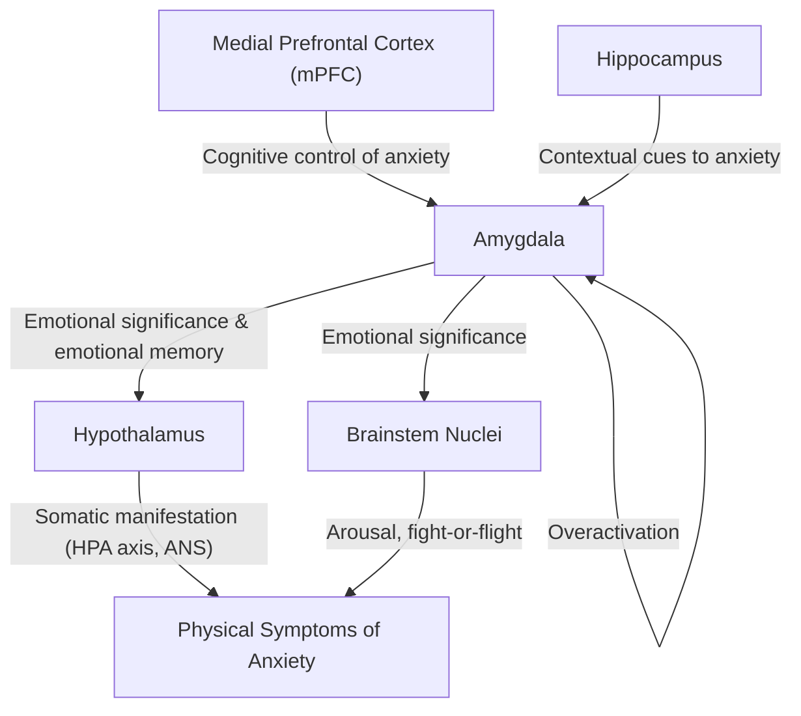

## Definition

Personality disorders (PDs) are **enduring patterns** of perceiving, thinking about, and relating to both self and environment that are **persistently inflexible and maladaptive**, **stable over time**, and cause **significant personal distress and/or functional impairment** [1][2]. Unlike psychiatric disorders where behaviours differ from the premorbid state, personality disorder behaviours are **present throughout adult life** — they are who the person *is*, not something that happened *to* them.

Cluster C personality disorders are grouped under the descriptor **"anxious or fearful"** [2]. The cluster comprises three disorders:

1. **Avoidant (Anxious) Personality Disorder** — the core theme is *fear of rejection and inadequacy*
2. **Dependent Personality Disorder** — the core theme is *excessive need to be cared for*
3. **Obsessive-Compulsive (Anankastic) Personality Disorder (OCPD)** — the core theme is *orderliness, perfectionism, and control*

The word **"anankastic"** comes from the Greek *ananke* (ἀνάγκη) meaning "necessity" or "compulsion" — fitting for a personality preoccupied with order and rigid adherence to rules.

<Callout title="Cluster C vs. Axis I Anxiety Disorders" type="error">
A very common exam mistake is conflating Cluster C personality disorders with anxiety disorders (GAD, panic disorder, social anxiety disorder, OCD). The key difference: personality disorders are **ego-syntonic** (the person sees the traits as part of themselves, not as an illness) and are **lifelong patterns** with no clear onset. Anxiety disorders are **ego-dystonic** (the person recognises something is wrong) and typically have a recognisable onset. In practice, there is enormous overlap and comorbidity — but the distinction matters for diagnosis and management.
</Callout>

---

## Epidemiology

### General PD Epidemiology
- Estimated overall PD prevalence: **~11%** in general population [2]
- Generally more common in: **males, younger age, poorly educated, unemployed** [2]

### Cluster C–Specific Epidemiology

| Disorder | Prevalence | Sex Ratio | Key Associations |
|---|---|---|---|
| **Avoidant PD** | **2.36%** | M = F | Behavioural inhibition temperament; childhood emotional neglect; peer group rejection [1] |
| **Dependent PD** | **0.49%** | **F > M** | Heritability 0.55–0.72; overprotective/authoritarian parenting; early traumatic experiences [1] |
| **OCPD (Anankastic PD)** | **2.1–7.9%** | **M > F (2:1)** | Asperger's syndrome; eating disorders; genetics (DRD3 gene); overprotective/over-involved parenting [1] |

A few points worth noting:

- **OCPD is the most prevalent personality disorder** in community samples, with estimates reaching up to 7.9%. This is much higher than OCD (the Axis I disorder), which sits around 1–3%.
- **Avoidant PD** shares significant genetic overlap with **social anxiety disorder (SAD)** — twin studies suggest shared heritability, and many patients carry both diagnoses [2].
- **Dependent PD** has the lowest prevalence of the three but carries a disproportionate burden because of vulnerability to abusive relationships and inability to function independently.

### Hong Kong Context
- In Hong Kong's ageing population and high-pressure academic/work culture, Cluster C traits (particularly avoidant and obsessive-compulsive features) are commonly encountered, though formal epidemiological studies specific to HK are limited.
- The strong emphasis on family interdependence in Chinese culture can make **dependent PD** harder to diagnose — cultural norms of filial piety and family-centric decision-making must be distinguished from pathological dependency.
- Similarly, **OCPD** traits such as devotion to work and orderliness may be culturally reinforced in Hong Kong's competitive environment, requiring careful assessment of whether these traits cause genuine distress or impairment.

---

## Risk Factors

Understanding risk factors requires appreciating the **biopsychosocial model** of personality development [2]:

### Biological Factors

1. **Genetics**
   - Twin studies show **35–50% heritability** for personality traits overall [2]
   - Personality is a **cumulative effect of multiple genes**, each accounting for a small effect, with some overlapping with psychiatric disorders (e.g., neuroticism gene variants overlap with depression) [2]
   - **Dependent PD**: particularly high heritability (**0.55–0.72**) [1]
   - **OCPD**: associated with **DRD3** (dopamine receptor D3) gene polymorphisms [1] — dopamine is involved in reward processing and behavioural rigidity, so abnormalities here may underpin the inflexible, control-seeking behaviour

2. **Temperament**
   - **Behavioural inhibition** — the inborn tendency to be timid, shy, and withdrawn in novel situations — is specifically associated with **avoidant PD** [1][2]
   - This temperament is observable in young infants as preliminary differences in behavioural patterns (sleep/waking cycles, intensity of emotions) and forms the basis of later personality development [2]
   - Behaviourally inhibited infants show **withdrawal, crying, and elevated cortisol** in response to unfamiliar objects or people — this maps directly onto the adult avoidant pattern of social withdrawal due to fear of negative evaluation [2]

3. **Neurobiology (linking to anxiety circuitry)**
   - The **amygdala-based neurocircuit for anxiety** is relevant to all Cluster C disorders [3]:
     - **Amygdala**: registers emotional significance of stimuli and develops emotional memory
     - **Medial prefrontal cortex**: cognitive control and manifestation of anxiety
     - **Hippocampus**: provides contextual cues to anxiety
     - **Hypothalamus and brainstem nuclei**: somatic manifestation of anxiety
   - In Cluster C disorders, there is likely a **chronic low-grade overactivation** of this fear circuitry, making the individual persistently anxious and avoidant
   - **Neurotransmitters involved**: 5-HT (serotonin), GABA, noradrenaline, dopamine, glutamate [3]
   - **Neuroticism** (easily anxious, prone to negative affect) and **anxiety sensitivity** (catastrophic cognition regarding bodily sensations) are personality factors that predispose to anxiety-related psychopathology [2][3]

### Psychological Factors

1. **Childhood experiences**
   - **Avoidant PD**: childhood **emotional neglect** and **peer group rejection** [1] — a child who is consistently ignored or rejected learns that social contact is dangerous and develops the core belief "I am inadequate and others will reject me"
   - **Dependent PD**: **overprotective and authoritarian parenting** + **early traumatic experiences** [1] — overprotective parenting prevents the child from developing autonomous coping skills; authoritarian parenting teaches the child that their own decisions are wrong; trauma creates a sense of helplessness
   - **OCPD**: **overprotective or over-involved parenting** [1] — parents who micromanage everything teach the child that the world is controllable and that perfection is expected; alternatively, trauma may trigger a need for control as a coping mechanism

2. **Attachment theory**
   - **Early insecure or anxious attachment** with mother results in **later difficulty in forming relationships** [2]
   - Avoidant PD → likely maps to **anxious-avoidant attachment** (learned that caregivers are unreliable, so avoids closeness)
   - Dependent PD → likely maps to **anxious-ambivalent attachment** (learned that caregivers are inconsistent, so clings desperately)
   - OCPD → may relate to **insecure attachment** with compensatory control-seeking behaviour

3. **Psychoanalytic theories**
   - Freud's model: failure of resolution of psychosexual conflicts can explain some personality traits [2]
   - OCPD was classically linked to fixation at the **anal stage** (control, orderliness, stubbornness — the "anal-retentive" personality)
   - Erikson's developmental stages are relevant [2]:
     - **Autonomy vs. Shame and Doubt** (ages 1–3): failure here → dependent traits, shame → avoidant traits
     - **Industry vs. Inferiority** (ages 6–12): failure here → feelings of inadequacy → avoidant traits
     - **Identity vs. Confusion** (ages 12–19): unresolved → difficulty with independent self-concept → dependent traits

4. **Cognitive theories**
   - **Cognitive biases** are central to maintaining Cluster C patterns [3]:
     - Avoidant PD: attentional bias toward potentially threatening social stimuli, overestimation of likelihood of rejection
     - Dependent PD: catastrophic beliefs about being alone ("I cannot survive without someone to take care of me")
     - OCPD: intolerance of uncertainty, perfectionism ("If I am not perfect, everything will fall apart")

### Social Factors

- **Early adverse experiences**: more common in those who develop anxiety-related psychopathology [3]
- **Parenting style**: overprotection and lack of emotional warmth predispose to anxiety traits [3]
- **Peer relationships**: peer rejection in childhood is specifically linked to avoidant PD [1]

---

## Anatomy and Function (Neuroanatomy of Personality and Anxiety)

To understand *why* Cluster C individuals are perpetually anxious, we need to understand the brain circuits involved:

### The Amygdala-Based Fear Circuit

- In a healthy individual, the **mPFC** exerts **top-down inhibition** on the amygdala → "I see a spider, but I know it's harmless, so I'm okay"
- In Cluster C personalities, this top-down regulation is **chronically impaired** → the amygdala fires excessively in response to perceived social threats, uncertainty, or loss of control [3]

### The Cortico-Striato-Thalamo-Cortical (CSTC) Loop

- **Worry** (a central feature of all Cluster C disorders) is mediated by the **CSTC loop** [3]:
  - Arises from the **dorsolateral prefrontal cortex (DLPFC)** → passes through **striatum** → **thalamus** → back to **DLPFC**
  - This loop accounts for **recurrent, ruminative thoughts** — the obsessive worry about rejection (avoidant), abandonment (dependent), or imperfection (OCPD)
  - Modulated by **5-HT, GABA, dopamine, noradrenaline, and glutamate** [3]

### Neurotransmitter Roles

| Neurotransmitter | Role in Anxiety | Clinical Relevance |
|---|---|---|
| **Serotonin (5-HT)** | Innervates amygdala and CSTC circuit; signals presence of anxiety-producing stimuli but restrains behavioural responses [3] | SSRIs/SNRIs effective for comorbid anxiety/depression |
| **Noradrenaline (NA)** | Mediates autonomic response of anxiety; triggers arousal [3] | SNRIs can downregulate NA receptors → anxiolysis |
| **GABA** | Principal inhibitory NT; suppresses amygdala and CSTC circuits [3] | Benzodiazepines enhance GABA — but **caution in dependent PD** due to addiction liability [1] |
| **Dopamine (DA)** | Involved in reward processing and behavioural flexibility | DRD3 polymorphisms associated with OCPD [1] |
| **Glutamate** | Principal excitatory NT; excess → overactivation of fear circuits [3] | α₂δ ligands (gabapentin, pregabalin) reduce glutamate release |

---

## Etiology and Pathophysiology (By Disorder)

### 1. Avoidant (Anxious) Personality Disorder

**Core pathology**: A deeply ingrained belief of personal inadequacy combined with hypersensitivity to negative evaluation, leading to pervasive social avoidance despite a genuine desire for connection.

**Pathophysiological model**:
- **Genetic predisposition** (shared heritability with social anxiety disorder) → **behavioural inhibition temperament** → child is naturally timid and shy
- **Childhood emotional neglect + peer rejection** [1] → reinforces belief "I am not good enough, people will reject me"
- **Amygdala hyperreactivity** to social threat stimuli → **exaggerated fear response** to any hint of criticism or disapproval
- **Impaired mPFC regulation** → cannot downregulate the fear response → avoidance becomes the default coping strategy
- **Cognitive biases**: selective attention to negative social cues, overestimation of probability and cost of rejection
- Unlike social anxiety disorder (which fears specific social situations), avoidant PD is a **pervasive pattern across all interpersonal domains** without a clear onset [2]

### 2. Dependent Personality Disorder

**Core pathology**: A pervasive and excessive need to be taken care of, stemming from a deep fear of being unable to cope independently, leading to submissive and clinging behaviour.

**Pathophysiological model**:
- **High heritability (0.55–0.72)** [1] → genetic predisposition to anxiety and low autonomy
- **Overprotective/authoritarian parenting** [1] → child never develops self-efficacy ("I can handle this on my own")
- **Early traumatic experiences** [1] → reinforces helplessness and the belief that the world is dangerous without a protector
- **Anxious-ambivalent attachment** → child learns that caregivers are inconsistent → develops clinging behaviour to ensure proximity
- **Erikson's developmental failure**: failure at the **Autonomy vs. Shame and Doubt** stage (ages 1–3) → the child never develops a sense of autonomous will [2]
- **Cognitive distortions**: "I am helpless", "I cannot make decisions", "I will be abandoned if I disagree"
- This creates a self-reinforcing cycle: dependence → never developing coping skills → reinforced dependence

### 3. Obsessive-Compulsive (Anankastic) Personality Disorder

**Core pathology**: A pervasive preoccupation with orderliness, perfectionism, and mental/interpersonal control, at the expense of flexibility, openness, and efficiency.

**Pathophysiological model**:
- **Genetics**: DRD3 (dopamine receptor D3) polymorphisms [1] — dopamine dysfunction may underpin reward-seeking through control and order rather than through pleasure
- **Overprotective/over-involved parenting** [1] → child learns that the environment must be tightly controlled to be safe
- **Trauma as trigger** [1] → traumatic events create a sense of chaos → compensatory need for control and order
- **CSTC loop hyperactivity** → ruminative, perfectionist thinking patterns that the individual cannot disengage from [3]
- **Psychoanalytic theory**: fixation at the **anal stage** of psychosexual development → anal-retentive traits (orderliness, parsimony, obstinacy)
- **Cognitive distortions**: "If I don't control everything perfectly, catastrophe will ensue", "Making mistakes is intolerable"

<Callout title="OCPD ≠ OCD — A Critical Distinction" type="error">
This is one of the most tested distinctions in psychiatry exams:
- **OCD** (Axis I): patient has **ego-dystonic** obsessions (they know the thoughts are irrational and unwanted) and compulsions (rituals performed to relieve distress). There is a recognisable onset. The patient wants to stop.
- **OCPD** (Axis II): patient has **ego-syntonic** traits (they believe their perfectionism and control are reasonable and desirable). There is no clear onset — it's "who they are". They don't want to change because they think everyone else should be more organised.
- Overlap: ~25–30% of OCD patients also meet criteria for OCPD, but they are distinct entities.
</Callout>

---

## Classification

### DSM-5 Classification

Cluster C falls under the **categorical approach** to personality disorders in DSM-5 [2]:

| Cluster | Descriptor | Disorders |
|---|---|---|
| A | Odd, eccentric | Paranoid, Schizoid, Schizotypal |
| B | Dramatic, emotional, erratic | Antisocial, Borderline, Histrionic, Narcissistic |
| **C** | **Anxious, fearful** | **Avoidant, Dependent, Obsessive-Compulsive (Anankastic)** |

### ICD-10 vs. DSM-5

- **ICD-10** includes all Cluster C disorders but uses the term **"anankastic personality disorder"** instead of OCPD [2]
- **ICD-10** does *not* include narcissistic PD or schizotypal PD as personality disorders (schizotypal is classified under psychotic disorders in ICD-10) [2]
- **ICD-11** (current) has moved to a **dimensional model** with severity levels (mild, moderate, severe personality disorder) and trait domains — this is a major shift from categorical subtypes. However, for exam purposes, the categorical DSM-5/ICD-10 classification remains the standard framework.

### Dimensional vs. Categorical Approaches [2]

| Dimensional Approach | Categorical Approach |
|---|---|
| PDs differ from normal population only in degree | Assumes discrete PD categories exist |
| Maladaptive traits as extreme end of continuum | Widely used in DSM-5 and ICD-10 |
| Predominantly used in research (impractical clinically) | Considerable overlap of traits between categories |
| Example: Minnesota Multiphasic Personality Inventory (MMPI) | Clinicians often agree PD is present but disagree on subtype |

### Statistical vs. Social Criteria for Defining Disorders [2]

| Statistical Criterion | Social Criterion |
|---|---|
| Abnormal personalities defined as quantitative variations from normal | Abnormality defined as propensity for the individual or other people to suffer |
| Dividing line by cut-off score on appropriate measure | Subjective, lacks precision but more appropriate for clinical setting |

---

## Clinical Features

### General Approach to Personality Disorder Assessment [2]

Before diving into specific Cluster C features, remember that the clinical assessment of any PD should cover:

1. **Source of distress** — thoughts, emotions, behaviour, relationships — to self *and* others
2. **Functional impairment** — at work, home, social circumstances
3. **Comorbid psychiatric illness** — Cluster C disorders are highly comorbid with anxiety disorders, depression, and substance use
4. **Strengths and weaknesses** of the individual — important for subsequent treatment planning

Patients with PD **often present at times of stress and distress** as the majority tend **not to regard their own personality as inherently abnormal** (ego-syntonic) [2].

### A. Avoidant (Anxious) Personality Disorder

#### Symptoms (Subjective Complaints)

| Symptom | Pathophysiological Basis |
|---|---|
| **Avoids interpersonal contact for fears of criticism, disapproval, or rejection** unless *certain* of being liked [1] | Amygdala hyperreactivity to social threat stimuli → even ambiguous social cues interpreted as rejecting → avoidance as learned safety behaviour |
| **Preoccupied with criticism/rejection in social situations** [1] | Selective attentional bias toward threatening social stimuli (cognitive theory) [3]; ruminative worry via CSTC loop |
| **Persistently tense and insecure** [1] | Chronic overactivation of the amygdala-based fear circuit → baseline elevation of autonomic arousal and cortisol |
| **Lacks self-esteem** [1] | Core belief of personal inadequacy established through childhood neglect and peer rejection → internalised as "I am not good enough" |
| **Feels socially inferior, inept, unappealing** [1] | Negative self-schema reinforced by avoidance (never gets disconfirming evidence because never takes social risks) |
| **Has few close friends but craves social relationships** [1] | This is the distinguishing feature from Schizoid PD — the avoidant individual *wants* connection but is paralysed by fear; the schizoid individual is genuinely indifferent to social relationships |
| **Hypersensitivity to critical remarks or rejection** [2] | Low threshold for amygdala activation; even mild criticism triggers disproportionate emotional pain |

#### Signs (Observable on Assessment)

| Sign | Pathophysiological Basis |
|---|---|
| **Inhibited in social situations** including the clinical encounter [2] | Behavioural inhibition temperament → manifest as reluctance to speak, avoiding eye contact, minimising self-disclosure |
| **Anxious demeanour** — fidgeting, tremor, soft voice | Chronic autonomic arousal (sympathetic overdrive) due to amygdala overactivation |
| **Avoidant behaviour** — cancelling appointments, arriving late, difficulty engaging with the therapist | Safety behaviour — avoidance of perceived evaluation situation |
| Social isolation with restricted social network | Years of avoidance → progressively narrower social world |

<Callout title="Avoidant PD vs. Social Anxiety Disorder (SAD)">
Both involve fear of negative evaluation and social avoidance. The key differences:
- **Avoidant PD**: pervasive pattern across ALL interpersonal domains, usually without a recognisable onset, ego-syntonic ("this is just who I am"), broader avoidance pattern outside of social situations [2]
- **SAD**: focused on specific social performance situations, recognisable onset, ego-dystonic ("I know this fear is excessive"), person is usually functional outside feared situations
- They share genetic heritability and commonly co-occur (~40–50% overlap) — some experts consider avoidant PD to be a severe variant of SAD on the same spectrum [2]
</Callout>

---

### B. Dependent Personality Disorder

#### Symptoms (Subjective Complaints)

| Symptom | Pathophysiological Basis |
|---|---|
| **Pervasive and excessive need to be taken care of** [1] | Core belief: "I am helpless and cannot cope alone" — established through overprotective parenting that prevented development of self-efficacy |
| **Sometimes go to excessive lengths to obtain care** — may tolerate abuse, perform demeaning tasks [1] | Fear of abandonment overrides self-preservation; the person's entire emotional regulation is externalised to the caregiver |
| **Unduly compliant** with difficulty making direct demands or disagreeing with others [1] | Submissiveness serves to maintain the caregiving relationship; disagreement is perceived as risking abandonment |
| **Lacks confidence and avoids responsibility** [1] | Never developed autonomous decision-making skills due to overprotective parenting; each independent decision triggers catastrophic anxiety ("What if I'm wrong?") |
| **Preoccupied with fears of being left alone** [1] | Anxious-ambivalent attachment style → separation anxiety persisting into adulthood |
| **Urgently seeks another relationship when an earlier one ends** [1] | The person cannot tolerate being alone because their self-concept depends entirely on being in a caregiving relationship; without it, they feel existentially threatened |
| **Difficulty initiating projects or doing things on their own** | Learned helplessness — never developed internal locus of control |

#### Signs (Observable on Assessment)

| Sign | Pathophysiological Basis |
|---|---|
| **Often protected by a more energetic partner** [1] | Natural gravitation toward dominant/controlling partners who fulfil the caregiving role |
| **Submissive, clinging behaviour** [2] | Behavioural manifestation of the need to maintain proximity to the caregiver |
| **Defers to clinician excessively** — "whatever you think is best, doctor" | Externalisation of decision-making to any authority figure |
| **Becomes distressed when asked to make independent decisions** | Decision-making triggers catastrophic cognitions about failure and abandonment |
| **May present repeatedly with somatic complaints** | Seeking medical attention is a socially acceptable way to maintain a caregiving relationship |

<Callout title="Vulnerability to Exploitation">
Patients with dependent PD are at high risk of remaining in **abusive relationships** because their fear of abandonment outweighs their fear of harm. Always screen for domestic violence in these patients. They are also vulnerable to **substance dependence** if prescribed benzodiazepines or other potentially addictive medications [1].
</Callout>

---

### C. Obsessive-Compulsive (Anankastic) Personality Disorder

#### Symptoms (Subjective Complaints)

| Symptom | Pathophysiological Basis |
|---|---|
| **Preoccupied with orderliness, perfectionism, and control** [1][2] | CSTC loop hyperactivity → ruminative, inflexible thought patterns; DRD3 polymorphisms may reduce cognitive flexibility |
| **Devoted to work at the expense of leisure and relationships** [2] | Work provides a structured, controllable domain; leisure is "unproductive" and therefore anxiety-provoking |
| **Pedantic, rigid, and stubborn** [2] | Cognitive inflexibility → inability to adapt when rules are violated; insistence on doing things "the right way" |
| **Overly cautious** [2] | Intolerance of uncertainty → every decision must be exhaustively analysed before action |
| **Difficulty delegating tasks** — must do everything themselves to ensure it's done "correctly" | Perfectionism + distrust of others' competence |
| **Excessive conscientiousness and scrupulousness** | Moral rigidity stemming from need for order and correctness |
| **Restricted expression of affection** | Emotions are messy and uncontrollable → suppressed in favour of logic and order |
| **Hoarding behaviour** (in some cases) | Difficulty discarding items due to fear of losing something potentially useful; overlaps with hoarding disorder (a separate Axis I diagnosis) |

#### Signs (Observable on Assessment)

| Sign | Pathophysiological Basis |
|---|---|
| **Preoccupied with details, rules, lists, order, organisation, or schedules** [2] | Externalisation of internal need for control; attempts to impose order on a chaotic world |
| **Perfectionism interferes with task completion** | Paradoxically, the pursuit of perfection slows everything down — a 10-page report takes weeks because it's never "good enough" |
| **Rigid and inflexible about morality, ethics, or values** | Black-and-white thinking; inability to tolerate moral ambiguity |
| **Miserly spending style** | Money represents security and control; spending it creates anxiety |
| **Interpersonal style is controlling and critical** | Projects their standards onto others; frustrated when others don't meet their expectations |
| **Formal, stiff demeanour in clinical encounter** | Difficulty with spontaneity and emotional expression |

<Callout title="OCPD Comorbidities" type="idea">
OCPD is associated with:
- **Asperger's syndrome/ASD** — shared traits of rigidity, need for routine, difficulty with flexibility [1]
- **Eating disorders** — perfectionism and control extend to body/food [1]
- **Depression** — when the rigid system fails or when perfectionism leads to burnout
- **Anxiety disorders** — particularly GAD (chronic worry about things going wrong)
</Callout>

---

## Comparison Table: Cluster C Personality Disorders

| Feature | Avoidant PD | Dependent PD | OCPD |
|---|---|---|---|
| **Core fear** | Rejection / criticism | Abandonment / being alone | Loss of control / imperfection |
| **Core belief** | "I am inadequate" | "I am helpless" | "I must be perfect" |
| **Interpersonal style** | Withdrawing | Clinging | Controlling |
| **Social relationships** | Few, but craves them | Submissive, needs a dominant partner | Rigid, critical of others |
| **Decision-making** | Avoids (fears being judged) | Cannot (defers to others) | Paralysed by perfectionism |
| **Ego-syntonic?** | Partially (aware of suffering but sees it as "who I am") | Partially | Highly ego-syntonic ("everyone should be this organised") |
| **Overlap with Axis I** | Social anxiety disorder | Separation anxiety disorder | OCD |
| **Sex distribution** | M = F | F > M | M > F (2:1) |

---

## Important Differentials to Consider (Brief — Full DDx in Later Section)

| Must Distinguish | Why It's Confusing | Key Differentiator |
|---|---|---|
| **Avoidant PD vs. Social Anxiety Disorder** | Both fear negative evaluation | Avoidant PD is pervasive, lifelong, no clear onset; SAD has onset, is situation-specific [2] |
| **Avoidant PD vs. Schizoid PD** | Both are socially isolated | Avoidant craves connection; schizoid is genuinely indifferent |
| **Dependent PD vs. Borderline PD** | Both fear abandonment | Dependent responds with submission; borderline responds with anger, self-harm, idealisation-devaluation |
| **OCPD vs. OCD** | Similar names | OCPD is ego-syntonic (values the traits); OCD is ego-dystonic (distressed by obsessions) [1] |
| **OCPD vs. ASD** | Both rigid, rule-bound | ASD has deficits in social communication and restricted interests; OCPD has intact theory of mind |
| **Any Cluster C vs. GAD** | All involve chronic anxiety | PD is lifelong, pervasive, ego-syntonic; GAD has onset, is about excessive worry, ego-dystonic |

---

## Approach to Presentation [2]

Patients with Cluster C PDs often present:
- **At times of stress and distress** — they generally do not regard their own personality as inherently abnormal
- **Via comorbid conditions** — depression, anxiety disorders, somatic complaints
- **Through interpersonal difficulties** — relationship breakdowns (avoidant, dependent) or workplace conflicts (OCPD)
- **Through other services** — e.g., a surgeon frustrated with an OCPD patient who cannot decide on an operation, or an ED doctor seeing a dependent PD patient with repeated presentations

**Clinicians often agree on the presence of PD but disagree on the subtype** [2] — this reflects the considerable overlap between categories in the categorical classification system.

---

<Callout title="High Yield Summary">

**Definition**: Cluster C ("anxious/fearful") personality disorders are lifelong, pervasive, ego-syntonic patterns of anxiety-driven maladaptive behaviour, comprising Avoidant PD (fear of rejection), Dependent PD (fear of abandonment), and OCPD (need for control/perfection).

**Epidemiology**: OCPD is most prevalent (2.1–7.9%, M > F 2:1); Avoidant PD ~2.36% (M=F); Dependent PD ~0.49% (F > M).

**Key risk factors**: Genetic (35–50% heritability overall; DRD3 for OCPD; 0.55–0.72 for Dependent PD); Temperament (behavioural inhibition → Avoidant PD); Childhood (emotional neglect → Avoidant; overprotective parenting → Dependent and OCPD; peer rejection → Avoidant); Attachment (insecure attachment → difficulty forming relationships).

**Neurobiology**: Amygdala-based fear circuit overactivation + impaired prefrontal cortical regulation + CSTC loop hyperactivity for ruminative worry. Key NTs: 5-HT, NA, GABA, DA, glutamate.

**Clinical features**:
- Avoidant PD: avoids social contact unless certain of acceptance, craves but fears relationships, hypersensitive to criticism, feels inferior
- Dependent PD: excessive need for care, submissive, cannot make decisions, urgently seeks new relationships after loss, fears being alone
- OCPD: preoccupied with order/perfection/control, devoted to work, rigid, pedantic, difficulty delegating, miserly

**Must-know distinctions**: Avoidant PD vs. SAD (pervasive vs. situation-specific); Avoidant vs. Schizoid (craves vs. indifferent); OCPD vs. OCD (ego-syntonic vs. ego-dystonic); Dependent PD vs. BPD (submission vs. anger/self-harm).

</Callout>

---

<ActiveRecallQuiz
  title="Active Recall - Cluster C Personality Disorders"
  items={[
    {
      question: "What are the three Cluster C personality disorders and their core fears?",
      markscheme: "Avoidant PD (fear of rejection/criticism), Dependent PD (fear of abandonment/being alone), OCPD/Anankastic PD (fear of loss of control/imperfection). Cluster descriptor: anxious/fearful.",
    },
    {
      question: "How do you distinguish Avoidant PD from Schizoid PD? Both present with social isolation.",
      markscheme: "Avoidant PD: craves social relationships but avoids them due to fear of rejection; hypersensitive to criticism. Schizoid PD: genuinely indifferent to social relationships; does not desire closeness. Key: avoidant wants connection but is afraid; schizoid does not want it.",
    },
    {
      question: "What is the key distinction between OCPD and OCD?",
      markscheme: "OCPD is ego-syntonic (patient values their perfectionism and control, sees it as reasonable, no clear onset, lifelong pattern). OCD is ego-dystonic (patient recognises obsessions as irrational and unwanted, has recognisable onset, wants to stop). OCPD is a personality disorder (Axis II); OCD is an anxiety-related disorder (Axis I).",
    },
    {
      question: "Name two specific genetic and two childhood risk factors for Cluster C personality disorders.",
      markscheme: "Genetic: (1) DRD3 polymorphisms associated with OCPD, (2) Heritability of 0.55-0.72 for Dependent PD (or general 35-50% heritability for personality traits, behavioural inhibition temperament for Avoidant PD). Childhood: (1) Emotional neglect and peer rejection for Avoidant PD, (2) Overprotective/authoritarian parenting for Dependent PD (or over-involved parenting for OCPD, early trauma for Dependent PD).",
    },
    {
      question: "A patient with Dependent PD is prescribed a benzodiazepine for comorbid anxiety. What specific concern should you have?",
      markscheme: "Patients with Dependent PD have a liability to dependence — their personality predisposes them to becoming psychologically and physically dependent on substances. Benzodiazepines carry addiction potential. Should use with caution, prefer non-addictive alternatives (SSRIs, psychotherapy), and monitor closely if BZDs are used.",
    },
    {
      question: "Explain the neurobiological basis for the chronic worry seen in Cluster C personality disorders, naming the key brain circuit and relevant neurotransmitters.",
      markscheme: "Worry is mediated by the cortico-striato-thalamo-cortical (CSTC) loop: DLPFC to striatum to thalamus and back to DLPFC. This accounts for ruminative, repetitive anxious thoughts. Also, amygdala-based fear circuit is overactivated with impaired mPFC top-down regulation. Key neurotransmitters: serotonin (5-HT), noradrenaline (NA), GABA, dopamine (DA), glutamate.",
    },
  ]}
/>

---

## References

[1] Senior notes: ryanho-psych.md (Section 10.4: Cluster C Anxious Personality Disorders)
[2] Senior notes: ryanho-psych.md (Section 10.1: Personality and Personality Disorders; Section 10.2–10.3 for comparative context; Cluster C summary table in Section 10.4)
[3] Senior notes: ryanho-psych.md (Sections on anxiety neurocircuitry, CSTC loop, neurotransmitter roles — pages 175–176 equivalent)
