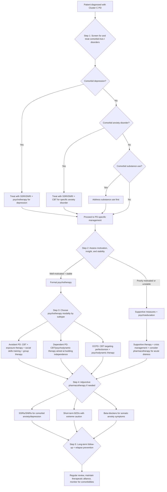

## Management of Cluster C (Anxious) Personality Disorders

### Overarching Management Philosophy

Before discussing specific treatments, let's establish the fundamental principles. Managing Cluster C personality disorders is profoundly different from managing acute psychiatric illnesses like a depressive episode or psychotic break. You are not "curing" a disease — you are helping a person **find a way of life that conflicts less with their character** [2]. This is a long game.

The management aims are [2]:

1. **↓Contact with situations provoking difficulties** — reduce exposure to triggers that overwhelm the patient's coping capacity
2. **↑Opportunity to develop assets in their personality** — build on strengths rather than just attacking weaknesses
3. **Treat comorbid psychiatric illness** — this is often the most impactful intervention, because Axis I disorders (depression, anxiety) are *treatable* and their resolution dramatically improves functioning even if the underlying personality structure remains

The overarching form is [2]:
- **Psychological support as mainstay**, with multidisciplinary input
- **Drugs as adjunct only** to treat comorbid psychiatric disorders — there is no medication that "treats" a personality disorder per se
- **Evidence base is limited**: there is **little hard evidence** to support current management of Cluster C PDs — the majority of PD research focuses on Cluster B (especially BPD) [2]

<Callout title="Personality Matters for Treatment" type="idea">
Personality is an important determinant of **attitude towards treatment and relationship with the therapist** [2]. For Cluster C specifically:
- **Avoidant PD**: patient fears therapist rejection → **difficult to gain and keep the patient's trust** [1] — but significant improvement is possible with persistence
- **Dependent PD**: patient may become excessively dependent on the therapist → the therapeutic relationship can inadvertently reinforce the pathology
- **OCPD**: patient with obsessional traits may become **frustrated and resistant if the therapeutic response does not follow their expectations** [2]

Understanding these dynamics is essential for managing the therapeutic relationship itself.
</Callout>

---

### Management Algorithm

---

### Detailed Treatment Modalities

#### 1. Supportive Measures (All Subtypes — First Line for Everyone)

These are universally applicable and should be started from the first encounter:

| Measure | Description | Why It Works |
|---|---|---|
| ***Explanation*** | Psychoeducation about the nature of personality disorders — helping the patient understand their patterns [11] | Understanding "why I do this" is the first step to change; reduces shame and self-blame |
| ***Reassurance*** | Validate the patient's distress; communicate that improvement is possible [11] | Cluster C patients are anxious by nature — therapeutic reassurance activates prefrontal regulation of the amygdala |
| **Therapeutic alliance** | Build trust, be consistent, be reliable, set clear boundaries | For avoidant PD: must overcome fear of therapist rejection [1]. For dependent PD: must avoid becoming the new "caregiver". For OCPD: must negotiate a structured but flexible approach |
| **Psychoeducation for family** | Educate family members about the nature of PD and how to support (not enable) | Family may inadvertently reinforce PD patterns (e.g., a partner who makes all decisions for a dependent PD patient) |
| **Social support** | Encourage gradual engagement with social networks, occupational activities | Social isolation worsens all Cluster C subtypes; structured social engagement provides corrective experiences |

#### 2. Psychological Treatments (Mainstay of Management)

***Psychological treatment*** is the **mainstay** for all personality disorders [2][11]. The choice of modality depends on the specific subtype, patient motivation, and availability.

##### A. Cognitive Behavioural Therapy (CBT)

***Cognitive behavioural therapy (CBT)*** is the most widely used and evidence-based psychotherapy for Cluster C PDs [2][11].

| Aspect | Details |
|---|---|
| **Mechanism** | Identifies and challenges **maladaptive core beliefs** (schemas) and **automatic negative thoughts** that maintain the personality pattern. Combines cognitive restructuring with behavioural experiments |
| **For Avoidant PD** | Targets beliefs like "I am inadequate" and "Others will reject me". Uses **graduated exposure** to feared social situations + cognitive restructuring of catastrophic predictions about rejection |
| **For Dependent PD** | Targets beliefs like "I am helpless" and "I cannot cope alone". Systematically increases autonomous decision-making through behavioural experiments (e.g., "try making one small decision this week and see what happens") |
| **For OCPD** | Targets beliefs like "I must be perfect or everything will collapse". Challenges black-and-white thinking; uses behavioural experiments to demonstrate that imperfection does not lead to catastrophe |
| **Indication** | First-line psychotherapy for all Cluster C PDs when patient is **well-motivated and stable** [2] |
| **Format** | Typically 16–30 sessions; can be individual or group |
| **Evidence** | Moderate evidence for efficacy in Cluster C PDs; strongest for avoidant PD (comparable to social phobia treatment) |

<Callout title="Schema Therapy — An Extension of CBT">
Standard CBT may be insufficient for deeply ingrained personality patterns because it focuses on surface-level cognitions. **Schema therapy** (developed by Jeffrey Young) extends CBT by targeting **early maladaptive schemas** — deep-rooted, lifelong patterns established in childhood. For Cluster C:
- Avoidant PD: "defectiveness/shame" and "social isolation" schemas
- Dependent PD: "dependence/incompetence" and "abandonment" schemas
- OCPD: "unrelenting standards" and "punitiveness" schemas

Schema therapy combines CBT techniques with limited reparenting, experiential techniques (imagery rescripting), and interpersonal pattern analysis. It is increasingly used for personality disorders but requires specialist training.
</Callout>

##### B. Exposure Therapy and Social Skills Training (Especially Avoidant PD)

| Aspect | Details |
|---|---|
| **Exposure therapy** | ***Exposure techniques*** for avoidant PD: ***graduated, repeated, prolonged, clear tasks*** [12]. Uses a ***hierarchy list*** targeting avoidance. Can be ***real-life*** (in vivo) or ***imaginal exposure*** [12]. Can be ***home-based*** with ***relative support*** [12] |
| **Why it works** | Avoidance is maintained by negative reinforcement — avoiding a feared situation reduces anxiety, which reinforces the avoidance. Exposure breaks this cycle by demonstrating that the feared outcome (rejection, humiliation) either doesn't occur or is tolerable. Neurobiologically, repeated exposure leads to **habituation** of amygdala fear responses and **strengthening of prefrontal inhibitory control** [3] |
| ***Social skills training*** | Teaches specific interpersonal skills (conversation initiation, assertiveness, handling criticism) that avoidant PD patients may have never developed due to lifelong avoidance [1] |
| ***Group therapy*** | Particularly valuable for avoidant PD — provides a **safe social setting** to practice interpersonal skills and receive feedback [1]. Allows the patient to observe that others share similar fears |
| ***Relaxation exercises*** | ***Relaxation exercise*** as adjunct to exposure [12] — reduces autonomic arousal during exposure, making it more tolerable. Techniques include progressive muscle relaxation, diaphragmatic breathing |
| ***Cognitive treatment for fear of negative evaluation from others*** | Specifically for social components of avoidant PD — directly targets the cognitive distortion that others are constantly judging and rejecting [12] |

> **For avoidant PD**: the combination of **social skills training + group therapy + exposure therapy** is the evidence-based package [1]. The difficulty is **gaining and keeping the patient's trust**, as they **fear therapist rejection** — but **significant improvement is possible** with persistence [1].

##### C. Psychodynamic Psychotherapy

| Aspect | Details |
|---|---|
| **Mechanism** | Explores unconscious conflicts, defence mechanisms, and early relational patterns (attachment, childhood experiences) that underpin personality pathology. The therapeutic relationship itself becomes a vehicle for change |
| **For Dependent PD** | Explores the origins of helplessness beliefs in overprotective/authoritarian parenting; examines how the patient recreates dependent relationships; aims to build a more autonomous self-concept |
| **For OCPD** | Explores the origins of need for control (often in chaotic or over-involved childhood environments); addresses emotional constriction and difficulty with intimacy |
| **For Avoidant PD** | Explores childhood neglect/rejection and how it shaped the belief of inadequacy; addresses avoidance as a defence mechanism |
| **Indication** | When patient is **well-motivated and stable** [2]; particularly useful when CBT alone is insufficient or when deep-rooted relational patterns need addressing |
| **Format** | Longer-term than CBT (typically 1–3 years); individual sessions 1–2x/week |
| **Caution** | Requires significant psychological mindedness and motivation; contraindicated in acute crisis or active psychosis |

##### D. Psychotherapy Aimed at Independence (Specifically Dependent PD)

**Psychotherapy with the aim of making the individual more independent and helping form healthier relationships** is the specific management approach for dependent PD [1].

| Component | Rationale |
|---|---|
| **Autonomy building** | Systematically increase independent decision-making, starting with low-stakes choices and gradually progressing |
| **Assertiveness training** | Teach the patient to express disagreement and make demands — skills they have never developed |
| **Relationship pattern analysis** | Identify the pattern of seeking dominant/controlling partners and help the patient choose healthier relationships |
| **Therapist boundary management** | The therapist must be vigilant about not becoming the patient's new "caregiver" — the therapeutic relationship must model healthy interdependence, not dependence |

<Callout title="The Dependent PD Therapy Paradox" type="error">
The paradox of treating dependent PD is that the patient may become dependent on the therapist. Every session, every piece of advice, every reassurance can reinforce the very pattern you're trying to change. The therapist must walk a fine line: be supportive enough to maintain the alliance, but consistently encourage autonomous functioning. Prematurely withdrawing support will cause dropout; being too supportive will perpetuate pathology.
</Callout>

#### 3. Pharmacotherapy (Adjunctive Only)

There is **no medication that treats personality disorders directly** [2]. Pharmacotherapy is used as an **adjunct only** to treat **comorbid psychiatric disorders** (depression, anxiety, etc.) or to manage specific target symptoms (anxiety, insomnia, agitation).

##### A. Antidepressants

| Drug Class | Indications | Mechanism | Key Considerations |
|---|---|---|---|
| ***SSRIs*** (e.g., fluoxetine, sertraline, escitalopram) | **First-line** for comorbid depression, GAD, social anxiety disorder, OCD, panic disorder [11] | Increase serotonin in the synaptic cleft → enhance prefrontal cortical regulation of amygdala; long-term use leads to neuroplastic changes that reduce anxiety and improve mood [3] | Start low, go slow — most result in **↑anxiety symptoms initially** (apprehension, sleeplessness, palpitations) → **dose should be increased very slowly** [13]. Maintain for **≥6 months** to prevent relapse [13] |
| ***SNRIs*** (e.g., venlafaxine, duloxetine) | Comorbid depression/GAD when SSRIs insufficient [11] | Block reuptake of both serotonin and noradrenaline → dual mechanism. Long-term use can lead to **downregulation of NA receptors → anxiolysis** [3] | Similar initiation concerns as SSRIs; discontinuation syndrome with abrupt withdrawal |
| ***TCAs*** (e.g., imipramine, clomipramine) | Second-line for comorbid panic disorder, depression [11] | Block reuptake of 5-HT and NA + anticholinergic, antihistaminic effects | More side effects than SSRIs (sedation, weight gain, anticholinergic effects, cardiac conduction abnormalities); **dangerous in overdose** — caution in patients with suicidal ideation |
| ***MAOIs*** (e.g., phenelzine, tranylcypromine) | Third-line or specialist use; historically effective for social phobia [11] | Inhibit monoamine oxidase → increase 5-HT, NA, DA in synaptic cleft | **Dietary restrictions** (tyramine-containing foods → hypertensive crisis); multiple drug interactions; rarely used in routine practice |

##### B. Anxiolytics and Other Agents

| Drug | Indications | Mechanism | Key Considerations |
|---|---|---|---|
| ***Benzodiazepines*** (e.g., diazepam, lorazepam, alprazolam) | Short-term anxiolysis for acute distress; **NOT as primary treatment** [11][14] | Enhance GABA-A receptor activity → suppress amygdala and CSTC circuits → rapid anxiolysis [3] | **Only as short-term treatment, not more than 1 month** [14]. **Extreme caution in dependent PD** due to **liability to dependence** [1] — these patients are psychologically predisposed to becoming dependent on substances. Risk of tolerance, withdrawal, cognitive impairment. Prefer long-acting agents to avoid withdrawal |
| ***Beta-adrenergic antagonists*** (e.g., propranolol) | Somatic symptoms of anxiety (tremor, palpitations, sweating) [11] | Block peripheral β-adrenergic receptors → reduce sympathetic manifestations of anxiety without central sedation | Useful as PRN for avoidant PD patients facing specific feared situations (e.g., a presentation). Contraindicated in asthma, heart block, severe bradycardia |
| ***Buspirone*** | Comorbid GAD [11] | 5-HT1A partial agonist → reduces serotonergic transmission in anxiety circuits | Takes 2–4 weeks for effect; no dependence potential (advantage over BZDs); less sedating. Limited efficacy in severe anxiety |
| ***Pregabalin*** | Comorbid GAD [11] | α₂δ ligand → binds voltage-sensitive calcium channels → reduces glutamate release → anxiolysis [3] | Schedule V controlled substance in some jurisdictions; some dependence potential; sedation, dizziness |

<Callout title="The BZD Warning for Dependent PD" type="error">
This is a classic exam trap: a patient with dependent PD presents with anxiety. You prescribe a benzodiazepine. What's the problem? **Patients with dependent PD have a psychological predisposition to become dependent on anything that provides care/comfort** — including medications. Benzodiazepines are inherently addictive, and this patient population is at **highest risk** of developing benzodiazepine dependence [1]. **Consider psychotropics for comorbid depression/anxiety, but exercise caution for liability to dependence** [1]. Prefer SSRIs, buspirone, or pregabalin over BZDs whenever possible.
</Callout>

##### C. Summary of Pharmacotherapy by Target

| Target Symptom | First-Line Drug | Second-Line | Avoid/Caution |
|---|---|---|---|
| **Comorbid depression** | SSRI | SNRI → TCA → MAOI | — |
| **Comorbid GAD** | SSRI/SNRI | Buspirone, pregabalin | Long-term BZDs (especially in dependent PD) |
| **Comorbid social anxiety** | SSRI | SNRI, MAOI (specialist) | — |
| **Comorbid OCD** | SSRI (high dose) | Clomipramine | — |
| **Comorbid panic disorder** | SSRI | TCA (imipramine), BZD (short-term) | — |
| **Acute severe anxiety/crisis** | Short-term BZD (< 1 month) | — | Long-term use; caution in dependent PD [1] |
| **Somatic anxiety symptoms** | Propranolol (PRN) | — | Asthma, heart block |

#### 4. Subtype-Specific Management Summary

| | Avoidant PD | Dependent PD | OCPD |
|---|---|---|---|
| **Psychotherapy (mainstay)** | ***Social skills training + group therapy*** [1]; ***Exposure therapy*** (graduated, repeated, prolonged) [12]; ***CBT*** targeting beliefs of inadequacy [2]; ***Cognitive treatment for fear of negative evaluation*** [12] | ***Psychotherapy aimed at making individual more independent and helping form healthier relationships*** [1]; CBT targeting helplessness beliefs; psychodynamic therapy exploring attachment patterns | CBT targeting perfectionism and control; psychodynamic therapy exploring origins of rigidity; schema therapy for "unrelenting standards" schema |
| **Therapeutic challenge** | ***Often difficult to gain/keep patient's trust as they fear therapist rejection*** [1] | Patient may become dependent on therapist; must model healthy interdependence | Patient becomes **frustrated and resistant if response does not follow expectation** [2]; may intellectualise and resist emotional exploration |
| **Prognosis** | ***Significant improvement possible*** with persistence [1] | Improvement possible but risk of relapse when support is withdrawn; long-term therapy often needed | Generally stable course; some softening with age; improvement possible if motivated |
| **Pharmacotherapy** | SSRIs for comorbid social anxiety/depression; propranolol PRN for somatic symptoms | SSRIs for comorbid depression/anxiety; ***caution for liability to dependence*** with BZDs [1] | SSRIs if comorbid OCD or depression; no specific pharmacotherapy for OCPD traits |

---

### 5. Specialist Referral Indications

Consider referral to secondary/specialist psychiatric care if [13]:

- **Risk of self-harm or suicide** — particularly in avoidant PD (isolation → depression → suicidality) and dependent PD (loss of caregiver → crisis)
- **Marked self-neglect**
- **Non-response to at least two treatments**
- **Significant comorbidity** (e.g., substance use, physical health problems)
- **Need for specialist psychotherapy** (schema therapy, mentalization-based therapy, psychodynamic therapy) not available in primary care

---

### 6. Long-Term Management and Prognosis

| Aspect | Details |
|---|---|
| **Course** | Personality disorders are by definition chronic and enduring. However, Cluster C PDs generally have a **better prognosis than Cluster B** because patients experience more distress (partially ego-dystonic) and are more likely to engage in treatment |
| **Natural history** | Some personality traits soften with age (particularly OCPD rigidity may mellow in later life). Avoidant and dependent traits may persist but patients develop compensatory strategies |
| **Follow-up** | Regular review to monitor for comorbid depression/anxiety (very common); maintain therapeutic alliance over years |
| **Relapse prevention** | Identify triggers (stressors that unmask or exacerbate PD traits); develop coping strategies; maintain social support networks |
| **Harm reduction** | For dependent PD: screen for domestic violence/exploitation; for avoidant PD: monitor for complete social withdrawal and secondary depression; for OCPD: monitor for burnout |

---

### 7. Contraindications and Cautions Summary

| Intervention | Contraindications/Cautions | Why |
|---|---|---|
| **Benzodiazepines** | **Avoid long-term use in all PDs; extreme caution in dependent PD** [1][14] | Dependent PD patients are psychologically predisposed to substance dependence; all PDs at risk of tolerance/withdrawal |
| **MAOIs** | Tyramine-containing foods; multiple drug interactions | Hypertensive crisis risk; complex management |
| **TCAs** | Caution in suicidal patients | Lethal in overdose (cardiac conduction blockade) |
| **Intensive psychotherapy** | Contraindicated in acute crisis or psychosis; requires motivation and stability [2] | Patient must be stable enough to tolerate emotional exploration without decompensation |
| **Group therapy** | Caution in severe avoidant PD | May be too overwhelming initially; may need individual therapy first to build confidence |
| **Confrontational approaches** | Avoid in avoidant PD | Will reinforce rejection fears and cause dropout |
| **Excessive therapist support** | Caution in dependent PD | Reinforces dependence rather than building autonomy |
| **Rigid therapeutic structure** | Caution that OCPD patient may "take over" | Patient may try to control the therapy itself; therapist must maintain appropriate flexibility |

---

<Callout title="High Yield Summary — Management of Cluster C PDs">

**Philosophy**: Aim to **find a way of life that conflicts less with their character** by ↓contact with provoking situations and ↑opportunity to develop personality assets [2].

**Mainstay**: **Psychological support** with multidisciplinary input; **drugs are adjunct only** for comorbid conditions [2].

**Psychotherapy**:
- **All subtypes**: CBT (first-line when motivated and stable); psychodynamic therapy for deeper patterns
- **Avoidant PD**: social skills training + group therapy + graduated exposure therapy. Difficult to gain trust but significant improvement possible [1].
- **Dependent PD**: psychotherapy aimed at independence and healthier relationships [1]. Watch for patient becoming dependent on therapist.
- **OCPD**: CBT targeting perfectionism and rigidity. Patient may resist if therapy doesn't meet their standards [2].

**Pharmacotherapy**: No drug treats PD directly. SSRIs are first-line for comorbid depression/anxiety [11]. **Benzodiazepines only short-term ( < 1 month), with extreme caution in dependent PD** due to liability to dependence [1][14]. Beta-blockers for somatic symptoms; buspirone/pregabalin as alternatives for GAD [11].

**Evidence base**: Little hard evidence; most PD research focuses on Cluster B [2].

**Referral**: if self-harm risk, self-neglect, treatment non-response (≥2 trials), or significant comorbidity.

</Callout>

---

<ActiveRecallQuiz
  title="Active Recall - Management of Cluster C PDs"
  items={[
    {
      question: "What are the two overarching management aims for personality disorders, and what is the mainstay of treatment?",
      markscheme: "Aims: (1) Decrease contact with situations provoking difficulties, (2) Increase opportunity to develop assets in their personality. Mainstay: Psychological support (psychotherapy) with multidisciplinary input. Drugs are adjunct only for comorbid psychiatric disorders. There is little hard evidence for current management, most research focuses on Cluster B.",
    },
    {
      question: "For avoidant PD, what specific psychotherapy combination is recommended and what is the main therapeutic challenge?",
      markscheme: "Combination: Social skills training + group therapy + graduated exposure therapy (graduated, repeated, prolonged, clear tasks; real-life or imaginal; home-based with relative support) + CBT targeting beliefs of inadequacy + cognitive treatment for fear of negative evaluation. Main challenge: Often difficult to gain and keep patient's trust as they fear therapist rejection -- but significant improvement is possible with persistence.",
    },
    {
      question: "Why are benzodiazepines particularly dangerous in dependent PD? What alternatives should you consider?",
      markscheme: "Dependent PD patients have a psychological predisposition to become dependent on substances -- their core pathology is excessive need for external support, which extends to medications. BZDs are inherently addictive with tolerance and withdrawal. Alternatives: SSRIs (first-line for comorbid anxiety/depression), buspirone (5-HT1A agonist, no dependence potential), pregabalin (alpha-2-delta ligand), propranolol (for somatic symptoms only). BZDs should be used only short-term if at all, not more than 1 month.",
    },
    {
      question: "What is the specific therapeutic paradox in treating dependent PD, and how should it be managed?",
      markscheme: "Paradox: The patient may become dependent on the therapist, with every piece of advice and reassurance reinforcing the very pathology being treated. Management: Walk a fine line -- be supportive enough to maintain therapeutic alliance but consistently encourage autonomous functioning. Set boundaries. Model healthy interdependence, not dependence. Gradually increase patient's independent decision-making capacity. Aim of therapy is to make the individual more independent and help form healthier relationships.",
    },
    {
      question: "A patient with OCPD is referred for psychotherapy. What specific challenges should you anticipate and what is the first-line psychotherapy approach?",
      markscheme: "Challenges: Patient with obsessional traits may become frustrated and resistant if therapeutic response does not follow their expectations. May try to control the therapy itself. May intellectualise rather than engage emotionally. First-line: CBT targeting perfectionism, black-and-white thinking, and need for control. Behavioural experiments to demonstrate that imperfection does not lead to catastrophe. Psychodynamic therapy can explore origins of rigidity in childhood (overprotective/over-involved parenting). Schema therapy for 'unrelenting standards' schema in resistant cases.",
    },
    {
      question: "List the pharmacotherapy options for treating anxiety symptoms, as mentioned in the lecture slides on treatment of anxiety disorders.",
      markscheme: "From lecture slides: (1) Antidepressants -- SSRIs, SNRIs, TCAs, MAOIs; (2) Beta-adrenergic antagonists e.g. propranolol; (3) Benzodiazepines; (4) Buspirone; (5) Pregabalin. Also includes supportive measures (explanation, reassurance) and psychological treatment (CBT) as part of overall management. SSRIs are first-line; BZDs short-term only.",
    },
  ]}
/>

## References

[1] Senior notes: ryanho-psych.md (Section 10.4: Cluster C Anxious Personality Disorders — management/prognosis column)
[2] Senior notes: ryanho-psych.md (Section 10.1: Personality and Personality Disorders — management principles, importance of personality in treatment)
[3] Senior notes: ryanho-psych.md (Sections on anxiety neurocircuitry, CSTC loop, neurotransmitter roles — mechanism of anxiolysis)
[11] Lecture slides: GC 167. I feel very nervous Anxiety disorders.pdf (p36: Treatment of Anxiety Disorders)
[12] Lecture slides: GC 167. I feel very nervous Anxiety disorders.pdf (p39: Psychotherapy for Phobic Disorders)
[13] Senior notes: ryanho-psych.md (Section 8.1: Panic disorder management — SSRI initiation, referral criteria; Figure 20.2)
[14] Senior notes: ryanho-psych.md (Section 3.1.4.1: Benzodiazepines — indications, short-term use only)
