## Complications of Delirium

Delirium is far more than just "temporary confusion." It is a **systemic brain injury event** that carries significant short-term morbidity, long-term cognitive consequences, and independent mortality risk. Think of delirium as analogous to a myocardial infarction of the brain — even after the acute event resolves, there is lasting damage.

The complications can be organised into:
1. **Acute complications** (during the episode)
2. **Complications of the underlying cause** (if untreated/delayed)
3. **Iatrogenic complications** (from treatment or restraint)
4. **Long-term sequelae** (after resolution)

---

### 1. Acute Complications (During the Delirium Episode)

These arise directly from the delirious state itself — the patient's altered consciousness, agitation, immobility, and inability to cooperate with care.

#### 1.1 Mortality

This is the most critical complication. Delirium is an ***independent predictor of mortality, especially for those with protracted delirium*** [2].

| Timeframe | Mortality |
|:---|:---|
| ***1 month*** | ***14%*** [2] |
| ***6 months*** | ***22%*** [2] |
| Compared to non-delirious patients | ***6× higher*** [2] |
| Delirium tremens (if treated) | ***< 5%*** [1][2] |
| Delirium tremens (if untreated) | Up to 15–20% |

**Why does delirium itself increase mortality (independent of the underlying cause)?** Several mechanisms:
- The underlying cause is often a serious medical condition (sepsis, MI, PE) that carries its own mortality — delirium is the clinical "alarm" that this condition is present
- Delirium impairs the patient's ability to cooperate with treatment (pulling out IV lines, refusing medications, refusing investigations)
- Delirium triggers a cascade of secondary complications (falls, aspiration, immobility → DVT/PE, pressure injuries)
- Neuroinflammation during delirium may cause direct neuronal injury, contributing to long-term brain damage

> **High Yield**: The ***mortality data (14% at 1 month, 22% at 6 months, 6× non-delirious)*** [2] is a commonly examined statistic. Delirium is NOT benign.

#### 1.2 Falls and Traumatic Injury

| Complication | Mechanism |
|:---|:---|
| **Falls** | Hyperactive delirious patients attempt to get out of bed, climb over bedrails, or wander while disoriented. Impaired attention, disorientation, and motor incoordination all contribute. Falls are the leading cause of acute injury in delirious patients. |
| **Fractures** (especially hip fracture) | Falls in elderly, osteoporotic patients → hip fracture → further immobilisation → worsened delirium (a vicious cycle). |
| **Head injury** | Falls → subdural haematoma (especially in elderly patients on anticoagulants or with cerebral atrophy). This creates a dangerous feedback loop: delirium → fall → head injury → worse delirium. |
| **Self-extubation / line removal** | Agitated patients pull out endotracheal tubes, IV lines, urinary catheters, surgical drains → airway compromise, haemorrhage, treatment interruption. |

#### 1.3 Aspiration Pneumonia

- Delirious patients have impaired consciousness, reduced cough reflex, and often poor swallowing coordination.
- Hypoactive patients who are drowsy and lying supine are particularly at risk.
- Aspiration of oral secretions or gastric contents → aspiration pneumonitis/pneumonia → further hypoxia → worsened delirium.
- This is why supportive care includes sitting the patient upright, assessing swallowing safety, and considering thickened fluids or NG feeding if needed.

#### 1.4 Immobility-Related Complications

Delirious patients — especially the hypoactive subtype — may be profoundly immobile for days.

| Complication | Mechanism | Prevention |
|:---|:---|:---|
| **Venous thromboembolism (DVT/PE)** | Immobility → venous stasis (Virchow's triad) → thrombus formation. Dehydration further increases blood viscosity. | Thromboprophylaxis (LMWH), TED stockings, early mobilisation |
| **Pressure ulcers** (decubitus ulcers) | Sustained pressure on bony prominences (sacrum, heels, occiput) → tissue ischaemia → necrosis. Confused patients do not shift position spontaneously. | Regular repositioning (2-hourly), pressure-relieving mattresses, skin care |
| **Muscle deconditioning / sarcopaenia** | Even a few days of bed rest causes significant muscle protein loss, especially in elderly patients. Loss of 1–3% muscle mass per day of bed rest in the elderly. | Early mobilisation, physiotherapy, adequate protein intake |
| **Contractures** | Prolonged immobility → joint stiffness → fixed flexion deformities | Range-of-motion exercises, early mobilisation |
| **Functional decline** | Combination of deconditioning, contractures, and cognitive impairment → loss of ability to perform ADLs. Many elderly patients never return to their pre-delirium functional baseline. | Comprehensive geriatric assessment, multidisciplinary rehabilitation |

#### 1.5 Dehydration and Malnutrition

- Confused patients forget to drink and eat, or refuse food/fluids.
- Hyperactive patients have increased metabolic demands (agitation, fever, sweating) that outstrip intake.
- Dehydration → reduced cerebral perfusion → worsened delirium (vicious cycle).
- Malnutrition → impaired wound healing, impaired immune function, further cognitive decline.

#### 1.6 Incontinence

- Loss of cortical inhibition over micturition and defecation → urinary and faecal incontinence.
- Incontinence → skin breakdown → pressure ulcers, infection.
- Urinary catheterisation (often placed in response to incontinence) is itself a ***precipitating factor for delirium*** [2] and increases UTI risk → another vicious cycle.

#### 1.7 Behavioural Complications

| Complication | Detail |
|:---|:---|
| **Aggression / violence** | Hyperactive delirious patients may strike staff or other patients. This is driven by fear, misperception (e.g., believing staff are attackers), and cortical disinhibition. |
| **Absconding** | Confused patients may wander off the ward, creating safety risks (falls, exposure, inability to find their way back). |
| **Interference with treatment** | Pulling out lines, refusing medications, refusing investigations — delays treatment of the underlying cause. |

---

### 2. Complications of the Underlying Cause (If Untreated / Delayed)

Delirium is the brain's alarm signal that something serious is happening. If the underlying cause is not identified and treated promptly, the consequences can be devastating:

| Underlying Cause | Complication if Untreated |
|:---|:---|
| **Sepsis** | Septic shock → multi-organ failure → death |
| **Myocardial infarction** | Heart failure, arrhythmia, cardiogenic shock (MI can present as delirium in the elderly without typical chest pain) |
| **Pulmonary embolism** | Cardiovascular collapse, death |
| **Meningitis/encephalitis** | Permanent neurological damage, death |
| **Hypoglycaemia** | Permanent brain damage (neuroglycopenia → selective neuronal necrosis in hippocampus, cortex, basal ganglia) |
| **Wernicke encephalopathy** | ***Korsakoff syndrome (irreversible)*** — 84% of Wernicke cases progress to Korsakoff syndrome if untreated [2]. Characterised by severe anterograde amnesia with confabulation. |
| ***Delirium tremens*** | ***Mortality 5% if treated*** [1]; death from ***arrhythmia, underlying diseases, or hypo/hyperthermia*** [2] |
| **Hepatic encephalopathy** | Progressive coma (***Stage 4 of West Haven Criteria***) [1] if precipitant not addressed |
| **Status epilepticus** | Permanent neuronal injury, death |

<Callout title="Clinical Pearl" type="error">
**The single most dangerous complication of delirium is failure to identify and treat the underlying cause.** Delirium that is merely "managed" with antipsychotics while the precipitant remains untreated will result in progressive deterioration and death. Every delirious patient deserves a thorough aetiological workup — not just sedation.
</Callout>

---

### 3. Iatrogenic Complications (From Treatment)

The management of delirium can itself cause harm if not carefully executed.

#### 3.1 Complications of Physical Restraints

***Restraint should be used as a last resort*** [2]. The complications include:

| Complication | Mechanism |
|:---|:---|
| **Worsened agitation** | The patient fights against restraints → increased distress, catecholamine surge, autonomic instability |
| **Rhabdomyolysis** | Prolonged struggling against restraints → skeletal muscle breakdown → myoglobinuria → acute kidney injury |
| **Skin injury and pressure ulcers** | Restraints compress soft tissue over bony prominences |
| **DVT / PE** | Complete immobilisation → venous stasis |
| **Strangulation / asphyxia** | Improperly applied restraints can compress the airway, particularly if the patient slides down |
| **Psychological trauma** | Being physically restrained is terrifying for a confused patient, worsening fear, agitation, and subsequent PTSD |
| **Nerve compression** | Tight limb restraints can compress peripheral nerves → neuropraxia |

#### 3.2 Complications of Pharmacological Treatment

| Drug | Iatrogenic Complication | Mechanism |
|:---|:---|:---|
| **Haloperidol** | QTc prolongation → Torsades de Pointes → sudden cardiac death | Blocks cardiac potassium channels (hERG) → delayed repolarisation |
| **Haloperidol** | Extrapyramidal side effects (acute dystonia, akathisia, Parkinsonism) | D2 blockade in the nigrostriatal pathway → dopaminergic-cholinergic imbalance in basal ganglia |
| **Haloperidol / antipsychotics in DLB** | ***Antipsychotic sensitivity: acute irreversible Parkinsonism, loss of consciousness ± neuroleptic malignant syndrome*** [2] | DLB patients have severe nigrostriatal dopaminergic depletion; even small doses of D2 blockers cause catastrophic Parkinsonism |
| **Antipsychotics in elderly with dementia** | ***↑ mortality*** [2] (cerebrovascular events, pneumonia, cardiac events) | Black box warning — mechanism not fully understood; possibly related to sedation → aspiration, and pro-thrombotic effects |
| **Neuroleptic malignant syndrome (NMS)** | ***Characterised by rapid onset of neuromuscular rigidity, confusion, autonomic dysfunction, hyperthermia. CK > 1000 IU/L. Mortality can reach 20% if untreated*** [2] | Sudden, profound central dopamine blockade → muscle rigidity → rhabdomyolysis + thermoregulatory failure |
| **Benzodiazepines** | Over-sedation, respiratory depression, paradoxical agitation | GABAergic sedation in an already-compromised brain; paradoxical effects due to cortical disinhibition in the elderly |
| **Benzodiazepines** | Falls | Sedation + impaired coordination in an already disoriented patient |

#### 3.3 Complications of Prolonged Hospitalisation

Delirium prolongs hospital stays (on average, delirium adds 7–10 days to a hospital admission), which itself creates complications:

| Complication | Mechanism |
|:---|:---|
| **Hospital-acquired infections** | Prolonged exposure to nosocomial pathogens (MRSA, C. difficile, hospital-acquired pneumonia) |
| **Further functional decline** | Longer immobilisation → more deconditioning → more dependence |
| **Increased healthcare costs** | Direct costs of prolonged admission + costs of managing complications |

---

### 4. Long-Term Sequelae (After Resolution of Delirium)

These are among the most important and underappreciated complications. Delirium is not just an acute event — it leaves lasting marks on the brain.

#### 4.1 Accelerated Cognitive Decline and Dementia

***5× increased incidence of dementia within 2 years following delirium; may accelerate the pace of cognitive decline*** [2].

**Why does a transient episode of delirium cause permanent cognitive damage?** Several hypotheses:

1. **Neuroinflammatory injury**: The cytokine storm and microglial activation during delirium cause direct neuronal death, particularly in vulnerable regions (hippocampus, prefrontal cortex). These neurons do not regenerate.
2. **Synaptic damage**: Excitotoxicity (from glutamate excess) and oxidative stress damage synapses, reducing the brain's "cognitive reserve" — the buffer that keeps a person above the dementia threshold.
3. **Acceleration of pre-existing neurodegeneration**: In patients with subclinical Alzheimer's pathology (amyloid plaques, tau tangles already accumulating), delirium may "unmask" or accelerate the clinical expression of dementia.
4. **Chronic neuroinflammation**: A single episode of delirium may trigger sustained microglial activation that persists long after the acute episode resolves, creating a chronic neuroinflammatory state that promotes neurodegeneration.

<Callout title="Critical Long-Term Consequence">
Delirium is not "just confusion that goes away." Each episode of delirium causes measurable, often permanent, cognitive decline. In patients with pre-existing dementia, delirium accelerates the trajectory of decline. This is why **prevention** of delirium is so important — every episode prevented is potential dementia prevented.
</Callout>

#### 4.2 Persistent Delirium / Incomplete Resolution

- Not all delirium resolves completely. Some patients — ***especially the elderly, those with pre-existing dementia or physical illness, and those with the hypoactive profile*** [2] — have ***protracted delirium*** that persists for weeks to months.
- ***Protracted delirium*** carries ***especially poor prognosis*** [2].
- Some patients never return to their cognitive baseline, transitioning directly from delirium into a new diagnosis of dementia.

#### 4.3 Post-Traumatic Stress Disorder (PTSD)

- Delirium, particularly the hyperactive subtype with vivid hallucinations and persecutory delusions, is a profoundly frightening experience.
- Patients who recover often recall fragments of the delirium — terrifying hallucinations, the sensation of being restrained, feeling attacked by staff.
- Studies show that 15–25% of patients who recover from delirium develop symptoms of PTSD (intrusive memories, nightmares, avoidance, hypervigilance).
- This is an under-recognised complication. Post-delirium psychological follow-up is important.

#### 4.4 Functional Decline and Loss of Independence

| Outcome | Detail |
|:---|:---|
| **Loss of ADL independence** | Many elderly patients who survive delirium never return to their pre-morbid functional level. They require more assistance with basic and instrumental ADLs. |
| **Increased institutionalisation** | Delirium is independently associated with new nursing home placement. The combination of cognitive decline + functional decline + caregiver burden often makes return home impossible. |
| **Caregiver burden** | Family members who witness a relative's delirium experience significant distress. Ongoing care needs after discharge increase caregiver strain and depression. |

#### 4.5 Increased Re-admission and Recurrence

- Patients who have had one episode of delirium are at **markedly increased risk** of future episodes (a ***previous episode of delirium*** is itself a predisposing factor [2]).
- Each subsequent episode may cause further cumulative cognitive damage.
- Hospital re-admission rates are higher in patients with a history of delirium, both because of recurrent delirium and because the underlying vulnerabilities (frailty, dementia, multimorbidity) persist.

---

### Summary: Complications by Time Course

```mermaid
flowchart TD
    A["DELIRIUM"] --> B["ACUTE\n(during episode)"]
    A --> C["MEDIUM-TERM\n(hospitalisation)"]
    A --> D["LONG-TERM\n(after resolution)"]
    
    B --> B1["Mortality (14% at 1mo, 22% at 6mo)"]
    B --> B2["Falls → fractures, head injury"]
    B --> B3["Aspiration pneumonia"]
    B --> B4["DVT / PE"]
    B --> B5["Pressure ulcers"]
    B --> B6["Dehydration / malnutrition"]
    B --> B7["Incontinence"]
    B --> B8["Self-harm / violence"]
    B --> B9["Treatment interference"]
    
    C --> C1["Iatrogenic: restraint injuries,\ndrug side effects"]
    C --> C2["Hospital-acquired infections"]
    C --> C3["Prolonged admission"]
    C --> C4["NMS from antipsychotics"]
    C --> C5["Untreated underlying cause\n→ organ failure, death"]
    
    D --> D1["Dementia (5x risk in 2 years)"]
    D --> D2["Accelerated cognitive decline"]
    D --> D3["PTSD"]
    D --> D4["Functional decline / institutionalisation"]
    D --> D5["Increased recurrence / re-admission"]
    D --> D6["Persistent delirium"]
```

---

### Poor Prognostic Factors

These patients are most likely to develop complications [2]:

| Factor | Why it worsens prognosis |
|:---|:---|
| ***Elderly*** | Reduced cerebral reserve, multiple comorbidities, more vulnerable to secondary complications (falls, aspiration, pressure ulcers) |
| ***Pre-existing dementia*** | Already reduced cognitive reserve; delirium accelerates neurodegenerative trajectory; harder to diagnose delirium (superimposed on baseline impairment) |
| ***Pre-existing physical illness*** | Less physiological reserve to withstand the metabolic insult causing delirium |
| ***Hypoactive profile*** | Most commonly missed subtype → delayed recognition → delayed treatment → worse outcomes |
| ***Protracted delirium*** | Longer duration of neuroinflammation → more neuronal damage → higher mortality and cognitive decline |

---

<Callout title="High Yield Summary">

**Complications of Delirium — Key Points for Exams:**

**Acute**: Mortality (14% 1mo, 22% 6mo, 6× non-delirious); falls/fractures/head injury; aspiration pneumonia; DVT/PE; pressure ulcers; dehydration; incontinence; treatment interference.

**Iatrogenic**: Restraint injuries (rhabdomyolysis, strangulation, skin breakdown); antipsychotic side effects (QTc prolongation, EPSE, NMS, increased mortality in elderly with dementia); benzodiazepine over-sedation/respiratory depression/paradoxical agitation; hospital-acquired infections from prolonged stay.

**Long-term**: **5× increased dementia risk within 2 years** (most important); accelerated cognitive decline even in patients without prior dementia; PTSD (15–25%); functional decline and institutionalisation; increased recurrence/re-admission.

**Alcohol-specific**: Untreated DT → death from arrhythmia/hyperthermia; untreated Wernicke → Korsakoff syndrome (84%, irreversible).

**Poor prognostic factors**: Elderly, pre-existing dementia, pre-existing physical illness, hypoactive subtype, protracted delirium.

**The bottom line**: Delirium is NOT benign. Prevention is better than cure. Every episode causes measurable, often permanent brain damage.

</Callout>

---

<ActiveRecallQuiz
  title="Active Recall - Complications of Delirium"
  items={[
    {
      question: "State the mortality figures associated with delirium at 1 month and 6 months, and the relative risk compared to non-delirious patients.",
      markscheme: "14% mortality at 1 month, 22% at 6 months, 6 times that of non-delirious patients. Delirium is an independent predictor of mortality, especially protracted delirium.",
    },
    {
      question: "Explain why a single episode of delirium can lead to permanent cognitive decline and increased dementia risk.",
      markscheme: "5x increased incidence of dementia within 2 years. Mechanisms: (1) Neuroinflammatory injury - cytokine storm and microglial activation cause direct neuronal death in vulnerable regions (hippocampus, prefrontal cortex). (2) Synaptic damage from excitotoxicity and oxidative stress reduces cognitive reserve. (3) Acceleration of pre-existing subclinical neurodegeneration (e.g. unmasking Alzheimer pathology). (4) Chronic neuroinflammation may persist after the acute episode, promoting ongoing neurodegeneration.",
    },
    {
      question: "List four complications of physical restraint use in delirious patients.",
      markscheme: "1. Worsened agitation (patient fights restraints, catecholamine surge). 2. Rhabdomyolysis from prolonged struggling leading to acute kidney injury. 3. Skin injury and pressure ulcers from compression over bony prominences. 4. DVT/PE from complete immobilisation. Also acceptable: strangulation/asphyxia, nerve compression, psychological trauma/PTSD.",
    },
    {
      question: "A delirious patient with known Lewy body dementia is given haloperidol. What potentially catastrophic complication can occur?",
      markscheme: "Antipsychotic sensitivity in DLB (30-50% of patients): acute irreversible Parkinsonism, loss of consciousness, and potentially neuroleptic malignant syndrome (NMS). NMS is characterised by rigidity, hyperthermia, autonomic instability, confusion, elevated CK greater than 1000 IU/L; mortality can reach 20% if untreated. This is why quetiapine (lowest D2 blockade) should be used instead of haloperidol in PD/DLB.",
    },
    {
      question: "Name four poor prognostic factors in delirium and explain the pathophysiological reason for each.",
      markscheme: "1. Elderly - reduced cerebral reserve, multiple comorbidities, vulnerability to secondary complications. 2. Pre-existing dementia - already reduced cognitive reserve, delirium accelerates neurodegeneration, harder to diagnose superimposed delirium. 3. Pre-existing physical illness - less physiological reserve to withstand the metabolic insult. 4. Hypoactive profile - most commonly missed subtype leading to delayed recognition and treatment. Also acceptable: protracted delirium (longer neuroinflammation causes more neuronal damage).",
    },
  ]}
/>

## References

[1] Lecture slides: GC 161. Alcohol and the Brain From Psychiatric to Neuropsychiatric Perspectives.pdf (p12, p23)
[2] Senior notes: ryanho-psych.md (sections 4.1, pages 74–76, 105–107)
