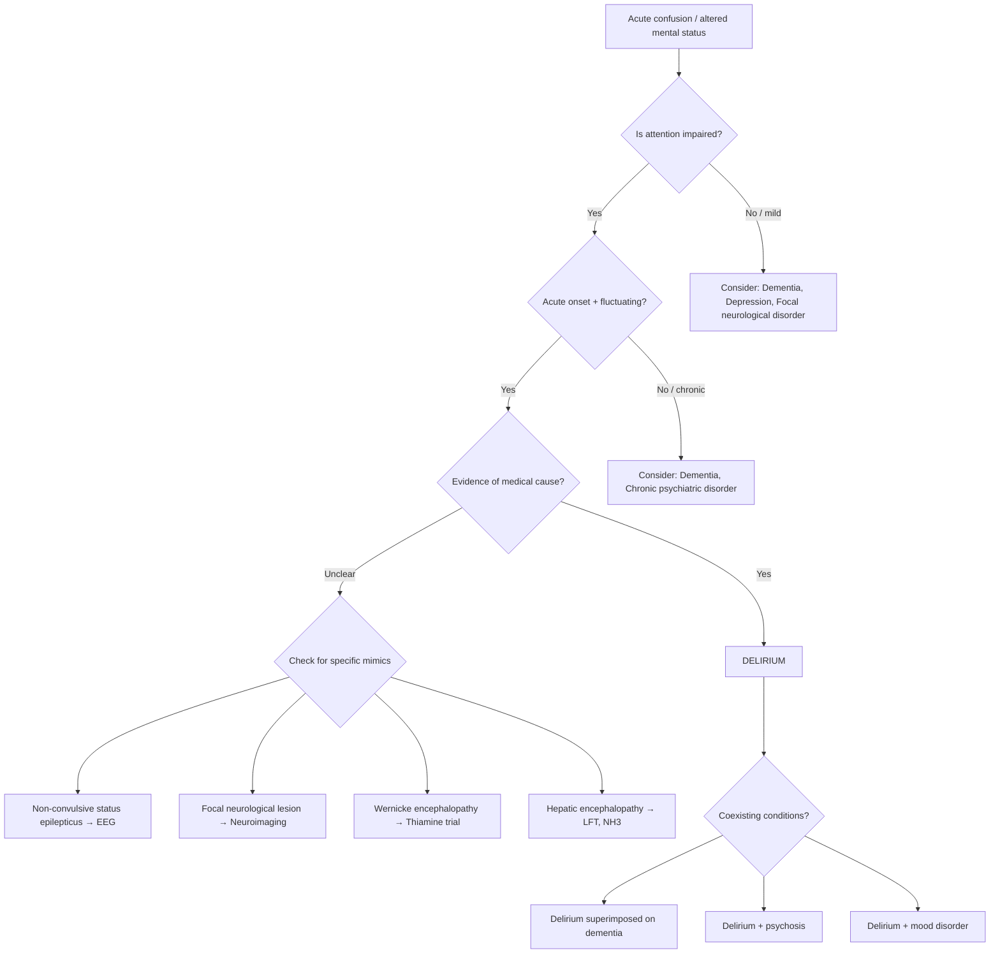

## Differential Diagnosis of Delirium

The core challenge of the differential diagnosis of delirium is this: delirium is a **syndrome of acute, fluctuating, global brain dysfunction**. Several other conditions can mimic parts of this picture — either because they share overlapping features (confusion, hallucinations, agitation, altered consciousness) or because they genuinely coexist with delirium and cloud the clinical picture. Your job is to systematically distinguish them.

The guiding principle is **DSM-5 Criterion D**: the disturbance is ***not better explained by another pre-existing, established or evolving neurocognitive disorder and does not occur in the context of a severely reduced level of arousal (e.g., coma)*** [2]. In other words, you need to exclude conditions that look like delirium but are actually something else — and equally, you need to recognise when delirium is superimposed on a pre-existing condition.

---

### Overview of Key Differential Diagnoses

---

### 1. Dementia

This is the **most commonly confused** differential [2].

| Feature | Delirium | Dementia |
|:---|:---|:---|
| **Onset** | Acute (hours to days) | Gradual (months to years) |
| **Course** | Fluctuating | Progressive deterioration |
| **Consciousness** | **Altered** (key distinguishing feature) | Normal until very late |
| **Attention** | Profoundly impaired (hallmark) | Relatively preserved until late |
| **Perceptual disturbance** | Common (especially VH) | Late stages only |
| **Sleep-wake cycle** | Disrupted | Usually normal |
| **Context** | New illness / medication change | Health unchanged |
| **Reversibility** | Usually reversible | Irreversible (mostly) |

**Why is this tricky?**

- Dementia is the **single strongest predisposing factor** for delirium. Therefore, delirium superimposed on dementia (ICD-10: ***F05.1***) [2] is extremely common and is the hardest diagnostic scenario.
- ***Cognitive fluctuations may occur in dementia, especially in dementia with Lewy bodies and as sundowning phenomenon in Alzheimer's disease*** [2]. In DLB, the fluctuating attention, visual hallucinations, and altered alertness can closely mimic delirium.
- **The rule**: ***Delirium should be ruled out if there is any change in pattern of fluctuation from baseline*** [2]. If a patient with known DLB suddenly becomes more confused than their usual level, treat it as delirium until proven otherwise.

**How to distinguish in practice**:
- Obtain **collateral history** from carers about the **baseline** cognitive state and the **tempo** of change
- Compare current cognitive scores (MMSE/MoCA) to any documented baseline
- Look for an identifiable **precipitant** (new drug, infection, metabolic disturbance)
- **Impaired attention** out of proportion to other cognitive deficits favours delirium

<Callout title="Clinical Pearl" type="error">
Never say "the patient is just demented" without ruling out superimposed delirium. Any **acute** worsening in a demented patient is delirium until proven otherwise. Missing this means missing a treatable — and potentially life-threatening — underlying cause.
</Callout>

---

### 2. Non-Convulsive Status Epilepticus (NCSE)

***Non-convulsive status epilepticus often shows no classical ictal features*** [2]. This is one of the most dangerous mimics because it is a treatable neurological emergency that can look identical to delirium.

**Supportive clinical features** [2]:
1. ***Abnormal movements***: ***prominent bilateral facial twitching, unexplained nystagmoid eye movements, spontaneous hippus*** (rhythmic dilation and constriction of the pupils)
2. ***Automatisms***: ***lip smacking, chewing, swallowing*** (these are stereotyped, repetitive movements generated by temporal lobe seizure activity)
3. ***Acute aphasia or neglect without a structural lesion*** (the seizure activity disrupts cortical language/attention networks without causing a stroke)

**Why it mimics delirium**: Both present with altered consciousness, fluctuating cognition, and inattention. In NCSE, the brain is in a state of continuous abnormal electrical activity — the "confusion" is the clinical manifestation of ongoing subclinical seizures.

**Key distinguishing feature**: ***EEG is required for diagnosis*** [2]. The EEG will show continuous or near-continuous epileptiform discharges.

**When to suspect NCSE over simple delirium**:
- Subtle motor phenomena (facial twitching, oral automatisms)
- History of epilepsy or recent brain insult (stroke, head injury, neurosurgery)
- Rapid fluctuation (seconds to minutes rather than hours)
- Poor response to standard delirium management
- Unexplained nystagmus or hippus

---

### 3. Psychosis (Primary Psychotic Disorders)

***Delirium is characterised by vivid hallucinations, delusions, language disturbances and agitation, which may resemble psychotic disorders or mood disorders with psychotic features*** [2].

| Feature | Delirium | Primary Psychosis (e.g., Schizophrenia) |
|:---|:---|:---|
| **Consciousness** | Altered | **Clear** (this is the key distinction) |
| **Attention** | Profoundly impaired | Relatively preserved (unless very disorganised) |
| **Hallucinations** | Predominantly **visual** | Predominantly **auditory** (especially 3rd-person running commentary, thought echo) |
| **Delusions** | Transient, poorly elaborated, fluctuating | Systematised, fixed, persistent |
| **Onset** | Acute, identifiable precipitant | May be insidious (prodromal phase) |
| **Age** | Any age; more common in elderly | Typically young adult (peak onset 18–25 M, 25–35 F) |
| **Course** | Fluctuating, worse at night | Relatively stable within an episode |
| **Medical cause** | Present | Absent (diagnosis of exclusion) |
| **EEG** | Diffuse slowing | Normal |

**Why this distinction matters**: Treating delirium with antipsychotics alone (without finding the medical cause) is dangerous. Conversely, diagnosing a young patient with "schizophrenia" when they actually have NMDA-receptor encephalitis or a drug-induced delirium has devastating consequences.

**Guidance from the notes on distinguishing primary (psychiatric) vs secondary (medical) psychosis** [2]:
- Secondary psychosis (including delirium) is suggested by: visual hallucinations, older age of onset, acute onset, altered consciousness, disorientation, abnormal vital signs, focal neurological signs, and an identifiable medical precipitant.

### Alcoholic Hallucinosis vs Delirium Tremens

This is a specific and high-yield differential to understand:

***Alcoholic hallucinosis*** [1]:
- Occurs in ***chronic heavy drinkers***
- ***Auditory hallucinations*** (not visual — this is the key difference from DT)
- ***In clear consciousness*** (sensorium is not clouded — unlike DT where consciousness is altered)
- ***Distressing in content***
- ***Some develop schizophrenia, some remit after stopping alcohol use***
- ***Treatment with antipsychotics and advice to abstain from alcohol***

The lecture slide explicitly states the distinguishing features: ***(differentiate from delirium tremens — reduction in alcohol intake, clouded sensorium, visual hallucinations)*** [1].

| Feature | Alcoholic Hallucinosis | Delirium Tremens |
|:---|:---|:---|
| **Consciousness** | ***Clear*** | ***Clouded*** |
| **Hallucinations** | ***Auditory*** | ***Visual*** (predominantly) |
| **Context** | Chronic heavy drinking (may still be drinking) | ***Reduction in / cessation of alcohol intake*** |
| **Autonomic signs** | Absent | Present (tachycardia, sweating, tremor) |
| **Seizures** | No | Yes |
| **Treatment** | Antipsychotics + abstinence | Benzodiazepines + thiamine + fluids |

---

### 4. Acute Stress Disorder / Dissociative States

***Fear, anxiety and dissociative symptoms may also occur in some cases of delirium*** [2].

**Why this is confusing**: A patient who has experienced a traumatic event (e.g., major surgery, ICU stay, assault) may present with:
- Disorientation and confusion (dissociative amnesia)
- Reduced awareness of surroundings (dissociative detachment)
- Emotional numbing or agitation
- Altered perception of reality (derealisation/depersonalisation)

**How to distinguish**:

| Feature | Delirium | Acute Stress Disorder |
|:---|:---|:---|
| **Consciousness** | Altered (drowsiness, reduced arousal) | **Preserved** (may appear "spaced out" but is arousable and oriented once engaged) |
| **Attention** | Globally impaired | May be narrowed/focused but not globally impaired |
| **Cognition** | Globally disturbed | Intact cognitive testing when engaged |
| **Medical cause** | Present | Absent (triggered by psychological trauma) |
| **EEG** | Diffuse slowing | Normal |
| **Hallucinations** | Visual, vivid | Flashbacks (re-experiencing the trauma — not random hallucinations) |
| **Duration** | Days to weeks | 3 days to 1 month (by DSM-5 criteria) |

**The bottom line**: If you can engage the patient and their cognitive testing is normal, it is not delirium.

---

### 5. Other Focal Neurological Disorders

***Focal neurological diseases may be associated with focal disturbances in cognition, and delirium may be associated with focal neurological signs if due to brain lesions*** [2].

Notable examples [2]:

| Condition | What it mimics | Why it's confusing | How to distinguish |
|:---|:---|:---|:---|
| ***Wernicke's aphasia*** | Confused speech, inability to comprehend language | Looks like "confused" patient who gives incoherent answers | Fluent but paraphasic speech; comprehension disproportionately impaired; repetition impaired; **focal** lesion in dominant temporal lobe; consciousness and attention otherwise intact |
| ***Bitemporal lesions*** | Memory loss, confusion, behavioural change | Bilateral temporal damage (e.g., HSV encephalitis) causes amnesia and personality change | Usually has identifiable cause (encephalitis, bilateral strokes); may have seizures; neuroimaging shows bilateral temporal pathology |
| ***Anton's syndrome*** | Patient denies blindness, appears confused | Bilateral occipital lobe lesions → cortical blindness with confabulation about visual ability | Patient bumps into objects but insists they can see; test visual fields formally |
| ***Bifrontal lesions*** | Disinhibition, apathy, impaired executive function | Personality and behavioural change looks like delirium | Usually subacute; consciousness preserved; attention may be mildly impaired but arousal is normal; neuroimaging shows frontal pathology |

**Key principle**: ***Neuroimaging may be required*** [2] to distinguish these from delirium. Focal neurological signs on examination (e.g., hemiparesis, visual field defect, isolated aphasia) should prompt urgent imaging.

---

### 6. Wernicke Encephalopathy

This deserves its own section because it is a critical differential, especially in HK where alcohol misuse and nutritional deficiency are not uncommon.

***Wernicke's encephalopathy*** presents with [1]:
- ***Confusion***
- ***Memory impairment / attention problems / hallucination***
- ***Ophthalmoplegia / nystagmus***
- ***Ataxia (truncal)***
- ***Peripheral neuropathy (50%)***
- ***Hypothermia***
- ***Apathy***
- ***Coma (rare)***

**Why it mimics delirium**: The confusion, inattention, and memory impairment look identical to delirium — and in fact, Wernicke encephalopathy IS a cause of delirium. The distinction matters because the **treatment** is specific: urgent parenteral thiamine.

**How to distinguish Wernicke from "generic" delirium**: Look for the **classic triad** (confusion + ophthalmoplegia + ataxia) — but be aware that the full triad is present in only ~10% of cases. Any confused patient with a history of alcohol misuse or malnutrition should receive empirical thiamine.

---

### 7. Hepatic Encephalopathy

***Hepatic encephalopathy*** is staged by the ***West Haven Criteria*** [1]:

| Stage | Features |
|:---|:---|
| ***Stage 1*** | ***Trivial lack of awareness. Shortened attention span. Impaired addition or subtraction. Hypersomnia, insomnia, or inversion of sleep pattern. Euphoria or depression. Asterixis can be detected.*** |
| ***Stage 2*** | ***Lethargy or apathy. Mild disorientation. Inappropriate behaviour. Slurred speech. Obvious asterixis.*** |
| ***Stage 3*** | ***Gross disorientation. Bizarre behaviour. Semi-stupor to stupor. Asterixis generally absent.*** |
| ***Stage 4*** | ***Coma.*** |

**Why it mimics delirium**: Stages 1–3 of hepatic encephalopathy present exactly like delirium (inattention, disorientation, sleep-wake cycle disruption, personality change, fluctuating course). Hepatic encephalopathy IS a specific cause of delirium. The distinction is important because the management is specific (lactulose, rifaximin, protein restriction, treat precipitants like GI bleeding or infection).

**How to distinguish**: Look for stigmata of chronic liver disease (jaundice, spider naevi, palmar erythema, ascites, caput medusae), asterixis ("liver flap"), elevated ammonia (NH3), and abnormal LFTs. The pathophysiology is accumulation of neurotoxins (especially ammonia) due to hepatic failure → these cross the BBB → astrocyte swelling → cerebral oedema → disrupted neurotransmission (especially increased GABAergic tone).

---

### 8. Depression (Especially in the Elderly)

While depression is more commonly confused with **dementia** (the classic "pseudodementia" scenario [2]), severe depression in the elderly can sometimes mimic **hypoactive delirium**:

| Feature | Hypoactive Delirium | Severe Depression |
|:---|:---|:---|
| **Onset** | Acute | Gradual (weeks) |
| **Consciousness** | Altered | Clear |
| **Attention** | Impaired | May be reduced (poor concentration) but not globally impaired |
| **Cognition** | Globally impaired | May perform poorly on testing due to poor effort ("don't know" answers rather than wrong answers) |
| **Diurnal variation** | Fluctuating, worse at night | Worse in the morning (morning dysphoria) |
| **Psychomotor slowing** | Present | Present (psychomotor retardation) |
| **Medical precipitant** | Present | Absent (though medical illness can trigger depression) |

---

### 9. Substance Intoxication/Withdrawal (Beyond Alcohol)

Various substances can cause states that mimic delirium or indeed cause delirium:

| Substance | Intoxication picture | Withdrawal picture |
|:---|:---|:---|
| **Alcohol** | Confusion, disinhibition, ataxia, slurred speech | ***DT: confusion, VH, agitation, seizures at 24–96h*** [1] |
| **Benzodiazepines** | Drowsiness, slurred speech, ataxia | Similar to alcohol withdrawal (seizures, confusion, agitation) |
| **Opioids** | Drowsiness, miosis, respiratory depression | Agitation, sweating, mydriasis, diarrhoea (rarely causes true delirium) |
| **Anticholinergics** | Classic delirium: "hot as a hare, dry as a bone, red as a beet, blind as a bat, mad as a hatter" | Not typically |
| **Stimulants** (amphetamines, cocaine) | Agitation, paranoia, hallucinations, tachycardia | Crash/depression (not typically delirium) |
| **Cannabis** | Confusion, paranoia, perceptual disturbances | Mild (rarely delirium) |

---

### Summary Table: Key Differentiating Features

| Differential | Key distinguishing features from delirium |
|:---|:---|
| **Dementia** | Chronic, gradual, consciousness preserved, attention relatively spared until late |
| **NCSE** | Subtle motor signs (facial twitching, automatisms); EEG diagnostic |
| **Primary psychosis** | Clear consciousness; auditory > visual hallucinations; systematised delusions; younger age |
| **Alcoholic hallucinosis** | ***Clear consciousness; auditory hallucinations; no autonomic signs*** [1] |
| **Acute stress disorder** | Preserved consciousness and cognition when engaged; psychological trigger; flashbacks not random VH |
| **Focal neurological disorders** | Focal cognitive deficit with preserved consciousness; neuroimaging diagnostic |
| **Wernicke encephalopathy** | Ophthalmoplegia, ataxia, peripheral neuropathy; responds to thiamine |
| **Hepatic encephalopathy** | Asterixis, stigmata of CLD, elevated NH3; specific treatment (lactulose, rifaximin) |
| **Depression** | Gradual onset, clear consciousness, worse in mornings, poor effort on testing |

<Callout title="High Yield Summary">

**Top differentials for delirium (exam favourites):**

1. **Dementia** — most commonly confused. Key: consciousness preserved in dementia; acute change in a demented patient = delirium until proven otherwise.
2. **Non-convulsive status epilepticus** — dangerous mimic; look for facial twitching, automatisms, nystagmus; EEG required.
3. **Primary psychosis** — clear consciousness, auditory hallucinations, systematised delusions, younger patient.
4. **Alcoholic hallucinosis vs DT** — hallucinosis has clear consciousness + auditory hallucinations; DT has clouded consciousness + visual hallucinations.
5. **Wernicke encephalopathy** — confusion + ophthalmoplegia + ataxia; give thiamine empirically.
6. **Hepatic encephalopathy** — asterixis, CLD stigmata, elevated NH3; West Haven staging.
7. **Focal neurological disorders** — Wernicke's aphasia, Anton's syndrome, bifrontal/bitemporal lesions; neuroimaging needed.
8. **Acute stress disorder** — preserved consciousness and cognition when engaged; psychological trigger.

**Golden rule**: Delirium can coexist with any of these conditions (especially dementia). Always rule out delirium first in any acute confusional state.

</Callout>

---

<ActiveRecallQuiz
  title="Active Recall - Differential Diagnosis of Delirium"
  items={[
    {
      question: "What is the single most important clinical feature that distinguishes delirium from dementia?",
      markscheme: "Altered consciousness/level of arousal. In dementia, consciousness is preserved until very late stages. In delirium, consciousness is altered (drowsiness, reduced arousal). Additionally, impaired attention is the hallmark of delirium and is disproportionately severe compared to dementia.",
    },
    {
      question: "A patient with known Alzheimer's disease suddenly becomes more confused than baseline over 24 hours. What should you do and why?",
      markscheme: "Treat as delirium superimposed on dementia until proven otherwise. Any acute change from baseline pattern of fluctuation should prompt evaluation for delirium. Search for precipitants: infection (UTI, pneumonia), medication changes, metabolic disturbance, constipation, urinary retention, pain. Do not attribute acute worsening to dementia progression.",
    },
    {
      question: "How do you distinguish alcoholic hallucinosis from delirium tremens? Name three key differences.",
      markscheme: "1. Consciousness: clear in alcoholic hallucinosis vs clouded in DT. 2. Hallucinations: auditory in hallucinosis vs visual in DT. 3. Context: hallucinosis occurs in chronic heavy drinkers (may still be drinking) vs DT occurs after reduction/cessation of alcohol (24-96h). Additional: DT has autonomic signs and seizures; hallucinosis does not.",
    },
    {
      question: "What clinical features should make you suspect non-convulsive status epilepticus rather than simple delirium?",
      markscheme: "Subtle motor phenomena: bilateral facial twitching, unexplained nystagmoid eye movements, spontaneous hippus. Automatisms: lip smacking, chewing, swallowing. Acute aphasia or neglect without a structural lesion. History of epilepsy or recent brain insult. EEG is required for definitive diagnosis.",
    },
    {
      question: "A confused patient with a history of alcoholism presents with nystagmus and unsteady gait. What is the most important diagnosis to consider and what is the immediate management?",
      markscheme: "Wernicke encephalopathy (classic triad: confusion, ophthalmoplegia/nystagmus, ataxia - though full triad present in only ~10%). Immediate management: parenteral thiamine (IV or IM) BEFORE any glucose administration. Glucose without thiamine can precipitate or worsen Wernicke by exhausting remaining thiamine stores.",
    },
    {
      question: "List the four stages of hepatic encephalopathy according to the West Haven Criteria.",
      markscheme: "Stage 1: Trivial lack of awareness, shortened attention span, impaired arithmetic, sleep pattern changes, euphoria/depression, asterixis detectable. Stage 2: Lethargy/apathy, mild disorientation, inappropriate behaviour, slurred speech, obvious asterixis. Stage 3: Gross disorientation, bizarre behaviour, semi-stupor to stupor, asterixis generally absent. Stage 4: Coma.",
    },
  ]}
/>

## References

[1] Lecture slides: GC 161. Alcohol and the Brain From Psychiatric to Neuropsychiatric Perspectives.pdf (p12, p13, p23, p38, p48)
[2] Senior notes: ryanho-psych.md (sections 4.1–4.2, pages 74–76, 78, 85, 95, 120)
