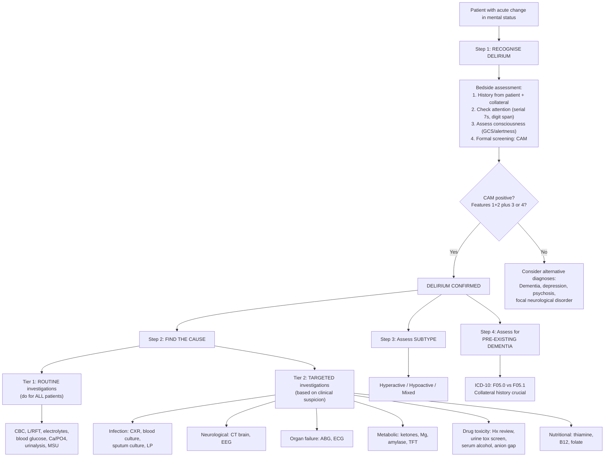
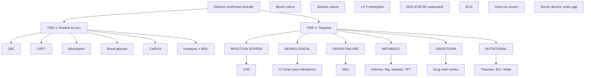

## Diagnostic Criteria

Delirium is fundamentally a **clinical diagnosis**. There is no single blood test, scan, or biomarker that "diagnoses" delirium. You diagnose it at the bedside by recognising the characteristic syndrome, then you investigate to find the underlying cause. Two major classification systems provide formal criteria.

---

### 1. DSM-5 Diagnostic Criteria for Delirium

The DSM-5 criteria are the most widely used in clinical practice and research [2]:

| Criterion | Requirement | Explanation from First Principles |
|:---|:---|:---|
| **A** | ***A disturbance in attention and awareness*** | Attention (the ability to direct, focus, sustain, and shift cognitive processing) is the **cardinal feature**. Awareness refers to reduced orientation to the environment. This reflects cholinergic deficiency in prefrontal-basal forebrain circuits + ARAS dysfunction. |
| **B** | ***The disturbance develops over a short period of time (usually hours to a few days), represents a change from baseline attention and awareness, and tends to fluctuate in severity during the course of a day*** | **Acute onset** distinguishes delirium from dementia (gradual). **Fluctuation** reflects the inherent instability of a brain in metabolic crisis — neurotransmitter levels, cerebral perfusion, and inflammatory mediators are constantly changing. |
| **C** | ***An additional disturbance in cognition (e.g., memory deficit, disorientation, language, visuospatial ability, or perception)*** | "Additional" means on top of the attention/awareness disturbance. This reflects global cortical dysfunction — not just a single domain (which might suggest a focal lesion). |
| **D** | ***Not better explained by another pre-existing, established, or evolving neurocognitive disorder and does not occur in the context of a severely reduced level of arousal (e.g., coma)*** | This criterion forces you to distinguish delirium from dementia and from coma. A comatose patient cannot be assessed for attention or cognition, so delirium cannot be diagnosed. A demented patient can develop delirium, but the acute change must be identified. |
| **E** | ***Evidence from history, physical examination, or investigations that the disturbance is a direct physiological consequence of another medical condition, substance intoxication or withdrawal, or exposure to a toxin, or is due to multiple aetiologies*** | This is the aetiological criterion — you must demonstrate a medical cause. Delirium is NEVER "idiopathic." If you cannot find a cause, keep looking. |

**DSM-5 Specifiers** [2]:
- ***Cause***: substance intoxication delirium, substance withdrawal delirium, medication-induced delirium, delirium due to another medical condition, delirium due to multiple aetiologies
- ***Duration***: ***acute (hours to days)***, ***persistent (weeks to months)***
- ***Activity level***: ***hyperactive, hypoactive, mixed level of activity***

---

### 2. ICD-10 Diagnostic Criteria for Delirium (F05)

The ICD-10 requires **ALL** of the following [2]:

| Criterion | Requirement |
|:---|:---|
| **(a)** | ***Impairment of consciousness and attention*** |
| **(b)** | ***Global disturbance of cognition (perceptual disturbances, impaired thinking and comprehension, memory impairment, disorientation)*** |
| **(c)** | ***Psychomotor disturbance (hypo- or hyperactivity with unpredictable shifts)*** |
| **(d)** | ***Disturbance of sleep-wake cycle*** |
| **(e)** | ***Emotional disturbances*** |

Additional ICD-10 stipulations [2]:
- ***Onset is usually rapid, course diurnally fluctuating with total duration less than 6 months***
- ***Diagnosis can be made even if underlying cause is not clearly established***

**ICD-10 Specifiers** [2]:
- ***Not superimposed on dementia (F05.0)***
- ***Superimposed on dementia (F05.1)***
- ***Other delirium (F05.8)***
- ***Delirium unspecified (F05.9)***

<Callout title="DSM-5 vs ICD-10 — Key Differences">

**DSM-5** focuses on attention/awareness as the core feature (Criterion A) and mandates identification of a medical cause (Criterion E). **ICD-10** is broader, requiring psychomotor disturbance, sleep-wake disruption, and emotional disturbance as mandatory criteria, and notably permits diagnosis even when the underlying cause is not yet established. In practice, use whichever system your institution requires, but understand both for exams.

</Callout>

---

### 3. Bedside Screening Tools

Since delirium is ***often under-recognised ( > 70% missed diagnosis)*** [2], structured screening tools are essential. They do not replace clinical judgement but standardise detection.

#### 3.1 Confusion Assessment Method (CAM) — Gold Standard Screening Tool

The CAM is the most widely validated and used bedside screening tool for delirium worldwide. It operationalises the DSM criteria into four features:

| Feature | Assessment | Based on |
|:---|:---|:---|
| **Feature 1** | **Acute onset and fluctuating course** | Is there an acute change in mental status from baseline? Does the abnormal behaviour fluctuate during the day? |
| **Feature 2** | **Inattention** | Does the patient have difficulty focusing attention (e.g., easily distracted, difficulty keeping track of what is being said)? |
| **Feature 3** | **Disorganised thinking** | Is the patient's thinking disorganised or incoherent (rambling, irrelevant conversation, unclear flow of ideas)? |
| **Feature 4** | **Altered level of consciousness** | Anything other than alert (vigilant, lethargic, stuporous, comatose)? |

**Diagnostic algorithm**: Delirium is present if **Feature 1 AND Feature 2** are present, PLUS **either Feature 3 OR Feature 4**.

- Sensitivity: ~94–100%
- Specificity: ~90–95%

**CAM-ICU**: A modified version for patients who cannot speak (e.g., intubated in ICU). Uses visual and motor-based attention tests instead of verbal ones.

> **High Yield**: The CAM is the most commonly asked-about screening tool for delirium in exams. Remember: Features 1 + 2 are mandatory, plus either 3 or 4.

#### 3.2 Cognitive Assessment Tools

These are used to ***document change in mental status*** [2]:

| Tool | What it tests | Role in delirium |
|:---|:---|:---|
| ***MMSE*** (Mini-Mental State Examination) | Global cognition (orientation, registration, attention/calculation, recall, language, construction); 30 points | Useful to document cognitive baseline and track change. Not specific for delirium (also abnormal in dementia). Does not specifically assess attention well. |
| ***MoCA*** (Montreal Cognitive Assessment) | More sensitive for executive function and attention; 30 points | Better than MMSE for detecting subtle cognitive impairment. More emphasis on attention and executive function. |
| **Serial sevens** | Attention specifically | Subtract 7 from 100 repeatedly (100, 93, 86, 79, 72, 65). Tests sustained attention and working memory — core deficits in delirium. |
| **Digit span** | Attention and working memory | Forward: repeat increasing sequences of digits (normal ≥ 5). Backward: repeat in reverse (normal ≥ 3). Impaired in delirium. |
| **Days/months backwards** | Attention | Recite days of the week or months of the year in reverse order. Simple, rapid bedside test. |

#### 3.3 Alcohol Withdrawal Assessment

For the specific context of suspected alcohol withdrawal delirium:

| Tool | Description |
|:---|:---|
| ***CIWA-Ar*** (Clinical Institute Withdrawal Assessment for Alcohol, revised) | Quantifies severity of alcohol withdrawal out of 67 points. Interpretation: ***< 10 very mild, 10–15 mild, 16–20 modest, > 20 severe*** [2]. Guides benzodiazepine dosing (symptom-triggered therapy for CIWA-Ar ≥ 8). |
| ***SADQ*** (Severity of Alcohol Dependence Questionnaire) | Estimates severity of dependence and predicts risk during detoxification. *** > 30 is an indication for in-patient detoxification*** [2]. |

---

## Diagnostic Algorithm

The clinical approach to delirium follows a two-step process:
1. **Recognise the syndrome** (using clinical assessment ± CAM)
2. **Find the cause** (systematic investigations)

The notes emphasise that delirium is ***often under-recognised ( > 70% missed diagnosis)*** [2], so Step 1 requires a high index of suspicion.

---

## Investigation Modalities

The purpose of investigations in delirium is **not to confirm the diagnosis** (which is clinical) but to **identify the underlying cause**. The notes organise investigations into routine and targeted categories [2].

### 1. Routine Investigations (Do for ALL Patients with Delirium)

These are marked with an asterisk (*) in the original notes [2], indicating they should be performed in every case:

| Investigation | What you are looking for | Key findings / Interpretation |
|:---|:---|:---|
| ***CBC**** | Infection (↑WCC, neutrophilia), anaemia (↓Hb → cerebral hypoxia), thrombocytopaenia (DIC from sepsis, liver disease) | Leucocytosis with left shift suggests bacterial infection. Macrocytic anaemia → consider B12/folate deficiency or alcohol. Pancytopaenia → consider bone marrow failure, severe sepsis. |
| ***L/RFT**** (Liver/Renal Function Tests) | Organ failure — hepatic encephalopathy (↑bilirubin, ↑ALT/AST, ↓albumin, ↑NH3), uraemia (↑urea, ↑creatinine) | ***Abnormal albumin*** [2] is itself a risk factor. ↑NH3 with deranged LFT → hepatic encephalopathy. ↑Urea/creatinine → uraemic encephalopathy. |
| ***Electrolytes**** | Hypo/hypernatraemia, hypo/hyperkalaemia | Hyponatraemia is the most common electrolyte cause of confusion. Rapid correction risks osmotic demyelination syndrome (central pontine myelinolysis). |
| ***Blood glucose**** | ***Hypoglycaemia or hyperglycaemia*** [2] | Hypoglycaemia (< 3 mmol/L) is a medical emergency — the brain depends almost entirely on glucose for energy. Hyperglycaemia → hyperosmolar state → dehydration → confusion. |
| ***Ca/PO4**** | Hypercalcaemia (malignancy, hyperparathyroidism → "stones, bones, groans, moans, and psychiatric overtones") | Hypercalcaemia → ↓neuronal excitability → confusion, drowsiness, coma. |
| ***Urinalysis**** / ***MSU**** | UTI — the single most common precipitant of delirium in the elderly | Positive nitrites + leucocytes → suggestive of UTI. Send MSU for culture and sensitivity. Remember: asymptomatic bacteriuria is common in the elderly and does not necessarily mean UTI is causing delirium. |

### 2. Targeted Investigations (Based on Clinical Suspicion)

#### 2.1 Infection Screen

| Investigation | When to order | Key findings |
|:---|:---|:---|
| ***CXR*** | All patients (some consider routine); especially if respiratory symptoms, fever, hypoxia | Consolidation → pneumonia (second most common precipitant after UTI in HK elderly). Pulmonary oedema → heart failure → hypoxia. |
| ***Blood culture*** | Fever, rigors, haemodynamic instability, suspected septicaemia | Positive cultures identify the organism and guide antibiotic therapy. Must be taken BEFORE starting antibiotics. |
| ***Sputum culture*** | Productive cough, CXR consolidation | Organism identification for targeted antibiotic therapy. |
| ***Lumbar puncture (LP)*** | Suspected ***CNS infection*** (fever + neck stiffness + confusion), suspected encephalitis | CSF analysis: cell count, protein, glucose, Gram stain, culture, viral PCR (especially HSV). Raised WCC + raised protein + low glucose → bacterial meningitis. Lymphocytosis + raised protein + normal glucose → viral/TB meningitis. |

#### 2.2 Neurological Investigations

| Investigation | When to order | Key findings |
|:---|:---|:---|
| ***CT brain*** | See specific indications below | Structural lesion: SDH, tumour, stroke, hydrocephalus, cerebral oedema. Normal CT does NOT exclude a neurological cause (encephalitis may have a normal early CT). |
| ***EEG*** | Suspected ***non-convulsive status epilepticus***; when diagnosis is uncertain | ***Diffuse slowing of background cortical activity*** [2] is the characteristic finding in delirium — reflects global cortical hypofunction. Epileptiform discharges → NCSE. |
| ***MRI brain*** | When CT is non-diagnostic but suspicion for structural/inflammatory pathology remains high | More sensitive than CT for encephalitis (temporal lobe signal change in HSV), small infarcts, white matter disease, posterior reversible encephalopathy syndrome (PRES). |
| ***LP*** | See infection screen above; also for suspected autoimmune encephalitis | NMDA-receptor antibodies, anti-LGI1 antibodies in autoimmune encephalitis. |

**Indications for neuroimaging in delirium** [2]:

> 1. ***New focal neurological signs***
> 2. ***History or signs of head trauma***
> 3. ***Fever (for CNS infection)***
> 4. ***No other identifiable cause***
> 5. ***Nil or incomplete history***
> 6. ***Neurological exam cannot be completed***

<Callout title="When to CT the Head" type="idea">
The general principle: neuroimaging has a ***low yield*** in delirium [2] — most causes are systemic, not structural. But you MUST image if there are focal signs, trauma history, fever suggesting CNS infection, or if you simply cannot find another cause. Think of CT brain as a "rule-out" test for dangerous structural pathology, not a "rule-in" test for delirium.
</Callout>

#### 2.3 Organ Failure Workup

| Investigation | When to order | Key findings |
|:---|:---|:---|
| ***ABG*** (Arterial Blood Gas) | Suspected hypoxia, respiratory failure, metabolic acidosis | Hypoxia (PaO2 < 8 kPa) → cerebral hypoxia → delirium. Metabolic acidosis → consider DKA, lactic acidosis (sepsis), uraemia, salicylate/methanol poisoning. Respiratory alkalosis → may indicate early sepsis or hepatic encephalopathy (hyperventilation). |
| ***ECG*** | Cardiac cause suspected (arrhythmia, MI), medication monitoring (QTc prolongation from antipsychotics) | Arrhythmias → reduced cardiac output → cerebral hypoperfusion. MI may present atypically in the elderly with confusion rather than chest pain. Check QTc before starting haloperidol. |

#### 2.4 Metabolic Investigations

| Investigation | When to order | Key findings |
|:---|:---|:---|
| ***Blood glucose / ketones*** | All patients (routine); DKA, hypoglycaemia | Already discussed above. Ketones + hyperglycaemia + acidosis → DKA. |
| ***Mg*** (Magnesium) | Alcohol withdrawal, malnutrition, diuretic use | Hypomagnesaemia → neuronal hyperexcitability → seizures, tremor, confusion. Often co-exists with hypokalaemia and hypocalcaemia. |
| ***Amylase*** | Abdominal pain, suspected pancreatitis | Acute pancreatitis can cause delirium via systemic inflammation, pain, and metabolic derangement. |
| ***TFT*** (Thyroid Function Tests) | Suspected thyroid disease (especially in elderly women) | Thyrotoxicosis → agitation, confusion ("thyroid storm"). Myxoedema → drowsiness, hypothermia, confusion ("myxoedema madness"). |

#### 2.5 Drug Toxicity / Substance Screen

| Investigation | When to order | Key findings |
|:---|:---|:---|
| ***History review*** | ALWAYS — this is the most important "investigation" | Review the drug chart meticulously. Look for new medications, dose changes, anticholinergic drugs, opioids, benzodiazepines, steroids, digoxin, diuretics. Calculate the anticholinergic burden. |
| ***Urine toxicology screen*** | Suspected substance abuse, unknown ingestion, young patients with unexplained delirium | Detects amphetamines, benzodiazepines, opioids, cannabis, cocaine, barbiturates. |
| ***Serum alcohol level*** | Suspected intoxication or withdrawal | Elevated → intoxication. Low/absent in a known drinker → consider withdrawal. |
| ***Anion gap*** | Suspected toxic ingestion (methanol, ethylene glycol) | Elevated anion gap metabolic acidosis with osmolar gap → toxic alcohol ingestion. |

#### 2.6 Nutritional Investigations

| Investigation | When to order | Key findings |
|:---|:---|:---|
| ***Thiamine (Vitamin B1)*** | Alcoholism, malnutrition, prolonged vomiting (hyperemesis), refeeding | Low thiamine → Wernicke encephalopathy. **Do NOT wait for the result** — treat empirically with parenteral thiamine if clinically suspected. Pathophysiology: thiamine is a cofactor for pyruvate dehydrogenase and α-ketoglutarate dehydrogenase → deficiency → impaired oxidative metabolism → neuronal death in mammillary bodies and periventricular grey matter. |
| ***B12, folate*** | Macrocytic anaemia, chronic alcohol use, malnutrition, elderly | B12 deficiency → subacute combined degeneration of the cord + cognitive impairment. Folate deficiency → megaloblastic anaemia + neuropsychiatric symptoms. |

---

### 3. EEG — Special Considerations

The EEG deserves additional discussion because it is both diagnostically relevant and commonly asked about [2].

| Aspect | Detail |
|:---|:---|
| **Characteristic finding in delirium** | ***Diffuse slowing of background cortical activity*** [2] — the normal alpha rhythm (8–13 Hz) is replaced by slower theta (4–7 Hz) and delta (< 4 Hz) activity. This reflects global cortical hypofunction. |
| **Diagnostic yield** | ***Not reliable: false negative 17%, false positive 22%*** [2] |
| **Primary role** | ***Limited role; useful when suspecting non-convulsive seizures, especially if suspicious of brain insult*** [2] |
| **Exception — alcohol/sedative withdrawal** | In withdrawal states, the EEG may show fast (beta) activity rather than slowing, because the brain is in a hyperexcitable state (loss of GABAergic inhibition). |
| **Exception — hepatic encephalopathy** | Triphasic waves — characteristic but not pathognomonic. These are high-amplitude, sharp waves with a triphasic morphology, most prominent frontally. |

**Why "diffuse slowing"?** The normal alpha rhythm depends on intact thalamocortical oscillatory circuits. When the thalamus is disrupted by metabolic derangement, inflammation, or neurotransmitter imbalance, these circuits slow down — just like a computer processor slowing down when overheated.

---

### 4. Investigation Algorithm Summary

---

<Callout title="High Yield Summary">

**Diagnostic Criteria:**
- **DSM-5**: 5 criteria (A–E). Core = disturbance in attention/awareness (A) + acute onset with fluctuation (B) + additional cognitive disturbance (C) + not explained by pre-existing neurocognitive disorder or coma (D) + evidence of medical cause (E). Specify: cause, duration (acute/persistent), subtype (hyperactive/hypoactive/mixed).
- **ICD-10**: ALL of (a)–(e) required: consciousness/attention + global cognition + psychomotor + sleep-wake + emotional. Duration < 6 months. Specify: superimposed on dementia or not.

**Screening**: CAM is the gold standard bedside tool. Delirium = Features 1+2 (mandatory) PLUS either 3 or 4.

**Investigations — Two Tiers:**
- **Routine (ALL patients)**: CBC, L/RFT, electrolytes, glucose, Ca/PO4, urinalysis/MSU.
- **Targeted**: CXR, blood cultures, ABG, ECG, CT brain (6 indications), EEG (for NCSE), urine tox, serum alcohol, thiamine/B12/folate, LP.

**EEG**: Diffuse slowing of background activity; limited yield (FN 17%, FP 22%); main role is to exclude NCSE.

**Neuroimaging**: Low yield; 6 indications — new focal signs, head trauma, fever, no other cause, incomplete history, cannot complete neuro exam.

**CIWA-Ar**: For alcohol withdrawal severity (out of 67); ≥ 8 triggers benzodiazepine therapy.

</Callout>

---

<ActiveRecallQuiz
  title="Active Recall - Diagnostic Criteria and Investigations for Delirium"
  items={[
    {
      question: "List the five DSM-5 criteria (A-E) for delirium in your own words.",
      markscheme: "A: Disturbance in attention and awareness. B: Develops acutely (hours-days), change from baseline, fluctuates during the day. C: Additional cognitive disturbance (memory, orientation, language, visuospatial, perception). D: Not explained by pre-existing neurocognitive disorder or coma. E: Evidence of medical cause (medical condition, substance intoxication/withdrawal, toxin, or multiple aetiologies).",
    },
    {
      question: "Describe the CAM screening tool. Which features are mandatory for a positive diagnosis?",
      markscheme: "CAM has 4 features: 1-Acute onset and fluctuating course, 2-Inattention, 3-Disorganised thinking, 4-Altered level of consciousness. Delirium requires Features 1 AND 2 (both mandatory) PLUS either Feature 3 OR Feature 4. Sensitivity ~94-100%, specificity ~90-95%.",
    },
    {
      question: "What is the characteristic EEG finding in delirium, and what is the main clinical role of EEG in the delirium workup?",
      markscheme: "Characteristic finding: diffuse slowing of background cortical activity (normal alpha replaced by theta/delta). Yield is limited (FN 17%, FP 22%). Main role: to exclude non-convulsive status epilepticus, especially if suspicious of brain insult. Not used as a routine diagnostic test for delirium.",
    },
    {
      question: "List the six indications for neuroimaging in delirium.",
      markscheme: "1. New focal neurological signs. 2. History or signs of head trauma. 3. Fever (to rule out CNS infection). 4. No other identifiable cause found. 5. Nil or incomplete history available. 6. Neurological examination cannot be completed.",
    },
    {
      question: "A known alcoholic is admitted with confusion. What specific assessment scale would you use to quantify withdrawal severity, and at what score would you initiate benzodiazepine therapy?",
      markscheme: "CIWA-Ar (Clinical Institute Withdrawal Assessment for Alcohol, revised), scored out of 67. Interpretation: less than 10 very mild, 10-15 mild, 16-20 modest, greater than 20 severe. Symptom-triggered benzodiazepine therapy is initiated at CIWA-Ar score of 8 or above. SADQ greater than 30 indicates need for in-patient detoxification.",
    },
    {
      question: "Name the routine (Tier 1) investigations you would order for every patient with delirium and explain the rationale for each.",
      markscheme: "CBC (infection, anaemia), L/RFT (hepatic/renal failure, albumin), electrolytes (hypo/hypernatraemia), blood glucose (hypo/hyperglycaemia), Ca/PO4 (hypercalcaemia), urinalysis and MSU (UTI - commonest precipitant in elderly). These cover the most common and treatable causes of delirium systematically.",
    },
  ]}
/>

## References

[1] Lecture slides: GC 161. Alcohol and the Brain From Psychiatric to Neuropsychiatric Perspectives.pdf (p12, p48)
[2] Senior notes: ryanho-psych.md (sections 4.1, pages 74–76, 105)
