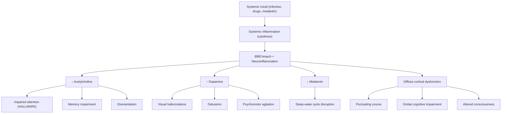

## 1. Definition

**Delirium** — from the Latin *de-* ("off, away from") + *lira* ("furrow, track"), literally meaning "off the track" or "derailed" — is an ***acute confusional state*** characterised by impairment in both ***consciousness*** and ***cognition*** [1][2].

Think of it this way: the brain's "operating system" has crashed. Unlike dementia, where specific "programs" (memory, language) fail one by one, delirium is a global system failure — the whole computer is glitching. It represents a ***common final pathway of disrupted cerebral homeostasis*** [2].

<Callout title="Core Concept">
Delirium is NOT a disease in itself — it is a **syndrome** (a clinical manifestation of an underlying medical insult). Finding delirium means you must find the cause. It is the brain's "fever" — a non-specific alarm signal that something is physiologically wrong.
</Callout>

Key definitional features:
- **Acute onset** (hours to days, not weeks to months)
- **Fluctuating course** (classically worse at night — "sundowning")
- **Impaired attention** (the cardinal, hallmark feature)
- **Altered level of consciousness** (distinguishes it from dementia)
- **Evidence of an underlying medical cause** (always)

---

## 2. Epidemiology

| Setting | Prevalence / Incidence |
|:---|:---|
| General hospitalised patients | ***14–24%*** at any point [2] |
| Elderly presenting to A&E | ***10–30%*** harbour a life-threatening condition [2] |
| Post-surgical (esp. hip fracture, cardiac surgery) | 15–53% |
| ICU patients | 60–80% (mechanically ventilated) |
| Palliative care / terminal illness | Up to 85% |
| Nursing home residents | 10–40% |

- **Prevalence increases with age** — because ***cerebral reserve*** (the brain's ability to tolerate physiological insults) diminishes with age [2]
- ***35–40% 1-year mortality*** in older patients presenting to A&E with delirium [2]
- **Massively under-recognised**: ***> 70% of delirium cases are missed*** by clinical teams, especially the hypoactive subtype (the "quiet" delirious patient who is just drowsy) [2]

> **High Yield**: Delirium is an **independent predictor of mortality**. Mortality data: ***14% at 1 month, 22% at 6 months, 6× that of non-delirious patients*** [2]. It also confers a ***5× increased incidence of dementia within 2 years*** [2].

### Hong Kong Context
- Hong Kong has a rapidly ageing population (> 20% aged ≥ 65 by 2026). Delirium is extremely common on geriatric, orthopaedic, and medical wards in the Hospital Authority system.
- Polypharmacy in elderly patients (multiple chronic medications) is a major driver.
- Common precipitants in HK include urinary tract infections, pneumonia, constipation, dehydration, and medication changes (especially after admission).

---

## 3. Risk Factors

The concept here is **predisposing factors** (baseline vulnerability) × **precipitating factors** (acute insult) = delirium. A patient with high baseline vulnerability (e.g., demented, elderly, sensory impaired) needs only a minor precipitant (e.g., a urinary catheter insertion, constipation) to tip into delirium. A young, healthy patient would need a massive insult (e.g., major surgery, septic shock) [2].

### 3.1 Predisposing Factors (Baseline Vulnerability)

| Factor | Why it predisposes |
|:---|:---|
| ***Dementia*** | Reduced cognitive reserve — the brain is already operating at its limit |
| ***Previous episode of delirium*** | Indicates underlying brain vulnerability |
| ***Older age*** | Reduced cerebral reserve, ↓ cholinergic neurons, ↓ cerebral blood flow |
| ***Functional impairment*** | Marker of frailty and reduced physiological reserve |
| ***Sensory impairment*** (vision/hearing) | Reduced external orientation cues → the brain "fills in gaps" with misperceptions |
| ***History of cerebrovascular disease*** | Pre-existing brain damage reduces reserve |
| ***Alcohol misuse*** | Chronic neurotoxicity, thiamine deficiency, liver disease |
| Severe comorbid illness | Multiple organ systems are already stressed |

### 3.2 Precipitating Factors (Acute Insult)

The classic mnemonic is ***DELIRIUM(S)*** [2]:

| Letter | Category | Examples |
|:---|:---|:---|
| **D** | **Drugs** | Anticholinergics, opioids, benzodiazepines, steroids, digoxin, diuretics, polypharmacy |
| **E** | **Electrolytes** | Hypo/hypernatraemia, hypercalcaemia, hypo/hyperglycaemia |
| **L** | **Low oxygen** | Hypoxia (pneumonia, PE, COPD exacerbation, post-operative) |
| **I** | **Infection** | ***UTI, respiratory infection***, septicaemia, meningitis/encephalitis |
| **R** | **Retention** (of urine or faeces) | Urinary retention, constipation → surprisingly potent precipitants |
| **I** | **Ictogenic** (seizures) | Post-ictal states, non-convulsive status epilepticus |
| **U** | **Underhydration / Undernutrition** | Dehydration, malnutrition, thiamine/B12 deficiency |
| **M** | **Metabolic** (especially glucose) | Hepatic encephalopathy, uraemia, hypo/hyperglycaemia, metabolic acidosis, abnormal albumin |
| (S) | **Subdural / Structural** | Head injury, space-occupying lesions, stroke |

Additional precipitants from lecture slides and notes [1][2]:
- ***Use of physical restraints*** (worsens agitation, ↓ orientation)
- ***Bladder catheter*** (discomfort, infection risk, unfamiliar sensation)
- ***Pain*** (uncontrolled pain is a major precipitant)
- ***Sleep deprivation*** (disrupts circadian regulation of neurotransmitters)
- ***Constipation*** (often overlooked!)
- ***Unfamiliar environment*** (ICU, post-transfer between wards)

### 3.3 Six Causes of Confusion in Alcoholism (Lecture Slide — High Yield)

***Six causes of confusion in alcoholism*** [1]:
1. ***Intoxication***
2. ***Delirium tremens (DT)***
3. ***Head injury*** (alcoholics fall frequently)
4. ***Metabolic disturbances (e.g., hypoglycaemia)***
5. ***Hepatic encephalopathy***
6. ***Wernicke encephalopathy***

<Callout title="Clinical Pearl" type="error">
Never assume a confused alcoholic patient is "just drunk." You must systematically exclude all six causes listed above. Missing Wernicke encephalopathy or a subdural haematoma from a fall is a catastrophic and avoidable error. Always give **thiamine BEFORE glucose** in alcoholics — glucose without thiamine can precipitate or worsen Wernicke encephalopathy by exhausting remaining thiamine stores.
</Callout>

---

## 4. Anatomy and Functional Basis

Understanding delirium requires understanding what "consciousness" and "attention" actually are neuroanatomically.

### 4.1 Consciousness

Consciousness has two components:
1. **Arousal** (wakefulness): Governed by the **ascending reticular activating system (ARAS)** in the brainstem (pons, midbrain), which projects diffusely to the thalamus and cortex. Damage or dysfunction here → reduced level of arousal (drowsiness → stupor → coma).
2. **Awareness** (content of consciousness): Governed by the **cerebral cortex**, especially the association cortices. Damage here → confusion, disorientation, impaired cognition.

In delirium, **both arousal and awareness** are disrupted — this is what distinguishes it from dementia (where arousal is preserved until very late stages).

### 4.2 Attention

- Attention is the ability to **select and sustain focus** on relevant stimuli while filtering out irrelevant ones.
- Key structures: **prefrontal cortex** (executive control), **posterior parietal cortex** (spatial attention), **thalamus** (sensory gating), and the **reticular formation** (alerting).
- **Acetylcholine (ACh)** is the primary neurotransmitter for attentional processing (basal forebrain cholinergic system — nucleus basalis of Meynert).
- This is why **anticholinergic drugs** are such potent precipitants of delirium — they directly impair the attentional system.

### 4.3 Circadian Rhythm

- The **suprachiasmatic nucleus (SCN)** of the hypothalamus is the master circadian clock.
- It regulates the sleep-wake cycle via melatonin (from the pineal gland) and cortisol.
- In delirium, disruption of these circuits (by inflammation, medications, ICU environment) leads to the characteristic **sleep-wake cycle disturbance**.

### 4.4 Neurotransmitter Systems Involved

| System | Role in delirium |
|:---|:---|
| **Acetylcholine (ACh)** ↓ | **Central to delirium pathophysiology.** Reduced cholinergic transmission → impaired attention, memory, and cortical processing. This is why anticholinergic drugs cause delirium and why demented patients (who already have ACh deficiency) are vulnerable. |
| **Dopamine (DA)** ↑ | Excess dopamine → psychomotor agitation, hallucinations, delusions. This is why **antipsychotics** (dopamine blockers) help in hyperactive delirium. |
| **GABA** | Altered GABAergic tone — relevant in hepatic encephalopathy (excess GABA-ergic activity) and alcohol/benzodiazepine withdrawal (sudden loss of GABA-ergic activity). |
| **Glutamate** | Excitotoxicity via NMDA receptors may contribute to neuronal injury in prolonged delirium. |
| **Serotonin (5-HT)** | Serotonin syndrome can cause delirium; serotonin excess contributes to agitation and autonomic instability. |
| **Melatonin** ↓ | Disruption of circadian regulation → sleep-wake cycle disturbance. |

---

## 5. Pathophysiology

The pathophysiology of delirium is ***poorly understood*** [2], but several converging hypotheses exist. Think of them as overlapping mechanisms rather than competing theories:

### 5.1 Neuroinflammatory Hypothesis (Most Important)

1. A systemic insult (infection, surgery, trauma) triggers a **systemic inflammatory response** (↑ IL-1, IL-6, TNF-α).
2. These pro-inflammatory cytokines cross the **blood-brain barrier** (BBB), which becomes more permeable with age, illness, and inflammation.
3. Within the brain, **microglial activation** occurs → neuroinflammation → impaired neuronal function.
4. This disrupts neurotransmitter synthesis and release, particularly **reducing acetylcholine** and **increasing dopamine**.
5. The result: global cortical dysfunction → delirium.

Why does this explain the clinical features?
- ↓ ACh → impaired attention, memory, orientation
- ↑ DA → hallucinations, agitation, psychosis
- Neuroinflammation → diffuse cortical dysfunction → fluctuating symptoms

### 5.2 Cholinergic Deficiency Hypothesis

- Acetylcholine is the most critical neurotransmitter for sustained attention and cortical arousal.
- Any insult that ↓ ACh synthesis (hypoxia, hypoglycaemia) or blocks ACh receptors (anticholinergic drugs) can precipitate delirium.
- **Serum anticholinergic activity** correlates with delirium severity in some studies.
- This is why the elderly are so vulnerable — they already have age-related cholinergic decline.

### 5.3 Oxidative Stress Hypothesis

- Cerebral hypoxia, hypoperfusion, or metabolic derangement → impaired oxidative metabolism → reduced ATP production → neuronal dysfunction.
- The brain is exquisitely sensitive to metabolic insults because it consumes ~20% of total body oxygen despite being only ~2% of body weight.

### 5.4 Neural Network Disconnection

- Recent neuroimaging studies (fMRI, EEG) show that delirium involves a **breakdown of functional connectivity** between brain networks — particularly the default mode network, the dorsal attention network, and thalamocortical circuits.
- **EEG characteristically shows diffuse slowing of background cortical activity** [2] — reflecting global cortical hypofunction.

### 5.5 Neurotransmitter Imbalance Summary

```
Systemic insult → Systemic inflammation → BBB breach →
Neuroinflammation (microglial activation) →
↓ Acetylcholine + ↑ Dopamine + ↓ Melatonin →
Impaired attention + psychosis + sleep-wake disruption →
DELIRIUM
```

---

## 6. Aetiology (with Hong Kong Focus)

### 6.1 Classification by Cause

| Category | Common causes | Notes |
|:---|:---|:---|
| **Infections** | UTI, pneumonia, cellulitis, septicaemia, meningitis/encephalitis | ***UTI and pneumonia are the #1 precipitants in HK elderly*** |
| **Metabolic** | Hypo/hypernatraemia, hypercalcaemia, hypo/hyperglycaemia, uraemia, hepatic encephalopathy, metabolic acidosis, abnormal albumin | Check electrolytes, glucose, renal/liver function |
| **Drugs** | ***Anticholinergics, opioids, benzodiazepines, steroids, digoxin, diuretics*** [2] | Polypharmacy is a huge problem in HK elderly |
| **Substance-related** | ***Alcohol intoxication, withdrawal, delirium tremens*** [1][2] | See delirium tremens section below |
| **Hypoxia** | Post-operative, pneumonia, PE, COPD, heart failure | ***Post-operative delirium is extremely common*** |
| **Organ failure** | ***Renal, hepatic, cardiac failure*** | Hepatic encephalopathy is a classic cause |
| **Neurological** | Post-ictal, head injury, stroke, space-occupying lesion, encephalitis, non-convulsive status epilepticus | Always consider in acute-onset confusion |
| **Nutritional** | ***Thiamine deficiency (Wernicke), B12, folate*** | Especially in alcoholics and malnourished elderly |
| **Other** | ***Pain, urinary retention, constipation, sleep deprivation, physical restraints, bladder catheter*** [2] | These "minor" precipitants are commonly missed |

### 6.2 Delirium Tremens (DT) — Special Case

***Delirium tremens*** is the ***severe form of alcohol withdrawal*** [1]:

| Feature | Detail |
|:---|:---|
| **Timing** | ***Occurs 24–96 hours after abstention*** [1] |
| **Clinical features** | ***Confusion, hallucinations, severe agitation, seizures*** [1] |
| **Mortality** | ***5%*** [1] |
| **Status** | ***Medical emergency requiring hospitalisation*** [1] |

***Management of delirium tremens*** [1]:
- ***Benzodiazepines in decreasing dosage (lorazepam/diazepam/others)*** — first-line
- ***Anticonvulsants (carbamazepine)*** — for seizure prophylaxis/treatment
- ***Proactive use of parenteral vitamins (thiamine)*** — ALWAYS give thiamine before glucose
- ***Neuroleptics for control of agitation***
- ***Fluid and electrolyte balance***

**Why benzodiazepines are first-line in DT but second-line in other delirium**: In alcohol withdrawal, the problem is sudden loss of GABA-ergic activity (alcohol chronically potentiates GABA receptors → withdrawal removes this → GABA underactivity → excitotoxicity, seizures). Benzodiazepines directly replace the lost GABA-ergic activity. In contrast, in most other forms of delirium, benzodiazepines can worsen confusion because they are sedating and have paradoxical effects in the elderly.

---

## 7. Classification

### 7.1 By Psychomotor Activity

| Subtype | Features | Prevalence | Prognosis |
|:---|:---|:---|:---|
| ***Hyperactive*** | Agitation, restlessness, hallucinations, pulling at lines/tubes, combativeness | ~25% | Better (because it gets noticed and treated) |
| ***Hypoactive*** | Drowsiness, lethargy, reduced responsiveness, psychomotor slowing, withdrawn | ~25% | ***Worse prognosis*** [2] — often missed ("quiet delirium") |
| ***Mixed*** | Fluctuates between hyperactive and hypoactive states ***unpredictably*** | ~35% | Intermediate |
| Unclassifiable | Does not fit neatly into above categories | ~15% | Variable |

<Callout title="Clinical Pearl" type="error">
**Hypoactive delirium is the most commonly missed subtype** and carries the **worst prognosis** because it is often mistaken for depression or normal sleepiness, leading to delayed treatment. The patient who is "just a bit drowsy" may be delirious. Always screen for inattention in any patient with altered behaviour.
</Callout>

### 7.2 By Aetiology (DSM-5)

- ***Substance intoxication delirium***
- ***Substance withdrawal delirium***
- ***Medication-induced delirium***
- ***Delirium due to another medical condition***
- ***Delirium due to multiple aetiologies***

### 7.3 By Duration (DSM-5)

- ***Acute***: hours to days
- ***Persistent***: weeks to months

### 7.4 By Relationship to Dementia (ICD-10)

- ***Not superimposed on dementia (F05.0)***
- ***Superimposed on dementia (F05.1)*** — this is extremely common and is the hardest to diagnose

---

## 8. Clinical Features

The clinical features of delirium are a variety of ***neuropsychiatric disturbances*** [2]. I will separate these systematically into symptoms and signs, with the pathophysiological basis explained inline.

### 8.1 Symptoms (What the Patient/Carer Reports)

#### 8.1.1 Impaired Consciousness
- **Drowsiness, lethargy, reduced arousal** → due to disruption of the ***ascending reticular activating system (ARAS)*** and thalamocortical circuits by neuroinflammation and neurotransmitter imbalance
- **Disorientation** — classically ***time > place > person*** (time orientation is the most fragile and first to go because it requires continuous updating by working memory, which depends on intact attention and prefrontal function) [2]
- In severe cases → **stupor or coma** (profound ARAS dysfunction)

#### 8.1.2 Impaired Attention (The ***Hallmark*** of Delirium)
- ***Distractibility*** during conversations [2] — the patient cannot maintain focus; they drift off mid-sentence, are drawn to irrelevant stimuli. This is because the prefrontal cortex and basal forebrain cholinergic system (which sustain attention) are dysfunctional.
- Inability to follow commands or track a conversation
- Cannot maintain a coherent train of thought
- **Testing**: ***serial sevens*** (subtract 7 from 100 repeatedly), days of the week backwards, months of the year backwards, digit span [2]

> **High Yield**: Impaired attention is the ***hallmark*** [2] and the **most specific feature** that distinguishes delirium from other conditions. If attention is normal, it is unlikely to be delirium.

#### 8.1.3 Cognitive Disturbance
- ***Generally global*** — involving ***memory loss, difficulty with language/speech*** [2]
- ***Thinking is slow and muddled, but often rich in content (dream-like)*** [2] — this "dream-like" quality occurs because the brain is generating internal imagery (similar to dreaming) due to disrupted thalamocortical gating. The thalamus normally filters sensory input; when it fails, internal representations intrude into consciousness.
- **Disorientation** (as above)
- **Memory impairment**: Primarily affects **registration** (laying down new memories) and **short-term memory** because these depend on sustained attention. Remote memory may be relatively preserved.
- **Executive dysfunction**: Impaired planning, judgment, and problem-solving (prefrontal cortex dysfunction)

#### 8.1.4 Psychosis-like Symptoms
- ***Perceptual disturbances***: ***illusions*** (misinterpretation of real stimuli, e.g., mistaking an IV pole for a person) and ***hallucinations*** (***especially visual hallucinations***) [2]
  - **Why visual hallucinations?** Visual processing requires complex cortical integration (occipital → temporal → parietal). When cortical function is globally disrupted, the visual system is particularly vulnerable to generating false percepts. Also, ↑ dopamine in the mesolimbic pathway promotes hallucinations.
  - Auditory hallucinations can occur but are less prominent than in primary psychotic disorders
- ***Delusions/abnormal beliefs***: ***typically referential or persecutory*** but ***usually transient and poorly elaborated*** [2] — meaning the patient may believe staff are trying to poison them, but they cannot give you a detailed, fixed delusional system (unlike schizophrenia where delusions are often systematised)
- ***Disorganised thinking***: ***disorganised or incoherent speech, rambling or irrelevant conversations*** [2] — reflecting global cortical dysfunction disrupting the language and thought-organisation networks

#### 8.1.5 Sleep-Wake Cycle Disturbance (Another ***Hallmark***)
- ***Can range from daytime drowsiness + nighttime insomnia to complete sleep cycle reversal*** [2]
- ***Another hallmark of delirium*** [2]
- **Pathophysiology**: Disruption of the suprachiasmatic nucleus (SCN) → melatonin circuit. Inflammation, hospital environment (constant light, noise in ICU), and medications all disrupt circadian rhythmicity. ↓ Melatonin secretion has been documented in delirious patients.

#### 8.1.6 Mood Disturbance
- ***Variable, may be labile*** [2]
- ***May involve depression, euphoria, anxiety, anger, fear, apathy*** [2]
- Mood lability (rapid swings between emotional states) reflects prefrontal cortical disinhibition and limbic system dysregulation
- **Fear and anxiety** are especially common in hyperactive delirium — imagine being in a dream state where you are confused, misperceiving your environment, and unable to understand what is happening to you

#### 8.1.7 Psychomotor Disturbance (Reported by Carers)
- ***Can be hypo- or hyperactive and can shift between these states unpredictably*** [2]
- **Hyperactive**: agitation, restlessness, pulling at tubes/lines, trying to get out of bed, combativeness
- **Hypoactive**: lethargy, withdrawal, reduced spontaneous movement, minimal speech
- Reflects the balance between dopaminergic excess (hyperactive) and cholinergic deficit (hypoactive)

#### 8.1.8 Course (How the Symptoms Evolve Over Time)
- ***Acute onset with diurnal fluctuation*** (***usually worse at night***) [2]
- ***Lasting days to months*** (***< 6 months in ICD-10***) [2]
- **Why worse at night ("sundowning")?** At night: ↓ environmental orientation cues (reduced lighting, fewer staff interactions), ↓ melatonin disruption becomes more apparent, and sensory deprivation increases the brain's tendency to generate internal percepts (hallucinations)

### 8.2 Signs (What the Clinician Observes on Examination)

| Sign | Description | Pathophysiological Basis |
|:---|:---|:---|
| **Reduced level of consciousness** | GCS may be reduced; patient may be drowsy or difficult to rouse | ARAS dysfunction |
| **Inattention** | Cannot follow commands, loses thread of conversation, fails serial sevens or digit span | Cholinergic deficit in prefrontal-basal forebrain circuits |
| **Disorientation** | Especially to time; may not know date, day, month, year | Requires continuous updating by working memory (attention-dependent) |
| **Cognitive impairment** | MMSE/MoCA scores are acutely reduced from baseline | Global cortical dysfunction |
| **Abnormal speech** | ***Incoherent, rapid or slow*** [2]; may be rambling, disorganised | Disrupted language networks (Wernicke/Broca circuits) + executive dysfunction |
| **Perceptual abnormalities** | Visual hallucinations (patient picking at bedsheets — "carphologia"), illusions | Thalamocortical gating failure + dopaminergic excess |
| **Psychomotor changes** | Agitation, restlessness, or lethargy, hypokinesia | Dopaminergic-cholinergic imbalance |
| **Autonomic signs** (especially in hyperactive delirium) | Tachycardia, hypertension, sweating, tremor, mydriasis | Sympathetic nervous system activation (especially in withdrawal states) |
| **Asterixis** (negative myoclonus) | "Liver flap" — if hepatic encephalopathy is the cause | Metabolic encephalopathy disrupting motor cortex |
| **Multifocal myoclonus** | Irregular, asymmetric jerking movements | Diffuse cortical irritability from metabolic derangement |
| **Fluctuating examination** | Findings change between visits, even within the same day | Inherent property of delirium — fluctuating cortical dysfunction |

### 8.3 Delirium vs Dementia — Key Distinguishing Features

This table is **extremely high yield** for exams [2]:

| Feature | Delirium | Dementia |
|:---|:---|:---|
| ***Onset*** | ***Acute*** | ***Gradual*** |
| ***Duration*** | ***Hours to weeks*** | ***Months to years*** |
| ***Course*** | ***Fluctuating*** | ***Progressive deterioration*** |
| ***Consciousness*** | ***Altered*** | ***Normal*** (until very late stages) |
| ***Context*** | ***New illness/medication*** | ***Health unchanged*** |
| ***Perceptual disturbance*** | ***Common*** | ***Occurs in late stages*** |
| ***Sleep-wake cycle*** | ***Disrupted*** | ***Usually normal*** |
| ***Orientation*** | ***Usually impaired for time and unfamiliar people/places*** | ***Impaired in late stages*** |
| ***Speech*** | ***Incoherent, rapid or slow*** | ***Word finding difficulties*** |
| ***Attention*** | **Profoundly impaired (hallmark)** | **Relatively preserved until late** |

<Callout title="Critical Distinction" type="error">
Delirium and dementia frequently **coexist** (delirium superimposed on dementia, ICD-10 F05.1). In fact, dementia is the **single strongest predisposing factor** for delirium. When a demented patient suddenly worsens, **always rule out delirium first** — do not attribute the deterioration to "progression of dementia." Cognitive fluctuations can occur in dementia (especially Lewy body dementia and as "sundowning" in Alzheimer's), but **any change from the patient's baseline pattern of fluctuation should prompt evaluation for delirium** [2].
</Callout>

### 8.4 Clinical "Red Flags" That Should Prompt You to Think Delirium

- Any **acute** change in cognition or behaviour from baseline
- New-onset confusion in any hospitalised patient
- Agitation or combativeness in a previously calm patient
- Sudden drowsiness or withdrawal not explained by medications
- New visual hallucinations
- Acute deterioration in a patient with known dementia
- Post-operative confusion (especially in elderly after hip fracture or cardiac surgery)
- Alcohol withdrawal 24–96 hours after last drink

---

## 9. Summary of Pathophysiology → Clinical Feature Connections



---

<Callout title="High Yield Summary">

**Definition**: Acute confusional state = impaired consciousness + impaired cognition. A syndrome, not a disease — always find the cause.

**Epidemiology**: 14–24% hospitalised patients; > 70% missed; 6× mortality vs non-delirious. 35–40% 1-year mortality in elderly.

**Risk Factors**: Predisposing (dementia, old age, sensory impairment, alcohol) × Precipitating (DELIRIUM mnemonic: Drugs, Electrolytes, Low O2, Infection, Retention, Ictogenic, Underhydration, Metabolic).

**Pathophysiology**: Systemic insult → neuroinflammation → ↓ ACh + ↑ DA + ↓ melatonin → global cortical dysfunction.

**Core Clinical Features**:
- **Hallmarks**: Impaired attention + sleep-wake cycle disruption
- Acute onset, fluctuating course (worse at night), disorientation (time > place > person)
- Visual hallucinations, transient poorly-elaborated delusions
- Psychomotor disturbance (hyper/hypo/mixed)
- Mood lability

**Subtypes**: Hyperactive (25%), Hypoactive (25% — worst prognosis, most missed), Mixed (35%).

**Delirium tremens**: Severe alcohol withdrawal at 24–96h; confusion, hallucinations, agitation, seizures; 5% mortality; Rx: benzodiazepines + thiamine + fluids.

**Key Distinction from Dementia**: Acute (not gradual), altered consciousness (not normal), fluctuating (not progressive), impaired attention (hallmark), triggered by illness/medication.

</Callout>

---

<ActiveRecallQuiz
  title="Active Recall - Delirium (Definition to Clinical Features)"
  items={[
    {
      question: "What is the hallmark clinical feature of delirium, and how do you test for it at the bedside?",
      markscheme: "Impaired attention is the hallmark. Test with serial sevens (subtract 7 from 100 repeatedly), days of the week backwards, months backwards, or digit span. Distractibility during conversation is also a key sign.",
    },
    {
      question: "Name the three psychomotor subtypes of delirium. Which carries the worst prognosis and why?",
      markscheme: "Hyperactive, hypoactive, and mixed. Hypoactive carries the worst prognosis because it is most commonly missed (patient appears drowsy/withdrawn rather than agitated), leading to delayed identification and treatment of the underlying cause.",
    },
    {
      question: "Explain the cholinergic deficiency hypothesis of delirium. Why does this make anticholinergic drugs a potent precipitant?",
      markscheme: "Acetylcholine is the primary neurotransmitter for sustained attention and cortical arousal (basal forebrain cholinergic system). Any insult reducing ACh synthesis or blocking ACh receptors causes impaired attention and global cortical dysfunction. Anticholinergic drugs directly block muscarinic receptors, precipitating delirium by further reducing an already vulnerable cholinergic system, especially in the elderly.",
    },
    {
      question: "List the six causes of confusion in an alcoholic patient.",
      markscheme: "1. Intoxication, 2. Delirium tremens, 3. Head injury, 4. Metabolic disturbances (e.g. hypoglycaemia), 5. Hepatic encephalopathy, 6. Wernicke encephalopathy.",
    },
    {
      question: "What is the typical timing and mortality of delirium tremens? What is the first-line pharmacological treatment and why?",
      markscheme: "Occurs 24-96 hours after abstention. Mortality approximately 5%. First-line is benzodiazepines (lorazepam/diazepam) in decreasing dosage because alcohol withdrawal causes sudden loss of GABAergic activity (alcohol chronically potentiates GABA receptors); benzodiazepines directly replace the lost GABAergic activity. Also give parenteral thiamine, anticonvulsants, fluids and electrolyte correction.",
    },
    {
      question: "A 78-year-old with known Alzheimer's dementia is suddenly more confused than usual. How do you distinguish an acute delirium superimposed on dementia from progression of dementia?",
      markscheme: "Key features favouring delirium over dementia progression: acute onset (hours-days vs months-years), altered consciousness/arousal (not normal), fluctuating course, profound inattention, visual hallucinations, sleep-wake cycle disruption, and an identifiable precipitant (new infection, medication, metabolic derangement). Any change from the patient's baseline pattern of fluctuation should prompt evaluation for delirium. Dementia progression is gradual and does not alter consciousness.",
    },
  ]}
/>

## References

[1] Lecture slides: GC 161. Alcohol and the Brain From Psychiatric to Neuropsychiatric Perspectives.pdf (p12, p48)
[2] Senior notes: ryanho-psych.md (sections 4.1, pages 74–76)
