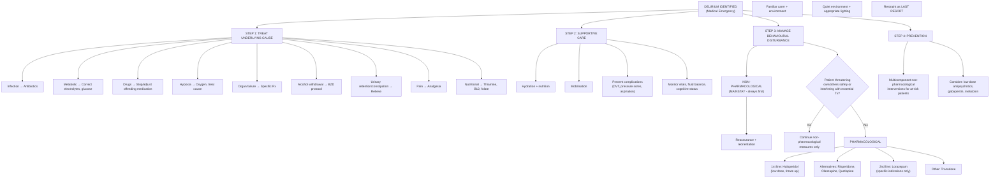

## Management of Delirium

The overarching philosophy of delirium management is simple but critical: **delirium is a ***medical emergency**** [2]. The confusion itself is not the disease — it is a symptom of an underlying medical insult that is threatening the brain. Therefore, the management hierarchy is:

1. **Treat the underlying cause** (this is the definitive treatment)
2. **Provide supportive care** (keep the patient safe and oriented)
3. **Manage behavioural disturbance** (non-pharmacological first, then pharmacological only when necessary)
4. **Prevent delirium** in at-risk patients (proactive multicomponent strategies)

---

### Management Algorithm

---

### Step 1: Treat the Underlying Cause

This is the **most important** step. ***Most cases recover rapidly when the underlying cause is treated*** [2]. Without treating the cause, no amount of antipsychotic or reorientation will fix delirium.

| Underlying Cause | Specific Treatment | Rationale |
|:---|:---|:---|
| **Infection** (UTI, pneumonia, sepsis) | Appropriate antibiotics based on cultures / empirical guidelines | Infection → systemic inflammation → neuroinflammation → delirium. Killing the source stops the inflammatory cascade. |
| **Metabolic derangement** | Correct specific abnormality: IV normal saline for hyponatraemia (carefully!), calcium for hypercalcaemia, insulin for DKA, dextrose for hypoglycaemia | Neuronal function depends on precise ionic and metabolic milieu. Correction restores normal neurotransmission. |
| **Drug-related** | ***Stop or adjust the offending medication*** — review anticholinergics, opioids, benzodiazepines, steroids, digoxin, diuretics | The drug is directly disrupting neurotransmitter balance (e.g., anticholinergics block ACh → impaired attention). Removal allows cholinergic recovery. |
| **Hypoxia** | Supplemental O2, treat underlying cause (pneumonia, PE, COPD, HF) | The brain consumes ~20% of total O2. Hypoxia → impaired oxidative metabolism → neuronal dysfunction. |
| **Organ failure** | Hepatic encephalopathy: lactulose, rifaximin. Renal failure: dialysis if indicated. Cardiac failure: diuretics, afterload reduction. | Organ failure → accumulation of toxins (NH3, uraemic toxins) → direct neurotoxicity. |
| **Alcohol withdrawal / DT** | See dedicated section below | Sudden loss of GABAergic inhibition → neuronal hyperexcitability. |
| **Urinary retention / constipation** | Catheterisation (if retention confirmed), laxatives/enema | These "minor" causes are surprisingly potent precipitants. Relief of discomfort and visceral afferent stimulation resolves the delirium. |
| **Pain** | Appropriate analgesia (but avoid opioids if possible — use paracetamol, regional anaesthesia) | Uncontrolled pain → cortisol and catecholamine surges → neuroinflammation and sleep disruption. Paradoxically, opioids for pain can also cause delirium — hence the preference for non-opioid approaches. |
| **Nutritional deficiency** | ***Thiamine (parenteral) → BEFORE glucose*** [1], B12, folate replacement | Thiamine is a cofactor for oxidative metabolism; B12 for myelin synthesis and methionine metabolism. |

#### Alcohol Withdrawal / Delirium Tremens — Specific Management

***Delirium tremens is a medical emergency requiring hospitalisation*** [1].

| Component | Detail |
|:---|:---|
| **Setting** | Indications for in-patient detox: ***severe dependence (SADQ > 30)***, ***history of severe withdrawal (seizures, DT)***, ***very high consumption ( > 30 units/day)***, ***concomitant BZD misuse***, ***significant medical/psychiatric comorbidity*** [2] |
| **Supportive** | NPO if necessary, correct volume deficits, stabilise haemodynamics [2] |
| **Correct metabolic derangements** | ***HypoGly, hypoK, hypoMg, hypoPO4, ketoacidosis*** [2] |
| **Thiamine** | ***Proactive use of parenteral vitamins (thiamine)*** [1] — give BEFORE glucose. This prevents Wernicke encephalopathy. Thiamine is a cofactor for pyruvate dehydrogenase; glucose loading without thiamine exhausts remaining stores. |
| **Nutritional supplements** | Multivitamins with folate [2] |
| **Benzodiazepines** (first-line) | ***Benzodiazepines in decreasing dosage (lorazepam/diazepam/others)*** [1]. Symptom-triggered dosing using ***CIWA-Ar ≥ 8*** [2] is preferred (requires intensive monitoring, e.g., hourly); fixed-schedule dosing if symptom-triggered is not feasible. ***Prefer long-acting BZDs, e.g., diazepam (Valium), chlordiazepoxide (Librium)*** [2]. |
| ***Anticonvulsants*** | ***Carbamazepine*** [1] — for seizure prophylaxis/treatment |
| ***Neuroleptics*** | ***Neuroleptics for control of agitation*** [1] — used adjunctively for severe agitation/psychosis not controlled by BZDs alone |
| ***Fluid and electrolyte balance*** | ***Fluid and electrolyte balance*** [1] — DT patients lose large volumes through sweating and have poor oral intake |
| **Refractory DT** | ***Barbiturates or propofol*** [2]; transfer to ICU |

**Why benzodiazepines are first-line in alcohol withdrawal but second-line in other delirium**: Alcohol chronically enhances GABA-A receptor activity. Abrupt cessation → sudden loss of GABAergic inhibition → neuronal hyperexcitability → seizures, autonomic storm, delirium. Benzodiazepines are cross-tolerant with alcohol at the GABA-A receptor, directly replacing the lost inhibition. This is pharmacological substitution therapy — analogous to methadone in opioid withdrawal. In contrast, in non-alcohol delirium, the primary problem is usually cholinergic deficiency and dopaminergic excess, so benzodiazepines (which are GABAergic sedatives) do not address the core pathophysiology and may paradoxically worsen confusion, especially in the elderly.

---

### Step 2: Supportive Care

Supportive care maintains physiological stability while the underlying cause is being treated.

| Measure | Rationale |
|:---|:---|
| **IV fluids / oral hydration** | Many delirious patients are dehydrated (fever, poor oral intake, diuretics). Dehydration → reduced cerebral perfusion → worsened delirium. |
| **Nutrition** | Ensure adequate caloric intake; consider NG feeding if oral intake is poor. Malnutrition worsens cognitive function and delays recovery. |
| **Early mobilisation** | Bed rest → muscle deconditioning, DVT, pressure sores, further cognitive decline. Getting the patient upright and moving (when safe) accelerates recovery. |
| **Thromboprophylaxis** | Agitated patients may be restrained or immobilised → ↑ DVT/PE risk. Give LMWH prophylaxis. |
| **Pressure sore prevention** | Delirious patients (especially hypoactive) may be immobile for prolonged periods. Regular turning and pressure-relieving mattresses. |
| **Aspiration prevention** | Confused patients may aspirate. Sit upright for meals, consider thickened fluids, speech and language therapy assessment for swallowing if needed. |
| **Monitoring** | Regular vital signs, fluid balance, cognitive assessment (CAM, MMSE/MoCA), blood glucose, electrolytes. Serial monitoring tracks response to treatment. |

---

### Step 3: Management of Behavioural Disturbance

This section primarily applies to **hyperactive delirium** (agitation, pulling at lines, combativeness) but principles also apply to managing distressing symptoms in hypoactive delirium (hallucinations causing distress, severe anxiety).

#### 3A. Non-Pharmacological Management — ***The Mainstay*** [2]

***Non-pharmacological measures are the mainstay*** [2] of delirium management. They should **always** be initiated first and continued even when pharmacological treatment is added.

| Intervention | Mechanism / Rationale |
|:---|:---|
| ***Frequent reassurance and reorientation*** [2] | The delirious brain has lost its internal compass. Repeatedly telling the patient where they are, what date it is, who you are, and what is happening reduces anxiety and confusion. Place clocks, calendars, and familiar objects at the bedside. |
| ***Ensure familiar carer and environment*** [2] | Unfamiliar faces and environments increase disorientation. Having a family member or consistent nurse at the bedside ("specialling") provides a familiar anchor point. Avoid unnecessary ward transfers. |
| ***Offer quiet environment and appropriate lighting*** [2] | Excessive noise and stimulation overload the already-compromised brain. However, the environment should not be too dark — **appropriate lighting** helps maintain the sleep-wake cycle and reduces visual misperceptions (illusions). Nightlights reduce nocturnal hallucinations. |
| **Minimise unnecessary procedures** | Every blood draw, catheterisation, or alarm beep is a noxious stimulus that can worsen agitation. Only do what is clinically essential. |
| **Ensure sensory aids** | If the patient uses glasses or hearing aids, ensure these are available. Sensory deprivation worsens delirium (the brain fills gaps with hallucinations). |
| **Avoid physical restraints** | ***Restraint as last resort*** [2]. Restraints worsen agitation (the patient fights against them → injury, rhabdomyolysis, DVT, skin breakdown), increase distress, and are associated with worse outcomes. They should only be used when there is immediate danger to the patient or staff and all other measures have failed. |
| **Maintain sleep hygiene** | Reduce noise and light at night, cluster nursing interventions to allow uninterrupted sleep, avoid caffeinated drinks in the evening. |
| **Early mobilisation** | Getting the patient out of bed (when safe) promotes orientation, maintains muscle strength, and supports circadian rhythm. |

<Callout title="Clinical Pearl" type="idea">
Think of non-pharmacological management as **restoring the brain's external scaffolding**. The delirious brain has lost its internal ability to orient itself, maintain attention, and filter stimuli. By providing a calm, well-lit, familiar, and structured environment with consistent caregivers and frequent reorientation, you are acting as an external "cognitive prosthesis" until the brain recovers.
</Callout>

#### 3B. Pharmacological Management

***Pharmacological treatment is indicated only when the patient threatens their own or others' safety, or when behavioural disturbance interferes with essential treatment*** [2] (e.g., pulling out IV lines with antibiotics for sepsis, removing an endotracheal tube, preventing essential investigations).

##### 3B.1 First-Line: Antipsychotics

**Haloperidol** ("Haldol") is the ***first-line*** agent [2].

- **Drug name breakdown**: Haloperidol is a **butyrophenone** — a first-generation (typical) antipsychotic.
- **Mechanism**: Blocks **D2 dopamine receptors** in the mesolimbic pathway → reduces hallucinations, delusions, agitation, and psychomotor hyperactivity. This directly addresses the **dopaminergic excess** component of delirium pathophysiology.
- **Why haloperidol is preferred**: ***Preferred due to its longer clinical experience*** [2]. It has minimal anticholinergic effects (important because you don't want to worsen cholinergic deficiency), minimal hypotension (no alpha-1 blockade compared to chlorpromazine), can be given IM, and has a predictable onset of action.
- **Dosing**: ***Starts at a very low dose and titrated upwards to achieve desirable calming effect. Typically administered in IM form Q6h at 1–5 mg/day*** [2]. In the elderly, start even lower (0.25–0.5 mg).

| Aspect | Detail |
|:---|:---|
| Route | Oral, IM (preferred in agitated patients who refuse oral), IV (ICU setting — monitor QTc) |
| Onset | IM: 15–30 minutes; Oral: 30–60 minutes |
| Duration | 12–36 hours (long half-life) |
| Target | Calm the patient without over-sedating. The goal is a patient who is settled and can cooperate with care, NOT a sleeping patient. |

**Contraindications / Cautions for Haloperidol**:

| Contraindication / Caution | Reason |
|:---|:---|
| **Parkinson's disease / Lewy body dementia** | D2 blockade worsens Parkinsonism catastrophically. DLB patients have ***antipsychotic sensitivity (30–50%): acute irreversible Parkinsonism, loss of consciousness ± neuroleptic malignant syndrome (NMS)*** [2]. Use **quetiapine** instead (lowest D2 affinity among antipsychotics). |
| **Prolonged QTc** | Haloperidol prolongs the QTc interval → risk of Torsades de Pointes → cardiac arrest. Always check ECG/QTc before starting and monitor during treatment. |
| **Alcohol/sedative withdrawal** | Haloperidol lowers the seizure threshold → can precipitate withdrawal seizures. Use benzodiazepines as first-line in this context. |
| **Anticholinergic delirium** | While haloperidol has low anticholinergic activity itself, antipsychotics do not address the underlying ACh deficiency. Specific treatment (physostigmine) may be needed. |

**Alternative antipsychotics** [2]:

| Drug | Class | Advantages | Disadvantages |
|:---|:---|:---|:---|
| ***Risperidone*** | SGA (atypical) | Oral; effective for agitation | Risk of EPSE at higher doses; stroke risk in elderly with dementia |
| ***Olanzapine*** | SGA (atypical) | IM available; sedating (useful at night) | Metabolic effects; anticholinergic properties; ***may be associated with ↑ mortality in older patients with dementia*** [2] |
| ***Quetiapine*** | SGA (atypical) | **Safest in Parkinson's / DLB** (lowest D2 blockade); sedating | More hypotension (alpha-1 blockade); less evidence base |

> **High Yield**: ***Atypical antipsychotics are tested only in small uncontrolled studies and may be associated with ↑ mortality in older patients with dementia*** [2]. This is the reason for the "black box warning" — use the lowest effective dose for the shortest possible duration. ***Keep lowest dose and shortest period if possible; don't prescribe medications unless significant BPSD*** [3].

<Callout title="Exam Favourite" type="error">
**Which antipsychotic should you AVOID in a patient with Parkinson's disease or Lewy body dementia who develops delirium?** Haloperidol (and most typical antipsychotics). Use **quetiapine** instead. DLB patients have severe antipsychotic sensitivity — even a single dose of haloperidol can cause irreversible Parkinsonism, loss of consciousness, or neuroleptic malignant syndrome.
</Callout>

##### 3B.2 Second-Line: Benzodiazepines

***Benzodiazepines have a limited role in the treatment of delirium*** [2]. They are **second-line** and reserved for specific indications.

**Drug of choice**: ***Lorazepam*** [2]

- **Drug name breakdown**: Lorazepam is a short-to-intermediate-acting benzodiazepine.
- **Mechanism**: Enhances GABA-A receptor activity → increased chloride influx → neuronal hyperpolarisation → sedation, anxiolysis, anticonvulsant effect, muscle relaxation.
- **Why lorazepam specifically?** It has **no active metabolites** (metabolised by glucuronidation, not oxidation) → safer in hepatic impairment (common in elderly and alcoholic patients). It has a predictable IM absorption (unlike diazepam which is erratically absorbed IM).

***Lorazepam is mainly reserved for*** [2]:
1. ***Sedative/alcohol withdrawal*** — benzodiazepines are first-line here (GABA replacement therapy)
2. ***Parkinson's disease*** — when antipsychotics are contraindicated (benzodiazepines do not worsen Parkinsonism)
3. ***Neuroleptic malignant syndrome (NMS)*** — when delirium is caused by antipsychotic-induced NMS, you must stop all antipsychotics and use lorazepam for sedation + dantrolene + bromocriptine [2]

**Why NOT benzodiazepines routinely?** In non-withdrawal delirium:
- They cause over-sedation → worsens hypoactive delirium
- Paradoxical disinhibition in the elderly (patient becomes MORE agitated)
- Respiratory depression (especially when combined with opioids)
- They worsen cognitive impairment
- They do not address the underlying ACh deficit / DA excess

| Benzodiazepine | When to Use in Delirium | When to AVOID |
|:---|:---|:---|
| **Lorazepam** | Alcohol/BZD withdrawal, PD, NMS, seizures | Non-withdrawal delirium in elderly (paradoxical worsening) |
| ***Diazepam / Chlordiazepoxide*** | ***Preferred for alcohol withdrawal protocol*** (long-acting → smoother taper) [1][2] | Hepatic impairment (active metabolites accumulate); non-withdrawal delirium |

##### 3B.3 Other Agents

| Agent | Role | Mechanism |
|:---|:---|:---|
| ***Trazodone*** [2] | Useful for insomnia and mild agitation in delirium | Serotonin antagonist and reuptake inhibitor (SARI); potent 5-HT2A/H1 blockade → sedation without the EPSE or anticholinergic effects of antipsychotics. Gentler option for mild nocturnal agitation. |
| **Dexmedetomidine** | ICU setting for intubated patients | Alpha-2 agonist → sedation without respiratory depression. Emerging evidence for delirium management in ICU. Not routine in general wards. |

---

### Step 4: Prevention of Delirium

Prevention is arguably the most important aspect of delirium management because **prevention is far more effective than treatment** — delirium, once established, carries significant morbidity and mortality even after resolution.

#### 4A. Non-Pharmacological Multicomponent Prevention

This is the **evidence-based gold standard** for delirium prevention, based on the landmark Hospital Elder Life Program (HELP) and subsequent studies.

***Modifying risk factors*** [2]:

| Intervention | Target | Mechanism |
|:---|:---|:---|
| ***Orientation and therapeutic activities for cognitive impairment*** [2] | Cognitive stimulation | Keeps cortical circuits active; compensates for reduced cerebral reserve |
| ***Early mobilisation*** [2] | Physical deconditioning | Immobility → functional decline → ↑ delirium risk. Getting patients moving maintains circadian rhythm and orientation. |
| ***Prefer nonpharmacological approaches (minimise psychoactive drug use)*** [2] | Drug-induced delirium | Every sedative, opioid, and anticholinergic added increases the risk. Prescribe only what is essential. |
| ***Interventions to prevent sleep deprivation*** [2] | Sleep-wake cycle | Cluster nursing activities, reduce nocturnal noise/light, warm drinks at bedtime, avoid sedative hypnotics. |
| ***Communication methods and adaptive equipment for vision and hearing impairment*** [2] | Sensory deprivation | Provide glasses, hearing aids, magnifying glasses, written communication boards. Sensory deprivation removes orientation cues → brain fills gaps with hallucinations. |
| ***Early intervention for volume depletion*** [2] | Dehydration | Encourage oral fluids, early IV hydration if needed. Dehydration → reduced cerebral perfusion. |

#### 4B. Pharmacological Prevention

***Medications: low-dose antipsychotics, gabapentin, melatonin may be useful*** [2].

| Agent | Evidence / Mechanism | Notes |
|:---|:---|:---|
| **Low-dose antipsychotics** (e.g., haloperidol 0.5 mg nocte) | Some evidence for reduced incidence/duration of delirium in high-risk surgical patients | Evidence is mixed; not universally recommended. May reduce severity rather than incidence. |
| **Melatonin** (0.5–3 mg nocte) | Restores circadian rhythm; anti-inflammatory properties; neuroprotective | Emerging evidence for prevention (not treatment) of delirium. Safe, well-tolerated, minimal side effects. Addresses the melatonin deficiency seen in delirious patients. |
| **Gabapentin** | GABAergic modulation; may reduce post-operative delirium | Limited evidence; used in some post-surgical protocols. |
| **Ramelteon** (melatonin receptor agonist) | MT1/MT2 receptor agonist → promotes sleep | Some evidence for prevention in elderly medical/surgical patients. |

<Callout title="Prevention vs Treatment" type="idea">
The strongest evidence in delirium management is for **non-pharmacological multicomponent prevention** (HELP-type interventions), which reduces delirium incidence by ~30–40% in high-risk populations. In contrast, pharmacological treatment of established delirium has a weaker evidence base — we use it to manage dangerous symptoms, not to "cure" the delirium. The cure is treating the underlying cause.
</Callout>

---

### Pharmacological Summary Table

| Drug | Class | Indication in Delirium | Dose Range | Key Side Effects / Contraindications |
|:---|:---|:---|:---|:---|
| ***Haloperidol*** | Typical antipsychotic | ***1st-line for hyperactive delirium*** [2] | 0.25–5 mg/day IM/PO Q6h | QTc prolongation, EPSE, avoid in PD/DLB, lowers seizure threshold |
| ***Risperidone*** | Atypical antipsychotic | Alternative to haloperidol | 0.25–2 mg/day PO | EPSE at higher doses, stroke risk in elderly with dementia |
| ***Olanzapine*** | Atypical antipsychotic | Alternative; IM available | 2.5–10 mg/day PO/IM | Anticholinergic effects, metabolic syndrome, ↑ mortality in elderly dementia |
| ***Quetiapine*** | Atypical antipsychotic | **Preferred in PD / DLB** | 12.5–200 mg/day PO | Hypotension, sedation; safest re: EPSE |
| ***Lorazepam*** | Benzodiazepine | ***2nd-line; reserved for alcohol/BZD withdrawal, PD, NMS*** [2] | 0.5–2 mg IM/PO Q4-6h | Respiratory depression, paradoxical agitation in elderly, over-sedation |
| ***Diazepam*** | Benzodiazepine | ***Alcohol withdrawal protocol*** [1][2] | Symptom-triggered per CIWA-Ar | Active metabolites (caution in liver disease), long-acting |
| ***Chlordiazepoxide*** | Benzodiazepine | ***Alcohol withdrawal prophylaxis/treatment*** [2] | Per protocol | Active metabolites, less sedating than diazepam |
| ***Trazodone*** | SARI antidepressant | Insomnia / mild agitation [2] | 25–100 mg nocte | Priapism (rare), orthostatic hypotension |
| ***Carbamazepine*** | Anticonvulsant | ***Seizure prophylaxis/treatment in DT*** [1] | Per protocol | Hepatotoxicity, hyponatraemia, Steven-Johnson syndrome |
| **Melatonin** | Hormone | Prevention of delirium [2] | 0.5–3 mg nocte | Minimal side effects; no role in acute treatment |

---

### Prognosis

Understanding prognosis reinforces why aggressive management is essential [2]:

| Outcome Measure | Data |
|:---|:---|
| **Mortality** | ***Independent predictor of mortality; 14% at 1 month, 22% at 6 months, 6× that of non-delirious patients*** [2] |
| **Recovery** | ***Most cases recover rapidly when underlying cause is treated*** [2] |
| **Poor prognostic factors** | ***Elderly, pre-existing dementia/physical illness, hypoactive profile*** [2] |
| **Relationship with dementia** | ***5× increased incidence of dementia within 2 years following delirium; may accelerate pace of cognitive decline*** [2] |
| **Protracted delirium** | Especially poor prognosis — ***particularly for those with protracted delirium*** [2] |

---

<Callout title="High Yield Summary">

**Management Hierarchy (in order of priority):**
1. **Treat the underlying cause** — this is the definitive treatment (antibiotics for infection, correct electrolytes, stop offending drugs, thiamine for Wernicke, etc.)
2. **Supportive care** — hydration, nutrition, mobilisation, DVT prophylaxis, monitoring
3. **Non-pharmacological measures (MAINSTAY)** — reassurance, reorientation, familiar carers, quiet environment, appropriate lighting, sensory aids, restraint as LAST RESORT
4. **Pharmacological (ONLY if patient threatens safety or interferes with essential treatment):**
   - 1st-line: **Haloperidol** (low dose, titrate up; IM Q6h at 1–5 mg/day)
   - Alternatives: Risperidone, olanzapine, quetiapine (quetiapine for PD/DLB)
   - 2nd-line: **Lorazepam** (reserved for alcohol/BZD withdrawal, PD, NMS)
   - Other: Trazodone for insomnia/mild agitation
5. **Prevention** — multicomponent non-pharmacological interventions (orientation, mobilisation, minimise drugs, sleep hygiene, sensory aids, hydration); melatonin and low-dose antipsychotics may be useful

**Special Scenarios:**
- **Alcohol withdrawal/DT**: BZDs first-line (diazepam/chlordiazepoxide) + thiamine + anticonvulsants + fluids
- **PD/DLB**: AVOID haloperidol → use quetiapine; lorazepam if antipsychotics contraindicated
- **NMS**: Stop all antipsychotics → lorazepam + dantrolene + bromocriptine

**Prognosis**: 14% 1-month mortality; 22% 6-month mortality; 5× ↑ dementia risk in 2 years. Most recover if cause treated. Hypoactive subtype has worst prognosis.

</Callout>

---

<ActiveRecallQuiz
  title="Active Recall - Management of Delirium"
  items={[
    {
      question: "What is the single most important management step in delirium, and why?",
      markscheme: "Treat the underlying cause. Delirium is a syndrome caused by a medical insult (infection, metabolic derangement, drugs, etc.). Without treating the cause, symptomatic management alone is insufficient and mortality remains high. Most cases recover rapidly when the underlying cause is treated.",
    },
    {
      question: "A hyperactive delirious patient is pulling out their IV antibiotics for sepsis. Describe your pharmacological approach: first-line drug, dose, route, and the key side effect to monitor.",
      markscheme: "First-line: Haloperidol. Start at low dose (0.5-1 mg in elderly, up to 1-5 mg/day), given IM Q6h, titrated upwards to achieve calming without over-sedation. Key side effect to monitor: QTc prolongation (check ECG before starting and during treatment; risk of Torsades de Pointes). Also monitor for extrapyramidal side effects.",
    },
    {
      question: "A patient with known Lewy body dementia develops hyperactive delirium. Which antipsychotic should you use and which should you absolutely avoid? Explain why.",
      markscheme: "Use quetiapine (lowest D2 receptor blockade among antipsychotics, safest for Parkinson's and DLB). Absolutely avoid haloperidol and most typical antipsychotics. DLB patients have antipsychotic sensitivity (30-50%): D2 blockade causes acute irreversible Parkinsonism, loss of consciousness, and potentially neuroleptic malignant syndrome. If antipsychotics are contraindicated altogether, lorazepam can be used.",
    },
    {
      question: "Why are benzodiazepines first-line for delirium tremens but second-line for other forms of delirium?",
      markscheme: "In alcohol withdrawal: alcohol chronically potentiates GABA-A receptors. Abrupt cessation causes sudden loss of GABAergic inhibition leading to neuronal hyperexcitability, seizures, and autonomic storm. Benzodiazepines are cross-tolerant with alcohol at GABA-A receptors and directly replace the lost inhibition. In non-alcohol delirium: the core pathophysiology is cholinergic deficiency and dopaminergic excess, not GABAergic loss. Benzodiazepines cause over-sedation, paradoxical disinhibition in elderly, respiratory depression, and worsen cognitive impairment without addressing the underlying neurotransmitter imbalance.",
    },
    {
      question: "List five non-pharmacological interventions for delirium management and explain the rationale for each.",
      markscheme: "1. Frequent reassurance and reorientation (compensates for lost internal orientation). 2. Familiar carer and environment (reduces disorientation from unfamiliar stimuli). 3. Quiet environment with appropriate lighting (reduces sensory overload while preventing visual misperceptions). 4. Ensure sensory aids like glasses and hearing aids (prevents sensory deprivation which worsens hallucinations). 5. Avoid physical restraints (worsens agitation, increases injury risk, associated with worse outcomes). Also acceptable: early mobilisation, sleep hygiene, minimising unnecessary procedures.",
    },
    {
      question: "Name three pharmacological agents that may be useful for delirium prevention, and describe the evidence level.",
      markscheme: "1. Low-dose antipsychotics (e.g., haloperidol 0.5 mg nocte) - some evidence for reduced incidence/duration in high-risk surgical patients, but mixed evidence overall. 2. Melatonin (0.5-3 mg nocte) - emerging evidence for prevention, addresses circadian disruption, safe and well-tolerated. 3. Gabapentin - limited evidence, some use in post-surgical protocols. Note: non-pharmacological multicomponent prevention (HELP-type) has the strongest evidence base, reducing delirium incidence by 30-40%.",
    },
  ]}
/>

## References

[1] Lecture slides: GC 161. Alcohol and the Brain From Psychiatric to Neuropsychiatric Perspectives.pdf (p12)
[2] Senior notes: ryanho-psych.md (sections 4.1, pages 74–76, 105–106)
[3] Lecture slides: GC 169. My grandmother keeps forgetting things Geriatric psychiatry, Dementia.pdf (p41)
