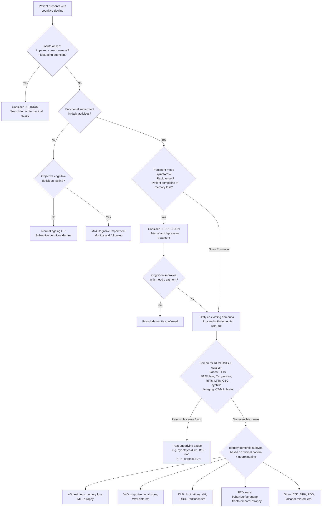

## Differential Diagnosis of Dementia

The differential diagnosis of dementia operates on **two levels simultaneously**. First, you must determine whether the patient truly has dementia — or whether something else is mimicking it (the "Is this really dementia?" question). Second, once dementia is established, you must differentiate between the underlying aetiologies (the "What type of dementia?" question). Both levels are critical because missing a reversible mimic or a treatable cause is a clinical failure.

Let's work through this systematically, starting with the mimics, then the inter-dementia differentiation.

---

### Level 1: "Is This Really Dementia?" — Non-Dementia Differentials

These are conditions that can present with cognitive decline but are **not** dementia. Missing these is dangerous because most are treatable or reversible.

#### A. Depression ("Pseudodementia") [2]

This is the ***most important mimic of dementia, accounting for ~10% of presumed dementia*** [2].

The term "pseudodementia" (literally "false dementia") refers to cognitive impairment caused by a primary psychiatric disorder — overwhelmingly depression in the elderly. Why does depression cause cognitive problems? Because depression causes:
- **Reduced motivation and effort** → poor performance on cognitive tasks (but not true inability)
- **Impaired concentration and attention** → the patient *can't focus*, so new information isn't encoded properly
- **Psychomotor retardation** → slowed thinking and responses, mimicking bradyphrenia
- **Hippocampal dysfunction** → chronic cortisol elevation from HPA axis dysregulation actually causes reversible hippocampal volume reduction

| Feature | Depression (Pseudodementia) | True Dementia |
|:---|:---|:---|
| **Onset** | ***More well-defined, more rapid decline*** [2] | Insidious, gradual |
| **Insight** | ***Tends to complain/worry about poor memory more; presents by themselves*** [2] | ***Poor insight (anosognosia); brought to doctor by family*** [2] |
| **Effort on testing** | ***Tends to give less effort; "I don't know" answers*** [2] | ***Tends to try hard but responds with incorrect answers*** [2] |
| **Cognitive pattern** | ***Poor concentration and attention more than memory*** [2]; can often perform if motivated | True amnesia (encoding failure); cannot perform even with effort |
| **Language and motor skills** | ***Slow but not impaired*** [2] | Truly impaired (aphasia, apraxia) |
| **Mood features** | ***Morning dysphoria, psychomotor retardation, sleep/appetite disturbance, guilt, anhedonia*** [2] | Mood symptoms typically appear *later* in disease course |
| **Consistency** | Variable performance; may do well on some days | Consistently impaired |

***As differentiation between them may be difficult, it may be prudent to treat depressive symptoms if present before concluding on a diagnosis of dementia*** [2].

<Callout title="Depression and Dementia Can Co-Exist!" type="error">
Depression is extremely common **within** dementia (>50% in AD have depressive symptoms). So the question is not always "depression OR dementia" — it can be both. A treatment trial of antidepressants is reasonable if depression is suspected; improvement in cognition supports pseudodementia, while persistence of deficits despite mood improvement suggests underlying dementia.
</Callout>

#### B. Delirium [2][7]

| Feature | Delirium | Dementia |
|:---|:---|:---|
| **Onset** | ***Acute (hours to days)*** [7] | Chronic (months to years) |
| **Course** | ***Fluctuating, with lucid intervals*** [7] | Progressive (though DLB can fluctuate) |
| **Consciousness** | ***Clouded; attention characteristically impaired*** [2] | ***Clear consciousness*** [1] |
| **Perceptual disturbance** | Common (vivid hallucinations, illusions) | ***Only appears in late stages of dementia*** [2] (except DLB — early visual hallucinations) |
| **Precipitant** | ***Usually precipitated by acute medical illness or new drug use*** [2] | No acute precipitant |
| **Reversibility** | Reversible if cause treated | Usually irreversible |
| **Sleep-wake cycle** | Grossly disrupted | May be disrupted but less acutely |

Key principle: ***Cognitive fluctuations may occur in dementia, especially in DLB and as sundowning in AD. Delirium should be ruled out if there is any change in pattern of fluctuation from baseline*** [7]. This is crucial — a patient with known dementia who acutely worsens likely has a *superimposed delirium* (infection, medication change, dehydration, constipation).

> Why is this distinction so important? Because delirium has a treatable underlying cause and carries significant mortality (up to 25% in hospitalised elderly) if missed. Dementia patients are also at **high risk** for developing delirium — dementia is the single strongest predisposing factor for delirium.

#### C. Amnestic Syndrome [2]

***By definition, amnestic syndrome is associated with severe disruption of memory with minimal involvement of other domains*** [2]. This is the key distinction — dementia requires impairment in **multiple** cognitive domains, whereas amnestic syndrome is essentially **isolated memory loss**.

- ***Confabulation may be prominent, especially in diencephalic amnesias*** [2] (e.g. Korsakoff syndrome — the patient fills memory gaps with fabricated but plausible stories, without intent to deceive).
- ***Look for past history of alcoholism, risk factors for nutritional deficiencies, and evidence of brain disease (diencephalic, medial temporal lesions) as potential causes*** [2].
- Classic example: **Korsakoff syndrome** — thiamine deficiency → mammillary body and dorsomedial thalamic damage → severe anterograde amnesia + confabulation, but other cognitive domains relatively preserved.

#### D. Mild Cognitive Impairment (MCI) [3]

***MCI is an intermediate stage between normal ageing and dementia/major NCD*** [3].

Key points from the lecture slides:
- ***Common term which is not used in ICD-10 and DSM-V*** [3] (DSM-5 uses "Mild NCD"; ICD-10 uses F06.7 which is not quite the same entity)
- ***Debatable concept, no very well consensus on the criteria*** [3]
- ***Usually defined as subjective + objective cognitive impairment without significant functional impairment*** [3]
- ***Amnestic vs non-amnestic subtype*** [3]
- ***Single domain vs multiple domains*** [3]
- ***Different aetiologies*** [3]
- ***Not all patients with MCI will progress to dementia*** [3] — approximately 10–15% per year convert from MCI to dementia, but some remain stable or even revert to normal

Why the distinction matters: MCI does not meet criteria for dementia because **independence in everyday activities is preserved** (though the patient may need greater effort). The patient is "at risk" but not yet impaired enough to warrant a dementia diagnosis.

#### E. Normal Ageing

Normal ageing produces mild cognitive changes:
- Slightly slower processing speed
- Minor word-finding difficulties (tip-of-the-tongue phenomenon)
- Mild decline in episodic memory (but encoding is preserved — retrieval is slower)

These do **not** interfere with daily functioning and are within normal limits on neuropsychological testing. The threshold between normal ageing and MCI is subjective complaint + objective deficit; between MCI and dementia is **functional impairment**.

#### F. Other Mimics

| Condition | Key Differentiating Features |
|:---|:---|
| **Medication-induced cognitive impairment** | Anticholinergics (oxybutynin, diphenhydramine, TCAs), benzodiazepines, opioids, anticonvulsants → reversible with drug withdrawal. Always review the medication list. |
| **Non-convulsive status epilepticus** | ***No classical ictal features; supportive features include bilateral facial twitching, unexplained nystagmoid eye movements, automatisms; EEG required for diagnosis*** [7] |
| **Focal neurological disorders** | ***Wernicke's aphasia (isolated language), bitemporal lesions, Anton's syndrome (cortical blindness with denial), bifrontal lesions; neuroimaging required*** [7] |
| **Psychosis** (late-onset schizophrenia) | Prominent delusions and hallucinations with relatively preserved cognition; onset history and thought disorder pattern differ. |
| **Sensory impairment** | Profound deafness or visual loss can mimic cognitive decline in elderly → always check hearing and vision. |

---

### Level 2: "What Type of Dementia?" — Inter-Dementia Differentiation

Once you've established that the patient truly has dementia, the next step is identifying the underlying cause. The clinical approach uses pattern recognition based on **onset, clinical profile, progression pattern, and neuroimaging**.

#### Summary Table — Differentiating the Major Dementias [2][4]

| Feature | **AD (62%)** | **VaD (17%)** | **DLB (4%)** | **FTD (2%)** |
|:---|:---|:---|:---|:---|
| **Onset age** | Usually > 65y; insidious | Late 60s–70s | ~75y; M > F | ~58y (early onset) |
| **Onset pattern** | Insidious, gradual | Variable; often stepwise | Insidious with fluctuations | Insidious |
| **First symptom** | ***Memory (anterograde, episodic)*** | Executive/variable; depends on infarct location | ***Attention, executive, visuospatial (memory late)*** | ***Behaviour/personality (bvFTD) or language (PPA)*** |
| **Progression** | Gradual, relentless | ***Stepwise with periods of deterioration and improvement*** | Fluctuating | Variable |
| **Memory** | Severely impaired early (encoding failure) | Variable; retrieval-type (improved by cueing) | ***Relatively preserved until late*** | Relatively preserved early |
| **Executive function** | Impaired (later) | ***Prominent early*** | ***Impaired early*** | ***Impaired early (perseveration, set-shifting failure)*** |
| **Hallucinations** | Late (10–25%) | Uncommon | ***Early, visual, well-formed, detailed*** | Uncommon |
| **Parkinsonism** | Late motor signs | Focal neurology, gait disturbance | ***Bilaterally symmetric, mild*** | Rare (primitive reflexes instead) |
| **Insight** | Lost early | ***Usually preserved*** | Variable | ***Lost very early*** |
| **Mood** | Depression (>50%) | ***Depression, labile mood, pseudobulbar affect*** | Depression/apathy | Apathy, loss of empathy |
| **Unique features** | Aphasia → apraxia → agnosia; anosmia early | Focal deficits, stepwise, urinary incontinence early | ***RBD, cognitive fluctuations, antipsychotic sensitivity*** | ***Disinhibition, hyperorality, ritualistic behaviour, knife-blade atrophy*** |
| **Neuroimaging** | ***Hippocampal/medial temporal lobe atrophy; ↓metabolism parietotemporal on FDG-PET*** [2] | ***Infarcts (lacunar/cortical), white matter lesions on MRI*** [2] | ***Preserved medial temporal lobe; ↓perfusion/metabolism most marked in occipital areas*** [2] | ***Focal frontotemporal atrophy; knife-blade atrophy; bvFTD: orbitofrontal/medial frontal; PPA: asymmetric left-sided*** [2] |

#### Differentiating AD from other dementias [2]

From the senior notes, the key d/dx for AD specifically:
- ***Vascular dementia: Hx, S/S and imaging evidence of stroke, stepwise progression, labile mood, focal neurological S/S*** [2]
- ***DLB: early prominent visual hallucinations, cognitive fluctuations, motor Parkinsonism, neuroleptic sensitivity, REM sleep behaviour disorder*** [2]
- ***FTD: usually with earlier onset; bvFTD with early personality, behavioural and executive function deficits; PPA with early isolated language deficits*** [2]

#### Differentiating DLB from its close mimics [2]

- ***PD-dementia: differentiation is arbitrary; by convention PD-dementia is diagnosed only if dementia occurs ≥1 year from onset of PD (otherwise diagnosis of DLB should be made)*** [2]
- ***Other dementia + superimposed delirium: rule out systemic causes of fluctuating clinical features*** [2]
- ***NPH: no psychiatric symptoms, sleep disorder, or dysautonomic features*** [2] (NPH has the classic triad of gait apraxia, urinary incontinence, and frontal dementia)

#### Other Important Aetiologies to Differentiate [2]

| Aetiology | Key Distinguishing Features | Neuroimaging |
|:---|:---|:---|
| **PD-Dementia (~2%)** | Similar to DLB but motor PD established > 1 year before dementia onset | Similar to DLB |
| **CJD** | ***Rapidly progressive dementia (months, not years); myoclonic jerks, seizures, cerebellar ataxia; young onset with early psychiatric symptoms in variant CJD*** [2] | ***Normal structural appearance; MRI cortical ribboning on DWI/FLAIR; vCJD: pulvinar sign*** [2] |
| **NPH** | ***Classical triad: frontal dementia + apraxic gait + urinary incontinence ("wet, wacky, wobbly"); mental slowing, apathy, inattention; commonest in 50–70y*** [2] | ***ALL ventricles enlarged disproportionate to sulcal effacement; periventricular lucency on FLAIR*** [2] |

<Callout title="Mixed Dementia — The Practical Reality" type="idea">
In clinical practice, ***mixed dementia usually means AD mixed with vascular*** [4]. Pure forms of any single dementia are probably less common than we teach. Many elderly patients have overlapping Alzheimer and vascular pathology. This is why the clinical differentiation between AD and VaD can be so difficult — and why cholinesterase inhibitors are sometimes used in VaD despite limited evidence, because coexisting AD pathology is very likely [2].
</Callout>

---

### Diagnostic Decision-Making Flowchart

The following flowchart shows the clinical reasoning pathway when a patient presents with cognitive decline:

---

### The Hachinski Ischaemic Score — Differentiating AD from VaD [2]

This is a clinical scoring tool specifically designed to help distinguish vascular dementia from Alzheimer's disease:

| Feature | Score |
|:---|:---|
| Abrupt onset | 2 |
| Stepwise deterioration | 1 |
| Fluctuating course | 2 |
| Nocturnal confusion | 1 |
| Relative preservation of personality | 1 |
| Depression | 1 |
| Somatic complaints | 1 |
| Emotional incontinence | 1 |
| History of hypertension | 1 |
| History of strokes | 2 |
| Evidence of associated atherosclerosis | 1 |
| Focal neurological symptoms | 2 |
| Focal neurological signs | 2 |

**Interpretation** [2]:
- **≥ 7**: Multi-infarct (vascular) dementia
- **5–6**: Mixed dementia
- **≤ 4**: Alzheimer's disease

> The Hachinski score works because it essentially tallies up features that point towards a vascular aetiology (stroke history, abrupt onset, focal signs, vascular risk factors). A high score means more "vascular" features are present. However, it was designed before modern neuroimaging and has limitations — MRI findings often trump the clinical score.

---

### The "Speed of Onset" Approach — A Practical Framework

One of the most useful clinical shortcuts is thinking about **how fast the cognitive decline occurred**, because this immediately narrows the differential:

| Speed of Onset | Timeframe | Likely Diagnoses |
|:---|:---|:---|
| **Acute** (hours–days) | Hours to days | **Delirium** (not dementia — but consider in any acute change in a dementia patient) |
| **Subacute** (weeks–months) | Weeks to months | **CJD** (rapidly progressive), autoimmune encephalitis, CNS lymphoma, paraneoplastic |
| **Chronic gradual** (months–years) | Months to years, insidious | **AD**, **DLB**, **FTD** |
| **Chronic stepwise** (months–years) | Months to years, stepwise | **VaD** |
| **Chronic with specific triggers** | Variable | Drug-induced, alcohol-related, post-TBI |

---

### Investigations That Help Differentiate [2]

While the full diagnostic algorithm will be covered in the next section, certain investigations are particularly useful at the differential diagnosis stage:

| Investigation | What It Helps Differentiate |
|:---|:---|
| **MRI brain** | AD (hippocampal atrophy) vs VaD (infarcts, WML) vs FTD (frontotemporal atrophy) vs DLB (preserved MTL) vs NPH (ventriculomegaly disproportionate to sulcal atrophy) vs CJD (cortical ribboning on DWI) |
| **FDG-PET** | AD (parietotemporal hypometabolism) vs DLB (occipital hypometabolism) vs FTD (frontotemporal hypometabolism) |
| **DaTSCAN** (dopamine transporter SPECT) | DLB/PDD (reduced dopamine transporter uptake in striatum) vs AD (normal) |
| **EEG** | CJD (periodic sharp wave complexes) vs non-convulsive status epilepticus |
| **CSF biomarkers** | AD (↓Aβ42, ↑total tau, ↑phospho-tau) vs CJD (↑14-3-3 protein, ↑total tau) |
| **Blood tests** | Reversible causes: TFTs, B12/folate, calcium, syphilis, HIV |

<Callout title="Key Exam Point — AD NINCDS-ADRDA Classification">

***The NINCDS-ADRDA criteria classify AD as*** [4]:
- ***"Possible": dementia, but not typical AD***
- ***"Probable": dementia by various testing, absence of other brain disease***
- ***"Definite": with AD histopathology***

***Progression, family history, behaviour, ADL disturbances, EEG and CT changes are supportive*** [4].

This means that a "definite" diagnosis of AD technically requires **neuropathological confirmation** (at autopsy or biopsy). In clinical practice, we work with "probable" AD. The 2011 NIA-AA criteria and the 2018 AT(N) research framework now incorporate biomarkers (amyloid PET, CSF Aβ42/tau), but the clinical criteria remain the backbone of diagnosis.
</Callout>

---

<Callout title="High Yield Summary — Differential Diagnosis of Dementia">

1. **Depression (pseudodementia)** is the most important mimic (~10%). Key differences: more rapid onset, patient complains of memory loss (good insight), gives "don't know" answers, concentration > memory affected, slow but not impaired language/motor skills. Treat depression first if unsure.

2. **Delirium**: Acute onset, fluctuating consciousness, impaired attention, usually precipitated by acute illness/drugs. Must be ruled out before diagnosing dementia. Dementia patients are at high risk for superimposed delirium.

3. **MCI**: Objective cognitive deficit but preserved functional independence. Not all MCI progresses to dementia (~10–15%/year conversion).

4. **Amnestic syndrome**: Isolated memory loss without other domain involvement (e.g. Korsakoff's). Confabulation may be prominent.

5. **Inter-dementia differentiation**: Use onset pattern (insidious vs stepwise vs rapid), first symptom (memory vs behaviour vs visuospatial vs language), unique features (fluctuations, hallucinations, Parkinsonism, disinhibition), and neuroimaging.

6. **AD vs VaD**: Hachinski score: ≥ 7 = vascular, ≤ 4 = AD, 5–6 = mixed. In practice, mixed dementia is very common.

7. **DLB vs PDD**: The 1-year rule — PDD if motor PD > 1 year before dementia; DLB if dementia within 1 year of or before Parkinsonism.

8. **Always screen for reversible causes**: TFTs, B12/folate, calcium, glucose, RFTs, LFTs, syphilis, CT/MRI brain.

</Callout>

---

<ActiveRecallQuiz
  title="Active Recall - Differential Diagnosis of Dementia"
  items={[
    {
      question: "A 72-year-old woman is brought by her family with 6 months of forgetfulness. She scores 20/30 on MoCA. Her daughter says she has been tearful and not eating well. The patient says 'My memory is terrible, I think I have Alzheimer's.' What is the most important differential diagnosis and how would you distinguish it from true dementia?",
      markscheme: "Depression (pseudodementia) is the most important mimic. Key distinguishing features: (1) patient complains of memory loss (good insight) vs dementia patients have poor insight and are brought by family; (2) more well-defined, rapid onset vs insidious; (3) gives 'I don't know' answers (less effort) vs dementia patients try hard but answer incorrectly; (4) concentration/attention more affected than true memory; (5) language/motor slow but not impaired. Management: trial of antidepressant treatment; if cognition improves, pseudodementia confirmed.",
    },
    {
      question: "List three clinical features that distinguish DLB from AD, and explain the 1-year rule for differentiating DLB from PD-dementia.",
      markscheme: "DLB vs AD: (1) Early well-formed visual hallucinations in DLB vs late in AD; (2) Cognitive fluctuations (blanking out, variable alertness) prominent in DLB; (3) Preserved medial temporal lobe on MRI in DLB vs hippocampal atrophy in AD. Also: REM sleep behaviour disorder, bilaterally symmetric mild Parkinsonism, antipsychotic sensitivity in DLB. 1-year rule: If motor Parkinsonism present for more than 1 year before dementia onset, diagnose PD-dementia; if dementia occurs within 1 year of or before Parkinsonism, diagnose DLB.",
    },
    {
      question: "What is the Hachinski Ischaemic Score and how is it interpreted? What are its limitations?",
      markscheme: "Clinical scoring tool with 13 items (abrupt onset, stepwise deterioration, fluctuating course, nocturnal confusion, personality preservation, depression, somatic complaints, emotional incontinence, HTN history, stroke history, atherosclerosis, focal symptoms, focal signs). Interpretation: 7 or more = vascular dementia; 5-6 = mixed; 4 or less = AD. Limitations: designed before modern neuroimaging; MRI findings often more reliable; cannot account for mixed pathology well; low specificity.",
    },
    {
      question: "A patient with known mild Alzheimer's disease is admitted with acute confusion, visual hallucinations, and fluctuating consciousness over 2 days. The family says this is different from her usual pattern. What is the most important diagnosis to exclude and why?",
      markscheme: "Delirium superimposed on dementia. Key reasons: (1) acute onset (hours to days) with fluctuating consciousness suggests delirium, not progression of AD; (2) dementia is the single strongest predisposing factor for delirium; (3) delirium usually has a treatable precipitant (infection, new medication, dehydration, constipation, pain, metabolic derangement); (4) carries significant mortality if missed (up to 25% in hospitalised elderly). Must search for and treat the underlying acute medical cause.",
    },
    {
      question: "Name five potentially reversible causes of dementia and the screening investigations you would order.",
      markscheme: "Reversible causes: (1) Hypothyroidism - TFTs; (2) B12/folate deficiency - serum B12 and folate; (3) Normal pressure hydrocephalus - CT/MRI brain showing ventriculomegaly disproportionate to sulcal atrophy; (4) Chronic subdural haematoma - CT/MRI brain; (5) Neurosyphilis - VDRL/RPR. Others include: hypercalcaemia (calcium), hepatic encephalopathy (LFTs), depression (clinical assessment), drug-induced (medication review), HIV (serology).",
    },
  ]}
/>

## References

[1] Lecture slides: GC 169. My grandmother keeps forgetting things Geriatric psychiatry, Dementia.pdf, p8 (ICD-10 diagnosis — Dementia)
[2] Senior notes: ryanho-psych.md (Sections 4.2.1–4.2.5: Approach to Dementia, differential diagnosis tables, clinical evaluation, Alzheimer's D/dx, DLB D/dx, VaD, FTD, delirium differentials)
[3] Lecture slides: GC 169. My grandmother keeps forgetting things Geriatric psychiatry, Dementia.pdf, p15 (Mild cognitive impairment)
[4] Lecture slides: GC 169. My grandmother keeps forgetting things Geriatric psychiatry, Dementia.pdf, p17–18 (Top three causes of Dementia; Alzheimer's Disease NINCDS-ADRDA)
[7] Senior notes: ryanho-psych.md (DSM-5 Delirium criteria and differential diagnoses of delirium, including dementia vs delirium table)
