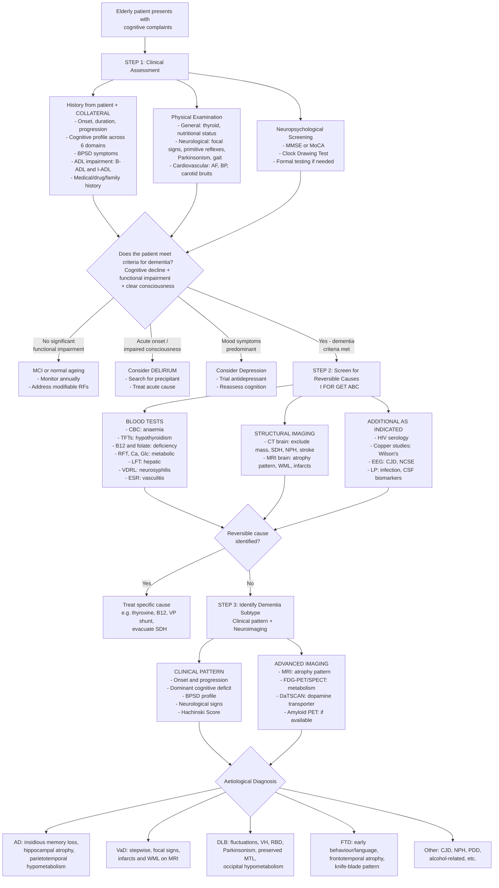

## Diagnostic Criteria for Dementia

Diagnosing dementia is a **multi-layered process**. You need to answer three questions in sequence: (1) Does this patient have dementia at all? (2) How severe is it? (3) What is the underlying aetiology? Each layer has its own set of criteria. Let's work through them systematically.

---

### 1. Establishing the Syndrome of Dementia — General Criteria

Before you can say "this patient has Alzheimer's" or "this is vascular dementia", you must first establish that the patient meets criteria for the **syndrome** of dementia itself. Two major classification systems are used:

#### A. ICD-10 Criteria for Dementia (F00–F03) [1][8]

***ICD-10: "A syndrome due to disease of the brain"*** [8]:

- ***Decline in memory and learning*** [8]
- ***Decline in other cognitive abilities characterised by deterioration in judgement, thinking and general processing of information*** [8]
- ***Decline in cognition > 6 months*** [8]
- ***Impaired performance in daily living*** [8]
- ***Clear consciousness*** [8]

The ICD-10 criteria are worth dissecting because every element serves a clinical purpose [2]:

| ICD-10 Element | Clinical Rationale |
|:---|:---|
| **Decline in memory AND thinking** | Must have impairment in ≥2 domains — memory is emphasised as a *core* requirement. This is why ICD-10 is sometimes criticised: it is "AD-centric" because not all dementias start with memory loss (e.g. FTD starts with behaviour, DLB with visuospatial/executive). |
| **> 6 months** | This duration requirement distinguishes dementia from delirium and other transient states. Practically, it ensures you're dealing with a *chronic* process. |
| **Impaired daily living** | The threshold that separates dementia from MCI — functional impairment is the watershed. |
| **Clear consciousness** | Rules out delirium. If consciousness is clouded, you cannot reliably assess cognition. |

***ICD-10 codes: Alzheimer's Disease (F00), vascular dementia (F01), dementia in other diseases classified elsewhere (F02) [e.g. Pick's, CJD, Parkinson's, Huntington's, HIV…], unspecified dementia (F03)*** [8].

#### B. DSM-5 Criteria for Major Neurocognitive Disorder [9][2]

***DSM-V: "evidence of cognitive decline from a previous level of performance in one or more cognitive domains…"*** [9]:

- ***Major neurocognitive disorder — significant decline in cognition + interfere with independence in everyday activities*** [9]
- ***Mild neurocognitive disorder — modest decline in cognition + don't interfere with capacity for independence in everyday activities*** [9]
- ***Specify for aetiologies and with/without behaviour disturbance*** [9]

The full DSM-5 criteria expanded [2]:

| Criterion | Details | Explanation |
|:---|:---|:---|
| **A** | Evidence of **significant** cognitive decline from a previous level of performance in **≥1 cognitive domain** (complex attention, executive function, learning/memory, language, perceptual-motor, social cognition) | Based on: (1) concern by patient, informant, or clinician; AND (2) substantial impairment on standardised neuropsychological testing (typically ≥2 SD below mean) |
| **B** | The cognitive deficits **interfere with independence** in everyday activities | At minimum, requires assistance with complex **instrumental ADLs** (e.g. managing finances, medications, transport) |
| **C** | Not occurring exclusively in the context of a **delirium** | Must rule out acute confusional state — cannot diagnose dementia during active delirium |
| **D** | Not better explained by another **mental disorder** (e.g. major depression, schizophrenia) | Rules out pseudodementia and late-onset psychotic disorders |

<Callout title="ICD-10 vs DSM-5 — Key Differences" type="idea">
The ICD-10 **requires memory impairment** as a core feature, making it somewhat AD-centric. The DSM-5 **removed memory as mandatory** — decline in ≥1 of any 6 cognitive domains suffices. This is more inclusive of non-amnestic dementias like bvFTD (behaviour), DLB (visuospatial/executive), and PPA (language). For exams, know both, but DSM-5 is conceptually more modern.
</Callout>

#### C. Mild Cognitive Impairment vs Dementia — The Functional Threshold

***MCI is usually defined as subjective + objective cognitive impairment without significant functional impairment*** [3]. This is the **intermediate stage between normal ageing and dementia** [3].

| Feature | MCI (Mild NCD) | Dementia (Major NCD) |
|:---|:---|:---|
| **Cognitive decline** | Modest (1–2 SD below mean) | Significant (≥2 SD below mean) |
| **Functional independence** | **Preserved** (may need more effort/compensatory strategies) | **Impaired** (needs assistance with IADLs at minimum) |
| **DSM-5 term** | Mild Neurocognitive Disorder | Major Neurocognitive Disorder |
| **Prognosis** | ~10–15%/year convert to dementia; ***not all patients with MCI will progress to dementia*** [3] | Progressive in most degenerative causes |

---

### 2. Aetiology-Specific Diagnostic Criteria

Once the syndrome of dementia is established, you apply aetiology-specific criteria to determine the underlying cause.

#### A. Alzheimer's Disease

**ICD-10 Criteria for Dementia in AD (F00)** [2]:

The following features are essential:
- **(a)** Presence of a dementia as described above
- **(b)** ***Insidious onset with slow deterioration***. While the onset usually seems difficult to pinpoint in time, realisation by others that the defects exist may come suddenly. An apparent plateau may occur in the progression [2]
- **(c)** ***Absence of clinical evidence or findings from special investigations to suggest that the mental state may be due to other systemic or brain disease*** which can induce a dementia [2]
- **(d)** ***Absence of a sudden, apoplectic onset or of neurological signs of focal damage*** occurring early in the illness [2]

> Note: double coding (F00 + F01) is used if features of both AD and VaD are present [2].

**NINCDS-ADRDA Criteria** (the classic research/clinical criteria) [4]:

***NINCDS-ADRDA classifies AD as "definite", "probable", and "possible" AD*** [4]:

| Level | Criteria |
|:---|:---|
| ***"Possible" AD*** | ***Dementia, but not typical AD*** [4] — atypical features, mixed presentation, or single cognitive domain impaired |
| ***"Probable" AD*** | ***Dementia by various testing, absence of other brain disease*** [4] — meets clinical criteria with documented progressive decline, no alternative explanation |
| ***"Definite" AD*** | ***With AD histopathology*** [4] — requires neuropathological confirmation (biopsy or autopsy) |

***Progression, family history, behaviour, ADL disturbances, EEG and CT changes are supportive*** [4].

**DSM-5 Criteria for Major NCD due to AD** [2]:

| Criterion | Details |
|:---|:---|
| **A** | Criteria are met for major or mild neurocognitive disorder |
| **B** | ***Insidious onset and gradual progression*** in ≥1 cognitive domains (≥2 domains must be impaired for major NCD due to AD) |
| **C** | Criteria for **probable** or **possible** AD: **Probable** if ≥1 of: (1) evidence of causative AD genetic mutation from FHx or genetic tests, OR for mild NCD only; **Possible** if: all three of (a) clear evidence of decline in memory and learning + ≥1 other domain, (b) steadily progressive gradual decline without extended plateaus, (c) no evidence of mixed aetiology |
| **D** | Not better explained by cerebrovascular disease, another neurodegenerative disease, effects of a substance, or another disorder |

**NIA-AA 2011 / AT(N) Research Framework (2018)** — A brief note on modern biomarker-based criteria:

The field is moving towards a **biological definition** of AD based on biomarkers, classified as:
- **A** = Amyloid (CSF Aβ42 ↓, amyloid PET +)
- **T** = Tau (CSF p-tau ↑, tau PET +)
- **N** = Neurodegeneration (CSF total tau ↑, FDG-PET hypometabolism, MRI atrophy)

An individual is "on the Alzheimer's continuum" if A+ (amyloid positive), regardless of symptoms. This is primarily a research framework and not yet standard clinical practice in Hong Kong, but it represents the direction the field is heading.

#### B. Vascular Dementia

The diagnosis of VaD requires [2]:
1. **Presence of dementia** (meeting general criteria)
2. **Uneven/patchy cognitive deficits** (some functions may be relatively preserved)
3. **Evidence of cerebrovascular disease** — clinical (focal neurological signs, history of stroke) AND radiological (infarcts, white matter lesions on MRI)
4. **Temporal relationship** between cerebrovascular disease and dementia onset

Clinical tools:
- ***Hachinski Ischaemic Score*** [2]: ≥7 = multi-infarct dementia; 5–6 = mixed; ≤4 = AD
- ***MoCA more appropriate*** for VaD assessment because executive function deficits are prominent [2]
- ***MRI more sensitive*** than CT for detecting small vessel disease [2]

#### C. Dementia with Lewy Bodies (2017 DLB Consortium Criteria)

| Criterion | Details |
|:---|:---|
| **Essential** | Dementia (progressive cognitive decline sufficient to interfere with function); early prominent deficits in attention, executive, and visuospatial function; **memory may not be impaired early** |
| **Core clinical features** (need ≥2 for **probable**, ≥1 for **possible**) | (1) Fluctuating cognition with pronounced variation in attention/alertness; (2) Recurrent well-formed visual hallucinations; (3) REM sleep behaviour disorder; (4) Spontaneous Parkinsonism |
| **Indicative biomarkers** (count same as core features) | (1) Reduced dopamine transporter uptake on DaTSCAN/PET; (2) Abnormal MIBG myocardial scintigraphy (reduced cardiac sympathetic innervation); (3) Polysomnographic confirmation of REM sleep without atonia |
| **Supportive features** | Antipsychotic sensitivity, postural instability, repeated falls, syncope, autonomic dysfunction, hypersomnia, hyposmia, other hallucinations, systematised delusions, apathy/anxiety/depression |

> **Probable DLB** = dementia + ≥2 core features, OR ≥1 core + ≥1 indicative biomarker.
> **Possible DLB** = dementia + 1 core feature, OR ≥1 indicative biomarker alone.

#### D. Frontotemporal Dementia

**bvFTD (International Consensus Criteria, Rascovsky 2011)**:
- **Possible bvFTD**: ≥3 of 6 behavioural/cognitive features (disinhibition, apathy/inertia, loss of sympathy/empathy, perseverative/compulsive behaviour, hyperorality/dietary changes, executive deficits with relative sparing of memory and visuospatial function) + functional disability
- **Probable bvFTD**: Possible bvFTD + significant frontal/anterior temporal atrophy on imaging OR frontotemporal hypoperfusion/hypometabolism on PET/SPECT
- **Definite bvFTD**: Possible/probable bvFTD + histopathological confirmation OR known pathogenic mutation

---

### 3. The Diagnostic Algorithm — Complete Clinical Pathway

Here is the comprehensive diagnostic pathway, from initial presentation through to aetiological diagnosis:

---

### 4. Investigation Modalities — Detailed Guide

The investigations in dementia serve two purposes: **(1) exclude reversible/treatable causes** and **(2) support the aetiological diagnosis**. Let's go through each modality systematically.

#### A. Bedside / Clinical Investigations

##### Neuropsychological Testing [2]

This is the standardised method to assess severity and profile of cognitive deficits. It serves as both a diagnostic tool and a baseline for monitoring progression.

| Tool | What It Tests | Key Features | Scoring / Interpretation |
|:---|:---|:---|:---|
| **MMSE** (Mini-Mental State Examination) | Orientation, registration, recall, attention/calculation, language, visuoconstruction | 30-point scale; takes 5–10 min; widely used but limited | < 24/30 suggests cognitive impairment; < 20 = moderate; < 10 = severe. Education-adjusted cut-offs needed. |
| **MoCA** (Montreal Cognitive Assessment) | Executive function, visuospatial, naming, memory, attention, language, abstraction, orientation | 30-point scale; more sensitive than MMSE for MCI and for executive/visuospatial deficits; ***MoCA more appropriate for VaD*** [2] | < 26/30 suggests MCI; +1 point if ≤12 years education |
| **Clock Drawing Test (CDT)** | Executive function, visuospatial ability, semantic memory | Quick bedside screen; patient draws clock face with numbers, sets hands to "10 past 11" | Qualitative scoring — errors in number placement (parietal), hand errors (executive), perseveration (frontal) |
| **Formal neuropsychological battery** | All 6 DSM-5 domains in detail | Usually performed by clinical psychologist or OT; takes 1–3 hours | Provides detailed cognitive profile to guide aetiological diagnosis and functional recommendations |

##### Functional Assessment [2]

- **Basic ADLs (B-ADL)**: Dressing, Eating, Ambulation, Toilet, Hygiene (mnemonic: **DEATH**)
- **Instrumental ADLs (I-ADL)**: Shopping, Housekeeping, Accounting, Food preparation, Telephone/Transportation (mnemonic: **SHAFT**)

> The ***DEATH SHAFT*** mnemonic captures both B-ADL and I-ADL [2]. Functional assessment is critical because it determines the **severity** of dementia and the **level of care** needed.

#### B. Blood Investigations — "I FOR GET ABC" [2]

***The mnemonic "I FOR GET ABC" captures the essential dementia screen*** [2]:

| Letter | Investigation | What You're Screening For | Why |
|:---|:---|:---|:---|
| **I** | ***Imaging*** | Structural brain pathology | Mass lesions, NPH, SDH, infarcts, atrophy pattern |
| **G** | ***Glucose*** | Diabetes mellitus, hypoglycaemia | Chronic hyperglycaemia → vascular damage + direct neuronal injury; hypoglycaemia → acute cognitive dysfunction |
| **E** | ***Electrolytes (RFT, Ca)*** | Renal failure, hypercalcaemia | Uraemic encephalopathy; hypercalcaemia → "stones, bones, groans, moans, and psychic overtones" |
| **T** | ***Thyroid (TFTs)*** | Hypothyroidism | Thyroid hormone is essential for neuronal metabolism; hypothyroidism → reversible cognitive slowing, apathy, and even frank dementia |
| **A** | ***Anaemia (CBC)*** | Anaemia, haematological disorders | Severe anaemia → chronic cerebral hypoxia |
| **B** | ***B12, folate*** | Vitamin deficiency | B12 deficiency → impaired methylation → myelin damage + ↑homocysteine → direct neurotoxicity. Folate deficiency → similar but less common as sole cause |
| **C** | ***Calcium*** | Hypercalcaemia | Can cause confusion, cognitive slowing, psychiatric symptoms |

**Additional blood tests as indicated** [2]:
- ***VDRL*** for neurosyphilis
- ***ESR / vasculitic screen*** for cerebral vasculitis
- ***LFT*** for hepatic encephalopathy
- ***HIV serology*** in at-risk patients
- ***Copper studies*** (ceruloplasmin, 24h urine copper) for Wilson's disease in young-onset cases

From the lecture slides, the recommended AD workup includes [10]:

***AD Diagnosis investigations*** [10]:
- ***Patient history (collaterals very important)***
- ***Physical examination***
- ***Neuropsychological tests***
- ***CBC, L/RFT, BG, TSH, B12, folate, VDRL***
- ***ECG, CXR, EEG (in specific case)***
- ***Neuroimaging (CT, MRI; non-essential: PET, SPECT)***
- ***CSF (total tau, phosphorylated tau and amyloid-beta) — seldom done in HK clinical setting***

#### C. Neuroimaging — The Core of Aetiological Diagnosis

Neuroimaging is indispensable. It has two roles: (1) **excluding structural/reversible causes** (SDH, tumour, NPH) and (2) **supporting the specific dementia diagnosis** through characteristic atrophy/metabolic patterns.

##### CT Brain [11][2]

***CT — mainly excludes other causes of dementia such as tumour, stroke, abscess, normal pressure hydrocephalus*** [11].

| Finding | Significance |
|:---|:---|
| **Space-occupying lesion** | Tumour, abscess — treatable! |
| **Chronic subdural haematoma** | Hyperdense crescent (acute) → isodense → hypodense (chronic); treatable with burr hole drainage |
| **Hydrocephalus disproportionate to sulcal atrophy** | NPH — all ventricles enlarged but cortical sulci not proportionally widened. Treatable with VP shunt. |
| **Infarcts** | Old strokes → VaD |
| **Generalised atrophy** | Nonspecific — seen in AD, FTD, alcohol-related dementia |

##### MRI Brain [11][2]

***MRI — atrophy changes (particularly hippocampus); detailed assessment of structural lesions*** [11].

MRI is superior to CT for dementia assessment because of its superior soft-tissue contrast, ability to detect white matter changes, and specific atrophy patterns.

| Finding | Dementia Subtype | Explanation |
|:---|:---|:---|
| ***Unilateral/bilateral perihippocampal atrophy (early); generalised atrophy (late)*** [2] | **AD** | Earliest pathology (Braak stages I–III) involves entorhinal cortex and hippocampus → medial temporal lobe atrophy is the hallmark. Medial temporal atrophy (MTA) scoring (Scheltens scale 0–4) is used clinically. |
| ***Widened sulci, dilated ventricles*** [2] | **AD (late)** | Generalised cortical neuronal loss → ex vacuo ventricular dilatation |
| ***Infarcts: non-lacunar ( > 15mm, cortical), lacunar (≤15mm, subcortical)*** [2] | **VaD** | Direct evidence of cerebrovascular disease causing cognitive damage |
| ***White matter lesions: hyperintense on T2W/FLAIR*** [2] | **VaD (subcortical)** | Chronic subcortical ischaemia → periventricular white matter damage (Binswanger-type). Graded by Fazekas score (0–3). |
| ***Microbleeds, superficial siderosis*** [2] | **VaD / Cerebral amyloid angiopathy** | Microbleeds on SWI/GRE suggest small vessel disease or CAA (lobar distribution → CAA; deep → hypertensive) |
| ***Relatively preserved medial temporal lobe structures*** [2] | **DLB** | Unlike AD, hippocampus is relatively spared in DLB — this is a useful distinguishing feature! |
| ***Focal atrophy in orbitofrontal, medial frontal, anterior cingulate, anterior insular cortices and amygdala*** [2] | **bvFTD** | Atrophy pattern maps directly to the clinical features (orbitofrontal → disinhibition; medial frontal/anterior cingulate → apathy; amygdala → loss of empathy) |
| ***Asymmetrical frontotemporal "knife-blade" atrophy affecting the left*** [2] | **PPA** | Left-lateralised because language networks are predominantly left hemisphere |
| ***ALL ventricles enlarged disproportionate to sulcal effacement; periventricular lucency on FLAIR*** [2] | **NPH** | CSF circulation impaired → ventriculomegaly, but cortical atrophy is NOT proportional (unlike AD where atrophy causes ventricular enlargement proportionally) |
| ***Cortical ribboning on DWI/FLAIR*** [2] | **CJD** | Restricted diffusion in cortical ribbon — highly specific for sporadic CJD. Prion-induced spongiform change → cytotoxic oedema in cortical neurons. |
| ***Pulvinar sign (bilateral hyperintensity at pulvinar nucleus)*** [2] | **Variant CJD** | Selective vulnerability of pulvinar nucleus in vCJD |

##### PET and SPECT [11][2]

***PET*** [11]:
- ***FDG-PET — functional assessment of brain regions*** [11]
- ***PIB-PET — amyloid deposition*** [11]

***SPECT — functional assessment of brain regions*** [11]

| Modality | What It Shows | Key Findings by Dementia Subtype |
|:---|:---|:---|
| **FDG-PET** (fluorodeoxyglucose) | Regional cerebral glucose metabolism — reflects neuronal activity | **AD**: ***↓metabolism in parietotemporal and hippocampal regions*** [2] (posterior cingulate earliest). **DLB**: ***Generalised ↓perfusion and ↓metabolism, most marked in occipital areas*** [2] — the occipital hypometabolism distinguishes DLB from AD. **FTD**: ↓metabolism in frontal and anterior temporal regions. |
| **Amyloid PET** (e.g. PiB, florbetapir) | Direct visualisation of amyloid plaque burden in the brain | **AD**: Positive (high amyloid uptake). **DLB**: Often positive (many DLB patients have concomitant amyloid). **FTD**: Usually negative. **Normal elderly**: Can be positive! (~20–30% of cognitively normal elderly have amyloid on PET — so positive amyloid PET alone does not diagnose AD). |
| **Tau PET** (e.g. flortaucipir) | Direct visualisation of tau neurofibrillary tangle distribution | **AD**: Positive, follows Braak staging pattern (medial temporal → lateral temporal/parietal → frontal). Still primarily a research tool. |
| **SPECT** (e.g. HMPAO) | Regional cerebral blood flow (a surrogate for metabolic activity) | Similar patterns to FDG-PET but lower resolution. Useful when PET is unavailable. |
| **DaTSCAN** (dopamine transporter SPECT) | Dopamine transporter density in the striatum | **DLB/PDD**: Reduced uptake in caudate and putamen (dopaminergic degeneration). **AD**: Normal. This is an **indicative biomarker** for DLB in the 2017 criteria. |

<Callout title="FDG-PET Pattern Recognition for Exams">

Three key patterns to remember:
- **AD**: Parietotemporal hypometabolism (+ posterior cingulate early) — reflects posterior cortical neuronal loss
- **DLB**: **Occipital** hypometabolism — this is the distinguishing feature from AD
- **FTD**: **Frontal and anterior temporal** hypometabolism — maps to the atrophy pattern

Why does DLB show occipital hypometabolism? Because Lewy body pathology prominently affects the primary visual cortex and visual association areas, which explains both the metabolic deficit AND the characteristic well-formed visual hallucinations.
</Callout>

#### D. CSF Biomarkers [10][2]

***CSF (total tau, phosphorylated tau and amyloid-beta) — seldom done in HK clinical setting*** [10].

| Biomarker | Direction in AD | What It Reflects |
|:---|:---|:---|
| **CSF Aβ42** | ↓ (decreased) | Aβ42 is "trapped" in brain plaques → less left in the CSF. A low CSF Aβ42 correlates with high cortical amyloid deposition. |
| **CSF Total tau (t-tau)** | ↑ (increased) | Released from dying/damaged neurons → reflects **intensity of neurodegeneration**. Nonspecific — also elevated in CJD, stroke, TBI. |
| **CSF Phosphorylated tau (p-tau)** | ↑ (increased) | Reflects neurofibrillary tangle formation — more **specific to AD** pathology than total tau. |
| **CSF 14-3-3 protein** | ↑ in CJD | Released from rapidly dying neurons — highly suggestive of CJD when clinical picture is consistent. |

> The combination of **low Aβ42 + high p-tau** has high sensitivity and specificity (>85%) for AD and can be useful in differentiating AD from FTD or depression.

#### E. Other Investigations [2]

| Investigation | When to Use | What It Shows |
|:---|:---|:---|
| ***EEG*** | CJD, metabolic encephalopathy, non-convulsive status epilepticus | **CJD**: Periodic sharp wave complexes (triphasic waves) at 1–2 Hz — pathognomonic in sporadic CJD. **Metabolic encephalopathy**: Generalised slowing. **NCSE**: Continuous epileptiform discharges. |
| ***LP (lumbar puncture)*** | Suspected CNS infection, neurosyphilis, autoimmune encephalitis, CSF biomarkers | CSF cell count, protein, glucose, VDRL, oligoclonal bands, specific antibodies, biomarkers |
| **Genetic testing** | FHx-positive cases, early-onset ( < 65), strong suspicion of genetic cause | APP, PSEN1, PSEN2 (early-onset AD); APOE genotyping (risk stratification, not diagnostic); C9ORF72, MAPT, GRN (FTD); PRNP (familial CJD); HTT (Huntington's) |
| ***ECG, CXR*** [10] | Baseline assessment | ECG: AF (risk for stroke/VaD); CXR: malignancy (paraneoplastic), heart failure |
| **MIBG myocardial scintigraphy** | Suspected DLB | Reduced cardiac uptake due to postganglionic sympathetic denervation — indicative biomarker for DLB |
| **Polysomnography** | Suspected RBD (DLB) | Confirms REM sleep without atonia — indicative biomarker for DLB |

#### F. Summary: Matching Investigations to Dementia Subtypes

| Dementia | Key Imaging Finding | Key Biochemical/Other Finding |
|:---|:---|:---|
| **AD** | MRI: hippocampal/MTL atrophy. FDG-PET: parietotemporal hypometabolism. Amyloid PET: positive. | CSF: ↓Aβ42, ↑p-tau, ↑t-tau |
| **VaD** | MRI: infarcts (lacunar/cortical), white matter lesions on FLAIR, microbleeds | Hachinski score ≥7. Vascular imaging (carotid USS, CTA/MRA) |
| **DLB** | MRI: **preserved MTL**. FDG-PET: occipital hypometabolism. DaTSCAN: reduced striatal uptake. | MIBG: reduced cardiac uptake. PSG: REM without atonia |
| **FTD** | MRI: frontotemporal atrophy (knife-blade). FDG-PET: frontal/anterior temporal hypometabolism | Genetic testing: C9ORF72, MAPT, GRN. CSF: usually normal Aβ42 (helps exclude AD) |
| **CJD** | MRI: cortical ribboning on DWI. vCJD: pulvinar sign | EEG: periodic sharp wave complexes. CSF: ↑14-3-3, ↑t-tau (markedly elevated) |
| **NPH** | MRI/CT: ventriculomegaly disproportionate to sulcal atrophy. FLAIR: periventricular lucency | **Tap test** (large volume LP): improvement in gait after CSF removal supports diagnosis and predicts shunt response |

<Callout title="High Yield Summary — Diagnosis of Dementia">

**General diagnostic criteria**: ICD-10 requires decline in memory + thinking, > 6 months, impaired ADLs, clear consciousness. DSM-5 requires significant decline in ≥1 cognitive domain + functional impairment + no delirium + no better explanation.

**Key difference**: ICD-10 mandates memory impairment; DSM-5 does not (any domain suffices). DSM-5 is more inclusive of non-amnestic dementias.

**MCI vs Dementia**: The threshold is **functional independence** — MCI preserves independence; dementia impairs it.

**AD diagnostic levels**: NINCDS-ADRDA: Possible (atypical) → Probable (clinical diagnosis, no other cause) → Definite (histopathology). Clinical practice operates at "probable" level.

**Minimum investigations (NICE/lecture slides)**: CBC, TFTs, B12/folate, RFT, Ca, glucose, VDRL + CT/MRI brain. Mnemonic: **I FOR GET ABC**.

**Neuroimaging patterns**: AD = hippocampal atrophy + parietotemporal hypometabolism; VaD = infarcts + WML; DLB = preserved MTL + occipital hypometabolism + reduced DaTSCAN; FTD = frontotemporal knife-blade atrophy; CJD = cortical ribboning on DWI; NPH = ventriculomegaly disproportionate to sulcal atrophy.

**CSF biomarkers for AD**: ↓Aβ42, ↑total tau, ↑phospho-tau. Seldom done in HK clinical setting but increasingly used in research and selected cases.

</Callout>

---

<ActiveRecallQuiz
  title="Active Recall - Diagnostic Criteria and Investigations for Dementia"
  items={[
    {
      question: "What are the five key elements of the ICD-10 diagnostic criteria for dementia?",
      markscheme: "(1) Decline in memory and learning; (2) Decline in other cognitive abilities (judgement, thinking, information processing); (3) Decline in cognition for more than 6 months; (4) Impaired performance in daily living; (5) Clear consciousness. Key point: ICD-10 mandates memory impairment as a core feature, unlike DSM-5 which requires any 1 of 6 cognitive domains.",
    },
    {
      question: "Explain the NINCDS-ADRDA classification of Alzheimer's disease into possible, probable, and definite. What level do we operate at clinically?",
      markscheme: "Possible AD: dementia present but not typical for AD (atypical features or mixed presentation). Probable AD: dementia established by clinical testing with absence of other brain disease that could account for symptoms. Definite AD: requires histopathological confirmation (autopsy or biopsy). Clinically we operate at the 'probable' level. Supportive features include progression, family history, behaviour changes, ADL disturbances, EEG and CT changes.",
    },
    {
      question: "Name the minimum blood investigations for a dementia workup and the mnemonic used. For each, state what reversible cause you are screening for.",
      markscheme: "Mnemonic: I FOR GET ABC. I = Imaging (structural lesions); G = Glucose (diabetes/hypoglycaemia); E = Electrolytes including RFT and Ca (renal failure, hypercalcaemia); T = Thyroid/TFTs (hypothyroidism); A = Anaemia/CBC (anaemia); B = B12 and folate (vitamin deficiency causing dementia); C = Calcium (hypercalcaemia). Additional: VDRL (neurosyphilis), LFT (hepatic encephalopathy), HIV, copper studies (Wilson's disease in young onset).",
    },
    {
      question: "Describe the characteristic FDG-PET findings that distinguish AD, DLB, and FTD from each other. Explain why DLB shows occipital hypometabolism.",
      markscheme: "AD: parietotemporal and hippocampal hypometabolism (posterior cingulate earliest). DLB: generalised hypometabolism most marked in occipital areas. FTD: frontal and anterior temporal hypometabolism. DLB shows occipital hypometabolism because Lewy body pathology prominently affects primary visual cortex and visual association areas, which also explains the characteristic early well-formed visual hallucinations.",
    },
    {
      question: "What MRI finding distinguishes NPH from Alzheimer's disease? Name two other conditions you can diagnose or exclude on CT/MRI brain in a dementia workup.",
      markscheme: "NPH: ALL ventricles enlarged DISPROPORTIONATE to sulcal effacement (ventriculomegaly out of proportion to cortical atrophy) plus periventricular lucency on FLAIR. In AD, ventricular enlargement is proportional to sulcal widening (ex vacuo dilatation from generalised atrophy). Other conditions on CT/MRI: chronic subdural haematoma (hypodense extra-axial collection), brain tumour (mass lesion with surrounding oedema), old infarcts (VaD), CJD (cortical ribboning on DWI).",
    },
    {
      question: "State the three CSF biomarkers used in AD diagnosis, their direction of change, and what each reflects pathophysiologically. Why is CSF Abeta42 decreased rather than increased?",
      markscheme: "CSF Abeta42: DECREASED (reflects amyloid sequestration in brain plaques - Abeta42 is trapped in plaques so less remains in the CSF). CSF total tau: INCREASED (released from dying/damaged neurons; reflects intensity of neurodegeneration; nonspecific). CSF phosphorylated tau: INCREASED (reflects neurofibrillary tangle formation; more specific to AD pathology). The combination of low Abeta42 plus high p-tau has greater than 85% sensitivity and specificity for AD.",
    },
  ]}
/>

## References

[1] Lecture slides: GC 169. My grandmother keeps forgetting things Geriatric psychiatry, Dementia.pdf, p7 (Aetiology of Dementia)
[2] Senior notes: ryanho-psych.md (Sections 4.2.1–4.2.5: Approach to Dementia, diagnostic criteria, clinical evaluation, investigations, AD evaluation, VaD evaluation, DLB diagnosis, FTD criteria, differential diagnosis tables)
[3] Lecture slides: GC 169. My grandmother keeps forgetting things Geriatric psychiatry, Dementia.pdf, p15 (Mild cognitive impairment)
[4] Lecture slides: GC 169. My grandmother keeps forgetting things Geriatric psychiatry, Dementia.pdf, p18 (Alzheimer's Disease NINCDS-ADRDA)
[8] Lecture slides: GC 169. My grandmother keeps forgetting things Geriatric psychiatry, Dementia.pdf, p8 (ICD-10 diagnosis — Dementia)
[9] Lecture slides: GC 169. My grandmother keeps forgetting things Geriatric psychiatry, Dementia.pdf, p9 (DSM-V diagnosis — Major and Mild neurocognitive disorder)
[10] Lecture slides: GC 169. My grandmother keeps forgetting things Geriatric psychiatry, Dementia.pdf, p27 (AD Diagnosis)
[11] Lecture slides: GC 169. My grandmother keeps forgetting things Geriatric psychiatry, Dementia.pdf, p33 (Neuroimaging)
