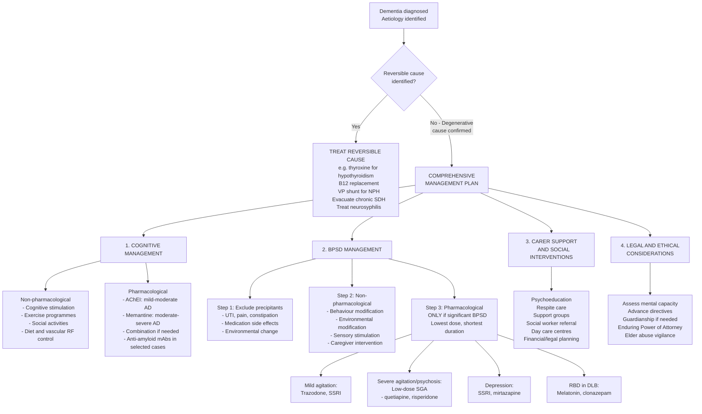

## Management of Dementia

The management of dementia is fundamentally **multidisciplinary** and **holistic**. There is no cure for most degenerative dementias — our goals are to: (1) treat any reversible causes, (2) slow cognitive decline where possible, (3) manage BPSD, (4) maintain function and quality of life, (5) support caregivers, and (6) plan for the future (advance directives, capacity, guardianship). Think of it as managing a chronic condition rather than curing a disease.

***Treatment is multidisciplinary*** [12]. ***Treat the "hidden patient(s)"*** — this refers to the caregivers, who are often as distressed (or more) than the patient themselves [12].

---

### Overall Management Algorithm

---

### 1. Treat Reversible Causes [2]

Before starting any symptomatic treatment, you must first address any **treatable underlying cause**. This was covered in the diagnostic section but bears repeating because it's the single most impactful intervention:

| Reversible Cause | Treatment |
|:---|:---|
| Hypothyroidism | Levothyroxine replacement |
| B12 deficiency | IM hydroxocobalamin → oral maintenance |
| Folate deficiency | Oral folic acid supplementation |
| NPH | VP shunt (gait improves most; cognition improvement variable) |
| Chronic SDH | Burr hole drainage |
| Neurosyphilis | IV benzylpenicillin |
| Drug-induced cognitive impairment | Withdraw offending drug (anticholinergics, benzodiazepines, opioids) |
| Depression (pseudodementia) | Antidepressant trial |

---

### 2. Management of Cognition

#### A. Non-Pharmacological Approaches [2]

Non-pharmacological interventions are used ***often in combination*** with medication [2]. The evidence varies, but several are recommended by guidelines.

| Intervention | Description | Evidence | Explanation |
|:---|:---|:---|:---|
| ***Cognitive stimulation*** | Group-based activities involving general cognitive function and orientation, emphasising ***enjoyment*** of activities | ***1.41 MMSE points better than placebo; recommended by NICE*** [2] | Works by engaging multiple cognitive networks through social interaction and structured activities. Not about drilling — it's about stimulation and engagement. |
| ***Cognitive training*** | Individualized/grouped training specifically geared to train specific cognitive abilities with practice and repetition | ***No evidence for efficacy (Cochrane 2013); not recommended by NICE*** [2] | Rote practice of single tasks doesn't generalise to overall function — the brain needs integrated engagement, not isolated drilling. |
| ***Cognitive rehabilitation*** | Individualized training in the person's natural environment to train cognitive abilities required for personally relevant everyday tasks | ***Evidence still limited but promising; rarely done in HK*** [2] | Goal-oriented, practical — e.g. teaching someone specific strategies to remember medication schedules. Most ecologically valid but resource-intensive. |
| ***Exercise programmes*** | Physical activity interventions | ***Improve physical functioning, slow functioning decline, but little effect on cognitive functioning*** [2] | Exercise promotes cerebral blood flow, BDNF release, and neuroplasticity. The main benefit is maintaining physical function and reducing falls — which is critical since falls are a major cause of morbidity in dementia. |
| **Others** | Social activities, diet supervision, vascular RF control | Variable evidence | Maintain social engagement, Mediterranean diet (anti-inflammatory), control HTN/DM/dyslipidaemia |

> ***Grossly speaking, AD patients have a 3–4 point/year drop in MMSE. With Rx alone, this is reduced to ~2 points/year. With Rx + cognitive stimulation, this is further reduced to ~1 point/year*** [2]. This is a powerful teaching point — medication alone is not sufficient.

#### B. Pharmacological Approaches for Cognition

##### i. Acetylcholinesterase Inhibitors (AChEIs) [2][13]

"Acetyl-cholin-esterase inhibitor" → "acetyl" = acetyl group, "cholin" = choline, "esterase" = enzyme that breaks an ester bond, "inhibitor" = blocks. These drugs inhibit the enzyme that breaks down acetylcholine at the synapse, thereby increasing the amount of ACh available for neurotransmission.

***Acetylcholinesterase Inhibitor (AChEI) — donepezil, rivastigmine and galantamine*** [13]:
- ***Mild to moderate dementia in AD*** [13]
- ***Compensate the cholinergic deficit*** [13]

| Property | Details |
|:---|:---|
| **Drugs** | **Donepezil** (Aricept), **Galantamine** (Reminyl), **Rivastigmine** (Exelon) |
| **Indication** | ***Mild to moderate dementia in AD*** [13] (less evidence when MMSE < 12) [2]. Also used in DLB (often first-line because antipsychotics are contraindicated) and sometimes VaD (limited evidence) [2] |
| **Mechanism of Action** | Inhibit acetylcholinesterase at synaptic cleft → ↓ACh breakdown → ↑cholinergic transmission. Based on the **cholinergic hypothesis** — degeneration of cholinergic neurons from the basal nucleus of Meynert causes widespread ACh depletion contributing to memory and attention deficits. |
| **Efficacy** | ***Modest improvement in cognition: MMSE 1.37 points, ADAS-Cog 2.7 points at 6–12 months*** [2]. Also improves neuropsychiatric symptoms and ADLs. ***Delays decline by ~2 months/year*** but little evidence for long-term disease modification [2]. |
| **Side effects** | ***Very commonly GI upset (diarrhoea, N/V), anorexia/weight loss, bradycardia/↓BP, sleep disturbances*** [2]. These are all predictable from the pharmacology — increasing ACh systemically stimulates the **parasympathetic nervous system** (vagal tone → bradycardia; GI motility → nausea/diarrhoea; cholinergic activation in brainstem → vivid dreams). |
| **Contraindications** | Sick sinus syndrome, AV block (bradycardia risk), active peptic ulcer disease (↑gastric acid secretion via vagal stimulation), severe hepatic impairment |
| **Practical points** | Start low, titrate slow. Donepezil: start 5mg OD → 10mg after 4–6 weeks. Take at bedtime (may cause insomnia if taken in morning). Rivastigmine available as transdermal patch (better GI tolerability). |

**Differences between the three AChEIs:**

| Drug | Selectivity | Route | Unique Features |
|:---|:---|:---|:---|
| **Donepezil** | Selective AChE inhibitor | Oral (OD dosing) | Longest half-life (~70h); most commonly prescribed; once-daily dosing improves compliance |
| **Rivastigmine** | Inhibits both AChE AND butyrylcholinesterase (BuChE) | Oral / transdermal patch | Patch formulation reduces GI side effects; dual enzyme inhibition may offer additional benefit in later stages when BuChE becomes relatively more important |
| **Galantamine** | AChE inhibitor + allosteric modulator of nicotinic ACh receptors | Oral (BD or MR OD) | Dual mechanism; the nicotinic receptor modulation may enhance presynaptic ACh release |

##### ii. Memantine [2][13]

"Memantine" — an NMDA receptor antagonist. NMDA = N-methyl-D-aspartate, a type of glutamate receptor.

***Memantine*** [13]:
- ***Moderate to severe dementia in AD*** [13]
- ***Antagonist at N-methyl-D-aspartate (NMDA) receptors*** [13]
- ***Neuroprotective and disease-modifying agent in theory*** [13]

| Property | Details |
|:---|:---|
| **Drug** | **Memantine** (Ebixa) |
| **Indication** | ***Moderate to advanced dementia*** [2][13]. Limited evidence for mild dementia. |
| **Mechanism of Action** | **Low-affinity, uncompetitive NMDA receptor antagonist** → blocks excessive glutamate-mediated excitotoxicity. In AD, damaged neurons release excess glutamate → overactivation of NMDA receptors → calcium influx → excitotoxic neuronal death. Memantine provides a voltage-dependent block that allows *physiological* NMDA signalling (needed for memory) while blocking *pathological* tonic overactivation. Think of it as "noise reduction" — it reduces the background excitotoxic "noise" while preserving the signal. |
| **Efficacy** | ***Modest benefit in moderate/advanced dementia; may have synergistic effect with cholinesterase inhibitor*** [2]. Often used in combination with AChEI. |
| **Side effects** | ***Uncommon: dizziness, confusion/hallucinations (rare)*** [2]. Generally well tolerated — much better side-effect profile than AChEIs. |
| **Contraindications** | Severe renal impairment (renally excreted); epilepsy (may lower seizure threshold at high doses, though this is debated) |
| **Practical points** | Start 5mg OD → titrate by 5mg weekly → target 10mg BD (20mg/day). Can be combined with AChEI. |

##### iii. Anti-Amyloid Monoclonal Antibodies [14]

***Aduhelm (aducanumab)*** [14]:
- ***Human monoclonal antibody — selectively targets aggregated Aβ*** [14]
- ***Approved in 2021 by FDA (based on 2 clinical trials EMERGE and ENGAGE)*** [14]
- ***Monthly intravenous infusions*** [14]
- ***First treatment directed at amyloid beta plaques in the brain*** [14]
- ***Amyloid-related imaging abnormalities (ARIA) — brain swelling and bleeding*** [14]
- ***Monitoring — MRIs prior to initiating therapy, during the titration of the drug, and at any time the patient has symptoms suggestive of ARIA*** [14]
- ***The effectiveness is still under debate*** [14]

Since these lecture slides, the landscape has evolved significantly:

| Drug | Status (as of 2025–2026) | Mechanism | Key Considerations |
|:---|:---|:---|:---|
| **Aducanumab** (Aduhelm) | Withdrawn from market (2024) by Biogen | Anti-amyloid mAb targeting aggregated Aβ | Controversial approval; inconsistent trial results; withdrawn due to low uptake and uncertain efficacy |
| **Lecanemab** (Leqembi) | FDA fully approved (2023); available in some centres | Anti-amyloid mAb targeting Aβ protofibrils (soluble aggregates) | CLARITY-AD trial: 27% slowing of cognitive decline over 18 months. ARIA risk (~13% ARIA-E, ~17% ARIA-H). Requires regular MRI monitoring. Monthly IV infusions. |
| **Donanemab** (Kisunla) | FDA approved (2024) | Anti-amyloid mAb targeting N-terminal pyroglutamate Aβ (deposited plaque) | TRAILBLAZER-ALZ 2: 35% slowing of decline in "intermediate" tau group. Time-limited therapy — can stop once amyloid cleared. ARIA risk similar to lecanemab. |

> **Why anti-amyloid antibodies?** These drugs directly attack the amyloid cascade — they bind to and promote clearance of Aβ aggregates/plaques. They are the first **disease-modifying** (not just symptomatic) treatments for AD, though the clinical benefit is modest and must be weighed against significant risks (ARIA).

> **What is ARIA?** ARIA-E = amyloid-related imaging abnormalities — oEdema (brain swelling from vascular leakage as amyloid is cleared from vessel walls). ARIA-H = Haemosiderin deposits (microbleeds/superficial siderosis). APOE4 homozygotes are at highest risk for ARIA.

<Callout title="Anti-Amyloid Antibodies — Current State" type="error">
These drugs are NOT yet available in standard clinical practice in Hong Kong and remain controversial. They are very expensive (US$26,000+/year), require IV infusions and regular MRI monitoring, and the clinical benefit (slowing of decline by ~27–35%) translates to modest real-world improvement. They are indicated only for **early AD** (MCI or mild AD with confirmed amyloid positivity on PET or CSF). Know their existence for exams but they are unlikely to feature as a standard treatment in HK clinical scenarios currently.
</Callout>

##### iv. Other Agents [2]

| Agent | Status |
|:---|:---|
| **Antioxidants** (Vitamin E, selegiline) | ***Mild to moderate AD; currently NOT recommended within standard guidelines*** [2]. ***Modest benefit but side effects prominent for selegiline*** [2]. High-dose vitamin E (2000 IU/day) showed some benefit in one trial but concerns about cardiovascular mortality. |

##### v. Stage-Specific Drug Use — The Timeline [15]

The lecture slides provide an important timeline showing which drugs are used at each stage of AD:

***Natural history of Alzheimer's disease and stage-specific symptomatic drugs*** [15]:

| Stage | Treatments |
|:---|:---|
| **Amnestic MCI** | Consider ***AChEI*** (off-label, evidence limited) |
| **Mild dementia** | ***Antidepressants*** (for depression) + ***AChEI*** [15] |
| **Loss of functional independence** | ***AChEI*** + ***Memantine*** [15] |
| **Behavioural symptoms stage** | ***Memantine + AChEI*** + ***(atypical) neuroleptics*** [15] |
| **Nursing home / severe stage** | ***Memantine + AChEI*** + ***(atypical) neuroleptics*** [15] |

<Callout title="Drug Selection by AD Stage">

Simple rule of thumb:
- **Mild–moderate AD** → AChEI (donepezil first-line)
- **Moderate–severe AD** → Add memantine (often combined with AChEI)
- **BPSD** → Non-pharmacological first; then consider SSRI (depression/agitation), low-dose atypical antipsychotic (severe psychosis/aggression only)
- AChEIs and memantine are continued throughout the disease course once started, unless side effects are intolerable or the patient reaches end-stage disease.
</Callout>

---

### 3. Management of BPSD (Behavioural and Psychological Symptoms of Dementia)

BPSD management deserves special attention because ***over 80% of dementia patients*** develop BPSD [16], and it is ***often more distressing than cognitive symptoms*** [2] — both to the patient and especially to caregivers.

***Why are behaviour disturbances (BPSD) important?*** [16]:
- ***Over 80% of dementia patients***
- ***Delusions 60%***
- ***Affective symptoms 40%***
- ***Anxiety 35%***
- ***Verbal outburst 33%***
- ***Hallucination 20%***
- ***Aggression 13%***
- ***Caregiver stress***
- ***Institutionalisation***

#### The Approach to BPSD [2][17]

***Management of BPSD*** [17]:
- ***Exclude physical illness potentially precipitating***
- ***Non-pharmacological — behaviour modifications, environmental modifications***
- ***Medications — AChEI/memantine, antipsychotic, antidepressant, other neuroleptics***
- ***Keep lowest dose and shortest period if possible, don't prescribe medications unless significant BPSD!!!*** [17]

The stepwise approach [2]:

**Step 1: Assessment and Precipitant Search**
- Identify problems, duration and severity
- ***Consider and treat medical problems*** — UTI, constipation, pain, medication side effects → may precipitate BPSD and should be reversed [2]
- Consider and treat psychiatric comorbidities (depression, psychosis, anxiety)
- Reverse any other aggravating factors (environmental changes, caregiver changes)

> Why is this step so important? Because an elderly patient with dementia who becomes suddenly agitated may have a **UTI**, **faecal impaction**, **unrecognised pain** (hip fracture, toothache), or **medication side effects**. Treating the precipitant often resolves the BPSD without any psychotropic medication.

**Step 2: Non-Pharmacological Interventions** [2]

***Non-pharmacological treatment should always be first-line treatment for BPSD*** [2]:

| Category | Interventions | Rationale |
|:---|:---|:---|
| **Environmental modifications** | ***Non-stressful, constant, familiar, comfortable environment*** [2]. Wandering space with safety features (digital locks, artificial partitions). Stable daily schedule. Structured daytime activities. | Dementia patients have reduced ability to adapt to change. A familiar, predictable environment reduces confusion and anxiety. Unstructured time leads to wandering and agitation. |
| ***Sensory stimulation*** | ***Music therapy, aromatherapy (e.g. lavender oil), bright light therapy (↑circadian rhythm), massage/touch, passive heating (improve sleep)*** [2] | Engages preserved sensory processing pathways. Music therapy is particularly effective — even in severe dementia, musical memories are often preserved (stored in cerebellum and supplementary motor area, relatively spared in AD). Bright light therapy helps entrain the disrupted circadian rhythm. |
| **Behavioural intervention** | Simple behavioural modification techniques (e.g. star charts, differential reinforcement, stimulus control) [2] | Positive reinforcement of desired behaviours; removing triggers for unwanted behaviours |
| **Caregiver intervention** | Psychoeducation, psychotherapeutic support [2] | Caregivers who understand the disease are less likely to react negatively to BPSD, which in turn reduces patient agitation. Caregiver stress is a major driver of institutionalisation. |
| **Social contact** | Social gatherings, one-to-one interactions, pet therapy [2] | Reduces isolation and provides meaningful engagement |

**Step 3: Pharmacological Treatment** [2]

Only when non-pharmacological measures fail AND BPSD is significant/dangerous.

***Pharmacological treatment: reserved to significant BPSD only, at lowest dose for shortest duration*** [2].

***Efficacy is modest at best, associated with mortality and cognitive decline → should be prescribed only after addressing precipitating factors + non-pharmacological treatment*** [2].

| Indication | Drug Class | Specific Drugs and Doses [2] | Evidence / Considerations |
|:---|:---|:---|:---|
| **Mild agitation** | Trazodone, SSRIs | ***Trazodone 50–100mg*** [2]; ***Citalopram 10–20mg*** [2]; ***Carbamazepine 50–300mg; Sodium valproate 250–1000mg*** [2] | Trazodone is a serotonin antagonist/reuptake inhibitor with sedative properties — useful for agitation and sleep disturbance. SSRIs help with anxiety and irritability. Mood stabilisers (carbamazepine, valproate) have limited evidence. |
| **Severe agitation with psychosis** | Atypical antipsychotics (SGAs) | ***Quetiapine 25–200mg; Risperidone 0.5–3mg; Olanzapine 2.5–10mg*** [2] | ***Robust evidence limited to short-term management of aggression only*** [2]. ***Numerous side effects, dose-related mortality and risk of stroke, may precipitate irreversible Parkinsonism especially in DLB, may ↑rate of cognitive decline*** [2]. |
| **Depression** | Antidepressants | ***SSRI (as above); Mirtazapine 15–45mg*** [2] | SSRIs are first-line. Mirtazapine has the advantage of appetite stimulation (useful in anorexic dementia patients) and sedation (helps sleep). Avoid TCAs — anticholinergic effects worsen cognition. |
| **Severe behavioural problems** | Typical antipsychotics | ***Haloperidol in small doses (0.5–4mg), for a limited time*** [2] | Last resort. Higher risk of EPS, mortality, and stroke than SGAs. |
| **RBD in DLB** | Melatonin, clonazepam | Melatonin first-line; clonazepam low-dose if needed [2] | Melatonin restores circadian rhythm and has REM-modulating properties. Clonazepam suppresses REM sleep motor activity but carries fall risk. |

<Callout title="Antipsychotics in Dementia — Critical Safety Concerns" type="error">

All antipsychotics carry a **FDA black-box warning** for increased mortality in elderly patients with dementia (1.6–1.7× risk, primarily from cerebrovascular events and infections). Specific concerns:

1. **DLB patients**: ***Antipsychotic sensitivity (30–50%) — acute irreversible Parkinsonism, LOC ± NMS*** [2]. **NEVER** give typical antipsychotics to suspected DLB. Even atypical antipsychotics should be used only at very low doses when absolutely necessary. Quetiapine is generally considered safest in DLB due to lowest D2 affinity.

2. **Stroke risk**: Dose-related increased risk of cerebrovascular events.

3. **Cognitive decline**: May accelerate cognitive deterioration.

4. **Metabolic effects**: Weight gain, diabetes, dyslipidaemia (especially with olanzapine).

Rule: ***Lowest dose, shortest duration, regular review, clear documentation of indication and risk-benefit discussion***.
</Callout>

**Drugs to AVOID in dementia** [2]:
- ***Benzodiazepines: ↑fall risk, dependence*** [2] — elderly patients metabolise BDZs slowly; accumulation → excessive sedation, falls, paradoxical disinhibition
- ***Antihistamines: anticholinergic effects → worsening cognition*** [2] — they block the already-depleted cholinergic system
- **Tricyclic antidepressants**: Potent anticholinergic properties → cognitive worsening. Use SSRIs instead.
- **Anticholinergic drugs in general**: Oxybutynin (for incontinence), diphenhydramine, promethazine — all worsen cognition. Use alternatives where possible.

---

### 4. Aetiology-Specific Management

#### A. Alzheimer's Disease — Putting It Together [18]

The case from the lecture slides illustrates a typical management plan:

***Diagnosed with AD. Treatment*** [18]:
1. ***Acetylcholinesterase inhibitor***
2. ***Behavioural modification***
3. ***Counselling (patient and caregiver)***
4. ***Social worker referral***

#### B. Vascular Dementia [2]

| Component | Approach |
|:---|:---|
| ***Risk factor management*** | ***Healthy lifestyle, HTN control, DM management, statins, aspirin*** [2]. *Apart from lifestyle changes, most RF management interventions are probably more effective in preventing further stroke events than dementia* [2]. |
| **Pharmacological therapy** | ***Cholinesterase inhibitors: small benefit of uncertain clinical significance. Memantine: benefit uncertain*** [2]. ***Evidence for use of these drugs in VaD is limited, but they are often used due to the well-known co-association between AD and VaD and the clinical difficulty in differentiating between the two*** [2]. |
| **Other** | Same BPSD management principles as AD |

> Why are AChEIs sometimes used in VaD despite limited evidence? Because mixed dementia (AD + VaD) is extremely common — a patient diagnosed with VaD often has co-existing AD pathology contributing to their cholinergic deficit. Treating "empirically" for the AD component is often pragmatically sensible.

#### C. Dementia with Lewy Bodies [2]

***Treatment: symptomatic (no disease-modifying treatment available)*** [2]:

| Domain | Management | Rationale |
|:---|:---|:---|
| **Cognition and neuropsychiatric symptoms** | ***Cholinesterase inhibitor: often first-line due to C/I to antipsychotics*** [2] | DLB has a **profound cholinergic deficit** (even more than AD), so AChEIs are particularly effective. Also first-line for visual hallucinations in DLB. |
| | ***Memantine: mixed evidence, minimal effect*** [2] | Can be tried as add-on |
| | ***Atypical antipsychotics: low dose only, only when BPSD is very severe*** [2] | Due to antipsychotic sensitivity. Quetiapine preferred (lowest D2 affinity). |
| | ***SSRIs: for depression*** [2] | |
| **REM sleep behaviour disorder** | ***Melatonin, clonazepam*** [2] | Melatonin first-line; clonazepam if insufficient |
| **Parkinsonism** | ***Similar to treatment in PD*** [2] | Low-dose levodopa; avoid high doses (may worsen hallucinations). Avoid anticholinergic anti-Parkinson drugs (worsen cognition and hallucinations). |

#### D. Frontotemporal Dementia [2]

***Management: symptomatic only*** [2]:

| Domain | Treatment |
|:---|:---|
| **Neurobehavioural features** | ***SSRI, trazodone, SGAs*** [2] |
| **Cognitive dysfunction** | ***NO available treatment*** [2] — AChEIs are NOT effective (FTD is not primarily a cholinergic disorder) |
| **Parkinsonism** (if present) | ***Generally NOT responsive to dopaminergic agents*** [2] |

---

### 5. Caregiver Support and Social Interventions

This is arguably as important as the pharmacological management. ***Treat the "hidden patient(s)"*** [12] — caregivers of dementia patients have high rates of depression, anxiety, and burnout.

| Intervention | Details |
|:---|:---|
| **Psychoeducation** | Explain the disease, expected course, and how to manage challenging behaviours. Understanding that BPSD is part of the disease (not intentional) reduces caregiver frustration. |
| **Respite care** | Day care centres, temporary residential care — gives caregivers a break |
| **Support groups** | Peer support from other caregivers; organisations like the Alzheimer's Disease Foundation (Hong Kong) |
| ***Social worker referral*** [18] | Financial planning, home modifications, community services, day centre placement |
| **Occupational therapy** | Home safety assessment, adaptive equipment, caregiver training in ADL assistance |
| **Advance care planning** | While the patient still has capacity — discuss future preferences for care, resuscitation status, feeding options |

---

### 6. Legal and Ethical Considerations — Capacity and Guardianship [19][20]

Dementia patients will progressively lose capacity to make decisions. Understanding the legal framework is essential, particularly in Hong Kong.

***Mentally Incapacitated Person (MIP): Adults with a mental disorder or mental handicap (e.g. dementia, brain injured, mental illness, mental retardation)*** [19].

***Incapacity for consent to treatment = inability to understand the general nature and effect of the treatment or special treatment*** [19].

Key principles from the Mental Health Ordinance (MHO) [20][2]:

| Situation | Approach |
|:---|:---|
| **Patient has capacity** | Respect the patient's autonomous decision — even if you disagree. Any treatment without consent = assault/battery. |
| **Patient lacks capacity — No guardian** | Doctor can provide treatment under Part IVC of the MHO if it is **necessary** and in the patient's **best interests**. Next-of-kin have **no legal authority** to consent — the decision lies with the doctor [2]. |
| **Patient lacks capacity — Has guardian** | Guardian with power to consent can give consent. If guardian refuses or patient strongly objects → seek Court approval [20]. |
| **Urgent treatment** | Can treat straight away for **any person** if consent cannot be obtained, but treatment should be limited to what is **immediately necessary** [2]. |
| **Best interests** | (1) Save life; (2) Prevent damage/deterioration; (3) Bring about improvement in physical/mental health and wellbeing. Also consider: previously expressed wishes, least restrictive alternative [2]. |

**When is guardianship required?** [2]
- Not needed in most cases (takes months to process)
- Required when: disagreement between family and healthcare team; MIP strongly resists treatment in best interests; doctors unwilling to provide treatment without proxy consent for complex/controversial procedures

***Be aware of ELDERLY ABUSE*** [12] — dementia patients are vulnerable to financial exploitation, neglect, physical abuse, and psychological abuse. Clinicians have a duty to be vigilant.

<Callout title="Capacity in Dementia — A Common Exam Scenario" type="error">
Capacity is **time-specific and decision-specific**. A patient with mild dementia may have capacity to consent to taking paracetamol but NOT to refuse a life-saving surgery. You must assess capacity for each specific decision at the time it needs to be made. Dementia does NOT automatically mean incapacity.

The test for capacity: Can the patient (1) **understand** the information, (2) **retain** it long enough to make a decision, (3) **weigh** the information (pros and cons), and (4) **communicate** their decision?
</Callout>

---

### 7. Summary — The Lecture Slides Final Points [12]

***Summary*** [12]:
- ***Dementia (e.g. AD) is common***
- ***"Being senile" is not a normal part of ageing***
- ***Vigilant on EARLY diagnosis***
- ***Prevention may be more useful***
- ***Treatment is multidisciplinary***
- ***Treat the "hidden patient(s)"***
- ***Be aware of ELDERLY ABUSE***

---

<Callout title="High Yield Summary — Management of Dementia">

**Treat reversible causes first** — always screen and treat hypothyroidism, B12 deficiency, NPH, chronic SDH, neurosyphilis, drug-induced cognitive impairment.

**Cognitive management**:
- Non-pharmacological: cognitive stimulation (NICE-recommended; +1.41 MMSE points) + exercise + social activities + vascular RF control
- AChEIs (donepezil, rivastigmine, galantamine): mild–moderate AD. MoA: ↑ACh at synapse by blocking acetylcholinesterase. Side effects: GI upset, bradycardia (parasympathetic activation).
- Memantine: moderate–severe AD. MoA: NMDA receptor antagonist → ↓glutamate excitotoxicity. Side effects: minimal (dizziness, rare confusion).
- Combination AChEI + memantine is common in moderate–severe AD.
- Anti-amyloid mAbs (lecanemab, donanemab): early AD only, not standard in HK yet. Risk: ARIA.

**BPSD management**: Step 1 → Exclude precipitants (UTI, pain, constipation, drugs). Step 2 → Non-pharmacological first (environmental modification, sensory stimulation, behavioural techniques, caregiver support). Step 3 → Pharmacological only if significant BPSD: lowest dose, shortest duration. SSRIs/trazodone for mild agitation/depression; low-dose SGAs for severe psychosis/aggression only.

**Antipsychotics**: AVOID in DLB (antipsychotic sensitivity → irreversible Parkinsonism, NMS). Use quetiapine if absolutely necessary. All carry FDA black-box warning for increased mortality in dementia.

**Drugs to AVOID**: Benzodiazepines (falls, dependence), antihistamines (anticholinergic → worsened cognition), TCAs (anticholinergic).

**Aetiology-specific**: VaD → vascular RF management primary; AChEIs/memantine limited evidence but often used (mixed pathology). DLB → AChEI first-line (no antipsychotics); melatonin/clonazepam for RBD. FTD → SSRI/trazodone for behaviour; NO AChEI.

**Caregiver support**: Psychoeducation, respite care, support groups, social worker referral. Treat the "hidden patients."

**Legal**: Capacity is time- and decision-specific. MHO Part IVC governs treatment of MIPs. Next-of-kin have no legal authority — decision rests with doctor in best interests. Guardianship for complex disagreements.

</Callout>

---

<ActiveRecallQuiz
  title="Active Recall - Management of Dementia"
  items={[
    {
      question: "Name the three acetylcholinesterase inhibitors used in AD. State their indication, mechanism of action, and two important side effects with their pharmacological explanation.",
      markscheme: "Donepezil, rivastigmine, galantamine. Indication: mild to moderate AD (also DLB). MoA: inhibit acetylcholinesterase at synaptic cleft, increasing ACh availability to compensate for cholinergic deficit from basal nucleus of Meynert degeneration. Side effects: (1) GI upset (nausea, diarrhoea, anorexia) - increased ACh stimulates parasympathetic GI motility and gastric acid secretion; (2) Bradycardia/hypotension - increased vagal tone from systemic ACh elevation. Modest efficacy: approximately 1.37 MMSE points improvement at 6-12 months.",
    },
    {
      question: "Describe the stepwise approach to managing BPSD. Why should antipsychotics be used with extreme caution, and which dementia subtype carries the highest antipsychotic risk?",
      markscheme: "Step 1: Identify and treat precipitants (UTI, pain, constipation, medication side effects, environmental changes). Step 2: Non-pharmacological interventions first (environmental modification, sensory stimulation, behavioural management, caregiver support). Step 3: Pharmacological only if significant BPSD - lowest dose, shortest duration. Antipsychotic caution: associated with increased mortality (FDA black-box warning), increased stroke risk, cognitive decline acceleration, metabolic side effects. DLB carries highest risk - antipsychotic sensitivity (30-50%) causing acute irreversible Parkinsonism, loss of consciousness, or NMS. NEVER use typical antipsychotics in DLB; quetiapine preferred if absolutely necessary.",
    },
    {
      question: "Compare the management of cognitive symptoms across AD, VaD, DLB, and FTD. Which dementia does NOT respond to AChEIs and why?",
      markscheme: "AD: AChEI (mild-moderate) plus memantine (moderate-severe). VaD: Vascular RF management primary; AChEI/memantine limited evidence but often used due to mixed AD/VaD pathology. DLB: AChEI first-line (profound cholinergic deficit, even more than AD; also helps visual hallucinations; antipsychotics contraindicated). FTD: NO available cognitive treatment - AChEIs do NOT work because FTD is NOT primarily a cholinergic disorder; the pathology involves tau/TDP-43 inclusions in frontal/temporal lobes rather than cholinergic system degeneration. SSRI/trazodone for behavioural symptoms.",
    },
    {
      question: "What is memantine's mechanism of action? Explain from first principles why blocking NMDA receptors might be beneficial in moderate-to-severe AD rather than harmful.",
      markscheme: "Memantine is a low-affinity uncompetitive NMDA receptor antagonist. In AD, damaged neurons release excess glutamate causing tonic overactivation of NMDA receptors leading to calcium influx and excitotoxic neuronal death. Memantine provides voltage-dependent block that selectively blocks this pathological tonic activation (background noise) while preserving physiological phasic NMDA signalling needed for learning and memory (signal). This is because it is low-affinity and uncompetitive - it is displaced during the brief intense depolarisation of normal synaptic transmission but remains in place during sustained low-level excitotoxic stimulation. Think of it as noise reduction rather than complete receptor blockade.",
    },
    {
      question: "A patient with moderate AD lives with his elderly wife who is his sole caregiver. The wife is exhausted and distressed by his wandering at night. He lacks capacity to consent to residential care but refuses to go. There is no guardian. Who has legal authority to make the decision, and what legal framework applies in Hong Kong?",
      markscheme: "Under Part IVC of the Mental Health Ordinance (HK), the decision lies with the doctor, NOT the next-of-kin (wife has no legal authority). The patient is a Mentally Incapacitated Person (MIP). For non-urgent treatment/care decisions: the doctor can provide treatment/care that is necessary and in the patient's best interests (save life, prevent deterioration, bring about improvement in health/wellbeing). Should consider: previously expressed wishes and least restrictive alternative. Guardianship is NOT needed in most cases but should be considered if there is disagreement or the patient strongly resists treatment in his best interests. Urgent treatment can be given immediately if needed.",
    },
    {
      question: "State three drug classes that should be AVOIDED in dementia patients and explain the mechanism of harm for each.",
      markscheme: "(1) Benzodiazepines: elderly metabolise slowly leading to accumulation, excessive sedation, increased fall risk (leading cause of morbidity in dementia), paradoxical disinhibition, dependence. (2) Antihistamines (e.g. diphenhydramine): anticholinergic properties block the already-depleted cholinergic system, worsening cognitive impairment. (3) Tricyclic antidepressants (e.g. amitriptyline): potent anticholinergic and antihistaminic effects worsen cognition; also cause orthostatic hypotension increasing fall risk, and cardiac conduction abnormalities. Use SSRIs instead for depression. Also avoid: anticholinergic drugs generally (oxybutynin for incontinence).",
    },
  ]}
/>

## References

[2] Senior notes: ryanho-psych.md (Sections 4.2.1–4.2.5: Approach to Dementia management, AD pharmacological management, BPSD management, VaD management, DLB treatment, FTD management, capacity and guardianship)
[12] Lecture slides: GC 169. My grandmother keeps forgetting things Geriatric psychiatry, Dementia.pdf, p45 (Summary)
[13] Lecture slides: GC 169. My grandmother keeps forgetting things Geriatric psychiatry, Dementia.pdf, p38 (Medication for Cognition — AChEI and Memantine)
[14] Lecture slides: GC 169. My grandmother keeps forgetting things Geriatric psychiatry, Dementia.pdf, p39 (Medication for Cognition — Aducanumab)
[15] Lecture slides: GC 169. My grandmother keeps forgetting things Geriatric psychiatry, Dementia.pdf, p42 (Natural history of AD and stage-specific drugs)
[16] Lecture slides: GC 169. My grandmother keeps forgetting things Geriatric psychiatry, Dementia.pdf, p40 (Management of BPSD — Why important)
[17] Lecture slides: GC 169. My grandmother keeps forgetting things Geriatric psychiatry, Dementia.pdf, p41 (Management of BPSD — Approach)
[18] Lecture slides: GC 169. My grandmother keeps forgetting things Geriatric psychiatry, Dementia.pdf, p44 (The case continues — AD treatment plan)
[19] Lecture slides: GC 173. Why should I be locked up Ethics in psychiatry, Consent and Refusal in Treatment.pdf, p20 (Mentally Incapacitated Person)
[20] Lecture slides: GC 173. Why should I be locked up Ethics in psychiatry, Consent and Refusal in Treatment.pdf, p31 (Treatment decision flowchart for MIP)
