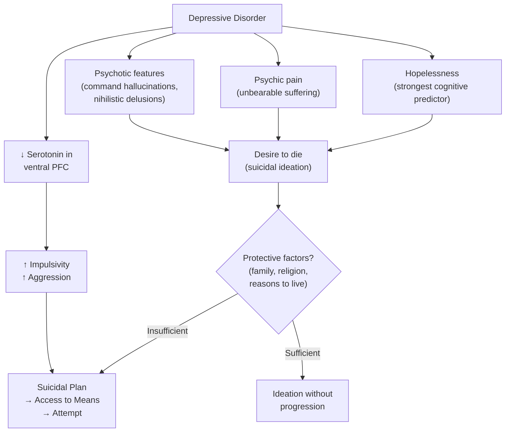

## Complications of Depressive Disorders

Depression is not just a "mood problem." It is a systemic illness with complications that span every domain of a patient's life — psychiatric, medical, social, and even cognitive-neurodegenerative. Understanding these complications is essential because they explain *why* depression carries such a high burden of disability and mortality, and why aggressive treatment matters.

Let's work through each category systematically, connecting every complication back to the underlying pathophysiology.

---

### 1. Suicide and Self-Harm — The Most Feared Complication

This is the complication that keeps psychiatrists up at night and the one you will be examined on most heavily.

#### 1.1 Scale of the Problem

***Depression raises suicidal risk. Increase in suicide risk attributable to depression was 20-fold.*** [1]

***Suicide was the cause of death in 6% of patients with an affective disorder, and the risk would be even higher in those with psychiatric co-morbidities.*** [1]

***In a longitudinal study in Sweden spanning over half a century, the long-term suicide risk in subjects with depression was 6.0% after 54–64 years of follow-up.*** [1]

***Mortality: > 20× risk of suicide; can approach 15% in those severe admitted cases.*** [2]

***Over 700,000 people commit suicide every year and many more attempt suicide. One of the major causes of suicide is depression.*** [1]

#### 1.2 Hong Kong Context

***Depression accounts for a significant proportion of suicides in adults in Hong Kong:*** [1]
- ***Using a case-control psychological autopsy method, 150 local suicide decedents aged 15–59 were compared with 150 randomly selected age- and gender-matched controls***
- ***In the presence of non-disease-related social risk factors (unemployment and unmanageable debt), current major depressive disorder independently accounted for 27% of the population-attributable risk of suicide***

***Depression accounts for a significant proportion of suicides in older adults in Hong Kong:*** [1]
- ***70 decedents aged 60 or above who had committed suicide were compared with 100 elderly controls***
- ***86% of suicide subjects suffered from a psychiatric problem before committing suicide, compared with 9% of control subjects***
- ***Among the psychiatric problems, major depression was the commonest diagnosis***

#### 1.3 Why Depression Causes Suicide — The Pathophysiological Chain

The path from depression to suicide involves convergence of multiple factors:

Key mechanistic points:
- **Hopelessness** (Beck's cognitive triad — negative view of future) is the single strongest predictor of suicidal behaviour, even more than depression severity itself
- **↓ 5-HT in ventral PFC** → impaired impulse control and increased aggression, including self-directed aggression. Post-mortem studies of suicide decedents consistently show ↓ 5-HT and ↓ 5-HIAA (serotonin metabolite) in CSF
- **Psychotic features** dramatically increase risk — command auditory hallucinations telling the patient to kill themselves, or nihilistic delusions (Cotard's syndrome) making the patient believe they are already dead or that their organs are rotting
- The critical **"dangerous window"** occurs in early antidepressant treatment (first 1–2 weeks) when energy returns before mood lifts — a previously too-apathetic patient now has the drive to act on suicidal thoughts

#### 1.4 Suicide Risk Spectrum

***Suicide can be understood as a spectrum and should be approached in a gradual manner:*** [2]
1. ***Depressed mood***
2. ***Negative thoughts: guilt → worthlessness → hopelessness***
3. ***Death wish: passive*** ("I don't care if I wake up tomorrow") ***→ active*** (active suicidal means considered)
4. ***Suicidal acts: plans and preparations → attempts***

***34% of suicidal ideation becomes plans; 72% of suicidal plans become attempts. Passive ideation can quickly become active.*** [2]

#### 1.5 Self-Harm

Deliberate self-harm (DSH) — e.g., cutting, burning, overdose — frequently accompanies depression but must be distinguished from suicidal behaviour:
- Self-harm may serve as emotional regulation (the pain provides temporary relief from emotional numbness/anhedonia)
- However, DSH is itself a strong risk factor for completed suicide — every episode must be taken seriously
- ***In some younger people, the first obvious sign may be self-injury or bulimia or drug use in a previously stable adolescent*** [1]

<Callout title="Every Depressed Patient Needs a Suicide Risk Assessment" type="error">
This is non-negotiable. You MUST assess suicide risk in every depressed patient at every encounter. Ask directly — asking about suicide does NOT increase risk (this is a common misconception). Use the mnemonic: **Ideation → Plan → Intent → Means → Protective factors → Previous attempts**.
</Callout>

---

### 2. Non-Suicidal Mortality and Medical Complications

***Depression increases non-suicidal mortality:*** [1]
- ***Reviewed 61 reports; 72% demonstrated positive association for depression and non-suicide mortality***
- ***RR = 1.2–4.0***

***Depression is associated with significant morbidity and mortality.*** [1]

***Possible mediators:*** [1]
- ***Behavioural risk factors (e.g. poor adherence to treatment, inactivity, ↑ alcohol consumption)***
- ***Biological risk factors (e.g. altered thrombogenesis)***
- ***Subclinical disease / prevalent disease (e.g. cardiovascular disease)***

#### 2.1 Cardiovascular Disease

| Mechanism | Pathway | Clinical Consequence |
|---|---|---|
| **HPA axis dysregulation** | Chronic ↑ cortisol → ↑ visceral fat, insulin resistance, dyslipidaemia, hypertension | Metabolic syndrome → accelerated atherosclerosis |
| **Altered thrombogenesis** | ↓ Serotonin in platelets (serotonin is stored in platelets and released during clot formation); altered platelet reactivity | ↑ Risk of thrombotic events (MI, stroke) |
| **Sympathetic overactivation** | ↑ NE, ↓ heart rate variability | ↑ Risk of arrhythmias, sudden cardiac death |
| **Inflammation** | ↑ Pro-inflammatory cytokines (IL-6, TNF-α, CRP) | Endothelial dysfunction → atherosclerosis |
| **Behavioural** | Physical inactivity, poor diet, smoking, medication non-adherence | Multiple cardiovascular risk factors |

Depression is an **independent risk factor** for MI, stroke, and cardiovascular mortality. Post-MI depression worsens prognosis — hence why cardiac rehabilitation programmes now screen for depression.

#### 2.2 Metabolic Syndrome and Diabetes

- Chronic cortisol → insulin resistance → type 2 diabetes
- Atypical depression with hyperphagia → weight gain → metabolic syndrome
- Antidepressant side effects (especially mirtazapine, TCAs, some antipsychotics used as augmentation) → weight gain, dyslipidaemia
- Depression impairs self-management of existing diabetes (poor adherence to diet, medications, glucose monitoring)

#### 2.3 Immune Dysfunction

- Depression is associated with ↑ pro-inflammatory cytokines and ↓ cellular immunity (↓ NK cell activity, ↓ T-cell function)
- This may partly explain the association with:
  - ↑ Susceptibility to infections
  - Poorer cancer prognosis (though evidence is mixed)
  - Accelerated ageing at the cellular level (telomere shortening)

#### 2.4 Chronic Pain

- Depression and chronic pain share common neurotransmitter pathways (↓ 5-HT and NE in descending pain-modulating pathways → lowered pain threshold)
- This creates a vicious cycle: pain → depression → ↓ pain threshold → more pain → worse depression
- This is why SNRIs (duloxetine) and TCAs (amitriptyline) are used for both depression and chronic pain

---

### 3. Psychiatric Comorbidity

***↑ co-morbidity with other disorders, especially anxiety and substance abuse*** [2]

#### 3.1 Anxiety Disorders

- **Prevalence**: Up to 70% of depressed patients have comorbid anxiety [2]
- **Why**: Shared neurobiology (↓ 5-HT, HPA axis dysregulation, amygdala hyperactivation), shared genetic risk factors, and shared environmental risk factors (early adversity, neuroticism)
- **Impact**: Comorbid anxiety worsens depression prognosis — ↑ severity, ↓ treatment response, ↑ chronicity, ↑ suicidal risk
- **Examples**: GAD, panic disorder, social anxiety disorder, OCD, PTSD

#### 3.2 Substance Use Disorders

- ***Depression: most common comorbidity [with alcoholism]; alcoholism may be a way of self-medication*** [2]
- Depression → substance use (self-medication: alcohol to numb emotional pain, cannabis for temporary mood lift, stimulants for energy)
- Substance use → depression (alcohol is a CNS depressant; stimulant withdrawal causes DA depletion → "crash")
- Both share genetic vulnerability
- Comorbid substance use is a major risk factor for suicide, treatment non-adherence, and poor functional outcomes

***Comorbid substance abuse is a prognosticant for relapse.*** [2]

***The distress caused by untreated mood symptoms results in increased suicidality, comorbid anxiety and substance use disorders.*** [3]

#### 3.3 Development of Bipolar Disorder

- ***~25% of bipolar affective disorder first presents as juvenile depression*** [2]
- Some patients initially diagnosed with MDD will later develop a manic/hypomanic episode, reclassifying them as bipolar disorder
- Predictors of bipolar conversion: early onset ( < 25y), psychotic features, family history of bipolar, atypical features (hypersomnia, hyperphagia), antidepressant-induced hypomania/mania

---

### 4. Functional Impairment and Disability

***Depression is the 4th leading cause of disability worldwide*** [2]
***Depressive disorder is the 1st cause of disability-adjusted life years under mental, neurological, and substance use disorders*** [3]
***~$85 billion/year loss of productivity*** [2]

| Domain | Impact | Mechanism |
|---|---|---|
| **Occupational** | Absenteeism (missing work), presenteeism (at work but unproductive), unemployment, disability claims | Anergia, poor concentration, psychomotor retardation, anhedonia → cannot perform job tasks |
| **Social** | Social withdrawal, relationship breakdown, isolation | Anhedonia → loss of interest in relationships; irritability → conflict; guilt/worthlessness → feels like a burden |
| **Self-care** | Poor hygiene, malnutrition, medical non-adherence | Anergia + anhedonia → cannot motivate to maintain basic activities of daily living |
| **Academic** | ***Decline in school performance*** [1] | Poor concentration (↓ dlPFC), fatigue, absenteeism |

***Only ~25% of those with recurrent major depression achieve 5-year clinical stability with good social and occupational performances.*** [2]

> This is a sobering statistic: 3 out of 4 patients with recurrent depression will NOT achieve full functional recovery. This underscores why aggressive treatment, relapse prevention, and rehabilitation are essential.

---

### 5. Cognitive Impairment

#### 5.1 Acute Cognitive Deficits During Episodes

- ***↓ activity in dorsolateral prefrontal cortex → psychomotor retardation, apathy, deficits in attention/working memory*** [2]
- Impaired executive function, processing speed, verbal memory
- In elderly: ***pseudodementia*** — cognitive impairment that mimics dementia but is reversible with treatment of depression

#### 5.2 Residual Cognitive Deficits Between Episodes

- Increasingly recognised that cognitive impairment persists even after mood symptoms remit
- Affects concentration, memory, decision-making → ongoing functional impairment
- ***~50% does not have complete symptom remission between episodes*** [2] — residual cognitive symptoms are among the most persistent

#### 5.3 Neuroprogression and Dementia Risk

This is a critical emerging concept:

***Neuroprogression theory: worse prognosis with frequent relapses. Increased risk of future development of dementia.*** [3]

- Each depressive episode causes cumulative neurobiological damage:
  - Chronic cortisol → hippocampal atrophy → memory impairment
  - ↓ BDNF → impaired neuroplasticity and neurogenesis
  - Chronic neuroinflammation → neuronal damage
- Meta-analyses show depression approximately **doubles the risk** of developing dementia (both Alzheimer's disease and vascular dementia)
- ***Progressive shortening of interval between episodes*** [2] — suggests a "kindling" effect where each episode lowers the threshold for the next one
- This provides a strong rationale for **maintenance treatment** and **relapse prevention** — you're not just preventing mood episodes, you're protecting the brain from cumulative damage

<Callout title="Depression as a Neurodegenerative Process">
Each untreated or inadequately treated depressive episode may cause cumulative hippocampal atrophy and neuroplastic damage (via chronic cortisol, ↓ BDNF, neuroinflammation). This "neuroprogression" means that depression is not a benign, self-limiting condition — recurrent episodes worsen long-term cognitive outcomes and increase dementia risk. This is one of the strongest arguments for aggressive relapse prevention with maintenance antidepressant therapy.
</Callout>

---

### 6. Impact on Physical Health and Medical Comorbidities

***Depression entails a non-psychiatric impact:*** [2]
- ***↑ morbidity: associated with ↓ birth weight, chronic medical illness, poor self-perceived health, functional/cognitive impairment***
- ***↑ mortality: RR 1.2–4.0× non-suicide mortality***

| Medical Complication | Mechanism |
|---|---|
| **Worsened outcomes in chronic disease** | Depression impairs treatment adherence, self-care, and health behaviours (diet, exercise, smoking cessation) in patients with diabetes, CHF, COPD, CKD |
| **↓ Birth weight** | Maternal depression → ↑ cortisol crosses placenta → fetal growth restriction; also poor maternal nutrition and prenatal care |
| **Post-operative complications** | Depression → ↓ immune function, poor wound healing, medication non-adherence, longer hospital stays |
| **Osteoporosis** | Chronic ↑ cortisol → bone resorption; physical inactivity; poor nutrition |

---

### 7. Treatment-Related Complications

#### 7.1 Antidepressant Side Effects

| Side Effect | Drug Class | Mechanism | Clinical Significance |
|---|---|---|---|
| Suicidal ideation (early treatment) | SSRIs (esp. in young adults) | Energy returns before mood → dangerous window | Black box warning; close monitoring in first 2 weeks |
| Serotonin syndrome | SSRIs + MAOIs / tramadol / triptans | Excessive synaptic 5-HT → autonomic instability, neuromuscular excitation, altered mental status | Medical emergency — can be fatal |
| QTc prolongation / arrhythmias | TCAs, citalopram (high dose) | Na⁺/K⁺ channel blockade | Lethal in overdose (TCAs); ECG monitoring |
| Hyponatraemia (SIADH) | SSRIs (esp. in elderly) | ↑ ADH secretion → water retention → dilutional hyponatraemia | Monitor Na⁺; can cause confusion, seizures |
| Discontinuation syndrome | Venlafaxine (short t½), paroxetine | Abrupt withdrawal → rebound monoamine changes | "Brain zaps," dizziness, irritability, insomnia; taper gradually |
| Metabolic syndrome | Mirtazapine, TCAs, atypical antipsychotics (augmentation) | H₁ blockade → weight gain; insulin resistance | Monitor weight, glucose, lipids |
| Tyramine crisis | Irreversible MAOIs | MAO-A inhibition in gut → tyramine absorption → massive NE release → hypertensive crisis | Dietary restrictions essential |

#### 7.2 ECT Complications

- ***Cognitive impairment: acute confusion, anterograde or retrograde amnesia — generally short-lived*** [2]
- ***Mortality: 2–4/100,000*** [2]

#### 7.3 Chronic Illness Behaviour

- With chronic or recurrent depression, patients may develop secondary behavioural patterns:
  - Learned helplessness → passivity and dependence on others
  - Sick role adoption → disability claims, avoidance of recovery
  - Caregiver burnout → relationship breakdown
  - ***Comorbid personality disorder is a prognosticant for relapse*** [2]

---

### 8. Social and Economic Complications

| Domain | Complication | Mechanism |
|---|---|---|
| **Relationships** | Marital breakdown, family conflict, social isolation | Irritability, withdrawal, emotional unavailability, burden on caregivers |
| **Parenting** | Impaired parenting → adverse outcomes for children | Depressed parents less responsive, less consistent; children of depressed parents have ↑ risk of developing depression themselves (genetic + environmental) |
| **Employment** | Job loss, reduced income, disability | Absenteeism, presenteeism, impaired performance |
| **Legal** | Self-neglect, capacity issues in severe depression | Psychotic depression may impair capacity to make decisions |
| **Economic** | ***~$85B/y loss of productivity*** [2]; healthcare utilisation | Direct costs (treatment) + indirect costs (lost productivity, disability payments) |

---

### 9. Chronic and Recurrent Course as a Complication

***Clinical course: generally self-limiting within 6 months to 1 year*** [2] — but:

- ***~80% will recur; average ~4 further episodes in 25 years*** [2]
- ***~25% > 1 year duration; ~10–20% chronic unremitting*** [2]
- ***~50% does not have complete symptom remission between episodes*** [2]
- ***Usually associated with progressive shortening of interval between episodes*** [2]

This chronic relapsing course is itself a major complication — each episode carries risk of:
- Further neurobiological damage (neuroprogression)
- Cumulative functional decline
- Suicide
- Substance abuse
- Caregiver and family burnout

***Prognosticants for relapse:*** [2]
1. ***Incomplete symptomatic remission***
2. ***Early age of onset***
3. ***Poor social support***
4. ***Poor physical health***
5. ***Comorbid substance abuse***
6. ***Comorbid personality disorder***

***In some tragic cases, symptoms may be masked to others until the person is found dead by suicide.*** [1]

---

### Summary Table: Complications by Domain

| Domain | Key Complications |
|---|---|
| **Suicide/Self-harm** | 20× risk of suicide; 6% lifetime suicide rate; 15% in severe hospitalised cases; accounts for 27% of population-attributable suicide risk in HK |
| **Medical mortality** | RR 1.2–4.0× non-suicide mortality; CVD, metabolic syndrome, thrombotic events |
| **Psychiatric comorbidity** | 70% comorbid anxiety; substance abuse (self-medication); bipolar conversion (25% of youth) |
| **Cognitive** | Acute deficits (pseudodementia in elderly); residual cognitive impairment; neuroprogression → ↑ dementia risk |
| **Functional/Social** | 4th leading cause of disability; only 25% achieve 5-year stability; relationship breakdown; impaired parenting; job loss |
| **Treatment-related** | SSRI-induced suicidality; serotonin syndrome; TCA overdose; SIADH; discontinuation syndrome; metabolic side effects |
| **Economic** | ~$85B/y productivity loss; healthcare burden |
| **Chronic course** | 80% recurrence; progressive interval shortening; 10–20% chronic unremitting |

---

<Callout title="High Yield Summary">

**Suicide**: Most feared complication. 20× increased risk; 6% lifetime suicide mortality in affective disorders. In HK, MDD accounted for 27% of population-attributable suicide risk in adults and was the commonest psychiatric diagnosis among elderly suicide decedents. Hopelessness is the strongest predictor. Always assess: ideation → plan → intent → means → protective factors.

**Non-suicide mortality**: RR 1.2–4.0×, primarily through CVD (altered thrombogenesis, HPA axis dysregulation, inflammation, behavioural risk factors). Depression is an independent risk factor for MI and stroke.

**Psychiatric comorbidity**: 70% comorbid anxiety; frequent substance abuse (self-medication); 25% of youth depression converts to bipolar.

**Cognitive impairment and neuroprogression**: Each episode causes cumulative hippocampal atrophy and neuroplastic damage. Depression approximately doubles dementia risk. Residual cognitive deficits persist between episodes in ~50% of patients.

**Functional impairment**: 4th leading cause of disability worldwide. Only 25% of recurrent MDD patients achieve 5-year functional stability. Massive economic burden (~$85B/year).

**Chronic relapsing course**: 80% recurrence; average 4 episodes in 25 years; progressive interval shortening (kindling); 10–20% chronic unremitting. Poor prognosticants: incomplete remission, early onset, poor social support, poor physical health, comorbid SA, comorbid personality disorder.

**Treatment complications**: Early SSRI-induced suicidality (energy before mood); serotonin syndrome; TCA overdose lethality; SIADH; discontinuation syndrome; metabolic effects from augmentation agents.

</Callout>

---

<ActiveRecallQuiz
  title="Active Recall - Complications of Depressive Disorders"
  items={[
    {
      question: "What is the lifetime suicide risk in patients with affective disorders, and what percentage of population-attributable suicide risk in Hong Kong adults was accounted for by major depressive disorder?",
      markscheme: "Lifetime suicide risk in affective disorders: approximately 6% (up to 15% in severe hospitalised cases). In Hong Kong, MDD independently accounted for 27% of the population-attributable risk of suicide in adults aged 15-59 (Chan et al., 2009). Among elderly suicide decedents, 86% had a psychiatric problem and major depression was the commonest diagnosis."
    },
    {
      question: "Explain three pathophysiological mechanisms by which depression increases non-suicidal cardiovascular mortality.",
      markscheme: "(1) HPA axis dysregulation: chronic cortisol elevation causes visceral fat accumulation, insulin resistance, dyslipidaemia, and hypertension, accelerating atherosclerosis. (2) Altered thrombogenesis: abnormal platelet serotonin handling increases thrombotic risk for MI and stroke. (3) Chronic inflammation: elevated pro-inflammatory cytokines (IL-6, TNF-alpha, CRP) cause endothelial dysfunction and atherosclerosis. Also: sympathetic overactivation causing decreased heart rate variability and arrhythmia risk; and behavioural factors (inactivity, smoking, poor adherence)."
    },
    {
      question: "What is the neuroprogression theory of depression, and what is its clinical implication for long-term management?",
      markscheme: "Neuroprogression theory: each depressive episode causes cumulative neurobiological damage via chronic cortisol leading to hippocampal atrophy, decreased BDNF impairing neuroplasticity, and chronic neuroinflammation. This results in progressive shortening of intervals between episodes (kindling effect), residual cognitive deficits between episodes, and approximately doubled risk of developing dementia. Clinical implication: aggressive relapse prevention with maintenance antidepressant therapy is needed not just to prevent mood episodes but to protect the brain from cumulative structural damage."
    },
    {
      question: "List the six prognostic factors for relapse in major depressive disorder.",
      markscheme: "(1) Incomplete symptomatic remission, (2) Early age of onset, (3) Poor social support, (4) Poor physical health, (5) Comorbid substance abuse, (6) Comorbid personality disorder."
    },
    {
      question: "Why is the first 1-2 weeks of SSRI treatment considered a particularly dangerous period for suicide risk?",
      markscheme: "SSRIs restore energy and motivation (noradrenergic/dopaminergic downstream effects) before fully lifting depressed mood and hopelessness (serotonergic effects take 2-4 weeks). This creates a dangerous window where a previously too apathetic patient now has the drive to act on persistent suicidal thoughts. This is why close monitoring (weekly follow-up) is essential in the early treatment period, particularly in adolescents and young adults."
    },
    {
      question: "A 70-year-old depressed patient on an SSRI develops confusion, nausea, and a serum sodium of 124 mmol/L. What is the likely complication, its mechanism, and how should it be managed?",
      markscheme: "SSRI-induced hyponatraemia due to SIADH (syndrome of inappropriate antidiuretic hormone secretion). SSRIs stimulate ADH release leading to water retention and dilutional hyponatraemia. Management: hold or switch the SSRI, fluid restriction (first-line), monitor sodium closely. Correct hyponatraemia gradually (no more than 10 mmol/L per 24 hours to avoid osmotic demyelination syndrome). Consider switching to an antidepressant with lower SIADH risk (e.g. bupropion, mirtazapine)."
    }
  ]}
/>

## References

[1] Lecture slides: GC 164. I am depressed Mood disorders.pdf (p4, p5, p6, p25, p26)
[2] Senior notes: ryanho-psych.md (sections on course and prognosis, epidemiology, clinical features, suicide risk assessment, psychiatric comorbidity in alcoholism, prognosticants for relapse)
[3] Lecture slides: GC 163. I am a superman Bipolar disorder.pdf (p14, p23, p26, p34)
