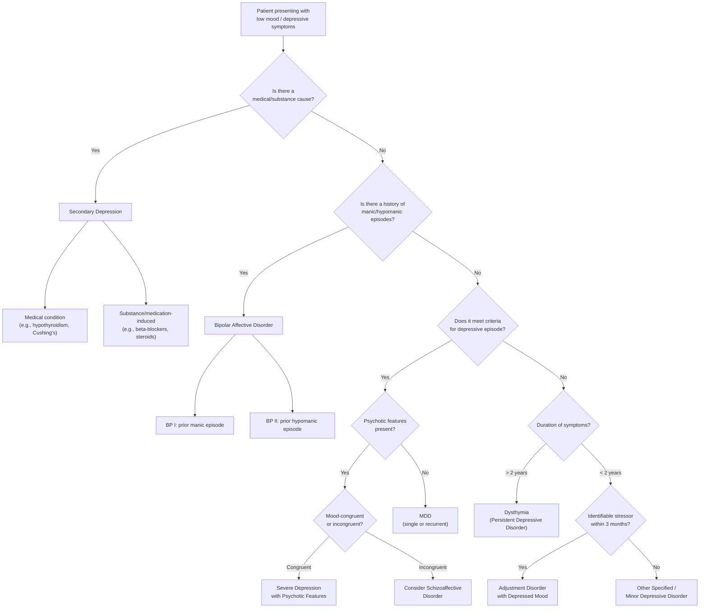

## Differential Diagnosis of Depressive Disorders

### Approach — Why Is DDx Important Here?

Depression is a **syndrome**, not a single disease. Before you stamp "Major Depressive Disorder" on a patient, you must systematically exclude three broad categories:

1. **Other primary psychiatric disorders** that present with low mood
2. **Medical conditions** that cause depressive symptoms via physiological mechanisms
3. **Substance/medication-induced** mood disturbance

The reason this matters clinically is straightforward: treating "depression" with an SSRI when the real problem is hypothyroidism, Cushing's syndrome, or an unrecognised bipolar disorder will either fail or actively harm the patient. ***Misdiagnosis is especially common — among 600 patients with bipolar disorder, 69% were initially misdiagnosed and most frequently as major depression, followed by anxiety disorders, substance or alcohol use disorder. Correct diagnosis and treatment was delayed by 5–7 years on average.*** [3]

<Callout title="The Golden Rule" type="error">
Every patient presenting with depressive symptoms MUST have a thorough medical history, medication history, substance use history, and screening for past manic/hypomanic episodes — before diagnosing a primary depressive disorder. Missing bipolar disorder (by not asking about hypomania) and missing secondary causes (by not checking TFTs) are the two most common exam and clinical mistakes.
</Callout>

---

### Systematic DDx Framework

---

### Category 1: Other Psychiatric Conditions

#### 1.1 Adjustment Disorder with Depressed Mood

***Adjustment disorder with depressed mood*** [1]

| Feature | Adjustment Disorder | MDD |
|---|---|---|
| Criteria met? | ***Does NOT meet full criteria for depressive episode*** [2] | Meets full criteria |
| Stressor | ***Onset ≤ 3 months of an identifiable stressor*** [2] | Stressor not required (though often present) |
| Duration | Symptoms resolve within 6 months of stressor ending | Minimum 2 weeks; can persist for months |
| Severity | Typically milder, proportionate (though still exceeds what would be expected) | Can be mild, moderate, or severe |

**Why this distinction matters**: If symptoms meet full criteria for a depressive episode, you should diagnose the depressive episode as a comorbid condition, not merely an adjustment disorder. ***If meeting depressive episode criteria, should be regarded as having comorbid depression.*** [2]

#### 1.2 Bipolar Affective Disorder (Depressive Phase)

This is the single most dangerous misdiagnosis. A patient in a bipolar depressive episode looks identical to MDD — the differentiating feature is a **history of mania/hypomania**, which you can only find by asking.

***Hypomanic episodes are often overlooked. Patients with BP II are misdiagnosed as having major depressive disorder.*** [3]

| Feature | Unipolar Depression (MDD) | Bipolar Depression |
|---|---|---|
| Past hypomania/mania | Absent | ***≥ 1 previous manic/hypomanic episode*** [2] |
| Age of onset | Typically later (~27y) | Earlier (late teens–early 20s) |
| Symptom profile | Insomnia, appetite loss more common | ***Atypical features more common: hypersomnia, hyperphagia, leaden paralysis*** [2] |
| Psychotic features | Less common overall | More common; may predict future bipolar conversion |
| Family history | FHx of depression | ***FHx of bipolar disorder*** |
| Treatment response | Responds to antidepressants | ***Antidepressants alone are less effective and may result in manic switch and cycle acceleration*** [2] |
| Course | Longer episodes | Shorter, more frequent episodes |

> ***~25% of bipolar affective disorder first presents as juvenile depression in their first episode.*** [2] Always ask young depressed patients (and their families) about any period of unusually elevated mood, decreased need for sleep, grandiosity, or reckless behaviour.

<Callout title="How to Screen for Missed Hypomania" type="idea">
Use structured screening tools: ***Mood Disorder Questionnaire (MDQ)***, ***Hypomania Checklist (HCL-32)*** [2]. At minimum, always ask: "Has there ever been a time when you felt the opposite of depressed — unusually energetic, needing less sleep, overly confident, doing things you normally wouldn't?"
</Callout>

#### 1.3 Manic Episode with Irritable Mood or Mixed Episodes

***Manic episode with irritable mood or mixed episodes*** [1]

Why this is confusing: A manic patient can present as irritable, angry, and dysphoric rather than euphoric — mimicking an agitated depression. Mixed features (simultaneous depressive and manic symptoms) further blur the line.

Key differentiators:
- ↑ Energy and ↓ need for sleep (despite appearing distressed) — the opposite of depressive anergia
- Pressured speech, grandiosity, distractibility
- Episode is typically shorter (days to weeks) with more acute onset than MDD

#### 1.4 ***Persistent Depressive Disorder (formerly known as Dysthymic Disorder)*** [1]

| Feature | MDD | Dysthymia |
|---|---|---|
| Symptom severity | Meets full criteria for depressive episode | ***Symptoms NOT meeting criteria*** [2] |
| Duration | ≥ 2 weeks per episode | ***≥ 2 years continuously*** [2] |
| Onset | Any age (mean ~27y) | ***Usually early adulthood*** [2] |
| Course | Episodic (episodes with remission) | ***Chronic, trait-like*** [2] |
| "Double depression" | — | ***May have superimposed major depressive episodes*** [2] |

**Why the distinction matters**: Dysthymia tends to respond better to combined psychotherapy + antidepressant than antidepressant alone. The chronicity means patients often believe "this is just who I am" rather than recognising it as a treatable illness.

#### 1.5 ***Anxiety Disorder*** [1]

Anxiety and depression are the most commonly confused and comorbid psychiatric conditions. Up to 70% of depressed patients have comorbid anxiety, and up to 60% of anxious patients have comorbid depression [2].

| Feature | GAD | Depression |
|---|---|---|
| Core emotion | Worry about future events | Sadness, hopelessness about past/self |
| Content of rumination | ***Worry about possible future events*** (what if…?) [2] | ***Brood self-critically on previous events and circumstances*** [2] |
| Onset | Insidious, chronic | Can be more defined |
| Somatic symptoms of depression | Absent | ***Early morning wakening, diurnal variation in mood, suicidal thoughts are uncommon in GAD*** [2] |
| Reactivity | Mood reactive to reassurance (temporarily) | Loss of reactivity |
| Sleep | Difficulty falling asleep (initial insomnia) | Early morning wakening (terminal insomnia — melancholic) |

***Note that in some patients GAD + depression can co-exist.*** [2] In clinical practice, when both are present, treat the more severe condition first (usually depression).

#### 1.6 ***Substance/Medication-Induced Depressive Disorder*** [1]

The question here is about temporal relationship and the pharmacological mechanism:

- **Intoxication-related**: depression during active use (alcohol is a CNS depressant; cannabis can cause amotivational syndrome)
- **Withdrawal-related**: depression during withdrawal (stimulant "crash" after cocaine/amphetamines)
- **Medication side effects**: many drugs can cause secondary depression

***Drug-related conditions that can cause depressive symptoms include:*** [1]
- ***Antihypertensive medications, especially reserpine and methyldopa*** — reserpine depletes monoamines (the original evidence for the monoamine hypothesis!)
- ***Smoking-cessation aids***
- ***Steroids*** — exogenous glucocorticoids dysregulate the HPA axis
- ***Sex hormones and medications that affect sex hormones*** (e.g., OCP, GnRH agonists)
- ***H2 blockers, sedatives, muscle relaxants, appetite suppressants***
- ***Chemotherapy agents***
- ***Alcohol / cocaine / amphetamines / cannabinoids / sedatives / hypnotics / narcotics abuse*** [1]

Additional medications from senior notes [2]:
- ***Beta-blockers*** (notorious — lipophilic ones like propranolol cross the BBB and block central β-adrenergic receptors → ↓ NE signalling)
- ***L-dopa*** (dopamine fluctuations)
- ***Benzodiazepines*** (GABAergic CNS depression)
- ***Antipsychotics*** (dopamine blockade → anhedonia, akinesia mimicking depression)
- ***Opiates, indomethacin, interferon*** (interferon-α is particularly notorious for causing severe depression — up to 30% of patients on IFN-α for Hepatitis C)

**Why reserpine matters historically**: Reserpine was used as an antihypertensive. It irreversibly blocks VMAT2 (vesicular monoamine transporter 2), preventing storage of monoamines (5-HT, NE, DA) in synaptic vesicles → monoamine depletion → depressive state. ***This observation was key evidence for the monoamine hypothesis of depression.*** [1]

#### 1.7 Schizoaffective Disorder

***Schizoaffective disorder:*** [2]
- ***Simultaneous occurrence of depressive episode and schizophrenic symptoms lasting ≥ 2 weeks***
- ***Delusions and hallucinations are less mood congruent and may occur outside mood episodes*** (cf severe depression with psychotic features)
- ***Must have concurrent mood + psychotic symptoms*** (cf schizophrenia)

| Feature | Severe Depression with Psychosis | Schizoaffective Disorder |
|---|---|---|
| Psychotic symptoms | **Mood-congruent** (guilt, worthlessness, nihilism) | Less mood-congruent; may have bizarre delusions, thought alienation |
| Timing of psychosis | **Only during mood episodes** | ***Psychotic symptoms also occur outside mood episodes*** |
| Schneider's first-rank | Rare | May be present |
| Course | Episodic with full inter-episode recovery | More chronic psychotic residua between episodes |

#### 1.8 Schizophrenia

Negative symptoms of schizophrenia (flat affect, avolition, anhedonia, social withdrawal, poverty of speech) can closely mimic depression. Key differences:

- Schizophrenia: prominent positive symptoms (hallucinations, delusions — mood-incongruent and bizarre); formal thought disorder; onset typically late teens to 20s; chronic deteriorating course
- Depression: mood symptoms precede and dominate; psychotic features (if present) are mood-congruent; better inter-episode functioning

#### 1.9 Other Psychiatric DDx

| Condition | Differentiating Features |
|---|---|
| **OCD** | ***Ruminations in depression are mood congruent and not necessarily experienced as intrusive or distressing. There is also no compulsion associated*** [2]. In OCD, obsessions are ego-dystonic (unwanted, intrusive), and compulsions are performed to reduce anxiety |
| **Somatic symptom disorder** | ***If somatic symptoms and related concerns do not occur outside of depressive episodes, then the diagnosis of somatic symptom disorder is not made*** [2] |
| **Dementia vs. Pseudodementia** | ***Depression is the most important mimic of dementia ("pseudodementia"), accounts for ~10% of presumed dementia*** [2]. In depression: onset more defined, patient complains of memory loss (insight preserved), gives "don't know" answers, attention > memory affected. In dementia: insidious onset, patient unaware/minimises deficits, tries hard but gives wrong answers, true amnesia |
| **Bereavement / Normal grief** | DSM-5 ***removed the "bereavement exclusion"*** [1] — grief CAN trigger a depressive episode. Normal grief: comes in waves, preserves self-esteem, may have positive memories. Depression: pervasive, constant, marked worthlessness/guilt, suicidal ideation |

<Callout title="DSM-5 Key Change — Bereavement Exclusion Removed" type="idea">
***Depressive symptoms may be understandable/considered appropriate to significant loss (e.g., bereavement, financial ruin, losses from a natural disaster, a serious medical illness or disability).*** However, DSM-5 recognises that bereavement can trigger a genuine depressive episode. ***Exercise of clinical judgment based on the individual's history and the cultural norms*** is required [1]. Do not dismiss a grieving patient who meets full criteria — they may need treatment.
</Callout>

---

### Category 2: Secondary to General Medical Conditions

***Depression can be associated with medical conditions:*** [1]

The mechanism can be:
1. **Direct physiological effect** on brain function (e.g., hypothyroidism → ↓ monoamine turnover)
2. **Psychological reaction** to illness (e.g., adjustment to cancer diagnosis)
3. **Shared pathophysiology** (e.g., vascular depression — cerebrovascular disease and depression share endothelial dysfunction and inflammation)

| System | ***Conditions*** [1] | Mechanism (Why?) |
|---|---|---|
| ***Neurological*** | ***Epilepsy, Parkinson's disease, dementia, multiple sclerosis, Huntington disease, cerebrovascular disease, migraine*** [1]; head trauma, tumours [2] | Parkinson's: ↓ DA in mesolimbic pathway → anhedonia + motor symptoms. Stroke: direct damage to mood-regulating circuits (especially left frontal). MS: demyelination of monoaminergic tracts. Huntington's: basal ganglia degeneration → ↓ DA. Epilepsy: especially temporal lobe epilepsy affecting limbic structures |
| ***Endocrine*** | ***Hypothyroidism, hyperthyroidism, Cushing's syndrome, Addison disease, prolactinomas, hyperparathyroidism*** [1]; vitamin deficiency [2] | Hypothyroidism: ↓ T3/T4 → ↓ monoamine metabolism and neuronal energy. Cushing's: ↑ cortisol → hippocampal damage, HPA axis disruption. Addison's: ↓ cortisol → fatigue, weakness (mimics depression). Hyperparathyroidism: ↑ Ca²⁺ → "moans, groans, stones, and psychiatric overtones" — Ca²⁺ affects neuronal excitability |
| ***Infectious*** | ***Mononucleosis, HIV infection, hepatitis C infection, Lyme disease, syphilis*** [1] | HIV: direct CNS invasion + psychosocial impact. HCV: neuroinflammation + interferon treatment. Syphilis (neurosyphilis): direct CNS damage. Post-viral fatigue syndromes |
| ***Neoplastic*** | ***Neoplasias and paraneoplastic syndromes, e.g., pancreatic cancer*** [1] | Pancreatic cancer is notorious for presenting with depression even before the cancer is diagnosed — possibly via paraneoplastic antibodies or inflammatory cytokines affecting brain function |
| ***Chronic disease*** | ***Coronary artery disease, type II diabetes*** [1]; CHF, MI [2] | Shared inflammatory pathways (↑ IL-6, TNF-α, CRP); endothelial dysfunction; behavioural inactivity; chronic pain |
| ***Pain/Psychosomatic*** | ***Chronic pain and psychosomatic conditions*** [1] | ↓ 5-HT and NE → lowered pain threshold; chronic pain itself is demoralising and disabling → depression |
| ***Sleep*** | ***Sleep-related disorders, in particular obstructive sleep apnea*** [1] | OSA → chronic hypoxia + sleep fragmentation → daytime fatigue, poor concentration, irritability (mimics/causes depression) |

<Callout title="High Yield — Pancreatic Cancer" type="error">
Pancreatic cancer can present with depression as the earliest symptom, preceding any abdominal symptoms by months. In exam scenarios: a middle-aged or older patient with new-onset depression + weight loss + vague abdominal discomfort → think pancreatic cancer and investigate (CT abdomen, CA 19-9).
</Callout>

---

### Category 3: Substance/Medication-Induced (Detailed)

Already covered above (§1.6), but here is a quick-reference table for high-yield exam content:

| Drug Class | Examples | Mechanism |
|---|---|---|
| ***Antihypertensives*** | ***Reserpine, methyldopa*** [1]; ***beta-blockers*** [2] | Reserpine: VMAT2 blockade → monoamine depletion. Methyldopa: ↓ NE synthesis. Beta-blockers: central β-blockade → ↓ NE signalling |
| ***Steroids*** | Prednisolone, dexamethasone [1] | HPA axis disruption; direct neurotoxicity at high doses |
| ***Hormonal*** | OCP, GnRH agonists [1][2] | Estradiol fluctuations affect 5-HT systems |
| ***Neurological drugs*** | ***L-dopa*** [2], antiepileptics | DA fluctuations (L-dopa); GABAergic effects (antiepileptics) |
| ***Sedatives*** | ***Benzodiazepines*** [2], barbiturates | CNS depression, GABAergic |
| ***Antipsychotics*** | All, especially high-potency typical [2] | D₂ blockade → anhedonia, akinesia |
| ***Substances of abuse*** | ***Alcohol, cocaine, amphetamines, cannabinoids, opiates*** [1] | Alcohol: CNS depressant + neurotoxic. Cocaine/amphetamine withdrawal: DA depletion → crash. Cannabis: amotivational syndrome. Opiates: ↓ DA release with chronic use |
| ***Others*** | ***Interferon, indomethacin, chemotherapy, H2 blockers*** [1][2] | Interferon-α: ↑ IDO (indoleamine 2,3-dioxygenase) → tryptophan diverted from 5-HT synthesis to kynurenine pathway → ↓ 5-HT |

---

### Assessment to Rule Out Secondary Causes

***Physical examination & investigation to rule out medical conditions that may cause depressive symptoms:*** [1]

***Basic investigations:*** [1]
- ***CBP*** (complete blood picture) — anaemia, infection, ↑ MCV (alcoholism) [2]
- ***R/LFT*** (renal/liver function tests) — hypoNa (antidepressant side effect), Ca²⁺ (hyperparathyroidism → secondary depression), GGT/alcoholic liver disease [2]
- ***Thyroid function test*** — hypothyroidism is the most important and common secondary cause to exclude [1][2]

***Other investigations if indicated by history and physical examination:*** [1]
- ***Blood alcohol level***
- ***Blood and urine toxicology screen*** — substance-induced depression
- ***HIV test*** — HIV-associated depression
- ***Cosyntropin (ACTH) stimulation test*** — for Addison disease
- ***EEG*** — for epilepsy
- ***CT or MRI*** — for organic brain syndrome or hypopituitarism
- CRP/ESR — infection or inflammatory disease [2]
- Vitamin B12 and folate — nutritional deficiency [2]
- ECG — if cardiac problems (important baseline before TCAs or lithium which prolong QT) [2]

---

### Distinguishing Depression from Pseudodementia — A Common Exam Scenario

| Feature | Depression ("Pseudodementia") | Dementia |
|---|---|---|
| Onset | More defined, relatively rapid | Insidious, gradual |
| Patient's attitude | ***Complains/worries about poor memory; presents themselves*** [2] | Poor insight; ***brought to doctor by family*** [2] |
| Effort on testing | ***Gives less effort; "I don't know" answers*** [2] | ***Tries hard but gives incorrect answers*** [2] |
| Cognitive profile | ***Attention and concentration primarily affected*** [2] | True amnesia; language and visuospatial also affected |
| Motor/language skills | ***Slow but not impaired*** [2] | Impaired (apraxia, aphasia) |
| Other features | ***Morning dysphoria, psychomotor retardation, biological symptoms of depression*** [2] | Behavioural and personality changes, disorientation |
| Treatment | ***Treat depression first — cognition usually improves*** [2] | Progressive despite treatment |

---

### Summary DDx Table

| Category | Diagnoses | Key Differentiating Feature |
|---|---|---|
| **Primary mood disorders** | MDD (single/recurrent) | Meets criteria, ≥ 2 wk, no mania Hx |
| | Bipolar depression | ***≥ 1 prior manic/hypomanic episode*** |
| | Dysthymia | Subthreshold, ≥ 2 years |
| | Cyclothymia | Subthreshold depressive + hypomanic, ≥ 2 years |
| ***Other psychiatric*** [1] | ***Adjustment disorder with depressed mood*** | Not meeting criteria, ≤ 3mo of stressor |
| | ***Anxiety disorder*** | Worry about future; no biological features of depression |
| | Schizoaffective disorder | Psychotic symptoms outside mood episodes |
| | Schizophrenia (negative symptoms) | Prominent positive symptoms, deteriorating course |
| | OCD | Ego-dystonic obsessions + compulsions |
| | Bereavement / Normal grief | Comes in waves, self-esteem preserved |
| ***Medical conditions*** [1] | ***Neurological, endocrine, infectious, neoplastic, chronic disease, sleep disorders*** | History, examination, and investigations identify the cause |
| ***Substance/medication*** [1] | ***Drug-related conditions*** | Temporal relationship to substance use/medication |
| ***Mood disorder due to another medical condition*** [1] | Various (see above) | Physiological mechanism identified |

---

> **High Yield DDx Points for Exams:**
> 1. Always exclude bipolar disorder by asking about past hypomania/mania — this is the most commonly missed diagnosis
> 2. Always check TFTs — hypothyroidism is the most common medical mimic
> 3. Review the medication list — beta-blockers, steroids, interferon are common culprits
> 4. In elderly with "cognitive decline" → consider pseudodementia (treat depression first)
> 5. In new-onset depression with weight loss in middle-aged/elderly → consider pancreatic cancer
> 6. DSM-5 removed the bereavement exclusion — grief can trigger MDD

---

<ActiveRecallQuiz
  title="Active Recall - Differential Diagnosis of Depressive Disorders"
  items={[
    {
      question: "A 35-year-old woman presents with low mood for 6 months. She has had two prior episodes of feeling 'on top of the world' lasting 5 days each, with decreased need for sleep and increased spending. What is the most likely diagnosis and why is it commonly misdiagnosed?",
      markscheme: "Bipolar II disorder (depressive episode with prior hypomanic episodes). Commonly misdiagnosed as MDD because hypomanic episodes are often overlooked or under-reported. 69% of bipolar patients were initially misdiagnosed, most commonly as major depression. Correct diagnosis delayed by 5-7 years on average."
    },
    {
      question: "Name four categories of medical conditions that can cause secondary depression, giving one example for each category and its mechanism.",
      markscheme: "(1) Neurological - e.g., Parkinson's disease: dopamine deficiency in mesolimbic pathway causes anhedonia. (2) Endocrine - e.g., hypothyroidism: decreased T3/T4 reduces monoamine metabolism. (3) Infectious - e.g., HIV: direct CNS invasion plus psychosocial impact. (4) Neoplastic - e.g., pancreatic cancer: paraneoplastic mechanisms or inflammatory cytokines affect brain function, may present with depression before any abdominal symptoms."
    },
    {
      question: "How do you differentiate depression-related pseudodementia from true dementia? Give four distinguishing features.",
      markscheme: "(1) Onset: pseudodementia has more defined/rapid onset vs insidious in dementia. (2) Patient attitude: depressed patients complain about memory loss (preserved insight) vs dementia patients have poor insight (brought by family). (3) Testing effort: depressed patients give 'don't know' answers vs dementia patients try hard but answer incorrectly. (4) Cognitive profile: attention/concentration primarily affected in depression vs true amnesia with language/visuospatial deficits in dementia."
    },
    {
      question: "Why does reserpine cause depression, and what is the historical significance of this observation?",
      markscheme: "Reserpine irreversibly blocks VMAT2 (vesicular monoamine transporter 2), preventing storage of monoamines (serotonin, norepinephrine, dopamine) in synaptic vesicles, leading to monoamine depletion and a depressive state. This observation was key evidence supporting the monoamine hypothesis of depression."
    },
    {
      question: "List the basic investigations recommended to rule out secondary causes of depression and explain what each screens for.",
      markscheme: "(1) CBP: anaemia, infection, raised MCV suggesting alcoholism. (2) R/LFT: hyponatraemia from antidepressant side effects, calcium level for hyperparathyroidism, GGT for alcoholic liver disease. (3) Thyroid function test: hypothyroidism, the most common endocrine mimic of depression."
    },
    {
      question: "How do you distinguish GAD from MDD when both present with low mood, poor concentration, and somatic symptoms?",
      markscheme: "Key differences: (1) Content of rumination - GAD worries about possible future events; depression broods self-critically on past events. (2) Biological symptoms - early morning wakening, diurnal variation in mood, suicidal thoughts are uncommon in GAD. (3) Core emotion - GAD centres on worry/apprehension; depression centres on sadness/hopelessness with loss of reactivity. Note both can co-exist."
    }
  ]}
/>

## References

[1] Lecture slides: GC 164. I am depressed Mood disorders.pdf (p6, p8, p9, p13, p14, p15)
[2] Senior notes: ryanho-psych.md (sections on DDx of low mood, depressive disorders, dysthymia, anxiety disorders, OCD, somatic symptom disorder, dementia DDx, assessment)
[3] Lecture slides: GC 163. I am a superman Bipolar disorder.pdf (p10, p12)
