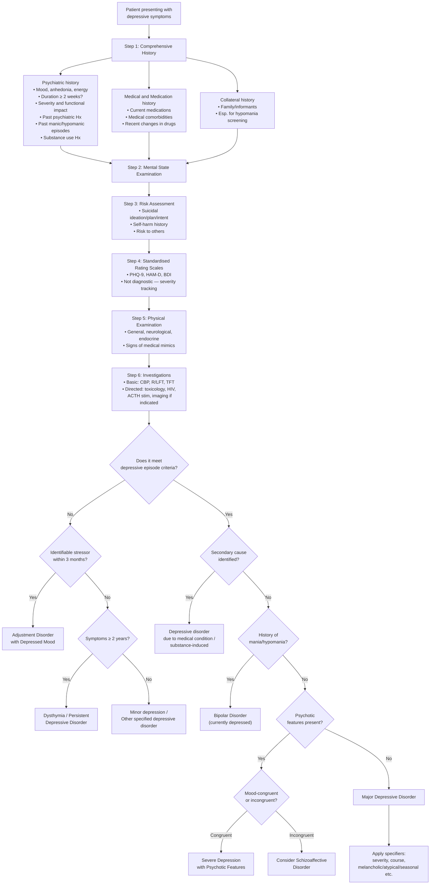
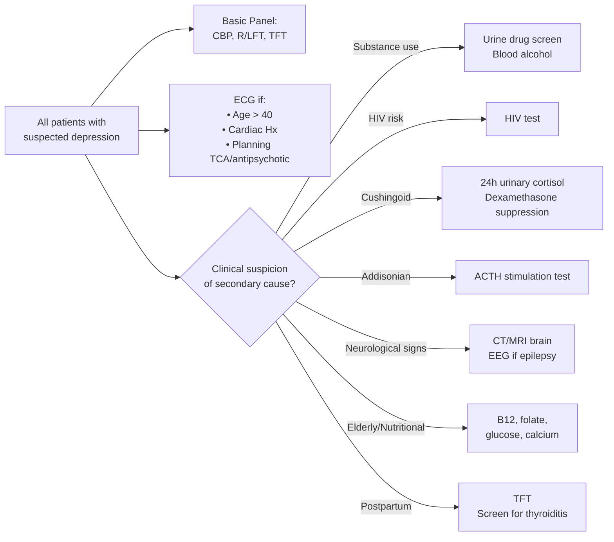

## Diagnostic Criteria for Depressive Disorders

### Why Diagnostic Criteria Matter

Depression is diagnosed **clinically** — there is no blood test, no scan, no biomarker that confirms it. The diagnostic criteria exist to ensure:
1. **Reliability** — two different doctors examining the same patient reach the same diagnosis
2. **Validity** — the diagnosis identifies a genuine illness (not normal sadness) that predicts course, treatment response, and prognosis
3. **Exclusion of mimics** — the criteria explicitly require ruling out medical, substance-related, and other psychiatric causes

Two major classification systems are used: **ICD-11** (WHO, used in Hong Kong public hospitals) and **DSM-5-TR** (APA, used widely in research and private practice). You need to know both.

---

### A. DSM-5 Criteria for Major Depressive Disorder

***Major depressive disorder*** [1]:

#### Criterion A — Symptom Criterion

***Clear-cut changes in affect, cognition, and neurovegetative functions.*** ***Five or more of the following symptoms are present during the same 2-week period and represent a change from previous functioning; at least 1 of the symptoms is either (1) or (2):*** [1]

| # | ***Symptom*** | Pathophysiological Basis | Notes |
|---|---|---|---|
| ***(1)*** | ***Depressed mood most of the day, nearly every day, as indicated by either subjective report (e.g., feels sad, empty, hopeless) or observation made by others (e.g., appears tearful)*** [1] | ↓ 5-HT and NE in limbic circuits; ↑ vmPFC activity → depressive rumination | ***In children and adolescents, can be irritable mood*** [1] |
| ***(2)*** | ***Markedly diminished interest or pleasure in all, or almost all, activities most of the day, nearly every day (as indicated by either subjective account or observation)*** [1] | ↓ DA in mesolimbic reward pathway → cannot generate pleasure response | This is anhedonia — "an" (without) + "hedone" (pleasure) |
| ***(3)*** | ***Significant weight loss when not dieting or weight gain (e.g., a change of more than 5% of body weight in a month), or decrease or increase in appetite nearly every day*** [1] | ↓ 5-HT → disrupted hypothalamic appetite regulation. In melancholic: anhedonia extends to food. In atypical: carbohydrate craving | ***In children, consider failure to make expected weight gain*** [1] |
| ***(4)*** | ***Insomnia or hypersomnia nearly every day*** [1] | ↓ 5-HT (precursor to melatonin) disrupts sleep architecture; early morning wakening = circadian phase advance | Melancholic → early morning wakening; Atypical → hypersomnia |
| ***(5)*** | ***Psychomotor agitation or retardation nearly every day (observable by others, not merely subjective feelings of restlessness or being slowed down)*** [1] | Retardation: ↓ DA in nigrostriatal pathway + ↓ dlPFC activity. Agitation: NE hyperactivity, anxiety-circuit overactivation | Must be **observable by others** — not just the patient's subjective feeling |
| ***(6)*** | ***Fatigue or loss of energy nearly every day*** [1] | ↓ NE (arousal), ↓ DA (motivation), chronic HPA axis activation → catabolic state | |
| ***(7)*** | ***Feelings of worthlessness or excessive or inappropriate guilt (which may be delusional) nearly every day (not merely self-reproach or guilt about being sick)*** [1] | ↑ vmPFC → excessive self-referential negative processing; Beck's negative view of self | Can reach delusional intensity in psychotic depression |
| ***(8)*** | ***Diminished ability to think or concentrate, or indecisiveness, nearly every day (either by subjective account or as observed by others)*** [1] | ↓ dlPFC activity → executive dysfunction | In elderly → pseudodementia |
| ***(9)*** | ***Recurrent thoughts of death (not just fear of dying), recurrent suicidal ideation without a specific plan, or a suicide attempt or a specific plan for committing suicide*** [1] | ↓ 5-HT in ventral PFC → impulsivity + aggression; hopelessness (cognitive) + psychic pain (emotional) | Ranges from passive death wishes to active plans with intent |

<Callout title="Minimum Requirement for Criterion A" type="error">
You need ≥ 5 symptoms, but at least one MUST be either (1) depressed mood or (2) anhedonia. A patient with insomnia, weight loss, fatigue, poor concentration, and guilt — but without depressed mood or anhedonia — does NOT meet criteria for MDD. Always start by establishing the presence of at least one core symptom.
</Callout>

> **Mnemonic — SIG E CAPS** (imagine prescribing "energy capsules" to a depressed patient who has none):
> - **S**leep disturbance
> - **I**nterest loss (anhedonia)
> - **G**uilt / worthlessness
> - **E**nergy loss
> - **C**oncentration impairment
> - **A**ppetite / weight change
> - **P**sychomotor changes
> - **S**uicidality

#### Criterion B — Functional Impairment

***Symptoms cause clinically significant distress or impairment in social, occupational, or other important areas of functioning.*** [1]

Why this criterion exists: To separate clinical depression from ordinary sadness. A person can feel sad for two weeks after a breakup — that's normal. It becomes a disorder when it impairs their ability to work, maintain relationships, or care for themselves.

#### Criterion C — Exclusion of Substance/Medical Cause

***The episode is not attributable to the physiological effects of a substance or to another medical condition.*** [1]

This is why we order investigations (TFTs, CBP, etc.) — you must rule out secondary causes before diagnosing primary MDD.

#### Criterion D — Exclusion of Psychotic Disorders

***Not better explained by schizoaffective disorder, schizophrenia, schizophreniform disorder, delusional disorder, or other specified and unspecified schizophrenia spectrum and other psychotic disorders.*** [1]

Why: In schizophrenia, patients can appear depressed (negative symptoms: flat affect, avolition, social withdrawal). But the primary pathology is a psychotic disorder, not a mood disorder. If psychotic symptoms occur only during mood episodes and are mood-congruent, it's severe depression with psychotic features. If psychotic symptoms occur independently of mood episodes, think schizoaffective disorder or schizophrenia.

#### Criterion E — Exclusion of Bipolarity

***Absence of previous manic or a hypomanic episode.*** [1]

This is the most commonly missed criterion. If there has EVER been a manic or hypomanic episode, the diagnosis is bipolar disorder (currently depressed), NOT MDD — even if the current presentation is purely depressive. Treatment differs dramatically (antidepressants alone in bipolar depression → risk of manic switch).

#### DSM-5 Specifiers

***Specifiers for major depressive disorder:*** [1]

| Category | ***Options*** |
|---|---|
| ***Course*** | ***Single episode, recurrent episode*** [1] |
| ***Severity*** | ***Mild, moderate, severe, with psychotic features, in partial remission, in full remission, unspecified*** [1] |
| ***Other specifiers*** | ***With anxious distress, mixed features, melancholic features, atypical features, mood-congruent psychotic features, mood-incongruent psychotic features, catatonia, peripartum onset, seasonal pattern (recurrent episode only)*** [1] |

***Key changes from DSM-IV:*** [1]
- ***Removal of the "bereavement exclusion"*** — ***depressive symptoms may be understandable/considered appropriate to significant loss (e.g., bereavement, financial ruin, losses from a natural disaster, a serious medical illness or disability)*** but if criteria are met, MDD can still be diagnosed. ***Exercise of clinical judgment based on the individual's history and the cultural norms.*** [1]
- ***Dysthymia → persistent depressive disorder (includes both chronic major depressive disorder and the previous dysthymic disorder)*** [1]
- ***Introduction of two new disorders:*** [1]
  - ***Disruptive mood dysregulation disorder: persistent irritability and frequent episodes of extreme, out-of-control behaviour in children up to age 18 years***
  - ***Premenstrual dysphoric disorder: mood symptoms occur during the final week before the onset of menses, and improve within a few days of menses***

---

### B. ICD-11 Criteria for Depressive Episode

***ICD-11 cardinal symptoms: depressed mood or diminished interest in activities occurring most of the day, nearly every day during a period lasting at least two weeks.*** [1]

***Additional symptoms: difficulty concentrating, feelings of worthlessness or excessive or inappropriate guilt, hopelessness, recurrent thoughts of death or suicide, changes in appetite or sleep, psychomotor agitation or retardation, and reduced energy or fatigue.*** [1]

### C. ICD-10 Criteria (Still Commonly Referenced in HK)

The ICD-10 system uses a two-section approach [2]:

**Section A — Core Symptoms (must have ≥ 2 for mild/moderate, all 3 for severe):**
1. Depressed mood
2. Loss of interest and enjoyment
3. Reduced energy and decreased activity

**Section B — Additional Symptoms:**
1. Reduced concentration
2. Reduced self-esteem and confidence
3. Ideas of guilt and unworthiness
4. Pessimistic thoughts
5. Ideas of self-harm
6. Disturbed sleep
7. Diminished appetite

**Severity grading** [2]:

| Severity | Section A Required | Section B Required | Minimum Total |
|---|---|---|---|
| ***Mild*** | ***≥ 2 of 3*** | ***≥ 2*** | 4 |
| ***Moderate*** | ***≥ 2 of 3*** | ***≥ 3*** | 5 |
| ***Severe*** | ***All 3*** | ***≥ 4*** | 7 |

> Severity of symptoms **and** degree of functional impairment also guide classification [2].

---

### D. DSM-5 vs ICD-10/ICD-11: Key Comparison

| Feature | DSM-5 | ICD-10 | ICD-11 |
|---|---|---|---|
| Minimum symptoms | ≥ 5 of 9 (incl. 1 core) | Variable by severity (see above) | Similar to ICD-10 with simplified structure |
| Core symptoms required | ≥ 1 of: depressed mood OR anhedonia | ≥ 2 of: depressed mood, anhedonia, anergia (for mild/moderate) | Depressed mood OR diminished interest |
| Duration | ≥ 2 weeks | ≥ 2 weeks | ≥ 2 weeks |
| Severity levels | Mild/Moderate/Severe via clinical judgment + symptom count | Formally defined by symptom count (2A+2B / 2A+3B / 3A+4B) | Mild/Moderate/Severe with more dimensional approach |
| Psychotic features | Specifier (mood-congruent/incongruent) | Separate code (F32.3) | Specifier |
| Bereavement exclusion | Removed | Never had one | Not present |

<Callout title="ICD-10 vs DSM-5 — The Practical Difference">
The ICD-10 system recognises **anergia (reduced energy)** as a separate core symptom alongside depressed mood and anhedonia. DSM-5 lists fatigue only as an associated symptom (Criterion A6). This means a patient with prominent fatigue but borderline mood/interest could meet ICD-10 criteria but not DSM-5 criteria. In Hong Kong clinical practice, know both systems but ICD codes are used for hospital documentation.
</Callout>

---

### E. Criteria for Persistent Depressive Disorder (Dysthymia)

Per DSM-5:
- Depressed mood for **most of the day, more days than not**, for **≥ 2 years** (≥ 1 year in children/adolescents)
- Presence of ≥ 2 of: poor appetite or overeating, insomnia or hypersomnia, low energy, low self-esteem, poor concentration, hopelessness
- During the 2-year period, never symptom-free for > 2 consecutive months
- Criteria for MDD may be continuously present (DSM-5 consolidated chronic MDD and dysthymia into "Persistent Depressive Disorder")
- ***May have superimposed major depressive episodes (double depression)*** [2]

---

### F. Specifier Criteria: Melancholic Features

***At least four of the following are required:*** [2]
- ***Loss of interest or pleasure in usual activities***
- ***Lack of emotional reactivity to normally pleasurable surroundings and events***
- ***Early-morning waking (2 hours or more before usual time)***
- ***Depression worse in the morning***
- ***Psychomotor agitation or retardation***
- ***Marked loss of appetite***
- ***Weight loss (5% or more of body weight in last month)***
- ***Marked loss of libido*** (ICD-10 only)
- ***Distinct quality of depressed mood*** (DSM-5 only)
- ***Excessive guilt*** (DSM-5 only)

***DSM-5 also specifically requires either 'loss of interest' or 'lack of emotional reactivity' to be present.*** [2]

***Specifiers for mood episodes*** (from bipolar lecture, equally applicable) [3]:
- ***With anxious distress***
- ***With mixed features***
- ***With rapid cycling ( > 4 episodes per year)***
- ***With melancholic features (near-complete absence of the capacity for pleasure)***
- ***With atypical features (e.g., mood reactivity, weight gain, hypersomnia)***
- ***With psychotic features***
- ***With peripartum onset (severe anxiety and even panic attacks. Risk of infanticide)***
- ***With seasonal pattern (depression begins in fall or winter and remits in spring)***

---

## Diagnostic Algorithm

### Step-by-Step Clinical Approach

---

## Investigation Modalities

### Why We Investigate

Depression is a **clinical diagnosis** — investigations do not confirm it. Instead, investigations serve three purposes:
1. **Exclude secondary causes** (medical conditions, substances)
2. **Establish baseline** before treatment (many antidepressants have metabolic/cardiac effects)
3. **Screen for neglect** (malnourished, self-neglecting patients may have nutritional deficiencies)

### A. Assessment — Clinical Tools

***Assessment:*** [1]
- ***History, including medical and medication history***
- ***Mental state examination***
- ***Use of standardised instruments***
- ***Physical examination & investigation to rule out medical conditions that may cause depressive symptoms***

#### A1. History Taking Structure

The assessment should systematically cover [2]:

| Domain | Key Elements | Why |
|---|---|---|
| **Core symptoms** | Depressed mood (pervasiveness, diurnal variation), anhedonia, anergia | Establish whether core criteria are met |
| **Biological symptoms** | Sleep (early morning wakening?), appetite/weight, libido, psychomotor changes | Distinguish melancholic vs atypical pattern; guide treatment choice |
| **Cognitive symptoms** | Concentration, self-esteem, guilt, hopelessness | Hopelessness = strongest predictor of suicide |
| **Psychotic symptoms** | Delusions (guilt, nihilistic, persecutory), hallucinations (derogatory voices) | Changes management dramatically (needs antipsychotic ± ECT) |
| **Risk assessment** | Suicidal ideation, plan, intent, access to means, protective factors | Safety first — determines level of care (outpatient vs inpatient) |
| **Past manic/hypomanic episodes** | ***Ever a period of unusually elevated mood, decreased need for sleep, grandiosity?*** | Must exclude bipolar disorder before diagnosing MDD |
| **Substance use** | Alcohol, cannabis, stimulants, prescription drug misuse | Substance-induced depression; maladaptive coping |
| **Medical/medication Hx** | Current medications, comorbid medical conditions | Secondary depression |
| **Collateral history** | From family/informants | Patients may underreport hypomania or overreport/underreport severity |

#### A2. Standardised Rating Scales

***Objective measures of severity of depression:*** [1]

| Scale | Type | Details |
|---|---|---|
| ***Hamilton Rating Scale for Depression (HAM-D)*** | Clinician-rated | 17-item, gold standard in research; scores ≥ 8 mild, ≥ 14 moderate, ≥ 23 severe |
| ***Montgomery-Åsberg Depression Rating Scale (MADRS)*** | Clinician-rated | 10-item; more sensitive to change with treatment; widely used in clinical trials |
| ***Patient Health Questionnaire-9 (PHQ-9)*** | Self-report | 9 items mapping directly to DSM-5 criteria; score 5–9 mild, 10–14 moderate, 15–19 moderately severe, ≥ 20 severe. Very commonly used in primary care |
| ***Beck Depression Inventory (BDI)*** | Self-report | 21-item; well-validated; useful for monitoring |
| ***Center for Epidemiologic Studies-Depression Scale (CES-D)*** | Self-report | 20-item; designed for epidemiological research |
| ***Special populations*** | Various | ***Geriatric Depression Scale, Cornell Scale for Depression in Dementia, Edinburgh Postnatal Depression Scale*** [1] |

<Callout title="Rating Scales Are NOT Diagnostic" type="error">
***Useful in clinical practice and research but not diagnostic. Should not be used as a substitute for a clinical diagnosis made from a thorough interview.*** [1] A PHQ-9 score of 20 does NOT automatically mean the patient has MDD — it means their symptom burden is severe and warrants a thorough clinical assessment to confirm the diagnosis.
</Callout>

### B. Physical Examination

| System | What to Look For | Why |
|---|---|---|
| **General** | Nutritional status, weight, self-care, signs of self-harm (scars on wrists/forearms) | Severity indicator; screening for neglect |
| **Endocrine** | Thyroid (goitre, tremor, skin/hair changes, bradycardia vs tachycardia), Cushingoid features (moon face, striae, buffalo hump, central obesity), Addisonian features (hyperpigmentation, hypotension) | Most common medical mimics |
| **Neurological** | Focal deficits (stroke), cogwheel rigidity/tremor (Parkinson's), cognitive screening (MMSE/MoCA for pseudodementia vs dementia), fundoscopy (papilloedema in space-occupying lesions) | Neurological secondary causes |
| **Cardiovascular** | Signs of heart failure | Chronic disease-associated depression; baseline before medications |

### C. Laboratory Investigations

***Basic investigations:*** [1]

| Investigation | ***What It Screens For*** | Key Findings and Interpretation |
|---|---|---|
| ***CBP (Complete Blood Picture)*** [1] | Anaemia, infection, macrocytosis | ↓ Hb → anaemia (fatigue mimics depression). ↑ MCV → alcoholism (B12/folate deficiency or direct toxic effect). ↑ WBC → infection (secondary depression from systemic illness) [2] |
| ***R/LFT (Renal and Liver Function Tests)*** [1] | Electrolytes, renal function, liver disease | Hyponatraemia → important as SSRI side effect (SIADH) and baseline before treatment. ↑ Ca²⁺ → hyperparathyroidism ("moans, groans, stones, psychiatric overtones"). ↑ GGT → alcoholic liver disease. Creatinine → renal dosing for medications (esp. lithium if bipolar suspected) [2] |
| ***Thyroid Function Test (TFT)*** [1] | Hypothyroidism / hyperthyroidism | ↑ TSH + ↓ fT4 = hypothyroidism → classic medical mimic of depression (fatigue, weight gain, cognitive slowing, depressed mood). ↓ TSH + ↑ fT4 = hyperthyroidism → can cause anxiety, irritability, or depression with agitation. This is the single most important screening investigation [2] |

***Other investigations if indicated by history and physical examination:*** [1]

| Investigation | ***Indication*** | Key Findings and Interpretation |
|---|---|---|
| ***Blood alcohol level*** [1] | Suspected alcohol use | Elevated → active intoxication; chronic use → CNS depression, B12/folate depletion |
| ***Blood and urine toxicology screen*** [1] | Suspected substance-induced depression | Identifies cannabis, amphetamines, cocaine, opioids, benzodiazepines [2] |
| ***HIV test*** [1] | Risk factors for HIV | HIV can cause depression directly (CNS invasion) or indirectly (psychosocial) |
| ***Cosyntropin (ACTH) stimulation test*** [1] | ***For Addison disease*** | Inadequate cortisol rise after synthetic ACTH → adrenal insufficiency |
| ***EEG*** [1] | ***For epilepsy*** | Epileptiform discharges; especially temporal lobe epilepsy → mood disturbance [2] |
| ***CT or MRI brain*** [1] | ***For organic brain syndrome or hypopituitarism*** | Space-occupying lesions, vascular lesions, demyelination (MS), atrophy patterns [2] |
| CRP/ESR [2] | Infection or inflammatory disease | Elevated → chronic inflammation, autoimmune conditions |
| Vitamin B12 and folate [2] | Nutritional deficiency (esp. in malnourished, alcoholic, or elderly patients) | ↓ B12/folate → megaloblastic anaemia + neuropsychiatric symptoms (depression, cognitive decline, peripheral neuropathy) |
| ECG [2] | Cardiac disease; baseline before treatment | Prolonged QTc → risk with TCAs and some antipsychotics. Arrhythmias → contraindication to certain medications [2] |
| Fasting glucose/HbA1c | Metabolic screening; antipsychotic/mood stabiliser baseline | Diabetes → chronic disease-associated depression; baseline before atypical antipsychotics |

### D. Directed Investigations — When to Order What

<Callout title="The Minimum Investigation Panel">
For every patient you diagnose with depression, at minimum order: **CBP, R/LFT (including calcium), TFT**. This is the exam-safe answer. Everything else is directed by clinical suspicion. The TFT is the single most important investigation — hypothyroidism is the most treatable and most commonly missed secondary cause.
</Callout>

### E. Hong Kong-Specific Suicide Risk Assessment Tool

The Hong Kong Hospital Authority uses a structured tool that scores [2]:

| Domain | Items Scored |
|---|---|
| **Depression** | Sleep disorder, anorexia/weight loss, withdrawal/loss of interest, hopelessness/helplessness, psychomotor retardation, depressed mood (0–6) |
| **Hallucination** | Derogatory, criticising, about death (0–3) |
| **Delusion** | Guilt, death, persecutory (0–3) |
| **Unstable mood** | Anxiety, panic, fear (0–3) |

Supervision levels based on total score:
- Normal (0–9)
- SO1 (10–18)
- SO2 (19–28)
- SO3 (29–41)

> The supervision level is determined by professional judgement without following the range of score exactly [2].

---

### Summary: The Diagnostic Process at a Glance

| Step | Action | Purpose |
|---|---|---|
| 1 | Comprehensive psychiatric history | Establish symptoms, duration, severity, functional impact |
| 2 | Screen for past mania/hypomania | Exclude bipolar disorder |
| 3 | Mental state examination | Objective documentation of current presentation |
| 4 | Risk assessment | Safety — suicidal ideation, plan, intent |
| 5 | Standardised rating scales (PHQ-9, HAM-D) | Quantify severity (NOT diagnostic) |
| 6 | Physical examination | Screen for medical mimics |
| 7 | Basic investigations (CBP, R/LFT, TFT) | Exclude secondary causes, establish baseline |
| 8 | Directed investigations | Based on clinical suspicion |
| 9 | Apply diagnostic criteria (DSM-5 / ICD) | Formal diagnosis with specifiers |
| 10 | Formulate using biopsychosocial framework | Predisposing / Precipitating / Perpetuating |

> **Diagnostic criteria are necessary but not sufficient** — the diagnosis of depression also requires a clinical formulation that integrates the patient's unique biological, psychological, and social factors. This is what separates a competent clinician from an algorithm.

---

<Callout title="High Yield Summary">

**DSM-5 MDD Criteria**: ≥ 5/9 symptoms for ≥ 2 weeks, including at least depressed mood OR anhedonia. Must cause functional impairment. Must exclude substance/medical causes, psychotic disorders, and bipolarity.

**ICD-10 Severity**: Mild (2A+2B), Moderate (2A+3B), Severe (3A+4B). Section A = depressed mood, anhedonia, anergia. ICD uniquely recognises anergia as core symptom.

**Key DSM-5 Changes**: Bereavement exclusion removed. Dysthymia renamed persistent depressive disorder. New disorders: disruptive mood dysregulation disorder, premenstrual dysphoric disorder.

**Specifiers to Know**: Melancholic (≥ 4 biological features, must include loss of pleasure or loss of reactivity), atypical (mood reactivity, hypersomnia, weight gain, leaden paralysis), psychotic (mood-congruent vs incongruent), peripartum, seasonal.

**Rating Scales**: PHQ-9, HAM-D, MADRS, BDI, CES-D — useful for severity tracking but NOT diagnostic. Special populations: GDS, Cornell Scale, Edinburgh Postnatal.

**Investigations**: Minimum = CBP + R/LFT + TFT. Directed = urine tox, HIV, ACTH stim test, B12/folate, CT/MRI, EEG, ECG as indicated. TFT is the single most important screening investigation.

**Algorithm**: History → MSE → Risk assessment → Rating scales → Physical exam → Basic bloods → Rule out secondary causes → Apply criteria → Specifiers → Formulate.

</Callout>

---

<ActiveRecallQuiz
  title="Active Recall - Diagnostic Criteria and Algorithm"
  items={[
    {
      question: "List the 9 DSM-5 symptom criteria for Major Depressive Disorder. Which symptom(s) MUST be present?",
      markscheme: "(1) Depressed mood, (2) Anhedonia, (3) Weight/appetite change, (4) Insomnia/hypersomnia, (5) Psychomotor agitation/retardation, (6) Fatigue/loss of energy, (7) Worthlessness/excessive guilt, (8) Diminished concentration/indecisiveness, (9) Recurrent thoughts of death/suicidal ideation. At least one of (1) depressed mood or (2) anhedonia MUST be present. Total ≥ 5 symptoms for ≥ 2 weeks."
    },
    {
      question: "What are the three exclusion criteria in DSM-5 for MDD (Criteria C, D, and E)?",
      markscheme: "C: Not attributable to physiological effects of a substance or another medical condition. D: Not better explained by schizoaffective disorder, schizophrenia, schizophreniform disorder, delusional disorder, or other psychotic disorders. E: No previous manic or hypomanic episode (which would make it bipolar disorder)."
    },
    {
      question: "How does ICD-10 grade the severity of a depressive episode? What are the Section A and Section B symptom requirements for a severe episode?",
      markscheme: "ICD-10 uses Section A (core: depressed mood, anhedonia, anergia) and Section B (additional: concentration, self-esteem, guilt, pessimism, self-harm ideas, sleep, appetite). Severe episode: ALL 3 of Section A AND at least 4 of Section B. Mild = 2A+2B, Moderate = 2A+3B."
    },
    {
      question: "Name the three basic investigations that should be ordered for every patient diagnosed with depression and explain what each screens for.",
      markscheme: "(1) CBP - screens for anaemia (fatigue mimic), raised MCV (alcoholism), infection. (2) R/LFT - hyponatraemia (SSRI side effect baseline), calcium (hyperparathyroidism), GGT (alcohol), creatinine (renal dosing). (3) TFT - hypothyroidism (most common and most important treatable secondary cause)."
    },
    {
      question: "Name three key DSM-5 changes from DSM-IV regarding depressive disorders.",
      markscheme: "(1) Removal of bereavement exclusion - grief can trigger MDD if criteria met. (2) Dysthymia renamed to Persistent Depressive Disorder (consolidates chronic MDD + dysthymia). (3) Introduction of two new disorders: Disruptive Mood Dysregulation Disorder (children, persistent irritability) and Premenstrual Dysphoric Disorder (mood symptoms in final week before menses)."
    },
    {
      question: "A patient scores 18 on the PHQ-9. Can you diagnose MDD based on this score alone? Why or why not?",
      markscheme: "No. Rating scales like PHQ-9 are useful for measuring severity of depressive symptoms but are NOT diagnostic. They should not be used as a substitute for a clinical diagnosis made from a thorough interview. A score of 18 suggests moderately severe symptoms and warrants comprehensive clinical assessment to confirm diagnosis, exclude secondary causes, and screen for bipolar disorder."
    }
  ]}
/>

## References

[1] Lecture slides: GC 164. I am depressed Mood disorders.pdf (p2, p3, p5, p6, p7, p8, p9, p10, p13, p14, p15)
[2] Senior notes: ryanho-psych.md (sections on diagnostic criteria for depressive episode, assessment, classification, clinical features, melancholic features, dysthymia, investigation workup)
[3] Lecture slides: GC 163. I am a superman Bipolar disorder.pdf (p3, p22)
