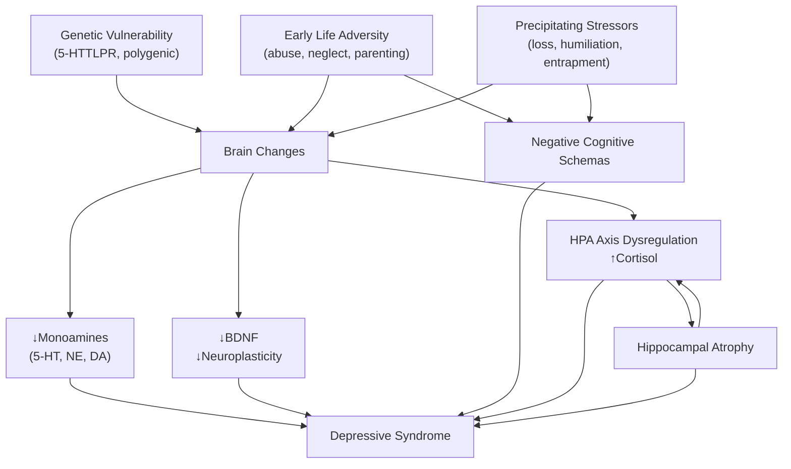

## 1. Definition

Depressive disorders are a group of psychiatric conditions characterised by persistent disturbances in mood, cognition, and neurovegetative function that cause clinically significant distress or impairment in social, occupational, or other important areas of functioning. The core psychopathology is a sustained lowering of mood that is qualitatively different from normal sadness — it is **pervasive**, **persistent**, and shows **loss of reactivity** to circumstances [1][2].

> Think of it this way: everyone feels sad after a breakup. In depressive disorder, the sadness takes on a life of its own — it doesn't lift when good things happen, it colours every waking hour, and it drags the body's biology down with it (sleep, appetite, energy, concentration).

***Depressive disorder is caused by a combination of biological, social and psychological factors, which disturb the brain's capacity for stress management.*** [1]

The term "depression" in clinical medicine is an umbrella that encompasses several diagnostic entities — the most important being **Major Depressive Disorder (MDD)** and **Persistent Depressive Disorder (Dysthymia)** — each defined by severity, duration, and pattern of symptoms.

<Callout title="Key Conceptual Point">
Depression ≠ sadness. Normal sadness is reactive (improves with positive events), self-limiting, and does not cause the full biological syndrome (sleep, appetite, psychomotor changes). A depressive episode is a syndrome — a cluster of symptoms occurring together with a minimum duration (≥ 2 weeks) and causing functional impairment.
</Callout>

---

## 2. Epidemiology

### 2.1 Global Burden

- ***4th leading cause of disability worldwide*** with approximately ***~$85 billion/year loss of productivity*** [2]
- WHO projects depression will be a top contributor to global disease burden by 2030
- Lifetime prevalence: **10–20%** globally [2]

### 2.2 Hong Kong Context

- ***2.9% prevalence in Hong Kong*** (Hong Kong Mental Morbidity Survey, HKMMS) [1][2]
- This figure likely underestimates true burden because:
  - Many patients present with **somatic complaints** (fatigue, pain, insomnia) rather than overtly reporting mood symptoms — especially in Chinese culture where psychological symptoms may be stigmatised
  - ***Minor anxiety-depressive disorders are VERY COMMONLY seen in primary care (6.9% prevalence)*** [2]
- Increasing trend over time, accelerated by urbanisation, social stressors, ageing population, and the post-pandemic mental health burden

### 2.3 Demographics

| Factor | Detail |
|---|---|
| ***Mean age of onset*** | ***~27 years*** [2] |
| ***Commonest age group*** | ***18–44 years*** [2] |
| ***Sex*** | ***↑ in females (2–3×)*** [1][2] |
| Marital status | ***↑ in divorced/separated*** [2] |
| Employment | ***↑ in unemployed*** [2] |
| Comorbidity | ***↑ co-morbidity with other disorders, especially anxiety and substance abuse*** [2] |

***Reasons for higher rates in women are uncertain. Postulated reasons include:*** [2]
1. Readiness of women to admit depressive symptoms
2. Misdiagnosis as alcohol-related disorder in men (due to higher rates of comorbid alcohol abuse)
3. Social disadvantages in women
4. ***Female hormones sensitise the brain to effects of stress***

### 2.4 Non-Psychiatric Impact of Depression

This is a crucial teaching point that students often overlook:

- ***↑ Morbidity***: associated with ***↓ birth weight, chronic medical illness, poor self-perceived health, functional/cognitive impairment*** [2]
- ***↑ Mortality***: ***RR 1.2–4.0× non-suicide mortality*** [2]
  - This may be due to: (1) behavioural risk factors (poor treatment adherence, inactivity, ↑ alcohol consumption); (2) biological risk factors (altered thrombogenesis, HPA axis dysfunction); (3) subclinical or prevalent cardiovascular disease [2]

<Callout title="Depression Kills — Not Just Through Suicide" type="error">
Students often think depression's mortality risk is entirely from suicide. In reality, the non-suicide mortality is also significantly elevated (RR 1.2–4.0×), primarily through cardiovascular disease. Depression is an independent risk factor for MI and stroke. Always screen depressed patients for cardiovascular risk and vice versa.
</Callout>

### 2.5 Dysthymia Epidemiology

- ***Lifetime risk ~4%, higher in women and divorced*** [2]
- Usual onset in early adulthood and may last throughout life → ***'depressive personality'*** [2]

### 2.6 Youth Depression

- ***Much less common in childhood ( < 1%, M:F ≈ 1:1)*** [2]
- ***Increases drastically after puberty (1-year prevalence 4%, F > M ≈ 2:1)*** [2]
- ***~25% of bipolar affective disorder first presents as juvenile depression in their first episode*** [2]

---

## 3. Risk Factors

Think of risk factors using the **biopsychosocial model** and the **predisposing–precipitating–perpetuating** framework:

### 3.1 Predisposing Factors

#### Biological / Genetic
- ***Genetic factors: a threefold increase in risk of depression among first-degree relatives compared to the general population*** [1]
- ***37% heritability*** from twin studies (50% MZ concordance — lower than schizophrenia and bipolar) [2]
- ***Probably multiple genes with small individual effects and complex gene-environment interactions*** [2]
- ***Candidate gene includes the serotonin transporter*** (5-HTTLPR variant) [1][2]
  - The 5-HTTLPR short allele is associated with increased vulnerability to depression **in the presence of adversity** — a classic gene × environment interaction
  - In youth: ***5-HTTLPR variant is associated with early onset depression in the presence of adversities*** [2]

#### Personality
- ***Neuroticism*** — shown to be associated with depression and may represent a milder form of disease [2]
- ***Personality disorders*** (e.g., borderline, obsessive-compulsive) [2]
- ***Sociotropy*** — ***a strong need for approval from peers*** [1][2]

#### Early Life Adversities
- ***Parental separation*** [1]
- ***Physical and sexual abuse*** [1]
- ***Non-caring or overprotective parenting styles*** [1]
- Childhood neglect [2]

#### Chronic Stressors
- ***Lack of supportive networks, poorly functioning relationships, and poor social integration*** [1]
- ***Not having employment outside home, raising young children*** [2]

### 3.2 Precipitating Factors

- ***Stress and trauma: long-term difficulties, recent life events*** [1]
- ***Especially common in losses*** (bereavement, breakup), ***entrapment and humiliation*** (bullying) [1][2]
- ***↑ 6× risk of adverse life events before onset of MDD*** [2]
- ***Less important in established melancholic depression and strong family history*** (? ↓ threshold for spontaneous episodes) [2]
- ***Medical illnesses*** can act as ***non-specific stressors*** or cause depression via ***physiological mechanisms*** (e.g., Cushing's disease, puerperium, hypothyroidism) [2]

### 3.3 Perpetuating Factors

- Ongoing social adversity
- Comorbid substance use
- Untreated anxiety
- Cognitive distortions (see below)
- Poor medication adherence
- Persistent medical illness

---

## 4. Anatomy and Function (Relevant Neuroanatomy)

Understanding the neuroanatomy helps you understand *why* certain symptoms occur and *how* treatments work.

### 4.1 Key Brain Regions

| Region | Normal Function | Abnormality in Depression | Clinical Correlate |
|---|---|---|---|
| ***Subgenual prefrontal cortex*** | Emotional regulation, reward processing | ***Volume reduction and decreased quantity of glial cells*** [1] | Anhedonia, emotional dysregulation |
| ***Ventromedial prefrontal cortex (vmPFC)*** | Emotional/social regulatory functions | ***↑ activity*** [2] | ***↑ sensitivity to pain, anxiety, depressive ruminations, tension*** [2] |
| ***Dorsolateral prefrontal cortex (dlPFC)*** | Executive functions (planning, working memory) | ***↓ activity*** [2] | ***Psychomotor retardation, apathy, deficits in attention/working memory*** [2] |
| ***Hippocampus*** | Memory consolidation, stress regulation (negative feedback on HPA axis) | ***Reduced size*** [1]; ***Volume ↓*** — both predisposing factor and consequence of depression [2] | Cognitive impairment, inability to terminate cortisol stress response |
| ***Amygdala*** | Emotional processing, fear conditioning | ↑ activity and ↑ connectivity with cortical regions | Heightened negative emotional responses |
| ***Anterior cingulate cortex (ACC)*** | Conflict monitoring, emotional regulation | ***Connectivity between amygdala and ACC → ↓ inhibitory action in emotional regulation*** [2] | Inability to suppress negative emotions |

### 4.2 The Monoamine Systems and the Reticular Activating System (RAS)

***Neurones releasing monoamines belong to the reticular activating system (RAS) → regulates global behavioural states or functions:*** [2]

| Monoamine | Origin | Functions Regulated | Relevance to Depression |
|---|---|---|---|
| ***Serotonin (5-HT)*** | Raphe nuclei (brainstem) | ***Body temperature, sleep/wakefulness, mood, impulse control*** [1] | ***Low level of serotonin metabolites in the brains of suicide decedents and spinal fluids of depressed patients*** [1] |
| ***Norepinephrine (NE)*** | Locus coeruleus | ***Mood and anxiety levels*** [1] | ***Mood symptoms emerged among patients who took propranolol*** [1] |
| ***Dopamine (DA)*** | Ventral tegmental area (VTA) → mesolimbic pathway | ***Motor and mental activity, attention, motivation*** [1] | ***Dopaminergic neurons in the mesolimbic reward pathway play an important role in motivation, reinforcement, and the pleasure response — diminished in brains of suicidal decedents with depression*** [1] |

***Besides monoamines, abnormalities in glutamate, GABA, and substance P have been detected in patients with depression.*** [1]

---

## 5. Etiology and Pathophysiology

***The pathophysiology of depression remains largely unknown. Several mechanisms have been proposed.*** [1]

### 5.1 Biological Hypotheses

#### 5.1.1 The Classical Monoamine Hypothesis

***Classical "serotonin hypothesis": diminished activity of serotonin pathways plays a causal role in the pathophysiology of depression.*** [1]

Supporting evidence:
- ***Antihypertensive drug reserpine, which depleted monoamine, produced a depressive state*** [1]
- ***Diminished monoaminergic activity was detected in the brains of decedents of suicide and the bodily fluids of people with depression*** [1]
- Antidepressants that increase synaptic monoamines (SSRIs, SNRIs, TCAs, MAOIs) are clinically effective

Limitations:
- ***Evidence suggests that the cause of depression is far more complicated than a reduced level of serotonin*** [1]
- Monoamine depletion in healthy volunteers does NOT reliably produce depression
- Antidepressants increase synaptic monoamines within hours, yet clinical effect takes 2–4 weeks → there must be downstream changes (e.g., receptor sensitivity, neuroplasticity)
- ***Traditionally believed to be the sole underlying abnormality but now thought NOT to be able to explain entire picture of depression → likely other factors also play a role*** [2]

> **Bottom line**: The monoamine hypothesis was a useful starting point — it explains why antidepressants work — but depression is much more than just "low serotonin." Think of monoamines as the *initial domino* in a cascade involving neuroplasticity, neuroendocrine regulation, and neural circuit dysfunction.

#### 5.1.2 Structural Brain Changes

***Volume reduction and decreased quantity of glial cells in subgenual cortex, reduced hippocampal size*** [1]

- Hippocampal atrophy is thought to result from chronic cortisol exposure (glucocorticoid neurotoxicity) → impairs neurogenesis in the dentate gyrus
- This creates a vicious cycle: smaller hippocampus → less negative feedback on HPA axis → more cortisol → further atrophy
- In youth: ***cortisol-induced atrophic changes in hippocampus → ↓ 5-HT neurotransmission*** [2]

#### 5.1.3 Hormonal / Neuroendocrine Changes

***Hormonal changes: dysregulation of hypothalamic-pituitary-adrenal (HPA) axis*** [1]

| Hormonal Abnormality | Mechanism | Clinical Relevance |
|---|---|---|
| ***HPA axis dysregulation*** | Chronic stress → ↑ CRH → ↑ ACTH → ↑ cortisol; impaired negative feedback | Hypercortisolaemia → hippocampal damage, impaired neuroplasticity |
| ***Lower estradiol (in women) and testosterone (in men)*** [1] | Gonadal hormones modulate serotonin and BDNF | Explains perimenopausal depression and sex differences |
| ***Decreased triiodothyronine (T3) and thyroid stimulating hormone (TSH)*** [1] | Thyroid hormones modulate monoamine turnover and neuronal metabolism | Subclinical hypothyroidism mimics/worsens depression; T3 augmentation in treatment-resistant depression |
| ***Diminished BDNF (brain-derived neurotrophic factor) level*** [1] | BDNF promotes neuronal survival, growth, and synaptic plasticity | Low BDNF → impaired neuroplasticity → inability to adapt to stress; antidepressants ↑ BDNF |

<Callout title="The Neuroplasticity Model — The Modern Understanding">
The most current understanding integrates the monoamine hypothesis with a **neuroplasticity model**: chronic stress → HPA axis dysregulation → ↑ cortisol → ↓ BDNF → impaired hippocampal neurogenesis and synaptic plasticity → depression. Effective antidepressants (including SSRIs, ketamine) ultimately work by restoring neuroplasticity, not merely by "increasing serotonin." This explains the 2–4 week lag in SSRI effect — it takes time for downstream neuroplastic changes to occur.
</Callout>

### 5.2 Psychosocial Hypotheses

#### 5.2.1 Cognitive Theory (Aaron Beck)

***Cognitive theory: cognitive distortions*** are prominent in depression and are the targets of CBT [1][2]:

| Cognitive Distortion | Chinese | Definition | Example |
|---|---|---|---|
| ***Selective abstraction*** | ***斷章取義*** | ***Focusing on a detail and ignoring more important features of a situation*** [1] | A student gets 9/10 on an exam but fixates on the one mark lost |
| ***Overgeneralisation*** | ***以偏概全*** | ***Drawing a general conclusion on the basis of a single incident*** [1] | "I failed this exam, therefore I will fail everything" |
| ***Personalisation*** | ***過度自責*** | ***Relating external events to oneself in an unwarranted way*** [1] | "My friend didn't text back — it must be because I'm boring" |
| ***Arbitrary inference*** | ***妄下判斷*** | ***Drawing a conclusion when there is no evidence for it and even some evidence against it*** [1] | "My boss didn't smile at me — I'm going to be fired" |

Beck's Cognitive Triad — the depressed patient has negative views of:
1. **Self** ("I am worthless")
2. **World** ("Everything is terrible")
3. **Future** ("Nothing will ever get better")

These **negative schemas** are formed in early life (often from adverse experiences) and are activated by stressful events, producing automatic negative thoughts → depressive symptoms.

#### 5.2.2 Psychoanalytic Theory

***Psychoanalytical theory: loss of an 'object', insecure attachments*** [1]
- Freud proposed that depression arises from ambivalent feelings towards a lost object (person, relationship), with anger turned inward against the self
- Bowlby's attachment theory: insecure attachment in childhood → vulnerability to depression upon loss

#### 5.2.3 Learned Helplessness (Seligman)

- When an individual repeatedly experiences uncontrollable negative events, they develop a belief that they cannot influence outcomes → passivity, hopelessness, depressive symptoms
- This maps onto the clinical feature of **hopelessness** — the strongest predictor of suicidal ideation

### 5.3 Integrated Biopsychosocial Model

---

## 6. Classification

### 6.1 Overall Taxonomy

The DSM-5-TR and ICD-11 classify depressive disorders as follows:

| DSM-5-TR | ICD-11 |
|---|---|
| Major Depressive Disorder (single/recurrent) | Single episode depressive disorder / Recurrent depressive disorder |
| Persistent Depressive Disorder (Dysthymia) | Dysthymic disorder |
| Disruptive Mood Dysregulation Disorder | (No direct equivalent) |
| Premenstrual Dysphoric Disorder | Premenstrual dysphoric disorder (under reproductive) |
| Substance/Medication-Induced Depressive Disorder | Depressive disorder due to substance or medication |
| Depressive Disorder Due to Another Medical Condition | Depressive disorder due to medical condition |
| Other Specified / Unspecified Depressive Disorder | Other specified / Unspecified depressive disorder |

### 6.2 Classification by Descriptive Features [2]

Depression can be characterised along multiple dimensions:

| Dimension | Subtypes | Key Features |
|---|---|---|
| **Severity** | Mild / Moderate / Severe / Severe with psychotic features | Defined by symptom count + functional impairment |
| **Episode pattern** | Single episode / Recurrent / Chronic (persistent) | Recurrent = ≥ 2 episodes with ≥ 2 months remission between |
| **Symptom profile** | Somatic (melancholic) / Atypical / Psychotic / Catatonic | Different biology and treatment implications |
| **Timing** | ***Seasonal pattern (SAD)***: ***onset in autumn/winter, recovery in spring/summer*** [2] | Related to daylight duration; light therapy is treatment |
| | ***Recurrent brief***: ***recurrent episodes of 2–7 days occurring once a month*** [2] | |
| | Peripartum onset | Within 4 weeks of delivery (DSM-5) or 6 weeks (ICD) |

### 6.3 ICD-10/ICD-11 Severity Grading

***ICD classification of depressive episode severity*** [2]:

| Severity | Section A Symptoms (Core) Required | Section B Symptoms (Additional) Required |
|---|---|---|
| ***Mild*** | ***At least 2 of A*** | ***At least 2 of B*** |
| ***Moderate*** | ***At least 2 of A*** | ***At least 3 of B*** |
| ***Severe*** | ***All 3 of A*** | ***At least 4 of B*** |

**Section A (Core symptoms):**
1. ***Depressed mood***
2. ***Loss of interest and enjoyment***
3. ***Reduced energy and decreased activity***

**Section B (Additional symptoms):**
1. ***Reduced concentration***
2. ***Reduced self-esteem and confidence***
3. ***Ideas of guilt and unworthiness***
4. ***Pessimistic thoughts***
5. ***Ideas of self-harm***
6. ***Disturbed sleep***
7. ***Diminished appetite***

***ICD-11 cardinal symptoms: depressed mood or diminished interest in activities occurring most of the day, nearly every day during a period lasting at least two weeks.*** [1]

***Additional symptoms (ICD-11): difficulty concentrating, feelings of worthlessness or excessive or inappropriate guilt, hopelessness, recurrent thoughts of death or suicide, changes in appetite or sleep, psychomotor agitation or retardation, and reduced energy or fatigue.*** [1]

### 6.4 Somatic (Melancholic) Features

This is a clinically important specifier:

***Clinical features of depression with 'somatic' or 'melancholic' features:*** [2]
- ***Loss of interest or pleasure in usual activities***
- ***Lack of emotional reactivity to normally pleasurable surroundings and events***
- ***Early-morning waking (2 hours or more before usual time)***
- ***Depression worse in the morning***
- ***Psychomotor agitation or retardation***
- ***Marked loss of appetite***
- ***Weight loss (5% or more of body weight in last month)***
- ***Marked loss of libido*** (ICD-10 only)
- ***Distinct quality of depressed mood*** (DSM-5 only)
- ***Excessive guilt*** (DSM-5 only)

***At least four of these symptoms are required*** to diagnose depression "with somatic features" (ICD-10) or "with melancholic features" (DSM-5). ***DSM-5 also specifically requires either 'loss of interest' or 'lack of emotional reactivity' to be present.*** [2]

***Clinical relevance of melancholic depression:*** [2]
- ***↑ neurobiological abnormalities + ↑ family history***
- ***↑ severity of symptomatology***
- ***↓ response to placebo and ↑ response to TCA than SSRI***

### 6.5 Atypical Features

The opposite pattern to melancholic depression:

| Feature | Description | Pathophysiology |
|---|---|---|
| **Mood reactivity** | Mood improves in response to positive events | Preserved hedonic capacity |
| **Reversed vegetative symptoms** | Hypersomnia (not insomnia), hyperphagia with weight gain | ? Altered serotonergic regulation of appetite/sleep |
| **Leaden paralysis** | Heavy, leaden feeling in arms/legs | ? Related to psychomotor changes |
| **Rejection sensitivity** | Long-standing pattern of interpersonal rejection sensitivity | Overlaps with personality features |

- More common in younger patients, earlier age of onset
- Better response to MAOIs and SSRIs than TCAs (opposite to melancholic)

### 6.6 Psychotic Features

- Occur in severe depression
- Delusions and hallucinations can be:
  - **Mood-congruent**: themes of guilt, worthlessness, nihilism, disease, death, deserved punishment (e.g., Cotard's syndrome — belief that one is dead or organs are rotting)
  - **Mood-incongruent**: persecutory, referential (less common; raises differential of schizoaffective disorder)
- Important to distinguish from schizoaffective disorder where psychotic symptoms occur *outside* mood episodes

### 6.7 Dysthymia (Persistent Depressive Disorder) [2]

- ***Persistent depressive symptoms NOT meeting criteria for major depressive episode, lasting ≥ 2 years***
- ***Usual onset in early adulthood and may last throughout life → 'depressive personality'***
- ***May be associated with superimposed major depressive episodes (double depression)***

### 6.8 Minor Anxiety-Depressive (Affective) Disorders [2]

- ***Mild depression often co-exists with and could not be separated from anxiety disorders***
- ***VERY COMMONLY seen in primary care (6.9% prevalence)***
- ***Clinical features: commonly present with prominent somatic symptoms to healthcare***
  - ***Mood symptoms: anxiety, depression, irritability***
  - ***Somatic symptoms: fatigue, insomnia, somatic symptoms and bodily preoccupation***
  - ***Cognitive symptoms: poor concentration***
- ***May be associated with disabling difficulties in personal and occupational function***

---

## 7. Clinical Features

### Approach to Clinical Features

The clinical features of depression can be organised into the mnemonic **SIG E CAPS** (think of it as a doctor writing a prescription — "Sig: Energy Capsules" — for a depressed patient who has no energy):

- **S**leep disturbance
- **I**nterest loss (anhedonia)
- **G**uilt / worthlessness
- **E**nergy loss
- **C**oncentration impairment
- **A**ppetite / weight change
- **P**sychomotor changes
- **S**uicidality

But let's organise more systematically:

### 7.1 Core Symptoms (Section A — ICD)

#### 7.1.1 Depressed Mood

***Depressed mood:*** [2]
- ***Differs from ordinary sadness: miserable, dejected, 'down in the dumps'***
- ***Pervasive: covers most period of the day***
- ***Loss of reactivity: loss of normal ups and downs in response to circumstances***
- ***Morning dysphoria: characteristically worse in the morning*** (one of the 'biologic'/melancholic symptoms)

**Pathophysiology**: ↓ serotonin and norepinephrine in limbic circuits (especially vmPFC and amygdala) → inability to generate positive emotional states and inability to suppress negative emotional processing. The morning worsening correlates with the cortisol awakening response — in depression, the HPA axis is dysregulated with abnormal diurnal cortisol patterns, and cortisol peaks more sharply in the morning.

In children: may manifest as **irritable mood** rather than sadness [2]

#### 7.1.2 Anhedonia (Loss of Interest and Enjoyment)

***Anhedonia: lack of interest and enjoyment*** [2]
- ***Loss of ability to derive pleasure from activities that were formerly enjoyed***
- ***Associated with social withdrawal***

**Pathophysiology**: ***Dopaminergic neurons in the mesolimbic reward pathway play an important role in motivation, reinforcement, and the pleasure response. However, they are diminished in the brains of suicidal decedents with depression*** [1]. The mesolimbic pathway (VTA → nucleus accumbens) is the brain's reward circuit. When this circuit is hypoactive, the patient cannot experience pleasure — "anhedonia" literally means "an" (without) + "hedone" (pleasure).

#### 7.1.3 Anergia (Reduced Energy)

***Anergia: lack of energy or ↑ fatigability on minimal exertion → ↓ activity*** [2]

**Pathophysiology**: Norepinephrine is the primary neurotransmitter for arousal and energy. ↓ NE in the dlPFC and general cortical projections → reduced drive and stamina. ↓ Dopamine in the mesolimbic pathway also contributes to reduced motivation and initiation of activity. Additionally, chronic HPA axis activation with elevated cortisol leads to catabolic states and perceived fatigue.

### 7.2 Biological (Somatic / Melancholic) Symptoms (Section B and Beyond)

#### 7.2.1 Sleep Disturbances

***Sleep disturbances:*** [2]
- ***Most classically early morning wakening*** (waking ≥ 2 hours before usual time and unable to get back to sleep — a hallmark of melancholic depression)
- Initial insomnia (difficulty falling asleep — more common when anxiety is comorbid)
- Middle insomnia (frequent nocturnal awakenings)
- Hypersomnia (in atypical depression)

**Pathophysiology**: Serotonin is the precursor to melatonin (5-HT → N-acetyl-5-HT → melatonin via the pineal gland). ***Serotonin affects body temperature, and regulates sleep and wakefulness*** [1]. ↓ 5-HT disrupts sleep architecture. Depressed patients show:
- ↓ Slow-wave sleep (deep, restorative sleep)
- ↓ REM latency (entering REM too quickly — within ~45 min instead of ~90 min)
- ↑ REM density (more intense REM periods)

Early morning wakening is thought to reflect a **phase advance** of circadian rhythms — the internal clock shifts earlier, so the patient's "morning" comes at 3–4 AM.

#### 7.2.2 Appetite and Weight Changes

- ***Marked loss of appetite*** with ***weight loss (5% or more of body weight in last month)*** — in melancholic depression [2]
- Increased appetite with weight gain — in atypical depression (especially carbohydrate craving)

**Pathophysiology**: Serotonin and norepinephrine regulate hypothalamic appetite centres. 5-HT normally promotes satiety; ↓ 5-HT can paradoxically cause either appetite loss (via associated nausea/dysphoria) or appetite increase (via loss of satiety signals). In melancholic depression, the profound anhedonia extends to food — eating is no longer pleasurable. The cortisol excess also contributes to catabolic effects.

#### 7.2.3 Psychomotor Changes

- **Psychomotor retardation**: slowed movements, slow speech (↑ latency to respond), reduced gestures, monotonous voice, shuffling gait
- **Psychomotor agitation**: restlessness, hand-wringing, pacing, inability to sit still, pulling at clothes/hair

**Pathophysiology**: ***Psychomotor retardation, apathy, deficits in attention/working memory*** are linked to ***↓ activity in dorsolateral prefrontal cortex*** [2]. Dopamine deficiency in the nigrostriatal pathway also contributes to motor slowing (similar mechanism to Parkinson's disease, which is also associated with depression in ~40% of cases). Psychomotor agitation may reflect noradrenergic hyperactivity or anxiety-circuit overactivation.

#### 7.2.4 Loss of Libido

***Marked loss of libido*** [2]

**Pathophysiology**: Multifactorial — ↓ dopamine (pleasure/reward), ↓ testosterone/estradiol (noted in depression), and ↓ norepinephrine (arousal) all contribute. Additionally, the general anhedonia and fatigue make sexual activity undesirable.

### 7.3 Cognitive Symptoms

#### 7.3.1 Poor Concentration and Indecisiveness

***Reduced concentration*** and difficulty making decisions [1]

**Pathophysiology**: ***↓ activity in dorsolateral prefrontal cortex → deficits in attention/working memory*** [2]. The dlPFC is the "CEO of the brain" — responsible for executive functions. When it is hypoactive, patients cannot maintain attention, process information efficiently, or make decisions. This is sometimes called "pseudodementia" in elderly patients — it looks like dementia but reverses with treatment of depression.

#### 7.3.2 Low Self-Esteem and Worthlessness

***Reduced self-esteem and confidence*** [2]
***Ideas of guilt and unworthiness*** — in severe cases, may reach delusional intensity (e.g., believing they have committed unforgivable sins)

**Pathophysiology**: Linked to the cognitive distortions described by Beck — negative view of self. Neurobiologically, ***↑ activity in ventromedial prefrontal cortex → depressive ruminations*** [2] — the vmPFC is overactive, generating excessive self-referential negative processing.

#### 7.3.3 Hopelessness and Pessimistic Thoughts

***Pessimistic thoughts*** and ***hopelessness*** [1][2]

**Pathophysiology**: Learned helplessness model (Seligman) — repeated uncontrollable adversity leads to belief that one cannot influence outcomes. Neurobiologically, disrupted reward circuitry means the patient cannot generate positive expectancy for the future.

> **Clinical Pearl**: Hopelessness is the single strongest predictor of suicidal behaviour. Always ask about it specifically: "Do you feel that things will never get better?"

#### 7.3.4 Suicidal Ideation

***Recurrent thoughts of death or suicide*** [1]
***Ideas of self-harm*** [2]

This ranges from passive death wishes ("I wish I wouldn't wake up") to active suicidal ideation with plan and intent. Always assess:
- **Frequency** of thoughts
- **Plan** (how?)
- **Access to means** (especially lethal means)
- **Intent** (do they intend to act?)
- **Protective factors** (reasons to live, family, religion)

**Pathophysiology**: Serotonin deficiency (particularly in the ventral PFC) is associated with impulsivity and aggression, including self-directed aggression. The combination of hopelessness (cognitive) + impulsivity (serotonergic) + psychic pain (emotional) creates the highest risk.

### 7.4 Psychotic Features (in Severe Depression)

When depression reaches its most severe form, **psychotic features** can emerge:

- **Mood-congruent delusions**: nihilistic (Cotard's syndrome), guilt, poverty, somatic (believing organs are rotting), deserved punishment
- **Mood-congruent hallucinations**: second-person auditory hallucinations — derogatory voices ("You're worthless," "You should kill yourself")
- Less commonly: mood-incongruent psychotic features (raises concern for schizoaffective disorder)

**Pathophysiology**: In severe depression, the combination of extreme cortisol elevation, dopaminergic dysregulation, and profound cognitive distortions can push perceptual and interpretive processes beyond the threshold for reality testing → frank psychosis.

### 7.5 Anxiety Features

- Very commonly co-occurs (up to 70% comorbidity) [2]
- Generalised worry, tension, restlessness, autonomic symptoms
- The DSM-5 "anxious distress" specifier recognises this overlap

### 7.6 Somatic Presentations (Especially Important in Hong Kong / Chinese Populations)

***Commonly present with prominent somatic symptoms to healthcare*** [2]:
- Unexplained headaches, chest pain, abdominal pain, back pain
- Fatigue, dizziness
- Palpitations
- Gastrointestinal disturbance

**Pathophysiology**: This is partly cultural (somatisation — expressing emotional distress through physical complaints is more socially acceptable in some cultures) and partly neurobiological (the monoamine systems regulate pain perception — ↓ 5-HT and NE lower the pain threshold, making normal bodily sensations feel uncomfortable). ***↑ activity in vmPFC → ↑ sensitivity to pain*** [2].

### 7.7 Features in Special Populations

#### Youth Depression [2]

- ***Adolescence: tends to be in most ways similar to adults***
- ***Childhood: may have difficulty expressing sadness*** and is associated with:
  - ***Somatic complaints*** (unexplained abdominal pains, headache, anorexia, enuresis)
  - ***Irritable mood and anxiety features***
  - ***Behavioural problems*** (e.g., one case tried to steal a bus because of frustration at home, take cannabis to lift mood)
- ***Common comorbidities: 70% has anxiety disorder, conduct disorder, substance abuse, dysthymia***
- ***Cognitive features: negative cognitive style, lack of social confidence, perfectionist traits***

### 7.8 Signs on Mental State Examination (MSE)

| MSE Domain | Findings | Pathophysiological Basis |
|---|---|---|
| **Appearance** | Poor self-care, unkempt, weight loss, tearful, downcast gaze, psychomotor retardation or agitation | Anergia → unable to maintain grooming; anhedonia → don't care about appearance |
| **Behaviour** | Slow movements, reduced gestures, poor eye contact, hand-wringing (if agitated) | ↓ dlPFC activity, ↓ DA in nigrostriatal pathway |
| **Speech** | Slow, monotonous, low volume, ↑ latency to respond, poverty of content | ↓ NE/DA → reduced arousal and motivation |
| **Mood** | "Low," "depressed," "empty," "numb" (subjective) | Core symptom |
| **Affect** | Flat, restricted, tearful, congruently depressed | Reduced emotional range due to reward circuit dysfunction |
| **Thought content** | Guilt, worthlessness, hopelessness, suicidal ideation, nihilism; delusions if psychotic | Cognitive distortions; in psychotic depression → delusional intensity |
| **Thought form** | Slow, impoverished | Psychomotor retardation extends to thinking |
| **Perception** | Auditory hallucinations (derogatory) in psychotic depression | Severe dopaminergic dysregulation |
| **Cognition** | ↓ Concentration, ↓ attention, "pseudodementia" in elderly | ↓ dlPFC function |
| **Insight** | Variable — may be preserved ("I know I'm depressed") or poor in severe/psychotic cases | |

### 7.9 Summary Table: Linking Symptoms to Neurotransmitters

| Neurotransmitter System | Associated Symptoms When Deficient |
|---|---|
| **Serotonin (5-HT)** | Depressed mood, anxiety, irritability, impulsivity, insomnia, appetite changes, pain sensitivity, suicidality |
| **Norepinephrine (NE)** | Fatigue, anergia, poor concentration, psychomotor retardation, apathy |
| **Dopamine (DA)** | Anhedonia, loss of motivation, psychomotor retardation, loss of libido |

> This table is important because it helps you understand **why different antidepressants target different symptoms**: SSRIs (serotonin) for mood/anxiety/impulsivity, SNRIs (serotonin + NE) for mood + energy/concentration, Bupropion (NE + DA) for anhedonia/fatigue/motivation, TCAs (broad monoamine) for melancholic depression.

---

<Callout title="High Yield Summary">

**Definition**: Depressive disorders = persistent mood disturbance (≥ 2 weeks) with cognitive and neurovegetative symptoms causing functional impairment; qualitatively different from normal sadness (pervasive, loss of reactivity).

**Epidemiology**: HK prevalence 2.9%; lifetime 10–20%; F:M = 2–3:1; mean onset ~27y; ↑ in divorced, unemployed; ↑ non-suicide mortality RR 1.2–4.0×.

**Aetiology**: Biopsychosocial — genetic (37% heritability, 5-HTTLPR), early adversity, cognitive distortions (Beck's triad), monoamine deficiency (5-HT, NE, DA) + HPA axis dysregulation + ↓ BDNF/neuroplasticity. **Pathophysiology remains largely unknown** but current model integrates monoamines → neuroplasticity → circuit dysfunction.

**Key Brain Regions**: ↑ vmPFC (rumination, pain sensitivity), ↓ dlPFC (psychomotor retardation, cognitive deficits), ↓ hippocampal volume (memory, HPA feedback failure), ↓ mesolimbic DA (anhedonia).

**Classification**: MDD (single/recurrent), Dysthymia (≥ 2y subthreshold), specifiers (melancholic vs atypical vs psychotic vs seasonal). ICD severity: Mild (2A+2B), Moderate (2A+3B), Severe (3A+4B).

**Core Symptoms**: Depressed mood + anhedonia + anergia. **Biological symptoms**: sleep disturbance (classically early morning wakening), appetite/weight change, psychomotor changes, loss of libido. **Cognitive symptoms**: poor concentration, worthlessness/guilt, hopelessness, suicidal ideation.

**Melancholic features**: loss of reactivity, early morning wakening, morning worsening, psychomotor changes, ↑ response to TCA, ↑ neurobiological basis.

**In HK/Chinese populations**: prominent somatic presentations. **In youth**: irritability > sadness, somatic complaints, behavioural problems.

</Callout>

---

<ActiveRecallQuiz
  title="Active Recall - Depressive Disorders (Definition to Clinical Features)"
  items={[
    {
      question: "Name the three core (Section A) symptoms of depression in ICD-10/11 and the minimum duration required for a depressive episode.",
      markscheme: "(1) Depressed mood, (2) Loss of interest and enjoyment (anhedonia), (3) Reduced energy and decreased activity (anergia). Minimum duration: at least 2 weeks, occurring most of the day, nearly every day."
    },
    {
      question: "What is the monoamine hypothesis of depression? Name two key limitations of this hypothesis.",
      markscheme: "Monoamine hypothesis: depression is due to deficiency in monoamine neurotransmitters (serotonin, norepinephrine, dopamine). Limitations: (1) Monoamine depletion in healthy volunteers does not reliably cause depression; (2) Antidepressants increase monoamines within hours but clinical effect takes 2-4 weeks, suggesting downstream changes (neuroplasticity) are the true mechanism."
    },
    {
      question: "List the four cognitive distortions described in Beck's cognitive theory of depression with their Chinese translations.",
      markscheme: "Selective abstraction (斷章取義), Overgeneralisation (以偏概全), Personalisation (過度自責), Arbitrary inference (妄下判斷)."
    },
    {
      question: "Explain why depression is associated with early morning wakening. Which brain region's dysfunction contributes to the depressive ruminations?",
      markscheme: "Early morning wakening is due to phase advance of circadian rhythms - the internal clock shifts earlier. Serotonin (precursor to melatonin) deficiency disrupts sleep architecture with decreased slow-wave sleep, decreased REM latency, increased REM density. Depressive ruminations are associated with increased activity in the ventromedial prefrontal cortex (vmPFC)."
    },
    {
      question: "What is the ICD severity classification for a severe depressive episode in terms of Section A and B symptom counts?",
      markscheme: "Severe depressive episode requires ALL 3 of Section A symptoms (depressed mood, anhedonia, anergia) AND at least 4 of Section B symptoms (concentration, self-esteem, guilt, pessimism, self-harm ideas, sleep, appetite). Functional impairment also guides classification."
    },
    {
      question: "A depressed patient presents with hypersomnia, weight gain, mood reactivity, and leaden paralysis. What subtype of depression is this? How does its treatment differ from melancholic depression?",
      markscheme: "Atypical depression. Treatment: better response to MAOIs and SSRIs than TCAs (opposite to melancholic depression, which responds better to TCAs than SSRIs and poorly to placebo)."
    }
  ]}
/>

## References

[1] Lecture slides: GC 164. I am depressed Mood disorders.pdf (p10–p15, p26)
[2] Senior notes: ryanho-psych.md (sections on depressive disorders, aetiology, clinical features, classification, youth depression)
