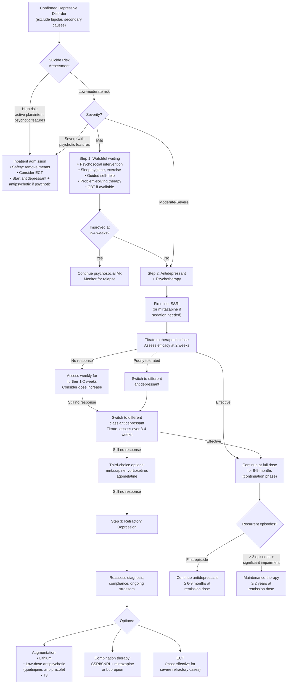

## Management of Depressive Disorders

### Overarching Principles

Before we dive into specifics, understand the logic of managing depression:

1. **Safety first** — always assess suicide risk and determine the appropriate level of care (outpatient vs. inpatient)
2. **Confirm the diagnosis** — ensure it's primary depression, not secondary (medical/substance) or bipolar depression (which requires a fundamentally different approach)
3. **Severity guides treatment** — mild depression may respond to psychosocial interventions alone; moderate-severe depression usually requires pharmacotherapy ± psychotherapy
4. **Treatment has phases** — acute (remission of current episode), continuation (prevent relapse of same episode), maintenance (prevent recurrence of future episodes)
5. **Biopsychosocial approach** — drugs alone are rarely sufficient; address psychological and social factors concurrently

***Management includes:*** [1]
- ***Pharmacological treatment***
- ***Psychosocial treatment***
- ***Physical activity***
- ***Physical treatment*** (***Electroconvulsive therapy, Transcranial magnetic stimulation, Transcranial direct current stimulation***)
- ***Diet***

---

### Management Algorithm

---

### Phase-Based Treatment Approach (NICE Guidelines)

***Approach (NICE 2009, as per Maudsley):*** [2]

| Phase | Severity | Strategy |
|---|---|---|
| **Acute treatment** | ***Mild depression*** | ***Watchful waiting + psychosocial intervention*** [2] |
| | ***Moderate-severe depression and dysthymia*** | ***Antidepressant treatment*** [2] |
| | ***Refractory*** | ***Augmentation by lithium or antipsychotics, add 2nd antidepressant, or ECT*** [2] |
| **Continuation** | ***First episode*** | ***Continue antidepressants for ≥ 6–9 months at dose that induces remission*** [2] |
| **Maintenance** | ***≥ 2 episodes + significant functional impairment*** | ***Continue antidepressants for ≥ 2 years*** [2] |

> **Why continue after remission?** Depression has a high relapse rate (~80% will recur). Stopping antidepressants too early dramatically increases the risk of relapse within the first 6 months. The continuation phase allows the brain to consolidate the neuroplastic changes (↑ BDNF, restored synaptic connectivity) that underlie true recovery, not just symptom suppression.

***General advice:*** [2]
- ***Avoid alcohol and substance use*** — alcohol is a CNS depressant that worsens mood and interacts with antidepressants
- ***Lifestyle advice on diet and sleep hygiene***
- ***Encourage suitable activity as ↓ activity causes social withdrawal and exacerbates depression***

---

## 1. Pharmacological Treatment

### 1.1 Overview and Rationale

***Though changes in monoamines constitute only part of the aetiological picture, the monoamine systems provide the most accessible treatment avenue.*** [1]

This is a crucial conceptual point: we know depression is more than "low serotonin" (neuroplasticity, HPA axis, circuit dysfunction all play roles), but the monoamine system remains the **entry point** for pharmacological intervention. Antidepressants modulate monoamines → downstream effects include ↑ BDNF, restored neuroplasticity, normalised HPA axis — and *this* is what takes 2–4 weeks to manifest clinically.

***Indication: most effective in moderate-severe depression*** [2]
***Efficacy: of this group, 20% will recover without treatment, 30% will respond to placebo, 50% will respond to antidepressants*** [2]

> Translation: The NNT (number needed to treat) with antidepressants is approximately 5–7 for moderate-severe depression. Mild depression has high spontaneous remission rates, which is why watchful waiting is appropriate.

### 1.2 Classes of Antidepressants

#### A. Selective Serotonin Reuptake Inhibitors (SSRIs)

***Selective serotonin reuptake inhibitors: e.g. fluoxetine, paroxetine, sertraline, citalopram, escitalopram, and vortioxetine*** [1]

| Property | Details |
|---|---|
| **Mechanism** | Selectively block SERT (serotonin reuptake transporter) → ↑ synaptic 5-HT → downstream neuroplastic changes (↑ BDNF, receptor desensitisation) |
| **Why first-line** | Best balance of efficacy and tolerability; much safer in overdose compared to TCAs; fewer drug interactions than MAOIs |
| **Onset of action** | 2–4 weeks (time for downstream neuroplastic changes; initial ↑ 5-HT actually causes some worsening before improvement) |
| **Key side effects** | GI (nausea, diarrhoea — 5-HT₃ receptors in gut), sexual dysfunction (↓ libido, anorgasmia — 5-HT₂ receptor stimulation), insomnia/agitation (initial), headache, hyponatraemia (SIADH — especially in elderly) |
| **Serious risks** | Serotonin syndrome (especially if combined with MAOIs, tramadol, triptans); ↑ suicidal ideation in first 2 weeks (especially in young adults — due to energy returning before mood improves); bleeding risk (5-HT in platelets) |
| **Contraindications** | Concurrent MAOI use (must have ≥ 2 week washout; ≥ 5 weeks for fluoxetine due to long half-life of active metabolite); caution in bipolar disorder (manic switch risk) |

<Callout title="Why Can SSRIs Worsen Suicidality Initially?" type="error">
In the first 1–2 weeks of SSRI treatment, the patient's energy and motivation may improve before their mood lifts. This creates a dangerous window where a previously too apathetic-to-act suicidal patient now has the energy to carry out a plan. This is why close monitoring (weekly follow-up) is essential in the early weeks, particularly in adolescents and young adults.
</Callout>

**Vortioxetine** — classified with SSRIs but is actually a "multimodal" antidepressant: SERT inhibition + 5-HT₃/₇ antagonism + 5-HT₁ₐ agonism → additional procognitive effects. Particularly useful when cognitive symptoms (concentration, memory) are prominent.

#### B. Serotonin and Norepinephrine Reuptake Inhibitors (SNRIs)

***Serotonin and norepinephrine reuptake inhibitors: e.g. duloxetine, venlafaxine, and desvenlafaxine*** [1]

| Property | Details |
|---|---|
| **Mechanism** | Block both SERT and NET (norepinephrine reuptake transporter) → ↑ synaptic 5-HT + NE. "SNRI" = dual action |
| **Clinical advantage** | The NE component adds energy/motivation/concentration benefits on top of serotonergic mood/anxiety effects. Also effective for chronic pain (descending NE pathways in spinal cord modulate pain signals) |
| **Key side effects** | Similar to SSRIs + hypertension (NE-mediated — dose-dependent, especially venlafaxine at > 225 mg/day); sweating; discontinuation syndrome (venlafaxine is notorious due to short half-life — "brain zaps," dizziness, irritability) |
| **Contraindications** | Uncontrolled hypertension (venlafaxine); concurrent MAOIs |
| **When to use** | Depression with prominent fatigue/pain/concentration deficits; depression not responding to SSRI |

> **Duloxetine** — the name itself: "dul" doesn't have a root, but think of it as "dual" (dual action on 5-HT + NE). FDA-approved for MDD, GAD, diabetic neuropathic pain, fibromyalgia, and chronic musculoskeletal pain — highlighting the pain-modulating properties.

#### C. Tricyclic Antidepressants (TCAs)

***Non-selective monoamine reuptake inhibitors — Tricyclic antidepressants: e.g. amitriptyline, imipramine, nortriptyline, clomipramine, dothiepin, trimipramine, desipramine*** [1]

| Property | Details |
|---|---|
| **Mechanism** | Block SERT + NET (like SNRIs) but also block muscarinic (M₁), histamine (H₁), and alpha-1 adrenergic receptors → hence the side effect burden. "Tricyclic" refers to the 3-ring chemical structure |
| **Efficacy** | ***Melancholic depression: ↑ response to TCA than SSRI*** [2]. Among the most effective antidepressants, but limited by tolerability |
| **Key side effects** | **Anticholinergic** (M₁ blockade): dry mouth, constipation, urinary retention, blurred vision, cognitive impairment. **Antihistaminergic** (H₁): sedation, weight gain. **Anti-alpha₁**: orthostatic hypotension. **Cardiac**: QTc prolongation, arrhythmias (Na⁺ channel blockade) |
| **Serious risks** | **Lethal in overdose** — cardiac arrhythmias (wide QRS → VT → death). This is why TCAs are avoided in suicidal patients |
| **Contraindications** | Recent MI, heart block, arrhythmias; concurrent MAOIs; caution in elderly (anticholinergic burden → delirium, falls); prostatic hypertrophy, narrow-angle glaucoma |
| **When to use** | Severe melancholic depression; neuropathic pain (amitriptyline); treatment-resistant depression; when SSRIs/SNRIs have failed |

> ***Clomipramine*** is essentially the most serotonergic TCA — it's also the gold-standard drug for OCD (at higher doses). The name: "clomi" = chlorinated, "pramine" = imipramine derivative.

#### D. Norepinephrine and Dopamine Reuptake Inhibitors (NDRIs)

***Norepinephrine and dopamine reuptake inhibitors: e.g. bupropion*** [1]

| Property | Details |
|---|---|
| **Mechanism** | Blocks NET + DAT (dopamine reuptake transporter) → ↑ NE + DA. No serotonergic action |
| **Clinical advantage** | No sexual dysfunction (unlike SSRIs/SNRIs — because no 5-HT₂ effect); no weight gain; mildly activating. Also used for smoking cessation (Zyban) |
| **Key side effects** | Insomnia, agitation, dry mouth, dose-dependent seizure risk |
| **Contraindications** | **Seizure disorders** (lowers seizure threshold); eating disorders (bulimia/anorexia — seizure risk); concurrent MAOIs |
| **When to use** | Depression with prominent anhedonia/fatigue; patients concerned about sexual dysfunction or weight gain; smoking cessation; as combination partner with SSRI/SNRI in refractory depression |

#### E. Monoamine Oxidase Inhibitors (MAOIs)

***Monoamine oxidase inhibitors and reversible inhibitors of MAO-A: e.g. tranylcypromine, phenelzine, isocarboxazid, selegiline and moclobemide*** [1]

| Property | Details |
|---|---|
| **Mechanism** | Inhibit MAO (monoamine oxidase) → ↓ breakdown of 5-HT, NE, DA in synaptic cleft → ↑ all monoamines. MAO-A preferentially metabolises 5-HT and NE; MAO-B preferentially metabolises DA |
| **Types** | **Irreversible, non-selective** (tranylcypromine, phenelzine): bind MAO permanently → takes 2 weeks for new enzyme synthesis. **Reversible inhibitor of MAO-A (RIMA)**: moclobemide → safer, fewer dietary restrictions |
| **Clinical advantage** | Effective in atypical depression (better than TCAs); treatment-resistant depression |
| **Key side effects** | Orthostatic hypotension, insomnia, weight gain, sexual dysfunction |
| **Serious risks** | **Hypertensive crisis ("cheese reaction")**: tyramine in aged cheeses, red wine, fermented foods is normally metabolised by MAO in gut wall. With MAO inhibited → tyramine absorbed → displaces NE from vesicles → massive sympathetic discharge → hypertensive crisis → stroke. This is less of a risk with moclobemide (reversible) |
| **Contraindications** | Concurrent serotonergic drugs (SSRIs, SNRIs, TCAs, tramadol, triptans) → serotonin syndrome; phaeochromocytoma; hepatic impairment (moclobemide) |

<Callout title="The Tyramine Crisis — Why MAOIs Need Dietary Restrictions">
MAO-A in the gut wall normally breaks down tyramine (an amine found in aged/fermented foods). When MAO-A is irreversibly inhibited, dietary tyramine is absorbed intact → enters sympathetic nerve terminals → displaces NE from vesicles into the synapse → massive NE release → severe hypertension → headache, palpitations, potentially stroke. Patients on irreversible MAOIs must follow a tyramine-restricted diet. Moclobemide (reversible) carries much lower risk because tyramine can still compete for the enzyme.
</Callout>

#### F. Mirtazapine

***Others: e.g. trazodone, mirtazapine*** [1]

| Property | Details |
|---|---|
| **Mechanism** | Noradrenergic and specific serotonergic antidepressant (NaSSA): blocks α₂-adrenergic autoreceptors → ↑ NE and 5-HT release; also blocks 5-HT₂ₐ, 5-HT₂c, 5-HT₃, H₁ receptors |
| **Clinical advantage** | Sedating (H₁ blockade) → useful when insomnia is a major symptom. Appetite-stimulating (H₁ + 5-HT₂c blockade) → useful in depressed patients with weight loss. Anxiolytic. Fewer GI side effects and less sexual dysfunction than SSRIs (5-HT₃ blockade prevents nausea; no direct SERT blockade) |
| **Key side effects** | Sedation, weight gain, ↑ appetite. Rarely: agranulocytosis (rare but serious — warn patient to report sore throat/fever) |
| **When to use** | ***SSRI or mirtazapine if sedation is required*** [2]; depression with insomnia and/or appetite loss; elderly patients who need weight gain; as combination partner (California rocket fuel = venlafaxine + mirtazapine) |

#### G. Melatonergic Antidepressants

***Melatonergic antidepressants: e.g. agomelatine*** [1]

| Property | Details |
|---|---|
| **Mechanism** | MT₁/MT₂ melatonin receptor agonist + 5-HT₂c antagonist → resynchronises circadian rhythms + ↑ NE and DA release in frontal cortex |
| **Clinical advantage** | Improves sleep architecture without daytime sedation; no sexual dysfunction; no weight gain; no discontinuation syndrome |
| **Key side effects** | Hepatotoxicity (must monitor LFTs at baseline, 3, 6, 12, and 24 weeks) |
| **Contraindications** | Hepatic impairment; concurrent potent CYP1A2 inhibitors (e.g., fluvoxamine, ciprofloxacin) |

### 1.3 Comparative Efficacy and Tolerability

***Systematic review and network meta-analysis of 21 antidepressants (Cipriani et al., 2018):*** [1]

- ***Agomelatine, amitriptyline, escitalopram, mirtazapine, paroxetine, venlafaxine, and vortioxetine are more effective than other antidepressants (range of ORs 1.19–1.96)***
- ***Agomelatine, citalopram, escitalopram, fluoxetine, sertraline, and vortioxetine are more tolerable than other antidepressants (range of ORs 0.43–0.77)***
- ***Older antidepressants (e.g. tricyclics, MAOIs) associated with significant adverse events and drug-drug interactions***
- ***Marked inter-individual variation in antidepressant tolerability***
- ***Choice of medication determined by clinical circumstances, particularly the patient's physical comorbidity and concomitant medications***

<Callout title="The Cipriani Meta-Analysis — The Most Cited Evidence">
This 2018 Lancet paper is the largest network meta-analysis of antidepressants ever published. Key takeaway for exams: **escitalopram** and **sertraline** offer the best balance of efficacy + tolerability and are commonly used first-line. **Amitriptyline** is highly effective but poorly tolerated. **Reboxetine** was the least effective. All 21 antidepressants were more effective than placebo.
</Callout>

### 1.4 Practical Prescribing Approach

***Approach to antidepressant treatment:*** [2]

| Step | Action | Details |
|---|---|---|
| 1 | ***Discuss choice of drug with the patient*** | Consider: ***potential therapeutic effects, possible adverse effects, likelihood of discontinuation symptoms, likely time to respond, the role of therapeutic alliance in predicting response*** [2]. ***Suggest an SSRI or mirtazapine if sedation is required*** [2] |
| 2 | ***Start antidepressant*** | ***Titrate to a recognised therapeutic dose*** [2] |
| 3 | ***Assess efficacy after 2 weeks*** | Some improvement should be emerging; full effect at 4–6 weeks |
| 4a | If effective → | ***Continue for 6–9 months at full treatment dose*** [2]; ***consider longer-term treatment in recurrent depression*** |
| 4b | If poorly tolerated → | ***Switch to a different antidepressant*** [2] |
| 4c | If no response → | ***Assess weekly for a further 1–2 weeks. If still no response, consider increasing dose*** [2] |
| 5 | If still no response → | ***Switch to a different antidepressant, titrate to therapeutic dose, assess efficacy over 3–4 weeks*** [2] |
| 6 | If still no response → | ***Consider third choice options: mirtazapine, vortioxetine, agomelatine*** [2] |
| 7 | If still no response → | ***Refer to suggested treatments for refractory depression*** [2] |

### 1.5 The STAR*D Study — Real-World Evidence

The Sequenced Treatment Alternatives to Relieve Depression (STAR*D) trial is the largest real-world effectiveness study of antidepressant treatment [2]:

| Step | Treatment | Remission Rate |
|---|---|---|
| Step 1 | Citalopram | **28%** |
| Step 2 (switch) | Bupropion 21.3% vs Venlafaxine 24.8% vs Sertraline 17.6% | ~20% |
| Step 2 (augment) | Add buspirone 30.1% vs Add T3 24.7% | ~25-30% |
| Step 3 (switch) | Mirtazapine 12.3% vs Nortriptyline 19.8% | ~15% |
| Step 3 (augment) | Add lithium 15.9% | ~16% |
| Step 4 | Tranylcypromine 6.9% vs Mirtazapine + venlafaxine 13.7% | ~10% |

> **Key lesson**: With each failed step, remission rates drop. About 2/3 of patients will eventually achieve remission if they persist through multiple adequate trials. But "first-shot" success matters — choosing the right drug first time is important.

---

## 2. Psychosocial Treatment

### 2.1 Cognitive Behavioural Therapy (CBT)

***Main psychological treatment for depression:*** [2][4]

| Aspect | Details |
|---|---|
| **Basis** | Targets the cognitive distortions identified by Beck (selective abstraction, overgeneralisation, personalisation, arbitrary inference) and the behavioural consequences (withdrawal, inactivity) |
| **Structure** | Structured, time-limited (typically 12–20 sessions), collaborative, homework-based |
| **Techniques** | Cognitive restructuring (identifying and challenging automatic negative thoughts), behavioural activation (scheduling pleasurable activities to break the withdrawal-anhedonia cycle), graded task assignment |
| **Efficacy** | As effective as antidepressants for mild-moderate depression; combined CBT + antidepressant superior to either alone for moderate-severe depression; lower relapse rates after CBT discontinuation vs antidepressant discontinuation (because patients learn skills) |
| **Indications** | ***Depression*** [4]; particularly useful in mild-moderate depression, relapse prevention |

### 2.2 Mindfulness-Based Cognitive Therapy (MBCT)

***Mindfulness-based cognitive therapy:*** [4]

- Combines CBT with mindfulness meditation techniques
- Focus: becoming aware of thoughts and feelings and accepting them rather than reacting to them
- Particularly effective for **relapse prevention** in patients with ≥ 3 prior episodes of depression (NICE-recommended)
- 8-week group programme

### 2.3 Interpersonal Therapy (IPT)

***Interpersonal therapy:*** [2]

| Aspect | Details |
|---|---|
| **Basis** | Problems with interpersonal life contribute to depression |
| **Focus areas** | Grief over loss, interpersonal disputes, role transitions, interpersonal skill deficits |
| **Structure** | Current-problem focused, brief (12–16 sessions) |
| **Efficacy** | Well-established for depression; particularly useful for depression triggered by relationship issues or role transitions |

### 2.4 Other Psychosocial Approaches

| Approach | Description | When to Use |
|---|---|---|
| ***Psychoeducation*** [3] | Education about the illness, its course, triggers, and treatment | All patients — foundation of management |
| ***Counselling and supportive psychotherapy*** [2] | Brief, empathetic, reflective; helps patients utilise own strengths | Mild depression, stressful life events |
| ***Problem-solving therapy*** | Structured approach to identifying and solving current problems | Mild depression, primary care settings |
| ***Group therapy*** [2] | ~5–10 patients meet with therapist weekly; based on CBT or psychodynamic principles | Cost-effective; social skill building; peer support |
| ***Family therapy*** [3] | Reduces expressed emotion, educates family, addresses family dynamics | When family conflict is prominent; ***family or carer-focused treatment*** [3] |

---

## 3. Physical Activity

***Physical activity*** [1] is an evidence-based treatment for depression:

- Mechanism: ↑ endorphins, ↑ BDNF (neuroplasticity), ↑ monoamines, ↓ cortisol, improves sleep, ↑ self-efficacy
- Evidence: Meta-analyses show moderate-intensity exercise (e.g., 30 min, 3–5×/week) is as effective as antidepressants for mild-moderate depression
- Recommended: aerobic exercise (walking, jogging, swimming, cycling) or resistance training
- Barrier: anhedonia and anergia make it hard to start → behavioural activation strategies in therapy help

---

## 4. Physical (Brain Stimulation) Treatments

### 4.1 Electroconvulsive Therapy (ECT)

***Electroconvulsive therapy:*** [1][2]

"Electro" = electric current, "convulsive" = seizure-inducing — the name tells you what it does.

| Aspect | Details |
|---|---|
| **Mechanism** | ***Unknown*** [2]. Postulated: ***↑ hormonal release (PRL, TSH, ACTH, endorphins); ↑ neurotrophic signalling (↑ BDNF) → neurogenesis; ↑ monoamine release; transient ↑ BBB permeability; changes in brain connectivity*** [2] |
| **Administration** | ***Course: 6–12 treatments, 2–3/week*** [2]. Under ***short-acting GA + muscle relaxant***. ***Electric pulse delivered via scalp electrodes to induce a generalised tonic-clonic seizure lasting at least 15 seconds*** [2] |
| **Electrode placement** | ***Unilateral vs bilateral: bilateral more effective but may cause more cognitive impairment*** [2]. ***Unilateral, if done, should be done contralateral to dominant hemisphere*** [2] |

**Indications** — remember the mnemonic **ECT**:

- **E**mergency — ***rapid definitive response required (e.g., pregnancy); life-threatening (persistent suicidal intent, food refusal, malnutrition/dehydration)*** [2]
- **C**atatonia — ***life-threatening, treatment resistance*** [2]
- **T**reatment-refractory — ***antidepressants failed or cannot be used (refractory, medical comorbidities); previous good response to ECT*** [2]

Also indicated for:
- ***Mania or mixed affective states: pregnant, life-threatening, treatment resistant*** [2]
- ***Puerperal psychosis with prominent mood symptoms (rapid treatment to allow reuniting with baby)*** [2]
- ***Selective treatment-resistant schizophrenia*** [2]

> ***ECT is especially effective for those with psychosis and/or psychomotor retardation.*** [2]

| Adverse Effects | Details |
|---|---|
| ***Cognitive impairment*** | ***Acute confusion, anterograde or retrograde amnesia — generally short-lived, lasting a few days after ECT*** [2] |
| ***General complaints*** | ***Headache, nausea, muscle pain*** [2] |
| ***Mortality*** | ***2–4/100,000 (~other minor surgery under GA), usually associated with cardiopulmonary events (e.g., MI)*** [2] |

***Contraindications: no absolute contraindication.*** Relative contraindications include [2]:
- ***Heart disease: recent MI, heart failure, ischaemic heart disease***
- ***↑ ICP***
- ***Risk of ICH, e.g., hypertension, recent stroke***
- ***Poor anaesthetic risk***

### 4.2 Transcranial Magnetic Stimulation (TMS)

***Transcranial magnetic stimulation:*** [1][2]

| Aspect | Details |
|---|---|
| **Procedure** | ***Non-invasive, hand-held plastic-coated coil placed close to scalp → use of external magnetic field to stimulate generation of action potential and firing of neurones*** [2] |
| **Target** | Usually left dlPFC (which is underactive in depression) → stimulation restores activity |
| **Use** | ***Suitable for medically unwell people who cannot tolerate antidepressants or ECT*** [2]; treatment-resistant depression |
| **Side effects** | ***Minimal, but only available in selected centres*** [2] |

### 4.3 Transcranial Direct Current Stimulation (tDCS)

***Transcranial direct current stimulation:*** [1][2]

| Aspect | Details |
|---|---|
| **Procedure** | ***Non-invasive, use of constant, low voltage DC via electrodes on head to achieve neurostimulation*** [2] |
| **Mechanism** | ***Anode and cathode to ↑/↓ cortical activity/excitability respectively → modulates spontaneous neuronal network activity*** [2] |
| **Use** | ***NOT suprathreshold (cf TMS, ECT) → therefore limited to adjunctive use only*** [2] |
| **Side effects** | ***Minimal, but only available in selected centres*** [2] |

---

## 5. Diet

***Healthy diet may help as part of the overall depression treatment though no specific diet has been proven to relieve depression:*** [1]

| Dietary Component | ***Details*** |
|---|---|
| ***Antioxidants*** | ***Food rich in antioxidants (e.g. blueberries, oranges, carrots, nuts)*** [1] — oxidative stress is elevated in depression; antioxidants may help counteract this |
| ***Complex carbohydrates*** | ***Can have a calming effect*** [1] — ↑ tryptophan availability → ↑ 5-HT synthesis |
| ***Protein-rich foods*** | ***e.g. turkey, tuna, and chicken — boost alertness*** [1] — contain tryptophan (5-HT precursor) and tyrosine (DA/NE precursor) |
| ***Mediterranean diet*** | ***As a source for B vitamins*** [1] — B6, B12, folate are cofactors in monoamine synthesis |
| ***Omega-3 fatty acids*** | ***Essential polyunsaturated lipids that influence cellular metabolism and function*** [1]. ***Earlier studies linked low seafood intake and mood disorders, and positive results with fish oil intervention → subsequent results more diversified*** [1]. ***EPA rather than DHA as the effective component. Monotherapy as well as adjunct therapy*** [1] |

---

## 6. Refractory Depression

When a patient has not responded to ≥ 2 adequate trials of different antidepressants at adequate dose and duration, consider [2]:

***Considerations before escalating treatment:*** [2]
- ***Reassess diagnosis: look for secondary causes (e.g., substance abuse) and other psychiatric disorders***
- ***Assess compliance*** — non-adherence is the most common reason for "treatment failure"
- ***Assess for ongoing psychosocial stressors***

***Therapeutic options:*** [2]

| Strategy | Options | Details |
|---|---|---|
| ***Switch antidepressant*** | ***Switch to another class*** | ***Usually done first, preferably of a different mechanism (beware of serotonin and discontinuation syndrome → cross-tapering)*** [2] |
| ***Combination therapy*** | ***Usually 5-HT (SSRI, venlafaxine) + NA (bupropion, mirtazapine)*** [2] | "California rocket fuel" = venlafaxine + mirtazapine; targets all 3 monoamines |
| ***Augmentation*** | ***Low-dose antipsychotic drugs, especially in those with psychotic features*** [2] | ***Antipsychotics licensed for augmentation: quetiapine, aripiprazole (Abilify)*** [2] |
| | ***Lithium*** [2] | Augments serotonergic function; anti-suicidal properties; requires level monitoring (target 0.4 mmol/L for unipolar depression augmentation) [2] |
| | ***Tri-iodothyronine (T3)*** [2] | T3 modulates monoamine turnover; evidence from STAR*D (24.7% remission rate as augmentation) |
| ***ECT*** | | ***Considered more effective than drugs in the most severe cases. Indications: emergency, refractory, catatonic*** [2] |

> ***Options for refractory depression: Optimise existing treatment → Augmentation by antipsychotics, Li or T3 → Combine with another antidepressant with another mechanism → Switch to another mechanism*** [2]

---

## 7. Special Considerations: Bipolar Depression

This is **not** the same as unipolar depression management. Including this because it's a common exam trap [2][3]:

***Treatment of bipolar depression is NOT identical to treatment of unipolar depression or bipolar mania!*** [2]

***Treatment of bipolar depressive episode:*** [3]
- ***Monotherapy: Lithium, Lamotrigine OR Quetiapine***
- ***Combination: Add Antidepressants (SSRI OR Venlafaxine) to monotherapy OR Combine two monotherapy agents***
- ***Reevaluate diagnosis and consider ECT (for patients with high suicidal risk)***

***Key principles:*** [3]
- ***Avoid antidepressants if possible; if used, limit dose and duration*** [3]
- ***Conventional antidepressants are (1) less effective in treating bipolar depression (2) associated with risk of inducing mania (3) associated with risk of inducing rapid cycling*** [2]
- ***Antidepressants, when used, should be combined with antipsychotic or mood stabiliser*** [2]

***Indication for prophylactic treatment:*** [3]
- ***Established bipolar disorder — recurrent episodes of mania or depression***
- ***Severe single episode with suicidal attempts, psychotic episodes and significant functional impairment (to prevent future relapse)***
- ***Recurrence rate reduces by 50% for maintenance vs. discontinuation***
- ***Gradual discontinuation better than abrupt discontinuation***

***General guidelines for prophylaxis for bipolar I:*** [3]
- ***Monotherapy: Lithium or Valproate or Quetiapine***
- ***Psychosocial (augmentation): Psychoeducation, Cognitive behavioural therapy, Interpersonal and social rhythm therapy, Family or carer-focused treatment, Peer-support, Intensive case management***
- ***Less hostile, more supportive, better drug compliance***

***Lithium is still an important drug, given that it is the only mood stabiliser to reduce suicide.*** [3]

---

## 8. Course and Prognosis

***Clinical course: generally self-limiting within 6 months to 1 year*** [2]

| Feature | Details |
|---|---|
| **Age of onset** | ***~50% before age 21*** [2] |
| **Duration** | ***Average 6 months; ~25% > 1 year; ~10–20% chronic unremitting*** [2] |
| **Recurrence** | ***~80% will recur; average ~4 further episodes in 25 years*** [2] |
| **Interval** | ***Usually associated with progressive shortening of interval between episodes*** [2] |
| **Remission** | ***~50% does not have complete symptom remission between episodes*** [2] |
| **Stability** | ***Only ~25% of those with recurrent major depression achieve 5-year clinical stability with good social and occupational performances*** [2] |
| **Mortality** | ***> 20× risk of suicide; can approach 15% in those severe admitted cases*** [2] |

***Prognosticants for relapse:*** [2]
1. ***Incomplete symptomatic remission***
2. ***Early age of onset***
3. ***Poor social support***
4. ***Poor physical health***
5. ***Comorbid substance abuse***
6. ***Comorbid personality disorder***

---

<Callout title="High Yield Summary">

**Treatment by severity**: Mild → watchful waiting + psychosocial. Moderate-severe → antidepressant + psychotherapy. Refractory → augmentation/combination/ECT.

**First-line antidepressant**: SSRI (escitalopram, sertraline best balance of efficacy + tolerability per Cipriani 2018). Mirtazapine if sedation/appetite stimulation needed.

**Key drug classes**: SSRIs (SERT blockade), SNRIs (SERT+NET), TCAs (non-selective, lethal in OD), NDRIs (bupropion — no sexual dysfunction), MAOIs (tyramine crisis), mirtazapine (NaSSA — sedating, appetite-stimulating), agomelatine (melatonergic — monitor LFTs).

**Continuation phase**: ≥ 6–9 months at remission dose for first episode. **Maintenance**: ≥ 2 years if ≥ 2 episodes with significant impairment.

**Refractory depression**: Reassess dx/compliance/stressors → switch class → combine (SSRI + mirtazapine/bupropion) → augment (lithium, quetiapine, aripiprazole, T3) → ECT.

**ECT indications**: Emergency (suicidal, food refusal), Catatonia, Treatment-refractory. No absolute contraindications. Bilateral more effective but more cognitive side effects.

**Bipolar depression**: NOT the same as unipolar. First-line: quetiapine, lithium, or lamotrigine. Avoid antidepressant monotherapy (manic switch risk). Lithium is the only mood stabiliser that reduces suicide.

**Prognosis**: 80% recurrence; average 4 episodes in 25 years; > 20× suicide risk. Poor prognosticants: incomplete remission, early onset, poor social support, comorbid SA/personality disorder.

</Callout>

---

<ActiveRecallQuiz
  title="Active Recall - Management of Depressive Disorders"
  items={[
    {
      question: "Describe the stepped-care approach to depression management based on severity (mild vs moderate-severe vs refractory).",
      markscheme: "Mild: watchful waiting + psychosocial intervention (guided self-help, CBT, exercise, sleep hygiene). Moderate-severe: antidepressant (SSRI first-line) + psychotherapy (CBT or IPT). Refractory: reassess diagnosis/compliance/stressors, then switch class, combine antidepressants (e.g. SSRI + mirtazapine), augment (lithium, antipsychotic such as quetiapine/aripiprazole, T3), or ECT."
    },
    {
      question: "Name the seven antidepressants found to be more effective than others in the Cipriani 2018 meta-analysis, and the six found to be more tolerable.",
      markscheme: "More effective: agomelatine, amitriptyline, escitalopram, mirtazapine, paroxetine, venlafaxine, vortioxetine. More tolerable: agomelatine, citalopram, escitalopram, fluoxetine, sertraline, vortioxetine."
    },
    {
      question: "What are the three main indications for ECT in depression? What is the mnemonic, and what are the relative contraindications?",
      markscheme: "Mnemonic ECT: Emergency (life-threatening, suicidal, food refusal, pregnancy needing rapid response), Catatonia, Treatment-refractory. No absolute contraindications. Relative CIs: recent MI/heart failure/IHD, raised ICP, risk of ICH (HTN, recent stroke), poor anaesthetic risk."
    },
    {
      question: "Why should antidepressant monotherapy be avoided in bipolar depression? What are the first-line treatments for bipolar depressive episodes?",
      markscheme: "Antidepressant monotherapy in bipolar depression is (1) less effective than in unipolar depression, (2) associated with risk of inducing mania (manic switch), and (3) associated with risk of inducing rapid cycling. First-line: monotherapy with quetiapine, lithium, or lamotrigine. If combination needed: add SSRI or venlafaxine to a mood stabiliser, or combine two monotherapy agents."
    },
    {
      question: "A patient on an SSRI for 4 weeks shows no improvement. Outline the systematic approach to managing this treatment failure.",
      markscheme: "Step 1: Reassess diagnosis (exclude bipolar, secondary causes), assess compliance, check for ongoing psychosocial stressors. Step 2: Ensure dose is at therapeutic level; if subtherapeutic, increase dose. Step 3: If adequate dose and duration with no response, switch to a different antidepressant class (e.g. SNRI, mirtazapine). Step 4: If still no response, consider combination therapy (SSRI + mirtazapine or bupropion) or augmentation (lithium, quetiapine, aripiprazole, T3). Step 5: If refractory to multiple trials, consider ECT."
    },
    {
      question: "List four prognostic factors for relapse in major depressive disorder.",
      markscheme: "Any four of: (1) Incomplete symptomatic remission, (2) Early age of onset, (3) Poor social support, (4) Poor physical health, (5) Comorbid substance abuse, (6) Comorbid personality disorder."
    }
  ]}
/>

## References

[1] Lecture slides: GC 164. I am depressed Mood disorders.pdf (p16, p17, p24, p25)
[2] Senior notes: ryanho-psych.md (sections on management of depressive disorders, antidepressants, ECT, psychotherapy, refractory depression, course and prognosis, lithium)
[3] Lecture slides: GC 163. I am a superman Bipolar disorder.pdf (p36, p44, p46, p47, p65)
[4] Senior notes: ryanho-psych.md (sections on psychotherapy indications, CBT)
