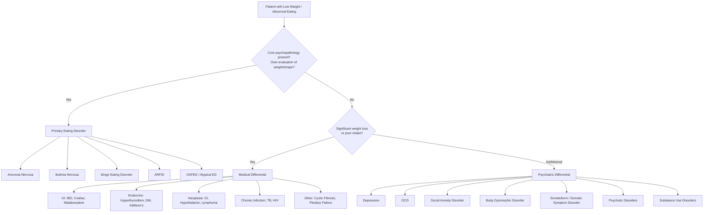

## Differential Diagnosis of Eating Disorders

The differential diagnosis of eating disorders is crucial because **significant weight loss, abnormal eating patterns, and associated physical findings can be caused by a wide range of medical and psychiatric conditions**. The clinical challenge is to distinguish primary eating disorders (where the psychopathology drives the weight/eating disturbance) from conditions where weight loss or abnormal eating is secondary to another process.

The golden rule: **does the patient have the core psychopathology of over-evaluation of weight and shape?** If yes → primary eating disorder. If no → look harder for an alternative diagnosis [2].

---

### 1. Differential Diagnosis Framework

---

### 2. Medical Differential Diagnoses

These are conditions that cause **weight loss, poor appetite, or GI symptoms** that can mimic an eating disorder — but the psychopathology of body image distortion and fear of fatness is **absent**.

#### Why is the medical differential important?

Because medical conditions can cause exactly the same physical findings (cachexia, amenorrhoea, electrolyte disturbances, bradycardia) as AN. If you don't exclude them, you may miss a treatable — or life-threatening — organic disease. Equally, some medical conditions can **coexist** with an eating disorder (e.g., a patient with coeliac disease who also develops AN), making diagnosis more complex.

| Medical Condition | Why It Can Mimic AN/Eating Disorders | Key Differentiating Features |
|---|---|---|
| **Neoplasia** (e.g., GI tumours, hypothalamic tumours, lymphoma, cachexia from any malignancy) [2] | Malignancy causes weight loss through increased metabolic demand, cytokine-mediated cachexia (TNF-α, IL-6), mechanical obstruction, or hypothalamic dysfunction disrupting appetite centres | **No fear of fatness or body image distortion.** Patient typically *wants* to eat but cannot. Hypothalamic tumours are particularly treacherous — they can directly impair appetite regulation while also causing endocrine dysfunction (hypopituitarism) that mimics AN. Look for: focal neurological signs, visual field defects (bitemporal hemianopia from optic chiasm compression), other pituitary hormone deficiencies, B symptoms (fever, night sweats, weight loss) for lymphoma |
| **Inflammatory Bowel Disease** (Crohn's disease, ulcerative colitis) [2] | Chronic inflammation → malabsorption, increased metabolic demand, abdominal pain limiting intake, corticosteroid-related complications | **Abdominal pain, bloody diarrhoea, perianal disease (Crohn's), raised inflammatory markers (CRP, ESR), anaemia of chronic disease.** No body image distortion. However, be aware that adolescents with IBD can develop secondary eating avoidance that evolves into a true eating disorder |
| **Malabsorption syndromes** (e.g., coeliac disease, chronic pancreatitis) [2] | Impaired nutrient absorption despite adequate intake → weight loss, nutritional deficiencies, GI symptoms (bloating, diarrhoea, steatorrhoea) | **Coeliac:** positive anti-tTG/anti-endomysial antibodies, villous atrophy on duodenal biopsy, iron/folate deficiency, dermatitis herpetiformis. **Chronic pancreatitis:** history of alcohol use or gallstones, steatorrhoea, epigastric pain radiating to back, pancreatic calcifications on imaging. No over-evaluation of weight/shape |
| **Hyperthyroidism** [2] | ↑ Metabolic rate → weight loss despite normal or increased appetite; also causes anxiety, tremor, heat intolerance, diarrhoea, tachycardia | **Key distinction from AN:** patients with hyperthyroidism typically have **increased appetite** (eating more but losing weight), **tachycardia** (AN has bradycardia), **heat intolerance** (AN has cold intolerance), tremor, lid lag, goitre. TFTs: ↓ TSH, ↑ free T4/T3 |
| **Diabetes mellitus** [2] | **Type 1 DM:** Insulin deficiency → inability to utilise glucose → weight loss, polyuria, polydipsia, polyphagia. **"Diabulimia":** Deliberate insulin omission for weight control — a dangerous overlap where true eating disorder psychopathology coexists with DM | **Type 1 DM:** Hyperglycaemia, ketoacidosis, polyuria, polydipsia. **Diabulimia** is particularly important — patients with T1DM may deliberately withhold insulin to induce glycosuria and weight loss; this carries an extremely high mortality. Look for: recurrent DKA, persistently elevated HbA1c despite apparent adherence, early microvascular complications |
| **Pituitary failure** (hypopituitarism) [2] | Panhypopituitarism → ↓ ACTH, TSH, GH, gonadotropins → weight loss, fatigue, amenorrhoea, hypotension — closely mimics AN | **Shared features with AN:** amenorrhoea, low gonadotropins, fatigue, hypotension. **Differentiators:** ↓ cortisol (AN has ↑ cortisol), ↓ TSH with ↓ T4 (AN has normal TSH with ↓ T3), visual field defects if pituitary adenoma, headache. No body image distortion. Must measure cortisol, TSH, free T4, IGF-1 |
| **Chronic infection** (e.g., TB, HIV, chronic hepatitis) [2] | Chronic immune activation → cytokine-mediated cachexia, malabsorption, anorexia | **Fever, night sweats, lymphadenopathy, specific organ involvement.** Travel/exposure history. HIV testing. TB screening (CXR, sputum, IGRA). No body image distortion |
| **Cystic fibrosis** [2] | Pancreatic insufficiency → malabsorption + ↑ metabolic demand from chronic respiratory infection → failure to thrive and weight loss | **Chronic productive cough, recurrent chest infections, clubbing, steatorrhoea.** Usually diagnosed in childhood but mild phenotypes may present in adolescence |
| **Addison's disease** (primary adrenal insufficiency) | ↓ Cortisol → anorexia, nausea, weight loss, fatigue, hypotension, hyperpigmentation | **Hyperpigmentation** (ACTH-driven, especially in palmar creases, buccal mucosa), **hyperkalaemia + hyponatraemia** (opposite to AN which has hypoK⁺), postural hypotension. Confirm with short Synacthen test |

<Callout title="Hypothalamic Tumours — The Great Mimicker" type="error">
Hypothalamic tumours (e.g., craniopharyngioma in adolescents) are a particularly dangerous mimic of AN. They can cause: weight loss, amenorrhoea, growth failure, behavioural changes, and even apparent food refusal. The difference is that **there is no over-evaluation of weight/shape** — the appetite disturbance is neurological, not psychological. Always consider a brain MRI in atypical presentations (e.g., male patients, very young patients, patients without typical body image distortion, or patients with headache/visual symptoms) [2].
</Callout>

---

### 3. Psychiatric Differential Diagnoses

These are psychiatric conditions where abnormal eating, weight loss, or body-related preoccupation occurs — but the **specific eating disorder psychopathology** either differs or is absent.

| Psychiatric Condition | Why It Can Mimic Eating Disorders | Key Differentiating Features |
|---|---|---|
| **Bulimia Nervosa (vs AN)** [2] | Both AN and BN share over-evaluation of body shape and weight; some AN patients exhibit binge eating and purging behaviour as in BN | **The key distinguishing feature is body weight:** AN requires an abnormally low body weight, often associated with structural and physiological sequelae. BN patients are typically at normal or near-normal weight. If a patient is severely underweight AND binge-purging, they have AN binge-eating/purging subtype, NOT BN [2] |
| **ARFID** (Avoidant/Restrictive Food Intake Disorder) [2] | Also associated with poor energy and nutritional intake leading to low body weight | **Due to a lack of interest in food, aversion to sensory characteristics, or concern about aversive consequences of eating** (e.g., fear of choking, vomiting) — **NOT** due to fear of fatness or body image distortion. No over-evaluation of weight/shape [2] |
| **OSFED / Atypical Eating Disorders** [2] | Patients exhibit features of AN/BN but **both diagnostic criteria for AN and BN cannot be fully met** | Examples: atypical AN (all criteria for AN met except weight is within/above normal range despite significant weight loss), subthreshold BN (binge/purge frequency < 1/week), purging disorder (purging without binge eating), night eating syndrome [2] |
| **Depression** [2] | Depressive disorder commonly causes **↓ appetite and weight loss** (neurovegetative symptoms); can also cause ↑ appetite in atypical depression | **Weight loss in depression is secondary to anhedonia and ↓ appetite — the patient does not fear weight gain and does not have body image distortion.** They are typically distressed by weight loss, not gratified by it. Also look for: pervasive low mood, anhedonia, guilt, hopelessness, sleep disturbance, suicidal ideation. **Caveat:** Depression frequently coexists with eating disorders (75% lifetime comorbidity in AN) — the question is which is primary [2] |
| **OCD** [2] | Both AN and OCD may have **obsessional thoughts and ritualistic behaviours** (food rituals, body checking, exercise rituals) | **In OCD, obsessions are ego-dystonic** (the patient recognises them as intrusive, unwanted, and distressing) and are **not specifically focused on weight and shape.** In AN, the preoccupation with weight/shape is **ego-syntonic** (feels "right" and aligned with the patient's values). OCD obsessions are diverse in content (contamination, harm, symmetry), while AN obsessions are narrowly focused on food/weight/shape. **However:** OCD is highly comorbid with AN, so look carefully at whether the eating-related preoccupations are the patient's only obsessions or part of a broader OCD pattern [2] |
| **Social Anxiety Disorder** [2] | Patients may feel **ashamed to be seen eating in public** → avoidance of eating in social situations → weight loss | **Patients usually recognise that the fear is excessive and unreasonable.** The core fear is about social evaluation in general (embarrassment, humiliation), not specifically about weight or shape. They eat normally in private. No compensatory behaviours or binge eating [2] |
| **Body Dysmorphic Disorder (BDD)** [3] | **Preoccupation with perceived defects in physical appearance** → distress, compulsive behaviours (mirror checking, camouflaging, skin picking), social avoidance | BDD preoccupation is with a **specific body part** (skin, nose, hair — not overall body weight/shape). Patients believe they look "ugly" or "deformed," not "fat." BDD patients do not restrict food intake to change the perceived defect. **However:** BDD and eating disorders frequently co-occur (~33% comorbidity), and some patients have both weight/shape concerns AND appearance concerns about specific features. The focus of preoccupation is the differentiator [3] |
| **Somatoform / Somatic Symptom Disorder** [2] | May present with GI complaints (nausea, abdominal pain, vomiting) that limit food intake → weight loss | **No over-evaluation of weight/shape.** The patient's concern is about physical symptoms, not body image. Weight loss is a consequence of symptom burden, not a goal. Look for: multiple somatic complaints, excessive health anxiety, extensive negative investigations |
| **Psychotic Disorders** (e.g., schizophrenia) [4] | Patients may refuse food due to **paranoid delusions** (e.g., food is poisoned), **command auditory hallucinations** (voices telling them not to eat), or **disorganisation** | **Food refusal in psychosis is driven by delusional beliefs or hallucinations, not by fear of fatness.** Note the theme of the anxiety — "worry about being poisoned" points to paranoid schizophrenia, not AN. Also look for: formal thought disorder, negative symptoms, bizarre behaviour. **However:** psychotic symptoms can rarely occur in severe AN (usually at very low BMI), so always assess whether psychotic features are primary or secondary to starvation [2][4] |
| **Substance Use Disorders** | Stimulants (amphetamines, cocaine, methamphetamine) → appetite suppression → weight loss; alcohol use disorder can cause malnutrition | **Weight loss is secondary to substance effects, not body image concerns.** Drug history is essential. Look for: dilated pupils, nasal septal perforation (cocaine), injection marks, erratic behaviour. **However:** substance misuse can coexist with eating disorders (especially BN with its association with impulsivity) |

<Callout title="The 'Theme of Anxiety' Trick" type="idea">
When evaluating a patient with anxiety related to eating or food, **ask what they are specifically worried about** [2]:
- *Worry about gaining weight* → **Eating disorder**
- *Worry about having a serious illness* → **Hypochondriasis / illness anxiety disorder**
- *Fear of being poisoned or killed* → **Paranoid psychosis**
- *Ruminatory guilt or worthlessness* → **Depression**
- *Associated with intrusive, ego-dystonic obsessional thoughts* → **OCD**
- *Fear of eating in public / being observed* → **Social anxiety disorder**

The theme directs the diagnosis. This approach is straight from the senior notes [2].
</Callout>

---

### 4. Differentiating WITHIN Eating Disorders

This is commonly tested — can you tell AN from BN from BED from ARFID?

| Feature | AN Restricting | AN Binge-Purge | BN | BED | ARFID |
|---|---|---|---|---|---|
| **Body weight** | Significantly low | Significantly low | Normal / near-normal | Often overweight/obese | Variable (can be low) |
| **Fear of fatness / body image distortion** | ✓✓✓ | ✓✓✓ | ✓✓ | Mild or absent | **Absent** |
| **Food restriction** | Prominent | Present between binges | Present between binges | Not prominent | **Present** (but for different reasons) |
| **Binge eating** | Absent | Present | Present | Present | Absent |
| **Compensatory behaviours** | Absent (exercise may be present) | Present | Present | **Absent** | Absent |
| **Motivation for restriction** | Fear of fatness, body control | Fear of fatness, body control | Fear of fatness, body control | N/A | Sensory aversion, fear of choking, lack of interest |
| **Insight** | Poor (ego-syntonic) | Poor | Better (ego-dystonic) | Variable | Variable |

> **The weight criterion is the single most important differentiator between AN and BN:** if the patient is significantly underweight with binge-purge behaviour, it is AN binge-eating/purging subtype, NOT BN. BN by definition cannot be diagnosed during episodes of AN [2].

---

### 5. Approach to Excluding Medical Differentials

When a patient presents with weight loss and possible eating disorder, the following investigations help exclude medical mimics [2]:

| Investigation | What It Excludes |
|---|---|
| **FBC, ESR/CRP** | Chronic infection, IBD, malignancy, coeliac disease |
| **TFTs** | Hyperthyroidism (↑ T4/T3, ↓ TSH) vs sick euthyroid of AN (↓ T3, normal TSH) |
| **Glucose** | Diabetes mellitus (hyperglycaemia), Addison's (hypoglycaemia) |
| **UEC, Ca²⁺, Mg²⁺, PO₄³⁻** | Addison's (↑ K⁺, ↓ Na⁺), renal disease, electrolyte consequences of purging |
| **LFTs** | Hepatic disease, starvation-related transaminitis |
| **Coeliac screen** (anti-tTG, anti-EMA) | Coeliac disease |
| **Cortisol** (morning or short Synacthen test) | Addison's disease (↓ cortisol) vs AN (↑ cortisol) |
| **LH, FSH, oestradiol/testosterone** | Pituitary failure (low gonadotropins + low sex steroids = hypogonadotropic hypogonadism — but this also occurs in AN from hypothalamic suppression) |
| **MRI Brain** | Hypothalamic/pituitary tumours — indicated if atypical presentation (male, very young, no body image distortion, neurological symptoms) |
| **Faecal calprotectin / colonoscopy** | IBD (if GI symptoms prominent) |

<Callout title="When to Suspect a Medical Mimic Rather Than AN" type="idea">
Consider an organic cause more strongly when:
- **Male patient** (AN is 10:1 F:M — male presentations need careful exclusion of organics)
- **No over-evaluation of weight/shape** (the core psychopathology is absent)
- **Patient is distressed by weight loss** rather than gratified
- **Unusual age of onset** (very young child or adult > 40)
- **Focal neurological signs, visual field defects, headache**
- **Prominent GI symptoms** (bloody diarrhoea, steatorrhoea, severe abdominal pain)
- **Hyperkalaemia** (suggests Addison's — AN/purging typically causes hypoK⁺)
- **Tachycardia** (AN causes bradycardia; tachycardia suggests hyperthyroidism, infection, or other medical cause)
</Callout>

---

### 6. Summary of Key Differentiating Principles

1. **Core psychopathology test:** The presence or absence of over-evaluation of weight/shape is the single most important diagnostic discriminator between eating disorders and their mimics.

2. **Weight criterion:** Separates AN (significantly underweight) from BN (normal weight) and BED (often overweight).

3. **Compensatory behaviours:** Present in AN binge-purge subtype and BN; **absent** in BED and ARFID.

4. **Motivation for restriction:** Fear of fatness (AN/BN) vs sensory aversion/fear of aversive consequences (ARFID) vs loss of appetite from depression/medical illness.

5. **Direction of distress:** AN patients are **relieved** by weight loss; patients with medical conditions or depression are **distressed** by weight loss.

6. **Physical exam clues:** Bradycardia + cold intolerance + lanugo = starvation (AN); tachycardia + heat intolerance + tremor = hyperthyroidism; hyperpigmentation + hyperkalaemia = Addison's; bloody diarrhoea + raised CRP = IBD.

---

<Callout title="High Yield Summary — Differential Diagnosis">

1. **The core psychopathology test** (over-evaluation of weight and shape) is the single most important differentiator between eating disorders and their mimics.

2. **Medical mimics of AN:** Neoplasia (GI, hypothalamic, lymphoma), IBD, coeliac disease, hyperthyroidism, DM (including "diabulimia"), pituitary failure, chronic infection, Addison's disease, cystic fibrosis.

3. **Psychiatric mimics:** Depression (weight loss from anhedonia, no body image distortion), OCD (ego-dystonic obsessions not focused on weight/shape), social anxiety (fear of eating in public, not fear of fatness), BDD (preoccupation with specific body part, not overall weight/shape), psychosis (food refusal from delusions/hallucinations), substance use.

4. **AN vs BN:** Weight is the key — AN = significantly low weight; BN = normal weight. BN cannot be diagnosed during episodes of AN.

5. **AN vs ARFID:** Both have low weight and restriction. AN = fear of fatness + body image distortion. ARFID = sensory aversion, fear of choking, lack of interest, with NO body image concerns.

6. **Red flags for medical mimic:** Male patient, no body image distortion, patient distressed by weight loss, tachycardia, hyperkalaemia, focal neurological signs, atypical age.

</Callout>

---

<ActiveRecallQuiz
  title="Active Recall - Differential Diagnosis of Eating Disorders"
  items={[
    {
      question: "What is the single most important clinical feature that distinguishes a primary eating disorder from medical and psychiatric mimics?",
      markscheme: "The core psychopathology of over-evaluation of weight and shape. Patients with primary eating disorders judge their self-worth by their ability to control weight/shape/eating. This is absent in medical causes and most psychiatric mimics."
    },
    {
      question: "A 16-year-old girl presents with significant weight loss, amenorrhoea, and fatigue. Her heart rate is 110 bpm. She says she has been eating well but losing weight. What diagnosis should you consider and why?",
      markscheme: "Hyperthyroidism. Key clue is tachycardia (AN causes bradycardia) combined with weight loss despite normal or increased appetite. Check TFTs: expect low TSH, high free T4/T3. Other differentials include DM type 1 (polyuria, polydipsia), chronic infection, or malignancy."
    },
    {
      question: "How do you differentiate AN binge-eating/purging subtype from BN?",
      markscheme: "Body weight is the key differentiator. AN binge-eating/purging subtype: patient is significantly underweight (BMI 17.5 or less / 15 percent or more below expected). BN: patient is at normal or near-normal weight. BN cannot be diagnosed during episodes of AN. Both share over-evaluation of weight/shape and binge-purge behaviour."
    },
    {
      question: "A patient refuses food because they believe it is poisoned. What is the likely diagnosis, and how does this differ from an eating disorder?",
      markscheme: "Paranoid psychosis (e.g. paranoid schizophrenia). Food refusal is driven by persecutory delusions, not by fear of fatness or body image distortion. The theme of anxiety is key: worry about being poisoned or killed points to psychosis, while worry about gaining weight points to eating disorder."
    },
    {
      question: "Name three clinical or laboratory findings that would make you suspect Addison's disease rather than AN in a patient with weight loss and hypotension.",
      markscheme: "1. Hyperpigmentation (especially palmar creases, buccal mucosa) from elevated ACTH. 2. Hyperkalaemia with hyponatraemia (AN/purging causes hypokalaemia). 3. Low cortisol on morning sample or failed short Synacthen test (AN has elevated cortisol from HPA axis activation)."
    }
  ]}
/>

## References

[2] Senior notes: ryanho-psych.md (Sections 9.1, 9.1.1 — Eating Disorders, Differential Diagnosis)
[3] Senior notes: ryanho-psych.md (Section on Body Dysmorphic Disorder)
[4] Lecture slides: GC 170. Schizophrenia and related psychoses.pdf
