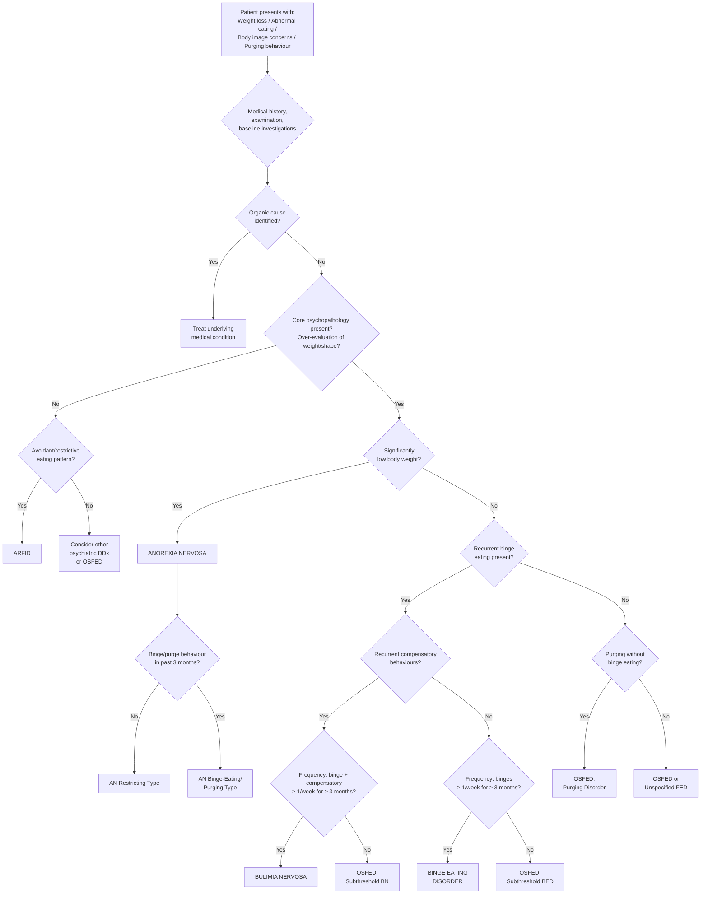

## Diagnostic Criteria, Algorithm, and Investigations for Eating Disorders

### 1. Diagnostic Criteria

The diagnosis of eating disorders is **clinical** — there is no blood test, imaging study, or biomarker that confirms the diagnosis. Instead, we use structured criteria from the DSM-5 (primary) and ICD-10/ICD-11 (supplementary) to ensure systematic, reproducible diagnosis. Investigations serve two purposes: (1) **excluding medical differentials** and (2) **assessing medical complications/severity**.

---

#### 1.1 Anorexia Nervosa — Diagnostic Criteria

##### DSM-5 Criteria [2]

| Criterion | Description | Why This Criterion Exists |
|---|---|---|
| **A. Restriction of energy intake** | Restriction of energy intake relative to requirements, leading to a **significantly low body weight** in the context of age, sex, developmental trajectory, and physical health. Defined as a weight less than **minimally normal** (adults) or **less than minimally expected** (children/adolescents) | This captures the behavioural consequence of the core psychopathology — the patient acts on their fear of fatness by restricting. "Significantly low" replaces the old rigid BMI cut-off, allowing clinical judgment |
| **B. Fear of weight gain** | **Intense fear of gaining weight or of becoming fat**, or **persistent behaviour that interferes with weight gain**, even though at a significantly low weight | This is the motivational engine. Note the DSM-5 addition of "persistent behaviour that interferes with weight gain" — this captures patients who deny fear of fatness (as seen in some Hong Kong/Asian non-fat-phobic AN patients) but whose behaviour clearly demonstrates resistance to weight restoration |
| **C. Body image disturbance** | **Disturbance in the way in which one's body weight or shape is experienced**, **undue influence of body weight or shape on self-evaluation**, or **persistent lack of recognition of the seriousness of current low body weight** | This is the cognitive distortion component — the patient either perceives themselves as fat (perceptual distortion), bases their entire self-worth on weight/shape (cognitive distortion), or simply does not recognise the danger (anosognosia) |

**Subtypes** (specify based on past 3 months) [2]:
- **Restricting type:** No recurrent binge-eating or purging. Weight loss accomplished primarily through **dieting, fasting, and/or excessive exercise**
- **Binge-eating/Purging type:** Recurrent episodes of **binge eating or purging behaviour** (self-induced vomiting, laxative/diuretic/enema misuse)

**Severity specifiers** (based on BMI for adults; adapted for children using BMI percentiles) [2]:

| Severity | BMI |
|---|---|
| **Mild** | ≥ 17 kg/m² |
| **Moderate** | 16–16.99 kg/m² |
| **Severe** | 15–15.99 kg/m² |
| **Extreme** | < 15 kg/m² |

**Remission specifiers** [2]:
- **Partial remission:** After full criteria previously met, criterion A (low body weight) has not been met for a sustained period but either criterion B or C is still met
- **Full remission:** None of the criteria have been met for a sustained period

##### ICD-10 Criteria (F50.0) [2]

For a definite diagnosis, **all** of the following are required:

| Criterion | Description |
|---|---|
| **(a) Low body weight** | Body weight maintained **≥ 15% below expected**, or **BMI ≤ 17.5**. Pre-pubertal patients may show failure to make expected weight gain during period of growth |
| **(b) Self-induced weight loss** | By avoidance of "fattening food." ≥ 1 of: self-induced vomiting, self-induced purging, excessive exercise, use of appetite suppressants and/or diuretics |
| **(c) Body image distortion** | Specific psychopathology whereby a **dread of fatness** persists as an **intrusive, overvalued idea** and the patient imposes a **low weight threshold** on himself/herself |
| **(d) Endocrine disorder** | Widespread endocrine disorder involving the HPG axis: **amenorrhoea** in women, **loss of sexual interest and potency** in men. Also ↑ GH, ↑ cortisol, changes in thyroid metabolism, abnormalities in insulin secretion |
| **(e) Pubertal delay** | If onset is pre-pubertal, the sequence of pubertal events is delayed or arrested. With recovery, puberty is often completed normally but menarche is late |

<Callout title="DSM-5 vs ICD-10: Key Differences for AN" type="idea">
Three important changes from ICD-10 to DSM-5 [2]:
1. **Amenorrhoea removed from DSM-5 criteria** — because (a) it excludes male patients, pre-menarchal girls, and post-menopausal women, (b) some patients develop amenorrhoea only late, and (c) patients on oral contraceptives may continue to have withdrawal bleeds. It still occurs and is clinically important, but is no longer required for diagnosis.
2. **DSM-5 added "persistent behaviour that interferes with weight gain"** as an alternative to criterion B — this captures non-fat-phobic AN (relevant to HK/Asian populations who restrict for somatic reasons rather than fat-phobia).
3. **DSM-5 uses flexible "significantly low weight"** rather than the rigid "15% below expected" / "BMI ≤ 17.5" threshold — allowing clinical judgment for context (e.g., a previously obese patient who has lost 30% of body weight but still has BMI > 17.5 may qualify).
</Callout>

---

#### 1.2 Bulimia Nervosa — Diagnostic Criteria

##### DSM-5 Criteria [2]

| Criterion | Description | Why This Criterion Exists |
|---|---|---|
| **A. Recurrent binge eating** | Characterised by both: (1) Eating, in a discrete period of time (e.g., **≤ any 2-hour period**), an amount of food that is **definitely larger than what most individuals would eat** in a similar period under similar circumstances; (2) A **sense of lack of control** over eating during the episode | The binge must be both objectively large AND subjectively uncontrolled. This excludes "subjective binges" where the patient feels out of control but the amount is not objectively excessive (those fall under OSFED) |
| **B. Compensatory behaviours** | Recurrent inappropriate compensatory behaviours to prevent weight gain: **self-induced vomiting; misuse of laxatives, diuretics, or other medications; fasting; or excessive exercise** | Without compensation, this would be BED. The compensation is what drives the vicious cycle of BN and causes most of its medical complications |
| **C. Duration/frequency** | Binge eating and compensatory behaviours both occur, on average, **≥ 1/week for 3 months** | This threshold prevents over-diagnosis of isolated episodes. DSM-IV required 2/week — DSM-5 lowered this to capture more cases |
| **D. Self-evaluation** | **Self-evaluation is unduly influenced by body shape and weight** | The shared core psychopathology with AN — this is what distinguishes BN from other causes of binge eating |
| **E. Not during AN** | The disturbance does not occur **exclusively during episodes of anorexia nervosa** | If the patient meets criteria for AN (significantly low weight), they are diagnosed with AN binge-eating/purging subtype, NOT BN. AN "trumps" BN diagnostically |

**Severity specifiers** (based on frequency of compensatory behaviours per week) [2]:

| Severity | Compensatory behaviours/week |
|---|---|
| **Mild** | 1–3 |
| **Moderate** | 4–7 |
| **Severe** | 8–13 |
| **Extreme** | ≥ 14 |

**Remission specifiers** [2]:
- **Partial remission:** After full criteria previously met, some but not all criteria met for a sustained period
- **Full remission:** None of the criteria met for a sustained period

##### ICD-10 Criteria (F50.2) [2]

For a definite diagnosis, all of the following are required:

| Criterion | Description |
|---|---|
| **(a) Binge eating** | Persistent preoccupation with eating and irresistible craving for food; patient succumbs to episodes of overeating in which **large amounts of food are consumed in short periods of time** |
| **(b) Compensatory behaviour** | Patient attempts to counteract the "fattening" effects of food by ≥ 1 of: self-induced vomiting, purgative abuse, alternating periods of starvation, use of drugs (appetite suppressants, thyroxine, diuretics). In DM patients, may choose to **neglect insulin treatment** |
| **(c) Psychopathology** | **Morbid dread of fatness** with a **sharply defined weight threshold**, well below the premorbid weight that constitutes the optimum/healthy weight. There is often but not always a **history of earlier AN** (interval ranging from months to years) — may have been fully expressed or cryptic with moderate weight loss and/or transient amenorrhoea |

<Callout title="ICD-10 Recognises 'Diabulimia'" type="idea">
Note that ICD-10 criterion (b) specifically mentions that **diabetic patients may neglect their insulin medications** as a form of compensatory behaviour. This is sometimes called "diabulimia" — deliberate insulin omission to induce glycosuria and weight loss. This carries extremely high mortality and must be actively screened for in T1DM patients with unexplained weight loss, recurrent DKA, or poor glycaemic control [2].
</Callout>

---

#### 1.3 Binge Eating Disorder — Diagnostic Criteria (DSM-5)

| Criterion | Description |
|---|---|
| **A. Recurrent binge eating** | Same definition as BN criterion A: (1) objectively large amount in a discrete period; (2) sense of loss of control |
| **B. Associated features** | Binge episodes associated with ≥ 3 of: (1) eating much more **rapidly** than normal; (2) eating until **uncomfortably full**; (3) eating large amounts when **not physically hungry**; (4) eating **alone** due to embarrassment; (5) feeling **disgusted, depressed, or very guilty** afterward |
| **C. Marked distress** | Marked distress regarding binge eating is present |
| **D. Duration/frequency** | Occurs, on average, **≥ 1/week for 3 months** |
| **E. No compensation** | The binge eating is **NOT associated with recurrent inappropriate compensatory behaviours** (unlike BN) and does not occur exclusively during AN or BN |

**Severity specifiers** (based on binge episodes/week):
| Severity | Binge episodes/week |
|---|---|
| Mild | 1–3 |
| Moderate | 4–7 |
| Severe | 8–13 |
| Extreme | ≥ 14 |

> **Key conceptual point:** BED is distinguished from BN by the **absence of compensatory behaviours**. Think of it this way: in BN, the patient binges AND compensates (creating the vicious cycle); in BED, the patient binges but does NOT compensate → weight tends to increase → strong association with obesity.

---

#### 1.4 ARFID — Diagnostic Criteria (DSM-5)

| Criterion | Description |
|---|---|
| **A. Eating/feeding disturbance** | Apparent lack of interest in eating or food; avoidance based on sensory characteristics of food; concern about aversive consequences of eating — leading to persistent failure to meet nutritional/energy needs, as manifested by ≥ 1 of: significant weight loss, significant nutritional deficiency, dependence on enteral feeding/oral supplements, marked interference with psychosocial functioning |
| **B. Not explained by** | Not better explained by lack of available food or culturally sanctioned practice |
| **C. Not during AN/BN** | Does not occur exclusively during AN or BN, and there is **no evidence of disturbance in the way body weight or shape is experienced** |
| **D. Not due to medical/psychiatric condition** | Not attributable to a concurrent medical condition or better explained by another mental disorder |

---

#### 1.5 OSFED — Examples (DSM-5) [2]

OSFED captures clinically significant eating disorder presentations that **do not meet full criteria** for AN, BN, or BED:

| Category | Description |
|---|---|
| **Atypical anorexia nervosa** | All criteria for AN met EXCEPT weight remains within or above the normal range despite significant weight loss |
| **Subthreshold BN** | Binge eating and compensatory behaviours occur < 1/week or for < 3 months |
| **Subthreshold BED** | Binge eating occurs < 1/week or for < 3 months |
| **Purging disorder** | Recurrent purging to influence weight/shape in the absence of binge eating |
| **Night eating syndrome** | Recurrent episodes of night eating (eating after awakening from sleep or excessive food consumption after evening meal), causing distress, not explained by external influences or another disorder |

<Callout title="Atypical AN — Don't Be Fooled by 'Normal' BMI" type="error">
Atypical AN is extremely important and commonly missed. A patient who has dropped from BMI 32 to BMI 22 — technically "normal" — may have lost a massive amount of weight through pathological restriction, has all the cognitive features of AN, and may develop the same dangerous medical complications (electrolyte disturbance, bradycardia, QT prolongation). The DSM-5 move away from rigid BMI cut-offs was partly to address this. Always assess the trajectory and percentage of weight lost, not just the absolute number.
</Callout>

---

### 2. Diagnostic Algorithm

The following algorithm outlines the systematic approach to diagnosing eating disorders, from initial presentation through to subtype classification.

> **Note the hierarchical logic:** AN "trumps" BN — if the patient is significantly underweight AND binge-purging, they have AN binge-eating/purging subtype, NOT BN. This is because the starvation state in AN fundamentally changes the medical risk profile and treatment approach [2].

---

### 3. Clinical Assessment Framework

Before discussing investigations, remember that the assessment of eating disorders involves three parallel tracks [2]:

| Track | Purpose | Key Components |
|---|---|---|
| **1. Eating History** | Establish the diagnosis | Eating pattern, restriction, binging, purging, exercise habits, food rituals, weight history [2] |
| **2. Psychological Assessment** | Assess core psychopathology and comorbidities | Attitude to weight/shape, body image disturbance, motivation, insight, formulation (3P model: predisposing, precipitating, perpetuating factors), mood, anxiety, suicidality, self-harm [2] |
| **3. Risk Assessment** | Determine severity, setting of care, and urgency | Medical risk (vitals, BMI, ECG, electrolytes), suicide risk, current BMI category, physical examination [2] |

### 3.1 BMI-Based Risk Stratification [2]

This framework from the senior notes maps BMI to expected clinical consequences and guides the setting of care:

| BMI Category | Clinical Significance | Setting |
|---|---|---|
| **17.5–20** (Underweight) | Irregular or absent menstruation, ovulation failure | Outpatient if stable |
| **15–17.5** (AN range) | Amenorrhoea, loss of substance from all body organs and structures | Outpatient (if > 16 and no physical complications) |
| **13.5–15** (Severe AN) | All organ systems compromised (bone, heart, muscle, brain) | Day-patient (BMI 14–16 without complications) |
| **12–13.5** (Critical AN) | Organs begin to fail (marrow, muscle, heart) — **inpatient treatment recommended** | Inpatient |
| **< 12** (Life-threatening AN) | Imminent risk of death | **Emergency inpatient** |

### 3.2 Criteria for Inpatient Admission [2]

Inpatient care is indicated when there is:

| Domain | Specific Alert Criteria |
|---|---|
| **General** | **BMI < 14 kg/m²**, Temperature < 35.5°C |
| **Cardiovascular** | **HR < 40 bpm**, BP < 80/50 mmHg, postural hypotension > 20 mmHg, postural tachycardia (increase > 20 bpm), arrhythmia, **QTc > 450 msec** |
| **Biochemical** | **K⁺ < 2.5 mmol/L**, **glucose < 2.5 mmol/L** ("hypoGly < 4" for concern level), phosphate < 0.5, Na⁺ < 130, Mg²⁺ < 0.5, neutropenia |
| **Psychiatric** | Active suicidal ideation, severe self-harm, inability to cooperate with outpatient treatment |

---

### 4. Investigations

Investigations in eating disorders serve **three purposes**:
1. **Exclude medical differentials** (is this AN or hypothalamic tumour?)
2. **Assess severity of medical complications** (how much damage has starvation/purging caused?)
3. **Monitor during treatment** (refeeding syndrome surveillance, response to treatment)

#### 4.1 Baseline Laboratory Investigations

| Investigation | Expected Findings in AN | Expected Findings in BN | Pathophysiological Explanation | Alert Values [2] |
|---|---|---|---|---|
| **FBC** | Normocytic normochromic anaemia, mild leucopenia with relative lymphocytosis, thrombocytopenia [2] | Usually normal unless severe purging | Starvation → gelatinous bone marrow transformation → ↓ haematopoiesis across all lineages. Lymphocytes are relatively preserved because they are long-lived cells that depend less on marrow output | Neutropenia (absolute count) |
| **Potassium (K⁺)** | May be low if purging subtype | **↓↓** (most dangerous finding) | Vomiting: loss of HCl → metabolic alkalosis → renal K⁺ wasting. Laxatives: direct K⁺ loss in stool. Diuretics: renal K⁺ loss | Concern: **< 3.5**; Alert: **< 3.0** [2] |
| **Sodium (Na⁺)** | ↓ (dilutional from water loading, or dehydration) | ↓ (laxative/diuretic misuse) | Excess free water intake (some AN patients water-load before weigh-ins), or renal/GI sodium losses from purging | Concern: **< 135**; Alert: **< 130** [2] |
| **Magnesium (Mg²⁺)** | ↓ | ↓ (purging) | Poor dietary intake + GI/renal losses from purging. Important because hypoMg²⁺ prevents correction of hypoK⁺ (Mg²⁺ is required for the Na⁺/K⁺-ATPase pump) | Concern: **0.5–0.7**; Alert: **< 0.5** [2] |
| **Phosphate (PO₄³⁻)** | ↓ (especially during refeeding) | Usually normal | Intracellular phosphate is depleted in chronic starvation but serum levels may appear normal because phosphate shifts extracellularly. During refeeding, insulin surge drives phosphate back intracellularly → **precipitous drop → refeeding syndrome** | Concern: **0.5–0.8**; Alert: **< 0.5** [2] |
| **Urea** | ↑ (dehydration) or ↓ (protein malnutrition) | ↑ (dehydration from purging) | Dehydration → pre-renal state → ↑ urea. Alternatively, very low protein intake → ↓ urea production | Concern: **> 7**; Alert: **> 10** [2] |
| **Glucose** | **↓↓** (hypoglycaemia) | Usually normal | Chronic caloric restriction → depleted hepatic glycogen stores → inability to maintain euglycaemia, especially during fasting | Concern: **< 3.5**; Alert: **< 2.5** [2] |
| **Albumin** | ↓ in severe/chronic cases | Usually normal | Protein malnutrition → ↓ hepatic albumin synthesis. Note: albumin may be falsely preserved if the patient is dehydrated (haemoconcentration) | Concern: **< 35**; Alert: **< 32** [2] |
| **Creatinine Kinase (CK)** | ↑ (if excessive exercise or severe muscle wasting) | Usually normal | Skeletal muscle breakdown (rhabdomyolysis from excessive exercise, or from muscle catabolism in starvation) → release of CK into blood | Concern: **> 170**; Alert: **> 250** [2] |

#### 4.2 Liver Function Tests

| Test | Expected Findings | Explanation | Alert Values [2] |
|---|---|---|---|
| **Bilirubin** | ↑ in severe starvation | Starvation-related hepatocellular damage (autophagy) or haemolysis | Concern: > 20; Alert: **> 40** |
| **ALP** | ↑ | Bone turnover (osteoporosis) or hepatic cholestasis | Concern: > 110; Alert: **> 200** |
| **AST** | ↑ | Hepatocellular damage from starvation (hepatocyte autophagy) or from refeeding (hepatic steatosis) | Concern: > 40; Alert: **> 80** |
| **ALT** | ↑ | Same as AST — more liver-specific | Concern: > 45; Alert: **> 90** |
| **GGT** | ↑ | Hepatocellular damage, or concurrent alcohol use (common in BN) | Concern: > 45; Alert: **> 90** |

> **Why do transaminases rise in starvation?** When the body is starved, hepatocytes undergo autophagy (self-digestion of cellular components for energy). This cellular stress and damage releases AST/ALT into the bloodstream. Paradoxically, transaminases can also rise during refeeding because rapid carbohydrate provision causes hepatic steatosis (fat deposition in the liver).

#### 4.3 Endocrine Investigations

| Test | Expected Findings in AN | Explanation |
|---|---|---|
| **LH, FSH, Oestradiol / Testosterone** | All ↓ (hypogonadotropic hypogonadism) [2] | Hypothalamic GnRH suppression from energy deficit → ↓ pituitary gonadotropins → ↓ sex steroids. This is functional and reversible with weight restoration |
| **TFTs** | ↓ T3 (sometimes ↓ T4), normal TSH — "low T3 syndrome" / sick euthyroid syndrome [2] | Peripheral conversion of T4 → T3 is reduced as an adaptive mechanism to conserve energy (↓ metabolic rate). TSH remains normal because this is a peripheral adaptation, not primary thyroid disease. **Do NOT treat with thyroxine** — this is appropriate physiology |
| **Cortisol** | ↑; dexamethasone non-suppression [2] | Chronic starvation = physiological stress → ↑ HPA axis activation → ↑ CRH → ↑ ACTH → ↑ cortisol. The non-suppression mimics Cushing's syndrome (pseudo-Cushing's) but resolves with refeeding |
| **Growth Hormone** | ↑ GH, ↓ IGF-1 [2] | GH resistance in starvation: GH is elevated but IGF-1 (produced by the liver in response to GH) is low because the malnourished liver cannot respond to GH signalling. In pre-pubertal patients, this results in growth failure |
| **Prolactin** | Usually normal | Helps exclude prolactinoma as a cause of amenorrhoea |

<Callout title="The 'Starvation Endocrinopathy' — Don't Treat It, Feed It" type="error">
A common mistake is to see the endocrine abnormalities in AN (↓ sex hormones, ↓ T3, ↑ cortisol, ↑ GH) and start hormone replacement or thyroid medication. **All of these are adaptive responses to starvation and will normalise with weight restoration.** Giving thyroxine to a starving patient is actively dangerous (↑ metabolic rate → accelerated catabolism). Giving oestrogen does not protect bone — only weight restoration does that.
</Callout>

#### 4.4 Electrocardiogram (ECG)

| Finding | Pathophysiology | Clinical Significance [2] |
|---|---|---|
| **Sinus bradycardia** | ↓ Metabolic demand → ↑ vagal tone; ↓ cardiac muscle mass | Concern: **HR < 50**; Alert: **HR < 40** [2] |
| **QT prolongation** | Electrolyte disturbance (hypoK⁺, hypoMg²⁺, hypoCa²⁺) → delayed ventricular repolarisation | Alert: **QTc > 450 msec** → risk of torsades de pointes → VF → sudden cardiac death [2] |
| **U waves** | HypoK⁺ → delayed repolarisation of the Purkinje fibres → small deflection after the T wave | Marker of hypoK⁺ |
| **ST segment depression, T wave flattening/inversion** | HypoK⁺ effects on cardiac repolarisation | Non-specific but corroborates electrolyte disturbance |
| **Arrhythmias** | Electrolyte imbalance + structural cardiac changes (myocardial fibrosis from starvation) | Any arrhythmia = **Alert** [2] |

> **Why is the ECG so important?** Because **sudden cardiac death** is a leading cause of mortality in AN. The combination of structural cardiac changes (↓ cardiac mass, myocardial fibrosis) + electrolyte disturbances (hypoK⁺, hypoMg²⁺) + QT prolongation creates a perfect substrate for fatal arrhythmias. An ECG should be performed **at every clinical encounter** in severe AN.

#### 4.5 Bone Densitometry (DEXA Scan)

| Finding | Pathophysiology | Clinical Significance |
|---|---|---|
| **Osteopenia** (T-score −1.0 to −2.5) or **Osteoporosis** (T-score ≤ −2.5) [2] | Multifactorial: (1) ↓ oestrogen → ↑ osteoclast activity; (2) ↑ cortisol → ↓ osteoblast activity; (3) ↓ IGF-1 → ↓ bone formation; (4) ↓ dietary calcium/vitamin D; (5) ↓ mechanical loading if excessive exercise is not weight-bearing | Osteoporosis in AN can develop within **6–12 months** of amenorrhoea. May be partially irreversible. Indicated for any patient with AN for > 6–12 months or with history of fragility fracture |

#### 4.6 Investigations to Exclude Medical Differentials [2]

| Investigation | What It Excludes |
|---|---|
| **TFTs** | Hyperthyroidism (↑ T4/T3, ↓ TSH) — a medical cause of weight loss with anxiety |
| **ESR / CRP** | Inflammatory conditions (IBD, chronic infection, malignancy) — AN typically has normal inflammatory markers |
| **Coeliac screen** (anti-tTG, anti-EMA) | Coeliac disease — cause of malabsorption and weight loss |
| **Blood glucose / HbA1c** | Diabetes mellitus — weight loss from insulin deficiency |
| **Morning cortisol / short Synacthen test** | Addison's disease — weight loss, fatigue, hypotension (but with ↑ K⁺ and hyperpigmentation) |
| **MRI Brain** | Hypothalamic/pituitary tumours — indicated for atypical presentations |

> These are essentially the same investigations listed in the differential diagnosis section but are worth repeating here to emphasise: **every new diagnosis of AN should have baseline TFTs and ESR/CRP at minimum to exclude common medical mimics** [2].

#### 4.7 Additional Investigations for BN

| Investigation | Expected Findings | Explanation |
|---|---|---|
| **Serum amylase** | ↑ (specifically salivary isoamylase) | Chronic parotid stimulation from repeated vomiting → parotid hypertrophy → ↑ salivary amylase release. Can be used as a **biomarker of purging activity** (if the patient denies vomiting) |
| **Venous blood gas / Serum bicarbonate** | **Metabolic alkalosis** (vomiting) or **metabolic acidosis** (laxative misuse) | Vomiting → HCl loss → ↑ HCO₃⁻ → alkalosis. Laxatives → HCO₃⁻-rich intestinal secretion loss → acidosis |
| **Urine specific gravity** | ↑ (concentrated — dehydration) or ↓ (dilute — water loading) | Helps assess hydration status and detect water loading (a behaviour where patients drink large volumes before weigh-ins to appear heavier) |
| **Urine electrolytes / laxative screen** | May detect surreptitious laxative or diuretic use | Useful when the clinical picture (e.g., metabolic alkalosis with hypoK⁺) suggests purging but the patient denies it |

#### 4.8 Screening Tools

While formal diagnosis uses DSM-5/ICD criteria, screening questionnaires can aid in early detection:

| Tool | Description |
|---|---|
| **SCOFF Questionnaire** | 5 questions: **S**ick (do you make yourself sick?), **C**ontrol (do you worry about loss of control?), **O**ne stone (have you lost > 1 stone/6.35 kg in 3 months?), **F**at (do you believe you are fat?), **F**ood (does food dominate your life?). ≥ 2 "yes" answers = positive screen |
| **EAT-26** (Eating Attitudes Test) | 26-item self-report questionnaire; score ≥ 20 suggests disordered eating |
| **EDE-Q** (Eating Disorder Examination Questionnaire) | Gold-standard self-report measure of eating disorder psychopathology |

---

### 5. Summary: Comprehensive Investigation Panel for Eating Disorders

| Category | Tests | Key Findings |
|---|---|---|
| **Haematology** | FBC | Pancytopenia (marrow suppression) [2] |
| **Biochemistry** | UEC, Ca²⁺, Mg²⁺, PO₄³⁻ | HypoK⁺, hypoNa⁺, hypoMg²⁺, hypoPO₄ [2] |
| **Metabolic** | Glucose, albumin, cholesterol, carotene, CK | Hypoglycaemia, hypoalbuminaemia, ↑ cholesterol, ↑ carotene [2] |
| **Liver** | LFTs (Bili, ALP, AST, ALT, GGT) | Starvation hepatitis [2] |
| **Endocrine** | TFTs, LH/FSH, oestradiol/testosterone, cortisol, GH/IGF-1 | Low T3 syndrome, hypogonadism, ↑ cortisol, ↑ GH / ↓ IGF-1 [2] |
| **Cardiac** | ECG | Bradycardia, QT prolongation, U waves, arrhythmias [2] |
| **Purging markers** | Amylase, VBG/HCO₃⁻, urine electrolytes | ↑ Salivary amylase, metabolic alkalosis/acidosis |
| **Bone** | DEXA scan | Osteopenia/osteoporosis [2] |
| **Differential diagnosis** | TFTs, ESR/CRP, coeliac screen, glucose/HbA1c | Exclude organic causes [2] |

---

<Callout title="High Yield Summary — Diagnosis and Investigations">

1. **AN diagnosis (DSM-5):** Three criteria — (A) significantly low weight from energy restriction, (B) intense fear of weight gain OR persistent behaviour interfering with weight gain, (C) body image disturbance / undue influence of weight on self-evaluation / lack of recognition of seriousness. Subtypes: restricting vs binge-eating/purging. Severity by BMI (mild ≥ 17, extreme < 15).

2. **BN diagnosis (DSM-5):** Five criteria — (A) recurrent binge eating (large amount + loss of control), (B) recurrent compensatory behaviours, (C) ≥ 1/week for ≥ 3 months, (D) self-evaluation unduly influenced by weight/shape, (E) does not occur exclusively during AN. Severity by compensatory behaviour frequency/week.

3. **BED vs BN:** Both have binge eating; BED has NO compensatory behaviours.

4. **AN vs ARFID:** Both have low weight; AN has body image distortion / fat-phobia; ARFID does not.

5. **DSM-5 removed amenorrhoea** from AN criteria (but it still occurs clinically). DSM-5 added "persistent behaviour interfering with weight gain" to capture non-fat-phobic AN.

6. **Key investigations and alert values:** K⁺ < 3.0, PO₄ < 0.5, glucose < 2.5, HR < 40, QTc > 450 msec, BMI < 14, temperature < 35.5°C → urgent intervention / inpatient.

7. **Starvation endocrinopathy:** ↓ T3, ↓ LH/FSH/sex steroids, ↑ cortisol, ↑ GH / ↓ IGF-1 — all resolve with refeeding. Do NOT treat with hormones.

8. **Vomiting → ↑ salivary amylase + metabolic alkalosis; laxatives → metabolic acidosis.**

9. **SCOFF mnemonic** for screening: Sick, Control, One stone, Fat, Food.

</Callout>

---

<ActiveRecallQuiz
  title="Active Recall - Diagnostic Criteria, Algorithm, and Investigations"
  items={[
    {
      question: "List the three DSM-5 diagnostic criteria for anorexia nervosa and explain what DSM-5 changed from ICD-10 regarding amenorrhoea.",
      markscheme: "A: Restriction of energy intake leading to significantly low body weight. B: Intense fear of weight gain or persistent behaviour interfering with weight gain. C: Body image disturbance, undue influence of weight/shape on self-evaluation, or lack of recognition of seriousness. DSM-5 removed amenorrhoea because it excludes males, pre-menarchal girls, postmenopausal women, and those on contraceptives."
    },
    {
      question: "A patient has recurrent binge eating with self-induced vomiting 5 times per week for 4 months, BMI 22, and judges her self-worth entirely by her weight. What is the diagnosis, subtype, and severity?",
      markscheme: "Bulimia Nervosa, moderate severity (4-7 compensatory behaviours per week). Not AN because BMI is not significantly low. Meets all 5 DSM-5 criteria: recurrent binges with loss of control, recurrent compensatory behaviour (vomiting), frequency at least 1/week for at least 3 months, self-evaluation unduly influenced by weight/shape, not during AN."
    },
    {
      question: "Explain why serum phosphate may appear normal in a chronically starved AN patient but then plummet dangerously during refeeding.",
      markscheme: "In chronic starvation, intracellular phosphate stores are severely depleted but serum phosphate may be maintained by extracellular shift and reduced renal clearance. During refeeding, carbohydrate intake triggers insulin secretion, which drives phosphate (along with glucose and potassium) intracellularly for glycolysis and ATP synthesis, causing a precipitous drop in serum phosphate - this is refeeding syndrome."
    },
    {
      question: "A patient with AN has low T3, normal TSH, and low oestradiol. Should you start thyroxine and HRT? Explain your reasoning.",
      markscheme: "No. These are adaptive responses to starvation (low T3 syndrome and functional hypogonadotropic hypogonadism). Giving thyroxine would increase metabolic rate and accelerate catabolism, which is dangerous. Giving oestrogen does not protect bone in the context of ongoing malnutrition. All endocrine abnormalities normalise with weight restoration. Treatment is nutritional rehabilitation, not hormone replacement."
    },
    {
      question: "Name 4 specific alert-level criteria that mandate inpatient admission for AN.",
      markscheme: "Any 4 of: BMI less than 14, heart rate less than 40 bpm, blood pressure less than 80/50 mmHg, QTc greater than 450 msec, potassium less than 3.0 (or less than 2.5), glucose less than 2.5, phosphate less than 0.5, temperature less than 35.5 degrees Celsius, arrhythmia on ECG, neutropenia."
    },
    {
      question: "What does the SCOFF screening questionnaire stand for, and what score is considered a positive screen?",
      markscheme: "S = Sick (do you make yourself sick), C = Control (worry about loss of control over eating), O = One stone (lost more than one stone / 6.35 kg in 3 months), F = Fat (do you believe you are fat), F = Food (does food dominate your life). Score of 2 or more yes answers is a positive screen."
    }
  ]}
/>

## References

[2] Senior notes: ryanho-psych.md (Sections 9.1, 9.1.1, 9.1.2 — Eating Disorders, Anorexia Nervosa diagnostic criteria, Bulimia Nervosa diagnostic criteria, investigation tables, risk assessment, and differential diagnosis)
