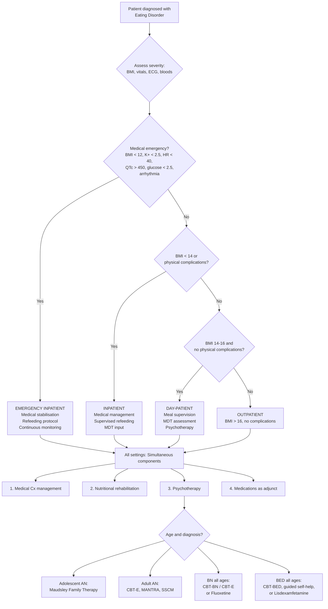

## Management of Eating Disorders

### 1. Principles of Management

The management of eating disorders follows **four fundamental components**, delivered simultaneously and adapted to the severity, setting, and specific diagnosis [2]:

1. **Management of medical complications** — the acute life-saving priority
2. **Nutritional rehabilitation** — restoring weight and normalising eating patterns
3. **Education and psychotherapy** — the mainstay of long-term treatment
4. **Medications** — as adjunct only, with limited evidence in most contexts

The overarching principle is this: **eating disorders are ego-syntonic** (especially AN), meaning the patient often does not want treatment. The therapeutic approach must therefore be **empathic, non-judgmental, and motivational** — you cannot simply tell a patient with AN to eat more, just as you cannot tell a patient with a phobia to stop being afraid. You must work with their ambivalence [2].

> **"The patient is often ambivalent or reluctant — offer an empathic approach"** [2]. This is not soft psychiatry — it is evidence-based. Confrontational approaches increase dropout rates and worsen outcomes.

---

### 2. Management Algorithm

---

### 3. Setting of Care

The setting of care is determined by **BMI and the presence of physical complications** — this is a crucial decision because it determines the intensity of monitoring and the feasibility of treatment [2].

| Setting | Criteria | Rationale |
|---|---|---|
| ***Inpatient*** | **BMI ≤ 14** or physical complications: **K⁺ < 2.5**, arrhythmia, **hypoglycaemia < 4** (alert < 2.5), **HR < 40**, **↑ QTc** ( > 450 msec), active suicidality, failed outpatient treatment | At this level of malnutrition, organ failure is imminent or present. Refeeding must be supervised to prevent refeeding syndrome. Continuous cardiac monitoring is essential. Psychiatric risk (suicide) is also very high in this population [2] |
| ***Day-patient*** | **BMI 14–16** and no physical complications | Patient is medically stable enough not to require 24-hour monitoring, but still needs **meal supervision** and **multidisciplinary assessment** in a structured environment [2] |
| ***Outpatient*** | **BMI > 16** and no physical complications | The majority of eating disorder patients can be managed as outpatients. This requires adequate motivation (or at least ambivalence that can be worked with), a safe home environment, and access to specialist services [2] |

<Callout title="When to Admit — The Critical Numbers" type="error">
Memorise these alert values — they determine immediate life-saving decisions [2]:
- **BMI < 14 kg/m²** → inpatient
- **HR < 40 bpm** → inpatient
- **K⁺ < 2.5 mmol/L** → urgent correction
- **QTc > 450 msec** → cardiac monitoring
- **Glucose < 2.5 mmol/L** → emergency
- **Temperature < 35.5°C** → inpatient
- Any **arrhythmia** → cardiac monitoring
- **Neutropenia** → infection risk
</Callout>

---

### 4. Component 1: Management of Medical Complications

Medical stabilisation is the **first priority** — you cannot do psychotherapy with a patient who is about to have a cardiac arrest.

#### 4.1 Acute Medical Emergencies

| Emergency | Management | Rationale |
|---|---|---|
| **Severe hypokalaemia** (K⁺ < 2.5) | IV potassium chloride (max 40 mmol/hr via central line; 10–20 mmol/hr peripherally), cardiac monitoring | HypoK⁺ → QT prolongation → torsades de pointes → VF → death. Must also correct hypoMg²⁺ simultaneously (Mg²⁺ is needed for Na⁺/K⁺-ATPase function; hypoK⁺ is refractory to correction without Mg²⁺ repletion) |
| **Severe hypoglycaemia** (glucose < 2.5) | IV dextrose (50 mL of 50% dextrose), then maintenance dextrose infusion; transition to supervised oral intake | Depleted hepatic glycogen cannot maintain euglycaemia. IV dextrose provides immediate substrate |
| **Cardiac arrhythmia / QT prolongation** | Continuous telemetry, correct electrolytes (K⁺, Mg²⁺, Ca²⁺), withhold QT-prolonging medications | The arrhythmia substrate is electrolyte-driven — correct the cause |
| **Severe bradycardia** (HR < 40) | Bed rest (to reduce metabolic demand), continuous monitoring, consider atropine if haemodynamically unstable | Starvation bradycardia is usually vagally mediated and benign, but at HR < 40 there is risk of asystole or unstable rhythms |
| **Hypothermia** (Temp < 35.5°C) | Active warming (warm blankets, warm IV fluids), treat underlying cause (starvation) | ↓ Metabolic rate → ↓ thermogenesis. Hypothermia itself can cause arrhythmias |

#### 4.2 Ongoing Medical Management

- **Daily monitoring** in inpatients: weight (after voiding, in hospital gown), vitals (HR, BP including postural, temperature), fluid balance
- **Regular blood tests:** UEC (especially K⁺, Mg²⁺, PO₄³⁻), glucose, LFTs — frequency depends on severity (daily in acute phase, then weekly)
- **ECG:** At baseline and whenever electrolytes change or clinical deterioration occurs
- **Management of osteoporosis:** Weight restoration is the **primary treatment** (normalises oestrogen, cortisol, IGF-1). Bisphosphonates are generally NOT recommended in young patients (teratogenic; long bone half-life). Calcium and vitamin D supplementation as adjunct. HRT does NOT protect bone in the absence of weight restoration
- **Dental review:** For patients with purging behaviour — fluoride rinse, avoid brushing immediately after vomiting (enamel is softened by acid)

---

### 5. Component 2: Nutritional Rehabilitation

This is the cornerstone of physical recovery. The goal is **controlled weight restoration** while avoiding **refeeding syndrome** — the most dangerous iatrogenic complication in eating disorder management.

#### 5.1 Refeeding Protocol

| Parameter | Recommendation | Rationale |
|---|---|---|
| **Starting caloric intake** | **Start low:** 5–10 kcal/kg/day (often ~1000 kcal/day for severe AN with BMI < 14); some guidelines support 1200–1500 kcal/day for less severe cases | Starting too high risks refeeding syndrome. Starting too low risks underfeeding syndrome (continued catabolism). Recent evidence suggests moderate initial caloric intake (1200–1500 kcal/day) may be safe with appropriate monitoring |
| **Rate of increase** | Increase by 200–300 kcal every 2–3 days | Gradual upward titration allows metabolic adaptation and monitoring for refeeding complications |
| **Target weight gain** | Inpatient: **0.5–1.0 kg/week**; outpatient: 0.25–0.5 kg/week | Faster gain risks fluid overload and refeeding syndrome. Slower gain prolongs the medical risk period |
| **Target BMI** | **BMI 19–20** as initial weight restoration goal (for return of menses, normalisation of endocrine function) | Below this, the HPG axis remains suppressed and medical complications persist |
| **Route** | Oral feeding preferred (food, not supplements). Nasogastric (NG) feeding only if oral feeding fails or medical emergency | Oral feeding is both nutritionally and psychologically therapeutic — it directly addresses the behavioural component. NG feeding bypasses the psychological work but is sometimes necessary |

#### 5.2 Refeeding Syndrome

Refeeding syndrome is a **potentially fatal** constellation of metabolic derangements occurring when nutrition is re-introduced to a severely malnourished patient.

**Pathophysiology — Why does it happen?**

During starvation:
- The body switches from carbohydrate to fat/protein metabolism
- Intracellular stores of phosphate, potassium, magnesium, and thiamine are depleted
- Serum levels may appear normal (because of extracellular shift and reduced renal clearance)

When carbohydrate is re-introduced:
- **Insulin surges** (glucose → insulin release)
- Insulin drives **glucose, phosphate, potassium, and magnesium intracellularly** (for glycolysis, ATP synthesis, and protein synthesis)
- **Serum levels plummet** → hypophosphataemia (most characteristic), hypokalaemia, hypomagnesaemia
- **Thiamine (vitamin B1)** is a cofactor for glucose metabolism; increased glucose metabolism without adequate thiamine → **Wernicke's encephalopathy**
- Insulin also causes **renal sodium and water retention** → fluid overload → oedema, cardiac failure [2]

> The mnemonic for refeeding syndrome manifestations: **"PHASE"** — **P**hosphate low, **H**ypokalaemia, **A**rrhythmias, **S**odium/water retention (oedema), **E**ncephalopathy (Wernicke's from thiamine depletion)

**Prevention of refeeding syndrome** [2]:

| Measure | Rationale |
|---|---|
| **Thiamine supplementation** — give BEFORE refeeding (200–300 mg IV/oral daily for ≥ 5 days) | Thiamine is a cofactor for pyruvate dehydrogenase and transketolase. Carbohydrate loading without thiamine → Wernicke's encephalopathy (confusion, ophthalmoplegia, ataxia) |
| **Phosphate supplementation** — prophylactic oral phosphate; IV if serum PO₄ < 0.5 | Prevent the precipitous phosphate drop that is the hallmark of refeeding syndrome |
| **Start low, go slow** — caloric intake begins at 5–10 kcal/kg/day in high-risk patients | Limits the insulin surge that drives electrolytes intracellularly |
| **Daily monitoring** of PO₄, K⁺, Mg²⁺, Na⁺, glucose for at least the first 7–10 days | Catch derangements early before clinical deterioration |
| **Fluid restriction** in the first week (avoid IV fluids unless essential) | Refeeding causes sodium/water retention → fluid overload → cardiac failure. Restrict to ~20–30 mL/kg/day initially |
| **Correct electrolytes aggressively** before and during refeeding | Pre-existing depletion + refeeding-driven intracellular shift = dangerous drop |

<Callout title="Refeeding Syndrome — The Exam Favourite" type="error">
Refeeding syndrome is one of the highest-yield topics in eating disorder management. The key facts:
1. **Most characteristic finding:** Hypophosphataemia (PO₄ plummets when insulin drives phosphate intracellularly after carbohydrate reintroduction)
2. **Most dangerous consequence:** Cardiac arrhythmia / cardiac failure (from electrolyte disturbance + fluid overload)
3. **Prevention:** Thiamine BEFORE refeeding, start low go slow, daily electrolyte monitoring, prophylactic phosphate supplementation
4. **Risk group:** BMI < 14, very low/absent caloric intake for > 5 days, pre-existing electrolyte derangements [2]
</Callout>

#### 5.3 Behavioural Interventions Around Eating [2]

| Intervention | Mechanism / Rationale |
|---|---|
| ***Regular weighing*** | Provides objective feedback; helps both clinician and patient track progress. Usually 1–2x/week (not daily — daily fluctuations cause anxiety) [2] |
| ***Homework: food diary keeping and problem-solving*** | Self-monitoring of eating patterns, thoughts, and feelings around food. Identifies triggers for restriction/bingeing/purging. Provides data for CBT sessions [2] |
| ***Token economy and nurse supervision*** | Behavioural reinforcement: controlled weight gain rewarded with privileges (e.g., increased activity, visits). Supervised meals and snacks by nursing staff during and after meals (to prevent purging). MDT-supervised approach [2] |
| ***Supported eating*** | Repeated exposure to food and the act of eating to overcome anxiety. Based on extinction learning — repeated exposure without the feared consequence (weight gain is reframed) → gradual reduction in food-related anxiety [2] |
| ***Meal supervision*** | Extends supported eating to home and school environments by carers, school staff, or trusted friends. Ensures eating occurs and purging is prevented [2] |

> **Aim of behavioural interventions:** To **rebuild normal hunger and satiety signals** and **control over eating** → achieve **normal social eating** with the right amount and variety of food [2].

---

### 6. Component 3: Education and Psychotherapy — The Mainstay of Treatment

***Education and psychotherapy are the mainstay of treatment*** for eating disorders [2]. Medications have a limited role. The choice of psychotherapy depends on the diagnosis and the patient's age.

#### 6.1 Psychotherapy for Anorexia Nervosa

##### 6.1.1 Adolescent AN: Maudsley Family Therapy (Family-Based Treatment / FBT)

This is the **gold-standard first-line treatment for adolescent AN** — it has the strongest evidence base [2].

**Why family therapy for adolescents?**
- Adolescents live at home; the family is the primary environment where eating occurs
- AN in adolescents is conceptualised as a **family problem** — not blaming the family, but recognising that the family is the most powerful resource for change
- Parents are empowered as the agents of change (rather than the patient, who is ambivalent)

***Maudsley Family Therapy*** — divided into **3 phases** [2]:

| Phase | Focus | Duration | What Happens |
|---|---|---|---|
| ***Phase I: Weight restoration*** | Danger of severe malnutrition; assist parents in refeeding the child | Usually ~12 months | The therapist helps the family understand the medical danger. **Parents take full control of feeding** — they decide what, when, and how much the child eats. The child is temporarily "externalised" from the illness ("the eating disorder is making your daughter refuse food, not your daughter"). Family meals are observed and coached [2] |
| ***Phase II: Returning control to the adolescent*** | Starts when patient accepts parental authority over eating and weight is stabilising | Variable | Parents are encouraged to help the child **take more control over eating once again** — gradually and stepwise. The adolescent begins to make some food choices independently while parents remain involved [2] |
| ***Phase III: Establishing healthy adolescent identity*** | Starts when body weight normalises | Variable | Focus shifts from food and weight to **broader adolescent developmental issues** — identity, autonomy, peer relationships, academic life. Supports increased personal autonomy [2] |

**Outcomes:** Adolescent AN with FBT: ***60% well at 1 year, 90% well at 5 years*** [2] — the best outcomes of any treatment for any eating disorder.

##### 6.1.2 Adult AN: Individual Psychotherapies

For adults with AN, individual psychotherapy is superior to specialist or dietary treatment alone → **30% well at 1 year, 40–50% well at 5 years** [2].

| Therapy | Description | Mechanism |
|---|---|---|
| ***CBT-E*** **(Enhanced Cognitive Behavioural Therapy)** | The first **transdiagnostic** eating disorder therapy — can be used for AN, BN, BED, and OSFED [2] | Challenges **dysfunctional thoughts** (e.g., "If I eat this, I will become fat") and addresses **dysfunctional behaviours** (restriction, purging, body checking). Effective for **weight restoration and maintenance**. Also effective for BN [2] |
| ***MANTRA*** **(Maudsley Model of Anorexia Nervosa Treatment for Adults)** | Newer treatment specifically for adult AN [2] | Focuses on **underlying difficulties**: interpersonal difficulties, negative self-perception, experience of negative emotions. Uses **motivational interviewing**, **rolling with resistance**, **empowering** the patient. Addresses the maintenance factors of AN (perfectionism, cognitive rigidity, avoidance of emotion) [2] |
| **SSCM (Specialist Supportive Clinical Management)** | Combines clinical management (weight monitoring, nutritional advice) with supportive therapy | Addresses the patient's concerns in a non-prescriptive way while ensuring medical safety. Sometimes used as a comparison treatment in trials but is effective in its own right |
| **Other psychotherapies** | Interpersonal therapy, cognitive analytic therapy, acceptance and commitment therapy, cognitive remediation therapy [2] | Interpersonal therapy addresses relationship patterns; cognitive remediation targets cognitive rigidity (a core trait in AN — "set-shifting" difficulty) |

##### 6.1.3 Family Therapy Principles for AN (Beyond Maudsley)

- **Address underlying family issues behind AN** [2]
- Common family dynamics: enmeshment, overprotectiveness, rigidity, lack of conflict resolution
- The therapy is NOT about blaming the family — it is about **mobilising the family as a resource**

#### 6.2 Psychotherapy for Bulimia Nervosa

| Therapy | Description | Evidence |
|---|---|---|
| ***CBT-BN / CBT-E*** | First-line psychotherapy for BN [2][5] | Targets the vicious cycle: identifies triggers for bingeing, challenges distorted cognitions about weight/shape, develops alternative coping strategies, normalises eating patterns. Typically 16–20 sessions. Remission rates: ~40–50% |
| **Interpersonal Therapy (IPT)** | Focuses on interpersonal problems (grief, role disputes, role transitions, interpersonal deficits) that maintain the disorder [5] | Equally effective to CBT at long-term follow-up but slower to take effect. Good alternative for patients who do not respond to or cannot engage with CBT |
| **Guided self-help** | Based on CBT principles but delivered through a manual/workbook with limited therapist support | Cost-effective first step; may be sufficient for mild BN |

#### 6.3 Psychotherapy for Binge Eating Disorder

| Therapy | Description | Evidence |
|---|---|---|
| **CBT-BED** | Adapted CBT targeting binge eating without the purging cycle | First-line; reduces binge frequency but may not result in significant weight loss |
| **Guided self-help** | CBT-based workbook | Recommended as initial step (NICE guidelines) |
| **IPT** | Addresses interpersonal triggers for binge eating | Alternative to CBT |
| **Behavioural weight loss programmes** | Structured dietary and exercise interventions | Address obesity but may not address underlying psychological drivers; risk of triggering more restrictive eating |

#### 6.4 General Measures Across All Eating Disorders [2]

| Measure | Purpose |
|---|---|
| ***Basic psychoeducation*** | Explain the illness, its consequences, and treatment rationale to patient and family [2] |
| ***Involvement of multidisciplinary team:*** **nurse, dietician, clinical psychologist, occupational therapist, Red Cross Hospital School teachers, medical social worker** | Eating disorders require coordinated multi-professional input. No single discipline can address all aspects [2] |
| ***Liaison and support in school*** | BMI goal for returning to school (to ↓ risk of relapse); meal supervision by school staff or trusted friend; physical health monitoring [2] |
| **Self-help, support groups, day camps** | Peer support, normalisation, shared coping strategies [2] |
| **Online support** | Accessible, especially for patients with social anxiety [2] |
| **Day hospital support** | Meal supervision, multidisciplinary assessment for patients between inpatient and outpatient [2] |
| ***Peer support from recovered patients*** | Models of recovery; reduces hopelessness [2] |

---

### 7. Component 4: Medications

> ***Medications have a limited role in eating disorders*** and may be useful as an ***adjunct for severe cases or those refractory to psychotherapy*** [2]. Psychotherapy is ALWAYS the primary treatment.

#### 7.1 Medications in Anorexia Nervosa

| Medication | Mechanism | Efficacy | Indications | Contraindications / Cautions |
|---|---|---|---|---|
| ***Olanzapine*** | **↑ Appetite via anti-H₁ effect** (histamine H₁ receptor blockade in the hypothalamus removes the satiety-promoting effect of histamine → ↑ hunger). Also 5-HT₂A/₂C antagonism → may ↓ anxiety | ***↑ Weight gain, ↓ AN rumination, ↓ OC symptoms*** [2] | Adjunct in AN when psychotherapy alone is insufficient; particularly when there is severe anxiety, obsessional symptoms, or rumination about food/weight | Metabolic syndrome risk (but less relevant in underweight AN patients); QT prolongation risk (must correct electrolytes first); sedation (may be beneficial for insomnia in AN) |
| ***Other antipsychotics*** (e.g., **chlorpromazine**) | ↑ Appetite (anti-H₁ and anti-D₂ effects) | ***Little evidence for effect (no significant ↑ weight gain)*** [2] | Rarely used; historical use largely replaced by olanzapine | QT prolongation (chlorpromazine is a potent QT prolonger — dangerous in a population already at risk); postural hypotension; sedation |
| ***Antidepressants*** (e.g., **fluoxetine**) | SSRI: ↑ synaptic 5-HT by blocking SERT | ***Little evidence for effect in AN (no significant ↑ weight gain, no ↓ relapse rate)*** [2] | May be considered for comorbid depression or OCD AFTER weight restoration (SSRIs are ineffective in the malnourished state because tryptophan — the 5-HT precursor — is depleted in starvation; there is insufficient substrate for the drug to work on) | **Avoid in acute starvation** — ineffective due to ↓ tryptophan. Risk of QT prolongation (citalopram, escitalopram — avoid in hypoK⁺). Risk of hyponatraemia (SIADH) |

<Callout title="Why Don't SSRIs Work in Starving AN Patients?" type="idea">
SSRIs work by blocking the serotonin transporter (SERT), thereby increasing synaptic serotonin. But serotonin is synthesised from **tryptophan** (an essential amino acid obtained from dietary protein). In a starving patient, tryptophan levels are severely depleted → there is insufficient serotonin being produced for the SSRI to "keep" in the synapse. This is why SSRIs are ineffective during acute AN but may have a role AFTER weight restoration, when tryptophan levels normalise and serotonin synthesis resumes [2].
</Callout>

#### 7.2 Medications in Bulimia Nervosa

| Medication | Mechanism | Efficacy | Indications |
|---|---|---|---|
| **Fluoxetine 60 mg/day** | SSRI: ↑ synaptic 5-HT → ↓ binge-purge urges, ↓ impulsivity, ↑ satiety signalling, treats comorbid depression | **First-line pharmacotherapy for BN** (NICE-recommended). Reduces binge/purge frequency by ~50%. The dose required (60 mg) is higher than for depression (20 mg) — likely because the serotonergic deficit in BN is greater | As adjunct to CBT-BN, or as monotherapy when psychotherapy is unavailable, refused, or ineffective |
| **Other SSRIs** (sertraline, citalopram) | Same mechanism as fluoxetine | Moderate evidence; less studied than fluoxetine specifically for BN | Alternative if fluoxetine is not tolerated |
| **Topiramate** | Anticonvulsant; mechanism in BN unclear — possibly ↓ appetite via glutamate/GABA modulation, ↑ satiety | Reduces binge/purge frequency; causes weight loss (an advantage over some alternatives but a risk in underweight patients) | Second-line; useful if weight is a concern. **Contraindicated in patients with kidney stones** |

<Callout title="Fluoxetine for BN — 60 mg, Not 20 mg" type="error">
A common mistake is to prescribe fluoxetine at the standard antidepressant dose (20 mg) for BN. The evidence-based dose for BN is **60 mg/day** — this is the dose shown to reduce binge-purge frequency in clinical trials. The higher dose is required because the 5-HT dysfunction in BN is more pronounced than in uncomplicated depression.
</Callout>

#### 7.3 Medications in Binge Eating Disorder

| Medication | Mechanism | Efficacy | Notes |
|---|---|---|---|
| **Lisdexamfetamine** (Vyvanse) | Prodrug of dexamphetamine (a CNS stimulant); ↑ DA and NE → ↓ appetite, ↑ executive control/impulse inhibition | **Only FDA-approved medication for BED** (2015). Reduces binge days/week. Dose: 50–70 mg/day | Not indicated for weight loss per se. Contraindicated in cardiovascular disease, uncontrolled hypertension, hyperthyroidism, glaucoma, history of stimulant abuse. Schedule II controlled substance — abuse potential |
| **SSRIs** (fluoxetine, sertraline) | ↑ Synaptic 5-HT → ↓ binge eating urges | Moderate evidence; reduces binge frequency | Off-label for BED; may be first-line where lisdexamfetamine is unavailable |
| **Topiramate** | Anticonvulsant; ↓ appetite | Reduces binge frequency and weight | Off-label; cognitive side effects ("topira-mate makes you top-dum" — word-finding difficulty, cognitive slowing) |

#### 7.4 Medications — Summary of Contraindications and Cautions

| Drug | Key Cautions in Eating Disorder Patients | Why |
|---|---|---|
| **Any QT-prolonging drug** (citalopram, escitalopram, chlorpromazine, haloperidol, methadone) | Extremely dangerous in patients with hypoK⁺, hypoMg²⁺ | These patients already have QT prolongation from electrolyte disturbance → adding QT-prolonging drugs dramatically increases the risk of torsades de pointes |
| **SSRIs in acute AN** | Ineffective; potentially harmful | ↓ Tryptophan → no substrate for SSRI to work; risk of hyponatraemia (SIADH); risk of QT prolongation |
| **Bupropion** | **Contraindicated in BN and AN** | Bupropion lowers the seizure threshold; purging-related electrolyte disturbances (especially hypoNa⁺) also lower seizure threshold → dramatically increased seizure risk. This is explicitly contraindicated |
| **TCAs** | Generally avoided | Cardiotoxic (Na⁺ channel blockade); dangerous in patients with QT prolongation and electrolyte disturbance |
| **Stimulants** (lisdexamfetamine, methylphenidate) | Abuse potential; appetite suppression | Must be carefully assessed in patients with comorbid substance use or AN features; appetite suppression could worsen restrictive eating |

<Callout title="Bupropion is CONTRAINDICATED in Bulimia" type="error">
This is a classic exam question. Bupropion (Wellbutrin) is contraindicated in BN (and AN) because it **lowers the seizure threshold**. Purging behaviour causes electrolyte disturbances (hypoNa⁺, hypoK⁺) that also lower the seizure threshold. The combination dramatically increases seizure risk. This is one of the few absolute contraindications in psychiatric prescribing.
</Callout>

---

### 8. Disorder-Specific Management Summary

#### 8.1 Anorexia Nervosa — Management Summary

| Component | Adolescent | Adult |
|---|---|---|
| **First-line psychotherapy** | ***Maudsley Family Therapy (FBT)*** — 3 phases [2] | ***CBT-E*** or ***MANTRA*** [2] |
| **Alternative psychotherapy** | Individual therapy if family therapy refused/fails | Interpersonal therapy, cognitive analytic therapy, SSCM [2] |
| **Nutritional rehabilitation** | Supervised refeeding; target 0.5–1 kg/week inpatient | Same |
| **Medications** | ***Olanzapine*** as adjunct (↑ appetite, ↓ rumination) [2]; antidepressants have little evidence | Same |
| **Outcomes** | ***60% well at 1 year, 90% well at 5 years*** with FBT [2] | ***30% well at 1 year, 40–50% well at 5 years*** [2] |

#### 8.2 Bulimia Nervosa — Management Summary

| Component | Recommendation |
|---|---|
| **First-line** | **CBT-BN or CBT-E** (16–20 sessions) [2] |
| **Alternative psychotherapy** | IPT (equally effective long-term, slower onset) |
| **First-line medication** | **Fluoxetine 60 mg/day** — as adjunct to CBT or as monotherapy if psychotherapy unavailable |
| **Guided self-help** | CBT-based; appropriate for mild cases as initial step |
| **Key medications to AVOID** | **Bupropion** (seizure risk); QT-prolonging drugs if hypoK⁺ |

#### 8.3 Binge Eating Disorder — Management Summary

| Component | Recommendation |
|---|---|
| **First-line** | Guided self-help (CBT-based) or CBT-BED |
| **Medication** | **Lisdexamfetamine** (only FDA-approved drug for BED); SSRIs (fluoxetine, sertraline) as alternatives |
| **Combined approach** | CBT + medication may be more effective than either alone |
| **Weight management** | Address obesity with structured programmes, but avoid overly restrictive dieting (may trigger binge episodes) |

---

### 9. Monitoring and Follow-Up

| Parameter | Frequency | Purpose |
|---|---|---|
| **Weight** | 1–2x/week (inpatient); weekly to fortnightly (outpatient) | Track weight restoration; detect refeeding oedema |
| **Electrolytes** (K⁺, Na⁺, Mg²⁺, PO₄) | Daily (first 7–10 days of refeeding); then weekly → monthly | Detect refeeding syndrome; monitor purging complications |
| **ECG** | At baseline; repeat with any electrolyte change or clinical concern | QT monitoring; arrhythmia detection |
| **LFTs** | Weekly during refeeding; then monthly | Starvation hepatitis → refeeding hepatitis (transaminase flare during refeeding due to hepatic steatosis) |
| **DEXA scan** | At diagnosis if AN > 6–12 months; repeat every 1–2 years | Track bone density; guide duration of treatment |
| **Menstrual status** | At each visit | Return of menses is a biomarker of adequate weight restoration and HPG axis recovery |
| **Psychological assessments** | Regular (with psychotherapy sessions) | Track eating disorder psychopathology, depression, anxiety, quality of life |

---

### 10. Special Considerations

#### 10.1 Compulsory Treatment (Mental Health Ordinance, Cap. 136 — Hong Kong)

- AN patients may lack insight and refuse treatment even when critically ill
- In Hong Kong, involuntary admission can be considered under the **Mental Health Ordinance** if the patient has a mental disorder (AN qualifies) and is at risk to self (starvation = risk of death)
- This is a last resort — ethical tension between autonomy and beneficence. In practice, most patients can be engaged through motivational interviewing and empathic engagement

#### 10.2 Pregnancy and Eating Disorders

- AN patients with amenorrhoea are assumed to be infertile — but ovulation can occur unpredictably even before menses resume
- AN/BN in pregnancy: ↑ risk of miscarriage, IUGR, preterm delivery, low birth weight, perinatal mortality, postnatal depression
- Management: specialist obstetric-psychiatric joint care; nutritional rehabilitation; avoid medications with teratogenic risk

#### 10.3 Chronic / Treatment-Refractory AN

- ~20% of AN patients develop a chronic, treatment-refractory course
- Management shifts towards **harm reduction** and **quality of life optimisation** rather than cure
- Palliative approaches may be appropriate for end-stage AN with repeated failed treatments — ethically complex

---

<Callout title="High Yield Summary — Management">

1. **Setting of care:** Inpatient if BMI ≤ 14 or physical complications (K⁺ < 2.5, HR < 40, arrhythmia, QTc > 450, glucose < 2.5). Day-patient if BMI 14–16 without complications. Outpatient if BMI > 16 without complications.

2. **Four components:** Medical complication management, nutritional rehabilitation, psychotherapy (mainstay), medications (adjunct only).

3. **Refeeding syndrome:** Caused by insulin surge driving phosphate/K⁺/Mg²⁺ intracellularly after carbohydrate reintroduction in starved patients. Most characteristic finding = hypophosphataemia. Prevention: thiamine BEFORE refeeding, start low go slow, daily electrolyte monitoring.

4. **Adolescent AN:** First-line = Maudsley Family Therapy (3 phases: weight restoration → returning control → healthy identity). Outcomes: 60% well at 1 year, 90% at 5 years.

5. **Adult AN:** First-line = CBT-E or MANTRA. Outcomes: 30% well at 1 year, 40–50% at 5 years.

6. **BN:** First-line = CBT-BN/CBT-E. First-line medication = fluoxetine 60 mg/day (NOT 20 mg).

7. **BED:** First-line = guided self-help / CBT-BED. FDA-approved medication = lisdexamfetamine.

8. **Olanzapine** is the most evidence-supported medication for AN (↑ appetite via anti-H₁, ↓ rumination, ↓ OC symptoms). Antidepressants have little evidence in acute AN.

9. **Bupropion is CONTRAINDICATED in BN and AN** (↓ seizure threshold + electrolyte disturbance = seizure risk).

10. **SSRIs are ineffective in starving AN patients** (↓ tryptophan → no substrate for SSRI to act on). Only consider after weight restoration.

</Callout>

---

<ActiveRecallQuiz
  title="Active Recall - Management of Eating Disorders"
  items={[
    {
      question: "A 14-year-old girl with AN has BMI 13. Outline the setting of care, the immediate medical priorities, and the first-line psychotherapy.",
      markscheme: "Setting: inpatient (BMI less than 14). Immediate priorities: medical stabilisation (correct electrolytes, cardiac monitoring, start supervised refeeding with thiamine supplementation BEFORE calories, start low 5-10 kcal/kg/day, daily monitoring of phosphate/potassium/magnesium/glucose). First-line psychotherapy: Maudsley family therapy (family-based treatment) in 3 phases: Phase I weight restoration (parents take control of feeding), Phase II return control to adolescent, Phase III establish healthy adolescent identity."
    },
    {
      question: "Explain the pathophysiology of refeeding syndrome and how to prevent it.",
      markscheme: "In chronic starvation, intracellular phosphate, potassium, magnesium, and thiamine stores are depleted while serum levels may appear normal. When carbohydrate is reintroduced, insulin surge drives glucose, phosphate, potassium, and magnesium intracellularly for glycolysis and ATP synthesis, causing serum levels to plummet (especially phosphate). Increased glucose metabolism without thiamine causes Wernicke encephalopathy. Insulin causes renal sodium/water retention leading to oedema and cardiac failure. Prevention: give thiamine BEFORE refeeding, start low go slow (5-10 kcal/kg/day), daily electrolyte monitoring for first 7-10 days, prophylactic phosphate supplementation, fluid restriction."
    },
    {
      question: "Why is fluoxetine prescribed at 60 mg/day for BN but SSRIs are ineffective in acute AN? Explain the pharmacological basis.",
      markscheme: "In BN, 5-HT dysfunction is a key driver of binge-purge behaviour and comorbid depression. Fluoxetine at 60 mg (higher than the 20 mg antidepressant dose) is needed because the serotonergic deficit is more pronounced. In acute AN, patients are starving and tryptophan (the essential amino acid precursor to serotonin) is severely depleted. SSRIs work by blocking serotonin reuptake, but if there is insufficient serotonin being produced (due to lack of tryptophan substrate), the drug has nothing to work on. SSRIs may be considered only after weight restoration when tryptophan levels normalise."
    },
    {
      question: "Name two medications absolutely contraindicated in eating disorders and explain why for each.",
      markscheme: "1. Bupropion: contraindicated in BN and AN because it lowers the seizure threshold; combined with electrolyte disturbances from purging (hypoNa, hypoK) which also lower seizure threshold, the risk of seizures is dramatically increased. 2. QT-prolonging drugs (e.g. citalopram, chlorpromazine, haloperidol) in patients with hypokalaemia/hypomagnesaemia: these patients already have QT prolongation from electrolyte disturbance, adding QT-prolonging drugs dramatically increases risk of torsades de pointes and sudden cardiac death."
    },
    {
      question: "What is MANTRA and when is it used? Describe its key principles.",
      markscheme: "MANTRA stands for Maudsley Model of Anorexia Nervosa Treatment for Adults. It is a newer individual psychotherapy specifically for adult AN. Key principles: focuses on underlying difficulties (interpersonal difficulties, negative self-perception, experience of negative emotions); uses motivational interviewing style, rolling with resistance, and empowering the patient; addresses maintenance factors of AN including perfectionism, cognitive rigidity, and emotional avoidance."
    },
    {
      question: "Compare the outcomes of family-based treatment for adolescent AN versus individual psychotherapy for adult AN.",
      markscheme: "Adolescent AN with family-based treatment (Maudsley): 60% well at 1 year, 90% well at 5 years. Adult AN with individual psychotherapy (CBT-E, MANTRA, etc.): 30% well at 1 year, 40-50% well at 5 years. This demonstrates the importance of early treatment and why adolescent presentation carries a much better prognosis."
    }
  ]}
/>

## References

[2] Senior notes: ryanho-psych.md (Sections 9.1, 9.1.1, 9.1.2 — Eating Disorders: Approach to Management, Nutritional rehabilitation, Psychotherapy, Medications, Maudsley Family Therapy, CBT-E, MANTRA, Bulimia Nervosa management)
[5] Senior notes: ryanho-psych.md (Section 3.3.4 — Indications for Psychotherapy; Section 3.1.1 — Antidepressants)
