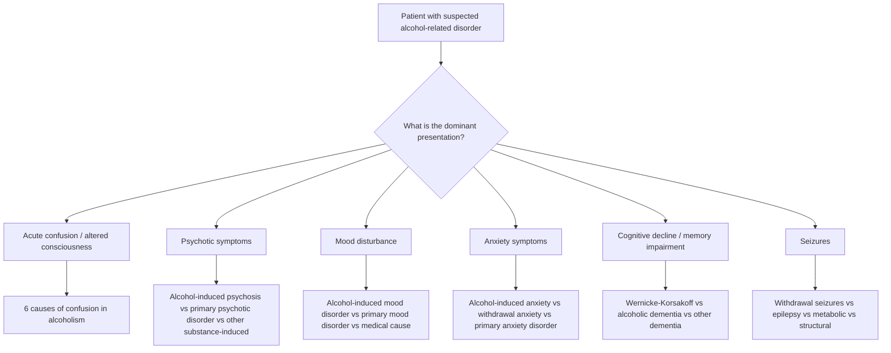
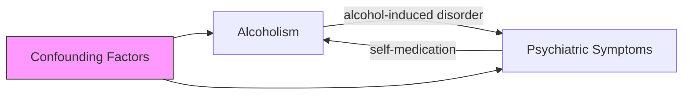
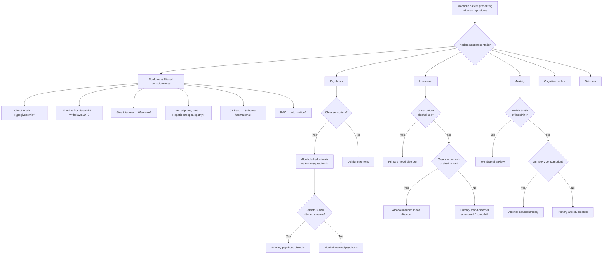

## Differential Diagnosis of Alcohol Misuse and Alcohol-related Disorders

The differential diagnosis in alcohol-related disorders is not a single, neat list — it varies depending on **which clinical presentation** brings the patient to attention. A patient with alcohol problems can present with intoxication, withdrawal, confusion, psychosis, mood disturbance, anxiety, or cognitive decline. For each presentation, the differential is different. Let's walk through this systematically.

---

### Organising Framework: What Is the Presenting Problem?

The key clinical question is: **"What am I actually seeing — and what else could cause this?"**

---

### A. Differential Diagnosis of Acute Confusion in an Alcoholic Patient

This is arguably the most high-yield differential in alcohol psychiatry. ***The lecture explicitly identifies "6 causes of confusion in alcoholism"*** [1]:

| # | ***Cause*** | Key Distinguishing Features | Why This Happens |
|---|---|---|---|
| 1 | ***Intoxication*** [1] | History of recent alcohol intake; slurred speech, ataxia, nystagmus; BAC elevated; resolves as alcohol is metabolised | GABA-A potentiation + NMDA blockade → generalised CNS depression |
| 2 | ***Delirium Tremens (DT)*** [1] | Onset 48–72h after last drink; fluctuating consciousness, vivid visual hallucinations, tremor, autonomic storm (fever, tachycardia, sweating, hypertension) | Abrupt loss of chronic GABA-A potentiation + unmasked NMDA hyperexcitability → excitotoxic state |
| 3 | ***Head injury / Subdural haematoma*** [1] | History of falls (common in alcoholics); focal neurological signs; may have lucid interval then deterioration; coagulopathy + thrombocytopenia increases bleeding risk | Alcoholics fall frequently + have impaired clotting factors (hepatic dysfunction) + thrombocytopenia → bridging vein tears → subdural collection |
| 4 | ***Metabolic disturbances (e.g. hypoglycaemia)*** [1] | Confusion, aggression, sweating, tremor, seizures; **H'stix confirms low glucose**; responds to IV dextrose | Alcohol metabolism consumes NAD⁺ → insufficient NAD⁺ for gluconeogenesis → hypoglycaemia. Often mimics intoxication exactly |
| 5 | ***Hepatic encephalopathy*** [1] | Asterixis (liver flap), fetor hepaticus, jaundice, stigmata of chronic liver disease; ↑ ammonia; often triggered by GI bleed, infection, constipation | Cirrhosis → failed hepatic clearance of ammonia → crosses BBB → astrocyte swelling (via glutamine accumulation) → cerebral oedema and altered neurotransmission |
| 6 | ***Wernicke encephalopathy*** [1] | Classic triad: confusion + ophthalmoplegia + ataxia (but only ~10% have full triad); responds to IV thiamine | Thiamine deficiency → impaired pyruvate dehydrogenase and α-ketoglutarate dehydrogenase → energy failure in metabolically active periventricular structures |

<Callout title="The 6 Causes — Must Know for Exams" type="error">
When you see a confused alcoholic patient, you MUST systematically consider all 6 causes. The commonest exam mistake is assuming the patient is "just drunk." Every confused alcoholic needs: H'stix (hypoglycaemia), thiamine (Wernicke), assessment for head injury (subdural), liver assessment (hepatic encephalopathy), and timeline from last drink (withdrawal/DT). Multiple causes can coexist — e.g. a patient can be both hypoglycaemic AND in withdrawal AND have a subdural.
</Callout>

**Additional differentials for confusion in alcoholics** (beyond the classic 6):

| Cause | Distinguishing Features |
|---|---|
| **CNS infection** (meningitis/encephalitis) | Fever, neck stiffness, photophobia; immunocompromised state in alcoholics increases risk; LP needed |
| **Drug overdose / polypharmacy** | Urine toxicology screen; check for co-ingestion of benzodiazepines, opioids, paracetamol |
| **Electrolyte disturbance** (beyond hypoglycaemia) | HypoNa, hypoK, hypoMg, hypoPO₄ — all common in alcoholics due to poor intake, vomiting, and renal losses |
| **Central pontine myelinolysis** | Quadriparesis, dysarthria, dysphagia; history of rapid Na⁺ correction |
| **Alcoholic ketoacidosis** | Anion gap metabolic acidosis; occurs after binge followed by fasting; ketones elevated but glucose may be normal or low |
| **Postictal state** | History of witnessed seizure; gradual resolution; may occur after withdrawal seizure |

---

### B. Differential Diagnosis of Psychotic Symptoms in an Alcoholic Patient

When an alcoholic patient presents with hallucinations or delusions, you must distinguish between several entities [1][2]:

| Diagnosis | Key Features | How to Differentiate |
|---|---|---|
| ***Alcoholic hallucinosis*** [1] | ***Chronic heavy drinkers; auditory hallucinations; in clear consciousness; distressing in content; some develop schizophrenia, some remit after stopping alcohol use*** [1] | ***Differentiate from delirium tremens: reduction in alcohol intake, clouded sensorium, visual hallucinations*** in DT [1]. Alcoholic hallucinosis has **clear sensorium** and **predominantly auditory** hallucinations |
| **Delirium tremens** | Visual hallucinations (classically Lilliputian — small animals/insects), clouded/fluctuating consciousness, autonomic storm, tremor | Onset 48–72h after cessation; **clouded sensorium** is the key distinguisher from hallucinosis |
| **Alcohol-induced psychotic disorder (delusional)** | Typically **morbid jealousy** (Othello syndrome) — abnormal belief partner is unfaithful; incessant cross-questioning, searching for evidence; risk of violence [2] | Content is specifically jealousy-themed; often in male chronic drinkers; other causes include schizophrenia, mood disorder, organic disorder, paranoid personality disorder [2] |
| **Primary schizophrenia** | Schneiderian first-rank symptoms; persistent psychosis independent of alcohol use; deteriorating function over time; FHx of psychosis | Psychotic symptoms persist > 4 weeks after abstinence; onset may predate alcohol use; negative symptoms prominent |
| **Substance-induced psychosis (other substances)** | Stimulants (methamphetamine, cocaine) and cannabis are common causes; urine drug screen positive | Temporal relationship with substance use; resolves with clearance of substance |
| **Mood disorder with psychotic features** | Psychosis is mood-congruent (e.g. nihilistic delusions in depression, grandiose delusions in mania); affective symptoms predominate | Psychotic features occur within the context of a mood episode |

***Diagnosing a comorbid primary psychiatric disorder in an alcoholic*** is supported by [1]:
- ***Evidence of psychiatric disorder before onset of alcohol abuse or dependence*** [1]
- ***Evidence of persistent psychiatric symptoms during extended alcohol-free periods (over 4 weeks)*** [1]
- ***First-degree biological relative has documented psychiatric disorder*** [1]

---

### C. Differential Diagnosis of Mood Disturbance in an Alcoholic Patient

***Alcohol-induced mood disorder*** [1]:
- ***Moderate or heavy alcohol use*** [1]
- ***Major depression or mania*** [1]
- ***Persists for up to 4 weeks after abstinence*** [1]
- ***Clears up on stopping alcohol*** [1]

The differential here asks: **is the mood disorder primary (independent) or secondary (alcohol-induced)?**

| Diagnosis | Key Distinguishing Features |
|---|---|
| ***Alcohol-induced depressive disorder*** | Temporal relationship with heavy alcohol use; symptoms clear within 4 weeks of abstinence [1]; no history of depression before alcohol misuse |
| **Primary major depressive disorder with comorbid alcoholism** | Depression predates alcohol use; persists > 4 weeks after sustained abstinence; FHx of mood disorder; ***response to treatment is much less likely if comorbid alcoholism is NOT dealt with*** [2] |
| ***Alcohol-induced mania*** [1] | Manic symptoms in context of heavy alcohol use; resolves with abstinence |
| ***Bipolar I disorder with comorbid alcoholism*** | ***60% of bipolar I patients have alcoholism*** [1]; manic/hypomanic episodes predate alcohol use or persist in abstinence; ↑ impulsivity during mania drives drinking |
| **Hypothyroidism** | Fatigue, weight gain, cold intolerance, constipation; check TFT — alcoholics may have thyroid dysfunction |
| **Adjustment disorder** | Depressive symptoms temporally related to a psychosocial stressor; does not meet full criteria for MDD; develops within 3 months of stressor [2] |
| **Organic causes of depression** | Cushing syndrome, malignancy, cerebral pathology — clinical assessment and investigations guided by suspicion |

<Callout title="The 4-Week Rule">
If mood or anxiety symptoms persist for > 4 weeks after complete alcohol abstinence, the psychiatric disorder is more likely to be primary (independent) rather than alcohol-induced. This is a critical clinical and exam distinction. Alcohol-induced mood disorder should clear within 4 weeks; alcohol-induced anxiety may take up to 6 months.
</Callout>

---

### D. Differential Diagnosis of Anxiety Symptoms in an Alcoholic Patient

***Alcohol-induced anxiety disorder*** [1]:
- ***Symptoms occur while patient is on heavy alcohol consumption*** [1]
- ***Symptoms subside gradually on abstinence, but may persist up to 6 months*** [1]
- ***Generalised anxiety disorders / Panic disorder / Phobic anxiety disorders / Social phobia / Obsessive compulsive disorder / PTSD*** can all be mimicked [1]
- ***Must be distinguished from alcohol withdrawal syndrome*** [1]

| Diagnosis | Key Distinguishing Features |
|---|---|
| **Alcohol withdrawal** | Onset within 6–48h of last drink; autonomic hyperactivity (tremor, sweating, tachycardia); time-limited; responds to BZDs | 
| ***Alcohol-induced anxiety disorder*** | Occurs **during** heavy consumption (not just on withdrawal); subside gradually with abstinence but may persist up to 6 months [1] |
| **Primary anxiety disorder with self-medication** | Anxiety predates alcohol use; persists in extended abstinence (> 6 months); FHx of anxiety; ***alcohol use may serve as self-medication in pre-existent anxiety disorders*** [2] |
| **Medical causes of anxiety** | Thyrotoxicosis, phaeochromocytoma (episodic), hypoglycaemia (episodic), PE, COPD, cardiac arrhythmia [2] |
| **Medication/substance-induced anxiety** | Stimulants (caffeine, amphetamines, cocaine); withdrawal from other sedatives (BZDs, opioids); medications (corticosteroids, sympathomimetics, anticholinergics) [2] |

---

### E. Differential Diagnosis of Cognitive Decline / Memory Impairment in an Alcoholic Patient

| Diagnosis | Key Distinguishing Features |
|---|---|
| **Korsakoff syndrome** | Profound anterograde amnesia + confabulation; follows untreated Wernicke encephalopathy; mamillary body/medial thalamic damage; other cognitive functions relatively preserved |
| **Alcoholic dementia** | Frontal-predominant cognitive decline (executive dysfunction, personality change); multifactorial aetiology; diagnosed ≥ 8 weeks after abstinence [2]; cortical atrophy with enlarged ventricles on imaging |
| **Alzheimer disease** | Insidious onset; progressive; hippocampal atrophy on MRI; amyloid/tau biomarkers; no clear relationship to alcohol intake |
| **Vascular dementia** | Stepwise deterioration; vascular risk factors; white matter changes on MRI |
| **Hepatic encephalopathy** | Fluctuating; asterixis; ↑ ammonia; improves with lactulose/rifaximin |
| **B12/folate deficiency** | Megaloblastic anaemia (but can have neurological features without anaemia); subacute combined degeneration of cord; common in alcoholics due to malabsorption |
| **Normal-pressure hydrocephalus** | Classic triad: gait apraxia, urinary incontinence, dementia; ventriculomegaly out of proportion to sulcal widening |
| **Chronic subdural haematoma** | Fluctuating consciousness, headache, focal signs; common in alcoholics (falls + coagulopathy) |

---

### F. Differential Diagnosis of Seizures in an Alcoholic Patient

| Diagnosis | Key Distinguishing Features |
|---|---|
| **Alcohol withdrawal seizures** | Generalised tonic-clonic; onset 12–48h after last drink; often a single seizure or brief cluster; risk of kindling with repeated withdrawals |
| **Primary epilepsy** | History of seizures unrelated to alcohol use; abnormal EEG; may require long-term AEDs |
| **Hypoglycaemia-induced seizures** | Low H'stix; responds to glucose |
| **Hyponatraemia** | Serum Na⁺ < 120 mmol/L; check electrolytes urgently |
| **Structural lesion** | Subdural haematoma, brain tumour, AVM; focal features on examination; CT/MRI needed |
| **Meningitis/encephalitis** | Fever, neck stiffness; LP findings |
| **Hepatic encephalopathy** | Advanced liver disease; ↑ ammonia |

---

### G. The Bidirectional Relationship — A Diagnostic Challenge

***The relationship between alcoholism and psychiatric symptoms is bidirectional, with confounding factors*** [1]:

This means that when you encounter a patient with both alcohol misuse and psychiatric symptoms, you must consider three possibilities [1]:

1. **Alcohol → Psychiatric disorder** (alcohol-induced): alcohol directly causes the psychiatric symptoms through neurotoxicity, neurotransmitter disruption, or nutritional deficiency
2. **Psychiatric disorder → Alcohol** (self-medication): the patient drinks to cope with pre-existing psychiatric symptoms (e.g. social phobia → drinking to cope with social situations)
3. **Confounding factors**: both the alcohol misuse and the psychiatric disorder are independently caused by shared risk factors (e.g. childhood trauma, genetics, social deprivation) [1]

***The key clinical approach to untangling this*** [1]:
- ***Evidence of psychiatric disorder BEFORE onset of alcohol abuse or dependence*** [1]
- ***Persistent psychiatric symptoms during extended alcohol-free periods (over 4 weeks)*** [1]
- ***First-degree biological relative has documented psychiatric disorder*** [1]

If these criteria are met, the psychiatric disorder is more likely **primary** (comorbid) rather than alcohol-induced.

---

### H. Comprehensive Differential Diagnosis Flowchart

---

### I. Summary: Key Differentials by Comorbidity Prevalence [1][2]

***Psychiatric comorbidity is very common in alcoholism (lifetime diagnosis occurs in 55% of alcoholics)*** [2]:

| ***Comorbid Condition*** | ***Prevalence*** | ***Key Differentiating Point*** |
|---|---|---|
| ***Mood disorders*** | ***40% of alcoholics*** [2] | Depression is the most common comorbidity; 4× risk of MDD |
| ***Antisocial personality disorder*** | ***80% of ASPD patients have alcoholism*** [1] | Longstanding pattern of disregard for others' rights; onset before age 15 |
| ***Bipolar I disorder*** | ***60% of bipolar I patients*** [1] | Manic episodes predate alcohol use; impulsivity drives drinking |
| ***Schizophrenia*** | ***30% abuse alcohol*** [1] | ***Alcohol decreases feeling of isolation; temporarily reduces anxiety/depression/insomnia; but increases psychotic symptoms and mood swings*** [1] |
| ***Drug addiction*** | ***20% of drug abusers are alcoholic; alcoholics are 6× more prone to become drug abusers*** [1] | Urine drug screen; polysubstance use history |
| ***Anxiety disorders*** | Social phobia, panic disorder common [1] | May be self-medication; must distinguish from withdrawal |

---

<Callout title="High Yield Summary">

**Differential Diagnosis of Alcohol-related Disorders — Key Exam Points:**

1. **6 causes of confusion in alcoholism** (must memorise): Intoxication, DT, Head injury/subdural, Metabolic disturbances (hypoglycaemia), Hepatic encephalopathy, Wernicke encephalopathy
2. **Alcoholic hallucinosis vs DT**: Hallucinosis = auditory hallucinations + clear sensorium; DT = visual hallucinations + clouded sensorium + autonomic storm
3. **Alcohol-induced vs primary psychiatric disorder**: Use the 3 criteria — (i) psychiatric disorder before alcohol onset, (ii) persistent symptoms > 4 weeks of abstinence, (iii) FHx of psychiatric disorder
4. **Alcohol-induced mood disorder** clears within 4 weeks of abstinence; **alcohol-induced anxiety** may persist up to 6 months
5. **The relationship is bidirectional with confounding factors** — alcohol can cause, result from, or co-occur with psychiatric disorders
6. **Othello syndrome** (morbid jealousy): a specific alcohol-related delusional disorder — beware risk of violence (56% of men)
7. **Always check**: H'stix, BAC, NH₃, CT head, electrolytes, and timeline from last drink in any confused alcoholic

</Callout>

---

<ActiveRecallQuiz
  title="Active Recall - Differential Diagnosis of Alcohol-related Disorders"
  items={[
    {
      question: "List the 6 causes of confusion in alcoholism as taught in the lecture, and for each, state one key investigation or clinical feature that helps identify it.",
      markscheme: "1. Intoxication — elevated BAC. 2. Delirium tremens — onset 48-72h after last drink, autonomic storm, visual hallucinations, fluctuating consciousness. 3. Head injury or subdural haematoma — CT head, focal neurological signs. 4. Metabolic disturbances e.g. hypoglycaemia — H'stix (capillary blood glucose). 5. Hepatic encephalopathy — elevated ammonia, asterixis, stigmata of chronic liver disease. 6. Wernicke encephalopathy — classic triad of confusion, ophthalmoplegia, ataxia; responds to IV thiamine."
    },
    {
      question: "How do you distinguish alcoholic hallucinosis from delirium tremens?",
      markscheme: "Alcoholic hallucinosis: auditory hallucinations, clear consciousness (clear sensorium), occurs in chronic heavy drinkers, content is distressing (voices uttering insults or threats). Delirium tremens: predominantly visual hallucinations (often Lilliputian), clouded or fluctuating sensorium, autonomic storm (tachycardia, fever, sweating, hypertension), onset 48-72h after reduction in alcohol intake, tremor prominent."
    },
    {
      question: "What three criteria support the diagnosis of a comorbid primary psychiatric disorder (rather than an alcohol-induced disorder) in a patient with alcoholism?",
      markscheme: "1. Evidence of psychiatric disorder before onset of alcohol abuse or dependence. 2. Evidence of persistent psychiatric symptoms during extended alcohol-free periods of over 4 weeks. 3. First-degree biological relative has a documented psychiatric disorder."
    },
    {
      question: "A 45-year-old male chronic alcoholic presents with intense suspicion that his wife is having an affair, constantly searching through her belongings for evidence but avoiding definitive confirmation. What is this condition called, what is the main risk, and what other conditions can cause it?",
      markscheme: "Othello syndrome (morbid jealousy or delusional jealousy). Main risk is violence — occurs in 56% of men and 43% of women with this condition. Other causes include schizophrenia, mood disorder, organic brain disorder, and paranoid personality disorder. Treatment includes antipsychotics and abstinence from alcohol."
    },
    {
      question: "Explain the bidirectional relationship between alcoholism and psychiatric symptoms, including the role of confounding factors.",
      markscheme: "Bidirectional: (1) Alcoholism causes psychiatric symptoms directly (alcohol-induced mood, anxiety, psychotic disorders) through neurotoxicity and neurotransmitter disruption. (2) Psychiatric disorders lead to alcoholism as self-medication (e.g. drinking to cope with anxiety, depression, insomnia). (3) Confounding factors such as genetics, childhood trauma, and social deprivation independently increase risk of both alcoholism and psychiatric disorders, making it difficult to establish causation."
    }
  ]}
/>

## References

[1] Lecture slides: GC 161. Alcohol and the Brain From Psychiatric to Neuropsychiatric Perspectives.pdf (p2, p7, p38, p40–p46, p48)
[2] Senior notes: ryanho-psych.md (sections 5.1, 5.1.2; pages 96–110, 142–143, 155, 165)
