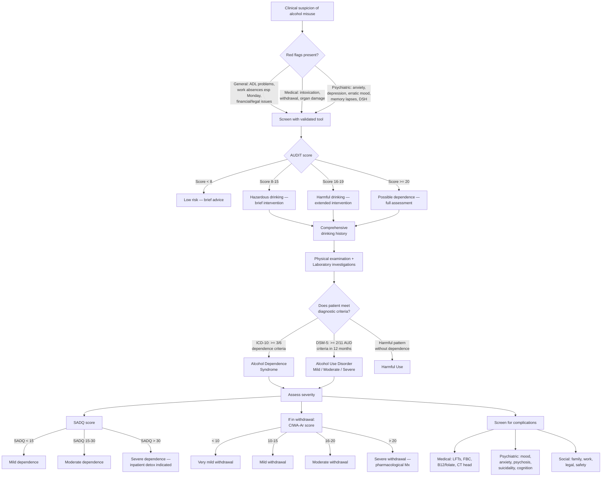

## Diagnostic Criteria, Algorithm, and Investigations for Alcohol Misuse and Alcohol-related Disorders

---

### A. Diagnostic Criteria

The diagnosis of alcohol-related disorders requires understanding **three major classification systems** that overlap but are not identical. Think of them as different lenses on the same problem: ICD-10 (used in HK clinical practice), DSM-5 (used in research and increasingly in clinical practice), and the historical Edwards & Gross criteria (which heavily influenced ICD-10 and remain conceptually important).

#### 1. DSM-5 — Alcohol Use Disorder [1][2]

DSM-5 collapsed the older DSM-IV distinction between "alcohol abuse" and "alcohol dependence" into a single dimensional diagnosis: **Alcohol Use Disorder (AUD)**, graded by severity. The logic: abuse and dependence exist on a continuum, not as discrete entities.

***A problematic pattern of alcohol use leading to clinically significant impairment or distress, as manifested by at least two of the following, occurring within a 12-month period:*** [1]

| # | Criterion | Domain | Pathophysiological / Behavioural Basis |
|---|---|---|---|
| ***1*** | ***Alcohol is often taken in larger amounts or over a longer period than was intended*** [1] | Impaired control | Prefrontal cortex dysfunction → impaired executive decision-making; once drinking begins, mesolimbic DA surge overrides planned limits |
| ***2*** | ***There is a persistent desire or unsuccessful efforts to cut down or control alcohol use*** [1] | Impaired control | Craving driven by sensitised incentive-salience system; despite conscious intent to stop, compulsive circuit dominates |
| ***3*** | ***A great deal of time is spent in activities necessary to obtain alcohol, use alcohol, or recover from its effects*** [1] | Impaired control | As dependence progresses, obtaining and using alcohol becomes the organising principle of the day |
| ***4*** | ***Craving, or a strong desire or urge to use alcohol*** [1] | Impaired control | Conditioned cue-reactivity in amygdala/NAc; environmental triggers provoke DA surges → subjective craving |
| ***5*** | ***Recurrent alcohol use resulting in a failure to fulfill major role obligations at work, school, or home*** [1] | Social impairment | Intoxication, withdrawal, and preoccupation with alcohol directly interfere with functioning |
| ***6*** | ***Continued alcohol use despite having persistent or recurrent social or interpersonal problems caused or exacerbated by the effects of alcohol*** [1] | Social impairment | Impaired insight + compulsive use overrides awareness of social consequences |
| ***7*** | ***Important social, occupational, or recreational activities are given up or reduced because of alcohol use*** [1] | Social impairment | Reward hijacking — natural rewards pale compared to drug-induced DA; progressive narrowing of interests |
| ***8*** | ***Recurrent alcohol use in situations in which it is physically hazardous*** [1] | Risky use | Impaired judgement (frontal lobe) + disinhibition → dangerous behaviour (e.g. drunk driving) |
| ***9*** | ***Alcohol use is continued despite knowledge of having a persistent or recurrent physical or psychological problem that is likely to have been caused or exacerbated by alcohol*** [1] | Risky use | Compulsive circuit overrides rational assessment of harm |
| ***10*** | ***Tolerance, as defined by either of the following:*** [1] | Pharmacological | |
| | ***a. A need for markedly increased amounts of alcohol to achieve intoxication or desired effect*** [1] | | GABA-A receptor downregulation + NMDA receptor upregulation (pharmacodynamic tolerance); CYP2E1 induction (pharmacokinetic/metabolic tolerance) |
| | ***b. A markedly diminished effect with continued use of the same amount of alcohol*** [1] | | Same neuroadaptive mechanisms — the brain "fights back" against chronic GABA potentiation |
| ***11*** | ***Withdrawal, as manifested by either of the following:*** [1] | Pharmacological | |
| | ***a. The characteristic withdrawal syndrome for alcohol*** [1] | | Unmasked NMDA hyperexcitability + loss of GABA-mediated inhibition |
| | ***b. Alcohol (or a closely related substance, such as a benzodiazepine) is taken to relieve or avoid withdrawal symptoms*** [1] | | Negative reinforcement — drinking to abolish the aversive withdrawal state (relief drinking) |

**Severity grading:**
- **Mild:** 2–3 criteria
- **Moderate:** 4–5 criteria
- **Severe:** 6+ criteria

**Specify remission:** [2]
- *In early remission:* none of criteria met for ≥ 3 months but < 12 months
- *In sustained remission:* none met for ≥ 12 months
- *In a controlled environment:* where access to alcohol is restricted

<Callout title="DSM-5 vs DSM-IV — Key Change">
DSM-IV had two separate diagnoses: "Alcohol Abuse" (1 of 4 criteria) and "Alcohol Dependence" (3 of 7 criteria). DSM-5 merged them into one "Alcohol Use Disorder" with 11 criteria (need ≥ 2). The old "legal problems" criterion was dropped and "craving" was added. The logic: the abuse/dependence dichotomy was artificial — in practice, patients existed on a spectrum, and many who had "abuse" were already on the path to dependence.
</Callout>

#### 2. ICD-10 — Harmful Use and Dependence Syndrome [2]

ICD-10 retains the older two-tier system. This is important because **HK clinical practice still uses ICD codes**.

**ICD-10 Harmful Use (F10.1):** [2]
- A pattern of substance use that is causing **actual damage** to physical or mental health
- The damage may be physical (e.g. hepatitis) or mental (e.g. depression)
- **NOT diagnosed** if: (1) acute intoxication or "hangover" alone; (2) dependence syndrome, psychotic disorder, or another specific alcohol-related disorder is present
- Why this exclusion? Because harmful use is meant to capture the "intermediate" stage — if the patient already meets criteria for dependence, you code that instead (it's more severe and more specific)

**ICD-10 Dependence Syndrome (F10.2):** [2]
- **≥ 3 of 6 criteria present together at some time during the previous year:**

| Criterion | Explanation |
|---|---|
| (a) **Strong desire or sense of compulsion** to take the substance | Craving — the subjective experience of incentive-salience |
| (b) **Difficulties in controlling** substance-taking behaviour (onset, termination, levels of use) | Loss of executive control over drinking |
| (c) **Physiological withdrawal state** when ceased/reduced, OR use of same/related substance to relieve/avoid withdrawal | The GABA-glutamate imbalance made manifest |
| (d) Evidence of **tolerance** | Neuroadaptation — need more for same effect |
| (e) **Progressive neglect of alternative pleasures or interests** + increased time to obtain/use/recover | Reward hijacking |
| (f) **Persisting with use despite clear evidence of overtly harmful consequences** | Impaired insight + compulsive loop |

#### 3. Edwards and Gross Criteria (1976) [2]

These are historically influential — they directly informed the ICD-10 dependence criteria. Think of them as the **clinical description** that preceded the formal criteria.

***Edwards and Gross — Alcohol Dependence Syndrome:*** [2]

| Element | Description | Clinical Significance |
|---|---|---|
| ***1. Narrowing of repertoire*** | Drinking becomes increasingly stereotyped — same type, same time, same place | The dependent person's drinking pattern is rigid and predictable, unlike the flexible pattern of a social drinker |
| ***2. Increased salience of drinking*** | Maintaining the drinking pattern is given priority over other aspects of life (home, career, recreation) | Functionally equivalent to DSM-5 criterion #7 (giving up activities) |
| ***3. Increased tolerance*** | Increased quantities needed; can tolerate BAC levels that would incapacitate non-tolerant drinkers. Note: tolerance can **decrease** in later stages of heavy drinking | Early: neuroadaptive tolerance (GABA-A down, CYP2E1 up). Late: hepatic decompensation reduces metabolic capacity → apparent loss of tolerance |
| ***4. Withdrawal symptoms*** | Fall in BAC → tremor, nausea, vomiting, sweating, anxiety, depression, agitation. Heavier dependence → early morning withdrawal after a night's sleep | Why early morning? Because overnight abstinence (8+ hours) allows BAC to drop below the "set point" that the adapted brain now requires |
| 5. **Relief drinking** | Drinking to relieve or avoid withdrawal symptoms (e.g. "eye-opener" — first drink of the day to stop morning tremor) | Classic negative reinforcement; a very reliable indicator of physiological dependence |
| 6. **Subjective awareness of compulsion** | The patient recognises a compulsive drive to drink and may resist but ultimately gives in | Distinguishes dependence from simple heavy drinking — the element of loss of control |
| 7. **Reinstatement after abstinence** | After a period of abstinence, relapse rapidly returns the patient to previous pattern of dependent drinking | The neuroadaptive changes do not fully reverse — "memory" of dependence persists in the reward circuitry |

#### 4. DSM-5 — Alcohol Intoxication [1]

***Alcohol Intoxication DSM-5:*** [1]

| Criterion | Detail |
|---|---|
| ***A*** | ***Recent ingestion of alcohol*** [1] |
| ***B*** | ***Clinically significant problematic behavioural or psychological changes (e.g. inappropriate sexual or aggressive behaviour, mood lability, impaired judgement) that developed during, or shortly after, alcohol ingestion*** [1] |
| ***C*** | ***One or more of the following signs or symptoms developing during, or shortly after, alcohol use:*** [1] |
| | ***1. Slurred speech*** — cerebellar and cortical motor depression |
| | ***2. Incoordination*** — cerebellar Purkinje cell depression |
| | ***3. Unsteady gait*** — cerebellar vermis + proprioceptive pathway depression |
| | ***4. Nystagmus*** — vestibular nucleus and cerebellar flocculus depression |
| | ***5. Impairment in attention or memory*** — NMDA blockade in hippocampus and prefrontal cortex |
| | ***6. Stupor or coma*** — severe generalised CNS depression including brainstem |
| ***D*** | ***The signs or symptoms are not attributable to another medical condition and are not better explained by another mental disorder, including intoxication with another substance*** [1] |

#### 5. DSM-5 / ICD-10 — Alcohol Withdrawal

**DSM-5 criteria for Alcohol Withdrawal:**
- A. Cessation of (or reduction in) alcohol use that has been heavy and prolonged
- B. ≥ 2 of the following developing within hours to days after criterion A: (1) autonomic hyperactivity (sweating, tachycardia > 100 bpm); (2) increased hand tremor; (3) insomnia; (4) nausea or vomiting; (5) transient visual, tactile, or auditory hallucinations/illusions; (6) psychomotor agitation; (7) anxiety; (8) generalised tonic-clonic seizures
- C. Symptoms cause clinically significant distress or impairment
- D. Not attributable to another medical condition or mental disorder
- Specify if: **with perceptual disturbances** (hallucinations with intact reality testing)

---

### B. Diagnostic Algorithm

The following algorithm walks through the clinical approach to a patient with suspected alcohol-related problems, from initial suspicion through screening, comprehensive assessment, and definitive diagnosis.

---

### C. Screening Tools — In Detail

#### 1. CAGE Questionnaire [2]

The name is a mnemonic — each letter stands for one question:

| Letter | Question | What It Detects |
|---|---|---|
| **C** | Have you ever felt you should **Cut down** on your drinking? | Awareness of excessive use |
| **A** | Have people **Annoyed** you by criticising your drinking? | Social impact |
| **G** | Have you ever felt **Guilty** about your drinking? | Emotional consequence |
| **E** | Have you ever had a drink first thing in the morning (**Eye-opener**) to steady your nerves or get rid of a hangover? | Relief drinking — highly suggestive of physiological dependence |

- Scoring: ≥ 2 "yes" answers = screen positive
- ***↑ Sensitivity but modest specificity only*** [2] — many false positives
- Strength: very quick (4 questions, takes 30 seconds)
- Weakness: does not quantify consumption; does not detect hazardous drinking below the dependence threshold; poor specificity in populations with high baseline drinking rates

#### 2. AUDIT (Alcohol Use Disorders Identification Test) [2]

***↑ Sensitivity + ↑ Specificity, probably most useful. 10-item screening tool by WHO*** [2]

The AUDIT is the gold-standard screening tool. It covers three domains in 10 questions:

| Domain | Questions | What It Measures |
|---|---|---|
| **Consumption** (Questions 1–3) | Frequency of drinking, typical quantity, frequency of heavy drinking | Quantifies actual intake — detects hazardous drinking even without dependence |
| **Dependence** (Questions 4–6) | Impaired control, failure to meet expectations, morning drinking | Screens for core dependence features |
| **Alcohol-related harm** (Questions 7–10) | Guilt, blackouts, injury, concern from others | Detects consequences of drinking |

- Scoring: 0–40; **≥ 8 = hazardous drinking** (screen positive)
- Cut-offs for clinical action: 8–15 (brief intervention), 16–19 (extended intervention), ≥ 20 (further diagnostic evaluation for dependence)
- Why AUDIT is superior to CAGE: it quantifies consumption (not just consequences), it has better specificity, it detects the full spectrum from hazardous use through to dependence

<Callout title="AUDIT vs CAGE — Exam Comparison">
CAGE: 4 items, very quick, good sensitivity but modest specificity; detects dependence features but misses hazardous drinking. AUDIT: 10 items, takes 2–3 minutes, high sensitivity AND specificity; detects the full spectrum from hazardous use to dependence. For screening in clinical settings, AUDIT is preferred.
</Callout>

#### 3. Assessment Scales for Severity and Withdrawal [2]

| Scale | Full Name | Purpose | Scoring |
|---|---|---|---|
| **SADQ** | ***Severity of Alcohol Dependence Questionnaire*** [2] | Estimates severity of dependence; predicts risk during detoxification | ***> 30 is an indication for inpatient detoxification*** [2] |
| **CIWA-Ar** | ***Clinical Institute Withdrawal Assessment Scale for Alcohol, revised*** [2] | ***Quantifies severity of withdrawal (out of 67)*** [2] | ***< 10 = very mild; 10–15 = mild; 16–20 = moderate; > 20 = severe*** [2] |

**CIWA-Ar** assesses 10 domains: nausea/vomiting, tremor, paroxysmal sweats, anxiety, agitation, tactile disturbances, auditory disturbances, visual disturbances, headache/fullness, and orientation/clouding of sensorium. It is used to guide **symptom-triggered** benzodiazepine therapy (start at CIWA-Ar ≥ 8) [2].

Why symptom-triggered is preferred: it allows titration to the individual patient's actual withdrawal severity, avoids over-sedation in mild withdrawal, and has been shown to reduce total BZD dose and duration of treatment compared to fixed-dose schedules. However, it requires intensive monitoring (e.g. hourly assessments) [2].

---

### D. Comprehensive Drinking History [2]

A structured drinking history is the single most important diagnostic tool. It provides information that no blood test or screening questionnaire can:

| Component | What to Ask | Why It Matters |
|---|---|---|
| ***Initiation*** [2] | Reason for drinking, triggers, when did daily drinking start | Identifies the trajectory and potential psychological drivers |
| ***Use*** [2] | Current, regular, maximal use; describe a ***typical day*** (***especially note time of first drink***) [2] | Early morning drinking = relief drinking = strong indicator of dependence. A typical day reveals the pattern and total daily intake |
| ***Signs/symptoms of dependence*** [2] | Compulsion/craving, difficulty in control, stereotyped behaviour, tolerance, withdrawal, persistent despite negative consequences, neglect of other activities | Directly maps to ICD-10/DSM-5 diagnostic criteria |
| ***Impact*** [2] | Physical health, mental health, ADL, family, work, social relationships | Quantifies functional impairment — essential for severity grading and treatment planning |
| ***Quitting*** [2] | Dates and reasons of abstinence, dates and reasons of relapses, attitude toward change | Assesses stage of change (precontemplation → contemplation → preparation → action → maintenance); predicts treatment engagement |

---

### E. Investigation Modalities and Key Findings

Investigations serve four purposes in alcohol-related disorders:
1. **Confirm/quantify alcohol use** (biomarkers)
2. **Assess severity of organ damage** (blood tests, imaging)
3. **Detect and correct acute metabolic derangements** (emergency labs)
4. **Rule out alternative diagnoses** (CT, LP, toxicology)

#### 1. Biomarkers of Alcohol Use [2]

| Investigation | Sensitivity | Key Points | Why This Marker Changes |
|---|---|---|---|
| ***↑ GGT (gamma-glutamyl transferase)*** | ***70%*** [2] | ***Useful screening tool but non-specific, dose-related*** [2]. Normalises within 2–6 weeks of abstinence. Also elevated in: hepatobiliary disease, obesity, medications (anticonvulsants, barbiturates), diabetes, pancreatitis | Alcohol induces microsomal enzymes including GGT; also released from damaged hepatocytes |
| ***↑ MCV (mean corpuscular volume)*** | ***60%*** [2] | ***More commonly in females; strong indicator of excessive drinking once other causes ruled out; takes weeks to return to baseline after abstinence*** [2] | Direct toxic effect of ethanol on erythroblast membranes (↑ membrane fluidity → ↑ cell size) + folate deficiency → impaired DNA synthesis → megaloblastic change. Takes weeks because MCV reflects average of circulating RBCs (lifespan ~120 days) |
| ***↑ CDT (carbohydrate-deficient transferrin)*** | ~70% | ***More specific than GGT*** [2]. Best used for monitoring relapse after treatment. Normalises within 2–4 weeks | Chronic alcohol interferes with hepatic glycosylation of transferrin → ↑ proportion of under-glycosylated (carbohydrate-deficient) isoforms |
| ***Breath/blood alcohol concentration (BAC)*** | N/A | ***Only reflects current drinking*** [2]. Useful in acute settings. ***No intoxication despite ↑↑ BAC can denote development of tolerance*** [2] | Directly measures ethanol; metabolised at ~7–10 g/hour (zero-order kinetics) |

> **Best combination for screening:** GGT + MCV together have higher sensitivity than either alone. CDT is more specific and useful for relapse monitoring.

#### 2. Routine Blood Tests — Assessing Organ Damage

| Investigation | Key Findings in Alcoholism | Interpretation / Why |
|---|---|---|
| **LFTs** | AST:ALT ratio > 2:1 (classic); ↑ GGT; ↑ bilirubin; ↓ albumin (if cirrhotic) | AST > ALT because: (1) alcohol depletes hepatic pyridoxal-5′-phosphate (B6 cofactor for ALT more than AST); (2) mitochondrial AST (mAST) is released preferentially from alcohol-damaged mitochondria. The 2:1 ratio is fairly specific for alcoholic liver disease |
| **FBC** | ↑ MCV (macrocytosis ± megaloblastic anaemia); ↓ platelets (thrombocytopenia); ↓ WBC (leucopenia) | Macrocytosis: direct toxicity + folate deficiency. Thrombocytopenia: direct marrow suppression + hypersplenism (portal hypertension → splenomegaly → sequestration). Leucopenia: direct marrow suppression |
| **Coagulation** | ↑ PT/INR | Liver synthetic failure → ↓ production of clotting factors (especially II, VII, IX, X) |
| **U&E** | HypoK⁺, hypoNa⁺, hypoMg²⁺, hypoPO₄³⁻ | HypoK: GI losses (vomiting, diarrhoea) + renal losses (↑ aldosterone from volume depletion). HypoNa: beer potomania (excess free water intake with low solute), SIADH, or dilutional. HypoMg: poor dietary intake + renal wasting + GI losses. HypoPO₄: refeeding shifts, poor intake |
| **Glucose** | Hypoglycaemia (fasting or 6–36h post-ingestion) | ↑ NADH:NAD⁺ ratio → blocked gluconeogenesis |
| **Lipids** | Hypertriglyceridaemia | ↑ NADH drives ↑ fatty acid synthesis and ↓ fatty acid oxidation |
| **Uric acid** | ↑ Urate | Lactate (from ↑ NADH) competes with urate for renal tubular excretion |
| **B12 / Folate** | ↓ Folate (common), ↓ B12 (less common) | Folate: poor dietary intake + malabsorption + alcohol directly impairs folate metabolism. B12: less commonly affected but can occur with chronic gastritis → ↓ intrinsic factor |
| **Thiamine level** | ↓ (often not routinely measured; treat empirically) | Poor intake + impaired intestinal absorption + increased utilisation |

#### 3. Urine Toxicology [2]

- ***Urine toxicology*** [2]: essential to rule out co-ingestion of other substances (benzodiazepines, opioids, stimulants, cannabis)
- Why? ***20% of drug abusers are alcoholic; alcoholics are 6× more prone to become drug abusers*** [1] — polypharmacy is common and can complicate withdrawal and management
- Also important to check: **paracetamol level** (common co-ingestant in deliberate self-harm)

#### 4. Neuroimaging [2]

| Modality | When to Order | Key Findings |
|---|---|---|
| **CT head (non-contrast)** | Acute confusion to rule out subdural haematoma, subarachnoid haemorrhage; new seizures to rule out structural cause [2] | Subdural haematoma (crescent-shaped hyper/hypo/mixed density); cortical atrophy with enlarged ventricles (chronic alcoholism); cerebellar vermis atrophy |
| **MRI brain** | Suspected Wernicke encephalopathy; cognitive decline workup; suspected Marchiafava-Bignami | Wernicke: T2/FLAIR hyperintensity in mamillary bodies, medial thalami, periaqueductal grey, tectal plate. ***Alcohol-related dementia: cerebral cortical atrophy with enlarged lateral ventricles; loss of grey matter in cortical and subcortical areas; white matter changes with demyelination on DTI*** [2]. ***Cerebellar degeneration: cerebellar cortical atrophy especially affecting anterior vermis*** [2]. Marchiafava-Bignami: corpus callosum necrosis/demyelination. ***Central pontine myelinolysis: central pontine T2 hyperintensity*** [2] |

#### 5. Other Investigations

| Investigation | Indication | Key Findings |
|---|---|---|
| **ECG** | Baseline; palpitations; pre-treatment (some medications prolong QT) | AF (holiday heart); prolonged QT; signs of cardiomyopathy |
| **Liver ultrasound** | Suspected chronic liver disease | Steatosis (bright liver), cirrhosis (coarse nodular echogenicity, ↓ liver size), portal hypertension (splenomegaly, ascites) |
| **FibroScan (transient elastography)** | Staging of liver fibrosis | Non-invasive estimation of liver stiffness; guides need for further hepatological follow-up |
| **EEG** | Seizures of uncertain aetiology; suspected non-convulsive status | Helps distinguish withdrawal seizures from epilepsy; may show generalised slowing in encephalopathy |
| **Nerve conduction studies** | Suspected peripheral neuropathy | Axonal sensorimotor polyneuropathy (reduced amplitudes, relatively preserved conduction velocities) |
| **Ammonia level** | Suspected hepatic encephalopathy | ↑ ammonia (though levels correlate poorly with clinical severity) |
| **LP** | Suspected meningitis/encephalitis | To rule out CNS infection in a febrile, confused alcoholic patient (immunocompromised state) |

#### 6. Putting It All Together — Investigation Panel for the Acutely Presenting Alcoholic Patient [2]

**Minimum workup in any acutely presenting patient:**

| Category | Tests |
|---|---|
| **Bedside** | H'stix (glucose), vital signs (BP, HR, temp, O₂ sat), BAC (breathalyser), CIWA-Ar scoring |
| **Bloods** | ***FBC (MCV, platelets), LFT (AST, ALT, GGT, ALP, bilirubin, albumin), RFT (Na, K, Cr, urea), glucose, Mg²⁺, PO₄³⁻, Ca²⁺, coagulation (PT/INR), B12/folate, thiamine (if available)*** |
| **Urine** | ***Urine toxicology screen*** [2] |
| **Imaging** | CT head if: new seizure, focal neurological signs, suspected head injury, altered consciousness not explained by intoxication/withdrawal |
| **Other** | ECG, ammonia (if liver disease suspected), blood cultures (if febrile), CXR (aspiration pneumonia) |

<Callout title="The AST:ALT > 2:1 Rule" type="idea">
In most liver diseases, ALT > AST. In alcoholic liver disease, the pattern reverses: AST:ALT > 2:1. Why? Alcohol depletes pyridoxal-5′-phosphate (vitamin B6), which is required more for ALT synthesis than AST. Additionally, mitochondrial AST (mAST) is released from alcohol-damaged hepatocyte mitochondria. This ratio is a useful clinical clue but not pathognomonic — it can also be seen in cirrhosis of any cause and in Wilson disease.
</Callout>

---

### F. Diagnostic Criteria for Specific Alcohol-Induced Psychiatric Disorders

These are important because the lecture specifically highlights ***alcohol-related psychiatric disorders — alcohol-induced psychiatric disorders and comorbid conditions*** [1].

#### Alcohol-Induced Mood Disorder [1]

***Diagnostic approach:*** [1]
- ***Moderate or heavy alcohol use*** [1]
- ***Major depression or mania*** [1]
- ***Persists for up to 4 weeks after abstinence*** [1]
- ***Clears up on stopping alcohol*** [1]

#### Alcohol-Induced Anxiety Disorder [1]

- ***Symptoms occur while patient is on heavy alcohol consumption*** [1]
- ***Symptoms subside gradually on abstinence, but may persist up to 6 months*** [1]
- ***Generalised anxiety disorders / Panic disorder / Phobic anxiety disorders / Social phobia / Obsessive compulsive disorder / PTSD*** [1]
- ***Must be distinguished from alcohol withdrawal syndrome*** [1]

#### Alcoholic Hallucinosis [1]

- ***Chronic heavy drinkers*** [1]
- ***Auditory hallucinations*** [1]
- ***In clear consciousness*** [1]
- ***Distressing in content*** [1]
- ***Some develop schizophrenia, some remit after stopping alcohol use*** [1]
- ***Differentiate from delirium tremens — reduction in alcohol intake, clouded sensorium, visual hallucinations*** [1]

#### Criteria for Distinguishing Comorbid Primary Psychiatric Disorder from Alcohol-Induced Disorder [1]

***A comorbid primary psychiatric disorder (rather than alcohol-induced) is supported by:*** [1]
- ***Evidence of psychiatric disorders before onset of alcohol abuse or dependence*** [1]
- ***Evidence of persistent psychiatric symptoms during extended alcohol-free periods (over 4 weeks)*** [1]
- ***First-degree biological relative has documented psychiatric disorder*** [1]

---

<Callout title="High Yield Summary">

**Diagnostic Criteria and Investigations — Key Exam Points:**

1. **DSM-5 AUD**: ≥ 2 of 11 criteria in 12 months. Mild (2–3), Moderate (4–5), Severe (6+). Single unified diagnosis replacing the old abuse/dependence dichotomy.
2. **ICD-10 Dependence**: ≥ 3 of 6 criteria (compulsion, impaired control, withdrawal, tolerance, neglect, persistent use despite harm).
3. **Edwards & Gross**: 7 elements — narrowing of repertoire, increased salience, tolerance, withdrawal, relief drinking, subjective compulsion, reinstatement after abstinence.
4. **DSM-5 Intoxication**: Recent ingestion + behavioural change + ≥ 1 of 6 signs (slurred speech, incoordination, unsteady gait, nystagmus, attention/memory impairment, stupor/coma) + not better explained by another condition.
5. **Screening**: AUDIT is best (10-item WHO tool, ↑ sens + spec, ≥ 8 screen positive). CAGE is quick but modest specificity.
6. **SADQ > 30** → inpatient detox. **CIWA-Ar**: < 10 very mild, 10–15 mild, 16–20 moderate, > 20 severe; guides symptom-triggered BZD therapy (start at ≥ 8).
7. **Lab biomarkers**: ↑ GGT (70% sens, non-specific), ↑ MCV (60% sens, weeks to normalise), ↑ CDT (most specific). AST:ALT > 2:1 classic for alcoholic liver disease.
8. **Alcohol-induced** vs **comorbid** psych disorder: Use 3 criteria — (i) psych disorder before alcohol, (ii) persistent symptoms > 4wk abstinence, (iii) FHx of psych disorder.
9. **Always get**: H'stix, FBC, LFT, RFT, Mg, PO₄, coag, urine tox. CT head if confused/seizure/focal signs.

</Callout>

---

<ActiveRecallQuiz
  title="Active Recall - Diagnostic Criteria, Algorithm and Investigations"
  items={[
    {
      question: "List the 11 DSM-5 criteria for Alcohol Use Disorder and state the severity grading thresholds.",
      markscheme: "1. Taken in larger amounts or longer than intended. 2. Persistent desire or unsuccessful efforts to cut down. 3. Great deal of time obtaining, using, or recovering. 4. Craving. 5. Failure to fulfil major role obligations. 6. Continued use despite social or interpersonal problems. 7. Important activities given up or reduced. 8. Recurrent use in physically hazardous situations. 9. Continued use despite knowledge of physical or psychological problem caused by alcohol. 10. Tolerance (need more or diminished effect). 11. Withdrawal (characteristic syndrome or use to relieve or avoid withdrawal). Severity: Mild 2-3 criteria, Moderate 4-5, Severe 6 or more."
    },
    {
      question: "Compare the CAGE and AUDIT screening tools in terms of number of items, what they measure, sensitivity, specificity, and which is preferred.",
      markscheme: "CAGE: 4 items (Cut down, Annoyed, Guilty, Eye-opener), detects dependence features, high sensitivity but modest specificity, quick but misses hazardous drinking. AUDIT: 10 items (WHO), covers consumption, dependence, and alcohol-related harm, high sensitivity AND specificity, preferred tool for clinical screening. AUDIT score 8 or above is screen positive."
    },
    {
      question: "Explain why the AST:ALT ratio is typically greater than 2:1 in alcoholic liver disease but not in most other liver diseases.",
      markscheme: "Two reasons: (1) Alcohol depletes pyridoxal-5-phosphate (vitamin B6), which is a cofactor required more for ALT synthesis than AST, so ALT production is preferentially reduced. (2) Mitochondrial AST (mAST) is released from alcohol-damaged hepatocyte mitochondria, disproportionately elevating AST. This pattern reverses the usual ALT-predominant elevation seen in other hepatitides."
    },
    {
      question: "What are the CIWA-Ar score thresholds, and at what score should symptom-triggered benzodiazepine therapy be initiated?",
      markscheme: "CIWA-Ar is scored out of 67. Less than 10 = very mild, 10-15 = mild, 16-20 = moderate, greater than 20 = severe. Symptom-triggered benzodiazepine therapy should be initiated at CIWA-Ar score of 8 or above, with reassessment at least hourly."
    },
    {
      question: "Name the three biomarkers used to detect chronic alcohol misuse, rank them by specificity, and explain the pathophysiology behind elevated MCV in alcoholism.",
      markscheme: "Three biomarkers: GGT (70% sensitive, least specific), MCV (60% sensitive, moderate specificity), CDT (most specific). MCV is elevated because: (1) direct toxic effect of ethanol on erythroblast membranes increasing membrane fluidity and cell size, and (2) folate deficiency from poor intake and malabsorption causing impaired DNA synthesis and megaloblastic change. MCV takes weeks to normalise after abstinence because it reflects average of circulating RBCs with a lifespan of approximately 120 days."
    },
    {
      question: "State the 7 elements of the Edwards and Gross Alcohol Dependence Syndrome and explain why tolerance can paradoxically decrease in advanced alcoholism.",
      markscheme: "7 elements: 1. Narrowing of repertoire. 2. Increased salience of drinking. 3. Increased tolerance. 4. Withdrawal symptoms. 5. Relief drinking. 6. Subjective awareness of compulsion. 7. Reinstatement after abstinence. Tolerance decreases in advanced stages because hepatic decompensation (cirrhosis) reduces the liver metabolic capacity (CYP2E1 activity falls as functional hepatocyte mass is lost), so the patient becomes intoxicated at lower doses than before."
    }
  ]}
/>

## References

[1] Lecture slides: GC 161. Alcohol and the Brain From Psychiatric to Neuropsychiatric Perspectives.pdf (p2, p4–5, p7, p19, p38, p42–43)
[2] Senior notes: ryanho-psych.md (sections 5.1, 5.1.1, 5.1.2; pages 96–105, 108–110)
