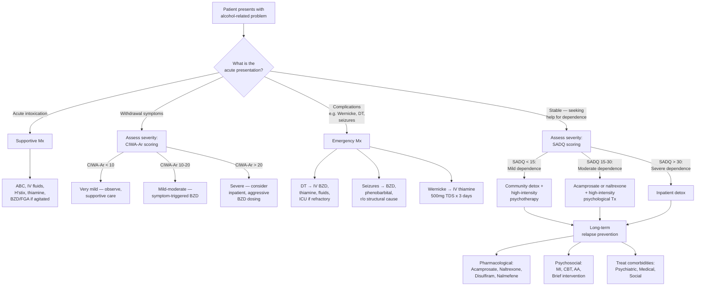
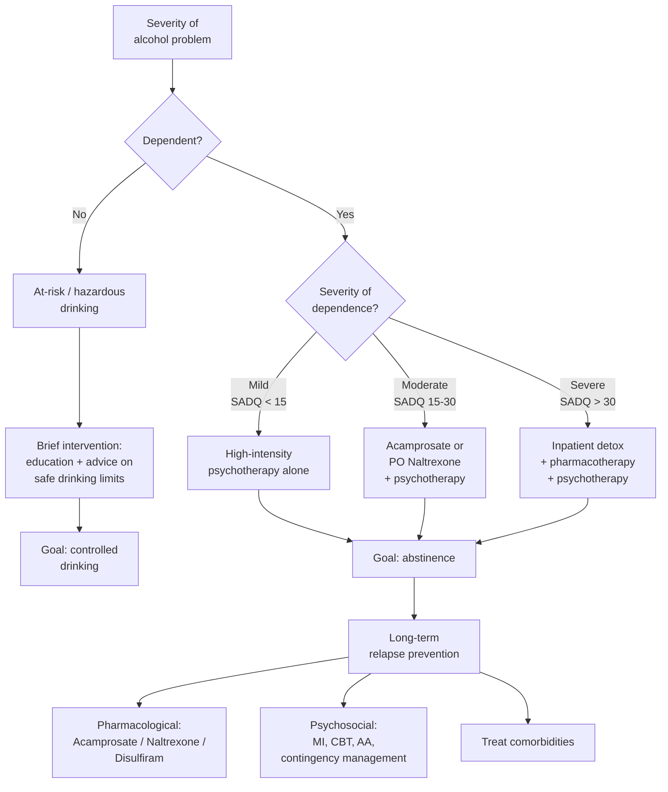

## Management of Alcohol Misuse and Alcohol-related Disorders

The management of alcohol-related disorders is staged — it depends entirely on **where the patient sits** at the time of presentation. A patient in acute intoxication needs different management from one in withdrawal, who in turn needs different management from one seeking long-term relapse prevention. The overarching framework is:

1. **Acute management** — intoxication, withdrawal, DT, Wernicke encephalopathy
2. **Medium-term** — detoxification (managed withdrawal)
3. **Long-term** — relapse prevention (pharmacological + psychosocial)

Let's build this systematically.

---

### A. Overall Management Algorithm

---

### B. Acute Management

#### 1. Management of Acute Intoxication [2]

The management is ***primarily supportive*** [2]. Why? Because ethanol is metabolised at a fixed rate (~7–10 g/hour, zero-order kinetics) — there is no antidote that speeds this up. Your job is to keep the patient alive and safe while the alcohol clears.

| Step | Action | Rationale |
|---|---|---|
| **ABC** | Airway protection (recovery position; intubation if GCS ≤ 8 or aspiration risk), breathing, circulation | Severe intoxication → respiratory depression (medullary depression); aspiration pneumonia from vomiting |
| ***IV fluid hydration*** [2] | ***Correct volume depletion and hypotension*** [2] | Alcohol causes osmotic diuresis + suppression of ADH → dehydration; vomiting further depletes volume |
| **H'stix** | Check capillary blood glucose | ***Hypoglycaemia is an important differential in confused patient with prior alcohol intake*** [2] — mimics intoxication exactly |
| ***D50 infusion*** [2] | ***If hypoglycaemia is present*** [2] | Corrects energy substrate deficit; prevents brain injury |
| ***100 mg parenteral thiamine*** [2] | ***Mandatory if present with coma (for prevention of B₁ deficiency)*** [2] | Chronic alcoholics are universally at risk of thiamine depletion — glucose loading without thiamine can theoretically precipitate or worsen Wernicke encephalopathy |
| ***Thiamine + dextrose timing*** [2] | ***Traditional teaching: thiamine before dextrose. Evidence: weak, likely NOT evidence-based → thiamine can be given together with dextrose*** [2] | The theoretical basis is that glucose loading in a thiamine-deficient cell diverts remaining thiamine to glycolysis, starving thiamine-dependent TCA cycle enzymes → lactic acidosis. In practice, the urgency of treating hypoglycaemia outweighs this theoretical risk — give both simultaneously |
| ***BZD or FGA if agitated*** [2] | Short-acting BZD (e.g. lorazepam) or haloperidol | Agitated/combative intoxicated patients pose risk to themselves and staff; BZDs are preferred because they share the GABA mechanism; FGAs may be needed if psychotic features present but use cautiously (lower seizure threshold) |
| **Monitoring** | Regular vitals, GCS, H'stix, temperature | Watch for deterioration — could indicate developing subdural, worsening intoxication (continued absorption), or early withdrawal if blood alcohol level begins to fall |

<Callout title="The 3 Things You Must Do for Every Confused Alcoholic" type="error">
1. **Check H'stix** — hypoglycaemia kills and is trivially treatable
2. **Give thiamine** — Wernicke encephalopathy is preventable but irreversible if missed
3. **CT head if any doubt** — subdural haematoma is common in alcoholics who fall

Never assume "just drunk" until you have excluded these three emergencies.
</Callout>

#### 2. Management of Alcohol Withdrawal [1][2]

##### Pathophysiology Recap (Foundation for Treatment Logic)

***Alcohol withdrawal syndrome*** [1]:
- ***Occurs 6–24 hours after last drink*** [1]
- ***Autonomic hyperactivity — tremulousness, sweating, nausea, vomiting, anxiety, agitation, tachycardia*** [1]
- ***Hypertension, hyperreflexia, insomnia, nightmares, sweating, hyperthermia*** [1]
- ***Down-regulation of GABA receptor in chronic alcoholics*** [1]
- ***Reversal of inhibition of NMDA receptor → glutamate overactivity*** [1]
- ***Disappears in 2–7 days*** [1]

The treatment principle follows directly from the pathophysiology: the brain is in a state of GABA deficiency and NMDA excess. The treatment is to **restore GABAergic tone** using a cross-tolerant GABA-A agonist (benzodiazepine) while the brain gradually readapts.

##### Assessment [2]

- ***Hx, P/E: alcohol use and its complications*** [2]
- ***Ix: CBC, L/RFT, glucose, urine toxicology*** [2]
- ***CT brain: useful to rule out alternative diagnosis in seizures*** [2]
- ***SADQ: estimates severity of dependence and thus predicts risk in detoxification*** [2]
  - ***> 30 is an indication for inpatient detoxification*** [2]
- ***CIWA-Ar scale: quantifies severity of withdrawal (out of 67)*** [2]
  - ***Interpretation: < 10 = very mild, 10–15 = mild, 16–20 = moderate, > 20 = severe*** [2]

##### Setting of Detoxification [2]

***Indications for inpatient detoxification include:*** [2]

| Indication | Rationale |
|---|---|
| ***Severe dependence, e.g. SADQ > 30*** [2] | Higher risk of severe withdrawal including seizures and DT |
| ***History of severe withdrawal symptoms, e.g. seizures, DT*** [2] | Kindling effect — each successive withdrawal is more severe; prior DT is the strongest predictor of future DT |
| ***Very high alcohol consumption (> 30 units/day)*** [2] | Greater degree of neuroadaptation → more severe rebound excitotoxicity |
| ***Concomitant BZD misuse (↑↑ withdrawal severity)*** [2] | Both alcohol and BZDs act on GABA-A; dual withdrawal is synergistic and potentially lethal |
| ***Significant medical/psychiatric comorbidity*** [2] | Comorbid illness increases complications; psychiatric comorbidity increases suicide risk during withdrawal |

##### Pharmacological Management of Withdrawal [1][2]

| Component | Details | Mechanism / Rationale |
|---|---|---|
| ***Rule out alternative diagnoses*** [2] | ***CNS infection, drug overdose, metabolic derangement, liver failure*** [2] | All can mimic withdrawal; treating withdrawal alone when the real problem is meningitis or subdural is dangerous |
| **Supportive care** [2] | ***NPO (if vomiting), correct volume deficits, stabilise haemodynamics*** [2] | Dehydration from sweating, vomiting, poor intake; electrolyte loss |
| ***Correct metabolic derangements*** [2] | ***Hypoglycaemia, hypoK, hypoMg, hypoPO₄, ketoacidosis*** [2] | All common in alcoholics and all worsen withdrawal. HypoMg is particularly important — it lowers the seizure threshold AND impairs thiamine utilisation |
| ***Thiamine + glucose*** [2] | ***To prevent Wernicke encephalopathy*** [2] | Prophylactic thiamine for ALL patients in withdrawal — the cost of a missed Wernicke is devastating |
| ***Multivitamins with folate*** [2] | ***For nutritional supplements*** [2] | Chronic alcoholics are universally malnourished; folate deficiency → megaloblastic change |
| ***Benzodiazepines*** [1][2] | ***↓ Agitation and ↓ withdrawal*** [2] | Cross-tolerance with alcohol at GABA-A receptor — BZDs substitute for the lost GABAergic effect of alcohol, allowing a controlled taper |

##### Benzodiazepine Therapy — The Cornerstone [2]

**Choice of agent:**

| Agent | Properties | When to Use |
|---|---|---|
| ***Chlordiazepoxide (Librium)*** [2] | Long-acting; smoother withdrawal; less abuse potential | ***First-line for planned detox*** [2]; oral dosing; gradual taper over 5–10 days |
| ***Diazepam (Valium)*** [2] | Long-acting (T½ ~20–100h including active metabolites); rapid onset | ***Alternative first-line*** [2]; good for acute control; metabolised to active metabolites (desmethyldiazepam) → smooth self-tapering effect |
| ***Oxazepam*** [2] | Short-acting; NO active metabolites; does NOT undergo hepatic oxidation (only glucuronidation) | ***Preferred if severe liver disease present*** [2] — because cirrhotic liver cannot handle phase I metabolism (oxidation) of other BZDs; also safe in elderly |
| ***Lorazepam*** | Short-acting; no active metabolites; glucuronidation only | Alternative in liver disease; also available IV for acute DT/seizures |

**Dosing approach:**

| Strategy | Description | Pros | Cons |
|---|---|---|---|
| ***Symptom-triggered*** [2] | ***CIWA-Ar ≥ 8 triggers BZD dose; reassess at least hourly*** [2] | Tailored to individual need; ↓ total BZD dose; ↓ duration of treatment; ↓ over-sedation | ***Requires intensive monitoring (e.g. Q1h)*** [2] — not feasible in all settings |
| **Fixed-schedule** | Predetermined doses at set intervals (e.g. chlordiazepoxide 30 mg QID reducing by 5 mg/day) | Does not require hourly monitoring; simpler | Risk of over-sedation in mild withdrawal; risk of under-treatment in severe withdrawal |
| ***Prophylactic*** [2] | ***Oral chlordiazepoxide (Librium); oxazepam if severe liver disease*** [2] | Prevents progression to severe withdrawal | ***Indication: ↑ risk of severe withdrawal (e.g. Hx of seizures/DT) but currently admitted for other reasons with minimal withdrawal symptoms*** [2] |

<Callout title="Why Long-Acting BZDs?" type="idea">
Long-acting BZDs (diazepam, chlordiazepoxide) are preferred because their active metabolites provide a smooth, self-tapering effect — the drug gradually wears off as the brain readapts. Short-acting BZDs (lorazepam, oxazepam) require more frequent dosing but are safer in liver disease because they bypass hepatic oxidation. Think of it like this: long-acting BZDs ride the wave down gently; short-acting ones create multiple small waves that need to be carefully managed.
</Callout>

#### 3. Management of Delirium Tremens [1][2]

***Delirium tremens is a medical emergency requiring hospitalisation*** [1]:

- ***Severe form of alcohol withdrawal*** [1]
- ***Occurs in about 24–96 hours of abstention*** [1]
- ***Confusion, hallucination, severe agitation, seizure*** [1]
- ***Mortality 5%*** [1]

***Management of DT*** [1]:

| Intervention | Details | Rationale |
|---|---|---|
| ***Benzodiazepines in decreasing dosage*** [1] | ***Lorazepam / diazepam / others*** [1]. Often requires high doses — IV diazepam 10–20 mg every 5–15 min until calm (no fixed upper limit in DT; titrate to clinical effect) | Restores GABA-A tone; controls agitation, autonomic storm, and prevents seizures |
| ***Anticonvulsants*** [1] | ***Carbamazepine*** [1] | Adjunct for seizure prevention; acts via sodium channel blockade and may also modulate glutamate. Not a substitute for BZDs in DT but can be useful as adjunct or prophylaxis |
| ***Proactive use of parenteral vitamins (thiamine)*** [1] | IV thiamine 500 mg TDS for 3 days (Pabrinex or equivalent) | Prevents Wernicke encephalopathy — DT patients are at extreme risk |
| ***Neuroleptics for control of agitation*** [1] | Haloperidol (low dose, e.g. 2–5 mg); avoid in isolation — always give with BZDs | Controls psychotic symptoms (hallucinations, paranoid delusions) and severe agitation. BUT: antipsychotics lower seizure threshold → **never use alone** without BZD cover |
| ***Fluid and electrolyte balance*** [1] | IV fluids (0.9% NaCl or balanced crystalloid); replace K⁺, Mg²⁺, PO₄³⁻ | Profound losses from sweating, fever, agitation; hypoMg lowers seizure threshold |
| ***Barbiturates or propofol*** [2] | ***For refractory DT*** [2] — when BZDs fail to control symptoms despite high doses | Barbiturates (phenobarbital) act at a different site on GABA-A (prolong channel opening vs BZD which increase frequency); propofol for ICU-level sedation |

<Callout title="Refractory DT — What Counts as Failure?" type="error">
If a patient requires > 50 mg diazepam in the first hour or continues to have severe agitation/autonomic instability despite adequate BZD dosing, consider refractory DT. Escalate to phenobarbital (200 mg IV boluses) or propofol infusion (requires intubation and ICU). These cases have a mortality approaching 15% and need ICU management.
</Callout>

#### 4. Management of Withdrawal Seizures [2]

- Most alcohol withdrawal seizures are **self-limiting** (< 5 minutes, generalised tonic-clonic)
- **Immediate treatment**: IV lorazepam 4 mg (or IV diazepam 10 mg)
- ***Status epilepticus***: ***BZDs, phenobarbital, propofol*** [2]
- **Long-term anticonvulsants** are generally NOT indicated for isolated withdrawal seizures — the seizures are provoked by withdrawal, not by an underlying epileptic disorder
- **Always CT head** to rule out structural cause (subdural, SAH) — especially if focal features, first seizure, or atypical presentation

#### 5. Management of Wernicke Encephalopathy [1]

***Wernicke's encephalopathy*** [1]:
- ***Medical emergency*** [1]
- ***20% mortality*** [1]
- ***Only 20% detected in life*** [1] — highlighting the need for high clinical suspicion and low threshold for treatment
- ***IM/IV Thiamine*** [1]
- ***Progression to Korsakoff's Psychosis in 84%*** [1] if untreated

| Treatment | Details | Rationale |
|---|---|---|
| **IV thiamine** | 500 mg TDS for 3 days, then 250 mg daily for 3–5 days | Thiamine pyrophosphate (TPP) is essential cofactor for pyruvate dehydrogenase, α-ketoglutarate dehydrogenase, and transketolase. High-dose IV ensures adequate CNS penetration (only ~5% of oral thiamine is absorbed; in alcoholics, absorption is even lower due to damaged GI mucosa) |
| **Then oral thiamine** | 100 mg TDS ongoing | Maintenance supplementation after acute phase |
| **Why NOT oral alone?** | Oral bioavailability of thiamine is extremely poor in alcoholics | Chronic alcohol damages jejunal mucosa (where thiamine is actively absorbed via THTR-1 transporter) AND alcohol directly inhibits thiamine transporter expression |

---

### C. Approach to Management — Staged by Severity (NICE Framework) [2]

***Approach to management of alcohol misuse (NICE 2014):*** [2]

| Severity | Management |
|---|---|
| **At-risk / hazardous drinking (non-dependent)** | ***Brief intervention*** [2] — simple education and advice about safe levels of alcohol consumption |
| ***Mild dependence*** [2] | ***Offer a high-intensity psychotherapy*** [2] |
| ***Moderate / severe dependence*** [2] | ***Offer acamprosate / PO naltrexone in combination with a high-intensity psychological treatment*** [2] |
| ***↑ Intake (> 15 units/day) and/or ≥ 15–30 on SADQ*** [2] | ***Offer acute treatment vs withdrawal in community or inpatient settings (depending on safety)*** [2] |

***Goal of treatment*** [2]:
- ***Controlled drinking*** for those detected early, non-dependent with minimal health sequelae [2]
- ***Total abstinence*** for those who were dependent, with failed prior attempts at controlled drinking [2]

---

### D. Long-term Pharmacological Treatment — Relapse Prevention

These medications are used **after detoxification** to help maintain abstinence or reduce heavy drinking. They work through different mechanisms and have different indications.

#### 1. Acamprosate [2]

| Property | Detail |
|---|---|
| **Drug class** | NMDA receptor modulator / glutamate antagonist |
| **Name breakdown** | "a-camprosate" — derived from calcium acetyl-homotaurinate; structurally similar to GABA and glutamate |
| **Mechanism of action** | Restores the balance between glutamatergic excitation and GABAergic inhibition that is disrupted by chronic alcohol use. Specifically: (1) antagonises mGluR5 receptors → ↓ glutamatergic hyperexcitability; (2) may weakly potentiate GABA-A. Reduces the "hyperexcitable" brain state that drives craving and relapse |
| ***Indication*** | ***Moderate/severe dependence, in combination with high-intensity psychological treatment*** [2]. First-line for relapse prevention (NICE) |
| **Contraindications** | Severe renal impairment (renally excreted — not hepatically metabolised, so actually safe in liver disease); pregnancy/breastfeeding |
| **Timing** | Start as soon as abstinence is achieved (during or immediately after detox); continue for 6–12 months |
| **Key advantage** | Safe in liver disease (unlike disulfiram, which requires hepatic metabolism and monitoring) |
| **Efficacy** | NNT ~12 to prevent one return to any drinking over 3–12 months |

<Callout title="Why Acamprosate Works — From First Principles" type="idea">
Remember: chronic alcohol causes NMDA receptor upregulation. After alcohol is removed, these upregulated NMDA receptors are no longer suppressed → excessive glutamatergic excitation → this is what drives the persistent dysphoria, anxiety, craving, and "protracted withdrawal" that makes relapse so common in the weeks-months after detox. Acamprosate dampens this glutamatergic hyperexcitability, essentially easing the brain's transition back to a non-alcohol-adapted state.
</Callout>

#### 2. Naltrexone (Oral) [2]

| Property | Detail |
|---|---|
| **Drug class** | Opioid receptor antagonist |
| **Name breakdown** | "nal-" = nalorphine derivative (opioid antagonist prefix); "-trexone" = long-acting modification |
| **Mechanism of action** | Blocks µ-opioid receptors in the mesolimbic reward pathway. Alcohol normally stimulates endogenous opioid (β-endorphin) release → DA release in NAc → pleasurable reinforcement. Naltrexone blocks this pathway → ↓ reinforcing "buzz" from drinking → ↓ craving → if the patient does drink, the rewarding effect is blunted |
| ***Indication*** | ***Moderate/severe dependence, in combination with high-intensity psychological treatment*** [2]. Can be used even if the patient is still drinking (harm reduction approach) |
| **Contraindications** | Concurrent opioid use (will precipitate acute opioid withdrawal); severe hepatic impairment (hepatotoxicity risk at high doses); acute hepatitis |
| **Side effects** | Nausea (commonest), headache, dizziness, fatigue, hepatotoxicity at high doses |
| **Dosing** | 50 mg PO daily; injectable extended-release (380 mg IM monthly — Vivitrol) available in some settings |
| **Key advantage** | Reduces heavy drinking days even if full abstinence is not achieved → useful for harm reduction |

#### 3. Disulfiram [2]

| Property | Detail |
|---|---|
| **Drug class** | Aldehyde dehydrogenase (ALDH) inhibitor |
| **Name breakdown** | "di-sulfiram" = contains two sulfur groups; originally discovered as a rubber vulcanisation agent whose workers developed unpleasant reactions to alcohol |
| **Mechanism of action** | Irreversibly inhibits ALDH → if patient drinks alcohol, acetaldehyde accumulates → extremely unpleasant "disulfiram-ethanol reaction" (DER): flushing, nausea, vomiting, headache, tachycardia, hypotension, chest pain. This creates a powerful **negative reinforcement** — the patient learns to associate drinking with severe aversive consequences |
| **Indication** | Patients who are highly motivated and want a "safety net" to reinforce abstinence; supervised consumption (e.g. by spouse, nurse, or pharmacy) is most effective |
| **Contraindications** | Cardiac disease (DER can cause arrhythmia, MI); severe hepatic impairment; pregnancy; psychosis (can worsen); patients who are unreliable or impulsive (risk of deliberate drinking on disulfiram → medical emergency) |
| **Side effects** | Without alcohol: drowsiness, fatigue, garlic-like taste. With alcohol: the DER (see above) — can be life-threatening in severe cases (cardiovascular collapse) |
| **Key advantage** | Very effective when supervised; particularly useful in patients who have achieved abstinence and want to prevent impulsive relapse |
| **Key disadvantage** | Requires absolute motivation and compliance; unsupervised use has poor outcomes; hepatotoxicity requires LFT monitoring |

<Callout title="Disulfiram = Pharmacological ALDH2*2" type="idea">
Disulfiram pharmacologically mimics what the ALDH2*2 mutation does genetically in East Asians. Both cause acetaldehyde accumulation → aversive reaction → deterrence from drinking. The principle is identical — aversion therapy through biochemical consequences.
</Callout>

#### 4. Nalmefene [2]

| Property | Detail |
|---|---|
| **Drug class** | Opioid receptor antagonist (partial agonist at κ-receptors) |
| **Name breakdown** | "nal-" = opioid antagonist prefix; "-mefene" = methylenated derivative |
| **Mechanism of action** | Similar to naltrexone (µ-opioid antagonist) but with additional partial agonism at κ-opioid receptors → may provide additional anti-reward effects |
| ***Indication*** | ***Opioid antagonist, superior to placebo in severe dependence only*** [2]. Licensed for **reduction of alcohol consumption** (as-needed dosing before anticipated drinking occasions) rather than for maintaining abstinence |
| **Contraindications** | Concurrent opioid use; severe hepatic/renal impairment |
| **Key difference from naltrexone** | Taken "as needed" (PRN) rather than daily; specifically for harm reduction in patients not yet ready for abstinence |

#### 5. Antidepressants [2]

- ***May be useful in those with comorbid depression*** [2]
- SSRIs are first-line if treating comorbid depression
- NOT effective for alcohol dependence in the absence of comorbid depression
- Important: ***response to treatment of mood disorder is much less likely if comorbid alcoholism is NOT dealt with*** [2] — always treat the alcohol problem alongside the depression

#### Comparison Table — Relapse Prevention Medications

| Feature | Acamprosate | Naltrexone | Disulfiram | Nalmefene |
|---|---|---|---|---|
| **Mechanism** | ↓ Glutamatergic hyperexcitability | Blocks opioid-mediated reward | ALDH inhibition → aversive reaction | µ-opioid antagonist + κ partial agonist |
| **Goal** | Maintain abstinence | ↓ Heavy drinking / maintain abstinence | Enforce abstinence | ↓ Heavy drinking |
| **Timing** | Start at abstinence; daily | Daily or IM monthly | Daily (supervised) | PRN before drinking |
| **Liver safety** | Safe (renally excreted) | Caution (hepatotoxic at high dose) | Caution (hepatotoxic; needs LFT monitoring) | Caution |
| **Use with opioids?** | Yes | NO (precipitates withdrawal) | Yes | NO |
| **NICE first-line?** | Yes (with naltrexone) | Yes (with acamprosate) | Second-line | For harm reduction |

---

### E. Psychosocial Treatment [2]

Psychosocial interventions are the **backbone** of long-term management. Medications improve outcomes, but without addressing the psychological and social drivers of drinking, relapse is nearly inevitable.

#### 1. Brief Intervention [2]

- ***Efficacious for non-dependent, at-risk alcohol use*** [2]
- ***Involves: simple education and advice about safe levels of alcohol consumption*** [2]
- ***Efficacy: usually modest reduction in alcohol consumption over next few years*** [2]
- ***Utility: best for those with at-risk drinking (alcohol use above limit but non-dependent)*** [2]
- Typical format: 5–15 minute structured conversation (FRAMES: Feedback, Responsibility, Advice, Menu of options, Empathy, Self-efficacy)

#### 2. Motivational Interviewing (MI) [2]

- ***Basis: transtheoretical model of behaviour change*** — asserts that there are different levels of readiness to change among individuals [2]
  - Stages: precontemplation → contemplation → preparation → action → maintenance → (relapse is part of the cycle)
- ***MI assesses readiness for change followed by attempts to build internal motivation to change based on patient's stage*** [2]
- ***Principles: express empathy, develop discrepancy, roll with resistance, support self-efficacy*** [2]
- ***Techniques*** [2]:
  - ***Engage patient thoughtfully by reflective listening***
  - ***Focusing on a specific issue to be changed***
  - ***Evoking patient's own thoughts that motivate them towards change***
  - ***Planning, at least in the conceptual aspect, for changes***
- ***Efficacy: effective at short- and long-term across all substances*** [2]
- ***Utility: allows patient to generate own arguments and motivation for change; facilitates change especially when patient is ambivalent*** [2]

<Callout title="MI — The 'Spirit' of the Approach">
MI is NOT about telling the patient what to do. It is about helping the patient discover their own reasons for change. The core insight is that humans resist being told what to do (reactance), but are more likely to change when they articulate their own reasons. The clinician's role is to create the conditions where this self-discovery can happen — through empathic, non-judgemental, curious questioning.
</Callout>

#### 3. Cognitive Behavioural Therapy (CBT) [2]

- ***Structured goal-directed form of psychotherapy*** [2]
- ***Involves*** [2]:
  - ***Psychoeducation*** to let patient understand how their thought processes contribute to their behaviour
  - ***Behavioural treatment*** to help patients develop new and adaptive ways of behaving and alter their social environment → in turn leads to change in thoughts and emotions
- ***Efficacy: modest positive effects on substance use*** [2]
- Specific CBT techniques for alcohol include: identifying high-risk situations, developing coping strategies, cognitive restructuring of pro-drinking beliefs, relapse prevention training

#### 4. Mutual Help Groups [2]

- ***Alcoholics Anonymous (AA)*** [2]: 12-step programme; peer support; emphasis on powerlessness over alcohol, spiritual growth, and lifelong commitment to abstinence
- Efficacy: strong evidence for AA/12-step facilitation; comparable to CBT in maintaining abstinence
- Not suitable for all (some patients find the spiritual emphasis off-putting; alternatives include SMART Recovery)

#### 5. Other Psychotherapies [2]

- ***Cue exposure therapy***: ***to ↓ effect of drinking cues and to prevent relapse*** [2] — based on classical conditioning principles; repeated exposure to alcohol-related cues without drinking leads to extinction of the conditioned craving response
- ***Contingency management***: ***offer incentives to encourage abstinence or discourage substance use*** [2] — operant conditioning; positive reinforcement for drug-free urine samples or attendance at sessions

---

### F. Management of Specific Alcohol-Induced Psychiatric Conditions

| Condition | Management | Key Points |
|---|---|---|
| ***Alcohol-induced mood disorder*** [1] | ***Abstinence — clears up on stopping alcohol; persists for up to 4 weeks after abstinence*** [1] | If depression persists > 4 weeks after abstinence → consider primary mood disorder → treat with antidepressant |
| ***Alcohol-induced anxiety disorder*** [1] | Abstinence — ***symptoms subside gradually but may persist up to 6 months*** [1] | ***Must be distinguished from alcohol withdrawal syndrome*** [1]; if persists > 6 months → primary anxiety disorder |
| ***Alcoholic hallucinosis*** [1] | ***Treatment with antipsychotics and advice to abstain from alcohol*** [1] | ***Some develop schizophrenia, some remit after stopping alcohol use*** [1] |
| **Morbid jealousy (Othello syndrome)** [2] | Antipsychotics + abstinence [2] | Beware risk of violence (56% of men) [2]; may need couple safety planning |
| **Alcohol-related sleep disorders** [2] | Abstinence; sleep hygiene; ***sleep changes persist for 2 years after abstinence*** [2] | Avoid using BZDs for sleep in recovering alcoholics (cross-dependence risk) |

---

### G. Management of Comorbid Psychiatric Disorders [1]

***When schizophrenia is comorbid with alcoholism (30%)*** [1]:
- ***Alcohol decreases feeling of isolation*** [1]
- ***Temporarily reduces symptoms of anxiety / depression / insomnia*** [1]
- ***BUT increases psychotic symptoms and mood swings*** [1]
- ***Disruptive behaviour, suicide, treatment non-compliance, drug abuse, poor clinical outcome*** [1]
- ***Drug accumulation due to hepatic damage*** [1]
- Management: treat both simultaneously; optimise antipsychotic medication; be aware that hepatic damage alters drug metabolism → risk of toxicity at standard doses

***Key principle***: ***response to treatment is much less likely if comorbid alcoholism is NOT dealt with*** in a patient with a mood disorder [2]. Always address alcohol dependence as part of the treatment plan for any comorbid psychiatric condition.

---

<Callout title="High Yield Summary">

**Management of Alcohol-related Disorders — Key Exam Points:**

1. **Acute intoxication**: Supportive — ABC, IV fluids, H'stix, thiamine (before or with glucose), BZD/FGA if agitated. No antidote.
2. **Withdrawal**: BZDs are cornerstone — prefer long-acting (chlordiazepoxide, diazepam); use oxazepam/lorazepam in liver disease. Symptom-triggered dosing (CIWA-Ar ≥ 8) preferred over fixed-schedule.
3. **DT**: Medical emergency (5% mortality). IV BZD in decreasing dosage, anticonvulsants (carbamazepine), parenteral thiamine, neuroleptics for agitation, fluid/electrolyte balance. Barbiturates/propofol for refractory cases.
4. **Wernicke**: Medical emergency (20% mortality). IV thiamine 500 mg TDS × 3 days. Only 20% detected in life → low threshold for treatment. 84% progress to Korsakoff if untreated.
5. **Inpatient detox indications**: SADQ > 30, Hx seizures/DT, > 30 units/day, concurrent BZD misuse, significant comorbidity.
6. **NICE staged approach**: At-risk → brief intervention. Mild dependence → psychotherapy. Moderate/severe → acamprosate or naltrexone + psychotherapy.
7. **Relapse prevention drugs**: Acamprosate (↓ glutamate, safe in liver disease), Naltrexone (blocks opioid reward, CI in opioid use), Disulfiram (ALDH inhibitor → aversive reaction, needs supervision), Nalmefene (PRN harm reduction).
8. **Psychosocial**: MI (assess readiness, build motivation), CBT (identify triggers, develop coping), AA (12-step peer support), Brief intervention (at-risk drinkers).
9. **Treatment goals**: Controlled drinking (early, non-dependent) vs Total abstinence (dependent, failed controlled drinking).
10. **Always treat alcohol alongside comorbid psychiatric disorders** — response to psych treatment is much less likely if alcoholism is not addressed.

</Callout>

---

<ActiveRecallQuiz
  title="Active Recall - Management of Alcohol Misuse and Alcohol-related Disorders"
  items={[
    {
      question: "List the five indications for inpatient detoxification in alcohol dependence.",
      markscheme: "1. Severe dependence with SADQ greater than 30. 2. History of severe withdrawal symptoms such as seizures or delirium tremens. 3. Very high alcohol consumption of more than 30 units per day. 4. Concomitant benzodiazepine misuse. 5. Significant medical or psychiatric comorbidity."
    },
    {
      question: "Compare the mechanism of action, main indication, and key contraindication of acamprosate, naltrexone, and disulfiram for alcohol relapse prevention.",
      markscheme: "Acamprosate: modulates NMDA receptors, reduces glutamatergic hyperexcitability, indicated for maintaining abstinence, contraindicated in severe renal impairment (renally excreted, safe in liver disease). Naltrexone: mu-opioid receptor antagonist, blocks reward from drinking, indicated for reducing heavy drinking or maintaining abstinence, contraindicated in concurrent opioid use (precipitates withdrawal). Disulfiram: inhibits aldehyde dehydrogenase causing acetaldehyde accumulation and aversive reaction if patient drinks, indicated for motivated patients wanting to enforce abstinence (best if supervised), contraindicated in cardiac disease, severe liver disease, psychosis."
    },
    {
      question: "Describe the management of delirium tremens as outlined in the lecture slides, including all key components.",
      markscheme: "Medical emergency requiring hospitalisation. 1. Benzodiazepines in decreasing dosage (lorazepam or diazepam or others). 2. Anticonvulsants (carbamazepine). 3. Proactive use of parenteral vitamins (thiamine). 4. Neuroleptics for control of agitation. 5. Fluid and electrolyte balance. Mortality is 5%. For refractory DT: barbiturates or propofol."
    },
    {
      question: "Why is oxazepam preferred over diazepam for alcohol withdrawal in patients with severe liver disease?",
      markscheme: "Oxazepam is short-acting with no active metabolites and undergoes only phase II metabolism (glucuronidation), not phase I oxidation. In severe liver disease (cirrhosis), phase I hepatic oxidative metabolism is impaired, leading to accumulation of diazepam and its active metabolites (desmethyldiazepam, half-life up to 100 hours). This causes prolonged and excessive sedation. Oxazepam bypasses this impaired pathway entirely, making it safe in hepatic failure."
    },
    {
      question: "Explain the four core principles of motivational interviewing and its theoretical basis.",
      markscheme: "Based on the transtheoretical model of behaviour change (stages: precontemplation, contemplation, preparation, action, maintenance). Four principles: 1. Express empathy — use reflective listening to understand the patient's perspective. 2. Develop discrepancy — help patient see the gap between current behaviour and their goals/values. 3. Roll with resistance — do not argue or confront; instead, redirect and explore ambivalence. 4. Support self-efficacy — reinforce the patient's belief in their ability to change. MI is effective short and long term across all substances."
    },
    {
      question: "State the lecture slide statistics for Wernicke encephalopathy: detection rate in life, mortality, and progression rate to Korsakoff psychosis. Then explain why IV thiamine is used rather than oral.",
      markscheme: "Only 20% detected in life. 20% mortality. 84% progress to Korsakoff psychosis if untreated. IV thiamine is used because oral bioavailability of thiamine is extremely poor in alcoholics — chronic alcohol damages jejunal mucosa where thiamine is actively absorbed via THTR-1 transporter, and alcohol directly inhibits thiamine transporter expression. Only about 5% of oral thiamine is absorbed even in healthy individuals."
    }
  ]}
/>

## References

[1] Lecture slides: GC 161. Alcohol and the Brain From Psychiatric to Neuropsychiatric Perspectives.pdf (p10, p12, p14, p38, p40–41, p44)
[2] Senior notes: ryanho-psych.md (sections 5.1, 5.1.1, 5.1.2; pages 96–105, 109–110; section 3.1.4.1 on BZDs; section 3.3.4 on psychotherapy indications)
