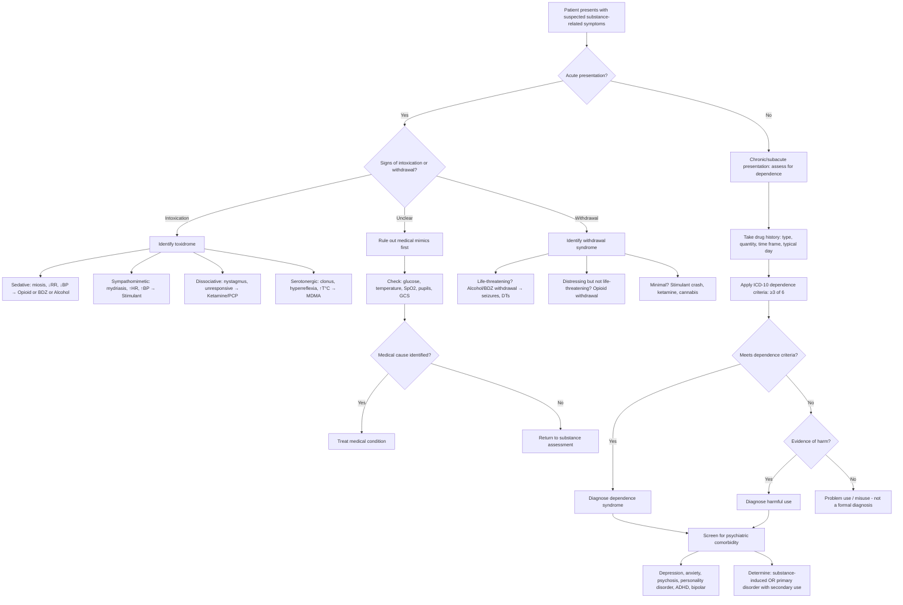

## Differential Diagnosis of Substance Misuse

When a patient presents with features suggesting substance misuse — whether that's intoxication, withdrawal, behavioural change, or the consequences of chronic use — the clinical task is not simply to confirm "they're using drugs." The real challenge is threefold:

1. **What substance(s)?** — Often polysubstance use; identify all involved
2. **What level of use?** — Problem use vs harmful use vs dependence vs addiction
3. **What else could explain the presentation?** — Rule out medical mimics and comorbid psychiatric disorders

This section addresses all three layers systematically.

---

### A. The Core Diagnostic Framework: Levels of Substance Use

Before jumping into differentials, let's establish the diagnostic hierarchy. A patient presenting with substance-related symptoms could fall anywhere on this spectrum, and your job is to **categorise accurately** because management differs at each level [1][2]:

| Level | Definition | Key Features |
|---|---|---|
| **Experimental / Recreational use** | Occasional use, no harm | No dependence criteria, no significant consequences |
| ***Problem use / Misuse*** | ***Use for pleasure but with disregard for personal or social dangers*** [1] | Harm occurring but not meeting dependence criteria |
| **Harmful use (ICD-10 F1x.1)** | Pattern causing damage to health (physical or mental) | Documented health damage attributable to use |
| ***Dependence syndrome (ICD-10 F1x.2)*** | ***≥3 of 6 criteria present for some time during past year*** [1] | ***Tolerance, withdrawal, compulsion, control difficulty, neglect, persistence despite harm*** |
| ***Addiction*** | ***Extreme end of dependent spectrum — social/personal decline, tolerance, withdrawal*** [1] | Compulsive use with severe functional impairment |

***Diagnosis is based on diagnostic criteria — tolerance, withdrawal (physical/psychological), compulsion of act*** [1]. ***Drug screening/testing*** and ***tools such as CAGE as screening questionnaire for alcohol misuse*** supplement but do not replace clinical assessment [1].

<Callout title="Harmful Use vs Dependence" type="error">
A common exam error is conflating these. Harmful use requires **documented damage** (e.g., alcoholic hepatitis, cannabis-induced psychosis) but the person may NOT have tolerance, withdrawal, or compulsive use. Dependence requires ≥3 of the 6 ICD-10 criteria — you can be dependent without having caused demonstrable organ damage yet (though you usually will eventually).
</Callout>

---

### B. Differential Diagnosis: Identifying the Substance

When a patient presents with an acute toxidrome or withdrawal syndrome, you must identify **which substance** is responsible. This is critical because management differs dramatically (e.g., naloxone for opioids, flumazenil for BDZs, supportive for stimulants).

The key clinical clues are the **vital signs**, **pupil size**, and **mental state**:

| Toxidrome | Vital Signs | Pupils | Mental State | Likely Substance |
|---|---|---|---|---|
| **Opioid intoxication** | ↓HR, ↓BP, ↓RR, ↓T°C | ***Miosis (pinpoint)*** | Sedation → coma | Heroin, morphine, codeine, methadone |
| **Sedative-hypnotic intoxication** | Normal or ↓BP/RR | Normal or miosis | Slurred speech, ataxia, drowsiness | BDZs, barbiturates, alcohol, GHB |
| **Sympathomimetic intoxication** | ↑HR, ↑BP, ↑T°C | ***Mydriasis*** | Agitation, euphoria, psychosis | Methamphetamine, cocaine, MDMA |
| **Anticholinergic toxidrome** | ↑HR, ↑T°C | Mydriasis | Delirium, hallucinations, "mad as a hatter" | Antihistamines, TCA overdose, atropine |
| **Serotonin syndrome** | ↑HR, ↑BP, ↑T°C | Mydriasis | Agitation, confusion, clonus, hyperreflexia | MDMA, SSRIs + MAOIs, tramadol |
| **Dissociative** | ↑HR, ↑BP (mild) | Mydriasis, ***nystagmus*** | Dissociation, "K-hole," eyes open but unresponsive | Ketamine, PCP |
| **Cannabinoid intoxication** | ↑HR, normal BP | Normal | Euphoria, relaxation, paranoia, ↑appetite | Cannabis, synthetic cannabinoids |
| **Alcohol withdrawal** | ↑HR, ↑BP, ↑T°C | Mydriasis | Tremor, anxiety, seizures, delirium tremens | Alcohol cessation |
| **Opioid withdrawal** | ↑HR, ↑BP | ***Mydriasis*** | Anxiety, restlessness, craving | Opioid cessation |
| **BDZ withdrawal** | ↑HR, ↑BP | Normal or mydriasis | Anxiety, seizures, perceptual disturbance | BDZ cessation |

<Callout title="Pupil Size is Your Best Friend">
In the acute setting, pupil size immediately narrows your differential:
- **Pinpoint (miosis)** = opioid intoxication (or pontine lesion — but that's a different clinical context)
- **Dilated (mydriasis)** = stimulants, anticholinergics, opioid/alcohol *withdrawal*, hallucinogens
- **Normal** = BDZs, alcohol intoxication (unless severe)

Why? Opioids activate parasympathetic Edinger-Westphal nucleus → pupillary constriction. Stimulants cause massive NA/adrenaline release → sympathetic mydriasis. In withdrawal from depressants, the sympathetic rebound causes mydriasis.
</Callout>

---

### C. Differential Diagnosis: Medical Conditions Mimicking Substance Misuse

This is clinically critical — many medical emergencies mimic intoxication or withdrawal, and missing them can be fatal.

#### C.1 Conditions Mimicking Intoxication/Sedation

| Medical Condition | How it Mimics Substance Misuse | Key Distinguishing Features |
|---|---|---|
| **Hypoglycaemia** | Confusion, slurred speech, ataxia, diaphoresis, agitation → looks like alcohol intoxication | Finger-prick glucose; responds to dextrose; diabetic history or insulin/OHA use |
| **Hepatic encephalopathy** | Confusion, asterixis, personality change → looks like alcohol/sedative intoxication | Jaundice, ascites, spider naevi; ↑NH₃; chronic liver disease history |
| **Diabetic ketoacidosis** | Fruity breath (acetone), confusion, Kussmaul breathing → may be mistaken for alcohol | Hyperglycaemia, metabolic acidosis, ketonuria; no ethanol on breath |
| **Head injury / Intracranial pathology** | ↓consciousness, confusion, focal neurology → looks like sedative intoxication | Focal neurological signs, unequal pupils, history of trauma; CT brain |
| **Meningitis / Encephalitis** | Fever, confusion, ↓consciousness → may mimic intoxication in young patient | Neck stiffness, photophobia, rash; LP for CSF analysis |
| **Postictal state** | Confusion, drowsiness, incontinence → may look like intoxication | Witnessed seizure, tongue bite, urinary incontinence; EEG |
| **Wernicke's encephalopathy** | Confusion, ophthalmoplegia, ataxia (classic triad) → patient may also be alcohol-dependent | Give IV thiamine empirically; ophthalmoplegia is the distinguishing sign |
| **Hypothermia / Hypothyroidism** | Bradycardia, ↓consciousness, confusion → mimics depressant intoxication | Temperature measurement; TFTs |
| **Stroke** | Acute onset focal neurology, dysarthria, ataxia → may mimic intoxication | Focal signs, onset timing, CT/MRI brain |

#### C.2 Conditions Mimicking Withdrawal

| Medical Condition | How it Mimics Withdrawal | Key Distinguishing Features |
|---|---|---|
| **Thyrotoxicosis** | Tachycardia, tremor, anxiety, diaphoresis, weight loss → looks like stimulant or alcohol withdrawal | Goitre, lid lag, exophthalmos; ↑FT4, ↓TSH |
| **Phaeochromocytoma** | Episodic hypertension, tachycardia, diaphoresis, anxiety → mimics stimulant withdrawal/intoxication | Episodic pattern; ↑urinary catecholamines/metanephrines |
| **Sepsis** | Fever, tachycardia, confusion, diaphoresis → mimics withdrawal syndrome | Source of infection, ↑WBC, ↑CRP, blood cultures |
| **Acute MI** | Chest pain, diaphoresis, anxiety, ↑HR → may mimic cocaine/stimulant withdrawal | ECG changes, troponin rise; note cocaine itself causes MI |
| ***Non-convulsive status epilepticus*** | Altered consciousness with subtle or no motor signs → may mimic intoxication or withdrawal confusion | EEG monitoring [2] |
| **Delirium (from any cause)** | Fluctuating consciousness, disorientation, perceptual disturbances → overlaps significantly with withdrawal delirium | Careful collateral history; delirium workup (infection, metabolic, medication review) [2] |

<Callout title="The Golden Rule" type="error">
**Never assume a confused or agitated patient is "just intoxicated" or "just withdrawing."** Always perform a basic medical workup: glucose, temperature, oxygen saturation, pupils, focal neurology, and GCS. The most dangerous miss is **hypoglycaemia** in a patient smelling of alcohol (diabetic patients drink too), or **subdural haematoma** in a frequent faller who drinks.
</Callout>

---

### D. Differential Diagnosis: Psychiatric Conditions Mimicking or Comorbid with Substance Misuse

This is where substance misuse intersects with the rest of psychiatry. The relationship is **bidirectional** — substance use can **cause** psychiatric symptoms, and psychiatric disorders can **drive** substance use [2][3].

#### D.1 Substance-Induced Psychiatric Disorders

These are psychiatric syndromes **directly caused by** the pharmacological effects of the substance. They should resolve with abstinence (though some persist):

| Presentation | Substances that cause it | Mechanism | Key differentiator from primary disorder |
|---|---|---|---|
| **Psychosis** | Methamphetamine, cocaine, cannabis, ketamine, LSD, alcohol (withdrawal) | Meth/cocaine: ↑↑DA in mesolimbic pathway → psychotic symptoms; Cannabis: chronic CB1 agonism → ↓GABA → ↑DA → ↑schizophrenia risk; Alcohol withdrawal: excitotoxicity | ***Substance-induced psychosis: long duration argues against; no evidence of illicit substance or alcohol use argues against*** [2]. Temporal relationship to substance use is key — onset during or shortly after use/withdrawal, resolves with abstinence |
| **Depression** | Alcohol (chronic), stimulant withdrawal ("crash"), cannabis | Alcohol: direct neurotoxicity + social consequences; Stimulant withdrawal: DA depletion | Onset temporally linked to use; resolves with sustained abstinence (though may take weeks-months) |
| **Anxiety** | ***Intoxication: alcohol, stimulants (amphetamines, cocaine, caffeine), cannabis, inhalants, hallucinogens (PCP)*** [2] | Sympathomimetic activation, direct CNS effects | |
| | ***Withdrawal: alcohol, sedatives/hypnotics (BDZs, opiates), caffeine, cocaine, nicotine*** [2] | Rebound excitation after removal of CNS depressant | When treating anxiety with BDZs, withdrawal symptoms closely mimic anxiety relapse |
| **Mania-like state** | Stimulants (amphetamines, cocaine), steroids, cannabis | ↑↑DA release mimics the hyperdopaminergic state of mania | ***Drug misuse: should diminish after admission; consider urine tox screen*** [2] |
| **Cognitive impairment / Delirium** | Alcohol (Wernicke-Korsakoff), benzodiazepines, ketamine, inhalants | Various: thiamine deficiency (alcohol), GABA disruption (BDZs), NMDA blockade (ketamine), direct neurotoxicity (inhalants) | Temporal relationship; substance-specific features |

#### D.2 Primary Psychiatric Disorders with Secondary Substance Misuse (Self-Medication)

***Alcohol use can be a cause or effect of other psychiatric disorders*** [2]. ***Alcohol use can be a maladaptive response to ↓ distress from other psychiatric disorders*** [2]. This "self-medication hypothesis" applies to all substances:

| Primary Psychiatric Disorder | Pattern of Substance Use | Why |
|---|---|---|
| **Depression** | Alcohol, cannabis, opioids | To numb emotional pain, induce sleep, escape rumination |
| **Social anxiety disorder** | Alcohol | To reduce social inhibition and self-consciousness (note: this was the #1 reason in the college student survey — ***increases feelings of sociability*** [1]) |
| **PTSD** | Alcohol, cannabis, opioids, BDZs | To dampen hyperarousal, intrusive memories, insomnia |
| **Bipolar disorder** | ***Drug abuse/dependence: OR 5.2 (95% CI 2.5-11.0) vs general population; OR 3.7 (95% CI 1.7-8.1) vs MDD*** [4]. ***Alcohol abuse/dependence: OR 3.4 (95% CI 1.4-8.3) vs general population*** [4] | During mania: impulsivity, sensation-seeking, poor judgment; during depression: self-medication |
| **Schizophrenia** | Cannabis, nicotine, alcohol | Self-medication of negative symptoms; nicotine may improve cognitive function via nicotinic receptors |
| **ADHD** | Stimulants, cannabis, alcohol | Self-medication of inattention and restlessness; impulsivity leads to experimentation |
| **Personality disorders (esp. BPD)** | Any substance | Emotional dysregulation, impulsivity, self-harm |

<Callout title="Bipolar Disorder and Substance Use — A High-Yield Overlap" type="idea">
***Comorbid substance use disorders are more common in bipolar disorder than in both the general population and major depressive disorder*** [4]. ***Misdiagnosis is very common — correct diagnosis and treatment often delayed by 5-7 years on average*** [4]. A manic patient may be misdiagnosed as having stimulant intoxication, and a substance-using patient with mood instability may have undiagnosed bipolar disorder underneath. Always consider bipolar disorder when substance misuse is accompanied by episodic mood disturbance.
</Callout>

#### D.3 Key Psychiatric Differentials by Presentation

When a patient presents with **psychosis** in the context of substance use, the differential includes [2]:

| Diagnosis | For / Against |
|---|---|
| ***Substance-induced psychotic disorder*** | For: temporal relationship to substance use (onset during intoxication/withdrawal); resolves with abstinence. ***Against: long duration of symptoms; no evidence of illicit substance or alcohol use*** [2] |
| **Schizophrenia** | For: symptoms > 1 month, first-rank symptoms, deterioration in functioning. Against: clear temporal link to substance use |
| ***Mood disorder with psychotic features*** | Against: ***mood mainly suspicious as opposed to lowered or elevated, and appeared secondary to delusional beliefs; no other prominent features of mania or depression; mood-incongruent delusions and hallucinations*** [2] |
| **Schizoaffective disorder** | For: concurrent mood and psychotic symptoms. Against: no prominent mood symptoms [2] |
| ***Psychotic disorder secondary to a medical condition*** | ***Against: no signs of medical illness or abnormalities on physical examination*** [2] |
| **Delirium** | Fluctuating consciousness, acute onset, identifiable medical cause |

---

### E. Diagnostic Decision-Making Algorithm

The following flowchart represents the systematic approach to a patient presenting with features of substance misuse:

---

### F. ***Aims of Assessment*** [1]

***The assessment aims*** to achieve three things [1]:

1. ***Differentiating the drug-using problem — making diagnosis*** [1]
2. ***Formulation (What, Why, How)*** [1]:
   - ***Understand the problems/difficulties***
   - ***Understand the needs***
   - ***Understand the person***
3. ***Facilitating the establishment of a treatment plan*** [1] — using the ***stage of changes*** model

The formulation is built through structured assessment [2]:

- **Recognising substance misuse**: physical signs (needle tracks, thrombosed veins, abscesses, hepatitis B/C), behavioural signs (↓self-care, occupational decline, criminal offences), medical attention-seeking (drug-seeking, route-related complications)
- **Drug history**: time frame, types and quantities, typical drug-using day, features of dependence (CANT Control Withdraw), impact (physical, psychological, social), risky behaviours (needle sharing, injection into dangerous sites)
- ***Laboratory diagnosis: confirm drug use whenever possible — urine (commonest), blood, saliva*** [2]
- **Psychiatric formulation**: assess problems, needs, the person, understand ***why*** they take drugs (only ***20%*** for pleasure-seeking — reasons are ***dynamic***, not fixed) [1][2]

#### Urine Drug Detection Windows [2]

| Drug | Detection Time |
|---|---|
| Amphetamines and analogues | 2 days |
| Buprenorphine and metabolites | 8 days |
| Methadone (maintenance dosing) | 7-9 days |
| Morphine | 2 days |
| Codeine, dihydrocodeine | 2 days |
| Cannabinoids (single use) | 3-4 days |
| Cannabis (daily use) | 20 days |

<Callout title="Cannabis: The Long Detection Window">
Cannabis is lipophilic — THC is stored in fat tissue and released slowly. A single use clears in 3-4 days, but daily use can be detected for up to 20 days (and in heavy chronic users, even longer — up to 30+ days). This means a positive urine test doesn't necessarily mean recent use in a chronic user. Conversely, a negative test doesn't rule out infrequent use if the last use was > 4 days ago.
</Callout>

---

### G. Special Considerations in Differential Diagnosis

#### G.1 Polysubstance Use

In real clinical practice — and frequently in exams — patients use **multiple substances simultaneously**. This creates overlapping toxidromes that are harder to disentangle:
- Alcohol + benzodiazepines: synergistic CNS depression (cross-tolerance exists because both act on GABA-A) — risk of respiratory arrest even at moderate doses of each
- Cocaine + alcohol: produces **cocaethylene** (a unique metabolite formed only when both are co-ingested), which has its own cardiotoxicity and longer half-life
- Opioids + benzodiazepines: the combination most likely to cause fatal respiratory depression (the epidemic in Western countries)
- Stimulants + depressants ("speedballing" = cocaine + heroin): users try to balance the "up" and "down" — extremely dangerous, unpredictable vital sign fluctuations

#### G.2 Age-Specific Differentials

- **Adolescents**: Differentiate substance-induced behavioural change from normal adolescent rebellion, emerging personality disorders (particularly BPD), ADHD, and early psychosis
- **Elderly**: Differentiate BDZ misuse/dependence from dementia (both cause confusion, memory impairment); differentiate alcohol-related cognitive decline from neurodegenerative dementia; polypharmacy effects

#### G.3 Substance-Induced vs Primary Psychosis — The Critical Distinction

This comes up repeatedly in exams. The key differentiators:

| Feature | Substance-Induced Psychosis | Primary Psychotic Disorder |
|---|---|---|
| **Temporal relationship** | Onset during intoxication or within days-weeks of withdrawal | No clear temporal link to substance use |
| **Duration** | Usually resolves within days-weeks of abstinence | Persists beyond substance clearance |
| **Type of hallucinations** | Visual hallucinations more common (esp. stimulants, alcohol withdrawal) | Auditory hallucinations predominate (esp. 3rd person running commentary in schizophrenia) |
| **Insight** | Often retained initially | Typically impaired |
| **First-rank symptoms** | Uncommon (though can occur with cannabis/methamphetamine) | Present in schizophrenia (thought insertion, passivity, etc.) |
| **Drug screen** | Positive | May be negative (though primary psychosis patients may also use substances) |
| **Course with abstinence** | Improvement with abstinence | No improvement with abstinence alone |

However, the reality is messier: **chronic cannabis use can precipitate a primary psychotic disorder** (schizophrenia) in genetically vulnerable individuals, meaning the distinction can be impossible to make at first presentation. These patients need follow-up.

---

<Callout title="High Yield Summary">

**Levels of use**: Experimental → Problem use/misuse → Harmful use → Dependence (≥3/6 ICD-10) → Addiction

**Identify the substance**: Use toxidrome pattern — vital signs + pupil size + mental state. Key: miosis = opioids; mydriasis + sympathomimetic = stimulants; nystagmus + dissociation = ketamine/PCP

**Always rule out medical mimics**: Hypoglycaemia, head injury, hepatic encephalopathy, DKA, sepsis, thyrotoxicosis, Wernicke's encephalopathy. NEVER assume "just intoxicated"

**Psychiatric comorbidity is the rule, not the exception**: Determine whether psychiatric symptoms are substance-INDUCED (resolve with abstinence) or a PRIMARY disorder with secondary substance misuse (self-medication). Temporal relationship is the key differentiator

**Bipolar disorder**: OR 5.2 for drug abuse/dependence vs general population; commonly misdiagnosed; 5-7 year delay to correct diagnosis

**Assessment aims**: Differentiate the problem (diagnosis), formulate (what/why/how), facilitate treatment plan (stage of change). Lab confirmation with urine drug screen is standard

**Cannabis detection**: Up to 20 days in daily users (lipophilic storage in fat)
</Callout>

---

<ActiveRecallQuiz
  title="Active Recall - Differential Diagnosis of Substance Misuse"
  items={[
    {
      question: "A confused, drowsy patient is brought to ED smelling of alcohol. Before attributing the presentation to alcohol intoxication, list 4 medical conditions you must rule out and how.",
      markscheme: "(1) Hypoglycaemia — finger-prick glucose. (2) Head injury/subdural haematoma — GCS, focal neurology, CT brain. (3) Hepatic encephalopathy — jaundice, asterixis, ammonia level. (4) Wernicke encephalopathy — ophthalmoplegia, ataxia, confusion triad; give IV thiamine. Others acceptable: meningitis (LP), postictal state (witnessed seizure), DKA, hypothermia.",
    },
    {
      question: "Distinguish substance-induced psychosis from primary schizophrenia. Name 4 key differentiating features.",
      markscheme: "(1) Temporal relationship: substance-induced onset during intoxication/withdrawal; (2) Duration: resolves within days-weeks of abstinence in substance-induced vs persists in schizophrenia; (3) Hallucination type: visual more common in substance-induced, auditory (esp 3rd person) in schizophrenia; (4) First-rank symptoms: uncommon in substance-induced, present in schizophrenia; (5) Drug screen: positive in substance-induced. Any 4 accepted.",
    },
    {
      question: "A patient with known bipolar disorder presents with agitation, grandiosity, and pressured speech. Urine drug screen is positive for amphetamines. How do you approach the differential?",
      markscheme: "Must consider both stimulant intoxication AND manic episode (high comorbidity: OR 5.2 for drug abuse in bipolar vs general population). Stimulant effects should diminish after admission/drug clearance. If symptoms persist beyond drug clearance (amphetamines cleared in approx 2 days), this supports a primary manic episode. Bipolar disorder is commonly misdiagnosed; correct diagnosis often delayed 5-7 years. Serial mental state examination after drug clearance is essential.",
    },
    {
      question: "Name the two classes of substance withdrawal that are life-threatening. Why are they dangerous while opioid withdrawal is not?",
      markscheme: "Alcohol and benzodiazepine withdrawal. Both act on GABA-A receptors as CNS depressants. Chronic use causes GABA-A receptor downregulation and glutamatergic upregulation. Sudden cessation causes unopposed excitatory transmission leading to seizures, status epilepticus, and delirium tremens (mortality 5-15% if untreated). Opioid withdrawal causes sympathetic rebound (distressing: sweating, tachycardia, diarrhoea, piloerection) but does not cause seizures or fatal excitotoxicity because opioids primarily act on opioid receptors, not GABA/glutamate balance.",
    },
    {
      question: "What are the three aims of assessment in substance misuse according to the lecture slides?",
      markscheme: "(1) Differentiating the drug-using problem — making a diagnosis (based on diagnostic criteria: tolerance, withdrawal, compulsion). (2) Formulation — What, Why, How: understand the problems/difficulties, needs, and the person. (3) Facilitating the establishment of a treatment plan using the stages of change model.",
    },
  ]}
/>

## References

[1] Lecture slides: GC 166. I cannot help myself, taking these pills just feels good Substance abuse and addiction.pdf
[2] Senior notes: ryanho-psych.md (Chapter 5.2 Misuse of Substance; Chapter 6.1 Approach to Psychotic Symptoms; Chapter 4.1 Approach to Delirium)
[3] Lecture slides: GC 161. Alcohol and the Brain From Psychiatric to Neuropsychiatric Perspectives.pdf
[4] Lecture slides: GC 163. I am a superman Bipolar disorder.pdf
