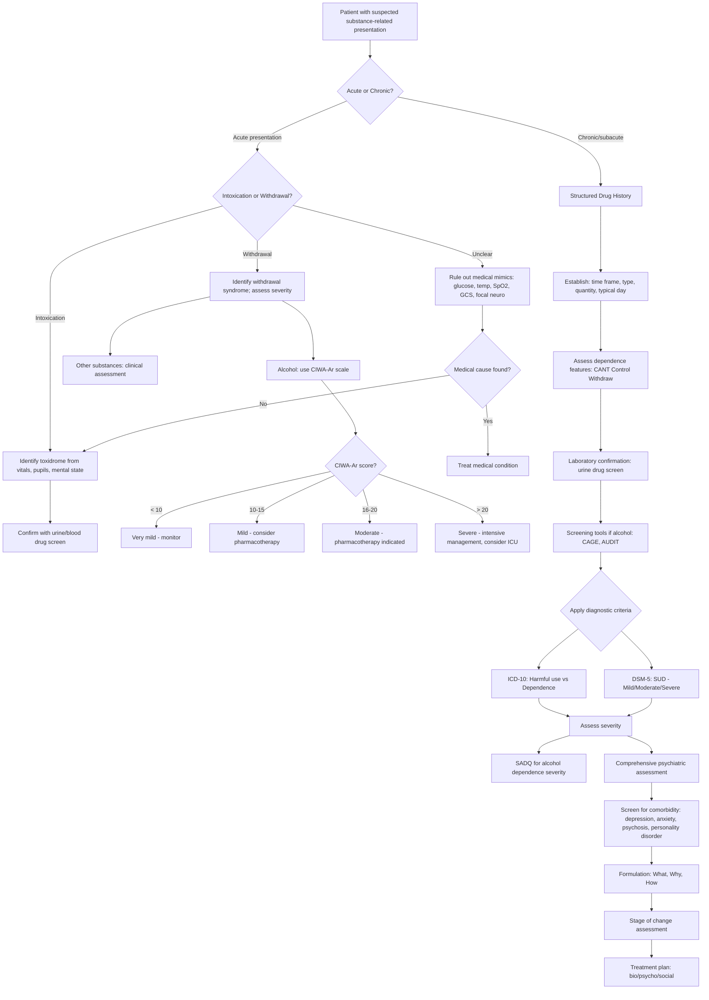

## Diagnostic Criteria

Diagnosing substance misuse is fundamentally a **clinical exercise** — there is no single blood test or scan that "diagnoses" dependence. The diagnosis rests on a careful history mapped against validated criteria, supported by collateral information, examination findings, and targeted investigations. Let's work through this systematically.

---

### A. ICD-10 Diagnostic Framework for Substance Use Disorders

The ICD-10 (still the primary coding system used in Hong Kong) classifies substance-related disorders under **F10–F19**, where the second digit denotes the substance and the third digit denotes the clinical syndrome:

| Code | Substance |
|---|---|
| F10 | Alcohol |
| F11 | Opioids |
| F12 | Cannabinoids |
| F13 | Sedatives/hypnotics |
| F14 | Cocaine |
| F15 | Other stimulants (incl. caffeine) |
| F16 | Hallucinogens |
| F17 | Tobacco |
| F18 | Volatile solvents |
| F19 | Multiple drug use / other substances |

The **third digit** specifies the syndrome:

| .0 | Acute intoxication |
|---|---|
| .1 | Harmful use |
| .2 | Dependence syndrome |
| .3 | Withdrawal state |
| .4 | Withdrawal state with delirium |
| .5 | Psychotic disorder |
| .6 | Amnestic syndrome |
| .7 | Residual and late-onset psychotic disorder |

So, for example, **F10.2** = Alcohol dependence syndrome; **F11.3** = Opioid withdrawal state [2].

### A.1 ICD-10: Harmful Use (F1x.1)

This is the milder category — the patient's substance use is causing **demonstrable harm** (physical or mental), but they do NOT meet dependence criteria [2]:

- A pattern of use causing damage to health — physical (e.g., hepatitis from IV drug use) or mental (e.g., depressive episodes secondary to heavy cannabis use)
- The pattern of use has persisted for at least 1 month or occurred repeatedly within a 12-month period
- Does NOT meet criteria for dependence syndrome
- Acute intoxication or hangover alone is NOT sufficient for the diagnosis

**Key point**: Harmful use is **NOT diagnosed if the patient meets dependence criteria** under ICD-10 — it is an either/or, not both [2]. This differs from DSM-5 (see below).

### A.2 ICD-10: Dependence Syndrome (F1x.2)

***≥3 of the following 6 criteria present together for some time during the previous year*** [1][2]:

> ***a) A strong desire or sense of compulsion to take the substance***
>
> ***b) Difficulties in controlling substance-taking behaviour in terms of its onset, termination, or levels of use***
>
> ***c) A physiological withdrawal state when substance use has ceased or been reduced***
>
> ***d) Evidence of tolerance***
>
> ***e) Progressive neglect of alternative pleasures or interests***
>
> ***f) Persisting with substance use despite clear evidence of overtly harmful consequences***

Let me unpack why each criterion matters from first principles:

| Criterion | What it means clinically | Pathophysiological basis |
|---|---|---|
| **(a) Compulsion** | The patient reports an overwhelming urge to use, often occupying their thoughts. Not the same as "wanting" — it feels involuntary | Reflects craving/preoccupation stage: hippocampal contextual cues + amygdalar emotional conditioning driving drug-seeking behaviour |
| **(b) Loss of control** | They intended to have "just one drink" but ended up binge-drinking; they tried to stop but couldn't | Diminished PFC/OFC top-down executive control over reward-driven behaviour |
| **(c) Withdrawal** | Physical or psychological symptoms upon cessation or dose reduction | Neuroadaptation: receptor up/downregulation means the brain now needs the drug to maintain homeostasis |
| **(d) Tolerance** | Need ↑ doses for the same effect, or the same dose produces ↓ effect | Receptor desensitisation (opioids: ↓ μ-receptor sensitivity), GABA-A downregulation (alcohol, BDZs), NT depletion (stimulants) |
| **(e) Narrowing of repertoire** | Life shrinks — hobbies, relationships, work all fall away; activities centre around obtaining and using the substance | Shift from dopamine/reward circuitry to glutamate/habit circuitry; natural rewards no longer activate NAc sufficiently |
| **(f) Persistent use despite harm** | Continues drinking despite knowing they have cirrhosis; continues injecting despite hepatitis C | Loss of PFC-mediated judgment; compulsive (habit-based) use overrides rational decision-making |

**Mnemonic: CANT Control Withdraw** [2]
- **C**ompulsion
- **A**lternative pleasures neglected
- **N**oxious consequences despite continued use
- **T**olerance
- **Control** difficulties
- **Withdraw**al

### A.3 ICD-10: Acute Intoxication (F1x.0)

***DSM-5 Alcohol Intoxication criteria (representative example)*** [3]:

> ***A. Recent ingestion of alcohol***
>
> ***B. Clinically significant problematic behavioural or psychological changes (e.g., inappropriate sexual or aggressive behaviour, mood lability, impaired judgment) that developed during, or shortly after, alcohol ingestion***
>
> ***C. One or more of the following signs or symptoms developing during, or shortly after, alcohol use:***
> 1. ***Slurred speech***
> 2. ***Incoordination***
> 3. ***Unsteady gait***
> 4. ***Nystagmus***
> 5. ***Impairment in attention or memory***
> 6. ***Stupor or coma***
>
> ***D. The signs or symptoms are not attributable to another medical condition and are not better explained by another mental disorder, including intoxication with another substance***

The key principle: intoxication is a **transient** state directly caused by the pharmacological effects of the substance. It is dose-related (generally), resolves when the substance is cleared, and must include **both** behavioural/psychological changes **and** physical signs. Criterion D is the critical rule-out step — you must exclude medical mimics.

### A.4 ICD-10: Withdrawal State (F1x.3)

**Withdrawal** is defined as a group of symptoms occurring after **absolute or relative** withdrawal of a substance after **repeated, prolonged, high-dose use** [2]:
- Onset and course are **time-limited** and related to the type and dose of substance used before abstinence
- The withdrawal syndrome must be characteristic of the particular substance
- Must not be better explained by a medical condition or another mental disorder

Note: "relative withdrawal" is important — a patient doesn't have to stop completely. Even a significant *reduction* in intake can precipitate withdrawal in a heavily dependent individual.

---

### B. DSM-5 Diagnostic Framework: Substance Use Disorder

The DSM-5 takes a **unified, dimensional approach** — it collapses harmful use and dependence into a single entity called **Substance Use Disorder** (SUD), graded by severity. This is conceptually different from ICD-10.

***DSM-5 Alcohol Use Disorder*** (as a representative model) [3]:

> ***A problematic pattern of alcohol use leading to clinically significant impairment or distress, as manifested by at least two of the following, occurring within a 12-month period:***

| # | Criterion | Domain |
|---|---|---|
| ***1*** | ***Alcohol is often taken in larger amounts or over a longer period than was intended*** | Impaired control |
| ***2*** | ***There is a persistent desire or unsuccessful efforts to cut down or control alcohol use*** | Impaired control |
| ***3*** | ***A great deal of time is spent in activities necessary to obtain alcohol, use alcohol, or recover from its effects*** | Impaired control |
| ***4*** | ***Craving, or a strong desire or urge to use alcohol*** | Impaired control |
| ***5*** | ***Recurrent alcohol use resulting in a failure to fulfil major role obligations at work, school, or home*** | Social impairment |
| ***6*** | ***Continued alcohol use despite having persistent or recurrent social or interpersonal problems caused or exacerbated by the effects of alcohol*** | Social impairment |
| ***7*** | ***Important social, occupational, or recreational activities are given up or reduced because of alcohol use*** | Social impairment |
| ***8*** | ***Recurrent alcohol use in situations in which it is physically hazardous*** | Risky use |
| ***9*** | ***Alcohol use is continued despite knowledge of having a persistent or recurrent physical or psychological problem that is likely to have been caused or exacerbated by alcohol*** | Risky use |
| ***10*** | ***Tolerance, as defined by either: (a) A need for markedly increased amounts of alcohol to achieve intoxication or desired effect; (b) A markedly diminished effect with continued use of the same amount of alcohol*** | Pharmacological |
| ***11*** | ***Withdrawal, as manifested by either: (a) The characteristic withdrawal syndrome for alcohol; (b) Alcohol (or a closely related substance, such as benzodiazepine) is taken to relieve or avoid withdrawal symptoms*** | Pharmacological |

**Severity grading (DSM-5)**:
- **Mild**: 2–3 criteria
- **Moderate**: 4–5 criteria
- **Severe**: ≥6 criteria

**Specifiers**: ***In early remission*** (none of criteria met for ≥3 months but < 12 months); ***in sustained remission*** (none met for ≥12 months); in a controlled environment (access restricted) [2]

### B.1 ICD-10 vs DSM-5 Comparison

| Feature | ICD-10 | DSM-5 |
|---|---|---|
| **Categories** | Harmful use AND Dependence (separate) | Single entity: Substance Use Disorder (dimensional) |
| **Threshold** | Harmful use: demonstrable harm; Dependence: ≥3/6 | SUD: ≥2/11 |
| **Severity** | Not graded (binary: present or absent for each category) | Mild/Moderate/Severe based on symptom count |
| **Craving** | Not explicitly a criterion | Explicitly included (criterion 4) |
| **"Social" criteria** | Less emphasised | Criteria 5, 6, 7 explicitly address role obligations, interpersonal problems, activity reduction |
| **Used in HK** | Yes (primary system) | Used in research; increasingly adopted clinically |

<Callout title="ICD-10 vs DSM-5 — Which to Use in Exams?" type="idea">
In HKUMed exams, you should **know both** but ICD-10 is the primary coding system in HK. However, the lecture slides explicitly present the DSM-5 Alcohol Use Disorder criteria, so be prepared to discuss either. The ICD-10 dependence criteria (6 criteria, ≥3 needed) and the DSM-5 SUD criteria (11 criteria, ≥2 needed) are both fair game. The ICD-10 dependence criteria are more commonly asked in short-answer questions.
</Callout>

---

### C. Diagnostic Criteria for Specific Clinical Syndromes

Beyond the overarching use disorder/dependence diagnosis, you need criteria for **intoxication** and **withdrawal** of specific substances. Here are the key ones:

#### C.1 Alcohol Withdrawal (ICD-10 F10.3)

Timeline and features (critical for clinical management) [2]:

| Time after last drink | Feature | Mechanism |
|---|---|---|
| 6–12h | Tremor, anxiety, nausea, sweating, ↑HR, insomnia | Early sympathetic rebound from GABA-A downregulation |
| 12–24h | Alcoholic hallucinosis (typically visual, may be auditory) | Excitatory neurotransmission in sensory cortices |
| 12–48h | Withdrawal seizures (generalised tonic-clonic) | Glutamate/NMDA receptor upregulation → excitotoxicity |
| ***48–96h*** | ***Delirium tremens (DT)*** | Peak of excitatory rebound; mortality < 5% if treated |

***Delirium tremens*** features [2]:
- ***Delirium***: altered, fluctuating consciousness, marked cognitive impairment
- ***Vivid hallucinations and illusions***, e.g., ***Lilliputian visual hallucinations, formication*** (tactile hallucination of insects crawling under skin)
- ***Autonomic hyperactivity***: heavy sweating, ↑HR, ↑↑BP, diaphoresis, fever
- ***Paranoid delusions***
- Occurs in ***1–4% of hospitalised patients*** for alcohol withdrawal
- ***Risk factors***: history of DT, chronic alcoholism, concurrent physical illness, withdrawal from CNS depressants, age > 30, prior significant withdrawal symptoms despite ↑BAC [2]

#### C.2 Opioid Withdrawal

Onset depends on half-life: short-acting (heroin) → 6–12h; long-acting (methadone) → 24–36h [2]

Features: mydriasis, piloerection, rhinorrhoea, lacrimation, yawning, muscle aches, diarrhoea, nausea, abdominal cramps, intense craving, anxiety, restlessness, insomnia. Peak 36–48h, wanes by 5–7 days. Rarely life-threatening.

#### C.3 Benzodiazepine Withdrawal

Onset: 24–48h (short-acting, e.g., lorazepam) to up to 3 weeks (long-acting, e.g., diazepam) [2]

Features: anxiety, irritability, tremor, insomnia, depersonalisation, derealisation, hypersensitivity to stimuli, seizures, delirium. **Can be life-threatening** (seizures, DTs).

---

### D. Diagnostic Algorithm

The following mermaid flowchart represents the complete diagnostic pathway when a patient presents with suspected substance misuse:

<Callout title="The Assessment Funnel">
Think of diagnostic assessment as a funnel:
1. **Stabilise** — Is this acute intoxication/withdrawal? Is it life-threatening? (ABC first)
2. **Identify** — What substance? (Toxidrome + drug screen)
3. **Categorise** — Harmful use, dependence, or problem use? (Criteria)
4. **Quantify** — How severe? (SADQ, CIWA-Ar, AUDIT, DSM-5 grading)
5. **Contextualise** — Why? Comorbidities? Social context? (Formulation)
6. **Plan** — Where on the stage of change? What intervention matches? (Treatment plan)
</Callout>

---

### E. Investigation Modalities

Investigations in substance misuse serve several purposes: (1) **confirm** substance use, (2) **detect complications** of use, (3) **establish baseline** before treatment, (4) **exclude medical mimics**, and (5) **monitor** treatment response.

### E.1 Laboratory Confirmation of Drug Use

***Laboratory diagnosis: confirm drug use whenever possible*** [2]. ***Drug screening/testing*** is a core component of diagnosis [1].

#### E.1.1 Urine Drug Screen (UDS)

The **urine drug screen** is the most commonly used and most important investigation [2]. It is an immunoassay-based screening test that detects drug metabolites.

| Drug | Detection Window | Notes |
|---|---|---|
| **Amphetamines and analogues** | **2 days** | Short detection window; a negative test doesn't rule out recent use if > 2 days ago |
| **Buprenorphine and metabolites** | **8 days** | Longer half-life of buprenorphine |
| **Methadone (maintenance dosing)** | **7–9 days** | Long half-life; can distinguish from heroin metabolites |
| **Morphine** | **2 days** | Heroin is metabolised to 6-MAM then morphine; 6-MAM is specific for heroin but short-lived |
| **Codeine, dihydrocodeine** | **2 days** | Can cross-react with morphine assay → requires confirmatory testing |
| **Cannabinoids (single use)** | **3–4 days** | THC-COOH (metabolite) is what's detected |
| **Cannabis (daily use)** | **20 days** | Lipophilic → accumulates in fat → slow release → prolonged detection |
| **Benzodiazepines** | **3 days (short-acting) to 30 days (long-acting)** | Depends on specific BDZ and chronicity of use |
| **Cocaine (benzoylecgonine)** | **2–4 days** | Metabolite benzoylecgonine has longer detection than parent compound |
| **LSD** | **2–5 days** | Very low doses used → difficult to detect |

**Interpretation principles**:
- UDS is a **screening test** — positive results should be confirmed by **gas chromatography-mass spectrometry (GC-MS)** or **liquid chromatography-mass spectrometry (LC-MS)** for legal or definitive purposes
- **False positives** occur: e.g., poppy seeds → morphine positive; pseudoephedrine → amphetamine positive; sertraline → BDZ positive
- **False negatives** occur: drug not in panel, used outside detection window, dilute specimen, synthetic drugs not covered by standard assays
- A **positive UDS does not diagnose dependence** — it only confirms exposure. Clinical criteria are still needed
- A **negative UDS does not rule out substance use** — consider timing and detection limits

#### E.1.2 Blood/Serum Testing

| Test | Substance | Clinical Use |
|---|---|---|
| **Blood alcohol concentration (BAC)** | Alcohol | Reflects *current* intoxication; legal threshold in HK for driving = 50 mg/dL. ***No intoxication despite ↑↑BAC can denote development of tolerance*** [2] — this is diagnostically significant |
| **Serum drug levels** | Lithium, paracetamol, specific drugs | When quantitative levels are needed (e.g., overdose management) |
| **Ethanol** | Alcohol | Can also be measured in breath (breathalyser) — non-invasive, rapid |

#### E.1.3 Other Matrices

- **Saliva**: increasingly used; non-invasive; reflects recent use (hours to 1–2 days)
- **Hair**: detects use over **months** (each cm of hair ≈ 1 month of growth); useful for retrospective assessment, forensic/legal cases, or monitoring in treatment programmes
- **Sweat patches**: worn for days to weeks; integrative measure of use over that period

### E.2 Screening Questionnaires

***Tools e.g., CAGE as screening questionnaire for alcohol misuse*** [1]:

#### E.2.1 CAGE Questionnaire (Alcohol)

| Letter | Question |
|---|---|
| **C** | Have you ever felt you should **Cut down** on your drinking? |
| **A** | Have people **Annoyed** you by criticising your drinking? |
| **G** | Have you ever felt **Guilty** about your drinking? |
| **E** | Have you ever had a drink first thing in the morning (**Eye-opener**) to steady your nerves or get rid of a hangover? |

- Scoring: ≥2 "yes" = positive screen
- ***↑ Sensitivity but modest specificity only*** [2] — good for catching cases but has false positives
- Best used as a rapid screening tool, not a diagnostic instrument

#### E.2.2 AUDIT (Alcohol Use Disorders Identification Test)

- ***10-item screening tool by WHO*** [2]
- ***↑ Sensitivity + ↑ Specificity, probably most useful*** [2]
- Covers three domains: hazardous alcohol use (questions 1–3), dependence symptoms (questions 4–6), harmful alcohol use (questions 7–10)
- Score 0–40; threshold of ≥8 suggests hazardous or harmful drinking
- Validated across cultures and settings; translated into many languages including Chinese

#### E.2.3 Severity and Withdrawal Scales

| Scale | What it measures | Scoring | Clinical use |
|---|---|---|---|
| ***SADQ*** (Severity of Alcohol Dependence Questionnaire) | ***Estimates severity of dependence and thus predicts risk in detoxification*** [2] | 0–60 | *** > 30 is an indication for in-patient detoxification*** [2] |
| ***CIWA-Ar*** (Clinical Institute Withdrawal Assessment for Alcohol, revised) | ***Quantifies severity of withdrawal*** [2] | Out of 67 | *** < 10 very mild; 10–15 mild; 16–20 modest; > 20 severe*** [2]. Guides pharmacotherapy: symptom-triggered dosing when CIWA-Ar ≥8 |
| **COWS** (Clinical Opiate Withdrawal Scale) | Quantifies opioid withdrawal severity | 0–48 | Guides buprenorphine/methadone initiation timing |

### E.3 Blood Investigations for Complications and Baseline

These are not for diagnosing substance use disorder per se, but for detecting its **consequences**, **establishing baseline** before treatment, and **excluding secondary causes** [2]:

| Investigation | What it detects | Relevance to substance misuse |
|---|---|---|
| **CBC** | ↓Hb (anaemia), ↑MCV, ↑WBC | ***↑MCV (60%): more commonly in F, strong indicator of excessive drinking*** (once rule out other causes — B12/folate deficiency, hypothyroidism), ***takes weeks to return to baseline after abstinence*** [2]. ↑WBC may indicate infection (e.g., from IV drug use) |
| **LFT** | ↑GGT, ↑AST/ALT, ↓albumin | ***↑GGT (70%): useful screening tool but non-specific, dose-related*** [2]. AST:ALT ratio > 2 suggests alcoholic liver disease. ↓Albumin suggests chronic liver disease/malnutrition |
| ***Carbohydrate-deficient transferrin (CDT)*** | Chronic heavy alcohol use | ***More specific than GGT*** [2]; rises with sustained intake of > 60g alcohol/day for > 2 weeks. Useful for monitoring abstinence |
| **RFT (Renal function)** | Cr, urea, eGFR | Baseline for medication dosing; dehydration in withdrawal; ketamine-induced renal damage; rhabdomyolysis from stimulant/MDMA use |
| **Electrolytes** | Na, K, Mg, PO₄, Ca | **Hyponatraemia** (MDMA, beer potomania); **hypoK/hypoMg/hypoPO₄** (alcohol withdrawal); **hypoCa** (alcohol-related malnutrition) |
| **Glucose** | Hypoglycaemia, DKA | Alcoholic hypoglycaemia (inhibits gluconeogenesis); DKA in alcoholic ketoacidosis; stimulant-related DKA |
| **Coagulation (PT/INR)** | Synthetic liver function | Alcohol-related liver disease |
| **TFT** | Thyroid function | Rule out thyrotoxicosis (mimics stimulant intoxication/withdrawal); hypothyroidism (mimics depressant intoxication); baseline before lithium |
| **Vitamin B12, folate, thiamine** | Nutritional deficiency | Chronic alcoholism → Wernicke-Korsakoff (thiamine deficiency), megaloblastic anaemia (B12/folate) |
| **Hepatitis B/C, HIV serology** | Blood-borne infections | Essential in all IV drug users; needle sharing is a major transmission route |
| **Syphilis serology (RPR/VDRL)** | STI screening | High-risk behaviour (e.g., sex work, disinhibited behaviour) |
| ***Urine toxicology*** | Confirm substance use | As above; ***confirm drug use whenever possible*** [2] |
| **Urine pregnancy test** | Pregnancy | Substance exposure during pregnancy → teratogenicity; affects management decisions |

### E.4 Other Investigations

| Investigation | Indication | Key Findings |
|---|---|---|
| ***CT brain*** | Seizures in alcohol withdrawal (to ***rule out alternative diagnosis***) [2]; head injury in intoxicated patients; cognitive decline | Cerebral cortical atrophy with enlarged ventricles (chronic alcoholism); subdural haematoma; cerebellar vermis atrophy (alcoholic cerebellar degeneration) |
| **MRI brain** | Cognitive decline, suspected Wernicke-Korsakoff | ***Cerebral cortical atrophy with enlarged lateral ventricles; loss of grey matter in cortical and subcortical areas; white matter changes with demyelination on DTI*** [2] (alcohol-related dementia). Mammillary body atrophy (Korsakoff) |
| **ECG** | Baseline; chest pain in stimulant users; medication monitoring | Prolonged QTc (methadone, TCAs); ST changes (cocaine/stimulant-induced MI); arrhythmias |
| **CXR** | IV drug users; respiratory symptoms | Aspiration pneumonia (depressant OD); pulmonary oedema (stimulant OD/heroin); endocarditis emboli; TB (immunocompromised) |
| **EEG** | Seizures, altered consciousness | Differentiate epileptic from non-epileptic seizures; non-convulsive status epilepticus |
| **Echocardiography** | IV drug users with fever/new murmur | Infective endocarditis (typically right-sided — tricuspid valve — in IVDU) |
| **Cystoscopy/Urodynamics** | Chronic ketamine users with urinary symptoms | Ketamine-induced ulcerative cystitis — ↓bladder capacity, mucosal ulceration, detrusor overactivity |
| **Liver ultrasound/FibroScan** | Chronic alcohol users, hepatitis B/C | Fatty liver, cirrhosis, hepatocellular carcinoma screening |

<Callout title="The 'Must-Do' Investigations in Substance Misuse" type="idea">
For any patient with confirmed or suspected substance misuse, your baseline workup should include:
1. **Urine drug screen** (confirm substance)
2. **CBC** (MCV for alcohol, WBC for infection)
3. **LFT** (GGT for alcohol, hepatitis complications)
4. **RFT + electrolytes** (dehydration, electrolyte derangement)
5. **Glucose** (hypoglycaemia, DKA)
6. **Hepatitis B/C + HIV** (if IV drug use or high-risk behaviour)
7. **ECG** (baseline, esp if using methadone or stimulants)

Additional based on clinical picture: CT brain (seizures, cognitive decline), B12/folate/thiamine (chronic alcohol), pregnancy test, CIWA-Ar/SADQ scoring.
</Callout>

### E.5 Interpreting Key Results — Clinical Pearls

**↑GGT with ↑MCV**: This combination is highly suggestive of chronic heavy alcohol use. GGT is induced by alcohol (and other hepatotoxins) — it's an enzyme on hepatocyte membranes that gets released when they're damaged or induced. MCV rises because alcohol directly suppresses folate metabolism and has a direct toxic effect on erythroid precursors in the bone marrow, causing macrocytosis. However, both are **non-specific** — GGT can be elevated by medications (phenytoin, carbamazepine), liver disease of any cause, or obesity. MCV can be elevated by B12/folate deficiency, hypothyroidism, or myelodysplasia. That's why ***CDT is more specific*** [2].

***BAC with no intoxication***: If a patient has a blood alcohol level of 300 mg/dL but is walking and talking relatively normally, this strongly suggests ***tolerance*** [2] — their brain has adapted to chronic alcohol exposure (GABA-A downregulation, NMDA upregulation). This is diagnostically significant for dependence.

**AST:ALT ratio > 2**: Characteristic of **alcoholic liver disease** (alcohol preferentially damages mitochondria → disproportionate AST release from mitochondrial isoenzyme). In viral hepatitis, ALT is usually higher than AST.

**Hyponatraemia in a young person after a party**: Think **MDMA** — ecstasy stimulates ADH release (SIADH) AND users often drink excessive water → dilutional hyponatraemia. Can cause seizures and cerebral oedema. Treatment is **fluid restriction** (NOT normal saline bolus).

---

<Callout title="High Yield Summary">

**ICD-10 Dependence**: ≥3/6 criteria (CANT Control Withdraw) present for some time in past year. Harmful use is diagnosed ONLY if dependence criteria are NOT met.

**DSM-5 SUD**: ≥2/11 criteria within 12 months. Severity: Mild (2-3), Moderate (4-5), Severe (≥6). Includes craving as explicit criterion (ICD-10 does not).

**Diagnosis is based on**: (1) Diagnostic criteria — tolerance, withdrawal, compulsion; (2) Drug screening/testing; (3) Screening tools (CAGE, AUDIT)

**Key screening tools**: CAGE (sensitive, modest specificity), AUDIT (sensitive + specific, best overall). SADQ > 30 = inpatient detox. CIWA-Ar guides severity of alcohol withdrawal ( > 20 = severe).

**Urine drug screen**: Most common confirmatory test. Cannabis detectable for 20 days in daily users. Positive UDS ≠ dependence; negative UDS ≠ no use.

**Blood markers of chronic alcoholism**: ↑GGT (70%, sensitive but non-specific), ↑MCV (60%), ↑CDT (most specific). BAC with no intoxication = tolerance.

**Alcohol withdrawal timeline**: Tremor (6-12h) → Hallucinations (12-24h) → Seizures (12-48h) → Delirium tremens (48-96h). DT: delirium + vivid hallucinations + autonomic hyperactivity + paranoid delusions. Mortality < 5% if treated.

**Must-do baseline investigations**: UDS, CBC, LFT, RFT + electrolytes, glucose, Hep B/C + HIV (if IVDU), ECG.
</Callout>

---

<ActiveRecallQuiz
  title="Active Recall - Diagnostic Criteria, Algorithm and Investigations"
  items={[
    {
      question: "List the 6 ICD-10 criteria for substance dependence syndrome. What threshold is needed and over what time period?",
      markscheme: "At least 3 of 6 present together for some time during the past year: (a) Compulsion/strong desire, (b) Difficulty controlling use (onset, termination, levels), (c) Physiological withdrawal, (d) Tolerance, (e) Progressive neglect of alternative pleasures, (f) Persistent use despite harmful consequences. Mnemonic: CANT Control Withdraw.",
    },
    {
      question: "How does DSM-5 Substance Use Disorder differ from ICD-10 in its approach to diagnosing substance misuse? State the threshold and severity grading.",
      markscheme: "DSM-5 uses a single unified diagnosis (Substance Use Disorder) with 11 criteria, requiring at least 2 within 12 months. Severity: Mild (2-3), Moderate (4-5), Severe (6 or more). Craving is an explicit criterion in DSM-5. ICD-10 separates harmful use from dependence as distinct categories with different thresholds (harmful use = any demonstrable harm; dependence = 3 or more of 6). ICD-10 does not grade severity dimensionally.",
    },
    {
      question: "Name 3 laboratory markers of chronic heavy alcohol use and rank them by specificity.",
      markscheme: "GGT (gamma-glutamyl transferase) — elevated in 70%, useful but non-specific (least specific). MCV (mean corpuscular volume) — elevated in 60%, strong indicator once other causes excluded (moderate specificity). CDT (carbohydrate-deficient transferrin) — most specific for chronic heavy alcohol intake. Also: elevated BAC with no clinical intoxication indicates tolerance.",
    },
    {
      question: "A patient in alcohol withdrawal scores 22 on the CIWA-Ar scale. Interpret this score and outline the key investigation you would request to exclude an alternative diagnosis for seizures.",
      markscheme: "CIWA-Ar 22 = severe withdrawal (scoring: less than 10 very mild, 10-15 mild, 16-20 moderate, greater than 20 severe). Requires pharmacotherapy (benzodiazepines indicated at CIWA-Ar 8 or above, ideally symptom-triggered). CT brain should be performed to rule out alternative diagnosis (e.g., subdural haematoma, stroke) as cause of seizures. Also check glucose, electrolytes (hypoK, hypoMg), urine toxicology for co-ingestants.",
    },
    {
      question: "What is the detection window of cannabis in urine for a daily user versus a single-use episode? Explain the pharmacological reason for the difference.",
      markscheme: "Single use: 3-4 days. Daily use: up to 20 days (and possibly 30+ in heavy chronic users). THC is highly lipophilic and accumulates in adipose tissue with repeated dosing. It is slowly released from fat stores back into the bloodstream and metabolised to THC-COOH, which is excreted renally. This slow release from fat explains the prolonged detection window with chronic use versus the shorter window after a single exposure.",
    },
  ]}
/>

## References

[1] Lecture slides: GC 166. I cannot help myself, taking these pills just feels good Substance abuse and addiction.pdf
[2] Senior notes: ryanho-psych.md (Chapter 5.2 Misuse of Substance; Chapter 5.1 Alcohol-related Disorders; Chapter 2.2 Physical Examination and Investigation)
[3] Lecture slides: GC 161. Alcohol and the Brain From Psychiatric to Neuropsychiatric Perspectives.pdf
