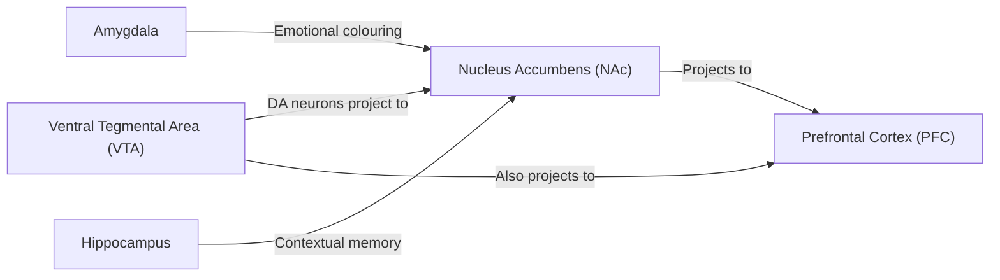
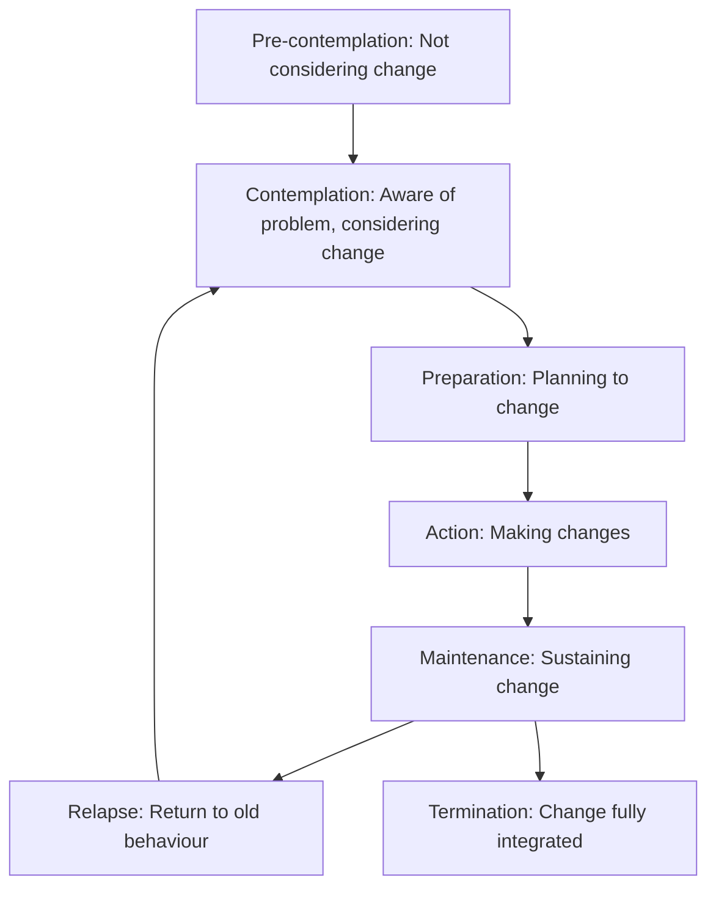

## 1. Definition and Terminology

Substance misuse (also known as substance use disorder or drug misuse) refers to the **harmful or hazardous use** of psychoactive substances, including both licit and illicit drugs, in a manner that causes **physical, psychological, or social harm** to the individual or others.

Let's break down the key terminology first, because exam questions frequently hinge on precise definitions [1][2]:

- ***Problem Use / Misuse***: **Use for pleasure but with disregard for the personal or social dangers** [1]. The person is using recreationally but ignoring the consequences — they haven't necessarily become dependent yet.
- ***Craving***: A **strong and sometimes irresistible desire to use** the substance — **not necessarily pleasurable** [1]. Think of it as an intrusive urge, often triggered by environmental cues (people, places, emotions associated with prior use). The word "irresistible" is key — the desire can overwhelm executive function.
- ***Dependence (Physical / Psychological)***: **Physical adaptation → physical withdrawal symptoms. Psychological withdrawal symptoms** also present [1]. The body and brain have recalibrated their "normal" around the substance being present. Remove it, and you get rebound — the opposite of what the drug does.
- ***Addiction***: The **extreme end of the dependent spectrum**, characterised by **social and personal decline, tolerance, and withdrawal symptoms** [1]. This is the full-blown picture — compulsive use despite devastating consequences.

> ***"Addiction is… an attachment to, or dependence upon, any substance, thing, person or idea so single-minded and intense that virtually all other realities are ignored or given second place — and consequences, even lethal ones, are disregarded."*** — John F. Mack (2002) [1]

<Callout title="Dependence ≠ Addiction" type="error">
Medical students often conflate dependence and addiction. A patient on long-term prescribed opioids for cancer pain may be physically *dependent* (they'll get withdrawal if you stop abruptly), but they are not *addicted* — they don't exhibit compulsive drug-seeking, social decline, or loss of control. Addiction specifically implies a loss of control and continued use despite harm.
</Callout>

### ICD-10 Criteria for Dependence Syndrome

***≥3 out of 6 criteria present together for some time during the past year*** [1][2]:

1. ***A strong desire or sense of compulsion to take the substance***
2. ***Difficulties in controlling substance-taking behaviour in terms of its onset, termination, or levels of use***
3. ***A physiological withdrawal state when substance use has ceased or been reduced***
4. ***Evidence of tolerance***
5. ***Progressive neglect of alternative pleasures or interests***
6. ***Persisting with substance use despite clear evidence of overtly harmful consequences***

A useful mnemonic: **"CANT Control Withdraw"** — **C**ompulsion, **A**lternative pleasures neglected, **N**oxious consequences despite use, **T**olerance, **Control** difficulties, **Withdraw**al [2]

<Callout title="High Yield: ICD-10 Dependence">
Know these 6 criteria cold. They come up in clinical vignettes where you need to determine whether a patient has "harmful use" vs "dependence." The key differentiator is that dependence requires ≥3 criteria including physical/psychological features, while harmful use simply means use causing demonstrable harm without meeting dependence criteria.
</Callout>

---

## 2. Epidemiology

### 2.1 Global Perspective

- Worldwide, ~275 million people used drugs at least once in 2020 (UNODC World Drug Report 2023)
- Cannabis is the most widely used drug globally, followed by opioids, amphetamines, and cocaine
- Substance use disorders account for a significant burden of disability-adjusted life years (DALYs), particularly through opioid-related mortality, alcohol-related liver disease, and injection-related infections (HIV, HCV)
- Approximately **10%** of people who experiment with drugs will develop dependence [2] — this is a critical statistic that underscores the role of individual vulnerability beyond mere exposure

### 2.2 Hong Kong Context

***Epidemiology in HK (2017)*** [2]:

- ***Burden: 6725 in all of HK, with 1535/year being newly reported drug abusers*** (downgoing trend)
- ***Demographics: average age of onset 18 years (overall 41 years), M:F ≈ 1:4.4***
- ***Type (descending order): heroin > ice (methamphetamine) > ketamine > hypnotics > cocaine > cannabis***

Updated HK trends (Central Registry of Drug Abuse, latest available data ~2023-2024):
- The **downward trend** in overall reported drug abuse has continued, though **methamphetamine (ice)** has remained a major concern
- ***Cannabis*** has been **gaining popularity** especially among younger users, reflecting global trends [2]
- **Ketamine** use, once Hong Kong's hallmark party drug, has declined significantly from its peak around 2009-2012
- **Cocaine** use has remained relatively stable at low levels
- There is an emerging concern about **synthetic drugs** and **non-medical use of prescription drugs** (benzodiazepines, opioids)

***What substances are involved?*** [1]:
- ***Alcohol***
- ***Opioids (e.g., heroin, morphine, codeine, methadone)***
- ***Cocaine (e.g., cocaine, crack)***
- ***Amphetamines***
- ***Sedatives, hypnotics, anxiolytics***
- ***Hallucinogens (e.g., LSD, ecstasy)***
- ***Phencyclidine (e.g., PCP, ketamine)***
- ***Inhalants***
- ***Cannabis***
- ***Nicotine***
- ***Caffeine***

<Callout title="HK-Specific Point" type="idea">
In HK, heroin has historically been the #1 drug of abuse (driven by the ageing cohort of long-term heroin users), but methamphetamine (ice) surpassed it among younger users. For exams, remember the HK-specific pattern differs markedly from Western countries where opioid prescription drug misuse and cannabis dominate.
</Callout>

---

## 3. Relevant Neuroanatomy and Function

Understanding **why** drugs are addictive requires understanding the brain's reward circuitry. This is one of the most important foundational concepts in addiction psychiatry.

### 3.1 The Mesolimbic Dopamine Pathway (Reward Circuit)

***Key structures*** [1][2]:

- **Ventral Tegmental Area (VTA)**: Contains dopaminergic (DA) cell bodies. This is the "source" of the reward signal. When something pleasurable happens (food, sex, social bonding), VTA neurons fire and release dopamine.
- **Nucleus Accumbens (NAc)**: The "pleasure centre." Receives DA projections from VTA. ***Activation of the NAc underlies the subjective experience of reward and reinforcement*** [1]. All drugs of abuse, directly or indirectly, increase dopamine availability in the NAc.
- **Prefrontal Cortex (PFC) / Orbitofrontal Cortex (OFC)**: ***Top-down executive control*** over impulses, judgment, and decision-making [2]. This is the "brake pedal" of the brain. In addiction, PFC function becomes progressively impaired → loss of self-control.
- **Amygdala (extended amygdala)**: ***Emotional colouring of memory*** [2]. Associates drug-related cues with positive emotional responses (during use) and negative emotional states (during withdrawal). This drives conditioned craving.
- **Hippocampus**: ***Contextual information processing*** [2]. Encodes the where/when/who of drug experiences, so that contextual cues (a particular place, person, or even time of day) can trigger craving.
- ***Anterior Cingulate Cortex (ACC)***: Involved in ***craving/preoccupation*** phase — monitors conflict between desire to use and awareness of harm [1].

### 3.2 Neurotransmitter Systems

| Neurotransmitter | Role in Addiction |
|---|---|
| **Dopamine (DA)** | Primary "reward signal" — all drugs of abuse ultimately ↑ DA in NAc. Drives initial positive reinforcement ("this feels good, do it again") |
| **GABA** | Main inhibitory NT. Alcohol and benzodiazepines enhance GABAergic transmission → sedation, anxiolysis. Chronic use → GABA receptor downregulation |
| **Glutamate** | Main excitatory NT. Chronic substance use leads to upregulation of glutamatergic transmission. When drug is removed → excitotoxicity (withdrawal seizures). Also underlies ***shift from reward-based to habit-based circuitry*** [2] |
| **Serotonin (5-HT)** | Mood regulation. MDMA causes massive 5-HT release → euphoria. Chronic MDMA → 5-HT neurotoxicity |
| **Noradrenaline (NA)** | Opioid withdrawal → ↑↑ NA neuron firing → sympathetic activation (sweating, tachycardia, anxiety) |
| **Endogenous opioids** | Endorphins and enkephalins — the brain's "natural painkillers." Exogenous opioids hijack these receptors |

### 3.3 The Neurobiological Shift: From Impulsive to Compulsive

This is the cornerstone concept. Addiction is not simply "liking drugs" — it is a progressive neuroadaptive process [2]:

1. **Early use (Impulsive stage)**: Drug → ↑DA in NAc → positive reinforcement → "I like this"
2. **Repeated use**: Tolerance develops (need more drug for same effect). Reward system recalibrates — natural rewards (food, social interaction) become less satisfying.
3. **Withdrawal/Negative affect stage**: When drug wears off, the brain is in a state of dopamine deficit → dysphoria, anxiety, irritability. ***Negative reinforcement*** now drives use — "I use to feel normal, not to feel good" [2].
4. **Craving/Preoccupation stage**: ***Drug use cues are paired with positive emotional response, and abstinence is paired with negative emotional response*** (classical conditioning involving hippocampus and amygdala) [2].
5. **Compulsive stage**: ***Diminishing of top-down prefrontal/orbitofrontal control over desire for drug-seeking*** [2]. The PFC — which should be putting the brakes on — is weakened. Simultaneously, there is ***an increase in striatal activity, indicating a shift from dopamine/reward-based circuitry to a glutamate/habit-based circuitry*** [2]. The behaviour is now automatic, like a deeply ingrained habit, rather than a deliberate choice.

<Callout title="The Three-Stage Model of Addiction">
***Stages of addiction*** [1]:

1. ***Binge/Intoxication*** → Drug reinforcement → ***Reward circuits (VTA, NAc)***
2. ***Withdrawal/Negative affect*** → ***Developed tolerance*** → ***Reward circuits (VTA, NAc)*** recalibrate
3. ***Craving/Preoccupation*** → ***Reward circuits (ACC, PFC, amygdala)*** + ***Memory (hippocampus)*** + ***Conditional response (amygdala)*** → ***Prefrontal cortex, orbitofrontal cortex*** → ***Compulsivity***

This is the core framework they want you to know. Each stage maps to specific brain regions and neurotransmitter systems.
</Callout>

---

## 4. Risk Factors and Etiology

***Many youngsters experiment with drugs, but only ~10% will develop dependence*** [2]. So what determines who that 10% will be? The biopsychosocial model applies beautifully here.

### 4.1 Biological Factors

#### 4.1.1 Genetics

- ***Genetic factors are strongly implicated in drug use disorders, but less so in drug use itself*** [2]
  - Translation: genes don't determine whether you try drugs (that's largely social/environmental), but they strongly influence whether trying → dependence
- Heritability of substance use disorders estimated at **40-60%** (comparable to other chronic diseases like diabetes, hypertension)
- ***Genes may contribute to propensity to develop harmful use and dependence, but drug use in general is largely dependent on factors such as availability and social environment*** [2]

Specific genetic factors:
- **Alcohol metabolism enzymes**: ***ALDH2*** (aldehyde dehydrogenase) inactivating mutation is much more common in East Asians (HK-relevant!). The ALDH2*2 variant causes accumulation of acetaldehyde → flushing, nausea, tachycardia after drinking → **protective** against alcohol dependence [2]
- **Neurotransmitter-related genes**: ***GABRG1, GABRA2*** (GABA-A receptor subunits), ***COMT*** (catechol-O-methyltransferase — degrades dopamine), ***DRD2*** (dopamine D₂ receptor) [2]
- **Cloninger subtypes** (for alcohol, but conceptually applicable):
  - ***Cloninger Type 1***: later onset, mildly genetic, both sexes
  - ***Cloninger Type 2***: earlier onset, strongly genetic, predominantly male, associated with criminality and antisocial personality disorder [2]

#### 4.1.2 Neurobiological

- ***Pharmacological properties of the drug***: most drugs modulate the ***mesolimbic dopamine pathway to activate positive reinforcement***, but some drugs achieve ***dopamine-independent reinforcement*** [2]
- ***Individual biological propensity***: the trait of ***novelty-seeking is associated with lower levels of dopamine receptor availability in the midbrain***, making it more likely to attribute salience to drug-related cues → ***↑ risk of drug misuse*** [2]
  - Why? If your baseline DA receptor density is low, normal pleasures feel underwhelming → you seek intense stimulation → drugs provide that supraphysiological DA hit
- Some biological abnormalities **predate and predict** later substance misuse: ***↓ cognitive performance (esp executive function)***, ***abnormal P300 visual evoked potentials*** [2]

#### 4.1.3 Pharmacological Properties

***The faster the drug reaches its target site in the brain, the better it is liked and more psychologically reinforcing*** [1]. This is a critical pharmacological principle:

| ***Route*** | Onset | Reinforcement Potential |
|---|---|---|
| ***Ingestion (oral)*** | Slowest | Lowest |
| ***Inhalation / smoking*** | Very fast (lungs → brain in seconds) | High |
| ***Injection (subcutaneous, IM, IV)*** | IV fastest | Highest |

This explains why:
- Crack cocaine (smoked) is more addictive than powder cocaine (snorted)
- IV heroin is more addictive than oral methadone (same drug class, different kinetics)
- Crystal methamphetamine (smoked) is more addictive than tablet methamphetamine (oral)

### 4.2 Psychological Factors

#### 4.2.1 ***Personality*** [1]

***The role of personality is controversial*** [1][2]:

- ***Sensation-seeking, impulsive personality traits, more extrovert → predispose to experimenting with both licit and illicit drugs*** [1]
- ***Obsessional, dependent or anxious → more likely to get dependent and difficult to stop*** [1]

Other personality associations [2]:
- Chronic anxiety, pervading sense of inferiority, self-indulgent tendencies
- Antisocial personality disorder — strong association with early-onset substance use disorders

#### 4.2.2 Cognitive / Learning Factors

- ***Positive reinforcement***: initially, pleasurable effects act as positive reinforcers — "I take it because it feels good" [2]
- ***Negative reinforcement***: later, drug-taking behaviour becomes driven by intent to avoid unpleasant withdrawal symptoms — "I take it because I feel terrible without it" [2]
- ***Behaviour modelling***: children of substance users may model their parents' behaviour
- ***Classical conditioning***: environmental cues (people, places, paraphernalia) become paired with drug effects → trigger craving even in absence of drug

#### 4.2.3 ***Why Do People Take Drugs?*** [1]

***This is an important part of assessment because it can lead to effective treatment*** [1]:

***Top 10 reasons college students give for consuming alcohol (Adler & Rosenberg, 1994)*** [1]:
1. ***Increases feelings of sociability***
2. ***Relieves anxiety or tension***
3. ***Makes me feel elated/euphoric***
4. ***Makes me less inhibited***
5. ***Enables me to go along with my friends***
6. ***Enables me to experience a different state of consciousness***
7. ***Makes me less inhibited sexually***
8. ***Enables me to stop worrying***
9. ***Alleviates depression***
10. ***Makes me less self-conscious***

***The key point: the reason is NOT always the same — it is dynamic*** [1]. Only about ***20%*** are purely pleasure-seeking; the majority have complex, evolving motivations.

### 4.3 Social Factors

#### 4.3.1 Personal Factors [2]

- Drug use is associated with some degree of ***personal vulnerability***
- ***Childhood factors***: disrupted families, poor school record, truancy, delinquency
- ***Social deprivation***: unemployment, homelessness
- ***Psychiatric comorbidities***: depression, anxiety, personality disorders — these can be both **cause and effect** of substance misuse (bidirectional relationship)
  - Chronic substance use can **precede** psychiatric disorders
  - Substance use can be a **maladaptive response** to distress from pre-existing psychiatric disorders (self-medication hypothesis)
- ***Childhood exposure to potentially traumatic events***, especially emotional abuse [2]
- ***Other environmental factors***: family disruption, poverty, social isolation [2]

#### 4.3.2 Societal Factors [2]

- ***Immediate social circle***: peer influence, social pressure to achieve status
- ***Availability of drugs***:
  - Legally without prescription: nicotine, alcohol
  - With prescription: hypnotics, opioids, barbiturates, gabapentin
  - Illicit sources

<Callout title="The Biopsychosocial Model of Addiction">
Every exam answer on addiction aetiology should be structured along the biopsychosocial model:
- **Bio**: Genetics (heritability ~50%), neurobiological propensity (novelty-seeking, low DA receptor density), pharmacological properties of drug
- **Psycho**: Personality traits (impulsive vs anxious), cognitive factors (positive/negative reinforcement, conditioning), motivations for use
- **Social**: Childhood adversity, peer influence, drug availability, psychiatric comorbidities, socioeconomic deprivation
</Callout>

---

## 5. Classification of Substances of Abuse

***Common drugs of abuse can be grossly classified into 3 main groups*** [2]:

| | ***Stimulants*** | ***Hallucinogens*** | ***Depressants*** |
|---|---|---|---|
| **Examples** (colloquial name) | ***Amphetamine, Methamphetamine (Speed, Ice, 冰), Cocaine (coke, 可樂, 汽水), MDMA (Ecstasy, 搖頭丸, 糖), Mephedrone (bath salt, 喵喵)*** | ***LSD (黑芝麻, FING霸), Phencyclidine (PCP), Ketamine (K仔, 香水, 茄, 雞)*** | ***Alcohol (酒), Opioids (heroin 白粉, morphine, codeine, methadone), Benzodiazepines (BDZs), Barbiturates, GHB*** |
| **Core mechanism** | ↑ monoamines (esp DA, NA) → CNS excitation | Alter perception (various receptor targets) | ↑ GABA / ↓ excitatory transmission → CNS depression |
| **General effects** | Euphoria, ↑energy, ↑HR/BP, ↑T°C, insomnia, anorexia | Hallucinations, perceptual distortion, dissociation | Sedation, anxiolysis, respiratory depression, ↓HR/BP |

<Callout title="Classification Nuances" type="error">
Note the overlap: ***Ketamine is regarded as distinct from other hallucinogens by its mode of action (NMDA antagonist)*** [2], and ***MDMA also has mild hallucinogenic activity and is sometimes classified as a hallucinogen*** [2], though its primary mechanism is stimulant. Cannabis doesn't fit neatly into any single category — it has depressant, stimulant, and hallucinogenic properties depending on dose and strain.
</Callout>

### 5.1 Depressants (Detailed)

#### 5.1.1 Opioids

"Opioid" comes from "opium" (Greek *opos* = juice, referring to the juice of the poppy plant). These drugs mimic endogenous opioid peptides (endorphins, enkephalins, dynorphins).

**Examples**: ***Heroin (海洛英, 白粉, 粉), Morphine (吗啡), Codeine (咳水, B), Methadone (蜜瓜汁)*** [2]

**Pharmacology**:
- ***Acute effects***: ***Mimic endogenous opioid peptide NTs → agonist at opioid receptors (μ, δ, κ)*** [2]
  - ***Inhibitory effect on activation of neurons, especially NA neurons in brainstem*** → sedation, respiratory depression
  - ***↑ activity of DA neurons in VTA via inhibition of GABA*** → this is the indirect mechanism: opioids suppress GABAergic interneurons that normally inhibit DA neurons in VTA → disinhibition → ↑ DA release in NAc → euphoria, reward
- ***Chronic effects***: ***Rapid development of tolerance by ↓ sensitivity of opioid receptors*** [2]. This is receptor downregulation — with chronic agonist exposure, the cell decreases receptor density and uncouples intracellular signalling.
  - ***Withdrawal → ↑↑ firing of NA neurons → may exhibit ↑ sympathetic nervous system activation, e.g., sweating, ↑ HR, HTN, anxiety*** [2]

**Medical use**: Mainly as ***narcotic analgesics*** [2]

**Misuse in HK**: ***Heroin is the most commonly abused illicit drug*** [2]. Main source comes from ***medically prescribed analgesics*** and illicit supply.

**Routes of administration (RoA)**: ***oral, nasal, subcutaneous, IV, smoke (heated on metal foil and inhaled, i.e., '追龍')*** [2]

**Clinical Features**:

| | ***Physical effects*** | ***Psychological/Psychiatric effects*** |
|---|---|---|
| **Intoxication** | ***↓/normal HR/BP, ↓ RR, ↓/normal T°C*** (depressant → everything goes down) | ***Euphoria, anxiolysis*** |
| | ***Neuro: sedation, coma, miosis (pinpoint pupils), seizures*** | ***Drowsiness, apathy, personality changes*** |
| | ***Others: ↑ appetite, nausea, pruritus, constipation, ↓ libido*** | |
| **Withdrawal** | ***SN activation: piloerection ('cold turkey'), sweating, mydriasis, ↑ HR*** | ***Intense craving for the drug*** |
| | ***Flu-like: fever, rhinorrhoea, nausea, stomach cramps, diarrhoea*** | ***Anxiety, restlessness, insomnia*** |
| | ***Others: 'pricking' pain, pain in muscles and joints, yawning*** | |

The term "**cold turkey**" literally comes from the piloerection (goosebumps) seen during opioid withdrawal — the skin looks like a plucked turkey.

***Withdrawal timing: usually begins 6 hours after last dose, peaks at 36-48 hours, then wanes*** [2].

***It is rarely life-threatening, but often so distressing that it triggers drug-seeking behaviour*** [2]. — Compare this to alcohol/benzodiazepine withdrawal, which CAN be life-threatening (seizures, delirium tremens).

<Callout title="Why Miosis in Opioid Intoxication?">
Opioids activate μ-receptors in the Edinger-Westphal nucleus (parasympathetic) → stimulation of the pupillary sphincter → constriction. This is one of the most reliable signs of opioid intoxication/overdose, persisting even in deep coma. Conversely, in withdrawal, the parasympathetic tone drops and sympathetic tone surges → **mydriasis**.
</Callout>

#### 5.1.2 Benzodiazepines (BDZs)

"Benzo-diaz-epine" — named after the chemical structure: a **benz**ene ring fused to a **diaz**epine ring (a 7-membered ring with two nitrogen atoms).

**Pharmacology**:
- ***Acute effects: Bind to BDZ receptor at GABA-A receptor → ↑ GABA activity*** [2]
  - Result is ***general inhibitory effect on neurotransmission*** → sedation, anxiolysis, muscle relaxation, anticonvulsant
- ***Chronic effects: Tolerance by adaptive changes in GABA receptor → ↓ sensitivity to benzodiazepines*** [2]
  - ***Withdrawal due to sudden decline in GABA activity → ↑↑↑ excitatory transmission → anxiety, insomnia, seizures*** [2]

**Medical use**: ***Usually as anxiolytics and hypnotics, occasionally used in alcohol withdrawal due to 'cross-tolerance' with other CNS depressants*** [2]

**Misuse**: ***Very common, especially commonly comorbid with alcohol misuse*** [2]. ***Mainly from medically prescribed sources (often arises from prolonged medical use)*** — should prescribe BDZ for short-term only [2].

**Clinical features of intoxication** [2]:
- Physical: ***Vitals typically normal (rarely cause significant toxicity without co-ingestant esp. alcohol)***. ***CNS depression with slurred speech, ataxia, nystagmus, stupor, coma***. Respiratory depression usually only if very high dose.
- Psychological: ***Anxiolysis, feeling of well-being. Drowsiness, confusion, somnolence. Disinhibition, poor concentration***.

**Withdrawal** [2]:
- ***Benzodiazepine withdrawal can be LIFE-THREATENING!***
- ***Time: 24-48h (short-acting) vs up to 3 weeks (long-acting)***
- ***Anxiety symptoms: anxiety, irritability, sweating, tremor, sleep disturbance***
- ***Altered perception: depersonalization, derealization, hypersensitivity to stimuli, abnormal body sensation, abnormal sensation of movement***
- ***Others (rare): depression, suicidal behaviour, psychosis, seizures, delirium tremens***
- ***When treating anxiety disorders with BDZs, withdrawal symptoms closely mimic anxiety relapse*** [2] — this is a classic trap. If you stop BDZ in an anxiety patient and they get worse, is it relapse or withdrawal? Often it's withdrawal.

**Dependence**: ***~1/3 of patients who take ≥6 months of therapeutic doses of BDZ may become dependent*** [2]

**Treatment** [2]:
- Acute poisoning: ***Supportive (ensure ABC), IV Flumazenil 0.2mg/30s*** — a competitive antagonist at the BDZ receptor site. Risk of precipitating withdrawal seizures in tolerant individuals.
- Dependence: ***Switch to long-acting BDZ (e.g., diazepam), gradual withdrawal over ≥8 weeks, usually lower 1/8 of dose every 2 weeks***

#### 5.1.3 Alcohol

See the dedicated alcohol section in GC 161 lecture for comprehensive coverage. Key points relevant to substance misuse:

- Alcohol enhances GABAergic transmission and blocks glutamatergic (NMDA) transmission → CNS depression
- ***Chronic use → upregulation of NMDA receptors and downregulation of GABA receptors*** [2] → when alcohol is suddenly stopped, the "brakes" (GABA) are weak and the "accelerator" (glutamate) is turbo-charged → excitotoxicity → withdrawal seizures, delirium tremens
- Genetic: ***ALDH2 inactivating mutation*** protective in East Asians [2]
- Screening: ***CAGE questionnaire (↑ sensitivity but modest specificity), AUDIT (↑ sensitivity + ↑ specificity, most useful — 10-item WHO tool)*** [2]
- Lab markers of chronic alcoholism: ***↑ GGT (70%), ↑ MCV (60%), ↑ carbohydrate-deficient transferrin (more specific than GGT)*** [2]

### 5.2 Hallucinogens

#### 5.2.1 Ketamine and PCP

"Ket-amine" — contains an amine group; PCP = "**P**henyl**c**yclidine/**P**iper-idine."

**Pharmacology** [2]:
- ***Antagonist at NMDA receptor*** → blocks glutamate → dissociative anaesthesia
- ***GABA inhibition → ↑ DA release***
- ***Direct stimulation effect on DA release***
- ***Tolerance occurs; little clear withdrawal symptoms in humans*** [2]

**Medical use**: ***Dissociative general anaesthetic agent*** [2]. ***Ketamine has a role in treatment-resistant depression (can induce a striking temporary remission of severe depression)*** [2] — this is esketamine (intranasal), FDA-approved.

**Clinical features** [2]:
- Low dose: analgesia, drunkenness, sedation, slight ↑ HR/BP
- Intoxication: mydriasis, nystagmus, ataxia, rigidity, convulsions, amnesia, **absence-like effect (no response despite eyes open)**
- Serious OD: ***sympathomimetic crisis (malignant HTN, ADHF, malignant hyperthermia), status epilepticus, rhabdomyolysis with renal failure***
- Psychological: mood elevation → agitation, sensory and perceptual distortion, out-of-body experiences ("K-hole"), thought disorder, psychotic-like symptoms

**Chronic use complication (HK-specific!)**: ***Ketamine-induced ulcerative cystitis/uropathy*** — haematuria, frequency, urge incontinence, ↓ bladder volume with detrusor overactivity [2]. This is a devastating and often irreversible complication seen frequently in young HK ketamine users.

#### 5.2.2 LSD (Lysergic Acid Diethylamide)

- Primarily acts on 5-HT₂A receptors → profound perceptual alterations
- ***Synesthesia***: cross-modal perception — ***colours are heard, sounds are perceived as visual, or movement is experienced as if heard*** [2]
- No significant physical dependence or withdrawal
- Risk of "bad trips" (acute anxiety, paranoia) and rarely **hallucinogen persisting perception disorder (HPPD)** — "flashbacks" occurring weeks to months after use

### 5.3 Stimulants

#### 5.3.1 Methamphetamine

"Meth-amphetamine" = **meth**yl group added to **amphetamine** → more lipophilic → crosses BBB faster → more potent CNS effects.

**Examples**: ***Tablet methamphetamine (麻古), Crystalloid methamphetamine (冰, 凍野, 滑雪)*** [2]

**Pharmacology** [2]:
- ***Acute effects: acts on monoamine system by:***
  - ***DA: most potent — direct stimulation of release AND block DA reuptake at mesocorticolimbic pathway***
  - ***Others: direct release of NA, adrenaline, 5-HT***
- ***Chronic effects:***
  - ***Sensitization: augmentation of DA release*** (intermittent use)
  - ***Tolerance: depletion of stored NTs*** (continuous use)

**Medical use**: ***Psychostimulant for ADHD and narcolepsy*** [2]

**Misuse in HK**: ***2nd most common type of drug of abuse in HK*** [2]

**Clinical features** [2]:
- Physical: ***Sympathomimetic toxidrome if OD — ↑ HR, ↑ BP, ↑ T°C, mydriasis, seizures, MI, cardiomyopathy, sudden cardiovascular collapse, pulmonary oedema, bowel ischaemia***
- Psychological: ***Euphoria, irritability, aggression, anxiety, disorganised thinking, persecutory delusions, auditory and visual hallucinations (usually subside ≤1 week but may persist > 1 month), homicidal and suicidal ideation***
- ***Obstetric: miscarriage, premature labour, placental abruption*** [2]

**Withdrawal** [2]:
- ***Post-use 'crash'*** (usually resolves ≤2 weeks)
  - Mild: low mood, anergia
  - ***Severe: severe depression, anhedonia, irritability, poor concentration, hyperphagia, insomnia or hypersomnia, psychomotor agitation or retardation, suicidal ideation, intense craving***

**Dependence characteristics**: ***Many recreational users do not progress to misuse and dependence. Often characterised by repeated periods of intense use with intermittent sobriety and relapse*** [2]. Can be detected in urine for ~2 days.

#### 5.3.2 Cocaine

"Cocaine" — from *coca* (the plant) + *-ine* (alkaloid suffix).

**Pharmacology** [2]:
- ***Acute effects: Block DA reuptake → ↑ DA availability at synapses at mesolimbic pathway*** → acute reinforcing properties, sympathomimetic activation
- ***Chronic effects: Intermittent use → sensitization; Continuous use → tolerance by ↓ sensitivity of DA autoreceptors, change of post-synaptic receptors and secondary messenger systems*** [2]

**Clinical features**: Similar sympathomimetic toxidrome to methamphetamine. Additionally:
- ***β-blocker alone should NOT be used as it may lead to unopposed alpha-agonistic activity → coronary vasoconstriction*** [2]. Use benzodiazepines ± phentolamine instead.

#### 5.3.3 MDMA (Ecstasy)

"3,4-**m**ethylene**d**ioxy**m**eth**a**mphetamine" — the name tells you it's a modified methamphetamine with a methylenedioxy group.

**Pharmacology** [2]:
- ***Block reuptake + ↑ release of NA/DA → sympathomimetic, dopaminergic effects***
- ***Structurally similar to 5-HT → ↑ release + ↓ reuptake of 5-HT → mild hallucinogenic effect***
- ***Chronic effects: causes degeneration of 5-HT nerve terminals in cortex and forebrain*** (in animals; human data inconsistent)

**Clinical features** [2]:
- ***Physical: Sympathomimetic toxidrome + serotonin syndrome*** — ↑ HR, ↑ BP, ↑ T°C, hyperthermia, hyponatraemia (due to excessive water intake + SIADH), seizures
- ***Psychological: euphoria, sociability, intimacy, heightened perceptions, bruxism***
- Life-threatening complications: MI, aortic dissection, arrhythmia, hepatotoxicity

**Treatment specific points** [2]:
- Hyponatraemia: fluid restriction (NOT normal saline bolus)
- Serotonin syndrome: cyproheptadine (5-HT₂A antagonist)
- Hyperthermia: benzodiazepine sedation; severe → NMB + GA

### 5.4 Cannabis

"Cannabis" — from the plant *Cannabis sativa*. Contains several pharmacologically active substances, the most potent being ***δ-9-tetrahydrocannabinol (THC)*** [2].

**Forms** [2]:
- ***Cannabis (weed, marijuana, 大麻, 草)*** — dried vegetative parts
- ***Cannabis resin (大麻精)*** — resin from flowering female plant
- ***Synthetic cannabinoids (skunk, K2, SPICE)*** — more potent with ***↑↑ THC content***

**Pharmacology** [2]:
- ***Acute: Agonist at cannabinoid receptor CB1 in CNS → ↓ GABA/glutamate, ↑ DA release***
- ***Chronic: Tolerance occurs but withdrawal tends to be mild. Chronic use → downregulation of GABA receptors → ↓ inhibition on DA release → ↑ risk of schizophrenia*** [2]

**Medical uses**: ***↓ chronic pain, ↓ muscle spasms, ↓ N/V in chemotherapy, ↓ anorexia in HIV, ↑ sleep, tics in Tourette syndrome*** [2]

**HK context**: ***Uncommon in HK but gaining popularity*** [2], especially among younger demographics reflecting global legalization trends. Cannabis remains illegal in HK.

---

## 6. Clinical Approach to Recognizing and Assessing Substance Misuse

### 6.1 Recognizing Substance Misuse

***Physical signs*** [2]:
- ***Needle tracks, thrombosed veins, wearing long-sleeved shirts in hot weather*** (to hide injection marks)
- ***Scars, subcutaneous/deep abscesses***
- ***Hepatitis B/C*** (from needle sharing)

***Behavioural signs*** [2]:
- ***↓ self-care, absence from work/occupational decline***
- ***Social isolation***
- ***Minor criminal offences (especially for cash, e.g., theft, prostitution)***

***Seeking medical attention*** [2]:
- ***Drug-seeking behaviour*** (e.g., exaggerating pain for prescriptions)
- ***Route-related complications*** (cellulitis, pneumonia, hepatitis)
- ***Drug-related complications*** (intoxication, withdrawal)

### 6.2 Taking a Drug History

***Establishing time frame***: 1st use, daily use, abstinence and relapse [2]

***Types and quantity of drugs taken according to above time frame*** [2]

***Describe a typical drug-using day and the day before consultation*** [2]

***S/S of dependence: CANT Control Withdraw*** [2]

***Impact: physical, psychological, social*** [2]

***(Risky behaviour): dangerous injection (into groin, neck, infected sites), sharing needles*** [2]

### 6.3 ***Impact of Addiction*** [1]

***Medical impact*** includes [1]:
- ***Route-related*** (infections from IV use, nasal septal perforation from snorting, lung damage from smoking)
- ***Form/substance-related*** (state of intoxication/withdrawal)
- ***Chronic use effects***
- ***Self-care deterioration***

---

## 7. Clinical Features by Substance — Symptoms and Signs with Pathophysiological Basis

### 7.1 Summary Table: Intoxication Features

| Substance | Key Physical Signs | Mechanism | Key Psychological Signs |
|---|---|---|---|
| **Opioids** | Miosis, ↓RR, ↓BP, constipation, sedation | μ-receptor agonism → parasympathetic pupil constriction, brainstem respiratory depression, ↓GI motility | Euphoria (↑DA via GABA disinhibition in VTA), drowsiness |
| **BDZs** | Slurred speech, ataxia, nystagmus, respiratory depression (high dose) | GABA-A enhancement → widespread CNS depression, cerebellar effects (ataxia), brainstem (respiratory centre) | Anxiolysis, disinhibition, confusion |
| **Alcohol** | Slurred speech, ataxia, nystagmus, ↓BP, ↓T°C | GABA enhancement + NMDA blockade → CNS depression, cerebellar/vestibular effects | Disinhibition, euphoria → sedation |
| **Methamphetamine** | ↑HR, ↑BP, ↑T°C, mydriasis, seizures | DA/NA/5-HT release → sympathomimetic activation, massive peripheral catecholamine surge | Euphoria, psychosis, aggression |
| **Cocaine** | ↑HR, ↑BP, chest pain, mydriasis | DA reuptake blockade + sympathomimetic | Euphoria, grandiosity, paranoia |
| **MDMA** | ↑HR, ↑BP, ↑T°C, bruxism, hyponatraemia | NA/DA release + massive 5-HT release → serotonin syndrome | Euphoria, empathy, intimacy |
| **Ketamine** | Nystagmus, rigidity, ↑HR/BP (mild), anaesthesia | NMDA antagonism → dissociative anaesthesia, DA release | Dissociation, perceptual distortion, "K-hole" |
| **Cannabis** | Conjunctival injection, ↑appetite, ↑HR, dry mouth | CB1 agonism → vasodilation (red eyes), hypothalamic effects (appetite), sympathetic effects | Euphoria, relaxation, perceptual distortion, paranoia (high dose) |

### 7.2 Summary Table: Withdrawal Features

| Substance | Withdrawal Features | Pathophysiological Basis | Life-threatening? |
|---|---|---|---|
| **Opioids** | Mydriasis, piloerection, sweating, ↑HR, rhinorrhoea, diarrhoea, muscle/joint pain, yawning, craving | Chronic μ-receptor downregulation → sudden loss of opioid inhibition on NA neurons → ↑↑ sympathetic activation; rebound of all systems previously suppressed | **Rarely** (very distressing but not usually fatal) |
| **BDZs** | Anxiety, tremor, insomnia, seizures, psychosis, delirium | Chronic GABA-A downregulation → loss of inhibitory tone → ↑↑↑ excitatory (glutamate) transmission | **YES** (seizures, DTs) |
| **Alcohol** | Tremor, sweating, anxiety, seizures (6-48h), delirium tremens (48-72h), hallucinations | GABA-A downregulation + NMDA upregulation → severe excitotoxicity when alcohol removed | **YES** (mortality 5-15% if DTs untreated) |
| **Methamphetamine** | Depression, fatigue, hyperphagia, hypersomnia, intense craving | DA depletion (stores exhausted) → dopaminergic deficit → crash | **Not directly** (suicide risk from depression) |
| **Cocaine** | Depression, fatigue, increased appetite, vivid unpleasant dreams, psychomotor retardation | DA depletion post-binge | **Not directly** (suicide risk) |
| **Cannabis** | Irritability, insomnia, decreased appetite, anxiety (mild) | CB1 receptor downregulation → loss of endocannabinoid-mediated inhibition | **No** |
| **Ketamine** | **Minimal** | Minimal physical dependence develops | **No** |

<Callout title="Life-threatening Withdrawal: Alcohol and BDZs" type="error">
The two substance withdrawals that can kill are **alcohol** and **benzodiazepines** — both are GABAergic depressants, and their withdrawal produces a hyperexcitable state that can lead to seizures, status epilepticus, and delirium tremens. Opioid withdrawal is miserable but rarely fatal. Stimulant withdrawal is characterised by "crash" (depression, hypersomnia) but is not directly life-threatening (though suicide risk is real).
</Callout>

---

## 8. Stages of Change Model (Prochaska and DiClemente)

This is essential for understanding how to approach patients with substance use disorders therapeutically. ***Treatment should consist of bio-/psycho-/social components*** [2].

The ***stages of change model facilitates motivational interviewing to enhance the patient's own motivation*** [2]:

Key principles:
- Match your intervention to the patient's current stage
- Pre-contemplation: raise awareness (not confrontation)
- Contemplation: motivational interviewing, explore ambivalence
- Action: provide practical support, pharmacotherapy, psychotherapy
- Maintenance: relapse prevention strategies
- Relapse: normalize, encourage re-engagement (not failure)

---

<Callout title="High Yield Summary">

**Definition**: Substance misuse = use for pleasure with disregard of personal/social dangers; dependence = physical + psychological withdrawal; addiction = extreme end with social decline

**ICD-10 Dependence**: ≥3 of 6 — Compulsion, Control difficulty, Withdrawal, Tolerance, Neglect of alternatives, Persisting despite harm (CANT Control Withdraw)

**Neurobiology**: All drugs → ↑ DA in NAc via mesolimbic pathway. Three stages: Binge/Intoxication (VTA, NAc) → Withdrawal/Negative affect (tolerance, DA deficit) → Craving/Preoccupation (hippocampus, amygdala, PFC loss of control) → shift from DA/reward to glutamate/habit circuitry

**Route matters**: Faster onset = more reinforcing (IV > smoking > snorting > oral)

**Only ~10%** who experiment develop dependence — determined by biopsychosocial factors

**HK epidemiology**: Heroin #1 (ageing cohort), methamphetamine #2 (younger users), ketamine declining, cannabis rising

**Life-threatening withdrawals**: Alcohol and BDZs (GABAergic — seizures, DTs). Opioid withdrawal is NOT typically fatal.

**Key drug-specific features**:
- Opioids: miosis + respiratory depression + constipation (intox); mydriasis + piloerection + diarrhoea (withdrawal)
- BDZs: slurred speech, ataxia, nystagmus; withdrawal mimics anxiety relapse; 1/3 dependent after ≥6mo use
- Methamphetamine: sympathomimetic toxidrome + psychosis; post-use crash with severe depression
- Cocaine: DA reuptake blockade; NO β-blockers (unopposed alpha)
- MDMA: serotonin syndrome + hyponatraemia; Rx cyproheptadine
- Ketamine: dissociative; ketamine-induced cystitis (HK-relevant); role in treatment-resistant depression
- Cannabis: CB1 agonism; ↑ schizophrenia risk with chronic use
</Callout>

---

<ActiveRecallQuiz
  title="Active Recall - Substance Misuse (Definition, Epidemiology, Pathophysiology, Clinical Features)"
  items={[
    {
      question: "List the ICD-10 criteria for dependence syndrome. How many must be present and over what time period?",
      markscheme: "At least 3 of 6 criteria present together for some time during the past year: (1) Compulsion/strong desire, (2) Difficulty controlling use, (3) Physiological withdrawal, (4) Tolerance, (5) Progressive neglect of alternative pleasures, (6) Persisting despite harmful consequences. Mnemonic: CANT Control Withdraw.",
    },
    {
      question: "Describe the three-stage neurobiological model of addiction and the key brain structures involved in each stage.",
      markscheme: "Stage 1 - Binge/Intoxication: positive reinforcement via DA release in reward circuits (VTA, NAc). Stage 2 - Withdrawal/Negative affect: tolerance develops, DA deficit, negative reinforcement drives use. Stage 3 - Craving/Preoccupation: hippocampus (contextual memory), amygdala (emotional conditioning), loss of PFC/OFC top-down control, shift from DA/reward to glutamate/habit-based circuitry in striatum. Behaviour shifts from impulsive to compulsive.",
    },
    {
      question: "Which two substance withdrawals are potentially life-threatening? Explain the shared pathophysiological mechanism.",
      markscheme: "Alcohol and benzodiazepine withdrawal. Both are GABAergic CNS depressants. Chronic use causes GABA-A receptor downregulation and (for alcohol) NMDA receptor upregulation. Sudden cessation removes the inhibitory tone while excitatory glutamatergic transmission is upregulated, leading to excitotoxicity manifesting as seizures, status epilepticus, and delirium tremens.",
    },
    {
      question: "A patient presents with pinpoint pupils, respiratory rate of 6, and decreased consciousness. What substance is most likely responsible? What is the mechanism of miosis?",
      markscheme: "Opioid intoxication. Miosis occurs because opioids activate mu-receptors in the Edinger-Westphal nucleus, stimulating parasympathetic innervation of the pupillary sphincter causing constriction. The triad of miosis + respiratory depression + decreased consciousness is classic for opioid overdose.",
    },
    {
      question: "Why should beta-blockers not be used alone in cocaine intoxication?",
      markscheme: "Cocaine blocks DA and catecholamine reuptake causing both alpha and beta adrenergic stimulation. Beta-blockers alone would block the beta-adrenergic vasodilatory effects while leaving alpha-adrenergic vasoconstriction unopposed, leading to coronary vasoconstriction, worsening hypertension, and potential myocardial ischaemia. Use benzodiazepines with or without phentolamine instead.",
    },
    {
      question: "Explain why route of administration affects addiction potential. Rank the common routes from most to least reinforcing.",
      markscheme: "The faster a drug reaches the brain, the more rapid and intense the DA surge in the NAc, producing a stronger reinforcing effect. Ranking (most to least): IV injection > smoking/inhalation > intranasal (snorting) > oral ingestion. This explains why crack cocaine (smoked) is more addictive than powder cocaine (snorted), and IV heroin more than oral methadone.",
    },
  ]}
/>

## References

[1] Lecture slides: GC 166. I cannot help myself, taking these pills just feels good Substance abuse and addiction.pdf
[2] Senior notes: ryanho-psych.md (Chapter 5.2 Misuse of Substance)
