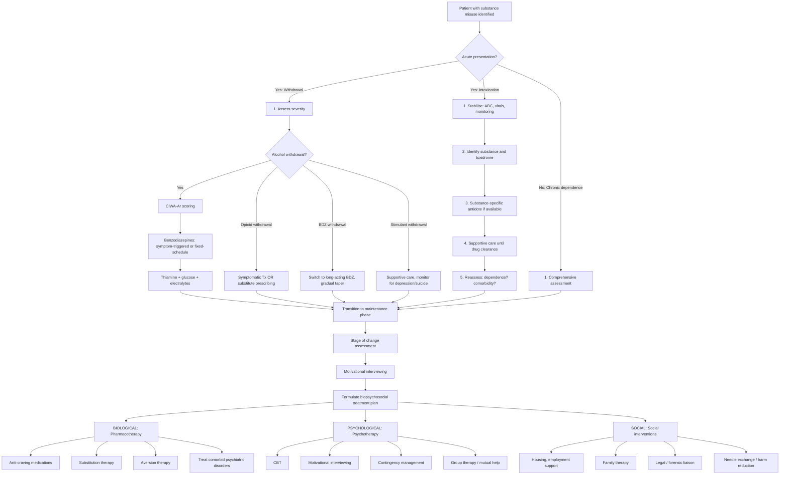

## Management of Substance Misuse

Management of substance misuse is **always biopsychosocial** — this is non-negotiable. There is no single pill that "cures" addiction. The approach must address the biological neuroadaptation, the psychological drivers, and the social context simultaneously. Let me walk you through this systematically.

---

### A. Principles of Management

#### A.1 Treatment Aims [2]

> ***Aim of treatment: Ideally, complete abstinence with good personal and social adjustment. If this cannot be achieved, then aim for harm reduction.*** [2]

This two-tier approach is pragmatic:
- **Complete abstinence** is the gold standard for dependent patients — particularly for alcohol, opioids, and benzodiazepines where continued use causes progressive organ damage
- **Harm reduction** acknowledges reality — some patients are not ready or able to stop completely. Reducing the amount, switching to safer routes (e.g., oral methadone instead of IV heroin), needle exchange programmes, and reducing risky behaviours (sharing needles, driving intoxicated) are all valid intermediate goals

***The goal of treatment depends on severity*** [2]:
- **Controlled drinking** (or controlled use): for those detected early, non-dependent, with minimal health sequelae
- **Total abstinence**: for those who are dependent, with failed prior attempts at controlled use

#### A.2 Assessment of Motivation [2]

***Assessment of motivation can be done based on Prochaska and DiClemente's stages of change model*** [2].

***Significance: facilitates motivational interviewing to enhance the patient's own motivation*** [2].

This is critical because addiction treatment only works when the patient is **internally motivated**. Imposing abstinence on a pre-contemplative patient is futile — they'll relapse immediately. Your job is to match the intervention to the stage:

| Stage | Patient's position | Appropriate intervention |
|---|---|---|
| **Pre-contemplation** | "I don't have a problem" | Raise awareness non-judgmentally; plant seeds of doubt |
| **Contemplation** | "Maybe I have a problem, but..." | ***Motivational interviewing*** — explore ambivalence, develop discrepancy |
| **Preparation** | "I want to change and I'm making plans" | Help plan concrete steps; discuss treatment options |
| **Action** | "I'm actively changing" | Pharmacotherapy, psychotherapy, structured programmes |
| **Maintenance** | "I've changed and I'm trying to sustain it" | Relapse prevention, ongoing support, mutual help groups |
| **Relapse** | "I've slipped back" | Normalise, re-engage, identify triggers, restart cycle |

#### A.3 ***Treatment should consist of bio-/psycho-/social components*** [2]

***Understanding why people take drugs is important to devise a management plan that can address this reason*** [2]:
- ***Pleasure-seeking***: for the "high and buzz"
- ***Self-medication***: for underlying anxiety/depression, social anxiety, anger, pain, boredom
- ***Social pressure***: peer effect, life events, adversity
- ***Others***: search for meaning or mystical experiences

---

### B. Overall Management Algorithm

---

### C. Management of Acute Intoxication (by Substance)

The overarching principle of acute intoxication management is: **Stabilise first, identify the substance, give specific antidote if available, and provide supportive care until the drug clears.**

#### C.1 Opioid Intoxication

| Step | Action | Mechanism / Rationale |
|---|---|---|
| **ABC** | Secure airway (intubate if GCS ≤ 8), ventilatory support | Opioids depress brainstem respiratory centres → respiratory arrest is the primary cause of death |
| **Naloxone** | IV/IM/IN 0.4–2 mg, repeat every 2–3 min (max ~10 mg) | ***Naloxone*** = competitive μ-opioid receptor antagonist. It displaces the opioid from the receptor, rapidly reversing respiratory depression, sedation, and miosis |
| **Monitor for re-sedation** | Observe for ≥2h after last dose; consider naloxone infusion if long-acting opioid | Naloxone has a shorter half-life (~30–90 min) than most opioids (heroin: ~4–5h, methadone: ~24–36h) → patient can re-sedate after naloxone wears off |

<Callout title="Naloxone Cautions" type="error">
Naloxone in a **dependent** patient will precipitate **acute withdrawal** — piloerection, vomiting, diarrhoea, mydriasis, tachycardia. This is extremely distressing but not dangerous. The goal is to restore adequate ventilation, NOT to fully awaken the patient. Titrate naloxone to respiratory rate > 12, not to full consciousness. Over-reversal also risks the patient discharging themselves against medical advice to use again, potentially causing re-overdose.
</Callout>

#### C.2 Benzodiazepine Intoxication [2]

| Step | Action | Mechanism / Rationale |
|---|---|---|
| **ABC** | Ensure airway, support ventilation | BDZs cause CNS depression; respiratory depression significant esp with co-ingestants (alcohol, opioids) |
| ***IV Flumazenil*** | ***0.2 mg/30s ± repeat dose*** [2] | ***Non-specific competitive antagonist of the BDZ receptor, can reverse BDZ-induced sedation*** [2] |
| **Caution** | ***Risk of withdrawal seizures in tolerant individuals*** [2]; contraindicated if co-ingestion with TCA (seizure risk) or chronic BDZ use | Flumazenil has a short half-life (~1h) → re-sedation possible |

In practice, flumazenil is used cautiously and infrequently — supportive care with airway management is often preferred over pharmacological reversal in dependent patients.

#### C.3 Alcohol Intoxication [2]

| Step | Action | Rationale |
|---|---|---|
| **ABC** | Recovery position, protect airway from aspiration | Vomiting + ↓consciousness = aspiration risk |
| **Supportive** | IV fluids, correct hypoglycaemia (check glucose!), rewarm if hypothermic | Alcohol inhibits gluconeogenesis → hypoglycaemia; vasodilation → hypothermia |
| **Thiamine** | IV Pabrinex **before** glucose | Glucose loading without thiamine can precipitate Wernicke's encephalopathy in thiamine-depleted patients |
| **Monitor** | Serial GCS, vitals | Rule out head injury (intoxicated patients fall), subdural haematoma |

#### C.4 Methamphetamine / Cocaine Intoxication [2]

| Step | Action | Rationale |
|---|---|---|
| **ABC** | Secure airway; BP control; fluid support; cardiac monitoring | Sympathomimetic toxidrome → hypertensive crisis, MI, arrhythmia |
| ***Sedation: IV benzodiazepine*** | First-line for agitation, seizures, hypertension, hyperthermia [2] | BDZs enhance GABA → counters the excitatory catecholamine surge |
| ***Mx of hyperthermia*** | ***BDZ sedation; NMB + GA if severe*** [2] | Active cooling; severe hyperthermia (> 40°C) → rhabdomyolysis, multi-organ failure |
| ***Antipsychotics*** | ***May be required to control psychotic symptoms*** [2] | Usually haloperidol or olanzapine for persistent psychosis after BDZ sedation |
| **Avoid** | ***β-blocker alone should NOT be used*** → ***may lead to unopposed alpha-agonistic activity → coronary vasoconstriction*** [2] | With β₂ vasodilation blocked, α₁-mediated vasoconstriction is unopposed → ↑ afterload, coronary spasm |

#### C.5 MDMA (Ecstasy) Intoxication [2]

| Step | Action | Rationale |
|---|---|---|
| **ABC** | Supportive: ensure ABC | Sympathomimetic + serotonergic toxicity |
| ***Treat hyponatraemia*** | ***Fluid restriction*** [2] | MDMA → ↑ADH (SIADH) + excessive water intake → dilutional hypoNa → cerebral oedema. Do NOT give NS bolus |
| ***BDZ*** | ***For cardiac effects, psychomotor agitation, seizures, hyperthermia*** [2] | GABA enhancement to counter excitatory state |
| ***Cyproheptadine*** | ***For serotonin syndrome*** [2] | Cyproheptadine = 5-HT₂A receptor antagonist → directly blocks the excess serotonergic activity causing the syndrome |

#### C.6 Ketamine/PCP Intoxication [2]

| Step | Action | Rationale |
|---|---|---|
| **ABC** | ***Secure ABC, atropine for bradycardia/hypersalivation, IV fluid for ↓BP*** [2] | Ketamine causes hypersalivation (cholinergic effect); haemodynamic support |
| ***BDZ*** | ***For psychomotor agitation, muscle rigidity, hallucination*** [2] | First-line for managing agitation; safer than antipsychotics in this context |

#### C.7 LSD / Hallucinogen Intoxication [2]

| Step | Action | Rationale |
|---|---|---|
| ***No antidote*** | ***Supportive: placed in calm/quiet environment, ensure ABC*** [2] | Reducing sensory stimulation ("talk-down") helps manage acute distress |
| ***Agitation*** | ***Usually benzodiazepines; IV haloperidol as 2nd line*** [2] | BDZs preferred first-line; antipsychotics second-line if BDZs insufficient |

---

### D. Management of Withdrawal

#### D.1 Alcohol Withdrawal [2]

This is one of the most commonly tested management scenarios. Alcohol withdrawal can kill — it requires structured, protocol-driven management.

**Setting** — ***Indications for in-patient detoxification*** [2]:
- ***Severe dependence (e.g., SADQ > 30)***
- ***History of severe withdrawal symptoms (e.g., seizures, DT)***
- ***Very high alcohol consumption ( > 30 units/day)***
- ***Concomitant BDZ misuse (↑↑ withdrawal severity)***
- ***Significant medical/psychiatric comorbidity***

**Step-by-step management** [2]:

| Step | Action | Rationale |
|---|---|---|
| **1. Rule out alternatives** | ***R/o alternative diagnosis: CNS infection, drug OD, metabolic derangement, liver failure*** [2] | Never assume "just withdrawal" |
| **2. Supportive** | ***NPO, correct volume deficits, stabilise haemodynamics*** [2] | Dehydration and electrolyte derangement are common |
| **3. Correct metabolic derangements** | ***HypoGly, hypoK, hypoMg, hypoPO₄, ketoacidosis*** [2] | Alcohol depletes magnesium (impairs K reabsorption → refractory hypoK); inhibits gluconeogenesis |
| **4. Thiamine + glucose** | ***To prevent Wernicke's encephalopathy*** [2]. Give thiamine **before or with** glucose | Glucose metabolism consumes thiamine → can precipitate Wernicke's in depleted patient |
| **5. Multivitamins with folate** | ***For nutritional supplements*** [2] | Chronic alcoholics are malnourished; folate deficiency → macrocytic anaemia |
| **6. Benzodiazepines** | ***↓ agitation and ↓ withdrawal*** [2] | Cross-tolerance with alcohol at GABA-A receptor; replaces alcohol's GABAergic effect safely |

**BDZ prescribing details** [2]:
- ***Indication: symptom-triggered (CIWA-Ar ≥ 8)*** — this requires intensive monitoring (e.g., Q1h). ***May be prophylactic if not possible*** (i.e., fixed-schedule dosing if monitoring resources insufficient) [2]
- ***Choice: prefer long-acting BDZs, e.g., diazepam (Valium), chlordiazepoxide (Librium)*** [2]
  - Why long-acting? They provide a smoother decline in blood levels, reducing breakthrough withdrawal symptoms and the risk of seizures. The drug essentially "auto-tapers" via its long half-life.
  - ***Oxazepam if severe liver disease present*** [2] — because oxazepam undergoes glucuronidation (Phase II) only, which is preserved even in advanced liver disease, unlike diazepam which requires oxidation (Phase I)

**For refractory cases** [2]:
- ***Barbiturates or propofol for refractory DT*** [2]
- ***BDZs, phenobarbital, propofol for status epilepticus*** [2]

**Prophylaxis** [2]:
- ***Oral chlordiazepoxide; oxazepam if severe liver disease***
- ***Indication: ↑ risk of severe withdrawal (e.g., Hx of seizures/DT) after heavy alcohol consumption, but currently admitted for other reasons with minimal withdrawal symptoms***

<Callout title="Symptom-Triggered vs Fixed-Schedule BDZ Dosing">
**Symptom-triggered** (CIWA-Ar based): Dose BDZ only when CIWA-Ar ≥ 8. Advantages: less total BDZ used, shorter treatment duration, fewer complications. Requires Q1h nursing monitoring.

**Fixed-schedule**: Give BDZ at regular intervals regardless of symptoms, then taper. Used when intensive monitoring is not feasible (e.g., busy ward, non-ICU setting). Disadvantage: may over- or under-treat.

Symptom-triggered is the preferred approach where resources allow.
</Callout>

#### D.2 Opioid Withdrawal

Opioid withdrawal is ***rarely life-threatening, but often so distressing that it triggers drug-seeking behaviour*** [2]. Management can be symptomatic or substitution-based:

**Symptomatic treatment** (for patients NOT going onto maintenance):

| Symptom | Drug | Mechanism |
|---|---|---|
| Autonomic symptoms (sweating, tachycardia, anxiety) | **Clonidine / Lofexidine** | α₂-adrenergic agonist → ↓ NA release from locus coeruleus → ↓ sympathetic overdrive. Lofexidine is preferred (less hypotension than clonidine) |
| Diarrhoea, abdominal cramps | **Loperamide** | μ-opioid receptor agonist in gut (doesn't cross BBB) → ↓ GI motility |
| Muscle/joint pain | **NSAIDs / paracetamol** | Analgesic; avoid prescribing opioid analgesics |
| Insomnia | **Short-course BDZ or zopiclone** | Sedation; use cautiously, short-term only |
| Nausea/vomiting | **Metoclopramide / prochlorperazine** | Anti-emetic |

**Substitution therapy** (see Section E below for long-term maintenance):
- **Methadone** or **buprenorphine** can be initiated during withdrawal to provide a smooth transition to maintenance treatment
- Buprenorphine must NOT be given until the patient is in moderate withdrawal (typically ≥ 12h after last heroin dose), otherwise it precipitates withdrawal (see below)

#### D.3 Benzodiazepine Withdrawal [2]

***Treatment of withdrawal and dependence*** [2]:
- ***Switch to long-acting BDZ, e.g., diazepam*** [2]
  - Why? Convert all BDZ use to a single long-acting equivalent. Diazepam has a long half-life (~100h including active metabolites) → provides smoother blood levels, easier to taper
- ***Gradual withdrawal over a period of ≥ 8 weeks, usually lower 1/8 of dose every 2 weeks*** [2]
  - Why so slow? GABA-A receptor recovery takes time. Too-rapid tapering → rebound anxiety, insomnia, seizures
- ***Withdrawal symptoms are most troublesome when the dose is completely tapered off*** [2] — the final steps are the hardest
- ***Some patients may continue to experience withdrawal-like symptoms for months to years (prolonged withdrawal)*** [2]

<Callout title="BDZ Withdrawal — The Last Steps are the Hardest" type="idea">
When tapering BDZs, patients often do well until the final 25% of the dose. At this point, each dose reduction represents a proportionally larger percentage decrease. Consider slowing the taper further at lower doses (e.g., 1/10 reductions). Adjunct CBT for insomnia and anxiety is very helpful during this phase.
</Callout>

#### D.4 Stimulant Withdrawal (Methamphetamine/Cocaine)

There is **no specific pharmacotherapy** for stimulant withdrawal — management is primarily supportive [2]:

| Aspect | Management | Rationale |
|---|---|---|
| **Supportive** | Rest, nutrition, hydration | Post-use "crash" involves exhaustion, dehydration, poor nutritional intake |
| ***BDZ*** | ***May be useful for acute severe withdrawal syndrome*** [2] | For marked agitation, insomnia |
| **Monitor mood** | Assess for severe depression and suicidality | ***Severe depression, anhedonia, suicidal ideation*** occur during withdrawal "crash" [2] — suicide risk is real |
| ***Antidepressants*** | ***Bupropion, mirtazapine: promising treatment but not yet established*** [2] | Bupropion acts on DA/NA reuptake → may partially address DA depletion; mirtazapine's α₂-antagonism and 5-HT effects may help sleep and appetite |

---

### E. Pharmacotherapy for Long-Term Maintenance/Relapse Prevention

This is where the substance-specific medications come in. These are the drugs used **after** acute detoxification to maintain abstinence and prevent relapse.

#### E.1 Alcohol Dependence

***Approach to management of alcohol misuse (NICE 2014)*** [2]:
- ***For mild dependence: offer a high-intensity psychotherapy***
- ***For moderate/severe dependence: offer acamprosate/PO naltrexone in combination with a high-intensity psychological treatment***
- ***For those with ↑ intake ( > 15 units/day) and/or ≥ 15–30 on SADQ: offer acute treatment vs withdrawal in community or inpatient settings***

| Drug | Mechanism | Indication | Key Points | Contraindications |
|---|---|---|---|---|
| **Acamprosate** | Modulates glutamate/GABA balance: weak NMDA antagonist + GABA-A agonist → stabilises the hyperexcitable state of early abstinence | First-line for relapse prevention in moderate-severe dependence | Start after detoxification is complete. Continue for ≥6 months. ***Side effects: headache, fatigue, dizziness, depression*** [2] | Severe renal impairment (renally excreted); severe hepatic failure |
| **Naltrexone (oral)** | μ-opioid receptor antagonist → blocks the endogenous opioid-mediated reward from alcohol → drinking becomes less pleasurable | First-line for relapse prevention (alternative/adjunct to acamprosate) | Can be taken while still drinking (unlike disulfiram). Reduces "heavy drinking days." Must ensure no concurrent opioid use (precipitates withdrawal) | Hepatic failure (hepatotoxic at high doses); concurrent opioid use; acute hepatitis |
| ***Nalmefene*** | ***Opioid antagonist*** → similar to naltrexone but with additional partial agonist at κ-receptor | ***Superior to placebo in severe dependence only*** [2] | Taken "as needed" before anticipated drinking occasions | Similar to naltrexone |
| **Disulfiram** | Irreversibly inhibits aldehyde dehydrogenase (ALDH) → acetaldehyde accumulates → flushing, nausea, vomiting, headache, tachycardia after drinking | Aversion therapy — deterrent approach | Requires high motivation and supervised administration. Patient must be fully informed. Must NOT drink for ≥24h before starting. Effect lasts ~2 weeks after last dose | Severe heart disease, CVA, liver failure, psychosis, pregnancy, unreliable patient without supervised administration |
| ***Antidepressants*** | ***May be useful in those with comorbid depression*** [2] | Comorbid depression with alcohol dependence | SSRIs or mirtazapine; treat the depression → ↓ self-medication with alcohol | Should wait until abstinence is established to distinguish substance-induced from primary depression |

**Understanding the pharmacology of disulfiram from first principles**: Normal alcohol metabolism: ethanol → (alcohol dehydrogenase) → **acetaldehyde** → (aldehyde dehydrogenase / ALDH) → acetate → CO₂ + H₂O. Disulfiram blocks ALDH → acetaldehyde accumulates → toxic reaction. This is essentially the same reaction that occurs naturally in East Asians with the ***ALDH2 inactivating mutation*** — the "Asian flush" is a mild form of the disulfiram reaction.

#### E.2 Opioid Dependence

Opioid substitution/maintenance therapy is one of the most evidence-based treatments in addiction medicine:

| Drug | Mechanism | Indication | Key Points | Contraindications |
|---|---|---|---|---|
| **Methadone** | Full μ-opioid receptor agonist, long half-life (~24–36h) | Maintenance therapy for opioid dependence | Dispensed daily (supervised) from methadone clinics. Provides steady-state opioid effect → prevents withdrawal, ↓ craving, blocks the "high" from additional heroin (cross-tolerance). In HK, available through SARDA (Society for the Aid and Rehabilitation of Drug Abusers) methadone clinics | QTc prolongation (ECG monitoring needed); respiratory depression risk; drug interactions (CYP3A4 substrates). Must not co-prescribe with BDZ without careful monitoring |
| **Buprenorphine** | **Partial** μ-opioid agonist + κ-opioid antagonist | Alternative to methadone for maintenance; also used for detoxification | "Ceiling effect" on respiratory depression → safer in overdose than methadone. Sublingual formulation. Must initiate when patient is in **moderate withdrawal** (COWS ≥ 12), otherwise precipitates withdrawal (partial agonist displaces full agonist at receptor) | Severe hepatic impairment; concurrent full opioid agonist use (precipitated withdrawal) |
| **Buprenorphine/naloxone combination** | Buprenorphine (partial agonist) + naloxone (antagonist — inactive sublingually but active if injected) | Opioid maintenance — preferred over plain buprenorphine | Naloxone component deters IV misuse: if tablet is crushed and injected, naloxone becomes bioavailable → precipitates withdrawal → aversive → discourages diversion | Same as buprenorphine |
| **Naltrexone (oral or depot)** | μ-opioid receptor antagonist → blocks opioid effects completely | Relapse prevention after detoxification in highly motivated patients | No agonist effect → no "replacement" → less accepted by patients. Must be fully detoxified first (7–10 days opioid-free). Depot IM injection (monthly) overcomes adherence issues | Must confirm opioid-free (naloxone challenge test); hepatic impairment |

<Callout title="Why Buprenorphine Can Precipitate Withdrawal">
Buprenorphine is a **partial agonist** with very **high receptor affinity**. If given to a patient who still has a full agonist (heroin/methadone) occupying μ-receptors, buprenorphine displaces it — but because buprenorphine only partially activates the receptor, the net effect is a sudden DROP in opioid receptor activation → precipitated withdrawal. This is why you must wait until the patient is already in withdrawal (receptors partially vacated) before initiating buprenorphine.
</Callout>

#### E.3 Stimulant Dependence (Methamphetamine/Cocaine) [2]

***Treatment of amphetamine dependence can be difficult as the drug effect can be intense*** [2]:

| Approach | Details |
|---|---|
| ***Psychosocial intervention*** | ***Mainstay (no established anti-craving Tx)*** [2]. CBT and contingency management are the best-supported modalities |
| ***Pharmacological for cocaine*** | ***Usually reserved for treatment-resistant patients; options include DA agonist, disulfiram*** [2] |
| ***Antidepressants*** | ***Bupropion, mirtazapine: promising but not yet established*** [2] |
| **Contingency management** | Particularly effective for stimulant use — patients receive tangible rewards (vouchers, prizes) for negative drug screens. Works by providing an alternative positive reinforcement to compete with drug reward |

**Why is there no good pharmacotherapy for stimulants?** Unlike opioids (where you can use a longer-acting opioid as substitution) or alcohol/BDZs (where you can use cross-tolerant GABAergic agents), stimulants act primarily via monoamine release/reuptake blockade. There is no safe "replacement" stimulant that provides a controlled, sustained dopamine effect without the reinforcing rush. Methylphenidate and dexamfetamine have been trialled but results are inconsistent.

#### E.4 Cannabis Dependence

- No established pharmacotherapy
- Treatment is entirely psychosocial: CBT, motivational interviewing, contingency management
- Withdrawal is mild and self-limiting; symptomatic treatment (sleep aids, anxiolytics short-term) if needed

#### E.5 Benzodiazepine Dependence [2]

- Switch to long-acting BDZ (diazepam), then ***gradual withdrawal over ≥ 8 weeks*** (1/8 dose Q2w) [2]
- Adjunct CBT for insomnia and anxiety during taper
- ***After attaining abstinence, 73% and 59% maintain abstinence at 3 and 10 years respectively*** [2]

---

### F. Psychosocial Interventions

***Treatment should consist of bio-/psycho-/social components*** [2]. Psychosocial interventions are the backbone of addiction treatment — pharmacotherapy alone is insufficient.

#### F.1 ***Motivational Interviewing (MI)*** [2]

- ***Basis: transtheoretical model of behaviour change asserts that there are different levels of readiness to change among individuals*** [2]
- ***MI assesses readiness for change followed by attempts to build internal motivation to change based on patient's stage*** [2]
- ***Principles: express empathy, develop discrepancy, roll with resistance, support self-efficacy*** [2]
- ***Techniques*** [2]:
  - ***Engage patient thoughtfully by reflective listening***
  - ***Focus on a specific issue to be changed***
  - ***Evoke the patient's own thoughts that motivate them towards change***
  - ***Planning, at least in the conceptual aspect, for changes***
- ***Efficacy: effective at short- and long-term across all substances*** [2]
- ***Utility: allows patient to generate own arguments and motivation for change; facilitates change especially when patient is ambivalent*** [2]

#### F.2 ***Cognitive-Behavioural Therapy (CBT)*** [2]

- ***Involves*** [2]:
  - ***Psychoeducation to let patients understand how their thought processes contribute to their behaviour***
  - ***Behavioural treatment to help patients develop new and adaptive ways of behaving and alter their social environment → in turn leads to change in thoughts and emotions***
- ***Efficacy: modest positive effects on substance use*** [2]
- Particularly useful for identifying triggers, developing coping strategies, managing cravings, and addressing comorbid anxiety/depression

#### F.3 ***Brief Intervention*** [2]

- ***Efficacious for non-dependent, at-risk alcohol use*** [2]
- ***Involves: simple education and advice about safe levels of alcohol consumption*** [2]
- ***Efficacy: usually modest reduction in alcohol consumption over next few years*** [2]
- ***Utility: best for those with at-risk drinking (alcohol use above limit but non-dependent)*** [2]

#### F.4 ***Mutual Help Groups*** [2]

- ***E.g., Alcoholics Anonymous (AA)*** [2], Narcotics Anonymous (NA)
- 12-step programme model: peer support, sponsorship, shared experience
- Free, widely available, ongoing (lifetime)
- Evidence base: moderate-quality evidence of benefit, particularly when combined with professional treatment

#### F.5 Other Psychotherapies [2]

- ***Cue exposure therapy: to ↓ effect of drinking cues and to prevent relapse*** [2] — systematic desensitisation to environmental triggers
- ***Contingency management: offer incentives to encourage abstinence or discourage substance use*** [2] — particularly effective for stimulants and cannabis
- **Family therapy**: address family dynamics, improve communication, reduce enabling behaviour

---

### G. Social Interventions

| Intervention | Purpose |
|---|---|
| **Housing support** | Stable accommodation is foundational — you cannot address addiction in a homeless patient without addressing homelessness |
| **Employment support** | Vocational rehabilitation; sheltered employment |
| **Needle exchange programmes** | Harm reduction for IVDU — reduces HIV, HCV transmission |
| **Methadone clinics** | HK has an extensive methadone maintenance programme via SARDA — free, easily accessible, critical for harm reduction in heroin users |
| **Drug rehabilitation centres** | Residential programmes (e.g., Christian-based centres in HK) for motivated patients |
| **Legal/forensic liaison** | Support with court-mandated treatment, probation requirements |
| **Financial counselling** | Many addicted patients have debt from drug expenditure or loss of income |

---

### H. Harm Reduction

When abstinence is not achievable, harm reduction is the pragmatic alternative:

| Strategy | Application |
|---|---|
| **Needle and syringe exchange** | Reduces blood-borne virus transmission among IVDU |
| **Supervised consumption facilities** | Present in some countries; ↓ overdose deaths by providing medical supervision |
| **Naloxone distribution (take-home)** | Community naloxone kits for opioid users and their families → bystander can reverse overdose before ambulance arrives |
| **Opioid substitution therapy** | Methadone/buprenorphine maintenance reduces heroin use, crime, HIV risk, and overdose death — even if the patient is still using on top |
| ***Harm reduction education for MDMA*** | ***Take breaks from dancing when intoxicated, consume isotonic replacement fluid during vigorous exercise → ↓ hyperthermia*** [2] |
| **Nicotine replacement therapy (NRT)** | Patches, gum, lozenges for nicotine dependence — replaces the nicotine without the carcinogens of smoking |

---

### I. Summary Table: Substance-Specific Management

| Substance | Acute Intoxication | Withdrawal | Maintenance / Relapse Prevention |
|---|---|---|---|
| **Opioids** | ABC, naloxone | Clonidine/lofexidine (symptomatic) OR methadone/buprenorphine (substitution) | Methadone or buprenorphine maintenance; naltrexone for motivated patients |
| **Alcohol** | ABC, thiamine, glucose, supportive | BDZs (symptom-triggered CIWA-Ar or fixed-schedule); thiamine, electrolytes | Acamprosate, naltrexone (first-line); disulfiram (supervised); psychotherapy |
| **BDZs** | ABC, flumazenil (caution in dependent) | Switch to long-acting BDZ, gradual taper ≥ 8 weeks | CBT for insomnia/anxiety; no specific relapse prevention medication |
| **Methamphetamine** | ABC, IV BDZ for agitation/seizures; antipsychotics for psychosis | Supportive; BDZ if severe; monitor depression/suicide | Psychosocial (mainstay): CBT, contingency management. No established pharmacotherapy |
| **Cocaine** | ABC, IV BDZ; NO β-blockers alone | Supportive | Psychosocial; DA agonist/disulfiram in treatment-resistant |
| **MDMA** | ABC, fluid restriction for hypoNa, BDZ, cyproheptadine for serotonin syndrome | Supportive (post-crash) | Psychosocial; harm reduction education |
| **Ketamine** | ABC, atropine, BDZ for agitation | Minimal (supportive) | Psychosocial; treat ketamine cystitis if present |
| **Cannabis** | Supportive (usually no acute danger) | Mild (symptomatic if needed) | Psychosocial: CBT, MI |
| **LSD/Hallucinogens** | Calm environment, BDZ; haloperidol 2nd line | Minimal | Psychosocial |

---

<Callout title="High Yield Summary">

**Treatment aims**: Complete abstinence ideally; harm reduction if not possible. Match intervention to stage of change.

**Treatment must be biopsychosocial**: Pharmacotherapy alone is insufficient.

**Acute intoxication**: Stabilise (ABC) → Identify substance → Specific antidote if available (naloxone for opioids, flumazenil for BDZs — both with cautions) → Supportive care.

**Alcohol withdrawal**: CIWA-Ar guided BDZ dosing (symptom-triggered preferred); long-acting BDZ (diazepam/chlordiazepoxide); oxazepam if liver failure; thiamine BEFORE glucose; barbiturates/propofol for refractory DT.

**Opioid withdrawal**: Symptomatic (clonidine/lofexidine + supportive) OR substitution (methadone/buprenorphine). Buprenorphine must wait for moderate withdrawal (COWS ≥ 12) or it precipitates withdrawal.

**BDZ withdrawal**: Switch to long-acting (diazepam), taper ≥ 8 weeks (1/8 Q2w).

**Stimulant intoxication**: BDZ first-line for agitation/seizures/hyperthermia. NO β-blockers alone for cocaine. Antipsychotics for persistent psychosis. Hyperthermia: BDZ → NMB + GA if severe.

**Relapse prevention**: Alcohol — acamprosate + naltrexone (first-line); disulfiram (supervised aversion). Opioids — methadone/buprenorphine maintenance; naltrexone. Stimulants — psychosocial only (no established pharmacotherapy).

**Key psychosocial therapies**: Motivational interviewing (all substances, all stages), CBT (moderate evidence), contingency management (esp stimulants), mutual help groups (AA/NA), brief intervention (non-dependent at-risk drinkers).

**Harm reduction**: Needle exchange, take-home naloxone, opioid substitution, supervised consumption, MDMA harm reduction education.
</Callout>

---

<ActiveRecallQuiz
  title="Active Recall - Management of Substance Misuse"
  items={[
    {
      question: "Outline the step-by-step management of alcohol withdrawal in a patient with CIWA-Ar score of 22. Include the choice of BDZ and why, and the key adjunct you must give before glucose.",
      markscheme: "CIWA-Ar 22 = severe withdrawal. (1) Rule out alternative diagnoses (CNS infection, drug OD, metabolic). (2) Supportive: NPO, IV fluids, correct electrolytes (hypoK, hypoMg, hypoPO4, hypoGly). (3) Thiamine IV BEFORE glucose (glucose loading without thiamine can precipitate Wernicke's encephalopathy in thiamine-depleted patients). (4) BDZ: symptom-triggered dosing with CIWA-Ar Q1h, administer when score at least 8. Prefer long-acting BDZ — diazepam or chlordiazepoxide — because long half-life provides smoother decline and auto-taper effect. Use oxazepam if severe liver disease (glucuronidation only, preserved in liver failure). (5) Multivitamins with folate. (6) Barbiturates or propofol for refractory DT.",
    },
    {
      question: "Explain why buprenorphine must not be given to an opioid-dependent patient until they are in moderate withdrawal. What happens if you give it too early?",
      markscheme: "Buprenorphine is a partial mu-opioid receptor agonist with very high receptor affinity. If given while a full agonist (heroin/methadone) is still occupying receptors, buprenorphine displaces it. Because buprenorphine only partially activates the receptor, the net effect is a sudden DROP in opioid receptor activation compared to the full agonist, precipitating acute withdrawal (vomiting, diarrhoea, abdominal cramps, piloerection, mydriasis, tachycardia, intense craving). Must wait until moderate withdrawal (COWS at least 12, typically at least 12h after last heroin dose) when receptors are partially vacated.",
    },
    {
      question: "Name two first-line anti-craving medications for alcohol relapse prevention. For each, state the mechanism and one key contraindication.",
      markscheme: "(1) Acamprosate: modulates glutamate/GABA balance (weak NMDA antagonist + GABA-A agonist) to stabilise the hyperexcitable state of early abstinence. Contraindication: severe renal impairment (renally excreted). (2) Naltrexone (oral): mu-opioid receptor antagonist that blocks the endogenous opioid-mediated reward from alcohol, making drinking less pleasurable. Contraindication: concurrent opioid use (precipitates withdrawal), hepatic failure.",
    },
    {
      question: "A patient presents after MDMA use at a rave with confusion, temperature 40.5C, tachycardia, rigidity, clonus, and Na 118 mmol/L. Name the two syndromes occurring and the specific treatments for each.",
      markscheme: "(1) Serotonin syndrome — confusion, neuromuscular abnormality (clonus, rigidity), autonomic hyperactivity (tachycardia, hyperthermia). Treatment: cyproheptadine (5-HT2A antagonist), benzodiazepines for agitation and hyperthermia, active cooling, NMB + GA if severe hyperthermia. (2) Dilutional hyponatraemia — MDMA causes SIADH + excessive water intake. Na 118 is severely low and can cause seizures/cerebral oedema. Treatment: fluid RESTRICTION (not normal saline bolus); consider hypertonic saline if symptomatic/severe.",
    },
    {
      question: "For stimulant dependence, why is there no effective substitution pharmacotherapy analogous to methadone for opioids? What is the mainstay of treatment?",
      markscheme: "Stimulants act primarily via monoamine (DA/NA/5-HT) release and reuptake blockade. Unlike opioids (where a longer-acting opioid like methadone can provide steady-state receptor activation without euphoric rush), there is no safe replacement stimulant that provides controlled sustained dopamine effect without the reinforcing rapid onset and crash. Methylphenidate and dexamfetamine have been trialled but results are inconsistent. The mainstay of treatment is psychosocial intervention: CBT, contingency management (particularly effective — provides alternative positive reinforcement), motivational interviewing. BDZ may be used for acute severe withdrawal; antidepressants (bupropion, mirtazapine) are promising but not yet established.",
    },
    {
      question: "List the four principles of motivational interviewing.",
      markscheme: "Express empathy, develop discrepancy (between current behaviour and desired goals), roll with resistance (avoid arguing), support self-efficacy (encourage patient's belief in their ability to change). MI is effective at short- and long-term across all substances and is particularly useful when the patient is ambivalent.",
    },
  ]}
/>

## References

[1] Lecture slides: GC 166. I cannot help myself, taking these pills just feels good Substance abuse and addiction.pdf
[2] Senior notes: ryanho-psych.md (Chapter 5.2 Misuse of Substance; Chapter 5.1 Alcohol-related Disorders; Chapter 3.1 Benzodiazepines; Chapter 3.3 Psychotherapy)
