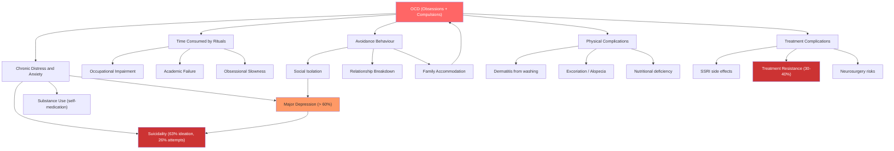

## Complications of OCD

OCD is not a benign condition. Left untreated — and even when treated — it can produce a cascading set of complications that touch every domain of a patient's life: psychiatric, physical, social, occupational, and existential. The lecture slides explicitly remind us: ***there is a huge amount of suffering associated with these disorders*** [24]. Let's work through the complications systematically, explaining the "why" behind each.

---

### 1. Psychiatric Complications

These are the most common and most clinically important complications. They arise because chronic, distressing, ego-dystonic obsessions and the exhausting cycle of compulsions erode mental health across multiple dimensions.

#### 1.1 Major Depressive Disorder

| Feature | Detail |
|---|---|
| Prevalence | ***> 60% lifetime diagnosis of a mood disorder, MDD being the most common*** (~41%) [5] |
| Relationship | Can be **secondary** to OCD (reactive/demoralisation depression) or a **primary comorbidity** (shared serotonergic pathology) |

**Why does OCD cause depression?** From first principles:
1. **Chronic distress**: The patient endures hours daily of intrusive, ego-dystonic thoughts they cannot control → learned helplessness → demoralisation
2. **Functional impairment**: OCD progressively restricts the patient's life — they cannot work, socialise, or engage in pleasurable activities → behavioural withdrawal → depressive symptoms
3. **Self-criticism and shame**: Because the obsessions are ego-dystonic ("I know this is irrational but I can't stop"), patients often feel defective, weak, or "crazy" → ↓ self-esteem → depressive cognitions
4. **Shared neurobiology**: Both OCD and depression involve serotonergic dysfunction, and the CSTC loop connects to limbic circuits involved in mood regulation
5. **Bidirectional relationship**: Depression worsens OCD (depressive cognitions amplify the catastrophic appraisals underlying obsessions), and OCD worsens depression (more OC symptoms → more demoralisation)

**Clinical significance**: Comorbid depression is a ***worse prognostic factor*** [3] — it reduces engagement with CBT (apathy, hopelessness impair the effort required for ERP), increases suicide risk, and predicts poorer treatment response.

#### 1.2 Suicidality

| Feature | Detail |
|---|---|
| Lifetime suicidal ideation | ~63% of OCD patients |
| Lifetime suicide attempts | ~26% of OCD patients |
| Completed suicide | Elevated risk compared to general population, though lower than in depression or schizophrenia alone |

**Why is suicide risk elevated?**
1. **Chronic suffering without relief**: OCD ***rarely remits (~20% in 40 years) if untreated*** [3] — years of unrelenting distress erodes the will to continue
2. **Comorbid depression**: The single strongest predictor of suicidality in OCD
3. **Hopelessness**: Especially in treatment-refractory OCD, patients may feel there is "no way out"
4. **Shame and secrecy**: Many patients conceal their symptoms for years due to shame (especially those with taboo obsessions about sexuality, violence, or religion) → social isolation → suicide risk
5. **Absent insight**: Patients with delusional-level conviction may experience greater distress because they genuinely believe the catastrophic consequences of their obsessions

<Callout title="Suicide Risk Assessment in OCD" type="error">
Do NOT assume that OCD patients are at low suicide risk simply because "it's an anxiety disorder." Always actively assess suicidal ideation, particularly in patients with comorbid depression, poor insight, treatment resistance, and social isolation. Patients with aggressive/violent obsessions may be at particular risk of shame-driven suicidality — but importantly, these patients almost NEVER act on their violent obsessions (the ego-dystonic nature means the obsession is the opposite of what the patient wants).
</Callout>

#### 1.3 Other Anxiety Disorders

***> 70% have a lifetime diagnosis of an anxiety disorder such as panic disorder, social anxiety disorder, GAD, and phobia*** [5].

**Why the high comorbidity?**
- **Shared anxiety circuitry**: The amygdala-prefrontal circuits involved in anxiety disorders overlap with the CSTC loop involved in OCD
- **Shared genetic vulnerability**: Common genetic variants (affecting serotonin, GABA, and glutamate systems) predispose to both OCD and other anxiety disorders
- **Behavioural overlap**: The avoidance behaviour in OCD can generalise to produce phobia-like presentations; the hypervigilance can resemble GAD

Specific patterns:
- **Social anxiety disorder**: Avoidance of public situations due to contamination fears or fear of performing rituals in public → mimics and may co-occur with SAD
- **Panic disorder**: Intense anxiety from obsessions can escalate to panic attacks → some OCD patients develop comorbid panic disorder
- **Specific phobias**: Obsessional phobias (e.g., avoiding kitchens due to knife-related obsessions) may evolve into specific phobia-like presentations

#### 1.4 Tic Disorders

***Up to 30% have a lifetime tic disorder*** [5].

This is not merely comorbidity — there is shared striatal pathology. Tic-related OCD has distinct features:
- Earlier age of onset
- Male predominance
- More symmetry/ordering obsessions
- More "just right" feelings (sensory rather than cognitive)
- Poorer response to SSRIs alone → often requires antipsychotic augmentation

#### 1.5 Substance Use Disorders

| Feature | Detail |
|---|---|
| Prevalence | ~25–30% lifetime |
| Common substances | Alcohol, benzodiazepines (self-medication for anxiety), cannabis |

**Why?** Patients use substances to self-medicate the chronic anxiety and distress of OCD. Alcohol and benzodiazepines are GABAergic → rapidly reduce anxiety → powerful negative reinforcement → dependence risk. This is particularly insidious because the substance provides temporary relief but worsens OCD in the long run (disrupts sleep architecture, impairs cognitive processing, interferes with CBT).

#### 1.6 Eating Disorders

| Feature | Detail |
|---|---|
| Prevalence | OCD comorbidity in AN/BN: ~15–35% |
| Overlap | Ritualistic eating behaviours, symmetry/ordering of food, contamination fears about food |

The shared compulsive quality links OCD and eating disorders. Both involve repetitive, rule-governed behaviours driven by anxiety. Anorexia nervosa in particular shares the rigidity and perfectionism associated with the OFC-striatal circuit.

#### 1.7 Other Psychiatric Comorbidities

| Comorbidity | Prevalence | Notes |
|---|---|---|
| ***Schizophrenia/schizoaffective*** | ***12%*** [5] | OC symptoms are common in schizophrenia; shared caudate pathology; antipsychotics (especially clozapine) can paradoxically worsen OC symptoms via 5-HT2A antagonism |
| Bipolar disorder | ~10–15% | Mania can disinhibit compulsions; depression phase worsens OCD |
| OCPD | 23–32% [3] | Over-represented but distinct from OCD; anankastic traits may predispose to OCD onset |
| Body Dysmorphic Disorder | ~12–15% | Shared OC-spectrum pathology; overlapping CSTC dysfunction |

---

### 2. Functional and Social Complications

These are the "silent" complications — they don't appear on blood tests but devastate quality of life.

#### 2.1 Occupational Impairment

**Why?** OCD consumes enormous time (***the obsessions or compulsions take > 1 hour/day*** [1] — and in severe cases, 6–8+ hours/day). This directly reduces productive work time. Additionally:
- Checking rituals delay task completion
- Contamination avoidance restricts which workplaces/tasks are tolerable
- Concentration is impaired by constant intrusive thoughts
- Sick days accumulate due to depression and exhaustion

Studies show OCD patients have significantly higher rates of unemployment, underemployment, and occupational disability compared to matched controls. The economic burden is substantial.

#### 2.2 Social and Interpersonal Impairment

**Why?** ***Avoidance behaviour may become pervasive and severely restrict functioning*** [3]:
- Contamination fears → avoidance of public spaces, social gatherings, physical contact → social isolation
- Shame about symptoms → concealment → emotional distance from friends and family
- Reassurance-seeking → strains relationships (partners/family become frustrated with constant demands for reassurance)
- Family accommodation → family members adapt their own behaviour to accommodate the patient's OCD (e.g., washing their own hands repeatedly, avoiding certain words/topics) → reinforces OCD and creates dysfunctional family dynamics

#### 2.3 Academic Impairment

Particularly relevant given that ***25% of OCD onset is before age 14*** [3]. Children and adolescents with OCD may:
- Spend hours on homework due to checking/perfectionism → poor academic performance despite normal intelligence
- Avoid school due to contamination or social fears
- Be misidentified as having ADHD (poor concentration) or behavioural problems

#### 2.4 Relationship and Family Impact

- **Marital/partner relationships**: OCD is associated with higher rates of relationship dissatisfaction, separation, and divorce. Partners experience caregiver burden, frustration, and their own psychological distress
- **Parent-child relationships**: Parents with OCD may impose rituals on their children (e.g., excessive cleaning rules); children may learn maladaptive anxiety responses (modelling)
- **Family accommodation**: When family members participate in rituals or modify their behaviour to reduce the patient's distress, this paradoxically reinforces the OCD cycle

---

### 3. Physical Complications

These arise directly from the compulsive behaviours themselves.

| Complication | Mechanism | Example |
|---|---|---|
| **Contact dermatitis / eczematous changes** | Excessive handwashing → disruption of skin lipid barrier → irritant contact dermatitis → cracking, bleeding, secondary infection | Patient washes hands 50+ times/day with harsh soap; hands are raw, erythematous, fissured |
| **Chemical burns** | Use of harsh disinfectants (bleach, alcohol) on skin | Patient uses undiluted bleach to "decontaminate" hands |
| **Trichotillomania-related** | Compulsive hair pulling → focal alopecia, folliculitis, scarring alopecia | Traction and mechanical damage to hair follicles |
| **Excoriation** | Compulsive skin picking → ulceration, scarring, secondary infection | Open wounds, especially on face, arms, legs |
| **Musculoskeletal strain** | Repetitive motor rituals (e.g., tapping, touching, rearranging) → overuse injuries | Tendinitis, carpal tunnel syndrome from repetitive actions |
| **Obsessional slowness → nutritional deficiency** | Eating rituals so elaborate that inadequate nutrition is consumed → malnutrition, weight loss | Patient takes 3 hours per meal due to counting/arrangement rituals; gives up eating altogether |
| **Dental erosion** | If OCD manifests as excessive tooth brushing | Enamel erosion, gum recession |
| **Iatrogenic — medication side effects** | SSRIs: GI upset, sexual dysfunction, weight gain, hyponatraemia, QTc prolongation. Clomipramine: anticholinergic effects, cardiac conduction abnormalities, seizures. Antipsychotics: metabolic syndrome, EPS, tardive dyskinesia | Complication of treatment, not the disease itself — but very real and a major cause of non-adherence |

---

### 4. Complications Related to Treatment Resistance and Chronicity

#### 4.1 Treatment-Refractory OCD

- Defined as failure to respond to ≥ 2 adequate SSRI trials + adequate CBT with ERP
- Affects ~30–40% of patients
- Leads to escalation to clomipramine, augmentation strategies, and ultimately consideration of neurosurgical interventions (DBS, psychosurgery)
- The longer OCD goes untreated, the more entrenched the CSTC loop hyperactivity becomes — akin to a "neuroplastic groove" that becomes harder to reverse

#### 4.2 Chronic Course

***OCD rarely remits (~20% in 40 years) if untreated*** [3]. Even with treatment:
- **~40% remission at 15 years** [3]
- Many patients have a **waxing and waning** course with partial remissions and relapses
- ***Relapse is common in the first few weeks after stopping*** medication [3]
- Long-term or lifelong treatment may be necessary, especially after multiple relapses

#### 4.3 Insight Deterioration

Over time, some patients' insight may deteriorate from good/fair → poor → absent/delusional. ***With absent insight, the patient is completely convinced the OCD beliefs are true*** [1]. This creates a clinical crisis:
- CBT becomes less effective (patient does not see the obsessions as irrational)
- The presentation begins to resemble a psychotic disorder → risk of misdiagnosis and inappropriate treatment
- Social functioning deteriorates further (patient acts on delusional beliefs)
- May require antipsychotic augmentation

---

### 5. Complications in Special Populations

| Population | Specific Complications |
|---|---|
| **Perinatal OCD** | ***Postpartum periods can lead to new onset or exacerbation of OCD*** [3]. Maternal OCD with harm-related obsessions (e.g., intrusive images of harming the baby) causes extreme distress and may interfere with bonding and caregiving. Risk of being misidentified as a risk to the child (these patients are horrified by their thoughts and do NOT act on them — distinguishing them from true postpartum psychosis is critical) |
| **Paediatric OCD** | Academic failure, social developmental arrest, family disruption, risk of PANDAS. Children may not report obsessions (lack of metacognitive ability to describe intrusive thoughts as "own but unwanted") → diagnosis may be delayed |
| **OCD in schizophrenia** | Clozapine (gold standard for treatment-resistant schizophrenia) can worsen or induce OC symptoms via 5-HT2A antagonism → creates a therapeutic dilemma. ***12% of schizophrenia/schizoaffective patients have OCD*** [5] |
| **Elderly** | ↑ risk of medication side effects (hyponatraemia from SSRIs, anticholinergic toxicity from clomipramine, metabolic effects from antipsychotics); cognitive decline may impair CBT engagement; OCD may be misattributed to early dementia |

---

### 6. Summary Diagram — Cascading Complications of OCD

---

<Callout title="High Yield Summary">

1. **Depression** is the single most common complication: > 60% lifetime mood disorder (MDD most common); arises from chronic distress, functional impairment, and shared serotonergic pathology; worsens prognosis
2. **Suicidality** is significantly elevated: ~63% lifetime ideation, ~26% attempts; driven by comorbid depression, hopelessness, shame, treatment resistance, and absent insight
3. **Anxiety disorder comorbidity**: > 70% lifetime; shared circuitry and genetic vulnerability
4. **Functional devastation**: occupational impairment, academic failure (especially in childhood-onset), social isolation, relationship breakdown, family accommodation
5. **Physical complications**: dermatitis from excessive washing, excoriation/alopecia from picking/pulling, nutritional deficiency from eating rituals, iatrogenic medication effects
6. **Chronic course**: rarely remits if untreated (~20% in 40 years); even treated, ~40% remission at 15 years; relapse common after medication discontinuation
7. **Treatment resistance**: 30–40% fail adequate trials; may require escalation to neurosurgical interventions
8. **Insight deterioration**: can progress from good to absent/delusional over time → resembles psychosis → therapeutic challenge
9. **Family impact**: accommodation by family members paradoxically reinforces the OCD cycle
10. **Special populations**: perinatal OCD (harm obsessions about baby — do NOT confuse with postpartum psychosis); clozapine can worsen OCD in schizophrenia patients

</Callout>

---

<ActiveRecallQuiz
  title="Active Recall - Complications of OCD"
  items={[
    {
      question: "Why is major depressive disorder the most common psychiatric complication of OCD? Explain the mechanisms.",
      markscheme: "Five mechanisms: (1) Chronic ego-dystonic distress leads to learned helplessness and demoralisation; (2) Progressive functional impairment restricts pleasurable activities leading to behavioural withdrawal; (3) Self-criticism and shame about irrational symptoms reduces self-esteem; (4) Shared serotonergic dysfunction predisposes to both conditions neurobiologically; (5) Bidirectional relationship where depression worsens OCD and vice versa. Prevalence: more than 60% lifetime mood disorder, MDD most common at approximately 41%."
    },
    {
      question: "What is family accommodation in OCD and why is it harmful?",
      markscheme: "Family accommodation is when family members modify their own behaviour to reduce the patient's OCD-related distress, for example, performing washing rituals themselves, avoiding trigger words, or providing excessive reassurance. It is harmful because it reinforces the OCD cycle: the compulsion (now performed by a family member) still provides anxiety relief and prevents habituation, maintaining the obsession-anxiety-compulsion loop. It also creates dysfunctional family dynamics and caregiver burnout."
    },
    {
      question: "A patient with OCD and contamination obsessions has severely cracked, bleeding hands. Explain the pathophysiology of this physical complication.",
      markscheme: "Contamination obsession triggers anxiety. Excessive handwashing compulsion provides temporary relief (negative reinforcement). Repeated washing (50+ times/day) with soap or disinfectants disrupts the skin lipid barrier, causes irritant contact dermatitis, leading to erythema, dryness, cracking, fissuring, and bleeding. May progress to secondary bacterial infection. Chemical burns may occur if patient uses harsh agents like bleach. This is a direct physical complication of the compulsive behaviour."
    },
    {
      question: "Why is suicide risk in OCD often underestimated, and what are the key risk factors?",
      markscheme: "Underestimated because OCD is perceived as an anxiety disorder with low mortality. However: approximately 63% lifetime suicidal ideation, approximately 26% attempt. Key risk factors: (1) Comorbid depression (strongest predictor); (2) Treatment resistance and chronicity; (3) Poor or absent insight; (4) Social isolation from shame and secrecy (especially with taboo obsessions about sex, violence, religion); (5) Hopelessness about recovery. Important: patients with violent obsessions almost never act on them (ego-dystonic) but the shame drives suicidality."
    },
    {
      question: "What is the natural course and prognosis of untreated OCD, and what factors predict worse outcomes?",
      markscheme: "Course: typically gradual onset, chronic and rarely remits spontaneously (only approximately 20% in 40 years if untreated). Even with treatment: approximately 2/3 improve to some extent in 1 year, approximately 40% remission at 15 years. Relapse common in first weeks after stopping medication. Worse prognostic factors: childhood onset, personality disorder, tic-related OCD, male sex, overvalued ideas / poor insight about obsessions, and comorbid depression."
    }
  ]}
/>

## References

[1] Lecture slides: GC 171. Stress-related disorders and obsessive-compulsive disorder (Post-traumatic stress disorder adjustment disorder, acute stress disorder)_rev.pdf (p35)
[3] Senior notes: ryanho-psych.md (Section 8.2 Obsessive-Compulsive Disorder — Course and Prognosis, pp. 188–190)
[5] Lecture slides: GC 171 (p38) — Co-morbidities of OCD
[24] Lecture slides: GC 171 (p43) — Summary
