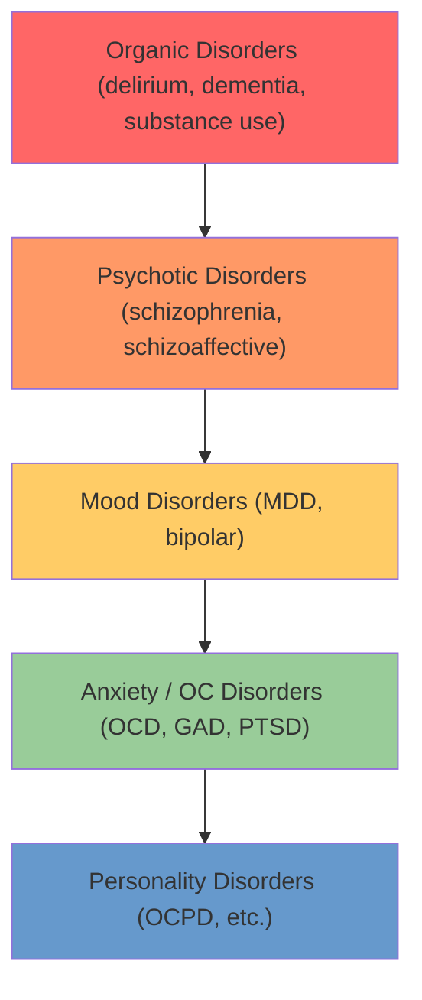
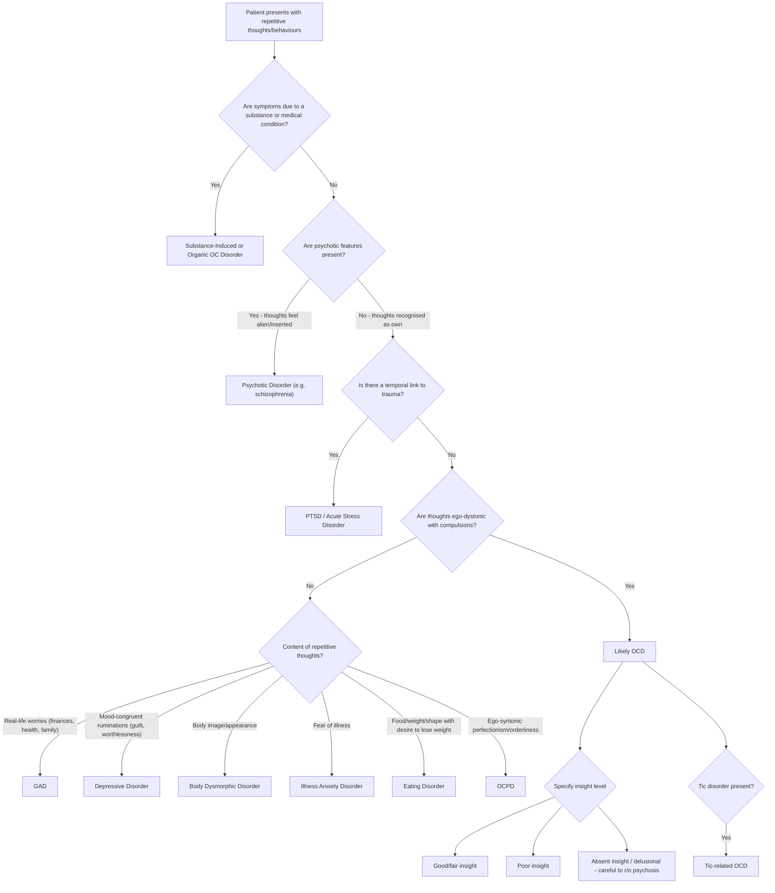

## Differential Diagnosis of OCD

The differential diagnosis of OCD is one of the trickiest areas in psychiatry exams because **obsessions, compulsions, repetitive thoughts, avoidance, and anxiety** are features shared across many disorders. The key to navigating this is to understand *why* each mimicker looks like OCD and *what specific feature* distinguishes it. Let's work through this systematically from first principles.

### Guiding Principle: The Diagnostic Hierarchy

Before diving in, remember the psychiatric diagnostic hierarchy [6]. OCD sits in the "anxiety/neurotic" tier. When OC symptoms occur in the context of a higher-order disorder (organic, psychotic, mood), the ICD-10 convention is to attribute them to that higher-order condition rather than diagnosing comorbid OCD — unless the OC symptoms are clearly independent.

> The higher the tier, the more likely it "explains away" the OC symptoms. Always rule out from the top down: organic → psychotic → mood → primary OCD.

---

### Systematic Differential Diagnosis Table

| Differential | Key Shared Feature with OCD | How to Distinguish — Why It's Different | Pathophysiological Rationale |
|---|---|---|---|
| **1. Anxiety Disorders (GAD, Panic Disorder, Social Anxiety, Phobias)** | Recurrent worries/ruminations, avoidance behaviour, prominent anxiety [3][7] | ***Content of ruminations in GAD tends to be related to real-life concerns*** (finances, health, family) — these are **ego-syntonic** worries about plausible outcomes. In OCD, obsessions are ***ego-dystonic, odd, irrational, or magical*** [3]. ***Compulsions are typically present in OCD*** but absent in pure anxiety disorders. GAD checking is directly related to the feared outcome and not excessive or ritualistic, whereas ***OCD compulsions are ritualistic/rule-driven*** and may be unrelated to the feared outcome or clearly excessive [7] | GAD involves hyperactivation of the **worry circuit** (prefrontal-amygdala), whereas OCD involves the **CSTC loop** (OFC-caudate-thalamus). The "error signal" in OCD is fundamentally different from the future-oriented threat appraisal in GAD |
| **2. Depressive Disorder** | Ruminations, guilt, poor concentration, avoidance, functional impairment [3] | ***Ruminations in depression tend to be mood-congruent*** (focused on past failures, guilt, worthlessness) ***and not necessarily experienced as intrusive or distressing*** in the way OCD obsessions are. ***There is no compulsion associated*** with depressive rumination [3]. Depression and OCD frequently co-exist — when both are present, ICD-10 advises giving precedence to whichever developed first [3] | Depressive rumination involves the **default mode network** (medial PFC, posterior cingulate) — self-referential processing about past events. OCD obsessions involve the **OFC error-detection circuit** — a sense of "incompleteness" or danger requiring action (compulsion) |
| **3. Psychotic Disorders (Schizophrenia / Schizoaffective)** | Bizarre, irrational beliefs; repetitive behaviours; poor insight in some OCD patients [3] | ***Some obsessions may resemble delusions due to oddity of beliefs or compulsive behaviours and weak resistance*** [3]. Key distinctions: (a) In OCD, thoughts are ***recognised as the patient's own*** — in schizophrenia, thought insertion/broadcasting means thoughts feel alien, inserted by an external force. (b) In OCD, even with poor insight, patients typically show some ambivalence; in psychosis, delusions are held with absolute conviction. (c) ***OC symptoms are common in schizophrenia (~12%)*** — actively elicit other psychotic features (hallucinations, thought disorder, negative symptoms) [3][5] | In schizophrenia, dopaminergic hyperactivity in mesolimbic pathways drives delusions. OCD involves serotonergic/glutamatergic dysfunction in the CSTC loop. However, there is overlap: the caudate is implicated in both, which may explain why OC symptoms frequently co-occur with schizophrenia |
| **4. Obsessive-Compulsive Personality Disorder (OCPD / Anankastic PD)** | Preoccupation with orderliness, perfectionism, rigidity, need for control [3][6] | ***OCPD traits are ego-syntonic*** — the patient sees perfectionism and rigidity as reasonable and desirable. ***OCD symptoms are ego-dystonic*** — recognised as senseless and distressing. OCPD has **no true ritualistic compulsions**; behaviour reflects personality style, not anxiety-driven rituals. ***OCPD has no urge to perform ritualistic actions*** unlike OCD [6]. Note: OCPD is over-represented in OCD (23–32%), but people with OCPD are more likely to develop **depression** than OCD [3] | OCPD reflects stable personality traits (likely related to frontal lobe structure and temperament). OCD is an episodic illness driven by circuit-level dysfunction (CSTC loop hyperactivity). The trait-state distinction is key |
| **5. Other OC-Related Disorders** | Repetitive behaviours, distress, compulsive quality [3][1] | ***Body Dysmorphic Disorder (BDD)***: OC symptoms are ***limited to concerns about physical appearance*** — preoccupation with perceived defects in appearance, mirror checking, camouflaging [3][8]. ***Trichotillomania***: compulsive behaviour ***limited to hair-pulling, with no obsessions*** [3]. ***Hoarding Disorder***: focus ***exclusively on persistent difficulty in discarding or parting with possessions*** — OCD should only be diagnosed when hoarding arises from typical OCD obsessions (e.g., incompleteness, fear of harm) [3]. ***Excoriation Disorder***: compulsive skin picking without the broader obsessional content of OCD [1] | These OC-related disorders share some CSTC loop dysfunction with OCD but involve **different cortical regions** or **different dimensions** of compulsivity. BDD involves abnormal visual processing circuits; trichotillomania involves motor habit circuits (putamen > caudate); hoarding involves ventromedial PFC decision-making circuits |
| **6. Tic Disorders / Tourette's Syndrome** | Repetitive motor or vocal behaviours [3] | ***Tics are typically less complex than compulsions and not aimed at neutralizing obsessions*** [3]. Tics are preceded by ***premonitory sensory urges*** (a physical sensation of tension in a body part) rather than obsessions (a cognitive experience). Tics are **semi-voluntary** — can be suppressed briefly but build up tension. ***Tic disorders may co-occur with OCD (up to 30%)*** [3][5] — when they do, this is specified as "tic-related" OCD, which has treatment implications (may benefit from antipsychotic augmentation) | Both involve basal ganglia (striatal) dysfunction. Tics primarily involve the **sensorimotor CSTC loop** (involving putamen), whereas OCD involves the **orbitofrontal CSTC loop** (involving caudate). Shared striatal pathology explains the high comorbidity |
| **7. PTSD / Acute Stress Disorder** | Intrusive, recurrent thoughts; avoidance behaviour; hyperarousal [9] | ***In OCD, recurrent intrusive thoughts are unrelated to a traumatic event***; in PTSD, intrusions are ***specifically related to the trauma*** (flashbacks, nightmares of the event) [9]. PTSD has a clear temporal relationship to a specific traumatic stressor, plus characteristic re-experiencing, avoidance of trauma-related stimuli, negative cognitions, and hyperarousal. Note: acute stress can precipitate OCD onset, but the OC content is typically not a re-experiencing of the traumatic event itself | PTSD involves **amygdala hyperactivity** with **hippocampal-medial PFC dysregulation** (failure to contextualize the trauma memory). OCD involves **CSTC loop** dysfunction. Different circuits, different content |
| **8. Eating Disorders (Anorexia Nervosa)** | Ritualistic behaviours around food, body checking, preoccupation with weight/shape [10] | Both AN and OCD may have obsessional thoughts about food, body image, and ritualistic eating behaviours. However, in AN the core psychopathology is **overvaluation of weight and shape** with **ego-syntonic** dietary restriction (the patient *wants* to lose weight). In OCD, food-related obsessions are **ego-dystonic** (e.g., fear of contamination of food). OCD comorbidity is common in AN (~33%) [10] | AN involves dysregulation of reward circuits (ventral striatum, insula) related to body image, whereas OCD involves CSTC error-detection circuits |
| **9. Hypochondriasis / Illness Anxiety Disorder** | Health-related preoccupations, checking behaviours, reassurance-seeking [11] | In hypochondriasis, the concern is principally about **having a serious illness** — it is a persistent fear/conviction of illness, not an intrusive unwanted thought. The patient seeks **diagnosis** rather than relief from intrusive thoughts. In OCD, health concerns are typically contamination-related (fear of *getting* contaminated → washing) and are accompanied by ritualistic compulsions [11] | Hypochondriasis may involve anterior insula (interoceptive processing) and threat-appraisal circuits, whereas OCD contamination obsessions are driven by the CSTC error-detection loop |
| **10. Organic Causes** | OC symptoms arising from identifiable neurological/medical pathology [3] | ***OC symptoms may occur in chronic cases of encephalitis lethargica*** [3]; also seen with Tourette's syndrome, ***PANDAS***, Huntington's disease, basal ganglia lesions (stroke, tumour), frontal lobe lesions, temporal lobe epilepsy, post-head injury. Always consider organic aetiology when: (a) onset is acute/atypical; (b) age > 40 at first presentation; (c) associated neurological signs; (d) poor response to standard treatment | Any process that disrupts the CSTC loop components (caudate, OFC, thalamus) can produce OC symptoms. PANDAS demonstrates this via autoimmune caudate inflammation; Huntington's via caudate atrophy; encephalitis lethargica via basal ganglia inflammation |
| **11. Substance-Induced** | Anxiety, repetitive behaviours, agitation | Stimulant intoxication (amphetamines, cocaine) can cause repetitive stereotyped behaviours ("punding"). Withdrawal from sedatives/alcohol can cause anxiety resembling OCD. The key is **temporal relationship** to substance use — symptoms should resolve with cessation. Always take a thorough substance history [12] | Stimulants cause dopaminergic hyperactivity in striatal circuits → stereotyped behaviours that superficially resemble compulsions but lack the cognitive obsessional component |
| **12. Autism Spectrum Disorder (ASD)** | Repetitive, stereotyped behaviours; insistence on sameness; rigid routines [13] | In ASD, repetitive behaviours are typically **ego-syntonic** (enjoyed or comforting), not driven by anxiety or intrusive thoughts. ASD has core deficits in **social communication and reciprocity** that are absent in OCD. Restricted interests in ASD are often pleasurable (e.g., intense fascination with trains), whereas OCD obsessions are distressing. However, OCD can co-occur with ASD | ASD involves widespread neurodevelopmental differences (cortical connectivity, mirror neuron system, etc.) whereas OCD is a circuit-specific disorder (CSTC loop) |

---

### Key Differentiating Features — Decision Flowchart

---

### Detailed Discussion of the Most Commonly Tested Differentials

#### 1. OCD vs GAD — "The Content Test"

This is the single most commonly tested differential in exams. Here is how to think about it from first principles:

- **GAD** = the brain's threat-detection system is set too sensitively for **real-world concerns**. The worry is about things that *could plausibly happen* — "Will I lose my job? Will my child get sick? Can I pay the mortgage?" These worries are **ego-syntonic** — the patient thinks it is *reasonable* to worry about these things.
- **OCD** = the brain's **error-detection/completion circuit (CSTC loop)** fires excessively, generating a sense that "something is wrong" about **irrational, bizarre, or magical themes**. The patient *knows* the worry is senseless but cannot stop it — this is **ego-dystonic**.

***OCD compulsions are typically ritualistic/rule-driven*** (must be done in a certain way, a certain number of times) ***and may be unrelated to the feared outcome they are intended to prevent and/or clearly excessive*** [7]. GAD checking behaviours are usually directly related to preventing the feared outcome and are not usually excessive or time-consuming [7].

#### 2. OCD vs Psychosis — "The Ownership Test"

***Some obsessions may resemble delusions due to oddity of beliefs or compulsive behaviours and weak resistance*** [3]. The critical question is: **"Do you recognise these thoughts as your own?"**

- In OCD: "Yes, they're my thoughts, but they're horrible and I can't stop them" → **ego-dystonic, own thoughts**
- In schizophrenia with thought insertion: "No, someone is putting these thoughts in my head" → **ego-alien, externally attributed**

<Callout title="The Insight Spectrum — Watch Out!" type="error">
OCD exists on an insight spectrum. ***With absent insight/delusional beliefs — the patient is completely convinced the OCD beliefs are true*** [1]. This can look virtually identical to a delusional disorder. The key is the *content* and *history*: OCD themes (contamination, checking, symmetry) are characteristic, and there is usually a longitudinal history of OCD symptoms that preceded the loss of insight. Also look for other psychotic features (hallucinations, thought disorder, negative symptoms) — if present, think schizophrenia.
</Callout>

#### 3. OCD vs PTSD — "The Trauma Link Test"

***In OCD, recurrent intrusive thoughts are present, but they are unrelated to a traumatic event. In PTSD, anxiety symptoms (worries, avoidance, arousal) are specifically related to traumatic events*** [9]. Both have intrusive thoughts and avoidance, but:

- PTSD intrusions = **re-experiencing** the trauma (flashbacks, nightmares *of the event*)
- OCD intrusions = **unrelated to any specific event** (contamination fears, checking doubts, etc.)

Note: Traumatic events can **precipitate** OCD onset, but the OCD content is typically about contamination, symmetry, etc. — not a replay of the trauma itself.

#### 4. OCD vs OC-Related Disorders — "The Content Domain Test"

The ***OC-related disorders*** listed in both DSM-5 and ICD-11 share the **compulsive quality** but are distinguished by their **restricted content domain** [1][3]:

| Disorder | Content Domain | Obsessional Component? |
|---|---|---|
| ***Body Dysmorphic Disorder*** | ***Limited to concerns about physical appearance*** | Yes — preoccupation with perceived appearance defects |
| ***Trichotillomania*** | ***Limited to hair-pulling*** | ***No obsessions*** — driven by premonitory urge/tension |
| ***Hoarding Disorder*** | ***Exclusively difficulty discarding possessions*** | Variable — may have emotional attachment, not classic obsessions |
| ***Excoriation Disorder*** | Limited to skin-picking | No obsessions — driven by urge/tension |
| OCD | Multiple domains possible | Yes — intrusive, ego-dystonic obsessions |

> ***OCD should be diagnosed when hoarding behaviour arises from obsessions typical of OCD*** (e.g., obsessions concerning incompleteness or harm — not discarding old newspapers because they may contain information that could prevent harm) [3]. If hoarding is ego-syntonic and not driven by typical OCD themes, diagnose Hoarding Disorder.

#### 5. OCD vs Tics — "The Purpose Test"

Both involve repetitive movements, but they differ fundamentally in **purpose**:

- ***Tics are typically less complex than compulsions and not aimed at neutralizing obsessions*** [3]
- Tics are preceded by **premonitory sensory urges** (a physical "itch" or tension in a body part)
- Compulsions are preceded by **obsessions** (a cognitive experience — an intrusive thought causing anxiety)
- ***Tic disorders may occur together with OCD*** [3] — up to 30% of OCD patients have tics, and this co-occurrence should be specified as ***tic-related*** OCD [1][5]

---

### Summary of "Red Flags" That Point Away From Primary OCD

| Red Flag | Think Instead |
|---|---|
| Thoughts feel alien/inserted | Psychotic disorder |
| Temporal relationship to substance use | Substance-induced |
| Onset after age 40 with neurological signs | Organic cause (basal ganglia lesion, neurodegenerative disease) |
| Acute onset in a child after streptococcal infection | PANDAS |
| Intrusions specifically about a traumatic event | PTSD |
| Content exclusively about physical appearance | BDD |
| Content exclusively about food/weight/shape | Eating disorder |
| Ego-syntonic perfectionism without rituals | OCPD |
| Simple, brief, non-purposeful motor movements | Tic disorder |
| Worries about plausible real-life concerns | GAD |
| Mood-congruent ruminations with no compulsions | Depression |

---

<Callout title="High Yield Summary">

1. **Always rule from the top of the diagnostic hierarchy downward**: Organic → Substance → Psychotic → Mood → OCD → Personality
2. **The ego-dystonic test**: OCD obsessions are ego-dystonic (senseless, unwanted); GAD worries are ego-syntonic; OCPD traits are ego-syntonic
3. **The ownership test**: OCD thoughts are recognised as own; in psychosis with thought insertion, thoughts feel alien/externally imposed
4. **The content domain test**: OCD has broad obsessional themes; BDD is limited to appearance; trichotillomania has no obsessions; hoarding is about difficulty discarding
5. **The trauma link test**: PTSD intrusions are trauma-related; OCD intrusions are unrelated to specific trauma
6. **The purpose test**: Compulsions aim to neutralise obsessions; tics are purposeless and preceded by sensory urges not cognitive obsessions
7. **Insight spectrum in OCD**: Good/fair → poor → absent/delusional; absent insight OCD can mimic delusional disorder — look for characteristic OCD themes and absence of other psychotic features
8. **OCD and comorbidity**: > 70% anxiety disorders, > 60% mood disorders, up to 30% tic disorders, 12% schizophrenia/schizoaffective — always screen for comorbidities

</Callout>

---

<ActiveRecallQuiz
  title="Active Recall - Differential Diagnosis of OCD"
  items={[
    {
      question: "A patient presents with repetitive checking behaviours and worry about finances, health, and family safety. How would you distinguish GAD from OCD?",
      markscheme: "GAD worries are ego-syntonic, focused on real-life plausible concerns (finances, health, family), and checking is directly related to the feared outcome and not excessive/ritualistic. OCD obsessions are ego-dystonic, often irrational/magical, and compulsions are ritualistic/rule-driven, may be unrelated to feared outcome, and clearly excessive. GAD lacks true compulsions."
    },
    {
      question: "An OCD patient has completely lost insight and is convinced their contamination beliefs are true. How do you distinguish this from a delusional disorder?",
      markscheme: "Look for: (1) characteristic OCD themes (contamination, checking, symmetry); (2) longitudinal history of OCD predating loss of insight; (3) absence of other psychotic features (hallucinations, thought disorder, negative symptoms); (4) thoughts still recognised as own (not externally inserted). DSM-5 specifies 'absent insight/delusional beliefs' as an OCD specifier."
    },
    {
      question: "How do you differentiate OCD from PTSD when both present with intrusive thoughts and avoidance?",
      markscheme: "In PTSD, intrusive thoughts are specifically about the traumatic event (flashbacks, nightmares of the event) and avoidance is of trauma-related stimuli. In OCD, intrusive thoughts are unrelated to a specific traumatic event (contamination, symmetry, harm themes) and avoidance is of OCD-trigger cues. PTSD requires a qualifying traumatic stressor."
    },
    {
      question: "Name the five OC-related disorders in DSM-5/ICD-11 and state the key distinguishing feature of each from OCD.",
      markscheme: "1. Body Dysmorphic Disorder - OC symptoms limited to perceived appearance defects; 2. Hoarding Disorder - focus exclusively on difficulty discarding possessions (diagnose OCD only if hoarding arises from typical OCD obsessions); 3. Trichotillomania - compulsive hair-pulling with no obsessions; 4. Excoriation Disorder - compulsive skin-picking with no obsessions; 5. (ICD-11 also includes Olfactory Reference Disorder). All have restricted content domains vs OCD's broad obsessional themes."
    },
    {
      question: "A child develops sudden-onset OC symptoms after a sore throat. What differential diagnosis should you consider and why?",
      markscheme: "PANDAS (Paediatric Autoimmune Neuropsychiatric Disorder Associated with Streptococcal infection). Group A streptococcal infection triggers autoimmune antibodies that cross-react with caudate nucleus (molecular mimicry), causing acute OC symptoms. Key features: sudden onset in a child, temporal relationship to streptococcal infection, may have associated chorea (Sydenham). This is an organic/autoimmune cause of OC symptoms, not primary OCD."
    }
  ]}
/>

## References

[1] Lecture slides: GC 171. Stress-related disorders and obsessive-compulsive disorder (Post-traumatic stress disorder adjustment disorder, acute stress disorder)_rev.pdf (p31, p35, p38)
[3] Senior notes: ryanho-psych.md (Section 8.2 Obsessive-Compulsive Disorder — Differential Diagnoses, pp. 188–189)
[5] Lecture slides: GC 171 (p38) — Co-morbidities of OCD
[6] Senior notes: ryanho-psych.md (Hierarchy of diagnosis, p. 4)
[7] Senior notes: ryanho-psych.md (Section 8.1 GAD — Differential Diagnoses, OCD vs GAD)
[8] Senior notes: ryanho-psych.md (Body Dysmorphic Disorder, p. 206)
[9] Senior notes: ryanho-psych.md (D/dx of PTSD — Anxiety and OCD)
[10] Senior notes: ryanho-psych.md (Eating Disorders — Anxiety spectrum, OCD)
[11] Senior notes: ryanho-psych.md (Somatic Symptom Disorder — D/dx OCD)
[12] Lecture slides: GC 167. I feel very nervous Anxiety disorders.pdf (p27) — DDx for anxiety symptoms including physical disorder and substance abuse
[13] Senior notes: ryanho-psych.md (D/dx of ASD — OCD)
