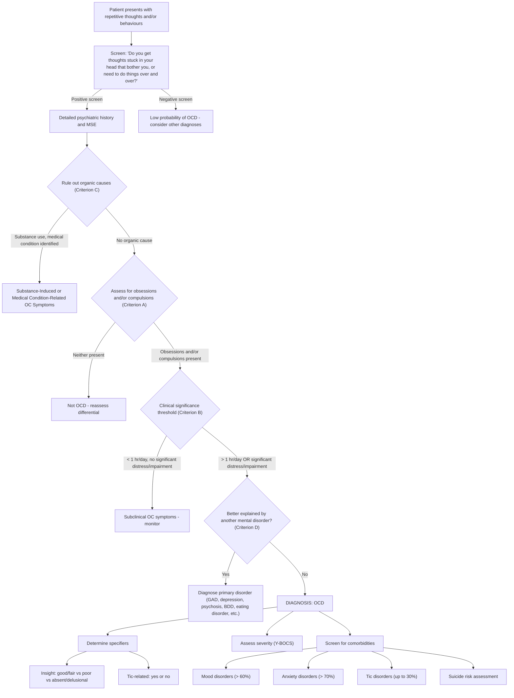

## Diagnostic Criteria, Diagnostic Algorithm, and Investigations for OCD

### 1. Diagnostic Criteria

OCD is a **clinical diagnosis** — there is no blood test, scan, or biomarker that confirms it. The diagnosis rests entirely on a careful psychiatric history and mental state examination, guided by standardised diagnostic criteria. Let's walk through both the DSM-5 and ICD-10 criteria in detail, explaining *why* each criterion exists.

#### 1.1 DSM-5 Diagnostic Criteria for OCD (300.3 / F42.x)

This is presented across three lecture slides [1][2] and is the primary framework you should know:

| Criterion | DSM-5 Wording | Explanation — Why This Criterion Exists |
|---|---|---|
| **A** | ***Presence of obsessions, compulsions, or both*** | The core of the diagnosis. You need at least one of obsessions or compulsions — most patients (~90%) have both, but either alone is sufficient |

**Obsessions** are defined by **both** (1) and (2) [1][14]:

> ***"(1) Recurrent and persistent thoughts, urges, or images that are experienced, at some time during the disturbance, as intrusive and unwanted, and that in most individuals cause marked anxiety or distress"*** [1][14]

> ***"(2) The individual attempts to ignore or suppress such thoughts, urges, or images, or to neutralize them with some other thought or action (i.e. by performing a compulsion)"*** [1][14]

**Why two sub-criteria?** Criterion A1 establishes the *nature* of the obsessions (intrusive, unwanted, distressing). Criterion A2 establishes the *response* — the patient does not passively accept them but actively tries to suppress or neutralise them. This distinguishes obsessions from, say, pleasant daydreams or goal-directed planning.

**Compulsions** are defined by **both** (1) and (2) [1][15]:

> ***"(1) Repetitive behaviours (e.g., hand washing, ordering, checking) or mental acts (e.g., praying, counting, repeating words silently) that the individual feels driven to perform in response to an obsession, or according to rules that must be applied rigidly"*** [1][15]

> ***"(2) The behaviours or mental acts are aimed at preventing or reducing anxiety or distress, or preventing some dreaded event or situation; however, these behaviours or mental acts are not connected in a realistic way with what they are designed to neutralize or prevent, or are clearly excessive"*** [1][15]

**Why two sub-criteria?** Criterion B1 establishes the *driven* quality (compulsion = compelled to do). Criterion B2 is crucial — it captures the **irrationality** or **excessiveness** of the act. Washing your hands after using the toilet is rational; washing them 50 times until they bleed is "clearly excessive." Praying once before a meal is connected realistically to religious practice; praying 300 times to prevent your family from dying is "not connected in a realistic way."

<Callout title="Mental Acts Count as Compulsions!" type="error">
A common exam mistake is to think compulsions must be observable behaviours. ***Mental acts*** (praying silently, counting in one's head, repeating words silently) are explicitly included in the DSM-5 definition [15]. Always ask about mental rituals — patients may not volunteer them because they assume "it's just in my head."
</Callout>

| Criterion | DSM-5 Wording | Explanation |
|---|---|---|
| **B** | ***"The obsessions or compulsions are time-consuming (take more than 1 hour/day), or cause clinically significant distress or impairment in social, occupational, or other important areas of functioning"*** [1][16] | This is the **clinical significance threshold**. Many people have mild OC traits; this criterion ensures we only diagnose OCD when it actually causes harm. The **> 1 hour/day** benchmark is a useful clinical rule of thumb (and is used in the Y-BOCS scoring system) |
| **C** | ***"Not attributable to the direct physiological effects of a substance or another medical condition"*** [16] | Rules out organic/substance-induced OC symptoms (e.g., stimulant-induced stereotypies, post-encephalitic OC symptoms, PANDAS) |
| **D** | ***"The disturbance is not better explained by the symptoms of another mental disorder"*** [16] | Rules out OC-like symptoms that are better accounted for by GAD (real-life worries), depression (mood-congruent ruminations), psychosis (delusions), BDD (appearance concerns), eating disorders (food/weight preoccupations), etc. |

**Specifiers** [1][17]:

| Specifier | Description |
|---|---|
| ***With good or fair insight*** | ***Recognises that OCD beliefs are definitely or most likely not true*** [1] |
| ***With poor insight*** | ***Thinks OCD beliefs are probably true*** [1] |
| ***With absent insight*** | ***Is completely convinced the OCD beliefs are true*** [1] |
| ***Tic-related*** | Current or past tic disorder [1] |

<Callout title="DSM-5 Does NOT Require Rejection of Beliefs">
***The DSM does not require patients to actually reject obsessional beliefs to make a diagnosis*** [3]. This is an important update from older criteria — even patients with absent insight/delusional conviction can be diagnosed with OCD, as long as the content and pattern fit OCD rather than a primary psychotic disorder.
</Callout>

#### 1.2 ICD-10 Diagnostic Criteria for OCD (F42)

The ICD-10 criteria are slightly different in emphasis [3]:

| Criterion | ICD-10 Wording | Key Differences from DSM-5 |
|---|---|---|
| **Duration** | ***Obsessional symptoms or compulsive acts must be present on most days for ≥ 2 successive weeks*** | ICD-10 specifies a **minimum duration of 2 weeks**; DSM-5 does not specify a minimum duration (relies on clinical significance instead) |
| **(a)** | ***They must be recognised as the individual's own thoughts or impulses*** | Explicitly requires **ownership** — this is implied in DSM-5 but stated explicitly in ICD-10 |
| **(b)** | ***There must be at least one thought or act that is still resisted unsuccessfully*** | Requires evidence of **resistance** — DSM-5 is softer on this, acknowledging resistance may wane over time |
| **(c)** | ***The thought of carrying out the act must not be in itself pleasurable*** (not including simple relief of tension or anxiety) | This distinguishes compulsions from **impulsive acts** (which are pleasurable, e.g., gambling, substance use). The relief experienced after a compulsion is not "pleasure" — it is tension reduction |
| **(d)** | ***The thoughts, images, or impulses must be unpleasantly repetitive*** | Emphasises the distressing, repetitive nature |
| **Hierarchy note** | ***If both depression and OC symptoms are present, precedence should be given to the symptoms that developed first, or if none predominates, regard depression as primary*** | ICD-10 applies the diagnostic hierarchy more strictly than DSM-5 |
| **Subtypes** | F42.0 predominantly obsessional thoughts or ruminations; F42.1 predominantly compulsive acts; F42.2 mixed obsessional thoughts and acts | ICD-10 offers subtyping by predominant presentation; DSM-5 uses insight and tic-related specifiers instead |

#### 1.3 ICD-11 Criteria (6B20) — Current Standard

The ICD-11 (2019/2022) has updated the criteria. Key changes from ICD-10:
- OCD is moved from "Neurotic, stress-related and somatoform disorders" (F4) to a new category: **"Obsessive-Compulsive and Related Disorders"**
- The resistance requirement is relaxed (consistent with DSM-5)
- Insight specifiers are added (good/fair, poor, absent)
- Minimum duration requirement is retained but less rigid

---

### 2. Screening Questions

Before a formal diagnostic assessment, screening can identify patients who may have OCD. The lecture slides provide a specific screening question [18]:

> ***"Do you get thoughts stuck in your head that really bother you or need to do things over and over like washing your hands, checking things or count?"*** [18]

This single question captures both obsessions ("thoughts stuck in your head that really bother you") and compulsions ("need to do things over and over like washing, checking, counting"). It is elegant because it uses lay language and gives concrete examples that patients can relate to.

Other useful screening questions include:
- "Do you wash or clean a lot?"
- "Do you check things a lot?"
- "Is there any thought that keeps bothering you that you'd like to get rid of but can't?"
- "Do your daily activities take a long time to finish?"
- "Are you concerned about putting things in a special order, or are you very upset by mess?"

---

### 3. Diagnostic Algorithm

The following flowchart integrates the screening, assessment, diagnostic criteria, and specifier determination into a clinical decision pathway:

#### Step-by-Step Walkthrough

| Step | Action | Rationale |
|---|---|---|
| **1. Screen** | Use screening question(s) above [18] | Efficient initial detection; OCD is frequently underdiagnosed because patients are embarrassed or do not recognise symptoms as a disorder |
| **2. Full History** | Detailed psychiatric history: onset, course, content of obsessions/compulsions, triggers, avoidance, insight, family history, childhood symptoms, substance use, medical history | OCD is a clinical diagnosis — the history IS the investigation |
| **3. Mental State Examination** | Appearance (dermatitis?), behaviour (rituals?), speech, mood (depressed? anxious?), thought form and content (obsessions? delusions?), perception, cognition, insight, risk | MSE provides objective data; insight assessment is critical for specifier determination |
| **4. Rule out organics** | Medical history, substance history, neurological examination, consider blood tests if atypical | Organic mimickers (PANDAS, encephalitis lethargica, basal ganglia lesions) can present identically |
| **5. Apply diagnostic criteria** | Criterion A → B → C → D sequentially | Systematic application ensures diagnostic rigour |
| **6. Specifiers** | Assess insight level; screen for tics | Determines treatment approach (e.g., antipsychotic augmentation for absent insight or tic-related) |
| **7. Severity** | Apply Y-BOCS | Quantifies severity; guides treatment intensity; monitors response |
| **8. Comorbidities** | Screen for depression, anxiety, tics, substance use, suicide risk | > 60% have comorbid mood disorder; > 70% comorbid anxiety; suicide risk is elevated |

---

### 4. Investigation Modalities

OCD is fundamentally a **clinical diagnosis**. There are no diagnostic laboratory tests or imaging studies. However, investigations serve three purposes:
1. **Quantifying severity** (to guide treatment and monitor progress)
2. **Ruling out organic causes** (especially in atypical presentations)
3. **Screening for comorbidities**

#### 4.1 Severity Assessment Tools

##### 4.1.1 Yale-Brown Obsessive-Compulsive Scale (Y-BOCS)

The **Y-BOCS** is the gold standard for measuring OCD severity. Understanding it is high-yield.

**Name breakdown**: Yale-Brown → developed at Yale University and Brown University

**Structure**: 10 items, each scored 0–4, total score 0–40

| Item | Domain | What It Measures |
|---|---|---|
| Items 1–5 | **Obsessions** | Time occupied, interference, distress, resistance, control |
| Items 6–10 | **Compulsions** | Time occupied, interference, distress, resistance, control |

**Severity thresholds**:

| Y-BOCS Score | Severity | Clinical Implication |
|---|---|---|
| 0–7 | Subclinical | Monitoring; psychoeducation |
| 8–15 | Mild | Low-intensity CBT or watchful waiting |
| 16–23 | Moderate | SSRI or CBT (or both) |
| 24–31 | Severe | Combination SSRI + CBT; consider higher SSRI doses |
| 32–40 | Extreme | Intensive combined treatment; consider clomipramine or augmentation strategies |

**Why the Y-BOCS is useful**:
- It separates obsessions and compulsions — you can track each independently
- It measures **five dimensions** for each: time, interference, distress, resistance, and control — these capture different aspects of severity
- A ≥ 35% reduction in Y-BOCS score is typically considered a **treatment response**
- A score ≤ 12–14 is often used as the threshold for **remission**

##### 4.1.2 Other Rating Scales

| Scale | Purpose | Notes |
|---|---|---|
| **Obsessive-Compulsive Inventory – Revised (OCI-R)** | Self-report screening tool; 18 items | Useful for initial screening and monitoring; less clinician time required |
| **Dimensional Obsessive-Compulsive Scale (DOCS)** | Measures severity across 4 symptom dimensions (contamination, responsibility, unacceptable thoughts, symmetry) | Useful for profiling which dimension is dominant |
| **Clinical Global Impression – Severity (CGI-S)** | 1-item clinician-rated global severity | Quick, used in clinical trials alongside Y-BOCS |
| **Children's Y-BOCS (CY-BOCS)** | Modified Y-BOCS for paediatric use | For children and adolescents; similar structure |

#### 4.2 Investigations to Rule Out Organic Causes

These are **not routine** — they are indicated only when the clinical picture is atypical (e.g., acute onset, late onset after age 40, neurological signs, treatment resistance, presentation in a child post-infection):

| Investigation | When to Order | What You're Looking For | Key Findings/Interpretation |
|---|---|---|---|
| **Basic bloods** (FBC, RFT, LFT, TFT, glucose, calcium) | Atypical presentation; suspected medical cause; pre-treatment baseline | Thyroid dysfunction (can cause anxiety mimicking OCD); metabolic derangements; baseline before starting SSRIs | Abnormal TFTs → investigate thyroid disease; abnormal LFTs → caution with hepatically metabolised drugs |
| **Anti-streptolysin O titre (ASOT) / Anti-DNAse B** | ***Suspected PANDAS*** — acute onset OC symptoms in a child following sore throat/pharyngitis [3] | Evidence of recent streptococcal infection | Elevated ASOT ( > 200 IU/mL) or Anti-DNAse B → supports PANDAS diagnosis; temporal correlation with OC symptom onset is critical |
| **Throat swab culture** | Suspected PANDAS — to identify active Group A strep infection | Active streptococcal pharyngitis | Positive culture → treat infection; may lead to resolution of OC symptoms |
| **Brain MRI** | Atypical features: focal neurological signs, late onset, rapid progression, treatment resistance | Basal ganglia lesions (stroke, tumour, demyelination); caudate atrophy (Huntington's); frontal lobe lesions | Caudate/basal ganglia pathology → organic OC syndrome; frontal lobe pathology → consider frontotemporal dementia or tumour |
| **EEG** | Suspected temporal lobe epilepsy (episodic OC symptoms, altered consciousness, automatisms) | Temporal lobe epileptiform discharges | Temporal spikes → TLE as organic cause of OC-like symptoms |
| **Autoimmune panel (anti-neuronal antibodies)** | Suspected autoimmune encephalitis (acute onset, psychiatric + neurological symptoms) | Anti-NMDA receptor antibodies, anti-basal ganglia antibodies | Positive antibodies → autoimmune encephalitis; specific treatment (immunotherapy) may resolve OC symptoms |
| **Urine drug screen** | Suspected substance-induced OC symptoms | Stimulant use (amphetamines, cocaine) → can cause stereotyped behaviours resembling compulsions | Positive for stimulants → substance-induced; OC symptoms should resolve with cessation |
| **Copper studies (ceruloplasmin, 24hr urine copper)** | Young patient with movement disorder + psychiatric symptoms (suspect Wilson's disease) | Low ceruloplasmin, elevated urine copper | Wilson's disease affects basal ganglia → can cause OC symptoms among other psychiatric manifestations |

#### 4.3 Pre-Treatment Investigations

Before initiating pharmacotherapy (particularly SSRIs or clomipramine), the following baseline investigations may be warranted:

| Investigation | Reason |
|---|---|
| **ECG** | Particularly before starting **clomipramine** (tricyclic antidepressant) — check for prolonged QTc, conduction abnormalities. Also relevant for high-dose SSRIs (especially citalopram/escitalopram which can prolong QTc) |
| **Baseline weight/BMI** | SSRIs can cause weight changes; important for monitoring |
| **LFTs** | SSRIs and clomipramine are hepatically metabolised |
| **U&Es/RFT** | Baseline renal function; hyponatraemia risk with SSRIs (SIADH) |
| **TFTs** | Rule out thyroid dysfunction as comorbid/contributing factor |
| **Pregnancy test** | In women of childbearing age — SSRIs have category C/D risk; paroxetine specifically is category D (teratogenic, cardiac defects) |

#### 4.4 Research/Academic Investigations (Not Routine Clinical Practice)

These are mentioned in the notes for understanding pathophysiology, not for clinical diagnosis [3]:

| Modality | Findings in OCD | Clinical Relevance |
|---|---|---|
| ***Structural MRI*** | ***↑ grey matter volume in striatum; ↓ in orbitofrontal, dorsomedial and anterior cingulate cortex*** [3] | Supports CSTC loop model; not used diagnostically |
| ***Functional MRI / PET*** | ***↑ activity in orbitofrontal cortex, caudate, anterior cingulate, and thalamus*** [3] | Activity normalises with successful treatment (both SSRI and CBT); supports circuit-level model |
| ***Neurotransmitter studies*** | ***↓ cortical 5-HT1A binding; inconsistent serotonin findings*** [3] | Explains why SSRIs help but does not confirm a simple serotonin deficit |

---

### 5. The Psychiatric Assessment Framework for OCD

In clinical practice, the "investigation" for OCD IS the clinical interview. Here is how to structure it:

| Component | Key Areas to Cover | Why |
|---|---|---|
| **History of presenting complaint** | Onset (gradual vs acute), precipitants, course (continuous vs episodic), content of obsessions and compulsions (use the 4 dimensions: contamination, doubt/checking, symmetry, forbidden thoughts), time spent per day, degree of distress, impact on function, avoidance behaviours | Characterises the illness; determines severity; identifies themes for CBT |
| **Insight assessment** | "Do you think these thoughts/behaviours are reasonable?" "Do you believe X will really happen if you don't Y?" | Determines insight specifier; guides treatment (poor/absent insight → may need antipsychotic augmentation) |
| **Resistance assessment** | "Do you try to resist these thoughts/behaviours?" "What happens when you try?" | Part of diagnostic criteria (ICD-10); also indicates disease chronicity (resistance tends to diminish over time) |
| **Comorbidity screen** | Depression (PHQ-9), anxiety disorders (GAD-7), tics (ask about motor and vocal tics), substance use, eating patterns | > 60% have comorbid depression; > 70% comorbid anxiety; up to 30% comorbid tics [5] |
| **Risk assessment** | Suicidal ideation, self-harm, harm to others (particularly if aggressive obsessions are present — reassure that OCD patients almost never act on these) | Suicide risk is elevated in OCD, especially with comorbid depression |
| **Family history** | OCD, tic disorders, anxiety, depression in first-degree relatives | 4× risk in first-degree relatives; supports genetic contribution |
| **Developmental history** | Childhood onset, childhood adversity, PANDAS | 25% onset before age 14; PANDAS should be considered in paediatric acute onset |
| **Premorbid personality** | OCPD traits, other personality features | Prognostic implications; anankastic traits are over-represented |
| **Collateral history** | From family/carers — patients may minimise symptoms or have poor insight | Essential when insight is poor/absent; family may provide crucial behavioural observations |

---

<Callout title="High Yield Summary">

1. **OCD is a clinical diagnosis** — no blood test or scan confirms it. The clinical interview IS the investigation.
2. **DSM-5 Criterion A**: Obsessions (intrusive, unwanted, cause distress + attempts to suppress/neutralise) and/or Compulsions (repetitive, driven, aimed at reducing distress but not realistically connected or clearly excessive)
3. **DSM-5 Criterion B**: Time-consuming ( > 1 hour/day) OR clinically significant distress/impairment
4. **DSM-5 Criterion C**: Not attributable to substance or medical condition
5. **DSM-5 Criterion D**: Not better explained by another mental disorder
6. **Specifiers**: Insight (good/fair, poor, absent/delusional) and Tic-related
7. **ICD-10 key differences**: Requires ≥ 2 weeks duration; explicitly requires ownership of thoughts, resistance, and non-pleasurability; applies diagnostic hierarchy more strictly
8. **Y-BOCS** is the gold standard severity scale (0–40; subclinical < 8, mild 8–15, moderate 16–23, severe 24–31, extreme 32–40)
9. **Screening question**: "Do you get thoughts stuck in your head that really bother you, or need to do things over and over like washing your hands, checking things, or counting?"
10. **Organic workup** is only needed in atypical presentations: ASOT for PANDAS, MRI for basal ganglia lesions, EEG for TLE, drug screen for substances
11. **Pre-treatment**: ECG (especially before clomipramine or high-dose SSRI), LFTs, U&Es, TFTs, pregnancy test

</Callout>

---

<ActiveRecallQuiz
  title="Active Recall - OCD Diagnostic Criteria, Algorithm, and Investigations"
  items={[
    {
      question: "State the four DSM-5 criteria (A-D) for OCD in your own words.",
      markscheme: "A: Presence of obsessions (intrusive, unwanted, distressing thoughts/urges/images + attempts to suppress/neutralise) and/or compulsions (repetitive driven behaviours/mental acts aimed at reducing distress, not realistically connected to what they prevent or clearly excessive). B: Time-consuming (more than 1 hr/day) or cause clinically significant distress or functional impairment. C: Not due to substance or medical condition. D: Not better explained by another mental disorder."
    },
    {
      question: "What are the DSM-5 specifiers for OCD and why are they clinically important?",
      markscheme: "Insight specifiers: good/fair (recognises beliefs are definitely or probably not true), poor (thinks probably true), absent/delusional (completely convinced beliefs are true). Tic-related: current or past tic disorder. Clinical importance: absent insight may need antipsychotic augmentation and careful differentiation from delusional disorder; tic-related OCD may respond to antipsychotic augmentation; insight level predicts treatment response especially to CBT."
    },
    {
      question: "Describe the Y-BOCS: what does it measure, how is it scored, and what are the severity thresholds?",
      markscheme: "Y-BOCS = Yale-Brown Obsessive Compulsive Scale. 10 items (5 for obsessions, 5 for compulsions) measuring time, interference, distress, resistance, and control. Each item scored 0-4, total 0-40. Severity: subclinical 0-7, mild 8-15, moderate 16-23, severe 24-31, extreme 32-40. Treatment response defined as 35% or more reduction; remission at score 12-14 or below."
    },
    {
      question: "Name three key differences between the ICD-10 and DSM-5 diagnostic criteria for OCD.",
      markscheme: "1. ICD-10 requires minimum 2 weeks duration; DSM-5 does not specify minimum duration. 2. ICD-10 explicitly requires thoughts be recognised as own and at least one act still resisted; DSM-5 does not require resistance. 3. ICD-10 applies diagnostic hierarchy more strictly (if OC symptoms develop in presence of schizophrenia or Tourette, regard as part of those conditions; if depression and OCD coexist, give precedence to whichever developed first). DSM-5 uses specifiers (insight, tic-related) and allows comorbid diagnoses more freely."
    },
    {
      question: "When should you order an ASOT titre in a patient with OC symptoms, and what would a positive result indicate?",
      markscheme: "Order when suspecting PANDAS: acute onset OC symptoms in a child, temporal relationship to sore throat or pharyngitis, may have associated chorea or tics. Elevated ASOT (more than 200 IU/mL) or Anti-DNAse B indicates recent streptococcal infection, supporting PANDAS diagnosis (autoimmune anti-basal ganglia antibodies via molecular mimicry causing caudate dysfunction and OC symptoms)."
    },
    {
      question: "What is the OCD screening question suggested in the lecture slides?",
      markscheme: "Do you get thoughts stuck in your head that really bother you, or need to do things over and over like washing your hands, checking things, or counting? This captures both obsessions (thoughts stuck in head that bother you) and compulsions (doing things over and over - washing, checking, counting)."
    }
  ]}
/>

## References

[1] Lecture slides: GC 171. Stress-related disorders and obsessive-compulsive disorder (Post-traumatic stress disorder adjustment disorder, acute stress disorder)_rev.pdf (p33–35)
[2] Lecture slides: GC 167. I feel very nervous Anxiety disorders.pdf (p31, p33–35)
[3] Senior notes: ryanho-psych.md (Section 8.2 Obsessive-Compulsive Disorder — Diagnostic Criteria, pp. 187–189)
[5] Lecture slides: GC 171 (p38) — Co-morbidities of OCD
[14] Lecture slides: GC 167. I feel very nervous Anxiety disorders.pdf (p33) — DSM-5 OCD Criterion A, Obsessions
[15] Lecture slides: GC 167. I feel very nervous Anxiety disorders.pdf (p34) — DSM-5 OCD Criterion A, Compulsions
[16] Lecture slides: GC 167. I feel very nervous Anxiety disorders.pdf (p35) — DSM-5 OCD Criteria B-D
[17] Lecture slides: GC 171 (p35) — OCD Specifiers
[18] Lecture slides: GC 171 (p42) — Screening questions for psychiatric disorders
